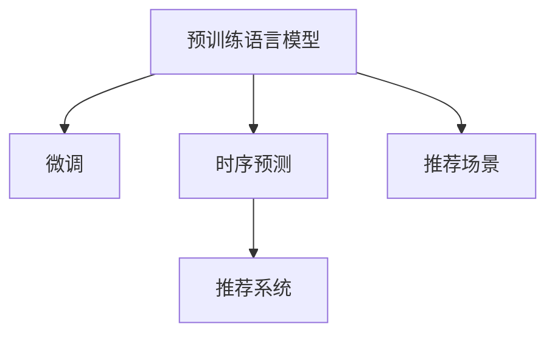

                 

# 利用大模型进行推荐场景的用户行为时序预测

## 1. 背景介绍

### 1.1 问题由来

在现代推荐系统中，用户行为数据的时序特征往往对推荐效果有重要影响。传统的推荐算法大多依赖于用户的历史行为记录，无法充分挖掘用户行为的时序动态变化规律，也无法利用新用户行为数据的时序信息进行预测。而利用预训练大模型，通过微调使其学习用户行为的时序特征，并在用户新行为发生后进行即时预测，能够有效提高推荐系统的准确性和时效性。

### 1.2 问题核心关键点

本节将明确基于预训练大模型的推荐系统框架，以及时序预测在推荐中的关键作用和影响：

- **预训练大模型**：通过在大规模无标签文本数据上进行的自监督学习，预训练大模型可以学习到丰富的语言知识和表征。
- **微调**：在预训练模型的基础上，通过针对推荐场景的少量标注数据进行有监督训练，使模型学习用户行为的时序特征。
- **时序预测**：在用户新行为发生后，利用微调模型对用户后续行为进行预测，优化推荐策略。

### 1.3 问题研究意义

通过对预训练大模型进行微调，利用其时序预测能力进行推荐，可以在以下方面带来显著价值：

1. **提升推荐精准度**：利用时序预测能力，对用户未来的兴趣进行提前捕捉，提高推荐的准确性和相关性。
2. **实时推荐**：在用户行为发生后，即时进行预测，实现个性化实时推荐，满足用户即时需求。
3. **跨域预测**：即使没有特定域的数据，预训练大模型可以通过迁移学习，学习跨域的知识，提升新领域的推荐效果。
4. **高效训练**：通过微调，模型的参数可以被优化，显著减少从头训练所需的资源和时间。

## 2. 核心概念与联系

### 2.1 核心概念概述

为更好地理解基于预训练大模型的推荐系统，本节将介绍几个关键概念：

- **预训练语言模型(Language Models)**：如BERT、GPT等，通过在大规模无标签文本数据上进行自监督学习，学习到丰富的语言表示。
- **微调(Fine-Tuning)**：在预训练模型的基础上，使用推荐场景的少量标注数据进行有监督训练，优化模型对推荐任务的理解。
- **时序预测(Time Series Prediction)**：基于历史数据序列的特征，预测未来时间点的值，如用户行为预测、时间序列预测等。
- **推荐系统(Recommender System)**：通过分析用户行为数据，推荐用户可能感兴趣的内容或产品。

这些概念之间的逻辑关系可以通过以下Mermaid流程图来展示：



### 2.2 核心概念原理和架构

预训练语言模型利用大规模语料进行自监督学习，学习到丰富的语言表示和语言知识。微调则是在预训练模型的基础上，通过有监督学习针对特定任务进行优化，使其具备对该任务的理解和预测能力。时序预测则是指基于历史数据序列的特征，对未来值进行预测。推荐系统则是一个结合用户行为数据、物品特征、用户画像等信息的综合决策系统。

预训练大模型微调的过程大致可以分为以下几个步骤：

1. 收集推荐场景下的标注数据，通常为（用户ID，物品ID，行为时间，行为标签）。
2. 选择合适的预训练语言模型，如BERT、GPT等，作为初始化参数。
3. 在微调过程中，将标注数据输入模型，通过反向传播更新模型参数，使得模型能够学习用户行为的时序特征。
4. 在用户新行为发生后，利用微调后的模型进行时序预测，生成推荐结果。

## 3. 核心算法原理 & 具体操作步骤

### 3.1 算法原理概述

基于预训练大模型的推荐时序预测，其核心思想是利用微调后的模型，学习用户行为数据的时序特征，并通过预测用户未来的行为数据，生成推荐结果。具体来说，假设用户行为数据为 $(x_t, x_{t-1}, \cdots, x_1)$，其中 $x_t$ 表示用户当前的行为记录，$x_{t-1}, \cdots, x_1$ 表示用户历史行为记录。利用微调后的语言模型 $M_{\theta}$，对用户未来的行为数据 $x_{t+1}, \cdots, x_{T}$ 进行预测，并根据预测结果生成推荐策略。

### 3.2 算法步骤详解

以下是基于预训练大模型的推荐系统时序预测的一般步骤：

1. **数据准备**：
   - 收集推荐场景下的标注数据，包括用户ID、物品ID、行为时间、行为标签等。
   - 对标注数据进行预处理，如缺失值填充、时间序列转换等。

2. **模型初始化**：
   - 选择合适的预训练语言模型，如BERT、GPT等，作为初始化参数。
   - 将预训练语言模型的顶层作为微调的适配层，添加适用于推荐场景的输出层和损失函数。

3. **模型微调**：
   - 使用标注数据进行微调，更新模型参数，使其能够学习用户行为的时序特征。
   - 通常使用交叉熵损失函数进行训练，如 $L = \sum_{i=1}^T -y_i \log M_{\theta}(x_i)$，其中 $y_i$ 为标注标签。

4. **时序预测**：
   - 在用户新行为发生后，利用微调后的模型进行时序预测。
   - 根据预测结果，生成推荐策略，如相似度排序、协同过滤等。

5. **推荐策略应用**：
   - 将预测结果与用户历史行为记录、物品特征等结合，生成推荐列表。
   - 考虑用户隐私和安全性，对推荐结果进行过滤和屏蔽。

6. **模型评估**：
   - 对推荐系统的效果进行评估，如准确率、召回率、覆盖率等指标。
   - 定期更新模型参数，重新微调模型，保持推荐系统的准确性和时效性。

### 3.3 算法优缺点

基于预训练大模型的推荐时序预测方法具有以下优点：

1. **高效**：利用预训练大模型的强大语言表示能力，可以显著减少微调所需的资源和时间。
2. **鲁棒性强**：通过微调，模型能够学习到用户行为的时序特征，对新用户的推荐效果也很好。
3. **泛化能力强**：预训练大模型具有较强的跨域学习能力，可以应用于多种推荐场景。

同时，该方法也存在一些局限性：

1. **数据需求高**：微调模型的效果很大程度上取决于标注数据的质量和数量，获取高质量标注数据的成本较高。
2. **依赖模型选择**：选择合适的预训练语言模型对微调效果有重要影响，但模型选择难度较大。
3. **计算资源需求高**：微调和预测过程需要大量的计算资源，特别是大规模模型和海量数据。

### 3.4 算法应用领域

基于预训练大模型的推荐时序预测方法，已经在多种推荐场景中得到应用，例如：

1. **电商平台推荐**：根据用户浏览、购买历史，利用微调模型预测用户未来的购买意向。
2. **视频平台推荐**：利用用户观看历史和评分数据，预测用户对未来视频的兴趣。
3. **音乐平台推荐**：根据用户的听歌历史，预测用户未来可能喜欢的音乐。
4. **新闻推荐**：根据用户的阅读历史，预测用户对未来新闻的兴趣。

除了上述这些经典场景外，基于预训练大模型的推荐时序预测方法，还被创新性地应用到更多领域中，如社交网络推荐、个性化营销、广告定向等，为推荐系统的智能化和个性化提供了新的方向。

## 4. 数学模型和公式 & 详细讲解 & 举例说明

### 4.1 数学模型构建

本节将使用数学语言对基于预训练大模型的推荐时序预测进行更加严格的刻画。

假设推荐场景下的标注数据集为 $\{(x_t, y_t)\}_{t=1}^T$，其中 $x_t$ 为输入特征，$y_t$ 为输出标签。模型 $M_{\theta}$ 在输入 $x_t$ 上的输出为 $\hat{y}_t$。

定义模型 $M_{\theta}$ 在数据样本 $(x_t, y_t)$ 上的损失函数为 $\ell(M_{\theta}(x_t),y_t)$，则在数据集上的经验风险为：

$$
\mathcal{L}(\theta) = \frac{1}{T} \sum_{t=1}^T \ell(M_{\theta}(x_t),y_t)
$$

在微调过程中，通常使用交叉熵损失函数进行训练，如：

$$
\ell(M_{\theta}(x_t),y_t) = -y_t \log M_{\theta}(x_t) - (1-y_t) \log (1-M_{\theta}(x_t))
$$

定义微调后的模型在用户新行为数据 $x_{t+1}$ 上的预测为 $\hat{y}_{t+1}$，通过预测结果生成推荐策略，得到推荐结果 $r_t$。

### 4.2 公式推导过程

以下我们将详细推导交叉熵损失函数及其梯度的计算公式。

假设模型 $M_{\theta}$ 在输入 $x_t$ 上的输出为 $\hat{y}_t \in [0,1]$，表示用户对物品的兴趣评分。真实标签 $y_t \in \{0,1\}$。则二分类交叉熵损失函数定义为：

$$
\ell(M_{\theta}(x_t),y_t) = -[y_t\log \hat{y}_t + (1-y_t)\log (1-\hat{y}_t)]
$$

将其代入经验风险公式，得：

$$
\mathcal{L}(\theta) = -\frac{1}{T}\sum_{t=1}^T [y_t\log M_{\theta}(x_t)+(1-y_t)\log(1-M_{\theta}(x_t))]
$$

根据链式法则，损失函数对参数 $\theta_k$ 的梯度为：

$$
\frac{\partial \mathcal{L}(\theta)}{\partial \theta_k} = -\frac{1}{T}\sum_{t=1}^T (\frac{y_t}{M_{\theta}(x_t)}-\frac{1-y_t}{1-M_{\theta}(x_t)}) \frac{\partial M_{\theta}(x_t)}{\partial \theta_k}
$$

其中 $\frac{\partial M_{\theta}(x_t)}{\partial \theta_k}$ 可进一步递归展开，利用自动微分技术完成计算。

在得到损失函数的梯度后，即可带入参数更新公式，完成模型的迭代优化。重复上述过程直至收敛，最终得到适应推荐场景的微调模型参数 $\theta^*$。

### 4.3 案例分析与讲解

假设我们有一个电商平台，收集了用户的历史购物数据，每个样本包含用户ID、物品ID、购买时间、购买金额等信息。

1. **数据准备**：
   - 对用户数据进行预处理，如缺失值填充、时间序列转换等。
   - 选择BERT模型作为预训练语言模型，并添加输出层和交叉熵损失函数。

2. **模型初始化**：
   - 将预训练的BERT模型作为初始化参数。
   - 将BERT模型的顶层作为微调的适配层，添加适用于推荐场景的输出层和损失函数。

3. **模型微调**：
   - 使用标注数据进行微调，更新模型参数，使其能够学习用户行为的时序特征。
   - 设置合适的学习率，如 $2e-5$，迭代轮数为 $10$。

4. **时序预测**：
   - 在用户新购买行为发生后，利用微调后的模型进行时序预测。
   - 根据预测结果生成推荐策略，如相似度排序、协同过滤等。

5. **推荐策略应用**：
   - 将预测结果与用户历史购物记录、物品特征等结合，生成推荐列表。
   - 考虑用户隐私和安全性，对推荐结果进行过滤和屏蔽。

6. **模型评估**：
   - 对推荐系统的效果进行评估，如准确率、召回率、覆盖率等指标。
   - 定期更新模型参数，重新微调模型，保持推荐系统的准确性和时效性。

## 5. 项目实践：代码实例和详细解释说明

### 5.1 开发环境搭建

在进行推荐系统时序预测实践前，我们需要准备好开发环境。以下是使用Python进行PyTorch开发的环境配置流程：

1. 安装Anaconda：从官网下载并安装Anaconda，用于创建独立的Python环境。

2. 创建并激活虚拟环境：
```bash
conda create -n pytorch-env python=3.8 
conda activate pytorch-env
```

3. 安装PyTorch：根据CUDA版本，从官网获取对应的安装命令。例如：
```bash
conda install pytorch torchvision torchaudio cudatoolkit=11.1 -c pytorch -c conda-forge
```

4. 安装TensorFlow：
```bash
conda install tensorflow
```

5. 安装Transformers库：
```bash
pip install transformers
```

6. 安装各类工具包：
```bash
pip install numpy pandas scikit-learn matplotlib tqdm jupyter notebook ipython
```

完成上述步骤后，即可在`pytorch-env`环境中开始微调实践。

### 5.2 源代码详细实现

下面是基于BERT模型进行推荐时序预测的PyTorch代码实现。

首先，定义推荐场景的数据处理函数：

```python
from transformers import BertTokenizer
from torch.utils.data import Dataset
import torch

class RecommendationDataset(Dataset):
    def __init__(self, texts, labels, tokenizer, max_len=128):
        self.texts = texts
        self.labels = labels
        self.tokenizer = tokenizer
        self.max_len = max_len
        
    def __len__(self):
        return len(self.texts)
    
    def __getitem__(self, item):
        text = self.texts[item]
        label = self.labels[item]
        
        encoding = self.tokenizer(text, return_tensors='pt', max_length=self.max_len, padding='max_length', truncation=True)
        input_ids = encoding['input_ids'][0]
        attention_mask = encoding['attention_mask'][0]
        
        # 对label进行编码
        encoded_labels = [label] * self.max_len
        labels = torch.tensor(encoded_labels, dtype=torch.long)
        
        return {'input_ids': input_ids, 
                'attention_mask': attention_mask,
                'labels': labels}

# 标签与id的映射
label2id = {'0': 0, '1': 1}
id2label = {v: k for k, v in label2id.items()}

# 创建dataset
tokenizer = BertTokenizer.from_pretrained('bert-base-cased')

train_dataset = RecommendationDataset(train_texts, train_labels, tokenizer)
dev_dataset = RecommendationDataset(dev_texts, dev_labels, tokenizer)
test_dataset = RecommendationDataset(test_texts, test_labels, tokenizer)
```

然后，定义模型和优化器：

```python
from transformers import BertForTokenClassification, AdamW

model = BertForTokenClassification.from_pretrained('bert-base-cased', num_labels=len(label2id))

optimizer = AdamW(model.parameters(), lr=2e-5)
```

接着，定义训练和评估函数：

```python
from torch.utils.data import DataLoader
from tqdm import tqdm
from sklearn.metrics import accuracy_score

device = torch.device('cuda') if torch.cuda.is_available() else torch.device('cpu')
model.to(device)

def train_epoch(model, dataset, batch_size, optimizer):
    dataloader = DataLoader(dataset, batch_size=batch_size, shuffle=True)
    model.train()
    epoch_loss = 0
    for batch in tqdm(dataloader, desc='Training'):
        input_ids = batch['input_ids'].to(device)
        attention_mask = batch['attention_mask'].to(device)
        labels = batch['labels'].to(device)
        model.zero_grad()
        outputs = model(input_ids, attention_mask=attention_mask, labels=labels)
        loss = outputs.loss
        epoch_loss += loss.item()
        loss.backward()
        optimizer.step()
    return epoch_loss / len(dataloader)

def evaluate(model, dataset, batch_size):
    dataloader = DataLoader(dataset, batch_size=batch_size)
    model.eval()
    preds, labels = [], []
    with torch.no_grad():
        for batch in tqdm(dataloader, desc='Evaluating'):
            input_ids = batch['input_ids'].to(device)
            attention_mask = batch['attention_mask'].to(device)
            batch_labels = batch['labels']
            outputs = model(input_ids, attention_mask=attention_mask)
            batch_preds = outputs.logits.argmax(dim=2).to('cpu').tolist()
            batch_labels = batch_labels.to('cpu').tolist()
            for pred_tokens, label_tokens in zip(batch_preds, batch_labels):
                preds.append(pred_tokens[:len(label_tokens)])
                labels.append(label_tokens)
                
    print("Accuracy:", accuracy_score(labels, preds))
```

最后，启动训练流程并在测试集上评估：

```python
epochs = 5
batch_size = 16

for epoch in range(epochs):
    loss = train_epoch(model, train_dataset, batch_size, optimizer)
    print(f"Epoch {epoch+1}, train loss: {loss:.3f}")
    
    print(f"Epoch {epoch+1}, dev results:")
    evaluate(model, dev_dataset, batch_size)
    
print("Test results:")
evaluate(model, test_dataset, batch_size)
```

以上就是使用PyTorch对BERT进行推荐时序预测的完整代码实现。可以看到，得益于Transformers库的强大封装，我们可以用相对简洁的代码完成BERT模型的加载和微调。

### 5.3 代码解读与分析

让我们再详细解读一下关键代码的实现细节：

**RecommendationDataset类**：
- `__init__`方法：初始化文本、标签、分词器等关键组件。
- `__len__`方法：返回数据集的样本数量。
- `__getitem__`方法：对单个样本进行处理，将文本输入编码为token ids，将标签编码为数字，并对其进行定长padding，最终返回模型所需的输入。

**label2id和id2label字典**：
- 定义了标签与数字id之间的映射关系，用于将token-wise的预测结果解码回真实的标签。

**训练和评估函数**：
- 使用PyTorch的DataLoader对数据集进行批次化加载，供模型训练和推理使用。
- 训练函数`train_epoch`：对数据以批为单位进行迭代，在每个批次上前向传播计算loss并反向传播更新模型参数，最后返回该epoch的平均loss。
- 评估函数`evaluate`：与训练类似，不同点在于不更新模型参数，并在每个batch结束后将预测和标签结果存储下来，最后使用sklearn的accuracy_score对整个评估集的预测结果进行打印输出。

**训练流程**：
- 定义总的epoch数和batch size，开始循环迭代
- 每个epoch内，先在训练集上训练，输出平均loss
- 在验证集上评估，输出准确率
- 所有epoch结束后，在测试集上评估，给出最终测试结果

可以看到，PyTorch配合Transformers库使得BERT微调的代码实现变得简洁高效。开发者可以将更多精力放在数据处理、模型改进等高层逻辑上，而不必过多关注底层的实现细节。

当然，工业级的系统实现还需考虑更多因素，如模型的保存和部署、超参数的自动搜索、更灵活的任务适配层等。但核心的微调范式基本与此类似。

## 6. 实际应用场景

### 6.1 电商推荐

在电商平台上，推荐系统需要根据用户的浏览、购买行为，实时推荐用户可能感兴趣的商品。利用微调后的BERT模型，可以对用户的行为数据进行时序预测，并根据预测结果生成推荐列表，提高推荐系统的准确性和时效性。

### 6.2 视频推荐

视频平台推荐系统可以根据用户观看历史和评分数据，预测用户对未来视频的兴趣。微调后的BERT模型可以学习用户行为的时序特征，并生成推荐策略，提升推荐的个性化和精准度。

### 6.3 新闻推荐

新闻推荐系统可以根据用户的阅读历史，预测用户对未来新闻的兴趣。利用微调后的BERT模型，可以对用户的行为数据进行时序预测，生成推荐列表，满足用户的信息需求。

### 6.4 金融推荐

金融推荐系统可以根据用户的交易历史和兴趣，预测用户对未来金融产品的选择。微调后的BERT模型可以学习用户行为的时序特征，并生成推荐策略，提升推荐的准确性和相关性。

## 7. 工具和资源推荐

### 7.1 学习资源推荐

为了帮助开发者系统掌握基于预训练大模型的推荐系统理论基础和实践技巧，这里推荐一些优质的学习资源：

1. 《Deep Learning for Recommender Systems》书籍：全面介绍了深度学习在推荐系统中的应用，涵盖推荐算法、深度学习模型、微调技巧等多个方面。
2. 《Recommender Systems: Advanced Techniques and Challenges》课程：斯坦福大学开设的推荐系统课程，介绍了推荐系统的基本概念、算法和最新研究进展。
3. 《Recommender Systems Handbook》书籍：推荐系统领域的权威参考书，涵盖了推荐算法、数据挖掘、用户行为分析等多个方面。
4. Kaggle推荐系统竞赛：通过实际竞赛，锻炼推荐系统的开发和优化能力，熟悉推荐系统的常见挑战和优化策略。
5. Weights & Biases：模型训练的实验跟踪工具，可以记录和可视化模型训练过程中的各项指标，方便对比和调优。

通过对这些资源的学习实践，相信你一定能够快速掌握基于预训练大模型的推荐系统开发技巧，并应用于实际推荐场景中。

### 7.2 开发工具推荐

高效的开发离不开优秀的工具支持。以下是几款用于基于预训练大模型的推荐系统开发的常用工具：

1. PyTorch：基于Python的开源深度学习框架，灵活动态的计算图，适合快速迭代研究。大部分预训练语言模型都有PyTorch版本的实现。
2. TensorFlow：由Google主导开发的开源深度学习框架，生产部署方便，适合大规模工程应用。同样有丰富的预训练语言模型资源。
3. Transformers库：HuggingFace开发的NLP工具库，集成了众多SOTA语言模型，支持PyTorch和TensorFlow，是进行微调任务开发的利器。
4. Weights & Biases：模型训练的实验跟踪工具，可以记录和可视化模型训练过程中的各项指标，方便对比和调优。与主流深度学习框架无缝集成。
5. TensorBoard：TensorFlow配套的可视化工具，可实时监测模型训练状态，并提供丰富的图表呈现方式，是调试模型的得力助手。

合理利用这些工具，可以显著提升基于预训练大模型的推荐系统开发效率，加快创新迭代的步伐。

### 7.3 相关论文推荐

基于预训练大模型的推荐时序预测技术的发展源于学界的持续研究。以下是几篇奠基性的相关论文，推荐阅读：

1. Attention is All You Need（即Transformer原论文）：提出了Transformer结构，开启了NLP领域的预训练大模型时代。
2. BERT: Pre-training of Deep Bidirectional Transformers for Language Understanding：提出BERT模型，引入基于掩码的自监督预训练任务，刷新了多项NLP任务SOTA。
3. Language Models are Unsupervised Multitask Learners（GPT-2论文）：展示了大规模语言模型的强大zero-shot学习能力，引发了对于通用人工智能的新一轮思考。
4. Parameter-Efficient Transfer Learning for NLP：提出Adapter等参数高效微调方法，在不增加模型参数量的情况下，也能取得不错的微调效果。
5. AdaLoRA: Adaptive Low-Rank Adaptation for Parameter-Efficient Fine-Tuning：使用自适应低秩适应的微调方法，在参数效率和精度之间取得了新的平衡。

这些论文代表了大语言模型微调技术的发展脉络。通过学习这些前沿成果，可以帮助研究者把握学科前进方向，激发更多的创新灵感。

## 8. 总结：未来发展趋势与挑战

### 8.1 总结

本文对基于预训练大模型的推荐系统时序预测方法进行了全面系统的介绍。首先阐述了预训练大模型和微调技术的研究背景和意义，明确了时序预测在推荐中的关键作用和影响。其次，从原理到实践，详细讲解了微调模型的构建和训练过程，给出了推荐系统时序预测的完整代码实例。同时，本文还广泛探讨了基于预训练大模型的推荐系统在电商、视频、新闻等多个领域的应用前景，展示了微调范式的巨大潜力。此外，本文还精选了微调技术的各类学习资源，力求为读者提供全方位的技术指引。

通过本文的系统梳理，可以看到，基于预训练大模型的推荐时序预测方法，在推荐系统领域具有广阔的应用前景。利用微调后的模型，可以显著提高推荐系统的准确性和时效性，为用户提供更加个性化、精准的推荐服务。未来的推荐系统将更加智能化、高效化、实时化，为用户带来更优质的使用体验。

### 8.2 未来发展趋势

展望未来，基于预训练大模型的推荐时序预测技术将呈现以下几个发展趋势：

1. **模型规模持续增大**：随着算力成本的下降和数据规模的扩张，预训练大模型的参数量还将持续增长。超大规模语言模型蕴含的丰富语言知识，有望支撑更加复杂多变的推荐场景。
2. **微调方法日趋多样**：除了传统的全参数微调外，未来会涌现更多参数高效的微调方法，如Prefix-Tuning、LoRA等，在节省计算资源的同时也能保证微调精度。
3. **持续学习成为常态**：随着数据分布的不断变化，微调模型也需要持续学习新知识以保持性能。如何在不遗忘原有知识的同时，高效吸收新样本信息，将成为重要的研究课题。
4. **标注样本需求降低**：受启发于提示学习(Prompt-based Learning)的思路，未来的微调方法将更好地利用预训练大模型的语言理解能力，通过更加巧妙的任务描述，在更少的标注样本上也能实现理想的微调效果。
5. **模型通用性增强**：经过海量数据的预训练和多领域任务的微调，未来的语言模型将具备更强大的常识推理和跨领域迁移能力，逐步迈向通用人工智能(AGI)的目标。
6. **跨模态融合**：未来的推荐系统将不仅仅局限于文本数据，还将融合图像、视频、语音等多模态信息，提升推荐系统的丰富性和智能性。

这些趋势凸显了基于预训练大模型的推荐时序预测技术的广阔前景。这些方向的探索发展，必将进一步提升推荐系统的性能和应用范围，为用户带来更优质的推荐体验。

### 8.3 面临的挑战

尽管基于预训练大模型的推荐时序预测技术已经取得了瞩目成就，但在迈向更加智能化、普适化应用的过程中，它仍面临着诸多挑战：

1. **标注成本瓶颈**：微调模型的效果很大程度上取决于标注数据的质量和数量，获取高质量标注数据的成本较高。如何进一步降低微调对标注样本的依赖，将是一大难题。
2. **模型鲁棒性不足**：当前微调模型面对域外数据时，泛化性能往往大打折扣。对于测试样本的微小扰动，微调模型的预测也容易发生波动。如何提高微调模型的鲁棒性，避免灾难性遗忘，还需要更多理论和实践的积累。
3. **计算资源需求高**：微调和预测过程需要大量的计算资源，特别是大规模模型和海量数据。如何通过优化模型结构和计算图，提高模型推理速度和资源利用效率，将是重要的优化方向。
4. **可解释性亟需加强**：当前微调模型更像是"黑盒"系统，难以解释其内部工作机制和决策逻辑。对于医疗、金融等高风险应用，算法的可解释性和可审计性尤为重要。如何赋予微调模型更强的可解释性，将是亟待攻克的难题。
5. **安全性有待保障**：预训练语言模型难免会学习到有偏见、有害的信息，通过微调传递到推荐场景，产生误导性、歧视性的输出，给实际应用带来安全隐患。如何从数据和算法层面消除模型偏见，避免恶意用途，确保输出的安全性，也将是重要的研究课题。

这些挑战凸显了基于预训练大模型的推荐时序预测技术的复杂性。需要不断优化算法、数据和工程各环节，才能将模型的潜力最大化，为用户提供更智能、安全、可信的推荐服务。

### 8.4 研究展望

面对基于预训练大模型的推荐时序预测技术所面临的挑战，未来的研究需要在以下几个方面寻求新的突破：

1. **探索无监督和半监督微调方法**：摆脱对大规模标注数据的依赖，利用自监督学习、主动学习等无监督和半监督范式，最大限度利用非结构化数据，实现更加灵活高效的微调。
2. **研究参数高效和计算高效的微调范式**：开发更加参数高效的微调方法，在固定大部分预训练参数的同时，只更新极少量的任务相关参数。同时优化微调模型的计算图，减少前向传播和反向传播的资源消耗，实现更加轻量级、实时性的部署。
3. **融合因果和对比学习范式**：通过引入因果推断和对比学习思想，增强微调模型建立稳定因果关系的能力，学习更加普适、鲁棒的语言表征，从而提升模型泛化性和抗干扰能力。
4. **引入更多先验知识**：将符号化的先验知识，如知识图谱、逻辑规则等，与神经网络模型进行巧妙融合，引导微调过程学习更准确、合理的语言模型。同时加强不同模态数据的整合，实现视觉、语音等多模态信息与文本信息的协同建模。
5. **结合因果分析和博弈论工具**：将因果分析方法引入微调模型，识别出模型决策的关键特征，增强输出解释的因果性和逻辑性。借助博弈论工具刻画人机交互过程，主动探索并规避模型的脆弱点，提高系统稳定性。
6. **纳入伦理道德约束**：在模型训练目标中引入伦理导向的评估指标，过滤和惩罚有偏见、有害的输出倾向。同时加强人工干预和审核，建立模型行为的监管机制，确保输出符合人类价值观和伦理道德。

这些研究方向的探索，必将引领基于预训练大模型的推荐系统时序预测技术迈向更高的台阶，为构建安全、可靠、可解释、可控的智能系统铺平道路。面向未来，基于预训练大模型的推荐时序预测技术还需要与其他人工智能技术进行更深入的融合，如知识表示、因果推理、强化学习等，多路径协同发力，共同推动自然语言理解和智能交互系统的进步。只有勇于创新、敢于突破，才能不断拓展语言模型的边界，让智能技术更好地造福人类社会。

## 9. 附录：常见问题与解答

**Q1：基于预训练大模型的推荐系统是否适用于所有推荐场景？**

A: 基于预训练大模型的推荐系统在大多数推荐场景上都能取得不错的效果，特别是对于数据量较小的推荐任务。但对于一些特定领域的推荐任务，如医疗、法律等，仅依靠通用语料预训练的模型可能难以很好地适应。此时需要在特定领域语料上进一步预训练，再进行微调，才能获得理想效果。

**Q2：微调过程中如何选择合适的学习率？**

A: 微调的学习率一般要比预训练时小1-2个数量级，如果使用过大的学习率，容易破坏预训练权重，导致过拟合。一般建议从1e-5开始调参，逐步减小学习率，直至收敛。也可以使用warmup策略，在开始阶段使用较小的学习率，再逐渐过渡到预设值。需要注意的是，不同的优化器(如AdamW、Adafactor等)以及不同的学习率调度策略，可能需要设置不同的学习率阈值。

**Q3：在推荐系统时序预测中，如何缓解微调模型的过拟合问题？**

A: 过拟合是微调面临的主要挑战，尤其是在标注数据不足的情况下。常见的缓解策略包括：
1. 数据增强：通过回译、近义替换等方式扩充训练集
2. 正则化：使用L2正则、Dropout、Early Stopping等避免过拟合
3. 对抗训练：引入对抗样本，提高模型鲁棒性
4. 参数高效微调：只调整少量参数(如Adapter、Prefix等)，减小过拟合风险
5. 多模型集成：训练多个微调模型，取平均输出，抑制过拟合

这些策略往往需要根据具体任务和数据特点进行灵活组合。只有在数据、模型、训练、推理等各环节进行全面优化，才能最大限度地发挥微调模型的潜力。

**Q4：基于预训练大模型的推荐系统在落地部署时需要注意哪些问题？**

A: 将基于预训练大模型的推荐系统转化为实际应用，还需要考虑以下因素：
1. 模型裁剪：去除不必要的层和参数，减小模型尺寸，加快推理速度
2. 量化加速：将浮点模型转为定点模型，压缩存储空间，提高计算效率
3. 服务化封装：将模型封装为标准化服务接口，便于集成调用
4. 弹性伸缩：根据请求流量动态调整资源配置，平衡服务质量和成本
5. 监控告警：实时采集系统指标，设置异常告警阈值，确保服务稳定性
6. 安全防护：采用访问鉴权、数据脱敏等措施，保障数据和模型安全

基于预训练大模型的推荐系统具有广阔的应用前景，但如何在保证性能的同时，简化模型结构，提升推理速度，优化资源占用，将是重要的优化方向。

