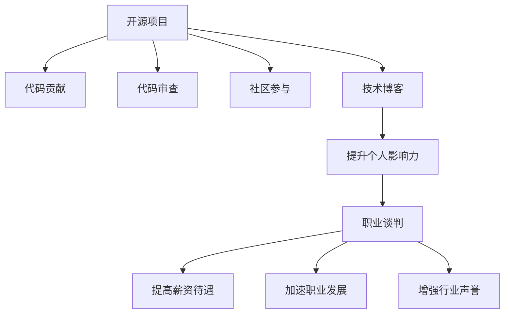

                 

# 利用开源影响力进行职业谈判

## 1. 背景介绍

### 1.1 问题由来
在当今技术驱动的职场中，开源项目已经成为展示技术实力、扩大职业影响力、获取更好职业机会的重要渠道。无论是对求职者还是在职者，开源项目的贡献都被视为衡量其技术水平和团队合作能力的直接指标。因此，如何利用开源项目的影响力进行职业谈判，成为了技术人才普遍关心的问题。

### 1.2 问题核心关键点
开源影响力在进行职业谈判中的作用主要体现在以下几个方面：

- **技术能力的展示**：开源项目能够直接体现个人在特定技术栈或领域的掌握程度，是验证其技术实力的重要依据。
- **社区认可度**：在开源社区的活跃度、贡献量、受关注的项目等都能反映个人的技术能力和专业声誉。
- **职位竞争力**：越来越多的雇主看重候选人在开源项目中的贡献，将其作为选择人才的重要参考。
- **网络拓展**：开源项目使个人有机会与全球技术爱好者和专家互动，建立广泛的职业网络。

### 1.3 问题研究意义
研究如何利用开源影响力进行职业谈判，对于技术人才的职业发展和提升个人竞争力具有重要意义：

1. **提高求职成功率**：在求职过程中，展示自己在开源项目中的贡献能够显著提高获得理想职位的机会。
2. **提升薪资水平**：在谈判薪资时，开源影响力可以作为自身价值的证明，从而获得更高的薪资待遇。
3. **促进职业发展**：开源项目的积累能够帮助个人在职业道路上获得更多认可和机会，加速职业成长。
4. **增强行业影响力**：开源贡献者的影响力通常会得到同行和公司的重视，有助于建立良好的行业声誉。

## 2. 核心概念与联系

### 2.1 核心概念概述

为了更好地理解如何利用开源影响力进行职业谈判，本节将介绍几个密切相关的核心概念：

- **开源项目**：指通过互联网共享源代码的软件项目，开发者可以自由地复制、修改和分享代码。
- **代码贡献**：指开发者在开源项目中提交代码、修复bug、添加功能等活动。
- **代码审查**：指其他开发者对代码贡献进行审核和反馈，以确保代码质量和项目一致性。
- **社区参与**：指开发者在开源项目中积极参与讨论、组织会议、贡献文档等，提升社区活跃度。
- **技术博客**：指开发者分享技术经验、项目进展、个人思考等内容的博客或文章。

这些核心概念之间的逻辑关系可以通过以下Mermaid流程图来展示：



这个流程图展示了我个人利用开源项目进行职业谈判的一般流程：

1. 参与开源项目，通过代码贡献提升技术能力。
2. 参与代码审查和社区讨论，扩大个人影响力。
3. 通过技术博客分享经验和成果，进一步提升影响力。
4. 利用开源影响力，在职业谈判中获得更高的薪资待遇、加速职业发展和增强行业声誉。

## 3. 核心算法原理 & 具体操作步骤
### 3.1 算法原理概述

利用开源影响力进行职业谈判，本质上是一种基于社交网络理论的策略，通过在开源社区的积极参与和贡献，构建和维护个人在技术领域的品牌和影响力，从而在职业谈判中占据优势地位。其核心思想是：

- **积累技术实力**：通过参与和贡献开源项目，不断学习和实践，提升自身在特定技术栈或领域的专业能力。
- **建立社交网络**：在开源社区中积极互动，扩大人脉圈，与业内专家、同行建立良好关系。
- **展示项目成果**：通过技术博客、GitHub Repo页面等方式，展示个人在开源项目中的贡献和成就。
- **谈判技巧**：在职业谈判中，以开源影响力为依据，展示个人实力，赢得更好的职位和薪酬待遇。

### 3.2 算法步骤详解

利用开源影响力进行职业谈判一般包括以下几个关键步骤：

**Step 1: 选择开源项目**
- 根据自身技术栈和兴趣选择适合的开源项目。可以参考GitHub的Trending Repo、参与讨论、查看issue等，了解项目的活跃度和需求。

**Step 2: 参与项目贡献**
- 注册GitHub账号，通过Fork、Create Pull Request等方式，对项目进行代码贡献。
- 贡献代码时，遵循项目的代码规范，尽量解决实际问题，提升代码质量和可维护性。
- 积极参与项目讨论，解决他人提出的issue，帮助项目维护和优化。

**Step 3: 进行代码审查**
- 学习代码审查技巧，通过评论和建议，帮助改进代码质量和项目设计。
- 审查代码时，注重代码风格、性能优化、安全防护等方面，提升项目整体质量。
- 通过参与代码审查，建立自己的代码审查声誉，吸引更多项目关注。

**Step 4: 社区参与互动**
- 加入开源项目的Slack或Discord频道，积极参与项目讨论和技术交流。
- 在社区中发表技术观点，分享学习心得，提升个人在社区中的活跃度和影响力。
- 组织或参与社区活动，如技术讲座、代码评审会议等，增强社区互动。

**Step 5: 展示项目成果**
- 通过GitHub Repo页面、个人技术博客等渠道，展示自己在开源项目中的贡献和成果。
- 撰写技术博客，详细介绍项目背景、技术实现、解决的问题等，提升个人品牌知名度。
- 在LinkedIn、GitHub Profiles等社交平台上，展示个人开源贡献，吸引雇主的关注。

**Step 6: 职业谈判策略**
- 在职业谈判中，以个人在开源项目中的贡献和影响力为依据，展示自身实力和价值。
- 提供GitHub Repo链接、技术博客链接等证明材料，增加说服力。
- 强调个人在开源项目中的领导力和社区影响力，争取更好的职位和薪酬待遇。

### 3.3 算法优缺点

利用开源影响力进行职业谈判具有以下优点：

1. **透明客观**：开源贡献在GitHub等平台上公开可查，为职业谈判提供了客观依据。
2. **技术实力证明**：通过开源贡献展示个人技术能力，更容易获得雇主认可。
3. **社区认可度**：开源项目和贡献在社区中具有较高认可度，能够提升个人声誉。
4. **持续积累**：开源贡献是一个长期积累的过程，可以不断提升个人职业影响力。

同时，该方法也存在以下局限性：

1. **时间和精力投入**：开源项目需要投入大量时间和精力，尤其是初期建立影响力阶段。
2. **技术栈限制**：开源项目的选择受限于个人的技术栈和兴趣，可能需要跨领域学习和实践。
3. **项目不稳定**：开源项目存在一定的失败风险，一些项目可能逐渐失去活跃度。
4. **维护难度**：开源贡献需要长期维护和更新，可能面临代码质量下滑的风险。

尽管存在这些局限性，但利用开源影响力进行职业谈判已经成为越来越多技术人才的选择，其透明性、客观性和持续积累的潜力，使其成为提升职业竞争力的重要手段。

### 3.4 算法应用领域

利用开源影响力进行职业谈判的应用领域非常广泛，包括但不限于：

- **软件开发工程师**：通过参与开源项目和贡献代码，展示自身编程能力和团队合作精神，提升职业竞争力和薪资待遇。
- **数据科学家**：通过开源数据集和算法项目，展示数据分析和机器学习技能，吸引数据科学职位。
- **安全工程师**：通过开源漏洞报告和修复，展示安全防护能力，增强雇主的安全信心。
- **产品经理**：通过开源项目的用户反馈和需求改进，展示产品设计和管理能力，提升项目管理经验。
- **设计工程师**：通过开源UI/UX项目，展示设计能力和用户研究经验，吸引UI/UX职位。

除了这些具体岗位，开源影响力还可以用于其他职业谈判场景，如学术职位、自由职业者、技术顾问等，帮助在相关领域提升个人影响力。

## 4. 数学模型和公式 & 详细讲解 & 举例说明

为了更好地理解利用开源影响力进行职业谈判的数学模型，本节将通过一个简化的线性回归模型来解释其基本原理。

设个人在开源项目中的贡献度为 $X$，在职业谈判中获得的薪资待遇为 $Y$，忽略其他因素的影响，可以得到如下线性回归模型：

$$
Y = \beta_0 + \beta_1X + \epsilon
$$

其中，$\beta_0$ 为截距，$\beta_1$ 为开源贡献对薪资的影响系数，$\epsilon$ 为随机误差项。通过最小二乘法求解，可以得到最优的 $\beta_0$ 和 $\beta_1$，从而估计开源贡献对薪资的平均影响。

## 5. 项目实践：代码实例和详细解释说明
### 5.1 开发环境搭建

在进行开源贡献实践前，我们需要准备好开发环境。以下是使用Python进行GitHub开发的配置流程：

1. 安装Git：从官网下载并安装Git，用于版本控制和项目管理。

2. 创建GitHub账号：访问GitHub官网，注册个人账号。

3. Fork开源项目：选择感兴趣的开源项目，进行Fork操作，将项目复制到自己的GitHub账号下。

4. 克隆本地仓库：在本地机器上克隆Fork后的仓库，进入项目目录。

5. 配置环境：安装项目所需的Python库和依赖包，如pip install requests beautifulsoup4等。

### 5.2 源代码详细实现

下面以参与开源数据集清洗项目为例，给出使用Python进行GitHub贡献的代码实现。

首先，定义数据清洗函数：

```python
from bs4 import BeautifulSoup
import requests

def clean_data(url):
    response = requests.get(url)
    soup = BeautifulSoup(response.text, 'html.parser')
    table = soup.find('table')
    data = []
    for row in table.find_all('tr'):
        cols = row.find_all('td')
        row_data = [col.text.strip() for col in cols]
        data.append(row_data)
    return data
```

然后，进行代码贡献：

1. 提交Fork到本地仓库。

2. 在本地修改代码，提交代码贡献。

3. 创建Pull Request。

```python
# 在本地修改代码
# ...

# 提交代码贡献
# git add .
# git commit -m "Add data cleaning logic"

# 推送到GitHub
# git push origin master

# 创建Pull Request
# 在GitHub上选择Fork项目，点击Compare & pull request
```

接着，进行代码审查和社区互动：

1. 在GitHub上查看Pull Request，进行代码审查和评论。

2. 在项目评论区发表技术观点，分享学习心得，参与讨论。

3. 组织或参与社区活动，如技术讲座、代码评审会议等。

最后，展示项目成果：

1. 在GitHub Repo页面和项目主页展示代码贡献和项目进展。

2. 撰写技术博客，详细介绍项目背景、技术实现、解决的问题等。

3. 在LinkedIn、GitHub Profiles等社交平台上，展示个人开源贡献。

### 5.3 代码解读与分析

让我们再详细解读一下关键代码的实现细节：

**clean_data函数**：
- 使用BeautifulSoup库解析网页内容，提取表格数据。
- 通过列表推导式和strip方法，清洗数据，返回 cleaned_data。

**代码贡献流程**：
- 通过git add和git commit，将本地代码提交到本地仓库。
- 通过git push，将代码推送到GitHub。
- 在GitHub上创建Pull Request，请求合并代码。
- 在Pull Request中，接受或合并代码，完成贡献流程。

**代码审查和社区互动**：
- 在GitHub上查看Pull Request，阅读代码和注释，提供反馈。
- 在评论框中输入评论，建议改进意见，帮助提升代码质量。
- 在项目评论区发表技术观点，分享学习心得，参与讨论。
- 组织或参与社区活动，如技术讲座、代码评审会议等。

**项目成果展示**：
- 在GitHub Repo页面和项目主页展示代码贡献和项目进展。
- 撰写技术博客，详细介绍项目背景、技术实现、解决的问题等。
- 在LinkedIn、GitHub Profiles等社交平台上，展示个人开源贡献，吸引雇主的关注。

通过上述代码实现，展示了利用开源影响力进行职业谈判的完整流程，从代码贡献到项目展示，每一步骤都至关重要。开发者可以将更多精力放在技术实现和社区互动上，而不必过多关注底层的实现细节。

## 6. 实际应用场景

### 6.1 软件开发工程师

软件开发工程师可以利用开源项目提升技术能力和职业影响力，在求职和职业谈判中获得优势。具体而言：

- **提升技术能力**：参与开源项目，学习新技术和最佳实践，提升自身编程能力和团队合作精神。
- **增加项目经验**：贡献代码和修复bug，积累项目经验，增强简历亮点。
- **展示成果**：通过GitHub Repo页面和技术博客，展示项目成果和代码贡献，吸引雇主注意。
- **建立人脉**：积极参与开源社区讨论和活动，结识同行和专家，拓展职业网络。

### 6.2 数据科学家

数据科学家可以通过开源数据集和算法项目，展示数据分析和机器学习技能，获取更好的数据科学职位。具体而言：

- **探索数据集**：参与开源数据集项目，学习数据分析和处理技能，提升数据理解能力。
- **实现算法**：实现和优化机器学习算法，提升模型性能和可解释性。
- **展示成果**：通过GitHub Repo页面和技术博客，展示算法实现和分析结果，吸引雇主注意。
- **建立社区**：参与开源社区讨论和技术讲座，建立数据科学专业人脉，提升影响力。

### 6.3 安全工程师

安全工程师可以通过开源漏洞报告和修复，展示安全防护能力，增强雇主的安全信心。具体而言：

- **识别漏洞**：参与开源项目，识别和报告安全漏洞，提升安全防护意识和技能。
- **修复漏洞**：通过贡献代码，修复漏洞，提升项目安全性。
- **展示成果**：通过GitHub Repo页面和技术博客，展示漏洞报告和修复成果，吸引雇主注意。
- **建立信任**：在开源社区中积极参与讨论和反馈，建立安全专家声誉，增强信任度。

## 7. 工具和资源推荐

### 7.1 学习资源推荐

为了帮助开发者系统掌握开源贡献的原理和实践技巧，这里推荐一些优质的学习资源：

1. **《开源贡献指南》**：由知名开源组织提供，详细介绍了开源贡献的流程、技巧和最佳实践。

2. **《GitHub开发入门》**：GitHub官方提供的免费课程，涵盖GitHub的各个功能，帮助开发者快速上手。

3. **《Python数据科学手册》**：详细介绍了Python在数据科学中的应用，包括数据清洗、算法实现等，是开源贡献的重要工具。

4. **《代码审查实践》**：讲解代码审查技巧和最佳实践，提升代码审查效率和质量。

5. **《开源社区参与指南》**：介绍如何在开源社区中建立影响力，参与讨论和技术交流。

通过这些资源的学习实践，相信你一定能够快速掌握开源贡献的精髓，并用于解决实际的开发问题。

### 7.2 开发工具推荐

高效的开发离不开优秀的工具支持。以下是几款用于开源贡献开发的常用工具：

1. **Git**：版本控制系统，用于管理代码的提交、合并和版本追踪。

2. **GitHub**：代码托管平台，提供代码审查、项目管理、社区互动等功能。

3. **GitLab**：类似于GitHub的代码托管平台，支持持续集成、流水线等高级功能。

4. **JIRA**：项目管理工具，用于任务分配、进度跟踪和问题管理。

5. **GitHub Actions**：GitHub提供的持续集成服务，支持自动化测试、部署等。

6. **GitHub Pages**：GitHub提供的静态网页托管服务，用于发布技术博客和项目文档。

合理利用这些工具，可以显著提升开源贡献的开发效率，加快创新迭代的步伐。

### 7.3 相关论文推荐

开源贡献和职业谈判的研究源于学界的持续研究。以下是几篇奠基性的相关论文，推荐阅读：

1. **《开源贡献的社会影响》**：研究开源贡献对个人职业发展的影响，揭示开源社区的重要性。

2. **《开源项目的组织与治理》**：探讨开源项目的组织结构和治理模式，提升项目的协作效率。

3. **《数据科学家的开源贡献策略》**：分析数据科学家在开源项目中的贡献模式和影响因素。

4. **《开源项目中的代码审查与反馈机制》**：研究代码审查的流程和效果，提升代码质量。

5. **《开源社区中的信任与声誉》**：探讨开源社区中的信任机制和声誉建立，增强社区互动。

这些论文代表了大语言模型微调技术的发展脉络。通过学习这些前沿成果，可以帮助研究者把握学科前进方向，激发更多的创新灵感。

## 8. 总结：未来发展趋势与挑战

### 8.1 总结

本文对利用开源影响力进行职业谈判方法进行了全面系统的介绍。首先阐述了开源项目和贡献在职业谈判中的重要作用，明确了开源贡献在展示技术实力、建立社交网络和提升职业竞争力方面的独特价值。其次，从原理到实践，详细讲解了开源贡献的数学模型和具体步骤，给出了开源贡献任务开发的完整代码实例。同时，本文还广泛探讨了开源贡献在软件开发、数据科学、安全防护等众多领域的应用前景，展示了开源贡献的广泛潜力。此外，本文精选了开源贡献技术的各类学习资源，力求为读者提供全方位的技术指引。

通过本文的系统梳理，可以看到，利用开源影响力进行职业谈判已经成为越来越多技术人才的选择，其透明性、客观性和持续积累的潜力，使其成为提升职业竞争力的重要手段。未来，伴随开源社区的不断发展和壮大，开源贡献将在技术人才的职业发展中扮演更加重要的角色。

### 8.2 未来发展趋势

展望未来，开源贡献和职业谈判技术将呈现以下几个发展趋势：

1. **社区生态完善**：开源社区将进一步完善生态系统，提供更多的资源、工具和机会，帮助开发者更好地参与贡献。
2. **技术栈扩展**：开源贡献将突破单一技术栈的限制，跨领域、跨学科的合作将更为紧密。
3. **贡献形式多样化**：除了代码贡献，还将有更多形式的贡献，如技术博客、技术演讲、开源教育等，提升个人品牌。
4. **影响力多维度**：开源贡献的影响力将不再局限于技术领域，还将涉及社会责任、公益项目等方面，提升个人社会影响力。
5. **职业谈判多元化**：开源贡献将不仅用于求职和薪资谈判，还将用于职业转型、创业融资等场景，拓展职业发展路径。

以上趋势凸显了开源贡献和职业谈判技术的广阔前景。这些方向的探索发展，必将进一步提升技术人才的职业竞争力，为技术行业的发展注入新的动力。

### 8.3 面临的挑战

尽管开源贡献和职业谈判技术已经取得了显著进展，但在迈向更加智能化、普适化应用的过程中，它仍面临着诸多挑战：

1. **时间和精力投入**：开源贡献需要大量时间和精力，尤其是初期建立影响力阶段。如何在工作和生活之间找到平衡，是重要的问题。
2. **技术栈限制**：开源项目的选择受限于个人的技术栈和兴趣，可能需要跨领域学习和实践。如何突破技术瓶颈，拓展技术边界，是关键挑战。
3. **社区活跃度**：一些开源项目可能逐渐失去活跃度，难以持续贡献。如何挑选活跃的开源项目，保持长期贡献，是重要的策略问题。
4. **代码质量维护**：开源贡献需要长期维护和更新，可能面临代码质量下滑的风险。如何保证代码质量和项目一致性，是重要的技术问题。

尽管存在这些挑战，但开源贡献和职业谈判技术的不断进步，使其成为技术人才展示技术和积累影响力的重要途径。面对这些挑战，开发者需要通过不断学习和实践，寻找解决方案，提升贡献质量，拓展贡献形式，增强社区互动，从而在开源领域取得更大的成就。

### 8.4 研究展望

面向未来，开源贡献和职业谈判技术需要在以下几个方面进行深入研究：

1. **贡献策略优化**：研究如何制定更加高效的贡献策略，提升贡献质量和影响力。
2. **社区互动机制**：研究如何构建和维护开源社区的互动机制，增强社区粘性和活跃度。
3. **多维度影响力提升**：研究如何在开源贡献中融入更多社会责任和公益项目，提升个人社会影响力。
4. **跨领域合作**：研究如何突破技术栈限制，跨领域、跨学科地进行开源贡献，拓展技术边界。
5. **自动化工具开发**：研究如何开发和应用自动化工具，提高开源贡献的效率和质量。

这些研究方向将引领开源贡献和职业谈判技术的进一步发展，为技术人才的职业发展提供更广阔的空间。总之，开源贡献和职业谈判技术需要在社区建设、技术实践、社会责任等多个维度协同发力，才能真正实现其潜力，推动技术行业的持续进步。

## 9. 附录：常见问题与解答

**Q1：开源项目如何选择？**

A: 选择开源项目时，可以从以下几个方面考虑：
1. 兴趣和技术栈：选择与自己技术栈和兴趣相关的项目，能够提升学习效果和贡献质量。
2. 项目活跃度和需求：选择活跃度较高、需求较多的项目，确保贡献有意义。
3. 社区规模和影响力：选择社区规模较大、影响力较高的项目，提升个人曝光度。
4. 项目类型和目标：选择目标明确、需求清晰的项目，有助于积累项目经验。

**Q2：如何提升代码贡献质量？**

A: 提升代码贡献质量的关键在于以下几个方面：
1. 遵循代码规范：遵循项目的代码规范，确保代码风格一致。
2. 解决实际问题：贡献代码时，解决实际问题，提升代码实用性和可维护性。
3. 审查和反馈：积极参与代码审查，接受反馈并改进代码质量。
4. 持续改进：定期回顾和改进代码，确保代码质量和项目一致性。

**Q3：如何进行代码审查？**

A: 代码审查的流程和方法如下：
1. 阅读代码：仔细阅读代码和注释，理解代码逻辑和实现细节。
2. 提出建议：根据代码质量、性能、安全性等方面，提出改进建议。
3. 讨论改进：与代码贡献者讨论，共同改进代码质量。
4. 接受或拒绝：根据讨论结果，决定是否接受代码贡献。

**Q4：如何展示开源项目成果？**

A: 展示开源项目成果的方法如下：
1. 更新GitHub Repo页面：及时更新项目进展和代码贡献。
2. 撰写技术博客：详细介绍项目背景、技术实现、解决的问题等。
3. 参与技术讲座：在社区中分享项目成果和技术经验。
4. 发布开源教育课程：制作和分享开源教育课程，提升个人影响力。

通过上述代码实现，展示了利用开源影响力进行职业谈判的完整流程，从代码贡献到项目展示，每一步骤都至关重要。开发者可以将更多精力放在技术实现和社区互动上，而不必过多关注底层的实现细节。

**Q5：如何平衡开源贡献与工作生活？**

A: 平衡开源贡献与工作生活的关键在于以下几个方面：
1. 时间管理：合理分配时间，确保开源贡献和本职工作不冲突。
2. 优先级排序：根据工作和贡献的优先级，灵活调整时间和精力投入。
3. 高效协作：与社区成员和贡献者高效协作，提升贡献效率。
4. 健康管理：注重个人健康和生活质量，避免过度投入。

通过合理的时间管理和优先级排序，可以平衡开源贡献与工作生活，提升贡献质量和效率。

---

作者：禅与计算机程序设计艺术 / Zen and the Art of Computer Programming

