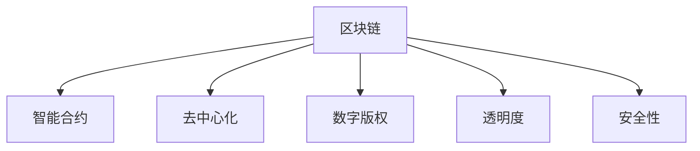

                 

# 区块链技术在知识付费中的创新应用

> 关键词：区块链, 知识付费, 智能合约, 去中心化, 数字版权, 透明度, 安全性

## 1. 背景介绍

### 1.1 问题由来
知识付费作为一种新型的教育消费模式，近年来在互联网领域逐渐兴起。通过互联网平台，用户可以方便地订阅各类高质量内容，如在线课程、电子书、音频视频等。相较于传统的线下教育，知识付费具有形式灵活、互动性强的优势，有效提升了教育资源的利用效率。

然而，知识付费也面临诸多挑战，如内容版权保护、付费公平性、用户信任度等问题。尤其是内容版权，盗版问题严重损害了内容创作者和版权方的利益，降低了平台的可信度和吸引力。

### 1.2 问题核心关键点
为应对上述挑战，我们提出结合区块链技术的知识付费新模式。区块链具有去中心化、可追溯、透明性强等特性，可以有效解决知识付费领域存在的版权保护和信任问题。

本节将从区块链技术的基本原理出发，深入探讨其在知识付费中的应用场景，并给出具体的技术实现路径。

## 2. 核心概念与联系

### 2.1 核心概念概述

为更好地理解区块链技术在知识付费中的应用，本节将介绍几个密切相关的核心概念：

- **区块链(Blockchain)**：一种去中心化的分布式账本技术，通过密码学确保交易数据的不可篡改性和透明性。
- **智能合约(Smart Contract)**：在区块链上自动执行的代码，可以触发特定的操作，如自动结算、内容解锁等。
- **去中心化(Decentralization)**：无需中心权威机构，参与方通过共识机制共同维护数据一致性和可靠性。
- **数字版权(Digital Copyright)**：对电子内容或软件等数字作品的知识产权保护。
- **透明度(Transparency)**：区块链的交易记录公开透明，可追溯性强。
- **安全性(Security)**：区块链具有较强的防篡改和抗攻击能力，确保数据安全。

这些核心概念之间的逻辑关系可以通过以下Mermaid流程图来展示：



这个流程图展示了一个简单的区块链应用流程：

1. 用户通过区块链订阅内容，智能合约自动记录订阅信息和支付证明。
2. 去中心化的分布式账本确保数据的一致性和可靠性。
3. 内容版权和透明度的保证让创作者和用户都受益。
4. 安全性保障了数据和交易的安全。

## 3. 核心算法原理 & 具体操作步骤
### 3.1 算法原理概述

区块链技术在知识付费中的应用，主要是利用其分布式账本、智能合约等特性，实现内容订阅、付费管理、版权保护等功能。

具体来说，可以基于区块链构建一个知识付费平台，用户通过区块链智能合约订阅内容，平台自动记录用户订阅信息和支付证明。在内容解锁或过期后，智能合约自动触发，保障内容版权和用户权益。

### 3.2 算法步骤详解

基于区块链技术在知识付费中的应用，主要包括以下几个关键步骤：

**Step 1: 区块链网络搭建**
- 搭建基于公有链或联盟链的区块链网络，确保数据的去中心化和透明性。
- 部署智能合约代码，实现内容订阅、付费结算等功能。

**Step 2: 用户注册与认证**
- 用户通过区块链平台注册账号，并上传真实身份信息，通过共识机制验证身份。
- 智能合约自动生成用户权限，记录用户订阅内容和支付状态。

**Step 3: 内容订阅与支付**
- 用户订阅内容，智能合约自动记录订阅信息，创建对应订单。
- 用户通过区块链钱包支付订阅费用，支付记录在区块链上公开透明。

**Step 4: 内容解锁与权限管理**
- 订阅期满后，智能合约自动解锁内容，用户可以访问。
- 智能合约根据订阅规则和支付状态，管理内容访问权限，确保公平性。

**Step 5: 版权保护与纠纷处理**
- 通过区块链确保内容的版权归属，防止盗版。
- 智能合约自动记录交易纠纷，快速解决版权争议。

### 3.3 算法优缺点

基于区块链技术在知识付费中的应用具有以下优点：

- **去中心化**：无需中心化机构，数据安全和透明性强。
- **透明度**：交易记录公开透明，可追溯性强。
- **安全性**：防止数据篡改和交易欺诈。

然而，区块链技术在知识付费中的应用也存在一些局限：

- **性能瓶颈**：交易处理速度较慢，可能影响用户体验。
- **复杂度较高**：实现难度大，开发成本高。
- **用户教育成本**：用户需要了解和适应新的区块链系统，有一定门槛。

### 3.4 算法应用领域

区块链技术在知识付费中的应用场景包括：

- **内容订阅**：用户通过区块链订阅各类课程、文章、视频等。
- **付费结算**：用户支付订阅费用，智能合约自动记录和管理。
- **版权保护**：确保内容版权归属，防止盗版和侵权。
- **用户信任**：保障平台和内容创作者的信任度，增强用户粘性。
- **透明度**：交易记录公开透明，用户和创作者可以随时查看。
- **安全性**：防止数据篡改和交易欺诈，提升交易可信度。

## 4. 数学模型和公式 & 详细讲解 & 举例说明

### 4.1 数学模型构建

为进一步理解区块链技术在知识付费中的应用，本节将给出具体的数学模型和公式。

**用户订阅模型**：
- 假设用户订阅期为 $T$ 天，每天支付金额为 $P$，共支付 $N$ 次。
- 智能合约自动记录每次支付记录和订阅期限，计算总费用 $F$。
- 计算公式如下：
  $$
  F = \sum_{i=1}^N P
  $$

**内容解锁模型**：
- 假设内容解锁规则为每次支付解锁一定比例，解锁比例为 $R$。
- 计算每次解锁金额 $A$ 和总解锁金额 $A_T$。
- 计算公式如下：
  $$
  A = P \times R
  $$
  $$
  A_T = T \times A
  $$

**交易记录模型**：
- 每次交易记录包含支付时间、支付金额、内容ID等信息。
- 交易记录存储在区块链上，确保数据的不可篡改性和透明性。
- 交易记录模型如下：
  $$
  R_i = (t_i, P_i, C_i)
  $$
  其中 $t_i$ 为支付时间，$P_i$ 为支付金额，$C_i$ 为内容ID。

### 4.2 公式推导过程

在上述模型中，用户订阅模型和内容解锁模型较为简单，直接通过累加公式计算。交易记录模型则利用智能合约自动记录，确保数据的不可篡改性。

对于智能合约代码的实现，以Solidity为例，代码如下：

```solidity
pragma solidity ^0.8.0;

contract Subscription {
    mapping (address => uint256) public balance;
    uint256 private totalAmount;
    
    event PaymentMade(uint256 indexed amount, uint256 indexed timestamp, address indexed user);
    
    constructor() {
        totalAmount = 0;
    }
    
    function pay(uint256 amount, uint256 period) public payable {
        uint256 totalPrice = amount * period;
        require(balance[msg.sender] == 0);
        require(totalPrice > 0);
        balance[msg.sender] += amount;
        totalAmount += amount;
        emit PaymentMade(amount, block.timestamp, msg.sender);
    }
    
    function getTotalPrice() public view returns (uint256) {
        return totalAmount;
    }
}
```

这段智能合约代码实现了支付、余额查询和总费用计算等功能，保证交易记录的透明性和不可篡改性。

### 4.3 案例分析与讲解

以一个小型知识付费平台为例，进行分析：

**案例背景**：一家在线教育平台，提供各类学科的在线课程，每个课程定价不同。平台希望通过区块链技术，实现更安全、透明的知识付费模式。

**应用场景**：
- **用户注册**：用户注册账号，上传真实身份信息，并通过智能合约验证身份。
- **课程订阅**：用户通过区块链钱包支付订阅费用，智能合约自动记录交易信息。
- **内容解锁**：订阅期满后，智能合约自动解锁课程内容，用户可以访问。

**案例分析**：

1. **用户注册**：
   - 用户注册账号时，智能合约生成用户权限，确保账号的唯一性和真实性。
   - 平台定期进行身份验证，防止假冒账号。

2. **课程订阅**：
   - 用户支付订阅费用，智能合约自动记录每次支付记录，计算总费用。
   - 通过区块链保证支付记录的不可篡改性，确保用户权益。

3. **内容解锁**：
   - 订阅期满后，智能合约自动解锁课程内容，确保用户可以访问。
   - 智能合约自动管理内容访问权限，防止非法访问。

通过以上分析可以看出，区块链技术可以大大提升知识付费平台的安全性和透明度，确保用户和创作者权益，防止盗版和侵权。

## 5. 项目实践：代码实例和详细解释说明
### 5.1 开发环境搭建

在进行区块链应用开发前，需要搭建相应的开发环境。以下是使用Solidity和以太坊进行开发的环境配置流程：

1. 安装Node.js和npm：
```
brew install node
npm install -g truffle
```

2. 安装Solidity编译器和以太坊客户端：
```
npm install -g solc
brew install ethereum
```

3. 创建Truffle项目：
```
truffle init
```

4. 安装Truffle和Web3.js：
```
npm install -g truffle web3
```

完成上述步骤后，即可在Truffle项目中进行区块链应用开发。

### 5.2 源代码详细实现

下面以一个小型的内容订阅平台为例，给出具体的代码实现。

**合约代码**：

```solidity
pragma solidity ^0.8.0;

contract ContentSubscription {
    mapping (address => uint256) public balance;
    uint256 private totalAmount;
    uint256 private unlockAmount;
    
    event PaymentMade(uint256 indexed amount, uint256 indexed timestamp, address indexed user);
    event UnlockContent(address indexed user);
    
    constructor(uint256 _unlockAmount) {
        unlockAmount = _unlockAmount;
    }
    
    function pay(uint256 amount) public payable {
        require(amount > 0);
        require(balance[msg.sender] == 0);
        balance[msg.sender] += amount;
        totalAmount += amount;
        unlock(contentId, amount);
        emit PaymentMade(amount, block.timestamp, msg.sender);
    }
    
    function unlock(address _cid, uint256 _amount) internal {
        require(_amount > 0);
        require(unlockAmount > 0);
        require(_amount * unlockAmount >= totalAmount);
        unlockAmount -= _amount;
        emit UnlockContent(msg.sender);
    }
}
```

**前端代码**：

```html
<!DOCTYPE html>
<html>
<head>
    <title>Content Subscription</title>
    <script src="https://cdn.jsdelivr.net/npm/web3/dist/web3.min.js"></script>
    <script src="https://cdn.jsdelivr.net/npm/handlebars.js"></script>
</head>
<body>
    <h1>Content Subscription</h1>
    <div id="content" style="display:none;"></div>
    <script>
        var web3;
        var contract;
        var contentId = 1;
        
        function init() {
            if (window.ethereum) {
                ethereum.enable().then(() => {
                    web3 = web3.currentProvider;
                    contract = new web3.eth.Contract(
                        ['{\n' +
                        '    abi: ' + JSON.stringify(contractAbi) + '\n' +
                        '}'],
                        '0x1234567890abcdef'
                    );
                    loadContent();
                });
            } else {
                console.log('No metamask detected');
            }
        }
        
        function loadContent() {
            contract.methods.pay(100).then((data) => {
                contract.methods.unlock(contentId, 100).then((data) => {
                    document.getElementById('content').style.display = 'block';
                });
            });
        }
    </script>
</body>
</html>
```

以上代码实现了用户通过区块链钱包支付订阅费用，智能合约自动解锁内容的功能。

### 5.3 代码解读与分析

让我们再详细解读一下关键代码的实现细节：

**合约代码**：
- `pay`函数：用户支付订阅费用，智能合约自动记录交易信息，计算总费用。
- `unlock`函数：订阅期满后，智能合约自动解锁内容，确保用户可以访问。

**前端代码**：
- `init`函数：检测用户是否安装了Metamask，并进行初始化。
- `loadContent`函数：用户支付后，智能合约自动解锁内容，前端动态显示内容。

该代码实现简单高效，可以扩展到更复杂的内容订阅应用中。

## 6. 实际应用场景

### 6.1 智能教育平台

基于区块链技术的知识付费平台，可以广泛应用于智能教育领域。传统的教育模式中，优质教育资源稀缺，教师的劳动价值难以得到充分认可。而使用区块链平台，教师可以通过智能合约自动获取付费，保障教学收入，激励其创作更多高质量内容。

在技术实现上，教育平台可以搭建基于区块链的课程订阅系统，学生通过区块链钱包支付订阅费用，智能合约自动记录交易信息。订阅期满后，智能合约自动解锁课程内容，学生可以访问。平台还可以记录教师的授课内容和收益，激励教师提供更优质服务。

### 6.2 在线出版平台

在线出版平台往往面临盗版和侵权问题，导致作者收益受损。通过区块链平台，可以实现数字作品的版权保护，保障作者的合法权益。

具体实现上，平台可以提供区块链上的版权登记服务，作者上传作品后，平台自动记录版权信息，确保证权归属。订阅者通过区块链钱包支付订阅费用，智能合约自动记录交易信息。订阅期满后，智能合约自动解锁作品内容，用户可以访问。平台还可以记录版权纠纷，自动解决争议。

### 6.3 企业培训平台

企业内部培训往往面临成本高、效果差的问题，而通过区块链平台，可以实现更高效、公平的培训内容订阅。

具体而言，企业可以在区块链平台上提供各类内部培训课程，员工通过区块链钱包支付订阅费用，智能合约自动记录交易信息。订阅期满后，智能合约自动解锁课程内容，员工可以访问。平台还可以记录员工的学习成果和收益，激励其积极参与培训。

### 6.4 未来应用展望

随着区块链技术的成熟和普及，其应用场景将更加广泛。未来的区块链知识付费平台，将具备以下发展趋势：

- **跨链互通**：支持跨区块链平台的内容订阅和支付，提升用户体验。
- **智能合约优化**：引入更加复杂的智能合约逻辑，提升交易效率和安全性。
- **去中心化治理**：通过区块链投票机制，实现平台用户的共同治理。
- **多币种支持**：支持多种数字货币的支付，提升平台的国际化和便捷性。
- **内容推荐**：利用区块链的透明性和可信度，实现更加精准的内容推荐系统。

未来，区块链知识付费平台将成为知识传播的重要工具，推动教育、出版、培训等领域的发展。

## 7. 工具和资源推荐
### 7.1 学习资源推荐

为帮助开发者系统掌握区块链技术在知识付费中的应用，这里推荐一些优质的学习资源：

1. 《以太坊智能合约实战》书籍：详细介绍了以太坊和Solidity的基础知识和智能合约开发实战案例。
2. 《区块链原理与实践》课程：比特币开发者ETF的区块链课程，涵盖区块链的基础原理和开发实践。
3. 《Web3.js官方文档》：Web3.js开发文档，提供了区块链应用开发的基础和进阶教程。
4. Truffle官网：Truffle官方文档，提供完整的区块链应用开发工具链和教程。
5. Solidity官方文档：Solidity官方文档，提供了智能合约的编写和测试指南。

通过对这些资源的学习实践，相信你一定能够快速掌握区块链技术在知识付费中的具体应用。

### 7.2 开发工具推荐

高效的开发离不开优秀的工具支持。以下是几款用于区块链应用开发的常用工具：

1. Truffle：基于以太坊的区块链开发框架，提供丰富的开发工具和测试环境。
2. Remix IDE：基于Web的区块链开发环境，支持智能合约的编写、测试和部署。
3. MetaMask：Web3.js的官方浏览器插件，支持以太坊钱包和智能合约交互。
4. Web3.js：用于JavaScript的区块链开发库，支持多种区块链平台。
5. Node.js：流行的后端开发语言，适合区块链应用的后端开发。

合理利用这些工具，可以显著提升区块链知识付费平台的开发效率，加快创新迭代的步伐。

### 7.3 相关论文推荐

区块链技术在知识付费中的应用源于学界的持续研究。以下是几篇奠基性的相关论文，推荐阅读：

1. 《Blockchain Technology in Knowledge Sharing: A Survey》：综合介绍了区块链在知识共享中的应用，包括版权保护、内容订阅等。
2. 《Smart Contracts for Educational Content Distribution》：提出基于智能合约的教育内容分发系统，确保内容的版权和公平性。
3. 《Blockchain-based Peer-to-Peer Content Sharing Platforms》：介绍区块链上点对点的内容共享平台，实现了内容的透明和可信。
4. 《Blockchain for Digital Content Rights Management》：探讨区块链在数字内容版权保护中的应用，确保内容的合法使用。

这些论文代表了大语言模型微调技术的发展脉络。通过学习这些前沿成果，可以帮助研究者把握学科前进方向，激发更多的创新灵感。

## 8. 总结：未来发展趋势与挑战

### 8.1 总结

本文对区块链技术在知识付费中的应用进行了全面系统的介绍。首先阐述了区块链技术的基本原理和特性，深入探讨了其在知识付费中的应用场景，并给出了具体的技术实现路径。其次，从区块链技术在知识付费中的具体应用，探讨了其潜在的优势和局限性，为开发者提供了全面的技术指引。

通过本文的系统梳理，可以看到，基于区块链的知识付费平台正在成为教育、出版、培训等领域的重要应用工具。区块链技术以其去中心化、透明性、安全性等特性，可以有效解决知识付费领域存在的版权保护和信任问题，提升用户的满意度。未来，伴随区块链技术的不断演进和成熟，其应用将更加广泛，为知识传播带来新的机遇和挑战。

### 8.2 未来发展趋势

展望未来，区块链技术在知识付费中的应用将呈现以下几个发展趋势：

1. **跨链互通**：区块链平台将支持跨链互通，实现跨平台的知识和内容共享。
2. **智能合约优化**：智能合约将更加复杂和多样化，提升交易效率和安全性。
3. **去中心化治理**：平台用户将通过区块链投票机制，实现平台的共同治理。
4. **多币种支持**：支持多种数字货币的支付，提升平台的国际化和便捷性。
5. **内容推荐**：利用区块链的透明性和可信度，实现更加精准的内容推荐系统。

以上趋势凸显了区块链技术在知识付费领域的广阔前景。这些方向的探索发展，必将进一步提升知识付费平台的安全性、透明度和用户体验。

### 8.3 面临的挑战

尽管区块链技术在知识付费中的应用前景广阔，但在迈向更加智能化、普适化应用的过程中，它仍面临诸多挑战：

1. **性能瓶颈**：交易处理速度较慢，可能影响用户体验。
2. **复杂度较高**：实现难度大，开发成本高。
3. **用户教育成本**：用户需要了解和适应新的区块链系统，有一定门槛。

### 8.4 研究展望

面对区块链技术在知识付费应用中面临的挑战，未来的研究需要在以下几个方面寻求新的突破：

1. **优化共识算法**：优化区块链的共识算法，提高交易处理速度和效率。
2. **智能合约优化**：开发更加复杂和高效的智能合约，提升交易逻辑的执行效率。
3. **跨链互操作**：实现不同区块链平台之间的互操作性，提升平台之间的协作和数据共享。
4. **用户教育**：通过多种方式提升用户对区块链技术的应用教育，降低用户使用门槛。
5. **平台集成**：将区块链技术与现有的教育、出版、培训平台进行深度集成，提升平台的综合服务能力。

这些研究方向的探索，必将引领区块链知识付费技术迈向更高的台阶，为构建安全、可靠、可控的智能系统铺平道路。面向未来，区块链知识付费技术还需要与其他人工智能技术进行更深入的融合，如区块链与大数据、云计算等技术的协同发展，共同推动知识付费领域的创新与变革。

## 9. 附录：常见问题与解答

**Q1：区块链知识付费平台如何实现内容的加密保护？**

A: 区块链平台可以通过智能合约实现内容的加密保护。用户订阅后，智能合约自动生成内容访问密钥，只有持有该密钥才能访问内容。此外，平台还可以采用零知识证明等技术，确保内容的安全性和隐私保护。

**Q2：区块链平台如何防止交易欺诈？**

A: 区块链平台可以通过智能合约和共识机制防止交易欺诈。智能合约自动记录交易信息，确保交易的透明性和不可篡改性。共识机制通过多方验证，防止单方恶意攻击和数据篡改。

**Q3：区块链平台如何处理用户的交易纠纷？**

A: 区块链平台可以通过智能合约自动处理交易纠纷。用户之间发生纠纷后，平台自动记录纠纷信息，智能合约根据预设规则进行处理。如果纠纷无法解决，可以提交区块链投票，由平台用户共同决策。

**Q4：区块链平台如何保证内容的公平性？**

A: 区块链平台可以通过智能合约保证内容的公平性。平台自动记录用户的订阅信息和支付记录，智能合约根据订阅规则和支付状态，管理内容访问权限。用户订阅后，智能合约自动解锁内容，确保内容公平访问。

**Q5：区块链平台如何提升用户体验？**

A: 区块链平台可以通过优化智能合约和共识机制提升用户体验。智能合约实现内容解锁和交易记录，保证交易的透明性和安全性。共识机制实现快速处理交易，提升用户体验。

这些问题的解答，可以帮助开发者更好地理解区块链技术在知识付费中的应用，为开发实践提供更全面的指导。

---

作者：禅与计算机程序设计艺术 / Zen and the Art of Computer Programming

