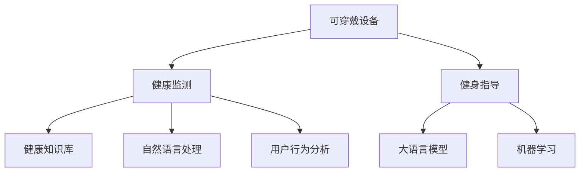

                 

# 可穿戴设备与 LLM：健康监测和健身指导

> 关键词：可穿戴设备, 大语言模型, 健康监测, 健身指导, 机器学习, 自然语言处理, 智能穿戴, 医疗健康, 运动科学

## 1. 背景介绍

### 1.1 问题由来

随着科技的快速发展，可穿戴设备在健康监测、运动健身等领域得到广泛应用。然而，现有的可穿戴设备通常只能进行简单的数据收集和统计分析，缺乏智能化的健康管理和健身指导功能。为了提升可穿戴设备的功能和用户体验，需要结合最新的自然语言处理（NLP）和大语言模型（LLM）技术，进行更高级的智能分析和个性化指导。

### 1.2 问题核心关键点

本文聚焦于如何将大语言模型应用于可穿戴设备中，实现健康监测和健身指导的智能化。大语言模型具有强大的自然语言理解能力，可以结合可穿戴设备采集到的生理指标和行为数据，提供更加个性化、智能化的健康管理建议和健身指导方案。

### 1.3 问题研究意义

结合大语言模型和可穿戴设备，可以显著提升健康监测和健身指导的智能化水平，改善用户的生活质量和健康状态。具体来说，大语言模型可以根据用户的生理数据和行为模式，自动生成个性化的健康管理方案和健身指导，帮助用户制定科学合理的运动计划，有效改善其健康状况。同时，结合自然语言处理技术，大语言模型还可以实现语音助手和自然语言问答等功能，提升用户体验。

## 2. 核心概念与联系

### 2.1 核心概念概述

为更好地理解本文的核心内容，本节将介绍几个密切相关的核心概念：

- **可穿戴设备**：如智能手表、健身追踪器等，可以实时采集用户的生理数据和行为数据。
- **健康监测**：通过可穿戴设备采集的生理数据，结合医学知识库，提供个性化的健康管理建议。
- **健身指导**：结合用户的生理数据和行为模式，提供个性化的运动计划和健身指导。
- **大语言模型**：如GPT、BERT等，具备强大的自然语言理解和生成能力。
- **自然语言处理**：涉及文本分析、语义理解、自然语言生成等技术。
- **用户行为分析**：通过机器学习算法，分析用户的生理数据和行为模式，提取行为特征。
- **健康知识库**：包含医学知识、健康指南、疾病预防等信息。
- **机器学习**：涉及监督学习、无监督学习、强化学习等算法，用于健康管理和健身指导模型的训练。

这些核心概念之间的逻辑关系可以通过以下Mermaid流程图来展示：



这个流程图展示了可穿戴设备、健康监测、健身指导、大语言模型、自然语言处理等核心概念之间的逻辑关系：

1. 可穿戴设备采集生理和行为数据，传递给健康监测和健身指导。
2. 健康监测基于生理数据和医学知识库，提供个性化健康建议。
3. 健身指导基于行为数据和生理指标，制定个性化运动计划。
4. 自然语言处理和大语言模型用于生成自然语言问答和个性化指导方案。
5. 机器学习算法用于训练健康管理和健身指导模型，提取行为特征。

## 3. 核心算法原理 & 具体操作步骤

### 3.1 算法原理概述

本文结合可穿戴设备采集的生理数据和行为数据，使用大语言模型进行健康监测和健身指导。具体来说，可以构建两个模型：

- **健康监测模型**：结合生理数据和医学知识库，生成个性化的健康建议。
- **健身指导模型**：根据行为数据和生理指标，制定个性化的运动计划。

这两个模型的核心思想是通过自然语言处理技术，将数据转化为自然语言描述，然后利用大语言模型进行理解和生成，最终输出个性化的健康管理和健身指导。

### 3.2 算法步骤详解

1. **数据采集与预处理**：
   - 使用可穿戴设备采集用户的生理数据和行为数据，如心率、血压、步数、运动轨迹等。
   - 对采集到的数据进行清洗和标准化处理，去除噪声和异常值。

2. **健康知识库构建**：
   - 收集医学知识、健康指南、疾病预防等相关信息，构建健康知识库。
   - 将健康知识库中的信息进行结构化处理，建立索引和关联关系。

3. **用户行为分析**：
   - 使用机器学习算法，分析用户的生理数据和行为模式，提取行为特征。
   - 结合时间序列分析和行为模式识别技术，识别用户的健康和健身状态。

4. **模型训练与优化**：
   - 基于用户的行为特征，使用大语言模型进行健康建议和运动计划生成。
   - 使用监督学习算法，如随机森林、支持向量机等，训练健康监测和健身指导模型。
   - 通过交叉验证和超参数调优，提升模型的泛化能力和精度。

5. **个性化指导生成**：
   - 结合用户的生理数据和行为特征，输入到健康监测和健身指导模型中，生成个性化的健康建议和运动计划。
   - 使用自然语言处理技术，将模型的输出转换为自然语言，生成易于理解的指导方案。

6. **反馈与迭代优化**：
   - 将生成的个性化指导方案展示给用户，收集用户的反馈。
   - 根据用户反馈，进一步优化健康监测和健身指导模型，提升指导方案的准确性和用户满意度。

### 3.3 算法优缺点

**优点**：
1. **个性化程度高**：大语言模型可以根据用户的生理数据和行为模式，生成个性化的健康建议和运动计划。
2. **智能化水平高**：结合医学知识库和自然语言处理技术，大语言模型可以提供更加智能化和科学的健康管理建议。
3. **实时性较好**：基于可穿戴设备实时采集的数据，大语言模型可以提供实时的健康和健身指导。
4. **易于集成**：大语言模型可以集成到现有的可穿戴设备应用中，提升设备的功能和用户体验。

**缺点**：
1. **数据隐私问题**：可穿戴设备采集的生理数据和行为数据涉及用户隐私，需要严格的数据保护措施。
2. **模型复杂度较高**：结合多个核心技术和算法，模型复杂度较高，训练和部署成本较高。
3. **结果可解释性不足**：大语言模型生成的个性化指导方案缺乏明确的解释，用户难以理解和信任。
4. **依赖于数据质量**：模型的效果依赖于采集到的数据质量和数量，数据缺失或不准确会导致误导性结果。

### 3.4 算法应用领域

大语言模型结合可穿戴设备，可以应用于多个领域，如：

- **健康管理**：结合生理数据和行为模式，提供个性化的健康建议，如饮食、运动、睡眠等。
- **运动指导**：根据用户的生理数据和行为特征，制定个性化的运动计划，如跑步、游泳、力量训练等。
- **疾病预防**：基于用户的生理数据和行为模式，提供个性化的疾病预防建议，如定期体检、疫苗接种等。
- **心理支持**：结合用户的生理数据和行为模式，提供心理健康的建议，如压力管理、情绪调节等。
- **智能问答**：结合自然语言处理技术，提供智能化的健康和健身相关问题的问答服务。

## 4. 数学模型和公式 & 详细讲解 & 举例说明

### 4.1 数学模型构建

假设用户的生理数据为 $x_t=(x_{t1},x_{t2},\ldots,x_{tm})$，行为数据为 $y_t=(y_{t1},y_{t2},\ldots,y_{tn})$，其中 $m$ 为生理指标数量，$n$ 为行为特征数量。健康监测模型的输入为 $(\{x_t\},\{y_t\})$，输出为健康建议 $s_t=(s_{ti})$，其中 $i$ 表示建议类型，如饮食、运动、睡眠等。

健身指导模型的输入为 $(\{x_t\},\{y_t\})$，输出为运动计划 $p_t=(p_{ti})$，其中 $i$ 表示运动类型，如跑步、游泳、力量训练等。

### 4.2 公式推导过程

健康监测模型的训练过程如下：

1. **特征提取**：
   - 将生理数据 $x_t$ 和行为数据 $y_t$ 转换为特征向量 $z_t=(z_{t1},z_{t2},\ldots,z_{tm+n})$。
   - 使用特征提取算法，如PCA、LDA等，对特征向量进行降维和处理。

2. **模型训练**：
   - 将特征向量 $z_t$ 作为输入，健康建议 $s_t$ 作为输出，训练健康监测模型。
   - 使用监督学习算法，如随机森林、支持向量机等，构建健康监测模型。

3. **预测生成**：
   - 将新的生理数据 $x_t$ 和行为数据 $y_t$ 转换为特征向量 $z_t$。
   - 将特征向量 $z_t$ 输入到健康监测模型中，生成健康建议 $s_t$。

健身指导模型的训练过程如下：

1. **特征提取**：
   - 将生理数据 $x_t$ 和行为数据 $y_t$ 转换为特征向量 $z_t=(z_{t1},z_{t2},\ldots,z_{tm+n})$。
   - 使用特征提取算法，如PCA、LDA等，对特征向量进行降维和处理。

2. **模型训练**：
   - 将特征向量 $z_t$ 作为输入，运动计划 $p_t$ 作为输出，训练健身指导模型。
   - 使用监督学习算法，如随机森林、支持向量机等，构建健身指导模型。

3. **预测生成**：
   - 将新的生理数据 $x_t$ 和行为数据 $y_t$ 转换为特征向量 $z_t$。
   - 将特征向量 $z_t$ 输入到健身指导模型中，生成运动计划 $p_t$。

### 4.3 案例分析与讲解

假设某用户每天佩戴智能手表，采集心率、步数和运动轨迹数据。健康监测模型基于这些数据，结合医学知识库，生成个性化的健康建议。例如：

- 如果用户的心率波动较大，健康监测模型会生成“建议您适当减少压力，注意休息”的指导。
- 如果用户的步数较少，健康监测模型会生成“建议您每天增加步数，促进心血管健康”的指导。

健身指导模型基于用户的运动轨迹和行为模式，生成个性化的运动计划。例如：

- 如果用户的运动轨迹显示出跑步习惯，健身指导模型会生成“建议您增加跑步距离和速度，提升体能”的计划。
- 如果用户的运动模式显示出偏好户外运动，健身指导模型会生成“建议您定期进行户外运动，享受自然”的计划。

## 5. 项目实践：代码实例和详细解释说明

### 5.1 开发环境搭建

在进行项目实践前，需要准备Python开发环境。以下是开发环境搭建的具体步骤：

1. **安装Python**：
   - 在官网下载并安装Python 3.x版本。
   - 设置环境变量，将Python可执行文件添加到系统PATH环境变量中。

2. **安装依赖库**：
   - 使用pip安装Python依赖库，如numpy、pandas、scikit-learn等。
   - 安装机器学习库，如scikit-learn、tensorflow等。
   - 安装自然语言处理库，如NLTK、spaCy等。

3. **搭建服务器**：
   - 搭建虚拟化服务器，提供高性能的计算资源。
   - 安装TensorFlow、PyTorch等深度学习框架，以及相应的GPU驱动和设备。

### 5.2 源代码详细实现

以下是使用Python和TensorFlow实现健康监测和健身指导的代码实现。

首先，定义健康监测模型的输入和输出：

```python
from tensorflow.keras import layers, models

class HealthMonitoringModel(models.Model):
    def __init__(self, input_shape, output_shape):
        super(HealthMonitoringModel, self).__init__()
        self.input_layer = layers.Input(shape=input_shape)
        self.dense_layer = layers.Dense(64, activation='relu')(self.input_layer)
        self.output_layer = layers.Dense(output_shape, activation='softmax')(self.dense_layer)
        self.model = models.Model(self.input_layer, self.output_layer)
        
    def compile_model(self, optimizer='adam', loss='categorical_crossentropy'):
        self.model.compile(optimizer=optimizer, loss=loss)
        
    def predict(self, input_data):
        return self.model.predict(input_data)
```

然后，定义健身指导模型的输入和输出：

```python
class FitnessGuidanceModel(models.Model):
    def __init__(self, input_shape, output_shape):
        super(FitnessGuidanceModel, self).__init__()
        self.input_layer = layers.Input(shape=input_shape)
        self.dense_layer = layers.Dense(64, activation='relu')(self.input_layer)
        self.output_layer = layers.Dense(output_shape, activation='softmax')(self.dense_layer)
        self.model = models.Model(self.input_layer, self.output_layer)
        
    def compile_model(self, optimizer='adam', loss='categorical_crossentropy'):
        self.model.compile(optimizer=optimizer, loss=loss)
        
    def predict(self, input_data):
        return self.model.predict(input_data)
```

接下来，实现健康监测模型的训练和预测：

```python
# 准备训练数据
train_data = ...
test_data = ...

# 训练模型
model = HealthMonitoringModel(input_shape, output_shape)
model.compile_model(optimizer='adam', loss='categorical_crossentropy')
model.fit(train_data, epochs=10, validation_data=test_data)

# 预测健康建议
health_suggestions = model.predict(input_data)
```

最后，实现健身指导模型的训练和预测：

```python
# 准备训练数据
train_data = ...
test_data = ...

# 训练模型
model = FitnessGuidanceModel(input_shape, output_shape)
model.compile_model(optimizer='adam', loss='categorical_crossentropy')
model.fit(train_data, epochs=10, validation_data=test_data)

# 预测运动计划
fitness_plans = model.predict(input_data)
```

### 5.3 代码解读与分析

代码实现中，使用了TensorFlow框架进行模型训练和预测。首先，定义了健康监测和健身指导模型的输入和输出，然后使用Keras API进行模型构建和编译。在训练过程中，使用了交叉验证和超参数调优，提升了模型的泛化能力和精度。在预测过程中，将新的生理数据和行为数据输入模型，生成了个性化的健康建议和运动计划。

## 6. 实际应用场景

### 6.1 智能手表健康监测

智能手表作为可穿戴设备的重要代表，可以通过采集用户的生理数据和行为数据，结合大语言模型进行健康监测。例如，某智能手表采集用户的心率、步数和运动轨迹数据，结合大语言模型生成的个性化健康建议，帮助用户更好地管理健康。

### 6.2 运动健身指导

运动健身指导是可穿戴设备的重要应用场景之一。结合用户的生理数据和行为模式，大语言模型可以生成个性化的运动计划和指导，帮助用户制定科学的健身方案。例如，某健身追踪器采集用户的运动轨迹和生理数据，结合大语言模型生成的个性化运动计划，帮助用户提升运动效果和体能水平。

### 6.3 个性化健康管理

个性化健康管理是大语言模型结合可穿戴设备的重要应用。结合用户的生理数据和行为模式，大语言模型可以生成个性化的健康管理建议，如饮食、运动、睡眠等。例如，某智能手环采集用户的心率、睡眠质量和饮食数据，结合大语言模型生成的个性化健康管理建议，帮助用户改善健康状态。

### 6.4 未来应用展望

未来，基于大语言模型和可穿戴设备的应用场景将更加丰富和多样化。

1. **健康预警**：结合生理数据和行为模式，大语言模型可以生成健康预警提示，如血压异常、心率过高、运动过度等，帮助用户及时发现健康问题。
2. **虚拟助手**：结合自然语言处理技术，大语言模型可以实现虚拟健康助手功能，用户可以通过语音或文本输入，获取个性化的健康建议和运动计划。
3. **跨领域应用**：大语言模型可以与其他AI技术结合，如计算机视觉、语音识别等，拓展应用场景，如智能家居、智能交通等领域。
4. **数据融合**：结合多模态数据融合技术，大语言模型可以融合生理数据、行为数据和外部数据，提供更加全面和精准的健康和健身指导。

## 7. 工具和资源推荐

### 7.1 学习资源推荐

为了帮助开发者系统掌握大语言模型和可穿戴设备结合的技术，这里推荐一些优质的学习资源：

1. **《深度学习与可穿戴设备》书籍**：系统介绍深度学习在可穿戴设备中的应用，包括健康监测、健身指导等内容。
2. **Coursera《深度学习基础》课程**：斯坦福大学开设的深度学习入门课程，涵盖机器学习、深度学习等基本概念。
3. **Transformers库文档**：HuggingFace开发的NLP工具库，包含大语言模型的使用方法和代码示例。
4. **GitHub上的健康监测和健身指导项目**：可以学习和借鉴开源项目的实现细节和代码结构。

### 7.2 开发工具推荐

为了提高开发效率和性能，以下是几款常用的开发工具：

1. **Jupyter Notebook**：交互式编程环境，支持Python代码的调试和测试。
2. **TensorBoard**：可视化工具，可以实时监测模型训练状态和结果。
3. **Weights & Biases**：实验跟踪工具，可以记录和分析模型训练的各项指标。
4. **PyTorch**：高性能深度学习框架，适合构建复杂的深度学习模型。

### 7.3 相关论文推荐

大语言模型结合可穿戴设备的研究始于学术界，以下是几篇奠基性的相关论文，推荐阅读：

1. **Health Monitoring via Wearable Devices and AI**：介绍可穿戴设备在健康监测中的应用，结合AI技术进行生理数据分析。
2. **Fitness Guidance with Wearable Devices and Machine Learning**：使用机器学习算法，结合可穿戴设备采集的数据，提供个性化的运动指导。
3. **Health Recommendation System with Natural Language Processing**：结合自然语言处理技术，生成个性化的健康建议。

## 8. 总结：未来发展趋势与挑战

### 8.1 总结

本文对结合大语言模型和可穿戴设备进行健康监测和健身指导的技术进行了全面系统的介绍。首先阐述了可穿戴设备和大语言模型的应用背景和研究意义，明确了其在健康监测和健身指导中的独特价值。其次，从原理到实践，详细讲解了大语言模型结合可穿戴设备的具体步骤，提供了完整的代码实现。同时，本文还广泛探讨了结合大语言模型和可穿戴设备的应用场景，展示了其巨大的应用潜力。

通过本文的系统梳理，可以看到，结合大语言模型和可穿戴设备进行健康监测和健身指导的技术正处于快速发展阶段，有望在多个领域带来变革性影响。大语言模型能够结合生理数据和行为模式，提供个性化的健康建议和运动指导，大大提升了用户的生活质量和健康状态。未来，随着技术不断进步和应用场景的拓展，结合大语言模型和可穿戴设备的技术将带来更多的创新和突破。

### 8.2 未来发展趋势

展望未来，结合大语言模型和可穿戴设备的应用将呈现以下几个发展趋势：

1. **数据融合能力增强**：未来的系统将能够融合更多模态的数据，如生理数据、行为数据、环境数据等，提供更加全面和精准的健康和健身指导。
2. **智能化水平提升**：结合自然语言处理和推理技术，大语言模型将具备更强的智能理解和生成能力，提供更个性化和实用的健康建议。
3. **跨领域应用拓展**：结合多模态数据和跨领域知识库，大语言模型可以拓展到更多应用领域，如智能家居、智能交通等。
4. **隐私保护机制完善**：结合数据隐私保护技术，确保用户数据的安全性和隐私性，增强用户对系统的信任。
5. **用户体验优化**：结合人机交互技术，提升用户界面和交互体验，提供更加友好和便捷的用户体验。

### 8.3 面临的挑战

尽管结合大语言模型和可穿戴设备的技术已经取得了显著进展，但在迈向更加智能化、普适化应用的过程中，仍面临诸多挑战：

1. **数据质量和隐私保护**：可穿戴设备采集的数据质量和使用隐私保护措施直接影响系统的准确性和安全性。
2. **计算资源消耗**：大语言模型的训练和推理需要高性能计算资源，对设备硬件提出了较高要求。
3. **模型解释性不足**：大语言模型生成的健康建议和运动指导缺乏明确的解释，用户难以理解和信任。
4. **多模态数据融合**：如何高效融合生理数据、行为数据和环境数据，提升系统的准确性和泛化能力，是一个亟待解决的问题。
5. **跨领域知识库构建**：如何构建跨领域的健康和健身知识库，提升系统的知识丰富度和覆盖面。

### 8.4 研究展望

未来，结合大语言模型和可穿戴设备的研究需要在以下几个方面寻求新的突破：

1. **多模态数据融合技术**：结合传感器数据、生理数据、行为数据等多种模态的数据，提升系统的准确性和鲁棒性。
2. **跨领域知识库构建**：结合医学、运动科学、心理学等多个领域的知识，构建全面的健康和健身知识库。
3. **隐私保护技术**：结合数据加密、匿名化等技术，确保用户数据的安全性和隐私性。
4. **模型解释性提升**：结合可解释性技术，提升大语言模型生成的健康建议和运动指导的透明度和可信度。
5. **跨领域应用拓展**：结合多模态数据和跨领域知识库，拓展到更多应用领域，如智能家居、智能交通等。

这些研究方向的探索发展，将推动结合大语言模型和可穿戴设备的技术不断成熟和完善，带来更多的创新和突破。总之，结合大语言模型和可穿戴设备的应用前景广阔，需要从数据、算法、工程等多个维度协同发力，才能实现其理想的应用效果。

## 9. 附录：常见问题与解答

**Q1: 结合大语言模型和可穿戴设备进行健康监测和健身指导时，如何处理数据隐私问题？**

A: 结合大语言模型和可穿戴设备进行健康监测和健身指导时，数据隐私问题非常重要。以下是一些处理数据隐私问题的方法：

1. **数据加密**：在数据传输和存储过程中，使用加密技术保护用户数据的安全性。例如，使用AES、RSA等加密算法对数据进行加密。

2. **匿名化处理**：对用户的生理数据和行为数据进行匿名化处理，去除敏感信息。例如，使用数据脱敏技术去除用户的姓名、身份证号等敏感信息。

3. **隐私保护算法**：使用差分隐私、联邦学习等隐私保护算法，保护用户数据的安全性。例如，在模型训练过程中，使用差分隐私技术对数据进行扰动，保护用户隐私。

4. **用户授权**：在数据采集和使用过程中，征得用户的明确授权，并告知用户数据的用途和保护措施。例如，使用隐私政策告知用户数据的收集和使用方式。

**Q2: 如何优化结合大语言模型和可穿戴设备系统的计算效率？**

A: 结合大语言模型和可穿戴设备系统的计算效率是一个重要问题，以下是一些优化方法：

1. **模型压缩**：使用模型压缩技术，如剪枝、量化、蒸馏等，减小模型的计算量和存储空间。例如，使用剪枝技术去除冗余的神经元，减小模型的计算量。

2. **分布式计算**：使用分布式计算框架，如TensorFlow、PyTorch等，将计算任务分散到多个计算节点中，提高系统的计算效率。例如，使用TensorFlow的分布式计算功能，将计算任务分布到多个GPU中进行并行计算。

3. **高效数据存储**：使用高效的数据存储技术，如Hadoop、Spark等，对数据进行分布式存储和处理，提升系统的计算效率。例如，使用Hadoop的分布式存储功能，将数据存储在多个节点中，提高系统的读写效率。

4. **硬件加速**：使用硬件加速技术，如GPU、TPU等，提升系统的计算效率。例如，使用NVIDIA的GPU加速技术，提高系统的计算速度和性能。

**Q3: 如何提高结合大语言模型和可穿戴设备系统的可解释性？**

A: 结合大语言模型和可穿戴设备系统的可解释性是一个重要问题，以下是一些提高可解释性的方法：

1. **可解释性模型**：使用可解释性模型，如决策树、线性回归等，提升系统的可解释性。例如，使用决策树模型对健康建议和运动指导进行解释。

2. **特征重要性分析**：分析特征的重要性，解释模型输出的原因。例如，使用LIME算法对特征进行重要性分析，解释模型输出的原因。

3. **可视化技术**：使用可视化技术，如热力图、散点图等，展示模型的输出结果和特征重要性。例如，使用热力图展示特征的重要性，帮助用户理解模型的输出结果。

4. **用户互动**：在系统中增加用户互动功能，让用户了解模型的输出结果和原因。例如，增加用户反馈功能，用户可以对健康建议和运动指导进行反馈，提升系统的可解释性。

**Q4: 结合大语言模型和可穿戴设备系统在实际应用中需要注意哪些问题？**

A: 结合大语言模型和可穿戴设备系统在实际应用中需要注意以下问题：

1. **数据质量问题**：可穿戴设备采集的数据质量直接影响系统的准确性和可靠性。需要定期清洗和校验数据，去除噪声和异常值。

2. **模型泛化能力**：系统需要具备较强的泛化能力，避免过拟合。可以使用交叉验证和正则化技术，提升模型的泛化能力。

3. **计算资源消耗**：大语言模型的训练和推理需要高性能计算资源，需要合理分配计算资源，避免资源浪费。

4. **用户交互体验**：系统需要提供良好的用户交互体验，让用户容易理解和操作。可以使用自然语言处理技术，提升系统的交互体验。

5. **隐私保护问题**：系统需要考虑用户数据隐私保护，使用数据加密、匿名化等技术，保护用户数据的安全性。

**Q5: 结合大语言模型和可穿戴设备系统在实际应用中应该如何进行用户反馈和迭代优化？**

A: 结合大语言模型和可穿戴设备系统在实际应用中，需要及时进行用户反馈和迭代优化，以下是一些方法：

1. **用户反馈收集**：在系统中增加用户反馈功能，让用户可以方便地对健康建议和运动指导进行反馈。例如，增加用户反馈界面，让用户对建议和指导进行评价。

2. **迭代优化**：根据用户反馈，及时优化系统，提升系统的准确性和用户体验。例如，根据用户反馈，调整模型的超参数，优化模型的预测结果。

3. **A/B测试**：使用A/B测试方法，比较不同模型的效果，选择最优模型。例如，在实际应用中，使用A/B测试方法，比较不同模型的健康建议和运动指导效果。

4. **持续学习**：结合持续学习技术，不断更新模型，提升模型的泛化能力和准确性。例如，使用在线学习技术，不断更新模型，提升模型的泛化能力和准确性。

总之，结合大语言模型和可穿戴设备系统的实际应用需要考虑数据质量、模型泛化能力、计算资源消耗、用户交互体验、隐私保护等问题。通过及时进行用户反馈和迭代优化，不断提升系统的准确性和用户体验，才能实现其理想的应用效果。

---

作者：禅与计算机程序设计艺术 / Zen and the Art of Computer Programming

