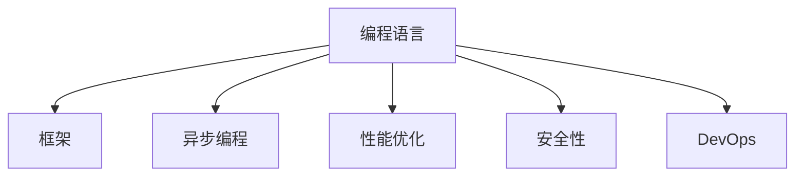

                 

# 后端开发：服务器端编程语言与框架

> 关键词：服务器端编程语言,框架,性能优化,安全性,异步编程,微服务,API设计,DevOps

## 1. 背景介绍

### 1.1 问题由来
在现代互联网应用中，后端服务承担着处理数据请求、生成响应以及调用外部服务的重要职责。一个后端系统的开发、维护、扩展和运维涉及多个技术环节。其中，选择一款合适的编程语言和框架是构建高效、安全、可扩展后端系统的基础。随着技术的发展，新的编程语言和框架层出不穷，开发者需要具备快速学习和适应新技术的能力。本文将系统介绍后端开发中常用的服务器端编程语言和框架，并对其核心概念与联系进行深入阐述，为读者提供一个清晰的技术框架。

### 1.2 问题核心关键点
后端开发涉及的核心问题包括：
- 选择合适的编程语言和框架，以适应不同场景下的需求。
- 理解并运用这些语言和框架的核心特性，提升开发效率和系统性能。
- 解决常见问题，如异步编程、性能优化、安全性等。
- 学习和应用DevOps理念，实现持续集成和持续部署。

### 1.3 问题研究意义
选择合适的编程语言和框架，对于提升后端开发效率、保障系统安全、支持高并发处理以及实现高质量的持续集成和持续部署具有重要意义。本文通过对主流编程语言和框架的介绍，希望帮助开发者更好地选择和应用这些工具，促进技术创新和行业应用。

## 2. 核心概念与联系

### 2.1 核心概念概述

为了更好地理解后端开发中常用的编程语言和框架，本节将介绍几个密切相关的核心概念：

- 编程语言（Programming Language）：指用于编写计算机程序的一种形式化语言。不同的编程语言具有不同的语法、语义和特性，适合不同的开发场景。
- 框架（Framework）：指用于实现特定功能或解决特定问题的代码集合。框架通常包括标准库、模板、库和组件，用于简化开发流程，提升开发效率。
- 异步编程（Asynchronous Programming）：指通过非阻塞的方式并发处理多个任务，提高系统响应速度和吞吐量。
- 性能优化（Performance Optimization）：指通过合理的设计和实现，提高程序的运行效率和资源利用率。
- 安全性（Security）：指在开发和运行过程中，保障数据和系统的安全，防止恶意攻击和数据泄露。
- DevOps（Development and Operations）：指开发（Development）与运维（Operations）的紧密结合，通过自动化和持续集成（CI）/持续部署（CD），提高系统交付效率和质量。

这些核心概念之间的逻辑关系可以通过以下Mermaid流程图来展示：



这个流程图展示了几者之间的关系：

1. 编程语言是基础，框架基于编程语言构建。
2. 异步编程、性能优化、安全性是编程语言的衍生特性，框架可能提供这些特性。
3. DevOps是软件开发和运维相结合的范式，框架和编程语言都是DevOps工具链的组成部分。

## 3. 核心算法原理 & 具体操作步骤
### 3.1 算法原理概述

后端开发的核心任务是通过编程语言和框架实现对客户端请求的处理，生成响应，并调用其他服务。该过程涉及数据处理、网络通信、系统设计和性能调优等多个方面。以下是几个常用的核心算法原理：

1. **请求处理**：后端服务通过监听特定端口或协议，接收来自客户端的请求。请求处理的核心是解析请求参数、验证参数安全性和合法性，并根据请求类型调用相应的处理逻辑。
2. **数据处理**：包括数据的读取、存储、转换和计算。数据的处理方式和工具依赖于具体应用场景和语言/框架特性。
3. **网络通信**：涉及数据的传输和同步，可能通过HTTP、TCP/UDP等协议实现。性能优化和安全性是网络通信中的关键问题。
4. **系统设计**：包括架构设计、模块划分、接口设计和状态管理等。良好的系统设计能够提高可维护性和可扩展性。
5. **性能调优**：通过算法优化、资源管理、并发处理等手段，提升系统响应速度和处理能力。
6. **安全性**：包括输入验证、数据加密、认证和授权等措施，确保系统免受恶意攻击和数据泄露。

### 3.2 算法步骤详解

后端开发的算法步骤主要分为以下几个阶段：

1. **需求分析**：明确应用场景、功能需求和性能指标，确定适合的编程语言和框架。
2. **系统设计**：基于需求，设计系统的架构、模块和接口，确定数据存储和传输方式。
3. **编码实现**：选择合适的编程语言和框架，实现系统功能。
4. **性能调优**：通过测试和分析，找出系统瓶颈，并进行优化。
5. **安全测试**：通过模拟攻击等手段，发现和修复系统漏洞。
6. **持续集成和部署**：建立自动化流程，确保代码的持续集成和持续部署，提升系统交付效率和质量。

### 3.3 算法优缺点

后端开发常用的编程语言和框架各有优缺点，选择时需综合考虑应用场景、开发效率、系统性能和安全性等因素。

- **优点**：
  - 提高开发效率：框架提供了一系列工具和库，减少重复代码编写。
  - 简化系统设计：框架提供了标准化的接口和组件，降低复杂度。
  - 提升性能：异步编程、多线程、缓存等特性提高处理能力和响应速度。
  - 增强安全性：框架提供安全机制，如输入验证、认证和授权。
  - 支持DevOps：框架和语言内置自动化工具，支持CI/CD流程。

- **缺点**：
  - 学习曲线陡峭：框架和语言特性复杂，需要时间学习和适应。
  - 性能瓶颈：复杂的框架和库可能带来性能损耗。
  - 依赖性强：依赖特定框架和库，可能影响系统的灵活性和可扩展性。
  - 兼容性问题：不同框架和语言可能存在兼容性问题。
  - 安全性问题：依赖于框架提供的安全机制，可能存在漏洞。

### 3.4 算法应用领域

后端开发的应用领域非常广泛，以下列举几个主要领域：

- **Web应用**：通过HTTP协议处理来自客户端的请求，返回Web页面或API响应。
- **移动应用**：处理来自客户端的请求，与数据库和其他服务进行交互，提供数据和功能支持。
- **微服务架构**：通过微服务实现系统的模块化和可扩展性，支持高并发和大规模分布式系统。
- **数据处理和分析**：处理大规模数据，进行存储、查询、分析和计算。
- **机器学习**：处理大规模数据，训练和部署机器学习模型，实现智能应用。
- **物联网**：处理来自传感器和设备的请求，进行数据收集、存储和处理，实现物联网应用。

## 4. 数学模型和公式 & 详细讲解 & 举例说明（备注：数学公式请使用latex格式，latex嵌入文中独立段落使用 $$，段落内使用 $)
### 4.1 数学模型构建

后端开发涉及的数学模型主要与数据处理、性能优化和安全性相关。以下列举几个常见模型的构建方法：

1. **数据处理模型**：基于SQL或NoSQL数据库，构建数据读写和查询模型。常用的模型包括关系型数据库模型和文档数据库模型。
2. **性能优化模型**：通过负载均衡、缓存和异步处理等手段，构建高性能的系统模型。例如，使用Redis进行缓存，减少数据库读取次数，提升系统响应速度。
3. **安全性模型**：基于加密、认证和授权等技术，构建安全的数据传输和访问模型。例如，使用SSL/TLS协议进行数据加密和传输。

### 4.2 公式推导过程

- **数据处理模型的公式推导**：
  - 关系型数据库模型：
    $$
    \text{Select} \text{语句} = \text{Where} \text{条件} \text{ AND } \text{Order} \text{By} \text{字段}
    $$
  - 文档数据库模型：
    $$
    \text{Find} \text{语句} = \text{Field} \text{条件} \text{ AND } \text{Sort} \text{By} \text{字段}
    $$

- **性能优化模型的公式推导**：
  - 缓存命中率的公式：
    $$
    \text{命中率} = \frac{\text{缓存命中的次数}}{\text{请求次数}} \times 100\%
    $$
  - 负载均衡的公式：
    $$
    \text{响应时间} = \frac{\text{总处理时间}}{\text{并发请求数}} \times \text{请求数}
    $$

- **安全性模型的公式推导**：
  - SSL/TLS协议的安全性评估公式：
    $$
    \text{安全强度} = \text{密钥长度} \times \text{加密算法} \times \text{证书验证} \times \text{访问控制}
    $$

### 4.3 案例分析与讲解

以下通过几个案例，分析如何在具体场景中应用上述数学模型：

**案例1：Web应用的性能优化**
假设有一个在线电商网站，需要处理高并发请求。可以通过以下方式优化：
1. 使用Redis进行缓存，减少数据库读写次数。
2. 使用Nginx作为反向代理，进行负载均衡，提升系统响应速度。
3. 使用异步处理技术，如Python的asyncio库，提高系统并发处理能力。

**案例2：微服务的安全性设计**
假设有一个微服务架构的应用，需要处理来自不同服务的请求。可以通过以下方式提升安全性：
1. 使用OAuth2.0协议进行认证和授权。
2. 使用HTTPS协议进行数据加密。
3. 使用API网关进行请求路由和安全过滤。

## 5. 项目实践：代码实例和详细解释说明
### 5.1 开发环境搭建

为了进行后端开发的代码实践，需要搭建一个开发环境。以下是搭建Python开发环境的步骤：

1. **安装Python**：从官网下载并安装Python解释器。
2. **安装pip**：pip是Python的包管理工具，使用`pip install`命令安装。
3. **安装虚拟环境**：使用`virtualenv`或`conda`创建虚拟环境，避免全局依赖冲突。
4. **安装第三方库**：使用pip安装所需的第三方库，如Django、Flask等。
5. **配置开发环境**：设置环境变量，确保开发环境与生产环境一致。

### 5.2 源代码详细实现

以下通过几个Python框架的实现，介绍后端开发的常见操作：

**使用Django框架实现Web应用**
```python
# 安装Django框架
pip install django

# 创建Django项目和应用
django-admin startproject myproject
django-admin startapp myapp

# 配置数据库
DATABASES = {
    'default': {
        'ENGINE': 'django.db.backends.postgresql',
        'NAME': 'myproject',
        'USER': 'myuser',
        'PASSWORD': 'mypassword',
        'HOST': 'localhost',
        'PORT': '5432',
    }
}

# 定义视图函数
def hello(request):
    return HttpResponse('Hello, World!')

# 配置URL路由
urlpatterns = [
    path('', hello),
]
```

**使用Flask框架实现RESTful API**
```python
# 安装Flask框架
pip install flask

# 创建Flask应用
from flask import Flask, request, jsonify

app = Flask(__name__)

# 定义API路由
@app.route('/api/hello', methods=['GET'])
def hello():
    return jsonify({'message': 'Hello, World!'})

# 运行Flask应用
if __name__ == '__main__':
    app.run(debug=True, host='0.0.0.0', port=5000)
```

**使用Kafka进行消息队列**
```python
# 安装Kafka客户端
pip install kafka-python

# 创建Kafka消费者
from kafka import KafkaConsumer

consumer = KafkaConsumer('mytopic', bootstrap_servers=['localhost:9092'])

# 订阅消息
for message in consumer:
    print(message.value)
```

### 5.3 代码解读与分析

通过上述代码示例，可以看到后端开发中常见的框架和操作：

**Django框架**
- `Django Admin`：提供管理后台，简化数据库操作。
- `ORM`：提供对象关系映射，简化数据库查询操作。
- `模板引擎`：支持HTML模板渲染，简化页面生成。
- `Session`：提供会话管理，保存用户登录状态等。

**Flask框架**
- `路由`：定义API路由，处理请求和响应。
- `请求和响应对象`：处理HTTP请求和响应，提供JSON数据支持。
- `蓝图`：组织和封装代码，便于维护和扩展。
- `中间件`：处理HTTP请求和响应，提供跨域支持、压缩等功能。

**Kafka**
- `消费者`：订阅消息，提供异步处理机制。
- `生产者`：发送消息，支持高吞吐量和高可靠性。
- `分区和副本`：实现消息分布和容错，提升系统可靠性。
- `消费者组`：多个消费者共享同一个分区，提升处理效率。

## 6. 实际应用场景
### 6.1 电商应用

电商应用需要处理大量的订单、支付和物流信息。以下是一个基于Flask和Django的电商应用示例：

**订单处理系统**
```python
from django.contrib.auth.models import User
from django.views.decorators.csrf import csrf_exempt

@csrf_exempt
def create_order(request):
    if request.method == 'POST':
        user = User.objects.get(id=request.POST.get('user_id'))
        order = Order.objects.create(user=user)
        return HttpResponse('Order created')
```

**支付处理系统**
```python
from flask import Flask, request, jsonify

app = Flask(__name__)

@app.route('/api/payment', methods=['POST'])
def payment():
    amount = request.json.get('amount')
    status = 'success'
    return jsonify({'status': status, 'amount': amount})
```

**物流跟踪系统**
```python
from kafka import KafkaProducer

producer = KafkaProducer(bootstrap_servers=['localhost:9092'])

def track_order(order_id):
    status = 'in_progress'
    producer.send('tracking', status)
```

### 6.2 社交应用

社交应用需要处理大量的用户信息、消息和关系。以下是一个基于Flask和Kafka的社交应用示例：

**用户信息管理**
```python
from flask import Flask, request, jsonify

app = Flask(__name__)

@app.route('/user', methods=['POST'])
def create_user():
    username = request.json.get('username')
    password = request.json.get('password')
    user = User.objects.create(username=username, password=password)
    return jsonify({'user': user})
```

**消息推送系统**
```python
from kafka import KafkaProducer

producer = KafkaProducer(bootstrap_servers=['localhost:9092'])

def send_message(to_user, message):
    producer.send('message', {'to_user': to_user, 'message': message})
```

**好友关系管理**
```python
from django.contrib.auth.models import User

def add_friend(from_user, to_user):
    user = User.objects.get(id=to_user)
    from_user.friends.add(user)
```

### 6.3 金融应用

金融应用需要处理大量的交易、账户和风险信息。以下是一个基于Django和Flask的金融应用示例：

**交易处理系统**
```python
from django.views.decorators.csrf import csrf_exempt

@csrf_exempt
def execute_trade(request):
    if request.method == 'POST':
        trade_id = request.POST.get('trade_id')
        status = 'completed'
        return HttpResponse('Trade executed')
```

**账户管理系统**
```python
from flask import Flask, request, jsonify

app = Flask(__name__)

@app.route('/account', methods=['POST'])
def create_account():
    account_number = request.json.get('account_number')
    balance = request.json.get('balance')
    account = Account.objects.create(account_number=account_number, balance=balance)
    return jsonify({'account': account})
```

**风险监控系统**
```python
from kafka import KafkaConsumer

consumer = KafkaConsumer('risk', bootstrap_servers=['localhost:9092'])

def monitor_risk():
    for message in consumer:
        risk_level = message.value.get('risk_level')
        if risk_level > 0.5:
            # 处理高风险交易
```

### 6.4 未来应用展望

未来，随着云计算、大数据、人工智能等技术的发展，后端开发将面临更多的挑战和机遇。以下是一些未来应用展望：

**云原生应用**
云原生应用将更加强调容器化、服务化、自动化和微服务化。后端开发将更多地依赖云平台提供的PaaS和SaaS服务，提升开发效率和系统弹性。

**大数据和机器学习**
大数据和机器学习技术的发展将使后端开发更加依赖数据分析和智能决策。后端服务将更多地与数据湖、数据仓库和机器学习模型进行集成，提供智能应用和个性化服务。

**微服务和DevOps**
微服务和DevOps理念将使后端开发更加注重系统的模块化和自动化。通过DevOps工具链，实现持续集成和持续部署，提升系统交付效率和质量。

**异步编程和并发处理**
异步编程和并发处理技术的发展将使后端服务更加高效和可靠。后端开发将更多地使用异步编程框架和并发处理技术，提升系统响应速度和吞吐量。

## 7. 工具和资源推荐
### 7.1 学习资源推荐

为了帮助开发者掌握后端开发的核心技术和框架，以下是一些优秀的学习资源：

1. **官方文档和教程**：包括Python、Django、Flask等官方文档和教程，提供详细的基础知识和实践指导。
2. **在线课程**：Coursera、Udacity、edX等平台提供丰富的后端开发课程，涵盖从基础到高级的各个阶段。
3. **书籍**：《Flask Web Development》、《Django Web Development》、《Web Application Security》等经典书籍，提供深入的知识点和案例分析。
4. **博客和社区**：如Stack Overflow、Django官方社区、Flask官方社区等，提供丰富的技术交流和问题解答。

### 7.2 开发工具推荐

为了提升后端开发的效率和质量，以下是一些常用的开发工具：

1. **IDE**：如PyCharm、Visual Studio Code等，提供代码编写、调试和测试功能。
2. **数据库管理工具**：如MySQL Workbench、phpMyAdmin等，提供数据库管理和可视化操作。
3. **版本控制工具**：如Git、SVN等，提供版本控制和协作开发功能。
4. **代码托管平台**：如GitHub、Bitbucket等，提供代码托管和协作开发功能。
5. **自动化测试工具**：如JUnit、pytest等，提供单元测试和集成测试功能。

### 7.3 相关论文推荐

后端开发涉及的技术和框架不断发展，以下是一些相关的经典论文和研究：

1. **Web应用架构模式**：Papini, M., Kohler, M., & Griesser, S. (2019). Web Application Architecture Patterns. CRC Press.
2. **微服务架构**：Dolgostin, V., & Dizdar, B. (2020). Microservice Architecture. Springer.
3. **异步编程**：Brett, M. (2013). Asynchronous Programming with Python. No Starch Press.
4. **DevOps实践**：Williams, A. (2020). Continuous Integration: A DevOps Goal.

## 8. 总结：未来发展趋势与挑战
### 8.1 研究成果总结

后端开发作为互联网应用的重要组成部分，涵盖了编程语言、框架、性能优化、安全性等多个方面。本文系统介绍了这些核心技术，帮助读者构建高效、安全、可扩展的后端系统。

### 8.2 未来发展趋势

后端开发将面临以下发展趋势：

1. **云原生应用**：云原生理念将推动后端服务架构向模块化、服务化和自动化方向发展，提升系统的灵活性和可扩展性。
2. **大数据和机器学习**：大数据和机器学习技术的应用将使后端服务更加智能化和个性化，提供更精准的数据分析和智能决策。
3. **异步编程和并发处理**：异步编程和并发处理技术的发展将使后端服务更加高效和可靠，提升系统响应速度和处理能力。
4. **DevOps实践**：DevOps理念将推动后端服务的持续集成和持续部署，提升系统交付效率和质量。
5. **安全性和可扩展性**：系统安全性将受到越来越多的关注，开发者需要注重安全机制的设计和实施，同时提升系统的可扩展性和弹性。

### 8.3 面临的挑战

后端开发面临以下挑战：

1. **技术栈选择**：选择适合的编程语言和框架，需要综合考虑性能、安全性、可扩展性等因素，存在一定的技术成本。
2. **性能优化**：优化系统性能需要不断测试和调优，提高系统响应速度和吞吐量。
3. **安全性**：保障系统安全需要综合考虑数据加密、认证和授权等技术，防止恶意攻击和数据泄露。
4. **代码质量**：提高代码质量需要遵循编码规范和测试策略，避免代码冗余和漏洞。
5. **技术演进**：保持技术演进需要持续学习和更新，关注最新的技术和趋势。

### 8.4 研究展望

未来，后端开发将更多地关注以下几个方面：

1. **自动化和智能化**：提升开发效率和系统智能化水平，利用自动化工具和人工智能技术，提升开发和运营效率。
2. **可扩展性和弹性**：提升系统的可扩展性和弹性，支持高并发和大规模分布式系统。
3. **数据驱动决策**：利用大数据和机器学习技术，提升系统的决策能力和个性化水平。
4. **安全性**：提升系统的安全性和隐私保护水平，防止恶意攻击和数据泄露。
5. **用户体验**：提升系统的用户体验和可用性，提供更好的用户界面和交互体验。

通过持续学习和创新，后端开发将不断提升系统的性能、安全性和用户体验，为互联网应用提供更强大的支持。

## 9. 附录：常见问题与解答

**Q1：后端开发常用的编程语言和框架有哪些？**

A: 后端开发常用的编程语言和框架包括Python的Django、Flask，Java的Spring Boot，Node.js的Express等。这些框架提供了丰富的功能和工具，适合不同的开发场景和需求。

**Q2：后端开发如何提高系统性能？**

A: 后端开发可以通过以下方式提升系统性能：
1. 使用异步编程和并发处理技术，提升系统响应速度和吞吐量。
2. 使用缓存机制，减少数据库读写次数。
3. 优化代码逻辑和算法，减少不必要的计算。
4. 使用负载均衡和CDN，提升系统处理能力和可靠性。

**Q3：后端开发如何保障系统安全性？**

A: 后端开发可以通过以下方式提升系统安全性：
1. 使用HTTPS协议进行数据加密和传输。
2. 使用OAuth2.0协议进行认证和授权。
3. 使用防火墙和入侵检测系统，防止恶意攻击。
4. 对用户输入进行严格的输入验证和输出编码，防止XSS和SQL注入等攻击。

**Q4：后端开发如何支持微服务架构？**

A: 后端开发可以通过以下方式支持微服务架构：
1. 将系统划分为多个微服务，提升系统模块化和可扩展性。
2. 使用API网关和负载均衡，实现微服务的路由和管理。
3. 使用容器化和服务发现机制，提升微服务的部署和运维效率。
4. 使用数据库拆分和数据同步机制，提升微服务的灵活性和可靠性。

**Q5：后端开发如何支持DevOps实践？**

A: 后端开发可以通过以下方式支持DevOps实践：
1. 使用自动化测试工具和持续集成工具，实现代码的持续集成和持续部署。
2. 使用容器化和Kubernetes等工具，实现微服务的自动化部署和运维。
3. 使用监控和日志工具，实时监测系统性能和问题，及时处理异常。
4. 使用自动化代码审计和安全扫描工具，提升代码质量和安全性。

通过上述问题的解答，可以看到后端开发涉及的技术和挑战复杂多样，需要持续学习和创新。开发者需要综合考虑系统的性能、安全性和可扩展性，不断提升开发和运营效率。

---

作者：禅与计算机程序设计艺术 / Zen and the Art of Computer Programming

