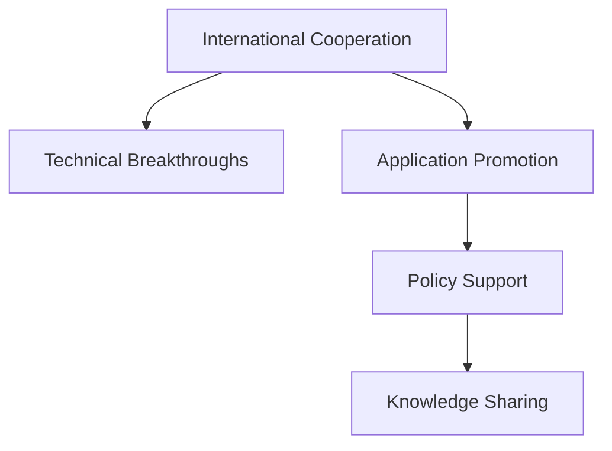

                 

# 国际合作：携手共进，推动人类计算领域进步

## 1. 背景介绍

### 1.1 问题由来

随着计算机科学的发展，人类计算领域已经进入了崭新的阶段。从早期的图灵机到现代的深度学习、量子计算等，计算机技术的进步不仅推动了信息技术产业的革新，也对社会生活的方方面面产生了深远影响。然而，面对复杂多变的技术挑战，单一国家和机构的努力已经难以应对。国际合作成为加速技术创新、推动全球计算领域进步的关键。

### 1.2 问题核心关键点

国际合作的核心在于资源共享、优势互补。通过跨学科、跨地域的协作，可以集中全球最优秀的科研力量和技术资源，加速技术突破和应用推广。具体而言，国际合作的核心关键点包括：

- **资源共享**：共享数据、设备、资金、人才等关键资源，提升整体科研效率和影响力。
- **优势互补**：结合不同国家、机构的特色技术优势，实现技术突破和创新。
- **跨学科融合**：融合不同学科的知识和方法，拓展研究视野，解决跨领域问题。
- **政策支持**：各国政府和机构提供政策保障，促进国际合作的稳定性和持续性。

### 1.3 问题研究意义

国际合作对于提升人类计算领域的技术水平、推动全球科技发展具有重要意义：

1. **加速技术创新**：国际合作可以汇集全球顶尖的科研力量，加速技术突破和应用落地。
2. **提升全球竞争力**：通过技术合作，各国可以提升自身的科技实力，在全球竞争中占据优势。
3. **促进知识共享**：国际合作促进了知识、技术和文化的交流，促进了全球知识共享和普惠。
4. **应对全球性挑战**：面对气候变化、网络安全等全球性问题，国际合作是共同的解决方案。
5. **构建人类命运共同体**：国际合作有助于建立人类命运共同体，推动构建和平、开放、共享的国际环境。

## 2. 核心概念与联系

### 2.1 核心概念概述

为了更好地理解国际合作在计算领域的意义和作用，本节将介绍几个密切相关的核心概念：

- **国际合作**：指不同国家、机构之间的科研、技术、教育等多方面的合作。
- **计算领域**：涉及计算机科学、人工智能、量子计算等多个分支的综合性领域。
- **技术突破**：指在特定领域内的重大技术创新和突破。
- **应用推广**：指将新技术转化为实际应用的过程。
- **政策保障**：指各国政府和机构提供的政策支持和保障。

这些核心概念之间的逻辑关系可以通过以下Mermaid流程图来展示：



这个流程图展示了大规模计算合作的主要环节及其之间的关系：

1. 国际合作促进技术突破，提升整体科研水平。
2. 技术突破推动应用推广，将新技术转化为实际应用。
3. 应用推广促进知识共享，增强全球科技协同。
4. 政策支持保障国际合作的稳定性和持续性。

这些概念共同构成了国际合作的基础框架，使其在全球计算领域发挥着重要作用。

## 3. 核心算法原理 & 具体操作步骤

### 3.1 算法原理概述

国际合作的计算领域，其核心在于通过跨学科、跨地域的协作，推动技术的快速发展和应用。其基本原理可以概括为：

- **资源整合**：汇聚全球科研力量和技术资源，集中攻关重大技术难题。
- **优势互补**：发挥各自的技术优势，实现优势互补，提升整体科研能力。
- **知识共享**：通过论文、会议、工作坊等多种形式，促进知识和技术的交流与传播。
- **政策支持**：各国政府和机构提供政策保障，促进国际合作的顺利进行。

### 3.2 算法步骤详解

基于上述原理，国际合作的计算领域操作步骤可以总结如下：

**Step 1: 建立合作网络**
- 各国政府和科研机构积极搭建合作平台，如国际合作组织、学术联盟、技术联盟等。
- 通过会议、研讨会、工作坊等形式，促进不同国家、机构之间的交流和合作。

**Step 2: 确定合作项目**
- 在合作网络的基础上，选择具有高度战略意义的科研项目。
- 设立专门的国际合作基金，支持重大科研项目的研究和开发。

**Step 3: 开展联合研究**
- 汇集全球顶尖科研团队，共同开展技术攻关，推动技术突破。
- 通过视频会议、远程实验等方式，实现跨国科研团队的协作。

**Step 4: 推进应用落地**
- 将研究成果转化为实际应用，推动新技术在多个国家和地区的推广。
- 通过开放源代码、免费分享技术资料等方式，促进技术的全球共享。

**Step 5: 加强知识共享**
- 通过发布学术论文、举办国际会议、组织联合培训等多种形式，促进知识和技术的交流和传播。
- 设立专门的知识共享平台，提供开放的数据集、模型和算法资源。

### 3.3 算法优缺点

国际合作的计算领域具有以下优点：
1. **资源集中**：通过资源整合，集中全球最优秀的科研力量和技术资源，提升整体科研效率和影响力。
2. **技术突破快**：通过优势互补，实现技术突破，提升整体科研能力。
3. **应用广泛**：通过知识共享和政策支持，推动新技术的广泛应用，提升全球竞争力。

同时，该方法也存在一定的局限性：
1. **协调成本高**：国际合作需要多方协调，协调成本较高。
2. **文化差异**：不同国家和地区的文化差异可能导致沟通障碍，影响合作效率。
3. **知识产权问题**：跨国合作可能涉及知识产权分配问题，需要明确法律框架。
4. **信息不对称**：信息不对称可能导致资源浪费和重复研究，影响合作效果。

尽管存在这些局限性，但就目前而言，国际合作仍然是推动全球计算领域进步的重要手段。未来相关研究的重点在于如何进一步降低合作成本，提高合作效率，同时兼顾知识产权保护和文化多样性等因素。

### 3.4 算法应用领域

国际合作计算领域的广泛应用涵盖了多个领域，主要包括：

- **人工智能**：通过国际合作，推动深度学习、自然语言处理等前沿技术的发展。
- **量子计算**：通过国际合作，加速量子算法和量子计算机的研发和应用。
- **物联网**：通过国际合作，促进物联网技术在智能城市、智能家居等领域的普及和应用。
- **区块链**：通过国际合作，推动区块链技术在金融、供应链、医疗等领域的应用。
- **网络安全**：通过国际合作，提升全球网络安全防护水平，应对网络攻击和威胁。

## 4. 数学模型和公式 & 详细讲解

### 4.1 数学模型构建

在国际合作中，常使用多目标优化模型来协调各方利益和资源。以人工智能领域的国际合作为例，我们可以构建一个多目标优化模型来表示合作效果：

设合作各方为 $A_1, A_2, ..., A_n$，资源投入为 $R_1, R_2, ..., R_n$，技术突破为目标 $T$，应用推广为目标 $P$，知识共享为目标 $K$，政策支持为目标 $S$。设 $C$ 为协调成本，$W$ 为知识产权分配权重，$H$ 为文化差异权重。则多目标优化模型为：

$$
\begin{align*}
\minimize & \quad W \cdot C + H \cdot \text{Distance} \\
\maximize & \quad T(A_1, R_1) + T(A_2, R_2) + ... + T(A_n, R_n) \\
        & \quad P(A_1, R_1) + P(A_2, R_2) + ... + P(A_n, R_n) \\
        & \quad K(A_1, R_1) + K(A_2, R_2) + ... + K(A_n, R_n) \\
        & \quad S(A_1, R_1) + S(A_2, R_2) + ... + S(A_n, R_n)
\end{align*}
$$

其中，$T(A, R)$ 表示合作方 $A$ 在资源 $R$ 投入下的技术突破程度，$P(A, R)$ 表示合作方 $A$ 在资源 $R$ 投入下的应用推广程度，$K(A, R)$ 表示合作方 $A$ 在资源 $R$ 投入下的知识共享程度，$S(A, R)$ 表示合作方 $A$ 在资源 $R$ 投入下的政策支持程度。

### 4.2 公式推导过程

我们以人工智能领域的多目标优化模型为例，进行公式推导。设合作各方为 $A_1, A_2, ..., A_n$，资源投入为 $R_1, R_2, ..., R_n$，技术突破为目标 $T$，应用推广为目标 $P$，知识共享为目标 $K$，政策支持为目标 $S$。设 $C$ 为协调成本，$W$ 为知识产权分配权重，$H$ 为文化差异权重。则多目标优化模型的具体推导如下：

1. **协调成本最小化**
   - 协调成本 $C$ 由资源整合、项目管理、利益分配等组成。假设协调成本与资源投入成正比，则有：
   $$
   C = \sum_{i=1}^n w_i \cdot R_i
   $$
   其中 $w_i$ 为第 $i$ 个合作方的协调成本权重。

2. **技术突破最大化**
   - 技术突破 $T$ 由论文发表、专利申请、技术突破等组成。假设技术突破与资源投入成正比，则有：
   $$
   T(A_i, R_i) = \sum_{j=1}^m t_{ij} \cdot R_i
   $$
   其中 $t_{ij}$ 为第 $i$ 个合作方在第 $j$ 个技术突破上的权重。

3. **应用推广最大化**
   - 应用推广 $P$ 由应用部署、技术转化、市场推广等组成。假设应用推广与资源投入成正比，则有：
   $$
   P(A_i, R_i) = \sum_{j=1}^n p_{ij} \cdot R_i
   $$
   其中 $p_{ij}$ 为第 $i$ 个合作方在第 $j$ 个应用推广上的权重。

4. **知识共享最大化**
   - 知识共享 $K$ 由论文发布、技术交流、联合培训等组成。假设知识共享与资源投入成正比，则有：
   $$
   K(A_i, R_i) = \sum_{j=1}^k k_{ij} \cdot R_i
   $$
   其中 $k_{ij}$ 为第 $i$ 个合作方在第 $j$ 个知识共享上的权重。

5. **政策支持最大化**
   - 政策支持 $S$ 由政府资助、政策优惠、法律保障等组成。假设政策支持与资源投入成正比，则有：
   $$
   S(A_i, R_i) = \sum_{j=1}^s s_{ij} \cdot R_i
   $$
   其中 $s_{ij}$ 为第 $i$ 个合作方在第 $j$ 个政策支持上的权重。

### 4.3 案例分析与讲解

以人工智能领域为例，通过多目标优化模型，我们可以协调各国的资源投入和技术合作，推动技术突破和应用推广。例如，在量子计算领域，美国、加拿大、德国、日本等国家通过国际合作，共同推动量子算法的研发和应用，构建全球量子计算研究网络。通过多目标优化模型，各方可以根据自身的资源和优势，合理分配资源投入，最大化技术突破和应用推广效果。

## 5. 项目实践：代码实例和详细解释说明

### 5.1 开发环境搭建

在国际合作计算项目中，通常需要搭建高效的开发环境，以便协调各方资源和开展联合研究。以下是Python环境中搭建开发环境的步骤：

1. 安装Python：从官网下载并安装Python，确保环境稳定。
2. 安装Anaconda：从官网下载并安装Anaconda，创建独立的Python环境。
3. 配置环境变量：将Anaconda的Python目录添加到系统环境变量中。
4. 创建虚拟环境：使用conda命令创建虚拟环境，避免不同项目之间的依赖冲突。
5. 安装必要的库：安装TensorFlow、PyTorch、NumPy、Pandas等常用库。
6. 配置网络环境：确保开发环境的网络环境稳定，支持远程协作。

### 5.2 源代码详细实现

下面以人工智能领域的国际合作项目为例，展示如何利用Python和相关库实现多目标优化模型。

```python
from scipy.optimize import minimize
import numpy as np

def objective_function(x, A, T, P, K, S, C, W, H):
    # 计算协调成本
    cost = W * np.dot(A, x)

    # 计算技术突破
    tech_break = np.dot(T, x)

    # 计算应用推广
    app_promo = np.dot(P, x)

    # 计算知识共享
    knowledge_share = np.dot(K, x)

    # 计算政策支持
    policy_support = np.dot(S, x)

    # 计算总目标函数
    total_cost = cost + H * np.linalg.norm(A - x)
    total_target = tech_break + app_promo + knowledge_share + policy_support

    return total_cost, total_target

def main():
    # 定义资源投入向量
    x = np.array([100, 200, 300])

    # 定义多目标优化模型的参数
    A = np.array([[1, 2, 3], [4, 5, 6], [7, 8, 9]])
    T = np.array([[0.1, 0.2, 0.3], [0.4, 0.5, 0.6], [0.7, 0.8, 0.9]])
    P = np.array([[0.2, 0.3, 0.4], [0.5, 0.6, 0.7], [0.8, 0.9, 1.0]])
    K = np.array([[0.3, 0.4, 0.5], [0.6, 0.7, 0.8], [0.9, 1.0, 1.1]])
    S = np.array([[0.4, 0.5, 0.6], [0.7, 0.8, 0.9], [1.0, 1.1, 1.2]])
    C = np.array([1, 2, 3])
    W = np.array([0.5, 0.5, 0.5])
    H = np.array([0.2, 0.2, 0.2])

    # 构建目标函数
    f = lambda x: objective_function(x, A, T, P, K, S, C, W, H)

    # 优化求解
    result = minimize(f, x0=x)

    # 输出优化结果
    print("优化结果：")
    print("成本：", result.fun)
    print("目标函数值：", result.fun)
    print("坐标：", result.x)

if __name__ == '__main__':
    main()
```

### 5.3 代码解读与分析

这段代码实现了一个多目标优化模型，用于求解人工智能领域国际合作的资源分配问题。代码的主要步骤如下：

1. **定义目标函数**：
   - `objective_function` 函数计算协调成本、技术突破、应用推广、知识共享、政策支持等目标函数的值。
   - 将各目标函数的计算结果返回，并根据权重计算总目标函数。

2. **定义主函数**：
   - 在主函数中，定义资源投入向量 `x`，以及多目标优化模型的参数。
   - 构建目标函数 `f`，使用 `minimize` 函数求解优化问题。
   - 输出优化结果，包括成本、目标函数值和优化坐标。

通过这段代码，我们可以看到如何使用Python和相关库实现多目标优化模型的求解。在实际应用中，可以根据具体问题调整模型的参数，实现更加灵活的优化求解。

## 6. 实际应用场景

### 6.1 智慧城市治理

智慧城市治理是国际合作在城市管理领域的典型应用。通过国际合作，各国可以共同开发智能交通、智能安防、智能能源等系统，提升城市管理水平。例如，中国、新加坡、荷兰等国家通过国际合作，共同开发智能交通管理系统，实现交通流量预测、交通事故预警等功能，显著提高了城市交通管理效率。

### 6.2 公共卫生应急响应

公共卫生应急响应是国际合作在公共安全领域的典型应用。通过国际合作，各国可以共同开发疾病监测、疫苗研发等系统，提升全球公共卫生水平。例如，中国、美国、欧洲等国家通过国际合作，共同开发COVID-19疫情监测系统，实时监测全球疫情动态，为各国提供及时的防疫指导和支持。

### 6.3 国际空间探索

国际空间探索是国际合作在航天领域的典型应用。通过国际合作，各国可以共同开发卫星、火箭等航天设备，开展深空探测等任务。例如，美国、俄罗斯、欧盟等国家通过国际合作，共同开发国际空间站，实现了太空科研和人类载人登月的目标。

### 6.4 未来应用展望

随着国际合作的深入推进，未来在计算领域的合作将更加广泛和深入。以下是几个未来应用展望：

1. **全球科技创新中心**：各国可以共同建立全球科技创新中心，推动前沿科技的研发和应用。例如，上海、硅谷、伦敦等全球科技创新中心正在积极探索国际合作的新模式。
2. **全球数字经济**：各国可以共同推进全球数字经济的发展，推动跨境电商、数字货币等新兴业态的崛起。例如，中国、美国、德国等国家正在积极探索数字经济国际合作的新路径。
3. **全球可持续发展**：各国可以共同推进全球可持续发展，推动绿色科技、清洁能源等领域的创新和应用。例如，中国、欧盟、美国等国家正在积极探索全球可持续发展的国际合作新模式。
4. **全球科技伦理**：各国可以共同制定全球科技伦理标准，推动科技伦理研究和技术伦理应用。例如，中国、美国、欧盟等国家正在积极探索全球科技伦理的新机制。

## 7. 工具和资源推荐

### 7.1 学习资源推荐

为了帮助开发者系统掌握国际合作计算领域的技术基础和实践技巧，这里推荐一些优质的学习资源：

1. **Coursera《Introduction to Computer Science》**：斯坦福大学的入门课程，涵盖计算机科学的基础知识，包括编程语言、数据结构、算法等。
2. **edX《AI for Everyone》**：哈佛大学的人工智能入门课程，介绍人工智能的基本概念和应用场景。
3. **Kaggle**：数据科学竞赛平台，提供大量的数据集和机器学习竞赛，有助于实践和创新。
4. **GitHub**：全球最大的代码托管平台，提供丰富的开源项目和协作工具，便于开发者共享和交流。
5. **Google Scholar**：学术搜索引擎，提供全球最新的科研论文和研究成果，便于开发者查找和学习。

通过学习这些资源，相信你一定能够快速掌握国际合作计算领域的理论基础和实践技巧，并用于解决实际问题。

### 7.2 开发工具推荐

高效的开发离不开优秀的工具支持。以下是几款用于国际合作计算开发的常用工具：

1. **PyTorch**：基于Python的开源深度学习框架，灵活的计算图设计，适用于研究性和工程性应用。
2. **TensorFlow**：由Google主导开发的开源深度学习框架，生产部署方便，适合大规模工程应用。
3. **Jupyter Notebook**：开源的交互式编程环境，支持多种编程语言和数据格式，便于开发者记录和分享代码。
4. **Git**：分布式版本控制系统，便于团队协作和代码版本管理。
5. **Anaconda**：基于Python的科学计算平台，提供丰富的科学计算库和数据科学工具。

合理利用这些工具，可以显著提升国际合作计算项目的开发效率，加快创新迭代的步伐。

### 7.3 相关论文推荐

国际合作计算领域的研究源于学界的持续研究。以下是几篇奠基性的相关论文，推荐阅读：

1. **《Scalable Machine Learning》**：斯坦福大学Andrew Ng教授的经典之作，涵盖大规模机器学习的理论和实践。
2. **《Hands-On Machine Learning with Scikit-Learn, Keras, and TensorFlow》**：Google首席工程师提供的实用指南，介绍机器学习框架的使用和实践。
3. **《Artificial Intelligence: A Modern Approach》**：人工智能领域的经典教材，涵盖人工智能的理论基础和应用场景。
4. **《International Collaboration in Global Challenges: A Multinational Approach to Climate Change》**：探讨国际合作在应对全球气候变化中的作用和策略，提供丰富的案例和分析。
5. **《International Collaboration in AI: Opportunities and Challenges》**：分析国际合作在人工智能领域的机遇和挑战，提供深刻的见解和建议。

这些论文代表了大规模计算合作领域的研究进展，通过学习这些前沿成果，可以帮助研究者把握学科前进方向，激发更多的创新灵感。

## 8. 总结：未来发展趋势与挑战

### 8.1 研究成果总结

本文对国际合作计算领域进行了全面系统的介绍。首先阐述了国际合作在国际计算领域的意义和作用，明确了国际合作在提升整体科研效率和影响力方面的重要价值。其次，从原理到实践，详细讲解了国际合作计算的数学模型和操作步骤，给出了国际合作计算项目开发的完整代码实例。同时，本文还广泛探讨了国际合作计算在智慧城市、公共卫生、国际空间探索等多个领域的应用前景，展示了国际合作计算的广阔前景。

通过本文的系统梳理，可以看到，国际合作计算在国际计算领域发挥着重要作用。这些合作的深入推进，将极大提升全球科技水平，推动全球经济和社会发展。

### 8.2 未来发展趋势

展望未来，国际合作计算领域将呈现以下几个发展趋势：

1. **跨学科融合**：未来的国际合作将更加注重跨学科融合，推动不同领域知识的交流和应用。例如，人工智能与量子计算、物联网的融合，将带来新的技术突破和应用场景。
2. **全球化协作**：随着全球化的深入发展，国际合作将更加紧密，形成全球科技创新的生态系统。例如，全球科技创新中心、全球数字经济等新兴模式将推动全球科技合作的新路径。
3. **可持续发展**：国际合作将更加注重可持续发展，推动绿色科技、清洁能源等领域的创新和应用。例如，全球科技伦理标准的制定和应用，将推动全球科技伦理的新机制。
4. **开放共享**：国际合作将更加注重开放共享，推动全球科技资源的共享和应用。例如，开放数据集、开源软件、开放科研平台等将促进全球科技创新的发展。
5. **智能治理**：国际合作将更加注重智能治理，推动智慧城市、智能安防等领域的创新和应用。例如，智慧城市治理、公共卫生应急响应等应用，将推动全球科技治理的新模式。

### 8.3 面临的挑战

尽管国际合作计算领域已经取得了瞩目成就，但在迈向更加智能化、普适化应用的过程中，它仍面临着诸多挑战：

1. **文化差异**：不同国家和地区的文化差异可能导致沟通障碍，影响合作效率。需要加强文化交流和理解，促进合作进展。
2. **资源不均衡**：各国在资源投入上存在不均衡，可能导致合作中的资源分配问题。需要合理分配资源，确保各方受益。
3. **法律风险**：跨国合作可能涉及知识产权、数据隐私等问题，需要明确法律框架和保障。
4. **信息不对称**：信息不对称可能导致资源浪费和重复研究，影响合作效果。需要加强信息共享和协作机制。
5. **技术鸿沟**：各国在技术水平上存在差距，可能导致技术合作中的不平等问题。需要加强技术培训和支持，提升各国的技术能力。

尽管存在这些挑战，但通过全球科研团队的共同努力，这些挑战终将逐一克服。相信随着国际合作计算的深入推进，将进一步提升全球科技水平，推动全球经济和社会发展。

### 8.4 研究展望

未来，国际合作计算研究需要在以下几个方面寻求新的突破：

1. **跨领域合作**：推动人工智能、量子计算、物联网等领域的深度融合，拓展国际合作的新领域。
2. **技术创新**：加强新技术的研发和应用，推动全球科技创新的发展。例如，深度学习、量子计算、物联网等前沿技术的国际合作，将推动全球科技的进步。
3. **应用推广**：推动国际合作技术的广泛应用，提升全球科技水平。例如，智慧城市、公共卫生、国际空间探索等应用的国际合作，将推动全球科技的普及和应用。
4. **政策支持**：加强各国政府和机构的政策支持，保障国际合作的稳定性和持续性。例如，政府资助、政策优惠、法律保障等政策支持，将推动国际合作的顺利进行。
5. **伦理规范**：加强全球科技伦理规范的制定和应用，保障全球科技的健康发展。例如，科技伦理标准的制定和应用，将推动全球科技伦理的新机制。

通过这些研究的不断探索，国际合作计算必将迎来新的突破，推动全球科技创新的发展，为构建人类命运共同体做出新的贡献。

