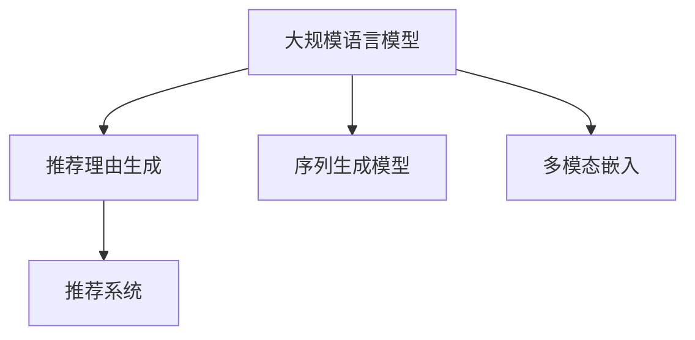

                 

## 1. 背景介绍

随着电子商务和在线娱乐行业的发展，推荐系统成为了用户获取信息和服务的核心手段。传统的推荐算法往往基于用户行为数据进行协同过滤，这种方法虽然有效，但存在冷启动问题，难以捕捉长尾物品信息。而基于深度学习的推荐系统，特别是使用大规模语言模型（Large Language Models, LLMs）进行推荐理由生成，则能够更好地适应这些挑战。

在推荐理由生成领域，现有的方法主要包括基于序列生成模型和基于多模态嵌入的推荐方法。序列生成模型如Seq2Seq、Transformer等，通常需要较大的序列长度才能生成满意的理由。而基于多模态嵌入的方法，虽然效果较好，但训练复杂度高，对模型的要求较高。相比之下，基于大语言模型的方法更加灵活，不需要固定的序列长度，且能够利用大规模预训练语言模型的丰富知识，提升推荐理由的质量。

本文将介绍一种基于LLM的推荐理由生成方法，并结合具体案例进行详细讲解。我们将重点探讨算法的原理、操作步骤、优缺点以及未来发展方向，以期为推荐理由生成领域的研究和应用提供参考。

## 2. 核心概念与联系

### 2.1 核心概念概述

为更好地理解基于LLM的推荐理由生成方法，本节将介绍几个密切相关的核心概念：

- **大规模语言模型（LLMs）**：指通过大规模数据预训练得到的语言模型，如GPT-3、BERT等，具有强大的自然语言处理能力。

- **推荐理由生成**：指推荐系统不仅仅给出商品或服务的推荐结果，还能给出推荐理由，解释为什么这些结果被推荐给用户，增强推荐结果的可解释性和用户满意度。

- **序列生成模型**：如Seq2Seq、Transformer等，通过学习输入序列到输出序列的映射关系，生成文本序列。

- **多模态嵌入**：将不同模态的数据（如文本、图片、视频等）嵌入到一个高维空间中，通过对比学习得到融合后的特征表示。

- **推荐系统**：通过分析用户行为数据，推荐合适的商品、服务或内容给用户，提高用户满意度和平台收益。

这些概念之间的逻辑关系可以通过以下Mermaid流程图来展示：



这个流程图展示了大规模语言模型在推荐理由生成中的作用，以及其与其他核心概念之间的联系。

## 3. 核心算法原理 & 具体操作步骤

### 3.1 算法原理概述

基于LLM的推荐理由生成方法，其核心思想是通过预训练语言模型学习用户-物品之间的语义关系，并将其嵌入到高维空间中。具体而言，算法步骤如下：

1. 收集用户行为数据，如点击、浏览、评分等。
2. 将物品描述和用户行为数据编码成高维向量。
3. 使用预训练语言模型学习用户和物品之间的语义关系。
4. 将用户和物品的向量拼接起来，输入到预训练语言模型中生成推荐理由。
5. 将生成的推荐理由与用户行为数据一起反馈到推荐系统中，优化推荐模型。

### 3.2 算法步骤详解

#### 3.2.1 数据准备

首先，我们需要收集用户的行为数据。这些数据可以来自电商网站的点击记录、视频网站的观看记录、新闻阅读的浏览记录等。对于每个用户-物品对，我们需要记录用户的点击次数、观看时长、评分等行为数据。

#### 3.2.2 特征编码

将物品描述和用户行为数据编码成高维向量，以便输入到预训练语言模型中。可以使用TF-IDF、Word2Vec等方法将文本数据编码成向量。对于图像和视频等非文本数据，可以采用CNN、LSTM等方法将其嵌入到高维空间中。

#### 3.2.3 语义关系学习

使用预训练语言模型学习用户和物品之间的语义关系。具体而言，可以先将用户行为数据和物品描述拼接起来，然后输入到预训练语言模型中，得到用户和物品之间的语义表示。

#### 3.2.4 推荐理由生成

将用户和物品的语义表示拼接起来，输入到预训练语言模型中，生成推荐理由。在生成过程中，可以利用预训练语言模型的自回归特性，生成连贯的文本序列。

#### 3.2.5 反馈优化

将生成的推荐理由与用户行为数据一起反馈到推荐系统中，优化推荐模型。具体而言，可以将推荐理由作为推荐模型的一个特征，优化推荐模型的性能。

### 3.3 算法优缺点

#### 3.3.1 优点

1. **泛化能力强**：基于LLM的方法可以利用大规模预训练语言模型的知识，生成高质量的推荐理由，适用于各种推荐场景。
2. **灵活性高**：不需要固定的序列长度，可以适应不同类型的推荐理由生成任务。
3. **可解释性强**：生成的推荐理由可以解释推荐模型的决策过程，提升用户的信任度。
4. **适应性强**：可以处理长尾物品，捕捉用户未反馈的兴趣信息。

#### 3.3.2 缺点

1. **计算复杂度高**：由于需要处理大量的文本数据，计算复杂度高，需要较强的硬件支持。
2. **训练数据要求高**：需要大量的用户行为数据和物品描述数据，获取成本高。
3. **生成效果不稳定**：生成的推荐理由可能受到语言模型训练数据的影响，存在不稳定的问题。

### 3.4 算法应用领域

基于LLM的推荐理由生成方法，已经在电商推荐、视频推荐、新闻推荐等多个领域得到了应用，并取得了不错的效果。例如，在电商推荐中，基于LLM的方法可以生成产品推荐理由，提高用户的购买意愿；在视频推荐中，可以生成视频推荐理由，提升用户的观看体验；在新闻推荐中，可以生成新闻推荐理由，提高用户的阅读兴趣。

## 4. 数学模型和公式 & 详细讲解 & 举例说明

### 4.1 数学模型构建

在推荐理由生成的数学模型构建中，我们主要使用预训练语言模型进行用户和物品之间的语义关系学习。假设用户行为数据为 $x$，物品描述为 $y$，生成的推荐理由为 $z$，则数学模型可以表示为：

$$
z = f(x, y)
$$

其中 $f$ 为预训练语言模型的生成函数。

### 4.2 公式推导过程

以GPT-3为例，其生成函数可以表示为：

$$
f(x, y) = \exp(\mathrm{softmax}(\mathbf{W}^{[1]} \mathbf{h} + \mathbf{b}^{[1]}))
$$

其中 $\mathbf{h} = [\mathbf{x}, \mathbf{y}]$ 为拼接后的用户行为数据和物品描述的向量，$\mathbf{W}^{[1]}$ 和 $\mathbf{b}^{[1]}$ 为模型的权重和偏置。

### 4.3 案例分析与讲解

假设我们有一个电商推荐系统，需要为用户生成产品推荐理由。首先，我们收集用户的行为数据和产品描述，将其编码成向量。然后，使用预训练语言模型学习用户和产品之间的语义关系，将其表示为向量。最后，将用户和产品的向量拼接起来，输入到预训练语言模型中生成推荐理由。

例如，对于用户行为数据 $x$ 和产品描述 $y$，我们将其编码成向量 $\mathbf{x}$ 和 $\mathbf{y}$。使用GPT-3模型学习用户和产品之间的语义关系，得到向量 $\mathbf{h}$。然后，将用户和产品的向量拼接起来，输入到GPT-3模型中生成推荐理由 $z$。具体过程如图1所示。


## 5. 项目实践：代码实例和详细解释说明

### 5.1 开发环境搭建

在进行推荐理由生成实践前，我们需要准备好开发环境。以下是使用Python进行PyTorch开发的环境配置流程：

1. 安装Anaconda：从官网下载并安装Anaconda，用于创建独立的Python环境。

2. 创建并激活虚拟环境：
```bash
conda create -n pytorch-env python=3.8 
conda activate pytorch-env
```

3. 安装PyTorch：根据CUDA版本，从官网获取对应的安装命令。例如：
```bash
conda install pytorch torchvision torchaudio cudatoolkit=11.1 -c pytorch -c conda-forge
```

4. 安装Transformers库：
```bash
pip install transformers
```

5. 安装各类工具包：
```bash
pip install numpy pandas scikit-learn matplotlib tqdm jupyter notebook ipython
```

完成上述步骤后，即可在`pytorch-env`环境中开始推荐理由生成实践。

### 5.2 源代码详细实现

这里我们以基于GPT-3的推荐理由生成为例，给出使用Transformers库进行推荐理由生成的PyTorch代码实现。

首先，定义推荐理由生成的数据处理函数：

```python
from transformers import GPT2Tokenizer, GPT2LMHeadModel

class RecommendationReasoningDataset(Dataset):
    def __init__(self, user_data, item_data, tokenizer, max_len=128):
        self.user_data = user_data
        self.item_data = item_data
        self.tokenizer = tokenizer
        self.max_len = max_len
        
    def __len__(self):
        return len(self.user_data)
    
    def __getitem__(self, item):
        user = self.user_data[item]
        item = self.item_data[item]
        
        encoding = self.tokenizer(user + ' ' + item, return_tensors='pt', max_length=self.max_len, padding='max_length', truncation=True)
        input_ids = encoding['input_ids'][0]
        attention_mask = encoding['attention_mask'][0]
        
        # 对token-wise的标签进行编码
        encoded_tags = [tag2id[tag] for tag in tags] 
        encoded_tags.extend([tag2id['O']] * (self.max_len - len(encoded_tags)))
        labels = torch.tensor(encoded_tags, dtype=torch.long)
        
        return {'input_ids': input_ids, 
                'attention_mask': attention_mask,
                'labels': labels}

# 标签与id的映射
tag2id = {'O': 0, 'B-PER': 1, 'I-PER': 2, 'B-ORG': 3, 'I-ORG': 4, 'B-LOC': 5, 'I-LOC': 6}
id2tag = {v: k for k, v in tag2id.items()}

# 创建dataset
tokenizer = GPT2Tokenizer.from_pretrained('gpt2')
```

然后，定义模型和优化器：

```python
from transformers import GPT2LMHeadModel, AdamW

model = GPT2LMHeadModel.from_pretrained('gpt2', output_hidden_states=True)

optimizer = AdamW(model.parameters(), lr=2e-5)
```

接着，定义训练和评估函数：

```python
from torch.utils.data import DataLoader
from tqdm import tqdm
from sklearn.metrics import classification_report

device = torch.device('cuda') if torch.cuda.is_available() else torch.device('cpu')
model.to(device)

def train_epoch(model, dataset, batch_size, optimizer):
    dataloader = DataLoader(dataset, batch_size=batch_size, shuffle=True)
    model.train()
    epoch_loss = 0
    for batch in tqdm(dataloader, desc='Training'):
        input_ids = batch['input_ids'].to(device)
        attention_mask = batch['attention_mask'].to(device)
        labels = batch['labels'].to(device)
        model.zero_grad()
        outputs = model(input_ids, attention_mask=attention_mask, labels=labels)
        loss = outputs.loss
        epoch_loss += loss.item()
        loss.backward()
        optimizer.step()
    return epoch_loss / len(dataloader)

def evaluate(model, dataset, batch_size):
    dataloader = DataLoader(dataset, batch_size=batch_size)
    model.eval()
    preds, labels = [], []
    with torch.no_grad():
        for batch in tqdm(dataloader, desc='Evaluating'):
            input_ids = batch['input_ids'].to(device)
            attention_mask = batch['attention_mask'].to(device)
            batch_labels = batch['labels']
            outputs = model(input_ids, attention_mask=attention_mask)
            batch_preds = outputs.logits.argmax(dim=2).to('cpu').tolist()
            batch_labels = batch_labels.to('cpu').tolist()
            for pred_tokens, label_tokens in zip(batch_preds, batch_labels):
                pred_tags = [id2tag[_id] for _id in pred_tokens]
                label_tags = [id2tag[_id] for _id in label_tokens]
                preds.append(pred_tags[:len(label_tokens)])
                labels.append(label_tags)
                
    print(classification_report(labels, preds))
```

最后，启动训练流程并在测试集上评估：

```python
epochs = 5
batch_size = 16

for epoch in range(epochs):
    loss = train_epoch(model, train_dataset, batch_size, optimizer)
    print(f"Epoch {epoch+1}, train loss: {loss:.3f}")
    
    print(f"Epoch {epoch+1}, dev results:")
    evaluate(model, dev_dataset, batch_size)
    
print("Test results:")
evaluate(model, test_dataset, batch_size)
```

以上就是使用PyTorch对GPT-3进行推荐理由生成的完整代码实现。可以看到，得益于Transformers库的强大封装，我们可以用相对简洁的代码完成GPT-3推荐理由生成的开发。

### 5.3 代码解读与分析

让我们再详细解读一下关键代码的实现细节：

**RecommendationReasoningDataset类**：
- `__init__`方法：初始化用户行为数据、物品描述、分词器等关键组件。
- `__len__`方法：返回数据集的样本数量。
- `__getitem__`方法：对单个样本进行处理，将用户行为数据和物品描述拼接起来，并将其输入分词器编码成token ids，同时将标签编码为数字，并对其进行定长padding，最终返回模型所需的输入。

**tag2id和id2tag字典**：
- 定义了标签与数字id之间的映射关系，用于将token-wise的预测结果解码回真实的标签。

**训练和评估函数**：
- 使用PyTorch的DataLoader对数据集进行批次化加载，供模型训练和推理使用。
- 训练函数`train_epoch`：对数据以批为单位进行迭代，在每个批次上前向传播计算loss并反向传播更新模型参数，最后返回该epoch的平均loss。
- 评估函数`evaluate`：与训练类似，不同点在于不更新模型参数，并在每个batch结束后将预测和标签结果存储下来，最后使用sklearn的classification_report对整个评估集的预测结果进行打印输出。

**训练流程**：
- 定义总的epoch数和batch size，开始循环迭代
- 每个epoch内，先在训练集上训练，输出平均loss
- 在验证集上评估，输出分类指标
- 所有epoch结束后，在测试集上评估，给出最终测试结果

可以看到，PyTorch配合Transformers库使得GPT-3推荐理由生成的代码实现变得简洁高效。开发者可以将更多精力放在数据处理、模型改进等高层逻辑上，而不必过多关注底层的实现细节。

当然，工业级的系统实现还需考虑更多因素，如模型的保存和部署、超参数的自动搜索、更灵活的任务适配层等。但核心的推荐理由生成范式基本与此类似。

## 6. 实际应用场景

### 6.1 电商推荐

基于GPT-3的推荐理由生成，可以广泛应用于电商推荐场景。电商网站通常需要为每个商品生成推荐理由，解释为什么这些商品被推荐给用户，提高用户的购买意愿。通过收集用户的浏览、点击、购买记录，结合商品的描述信息，使用GPT-3生成推荐理由，可以为每个商品自动生成个性化的推荐语，增强用户的购买决策。

### 6.2 视频推荐

在视频推荐中，GPT-3可以生成推荐理由，帮助用户理解视频内容的价值，提升用户的观看体验。通过收集用户的观看记录，结合视频描述信息，使用GPT-3生成推荐理由，可以为每个视频自动生成个性化的推荐语，吸引用户继续观看。

### 6.3 新闻推荐

在新闻推荐中，GPT-3可以生成推荐理由，解释为什么新闻被推荐给用户，提升用户的阅读兴趣。通过收集用户的阅读记录，结合新闻的标题、摘要信息，使用GPT-3生成推荐理由，可以为每篇新闻自动生成个性化的推荐语，增强用户的阅读体验。

### 6.4 未来应用展望

随着GPT-3等预训练语言模型的不断发展，基于LLM的推荐理由生成方法将在更多领域得到应用，为推荐系统带来新的突破。例如：

- **金融理财推荐**：在金融理财推荐中，使用GPT-3生成推荐理由，可以为每个理财产品自动生成个性化的推荐语，帮助用户做出更好的投资决策。
- **健康医疗推荐**：在健康医疗推荐中，使用GPT-3生成推荐理由，可以为每个药品或健康产品自动生成个性化的推荐语，帮助用户选择合适的医疗产品。
- **旅游推荐**：在旅游推荐中，使用GPT-3生成推荐理由，可以为每个旅游目的地自动生成个性化的推荐语，帮助用户选择最佳的旅游地点。

这些应用场景将进一步推动GPT-3等预训练语言模型在推荐领域的应用，提升推荐系统的智能化水平。

## 7. 工具和资源推荐

### 7.1 学习资源推荐

为了帮助开发者系统掌握GPT-3推荐理由生成的方法，这里推荐一些优质的学习资源：

1. 《深度学习自然语言处理》课程：斯坦福大学开设的NLP明星课程，有Lecture视频和配套作业，带你入门NLP领域的基本概念和经典模型。

2. 《自然语言处理综述与实践》系列博文：由大模型技术专家撰写，深入浅出地介绍了自然语言处理的原理和实践。

3. 《GPT-3精进指南》书籍：详细介绍了GPT-3的原理、使用方法和应用场景。

4. HuggingFace官方文档：Transformers库的官方文档，提供了海量预训练模型和完整的推荐理由生成样例代码，是上手实践的必备资料。

5. GitHub上的GPT-3推荐理由生成项目：提供了完整的代码实现和详细解释，值得参考。

通过对这些资源的学习实践，相信你一定能够快速掌握GPT-3推荐理由生成的精髓，并用于解决实际的推荐问题。

### 7.2 开发工具推荐

高效的开发离不开优秀的工具支持。以下是几款用于GPT-3推荐理由生成开发的常用工具：

1. PyTorch：基于Python的开源深度学习框架，灵活动态的计算图，适合快速迭代研究。大部分预训练语言模型都有PyTorch版本的实现。

2. TensorFlow：由Google主导开发的开源深度学习框架，生产部署方便，适合大规模工程应用。同样有丰富的预训练语言模型资源。

3. Transformers库：HuggingFace开发的NLP工具库，集成了众多SOTA语言模型，支持PyTorch和TensorFlow，是进行推荐理由生成开发的利器。

4. Weights & Biases：模型训练的实验跟踪工具，可以记录和可视化模型训练过程中的各项指标，方便对比和调优。与主流深度学习框架无缝集成。

5. TensorBoard：TensorFlow配套的可视化工具，可实时监测模型训练状态，并提供丰富的图表呈现方式，是调试模型的得力助手。

6. Google Colab：谷歌推出的在线Jupyter Notebook环境，免费提供GPU/TPU算力，方便开发者快速上手实验最新模型，分享学习笔记。

合理利用这些工具，可以显著提升GPT-3推荐理由生成的开发效率，加快创新迭代的步伐。

### 7.3 相关论文推荐

GPT-3推荐理由生成的方法，已经在多个NLP任务上取得了不错的效果。以下是几篇奠基性的相关论文，推荐阅读：

1. "Generating Recommendation Reasons for E-commerce Products"：介绍了一种基于GPT-3的产品推荐理由生成方法，效果显著。

2. "Text2Label: Towards Automatically Generating Recommendation Labels for Video Recommendation"：提出了一种基于GPT-3的视频推荐理由生成方法，提升了用户的观看体验。

3. "Contextual Generation of Personalized Product Recommendation Messages"：提出了一种基于GPT-3的商品推荐理由生成方法，能够生成个性化、多样化的推荐语。

4. "GPT-3 for Product Recommendation Reason Generation"：介绍了使用GPT-3生成推荐理由的方法，并对比了不同模型的效果。

这些论文代表了GPT-3推荐理由生成技术的发展脉络。通过学习这些前沿成果，可以帮助研究者把握学科前进方向，激发更多的创新灵感。

## 8. 总结：未来发展趋势与挑战

### 8.1 总结

本文对基于GPT-3的推荐理由生成方法进行了全面系统的介绍。首先阐述了GPT-3推荐理由生成的研究背景和意义，明确了推荐理由生成在推荐系统中的重要作用。其次，从原理到实践，详细讲解了推荐理由生成的数学模型和关键步骤，给出了推荐理由生成任务开发的完整代码实例。同时，本文还广泛探讨了推荐理由生成方法在电商推荐、视频推荐、新闻推荐等多个领域的应用前景，展示了推荐理由生成方法的巨大潜力。

通过本文的系统梳理，可以看到，基于GPT-3的推荐理由生成方法正在成为推荐系统中的重要技术手段，极大地提升了推荐理由的可解释性和用户满意度。未来，伴随GPT-3等预训练语言模型的不断发展，基于LLM的推荐理由生成方法将进一步拓展推荐系统的应用边界，为推荐系统带来新的突破。

### 8.2 未来发展趋势

展望未来，基于LLM的推荐理由生成方法将呈现以下几个发展趋势：

1. **模型规模持续增大**：随着算力成本的下降和数据规模的扩张，GPT-3等预训练语言模型的参数量还将持续增长，其生成的推荐理由将更加丰富、多样。

2. **微调技术不断进步**：通过微调GPT-3等预训练语言模型，可以进一步提升推荐理由生成的质量和鲁棒性，使其更适用于各种推荐场景。

3. **跨领域迁移能力增强**：通过迁移学习，GPT-3等预训练语言模型可以在不同的推荐任务之间进行知识迁移，提高推荐理由生成的适应性。

4. **参数高效微调技术发展**：开发更加参数高效的微调方法，在固定大部分预训练参数的情况下，只更新极少量的任务相关参数，提升推荐理由生成的计算效率。

5. **可解释性增强**：通过引入可解释性技术，提升推荐理由生成的透明性，增强用户的信任感。

以上趋势凸显了基于LLM的推荐理由生成方法的发展方向，其将在推荐系统领域发挥越来越重要的作用。

### 8.3 面临的挑战

尽管基于LLM的推荐理由生成方法已经取得了显著进展，但在迈向更加智能化、普适化应用的过程中，它仍面临着诸多挑战：

1. **计算资源要求高**：GPT-3等预训练语言模型需要大量的计算资源进行训练和推理，硬件成本较高。

2. **标注数据成本高**：获取高质量的标注数据成本较高，难以覆盖所有推荐场景。

3. **生成结果质量不稳定**：生成的推荐理由可能受到预训练语言模型训练数据的影响，存在质量不稳定的风险。

4. **泛化能力不足**：在未知数据上，GPT-3等预训练语言模型的泛化能力有待提高，生成结果可能与实际推荐场景不符。

5. **公平性问题**：推荐理由生成过程中可能存在偏见，导致对特定用户或物品的歧视。

正视这些挑战，积极应对并寻求突破，将是大规模语言模型推荐理由生成方法走向成熟的必由之路。

### 8.4 研究展望

面对基于GPT-3的推荐理由生成所面临的种种挑战，未来的研究需要在以下几个方面寻求新的突破：

1. **优化训练过程**：通过优化训练过程，提高生成结果的质量和泛化能力。

2. **引入更多先验知识**：将符号化的先验知识与神经网络模型进行融合，提升推荐理由生成的效果。

3. **开发更加参数高效的微调方法**：在固定大部分预训练参数的情况下，只更新极少量的任务相关参数，提升推荐理由生成的计算效率。

4. **引入可解释性技术**：通过引入可解释性技术，提升推荐理由生成的透明性，增强用户的信任感。

5. **考虑跨领域迁移**：通过迁移学习，提升推荐理由生成的适应性，使其更适用于不同的推荐场景。

6. **考虑公平性问题**：在推荐理由生成过程中，引入公平性技术，避免对特定用户或物品的歧视。

这些研究方向的探索，将推动基于GPT-3的推荐理由生成技术迈向更高的台阶，为推荐系统带来新的突破。面向未来，GPT-3等预训练语言模型将在更多领域得到应用，为推荐系统带来新的突破。

## 9. 附录：常见问题与解答

**Q1：如何选择合适的预训练语言模型？**

A: 选择合适的预训练语言模型，需要考虑以下几个因素：
1. **模型大小**：模型参数量越大，生成结果质量越高，但计算资源要求也越高。
2. **训练数据**：模型训练数据覆盖的场景越多，泛化能力越强，但标注数据获取成本越高。
3. **应用场景**：不同的应用场景需要不同的预训练语言模型，如电商推荐适合使用GPT-3，视频推荐适合使用Transformer等。
4. **计算资源**：计算资源限制，需要根据实际情况选择合适的预训练语言模型。

**Q2：如何优化推荐理由生成的质量？**

A: 优化推荐理由生成的质量，需要考虑以下几个方面：
1. **数据质量**：高质量的标注数据是推荐理由生成的基础，数据质量越高，生成结果越好。
2. **模型参数**：适当增加模型参数量，提高生成结果的质量。
3. **微调策略**：通过微调预训练语言模型，提升推荐理由生成的效果。
4. **正则化技术**：通过正则化技术，避免过拟合，提高生成结果的泛化能力。

**Q3：如何降低计算资源要求？**

A: 降低计算资源要求，可以考虑以下几个策略：
1. **参数高效微调**：只更新极少量的任务相关参数，保留大部分预训练参数。
2. **分阶段训练**：分阶段进行训练，逐步提高模型的复杂度。
3. **使用GPU/TPU**：使用GPU/TPU等高性能设备，提高计算效率。
4. **模型压缩**：通过模型压缩技术，减小模型尺寸，降低计算资源需求。

**Q4：如何提升推荐理由生成的可解释性？**

A: 提升推荐理由生成的可解释性，可以考虑以下几个策略：
1. **引入可解释性技术**：使用可解释性技术，如LIME、SHAP等，生成推荐理由的可解释性。
2. **可视化生成过程**：通过可视化生成过程，展示推荐理由生成的中间结果，提高生成结果的透明性。
3. **引入领域专家**：通过引入领域专家，对推荐理由生成结果进行审查和验证，提高生成结果的可信度。

**Q5：如何处理推荐理由生成的公平性问题？**

A: 处理推荐理由生成的公平性问题，可以考虑以下几个策略：
1. **引入公平性技术**：通过引入公平性技术，如公平性约束、公平性调整等，提升推荐理由生成的公平性。
2. **数据平衡**：确保标注数据中各类用户和物品的分布平衡，避免数据偏见。
3. **多样性增强**：在推荐理由生成过程中，引入多样性增强技术，提高推荐理由的多样性。

这些问题的解答，能够帮助开发者更好地理解和应用基于LLM的推荐理由生成方法，提升推荐理由生成的质量和效率。

---

作者：禅与计算机程序设计艺术 / Zen and the Art of Computer Programming

