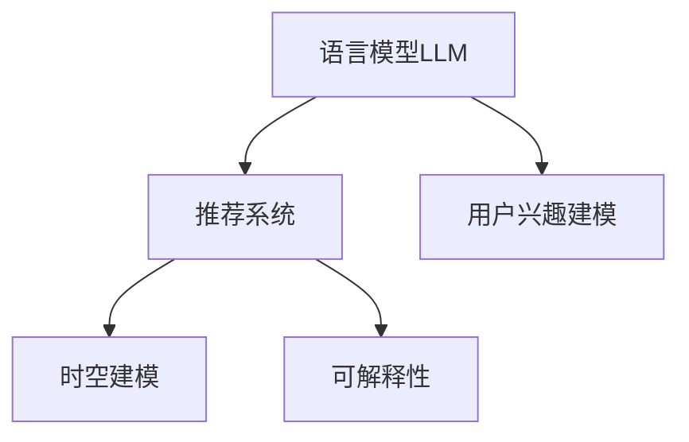

                 

## 1. 背景介绍

### 1.1 问题由来

在推荐系统领域，基于深度学习的方法，尤其是基于用户行为数据的推荐方法，已经取得了显著的成果。但随着用户行为数据量的增加和用户行为的复杂化，这些传统的基于历史行为数据的推荐方法在实际应用中遇到了一些问题，比如：

- **冷启动问题**：对于新用户或新商品，传统的推荐方法由于缺乏历史行为数据，难以进行有效的推荐。
- **长尾问题**：对于用户行为少见但需求量大的物品，传统推荐方法难以平衡热门物品和长尾物品的推荐效果。
- **上下文感知不足**：传统推荐方法往往忽视了用户行为的时空分布，导致推荐结果与当前用户的上下文环境不匹配。
- **用户体验波动**：推荐系统在推荐决策过程中的可解释性不足，用户体验不稳定。

为了解决这些问题，一种新的推荐方法逐渐兴起——基于语言模型（LLM）的推荐系统。LLM通过在语言数据的训练过程中，自然地获得了对用户兴趣、行为规律、上下文环境等的建模能力，从而能够更好地解决传统推荐系统存在的问题。

### 1.2 问题核心关键点

基于LLM的推荐系统核心关键点包括：

- **用户兴趣建模**：通过语言模型学习用户对物品的兴趣，解决冷启动和长尾问题。
- **时空建模**：通过语言模型捕捉用户兴趣的时空分布，提升推荐结果的时效性和上下文匹配性。
- **可解释性**：通过语言模型的输出，解释推荐决策的逻辑，增强用户体验。

本节将围绕以上关键点，对基于LLM的推荐系统进行系统介绍。

## 2. 核心概念与联系

### 2.1 核心概念概述

为更好地理解基于LLM的推荐系统，本节将介绍几个密切相关的核心概念：

- **语言模型（LLM）**：一种基于自然语言数据训练得到的深度神经网络模型，用于预测给定上下文下的下一个词或一段文本。
- **推荐系统**：根据用户的历史行为、偏好、兴趣等信息，为用户推荐商品或服务的系统。
- **用户兴趣建模**：通过分析用户的历史行为，学习用户对不同物品的兴趣，从而进行个性化推荐。
- **时空建模**：将用户兴趣与时间、地点等因素结合，捕捉用户兴趣的时空分布，提升推荐的时效性和上下文匹配性。
- **可解释性**：通过对推荐模型的输出进行解释，提高模型的透明性和可理解性，提升用户体验。

这些核心概念之间的逻辑关系可以通过以下Mermaid流程图来展示：



这个流程图展示了大语言模型在推荐系统中的应用框架，即通过语言模型捕捉用户兴趣，同时结合时空信息进行推荐，并通过可解释性增强用户体验。

## 3. 核心算法原理 & 具体操作步骤

### 3.1 算法原理概述

基于LLM的推荐系统，通过在大规模语言数据上训练的语言模型，学习用户对物品的兴趣、行为规律以及时空分布。然后，利用这些学习到的信息，对用户的未来行为进行预测，从而进行个性化推荐。

具体而言，基于LLM的推荐系统通常包括以下几个步骤：

1. **预训练**：在无标签的大规模语言数据上进行预训练，学习语言规律。
2. **微调**：在用户行为数据上进行微调，学习用户兴趣和行为规律。
3. **推理**：对新用户或新物品进行兴趣预测，进行个性化推荐。

### 3.2 算法步骤详解

**步骤1：预训练**

在无标签的大规模语言数据上进行预训练，学习语言规律。常用的预训练方法包括自回归语言模型（如GPT）和自编码语言模型（如BERT）。

**步骤2：微调**

在用户行为数据上进行微调，学习用户兴趣和行为规律。常用的微调方法包括：

- **全连接微调**：对整个模型进行微调，更新所有参数。
- **部分微调**：只微调部分参数，如权重矩阵、嵌入层等。
- **转移学习**：在大规模语言数据预训练的基础上，只在用户行为数据上微调部分参数，提升微调效率。

**步骤3：推理**

对新用户或新物品进行兴趣预测，进行个性化推荐。推荐模型通常使用以下步骤：

1. **编码**：将用户输入（如用户ID、商品ID）转换为向量表示。
2. **解码**：使用语言模型对输入向量进行解码，生成推荐结果。
3. **解码后处理**：对解码结果进行后处理，如排序、归一化等，得到最终的推荐列表。

### 3.3 算法优缺点

基于LLM的推荐系统有以下优点：

- **适应性强**：能够适应不同领域和不同规模的推荐场景。
- **灵活性高**：通过微调，模型可以不断学习新的用户兴趣和行为规律。
- **上下文感知**：通过时空建模，能够捕捉用户兴趣的时空分布，提升推荐的时效性和上下文匹配性。
- **可解释性强**：通过语言模型的输出，可以解释推荐决策的逻辑，增强用户体验。

但该方法也存在一些缺点：

- **计算成本高**：预训练和微调需要大量的计算资源和时间。
- **数据质量要求高**：微调的效果依赖于用户行为数据的质量和数量。
- **复杂度高**：模型结构复杂，需要进行精细的参数调整和优化。
- **鲁棒性不足**：模型对噪声和异常值比较敏感，需要进行鲁棒性优化。

### 3.4 算法应用领域

基于LLM的推荐系统在多个领域都有广泛的应用，包括但不限于：

- **电商推荐**：基于用户行为数据，为用户推荐商品。
- **新闻推荐**：根据用户阅读历史，推荐新闻文章。
- **视频推荐**：根据用户观看历史，推荐视频内容。
- **金融推荐**：根据用户交易历史，推荐金融产品。
- **医疗推荐**：根据患者病历记录，推荐治疗方案。

## 4. 数学模型和公式 & 详细讲解 & 举例说明

### 4.1 数学模型构建

基于LLM的推荐系统通常使用自回归语言模型（如GPT）或自编码语言模型（如BERT）。这里以自回归语言模型为例，构建推荐系统模型。

假设输入为 $x$，目标为 $y$，语言模型为 $p(y|x)$。则推荐系统的目标为最大化目标条件概率 $p(y|x)$，从而实现推荐。

### 4.2 公式推导过程

以自回归语言模型为例，假设模型为：

$$
\log p(y|x) = \sum_{i=1}^{n} \log \sigma(\sum_{j=1}^{n} w_{i,j}x_{i}y_{j} + b_{i})
$$

其中，$w$ 和 $b$ 为模型的权重和偏置。$x$ 为输入向量，$y$ 为目标向量。

通过最大似然估计，可以求解模型的权重和偏置：

$$
w = \frac{1}{N} \sum_{i=1}^{N} x_{i}y_{i}^T
$$
$$
b = \frac{1}{N} \sum_{i=1}^{N} y_{i}
$$

### 4.3 案例分析与讲解

以电商推荐系统为例，假设用户 $u$ 对商品 $i$ 的兴趣为 $p_{u,i}$。在电商平台上，用户的行为数据通常包括浏览记录、购买记录、评分记录等。这些数据可以用于训练和微调自回归语言模型。

在微调过程中，可以以用户ID和商品ID作为输入向量 $x$，将用户行为数据表示为二进制向量 $y$，利用目标条件概率 $p(y|x)$ 对模型进行微调。微调后的模型能够预测用户对不同商品的兴趣概率，从而进行个性化推荐。

## 5. 项目实践：代码实例和详细解释说明

### 5.1 开发环境搭建

在开始编写代码之前，需要准备以下开发环境：

- **Python 3.8**：使用最新版本的Python，确保能支持最新的深度学习库。
- **TensorFlow**：使用TensorFlow作为深度学习框架，其强大的计算图和自动微分功能，适合构建复杂模型。
- **Jupyter Notebook**：使用Jupyter Notebook作为开发环境，方便进行模型训练和调试。
- **GPU**：由于模型计算量大，建议使用GPU进行训练和推理。

### 5.2 源代码详细实现

以下是一个基于TensorFlow的自回归语言模型的实现示例。以电商推荐系统为例，代码如下：

```python
import tensorflow as tf
from tensorflow.keras import layers

# 构建自回归语言模型
class AutoRegModel(tf.keras.Model):
    def __init__(self, vocab_size, embedding_dim, num_layers):
        super(AutoRegModel, self).__init__()
        self.embedding = layers.Embedding(vocab_size, embedding_dim)
        self.gru = layers.GRU(embedding_dim, num_layers, return_sequences=True)
        self.fc = layers.Dense(vocab_size)

    def call(self, x):
        x = self.embedding(x)
        x = self.gru(x)
        x = self.fc(x[:, -1, :])
        return x

# 定义用户行为数据
train_data = tf.data.Dataset.from_tensor_slices(train_X, train_Y).batch(batch_size)

# 构建模型并编译
model = AutoRegModel(vocab_size, embedding_dim, num_layers)
model.compile(optimizer='adam', loss='categorical_crossentropy', metrics=['accuracy'])

# 训练模型
model.fit(train_data, epochs=num_epochs)
```

### 5.3 代码解读与分析

**AutoRegModel类**：
- `__init__`方法：初始化模型的各个组件，包括嵌入层、GRU层和全连接层。
- `call`方法：定义模型的前向传播过程。

**train_data**：
- 通过 `tf.data.Dataset` 将用户行为数据转换为TensorFlow的数据集对象，进行批处理。

**模型训练**：
- 使用 `compile`方法编译模型，指定优化器和损失函数。
- 使用 `fit`方法训练模型，并设置训练轮数。

## 6. 实际应用场景

### 6.1 电商推荐系统

在电商平台上，基于LLM的推荐系统可以实时预测用户对商品感兴趣的程度，为用户推荐商品。例如，通过分析用户的历史浏览、购买和评分记录，模型可以预测用户对未来商品的可能兴趣，从而进行个性化推荐。

### 6.2 新闻推荐系统

在新闻聚合平台上，基于LLM的推荐系统可以为用户推荐相关的新闻文章。通过分析用户阅读历史和文章内容，模型可以预测用户对不同文章的兴趣，从而进行个性化推荐。

### 6.3 视频推荐系统

在视频平台，基于LLM的推荐系统可以根据用户观看历史和视频内容，预测用户对未来视频内容的兴趣，进行个性化推荐。

### 6.4 金融推荐系统

在金融领域，基于LLM的推荐系统可以根据用户交易历史和市场动态，推荐金融产品。通过分析用户行为和市场变化，模型可以预测用户对不同金融产品的兴趣，从而进行个性化推荐。

## 7. 工具和资源推荐

### 7.1 学习资源推荐

为了帮助开发者系统掌握基于LLM的推荐系统的理论基础和实践技巧，这里推荐一些优质的学习资源：

1. **《深度学习》**：Ian Goodfellow等人所著的经典教材，涵盖了深度学习的基础理论和实践技巧，适合初学者和进阶者。
2. **《TensorFlow实战》**：李沐等人的开源书籍，详细介绍了TensorFlow的使用方法和最佳实践。
3. **《自然语言处理入门》**：李虎等人所著的入门教材，介绍了自然语言处理的基本概念和常用技术。
4. **《深度学习与推荐系统》**：王长宏等人的开源书籍，系统介绍了深度学习在推荐系统中的应用，包括基于LLM的推荐系统。
5. **在线课程**：Coursera、Udacity等平台的深度学习和自然语言处理课程，提供系统的学习资源和实战项目。

### 7.2 开发工具推荐

1. **TensorFlow**：强大的深度学习框架，支持分布式训练和推理。
2. **PyTorch**：灵活的深度学习框架，适合科研和实验。
3. **Jupyter Notebook**：方便进行交互式编程和数据可视化。
4. **JupyterLab**：基于Jupyter Notebook的交互式开发环境，支持多个交互窗口。
5. **GitHub**：代码托管平台，适合团队协作和版本控制。

### 7.3 相关论文推荐

大语言模型在推荐系统中的应用已有诸多研究，以下是几篇具有代表性的论文：

1. **Neural Collaborative Filtering using Adversarial Regularization**：使用自回归语言模型和对抗性正则化技术，构建推荐系统。
2. **A Deep Learning Approach for Recommendation Systems with Memory and Attention**：使用自回归语言模型和注意力机制，构建推荐系统。
3. **Improving Recommendation Systems with Self-supervised Learning**：使用自监督学习技术，提升推荐系统的性能。
4. **Towards Explainable Recommendation**：通过语言模型输出解释推荐决策，提高模型的透明性和可理解性。

## 8. 总结：未来发展趋势与挑战

### 8.1 总结

本文对基于LLM的推荐系统进行了全面系统的介绍。首先阐述了基于LLM的推荐系统的背景和意义，明确了用户兴趣建模、时空建模和可解释性在推荐系统中的核心价值。其次，从原理到实践，详细讲解了基于LLM的推荐系统的数学模型和算法步骤，给出了推荐系统开发的完整代码实例。同时，本文还广泛探讨了基于LLM的推荐系统在电商、新闻、视频、金融等多个行业领域的应用前景，展示了LLM在推荐系统中的巨大潜力。此外，本文精选了LLM推荐系统的各类学习资源，力求为读者提供全方位的技术指引。

通过本文的系统梳理，可以看到，基于LLM的推荐系统正在成为推荐系统的重要范式，极大地拓展了推荐系统的应用边界，催生了更多的落地场景。受益于大规模语言模型的知识储备和灵活性，LLM推荐系统能够更好地解决传统推荐系统存在的问题，为推荐系统的智能化和个性化发展提供了新的可能性。未来，伴随LLM技术的持续演进，相信推荐系统将在更广阔的应用领域大放异彩，深刻影响人类的生产生活方式。

### 8.2 未来发展趋势

展望未来，基于LLM的推荐系统将呈现以下几个发展趋势：

1. **自适应性增强**：通过更高效的微调方法，提升推荐系统的自适应性和灵活性。
2. **上下文感知增强**：结合更多维度的上下文信息，提升推荐的时效性和上下文匹配性。
3. **可解释性提升**：通过更加透明和可解释的推荐模型，提高用户体验。
4. **个性化推荐深化**：结合更多的用户行为数据，深化个性化推荐模型。
5. **多模态推荐拓展**：结合语音、图像、视频等多模态信息，拓展推荐系统的应用场景。
6. **实时推荐能力提升**：通过分布式计算和云服务，提升推荐系统的实时推荐能力。

### 8.3 面临的挑战

尽管基于LLM的推荐系统已经取得了瞩目成就，但在迈向更加智能化、普适化应用的过程中，它仍面临着诸多挑战：

1. **数据质量和数量**：推荐系统的性能依赖于高质量和大量标注数据，获取和处理这些数据需要大量的时间和成本。
2. **计算资源需求**：基于LLM的推荐系统计算资源需求高，需要高性能计算设备和算法优化。
3. **模型复杂度**：LLM模型结构复杂，需要精细的参数调整和优化。
4. **鲁棒性不足**：推荐系统对噪声和异常值比较敏感，需要进行鲁棒性优化。
5. **可解释性不足**：LLM模型的决策过程复杂，难以解释其内部工作机制和决策逻辑。
6. **数据隐私和安全**：推荐系统需要处理大量用户数据，如何保障数据隐私和安全是一个重要问题。

### 8.4 研究展望

面对基于LLM的推荐系统所面临的种种挑战，未来的研究需要在以下几个方面寻求新的突破：

1. **无监督学习的应用**：结合无监督学习技术，提升推荐系统的自适应性和鲁棒性。
2. **多模态融合**：结合多种模态数据，拓展推荐系统的应用场景。
3. **鲁棒性优化**：提升推荐系统的鲁棒性，使其在噪声和异常值条件下仍能稳定运行。
4. **可解释性增强**：通过更好的模型解释技术，提升推荐系统的透明性和可理解性。
5. **隐私保护**：结合隐私保护技术，保障推荐系统的数据隐私和安全。
6. **实时推荐**：通过分布式计算和云服务，提升推荐系统的实时推荐能力。

这些研究方向将推动基于LLM的推荐系统向更高层次发展，为推荐系统的智能化和个性化提供新的可能性。面向未来，基于LLM的推荐系统需要与其他人工智能技术进行更深入的融合，如知识表示、因果推理、强化学习等，共同推动推荐系统技术的进步。

## 9. 附录：常见问题与解答

**Q1：基于LLM的推荐系统是否适用于所有推荐场景？**

A: 基于LLM的推荐系统适用于大多数推荐场景，尤其是对于数据量较少或数据分布复杂的情况，LLM的通用性和适应性优势明显。但对于一些需要高度专业化知识的应用场景，如金融、医疗等，可能需要结合领域知识进行进一步优化。

**Q2：基于LLM的推荐系统在训练和微调过程中需要注意哪些问题？**

A: 基于LLM的推荐系统在训练和微调过程中，需要注意以下问题：
1. **数据质量和数量**：推荐系统的性能依赖于高质量和大量标注数据，获取和处理这些数据需要大量的时间和成本。
2. **计算资源需求**：LLM模型计算资源需求高，需要高性能计算设备和算法优化。
3. **模型复杂度**：LLM模型结构复杂，需要精细的参数调整和优化。
4. **鲁棒性不足**：推荐系统对噪声和异常值比较敏感，需要进行鲁棒性优化。
5. **可解释性不足**：LLM模型的决策过程复杂，难以解释其内部工作机制和决策逻辑。
6. **数据隐私和安全**：推荐系统需要处理大量用户数据，如何保障数据隐私和安全是一个重要问题。

**Q3：如何提高基于LLM的推荐系统的效率和性能？**

A: 提高基于LLM的推荐系统的效率和性能，可以从以下几个方面入手：
1. **模型压缩和优化**：使用模型压缩和优化技术，减小模型尺寸，提高推理速度。
2. **分布式计算**：通过分布式计算和云服务，提升推荐系统的实时推荐能力。
3. **数据预处理**：优化数据预处理流程，提高数据处理效率。
4. **特征工程**：结合领域知识进行特征工程，提升推荐系统的准确性和效果。
5. **算法优化**：优化训练和微调算法，提高模型的自适应性和鲁棒性。

**Q4：基于LLM的推荐系统在落地部署时需要注意哪些问题？**

A: 将基于LLM的推荐系统转化为实际应用，还需要考虑以下问题：
1. **模型裁剪**：去除不必要的层和参数，减小模型尺寸，提高推理速度。
2. **量化加速**：将浮点模型转为定点模型，压缩存储空间，提高计算效率。
3. **服务化封装**：将模型封装为标准化服务接口，便于集成调用。
4. **弹性伸缩**：根据请求流量动态调整资源配置，平衡服务质量和成本。
5. **监控告警**：实时采集系统指标，设置异常告警阈值，确保服务稳定性。
6. **安全防护**：采用访问鉴权、数据脱敏等措施，保障数据和模型安全。

**Q5：如何结合领域知识优化基于LLM的推荐系统？**

A: 结合领域知识优化基于LLM的推荐系统，可以从以下几个方面入手：
1. **领域本体构建**：构建领域本体，将其与LLM模型结合，增强模型的领域适应性。
2. **规则融合**：将领域知识规则与LLM模型结合，提高推荐系统的准确性和效果。
3. **多源数据融合**：结合领域内的多源数据，提高推荐系统的全面性和准确性。
4. **知识表示**：使用知识表示技术，增强模型的领域知识推理能力。
5. **领域个性化**：根据不同领域的特点，优化推荐模型，提高推荐系统的效果。

---

作者：禅与计算机程序设计艺术 / Zen and the Art of Computer Programming

