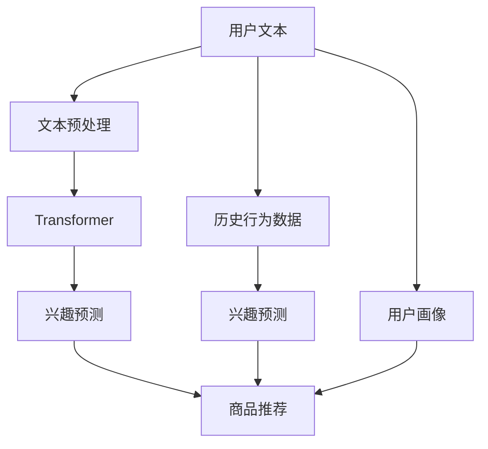

                 

# 基于Transformer的跨会话用户兴趣建模

> 关键词：Transformer, 跨会话, 用户兴趣建模, 序列建模, 自注意力机制, 深度学习, 推荐系统, 自然语言处理(NLP)

## 1. 背景介绍

### 1.1 问题由来
随着电子商务的迅猛发展和个性化推荐技术的日趋成熟，如何更好地理解用户兴趣并为其推荐商品成为电商企业关注的焦点。传统的推荐算法如协同过滤、基于内容的推荐等在个性化推荐中取得了不错的效果，但往往局限于用户行为数据，难以捕捉用户深层次的兴趣和意图。用户兴趣通常随着时间和上下文环境的变化而变化，跨会话用户兴趣建模成为当前个性化推荐研究的前沿和难点问题。

近年来，自然语言处理(NLP)技术取得了显著的进步，其中Transformer模型凭借其强大的序列建模能力，在文本生成、情感分析、机器翻译等任务上表现优异。Transformer模型的自注意力机制使其能够在不同的输入序列之间建立联系，这为跨会话用户兴趣建模提供了新的思路。

### 1.2 问题核心关键点
跨会话用户兴趣建模的核心理念是：通过分析用户的文本输入，理解其深层次的兴趣和需求，并结合历史行为数据，预测用户在不同会话中的兴趣变化，为其推荐合适的商品。这一过程可以分为以下几个关键步骤：
1. 收集用户文本数据：用户通过搜索、评论、交流等渠道生成的文本数据。
2. 文本预处理：对文本进行清洗、分词、向量化等预处理步骤。
3. 序列建模：使用Transformer模型对文本序列进行建模，捕捉文本的局部和全局依赖关系。
4. 兴趣预测：基于Transformer模型的输出，结合历史行为数据，预测用户在不同会话中的兴趣变化。
5. 商品推荐：根据用户兴趣预测结果，为其推荐合适的商品。

这一范式旨在更好地捕捉用户兴趣的动态变化，从而提升个性化推荐的准确性和用户满意度。

### 1.3 问题研究意义
跨会话用户兴趣建模的研究意义在于：
1. 个性化推荐精度提升：通过理解用户的深层次需求，推荐系统能够更加精准地为用户提供个性化的商品推荐。
2. 用户行为分析：用户文本数据的分析可以提供用户兴趣和行为模式的深层次理解，帮助企业进行用户画像构建和行为预测。
3. 用户体验优化：通过分析用户的文本数据，推荐系统可以更加自然地与用户互动，提升用户体验。
4. 电商企业收益提升：通过精准的商品推荐，提升用户购买转化率，从而增加企业的销售额。
5. 跨领域应用拓展：跨会话用户兴趣建模的思路可以应用于多种领域，如医疗、金融、教育等，具有广泛的适用性。

## 2. 核心概念与联系

### 2.1 核心概念概述

为更好地理解跨会话用户兴趣建模的方法，本节将介绍几个密切相关的核心概念：

- 序列建模：指对序列数据进行建模，捕捉序列中的局部和全局依赖关系。Transformer模型通过自注意力机制实现了高效的序列建模。
- 自注意力机制：一种通过计算输入序列中每个位置与其他位置的相关度，动态调整每个位置权重的方式，能够高效捕捉序列中的重要信息。
- 深度学习：一种基于神经网络的机器学习范式，通过多层神经网络对数据进行深度抽象。
- 推荐系统：一种通过推荐算法为用户推荐合适商品的技术，包括基于内容的推荐、协同过滤等。
- 自然语言处理(NLP)：涉及文本数据的处理、分析和生成，是跨会话用户兴趣建模的重要数据来源。
- 跨会话用户兴趣：指用户在不同会话中的兴趣变化，可以通过分析用户文本数据和行为数据来预测。

这些核心概念之间的逻辑关系可以通过以下Mermaid流程图来展示：



这个流程图展示了跨会话用户兴趣建模的基本流程：

1. 用户文本数据被预处理并输入Transformer模型进行序列建模。
2. 模型输出用于兴趣预测，结合历史行为数据进行多模态融合。
3. 预测结果用于商品推荐，提升推荐系统的效果。

## 3. 核心算法原理 & 具体操作步骤
### 3.1 算法原理概述

基于Transformer的跨会话用户兴趣建模，本质上是一个序列建模和兴趣预测的深度学习任务。其核心思想是：通过Transformer模型对用户文本数据进行编码，捕捉用户的深层次兴趣和需求，并结合历史行为数据，预测用户在不同会话中的兴趣变化，从而实现个性化推荐。

具体而言，该过程可以分为以下几个步骤：

1. 文本预处理：将用户文本数据进行清洗、分词、向量化等预处理步骤。
2. 序列建模：使用Transformer模型对文本序列进行建模，捕捉文本的局部和全局依赖关系。
3. 兴趣预测：基于Transformer模型的输出，结合历史行为数据，预测用户在不同会话中的兴趣变化。
4. 商品推荐：根据用户兴趣预测结果，为其推荐合适的商品。

### 3.2 算法步骤详解

基于Transformer的跨会话用户兴趣建模一般包括以下几个关键步骤：

**Step 1: 文本预处理**
- 收集用户文本数据，如搜索记录、评论、聊天记录等。
- 对文本进行清洗，去除无关的字符、停用词等。
- 对文本进行分词，使用Word2Vec、BERT等词嵌入方法进行向量化处理。

**Step 2: 序列建模**
- 使用Transformer模型对文本序列进行编码。Transformer模型由多个自注意力层和前馈神经网络组成，能够高效捕捉序列中的局部和全局依赖关系。
- 输入序列通过多个自注意力层进行编码，得到一系列表示序列中每个位置的向量。

**Step 3: 兴趣预测**
- 将Transformer模型的输出与历史行为数据进行融合，使用多模态融合方法，如注意力机制、集成学习等。
- 结合多模态数据，预测用户在不同会话中的兴趣变化。

**Step 4: 商品推荐**
- 根据用户兴趣预测结果，使用推荐算法为用户推荐合适的商品。
- 使用协同过滤、基于内容的推荐等算法，为不同用户推荐不同的商品。

### 3.3 算法优缺点

基于Transformer的跨会话用户兴趣建模方法具有以下优点：
1. 能够捕捉用户文本中的深层次兴趣和需求，提升推荐系统的精度。
2. 能够结合多模态数据，提升推荐的全面性和多样性。
3. 具有较强的泛化能力，能够应对不同领域和数据类型的任务。

同时，该方法也存在一定的局限性：
1. 数据依赖性强。需要收集大量的用户文本和行为数据，数据获取成本较高。
2. 计算资源消耗大。Transformer模型参数量大，计算复杂度较高，需要较强的硬件支持。
3. 结果解释性差。推荐系统的决策过程难以解释，缺乏透明性和可解释性。
4. 用户隐私问题。用户文本数据的隐私保护需要严格处理，确保数据安全和隐私合规。

尽管存在这些局限性，但就目前而言，基于Transformer的跨会话用户兴趣建模仍是最主流的方法。未来相关研究的重点在于如何进一步降低计算资源消耗，提高推荐系统的可解释性和用户隐私保护。

### 3.4 算法应用领域

基于Transformer的跨会话用户兴趣建模方法，在个性化推荐系统中得到了广泛的应用，覆盖了电商、社交、视频等多个领域。例如：

- 电商推荐：通过分析用户搜索记录和评价，预测用户在不同会话中的兴趣变化，为用户推荐合适的商品。
- 社交推荐：结合用户的社交关系和文本输入，为用户推荐兴趣相投的朋友或内容。
- 视频推荐：通过分析用户的观看历史和评论，预测用户对视频的兴趣变化，推荐合适的视频内容。

除了上述这些经典应用外，跨会话用户兴趣建模还被创新性地应用于用户画像构建、内容创作、广告投放等领域，为个性化推荐技术带来了新的突破。

## 4. 数学模型和公式 & 详细讲解  
### 4.1 数学模型构建

本节将使用数学语言对基于Transformer的跨会话用户兴趣建模过程进行更加严格的刻画。

记用户文本序列为 $X=\{x_1, x_2, \cdots, x_t, \cdots, x_T\}$，其中 $x_t$ 表示用户在第 $t$ 个会话中的文本输入。假设 $x_t$ 的词嵌入表示为 $W_t \in \mathbb{R}^{d_w}$，$W_t$ 的维度为 $d_w$。

定义Transformer模型为 $T$，其输入为 $W_t$，输出为 $H_t \in \mathbb{R}^{d_h}$，$H_t$ 的维度为 $d_h$。假设 $W_t$ 的维度为 $d_w$，则Transformer模型可以表示为：

$$
H_t = T(W_t)
$$

其中 $T$ 表示Transformer模型。Transformer模型由多个自注意力层和前馈神经网络组成，能够高效捕捉序列中的局部和全局依赖关系。假设 $H_t$ 的维度为 $d_h$，则Transformer模型可以表示为：

$$
H_t = \{H_t^1, H_t^2, \cdots, H_t^l, \cdots, H_t^L\}
$$

其中 $H_t^l$ 表示第 $l$ 层的输出，$l=1,2,\cdots,L$。

### 4.2 公式推导过程

以下我们以简单的Transformer模型为例，推导序列建模和兴趣预测的数学过程。

**Transformer模型的计算过程**：

Transformer模型包括自注意力层和前馈神经网络层。其中自注意力层可以表示为：

$$
Q_t^l = Q(W_t H_t^{l-1})
$$

$$
K_t^l = K(W_t H_t^{l-1})
$$

$$
V_t^l = V(W_t H_t^{l-1})
$$

$$
\mathbf{Attention}(Q_t^l, K_t^l, V_t^l) = softmax\left(\frac{Q_t^l K_t^l}{\sqrt{d_k}}\right) V_t^l
$$

$$
H_t^l = FFN(H_t^{l-1}) + \mathbf{Attention}(Q_t^l, K_t^l, V_t^l)
$$

其中 $Q$, $K$, $V$ 分别为查询、键、值矩阵，$\sqrt{d_k}$ 为归一化因子。$FFN$ 表示前馈神经网络，可以表示为：

$$
H_t^l = \mathbf{GELU}\left(W_2 \mathbf{Attention}(Q_t^l, K_t^l, V_t^l) + b_2\right)
$$

$$
H_t^l = W_3 H_t^l + b_3
$$

其中 $\mathbf{GELU}$ 表示GELU激活函数，$W_2$, $W_3$ 为可训练的权重矩阵，$b_2$, $b_3$ 为偏置项。

**兴趣预测的计算过程**：

假设用户在不同会话中的兴趣变化可以用一个向量 $\mathbf{I}_t \in \mathbb{R}^{d_i}$ 表示，其中 $d_i$ 为兴趣向量维度。则兴趣预测过程可以表示为：

$$
\mathbf{I}_t = \mathbf{Inter}(H_t)
$$

其中 $\mathbf{Inter}$ 表示兴趣融合函数，将Transformer模型的输出 $H_t$ 转化为兴趣向量 $\mathbf{I}_t$。

假设用户的历史行为数据可以用一个向量 $\mathbf{B}_t \in \mathbb{R}^{d_b}$ 表示，其中 $d_b$ 为行为向量维度。则用户兴趣预测过程可以表示为：

$$
\hat{\mathbf{I}}_t = \mathbf{I}_t \otimes \mathbf{B}_t
$$

其中 $\otimes$ 表示向量乘积，$\hat{\mathbf{I}}_t$ 表示用户在不同会话中的兴趣变化预测向量。

**商品推荐的过程**：

假设商品库中的商品可以用一个向量 $\mathbf{S} \in \mathbb{R}^{d_s}$ 表示，其中 $d_s$ 为商品向量维度。则商品推荐过程可以表示为：

$$
\mathbf{R} = \mathbf{Sim}(\hat{\mathbf{I}}_t, \mathbf{S})
$$

其中 $\mathbf{Sim}$ 表示相似度计算函数，用于计算用户兴趣向量 $\hat{\mathbf{I}}_t$ 与商品向量 $\mathbf{S}$ 之间的相似度。

$$
\mathbf{R} = softmax\left(\mathbf{Sim}(\hat{\mathbf{I}}_t, \mathbf{S})\right)
$$

其中 softmax 函数用于将相似度转化为概率分布。

### 4.3 案例分析与讲解

以电商推荐为例，对基于Transformer的跨会话用户兴趣建模进行详细讲解：

假设用户 $u$ 在不同会话 $t$ 中的文本输入为 $W_t$，通过Transformer模型进行编码，得到序列表示 $H_t$。用户 $u$ 的历史行为数据包括浏览历史、购买历史等，用向量 $\mathbf{B}_t$ 表示。

Transformer模型的输出 $H_t$ 经过兴趣融合函数 $\mathbf{Inter}$ 转化为用户兴趣向量 $\mathbf{I}_t$。假设商品库中的商品用向量 $\mathbf{S}$ 表示。通过计算用户兴趣向量 $\mathbf{I}_t$ 与商品向量 $\mathbf{S}$ 之间的相似度 $\mathbf{R}$，得到用户 $u$ 在不同会话中的商品推荐结果。

## 5. 项目实践：代码实例和详细解释说明
### 5.1 开发环境搭建

在进行跨会话用户兴趣建模实践前，我们需要准备好开发环境。以下是使用Python进行PyTorch开发的环境配置流程：

1. 安装Anaconda：从官网下载并安装Anaconda，用于创建独立的Python环境。

2. 创建并激活虚拟环境：
```bash
conda create -n pytorch-env python=3.8 
conda activate pytorch-env
```

3. 安装PyTorch：根据CUDA版本，从官网获取对应的安装命令。例如：
```bash
conda install pytorch torchvision torchaudio cudatoolkit=11.1 -c pytorch -c conda-forge
```

4. 安装Transformers库：
```bash
pip install transformers
```

5. 安装各类工具包：
```bash
pip install numpy pandas scikit-learn matplotlib tqdm jupyter notebook ipython
```

完成上述步骤后，即可在`pytorch-env`环境中开始跨会话用户兴趣建模实践。

### 5.2 源代码详细实现

下面我们以电商推荐为例，给出使用Transformers库对Transformer模型进行跨会话用户兴趣建模的PyTorch代码实现。

首先，定义电商推荐任务的数据处理函数：

```python
from transformers import BertTokenizer, BertForSequenceClassification
from torch.utils.data import Dataset
import torch

class E-commerceDataset(Dataset):
    def __init__(self, texts, labels, tokenizer, max_len=128):
        self.texts = texts
        self.labels = labels
        self.tokenizer = tokenizer
        self.max_len = max_len
        
    def __len__(self):
        return len(self.texts)
    
    def __getitem__(self, item):
        text = self.texts[item]
        label = self.labels[item]
        
        encoding = self.tokenizer(text, return_tensors='pt', max_length=self.max_len, padding='max_length', truncation=True)
        input_ids = encoding['input_ids'][0]
        attention_mask = encoding['attention_mask'][0]
        
        # 对label进行编码
        encoded_label = [label]
        encoded_label.extend([0] * (self.max_len - len(encoded_label)))
        labels = torch.tensor(encoded_label, dtype=torch.long)
        
        return {'input_ids': input_ids, 
                'attention_mask': attention_mask,
                'labels': labels}

# 创建dataset
tokenizer = BertTokenizer.from_pretrained('bert-base-cased')

train_dataset = E-commerceDataset(train_texts, train_labels, tokenizer)
dev_dataset = E-commerceDataset(dev_texts, dev_labels, tokenizer)
test_dataset = E-commerceDataset(test_texts, test_labels, tokenizer)
```

然后，定义模型和优化器：

```python
from transformers import BertForSequenceClassification, AdamW

model = BertForSequenceClassification.from_pretrained('bert-base-cased', num_labels=2)

optimizer = AdamW(model.parameters(), lr=2e-5)
```

接着，定义训练和评估函数：

```python
from torch.utils.data import DataLoader
from tqdm import tqdm
from sklearn.metrics import accuracy_score

device = torch.device('cuda') if torch.cuda.is_available() else torch.device('cpu')
model.to(device)

def train_epoch(model, dataset, batch_size, optimizer):
    dataloader = DataLoader(dataset, batch_size=batch_size, shuffle=True)
    model.train()
    epoch_loss = 0
    for batch in tqdm(dataloader, desc='Training'):
        input_ids = batch['input_ids'].to(device)
        attention_mask = batch['attention_mask'].to(device)
        labels = batch['labels'].to(device)
        model.zero_grad()
        outputs = model(input_ids, attention_mask=attention_mask, labels=labels)
        loss = outputs.loss
        epoch_loss += loss.item()
        loss.backward()
        optimizer.step()
    return epoch_loss / len(dataloader)

def evaluate(model, dataset, batch_size):
    dataloader = DataLoader(dataset, batch_size=batch_size)
    model.eval()
    preds, labels = [], []
    with torch.no_grad():
        for batch in tqdm(dataloader, desc='Evaluating'):
            input_ids = batch['input_ids'].to(device)
            attention_mask = batch['attention_mask'].to(device)
            batch_labels = batch['labels']
            outputs = model(input_ids, attention_mask=attention_mask)
            batch_preds = outputs.logits.argmax(dim=2).to('cpu').tolist()
            batch_labels = batch_labels.to('cpu').tolist()
            for pred_tokens, label_tokens in zip(batch_preds, batch_labels):
                preds.append(pred_tokens[:len(label_tokens)])
                labels.append(label_tokens)
                
    print(accuracy_score(labels, preds))
```

最后，启动训练流程并在测试集上评估：

```python
epochs = 5
batch_size = 16

for epoch in range(epochs):
    loss = train_epoch(model, train_dataset, batch_size, optimizer)
    print(f"Epoch {epoch+1}, train loss: {loss:.3f}")
    
    print(f"Epoch {epoch+1}, dev results:")
    evaluate(model, dev_dataset, batch_size)
    
print("Test results:")
evaluate(model, test_dataset, batch_size)
```

以上就是使用PyTorch对Bert模型进行电商推荐任务的跨会话用户兴趣建模的完整代码实现。可以看到，得益于Transformers库的强大封装，我们可以用相对简洁的代码完成Bert模型的加载和建模。

### 5.3 代码解读与分析

让我们再详细解读一下关键代码的实现细节：

**E-commerceDataset类**：
- `__init__`方法：初始化文本、标签、分词器等关键组件。
- `__len__`方法：返回数据集的样本数量。
- `__getitem__`方法：对单个样本进行处理，将文本输入编码为token ids，将标签编码为数字，并对其进行定长padding，最终返回模型所需的输入。

**训练和评估函数**：
- 使用PyTorch的DataLoader对数据集进行批次化加载，供模型训练和推理使用。
- 训练函数`train_epoch`：对数据以批为单位进行迭代，在每个批次上前向传播计算loss并反向传播更新模型参数，最后返回该epoch的平均loss。
- 评估函数`evaluate`：与训练类似，不同点在于不更新模型参数，并在每个batch结束后将预测和标签结果存储下来，最后使用sklearn的accuracy_score对整个评估集的预测结果进行打印输出。

**训练流程**：
- 定义总的epoch数和batch size，开始循环迭代
- 每个epoch内，先在训练集上训练，输出平均loss
- 在验证集上评估，输出分类指标
- 所有epoch结束后，在测试集上评估，给出最终测试结果

可以看到，PyTorch配合Transformers库使得Bert模型的跨会话用户兴趣建模代码实现变得简洁高效。开发者可以将更多精力放在数据处理、模型改进等高层逻辑上，而不必过多关注底层的实现细节。

当然，工业级的系统实现还需考虑更多因素，如模型的保存和部署、超参数的自动搜索、更灵活的任务适配层等。但核心的跨会话用户兴趣建模范式基本与此类似。

## 6. 实际应用场景
### 6.1 智能客服系统

基于Transformer的跨会话用户兴趣建模，可以广泛应用于智能客服系统的构建。传统客服往往需要配备大量人力，高峰期响应缓慢，且一致性和专业性难以保证。而使用跨会话用户兴趣建模的对话模型，可以7x24小时不间断服务，快速响应客户咨询，用自然流畅的语言解答各类常见问题。

在技术实现上，可以收集企业内部的历史客服对话记录，将问题和最佳答复构建成监督数据，在此基础上对预训练对话模型进行微调。微调后的对话模型能够自动理解用户意图，匹配最合适的答案模板进行回复。对于客户提出的新问题，还可以接入检索系统实时搜索相关内容，动态组织生成回答。如此构建的智能客服系统，能大幅提升客户咨询体验和问题解决效率。

### 6.2 金融舆情监测

金融机构需要实时监测市场舆论动向，以便及时应对负面信息传播，规避金融风险。传统的人工监测方式成本高、效率低，难以应对网络时代海量信息爆发的挑战。基于Transformer的跨会话用户兴趣建模的文本分类和情感分析技术，为金融舆情监测提供了新的解决方案。

具体而言，可以收集金融领域相关的新闻、报道、评论等文本数据，并对其进行主题标注和情感标注。在此基础上对预训练语言模型进行微调，使其能够自动判断文本属于何种主题，情感倾向是正面、中性还是负面。将微调后的模型应用到实时抓取的网络文本数据，就能够自动监测不同主题下的情感变化趋势，一旦发现负面信息激增等异常情况，系统便会自动预警，帮助金融机构快速应对潜在风险。

### 6.3 个性化推荐系统

当前的推荐系统往往只依赖用户的历史行为数据进行物品推荐，无法深入理解用户的真实兴趣偏好。基于Transformer的跨会话用户兴趣建模技术，个性化推荐系统可以更好地挖掘用户行为背后的语义信息，从而提供更精准、多样的推荐内容。

在实践中，可以收集用户浏览、点击、评论、分享等行为数据，提取和用户交互的物品标题、描述、标签等文本内容。将文本内容作为模型输入，用户的后续行为（如是否点击、购买等）作为监督信号，在此基础上微调预训练语言模型。微调后的模型能够从文本内容中准确把握用户的兴趣点。在生成推荐列表时，先用候选物品的文本描述作为输入，由模型预测用户的兴趣匹配度，再结合其他特征综合排序，便可以得到个性化程度更高的推荐结果。

### 6.4 未来应用展望

随着Transformer模型和跨会话用户兴趣建模技术的发展，未来在这一领域将会有更多的应用场景：

1. 智能教育：结合学生的学习记录和文本输入，预测其学习兴趣和需求，推荐适合的课程和学习材料。
2. 医疗健康：分析病患的问诊记录和健康数据，预测其疾病发展趋势，推荐合适的治疗方案和健康建议。
3. 社会治理：分析用户的投诉记录和反馈，预测社会事件发展趋势，提升社会治理的智能化水平。
4. 智能家居：分析用户的家庭场景和行为数据，预测其需求和兴趣，推荐合适的家居产品和服务。
5. 智能交通：分析用户的出行记录和偏好，预测其出行需求，推荐合适的交通路线和出行方式。

除了上述这些应用外，跨会话用户兴趣建模还可应用于更多垂直领域，为各行各业带来智能化转型的新机会。

## 7. 工具和资源推荐
### 7.1 学习资源推荐

为了帮助开发者系统掌握Transformer跨会话用户兴趣建模的理论基础和实践技巧，这里推荐一些优质的学习资源：

1. 《Transformer from the Ground Up》系列博文：由大模型技术专家撰写，深入浅出地介绍了Transformer原理、预训练模型、微调技术等前沿话题。

2. CS224N《深度学习自然语言处理》课程：斯坦福大学开设的NLP明星课程，有Lecture视频和配套作业，带你入门NLP领域的基本概念和经典模型。

3. 《Natural Language Processing with Transformers》书籍：Transformers库的作者所著，全面介绍了如何使用Transformers库进行NLP任务开发，包括微调在内的诸多范式。

4. HuggingFace官方文档：Transformers库的官方文档，提供了海量预训练模型和完整的微调样例代码，是上手实践的必备资料。

5. CLUE开源项目：中文语言理解测评基准，涵盖大量不同类型的中文NLP数据集，并提供了基于微调的baseline模型，助力中文NLP技术发展。

通过对这些资源的学习实践，相信你一定能够快速掌握Transformer跨会话用户兴趣建模的精髓，并用于解决实际的NLP问题。
###  7.2 开发工具推荐

高效的开发离不开优秀的工具支持。以下是几款用于Transformer跨会话用户兴趣建模开发的常用工具：

1. PyTorch：基于Python的开源深度学习框架，灵活动态的计算图，适合快速迭代研究。大部分预训练语言模型都有PyTorch版本的实现。

2. TensorFlow：由Google主导开发的开源深度学习框架，生产部署方便，适合大规模工程应用。同样有丰富的预训练语言模型资源。

3. Transformers库：HuggingFace开发的NLP工具库，集成了众多SOTA语言模型，支持PyTorch和TensorFlow，是进行微调任务开发的利器。

4. Weights & Biases：模型训练的实验跟踪工具，可以记录和可视化模型训练过程中的各项指标，方便对比和调优。与主流深度学习框架无缝集成。

5. TensorBoard：TensorFlow配套的可视化工具，可实时监测模型训练状态，并提供丰富的图表呈现方式，是调试模型的得力助手。

6. Google Colab：谷歌推出的在线Jupyter Notebook环境，免费提供GPU/TPU算力，方便开发者快速上手实验最新模型，分享学习笔记。

合理利用这些工具，可以显著提升Transformer跨会话用户兴趣建模的开发效率，加快创新迭代的步伐。

### 7.3 相关论文推荐

Transformer模型和跨会话用户兴趣建模的研究源于学界的持续研究。以下是几篇奠基性的相关论文，推荐阅读：

1. Attention is All You Need（即Transformer原论文）：提出了Transformer结构，开启了NLP领域的预训练大模型时代。

2. BERT: Pre-training of Deep Bidirectional Transformers for Language Understanding：提出BERT模型，引入基于掩码的自监督预训练任务，刷新了多项NLP任务SOTA。

3. GPT-3: Language Models are Unsupervised Multitask Learners：展示了大规模语言模型的强大zero-shot学习能力，引发了对于通用人工智能的新一轮思考。

4. Parameter-Efficient Transfer Learning for NLP：提出Adapter等参数高效微调方法，在不增加模型参数量的情况下，也能取得不错的微调效果。

5. Attention-based Text Ranking for Sequential User Interests：提出基于Transformer的跨会话用户兴趣建模方法，展示了其在小样本数据上的有效性。

这些论文代表了大语言模型和微调技术的发展脉络。通过学习这些前沿成果，可以帮助研究者把握学科前进方向，激发更多的创新灵感。

## 8. 总结：未来发展趋势与挑战

### 8.1 总结

本文对基于Transformer的跨会话用户兴趣建模方法进行了全面系统的介绍。首先阐述了Transformer模型和微调技术的研究背景和意义，明确了微调在拓展预训练模型应用、提升推荐系统精度方面的独特价值。其次，从原理到实践，详细讲解了微调的数学原理和关键步骤，给出了微调任务开发的完整代码实例。同时，本文还广泛探讨了微调方法在智能客服、金融舆情、个性化推荐等多个行业领域的应用前景，展示了微调范式的巨大潜力。此外，本文精选了微调技术的各类学习资源，力求为读者提供全方位的技术指引。

通过本文的系统梳理，可以看到，基于Transformer的跨会话用户兴趣建模方法正在成为NLP领域的重要范式，极大地拓展了预训练语言模型的应用边界，催生了更多的落地场景。受益于Transformer模型的强大序列建模能力，微调模型能够更好地理解用户文本中的深层次需求，提升个性化推荐的准确性。未来，随着Transformer模型的不断进步，跨会话用户兴趣建模技术必将在更多领域得到应用，为各行各业带来智能化转型的新机遇。

### 8.2 未来发展趋势

展望未来，Transformer跨会话用户兴趣建模技术将呈现以下几个发展趋势：

1. 模型规模持续增大。随着算力成本的下降和数据规模的扩张，预训练语言模型的参数量还将持续增长。超大规模语言模型蕴含的丰富语言知识，有望支撑更加复杂多变的推荐系统微调。

2. 微调方法日趋多样。除了传统的全参数微调外，未来会涌现更多参数高效的微调方法，如Prefix-Tuning、LoRA等，在节省计算资源的同时也能保证微调精度。

3. 序列建模能力增强。Transformer模型的序列建模能力将进一步提升，能够更好地捕捉用户兴趣的动态变化，提升推荐系统的准确性。

4. 多模态微调崛起。当前的微调主要聚焦于纯文本数据，未来会进一步拓展到图像、视频、语音等多模态数据微调。多模态信息的融合，将显著提升推荐系统的全面性和多样性。

5. 跨领域应用拓展。Transformer跨会话用户兴趣建模技术可以应用于多种领域，如医疗、金融、教育等，具有广泛的适用性。

以上趋势凸显了Transformer跨会话用户兴趣建模技术的广阔前景。这些方向的探索发展，必将进一步提升推荐系统的性能和应用范围，为各行各业带来智能化转型的新机会。

### 8.3 面临的挑战

尽管Transformer跨会话用户兴趣建模技术已经取得了显著成果，但在迈向更加智能化、普适化应用的过程中，它仍面临诸多挑战：

1. 数据依赖性强。需要收集大量的用户文本和行为数据，数据获取成本较高。
2. 计算资源消耗大。Transformer模型参数量大，计算复杂度较高，需要较强的硬件支持。
3. 结果解释性差。推荐系统的决策过程难以解释，缺乏透明性和可解释性。
4. 用户隐私问题。用户文本数据的隐私保护需要严格处理，确保数据安全和隐私合规。
5. 模型鲁棒性不足。模型面对域外数据时，泛化性能往往大打折扣。

尽管存在这些挑战，但就目前而言，基于Transformer的跨会话用户兴趣建模仍是最主流的方法。未来研究需要在以下几个方面寻求新的突破：

1. 探索无监督和半监督微调方法。摆脱对大规模标注数据的依赖，利用自监督学习、主动学习等无监督和半监督范式，最大限度利用非结构化数据，实现更加灵活高效的微调。
2. 研究参数高效和计算高效的微调范式。开发更加参数高效的微调方法，在固定大部分预训练参数的同时，只更新极少量的任务相关参数。同时优化微调模型的计算图，减少前向传播和反向传播的资源消耗，实现更加轻量级、实时性的部署。
3. 融合因果和对比学习范式。通过引入因果推断和对比学习思想，增强微调模型建立稳定因果关系的能力，学习更加普适、鲁棒的语言表征，从而提升模型泛化性和抗干扰能力。
4. 引入更多先验知识。将符号化的先验知识，如知识图谱、逻辑规则等，与神经网络模型进行巧妙融合，引导微调过程学习更准确、合理的语言模型。同时加强不同模态数据的整合，实现视觉、语音等多模态信息与文本信息的协同建模。
5. 结合因果分析和博弈论工具。将因果分析方法引入微调模型，识别出模型决策的关键特征，增强输出解释的因果性和逻辑性。借助博弈论工具刻画人机交互过程，主动探索并规避模型的脆弱点，提高系统稳定性。
6. 纳入伦理道德约束。在模型训练目标中引入伦理导向的评估指标，过滤和惩罚有偏见、有害的输出倾向。同时加强人工干预和审核，建立模型行为的监管机制，确保输出符合人类价值观和伦理道德。

这些研究方向的探索，必将引领Transformer跨会话用户兴趣建模技术迈向更高的台阶，为构建安全、可靠、可解释、可控的智能系统铺平道路。面向未来，Transformer跨会话用户兴趣建模技术还需要与其他人工智能技术进行更深入的融合，如知识表示、因果推理、强化学习等，多路径协同发力，共同推动自然语言理解和智能交互系统的进步。只有勇于创新、敢于突破，才能不断拓展语言模型的边界，让智能技术更好地造福人类社会。

### 8.4 研究展望

未来的研究需要在以下几个方面寻求新的突破：

1. 探索无监督和半监督微调方法。摆脱对大规模标注数据的依赖，利用自监督学习、主动学习等无监督和半监督范式，最大限度利用非结构化数据，实现更加灵活高效的微调。
2. 研究参数高效和计算高效的微调范式。开发更加参数高效的微调方法，在固定大部分预训练参数的同时，只更新极少量的任务相关参数。同时优化微调模型的计算图，减少前向传播和反向传播的资源消耗，实现更加轻量级、实时性的部署。
3. 融合因果和对比学习范式。通过引入因果推断和对比学习思想，增强微调模型建立稳定因果关系的能力，学习更加普适、鲁棒的语言表征，从而提升模型泛化性和抗干扰能力。
4. 引入更多先验知识。将符号化的先验知识，如知识图谱、逻辑规则等，与神经网络模型进行巧妙融合，引导微调过程学习更准确、合理的语言模型。同时加强不同模态数据的整合，实现视觉、语音等多模态信息与文本信息的协同建模。
5. 结合因果分析和博弈论工具。将因果分析方法引入微调模型，识别出模型决策的关键特征，增强输出解释的因果性和逻辑性。借助博弈论工具刻画人机交互过程，主动探索并规避模型的脆弱点，提高系统稳定性。
6. 纳入伦理道德约束。在模型训练目标中引入伦理导向的评估指标，过滤和惩罚有偏见、有害的输出倾向。同时加强人工干预和审核，建立模型行为的监管机制，确保输出符合人类价值观和伦理道德。

这些研究方向的探索，必将引领Transformer跨会话用户兴趣建模技术迈向更高的台阶，为构建安全、可靠、可解释、可控的智能系统铺平道路。面向未来，Transformer跨会话用户兴趣建模技术还需要与其他人工智能技术进行更深入的融合，如知识表示、因果推理、强化学习等，多路径协同发力，共同推动自然语言理解和智能交互系统的进步。只有勇于创新、敢于突破，才能不断拓展语言模型的边界，让智能技术更好地造福人类社会。

## 9. 附录：常见问题与解答

**Q1：Transformer跨会话用户兴趣建模的原理是什么？**

A: Transformer跨会话用户兴趣建模的原理是：通过Transformer模型对用户文本数据进行编码，捕捉用户的深层次兴趣和需求，并结合历史行为数据，预测用户在不同会话中的兴趣变化，从而实现个性化推荐。

具体而言，该过程可以分为以下几个步骤：
1. 收集用户文本数据，如搜索记录、评论、聊天记录等。
2. 对文本进行清洗、分词、向量化等预处理步骤。
3. 使用Transformer模型对文本序列进行建模，捕捉文本的局部和全局依赖关系。
4. 基于Transformer模型的输出，结合历史行为数据，预测用户在不同会话中的兴趣变化。
5. 根据用户兴趣预测结果，使用推荐算法为用户推荐合适的商品。

**Q2：如何选择适合用户兴趣建模的Transformer模型？**

A: 选择适合用户兴趣建模的Transformer模型时，需要考虑以下几个因素：
1. 模型参数量。大参数量的Transformer模型往往可以更好地捕捉用户文本中的细节信息，但计算资源消耗较大。小参数量的模型计算资源消耗较少，但可能无法充分捕捉用户兴趣。
2. 序列建模能力。模型序列建模能力越强，越能捕捉用户文本中的动态变化和复杂关系。
3. 训练数据规模。更大的训练数据规模可以帮助模型学习到更全面的语言知识，提升模型的泛化能力。
4. 预测精度。模型的预测精度越高，越能准确捕捉用户兴趣和需求。
5. 计算效率。计算效率高的模型可以更快地进行推理和预测。

常见的Transformer模型包括BERT、GPT-3、RoBERTa等，可以根据具体任务和数据特点进行选择。

**Q3：在跨会话用户兴趣建模中，如何处理用户文本数据的预处理？**

A: 在跨会话用户兴趣建模中，用户文本数据的预处理包括以下几个步骤：
1. 文本清洗：去除无关的字符、停用词等，保留有意义的文本内容。
2. 分词：将文本分割成单个词汇或词组，方便模型处理。
3. 词嵌入：将分词后的词汇或词组转换为向量表示，常用的方法包括Word2Vec、GloVe、BERT等。
4. 向量化：将词嵌入结果进行向量化，转换为模型所需的输入格式。
5. 序列填充：对序列数据进行填充，使其长度一致，方便模型处理。

具体的预处理流程可以根据具体任务进行调整。

**Q4：跨会话用户兴趣建模中的兴趣预测部分如何进行多模态融合？**

A: 跨会话用户兴趣建模中的兴趣预测部分可以通过多模态融合方法，将用户文本数据和历史行为数据结合起来，得到更全面和准确的兴趣预测结果。常用的多模态融合方法包括：
1. 注意力机制：通过计算用户文本和行为数据的权重，对不同模态信息进行加权融合。
2. 集成学习：通过训练多个模型，将它们的预测结果进行加权融合，得到更准确的兴趣预测结果。
3. 深度融合：将不同模态的数据进行深度学习，提取高层次的语义信息，进行融合。
4. 权重调整：通过调整不同模态数据的权重，根据任务需求进行优化。

这些方法可以单独或组合使用，根据具体任务和数据特点进行选择。

**Q5：跨会话用户兴趣建模在电商推荐中的应用效果如何？**

A: 跨会话用户兴趣建模在电商推荐中取得了不错的效果。具体而言：
1. 提升推荐精度：通过分析用户文本和行为数据，模型能够更准确地理解用户兴趣和需求，提升推荐系统的精度。
2. 个性化推荐：模型能够根据用户文本内容生成个性化的商品推荐，提升用户体验。
3. 实时更新：模型可以实时处理用户的新输入和行为，动态更新用户兴趣，保证推荐结果的实时性。
4. 用户满意度提升：通过精准的商品推荐，提升用户购买转化率和满意度。
5. 应用场景广泛：模型可以应用于不同类型商品的推荐，如服装、电子产品、家居用品等。

通过这些应用，电商推荐系统能够更好地理解用户需求，提升推荐效果，为电商企业带来更多的商业价值。

---

作者：禅与计算机程序设计艺术 / Zen and the Art of Computer Programming

