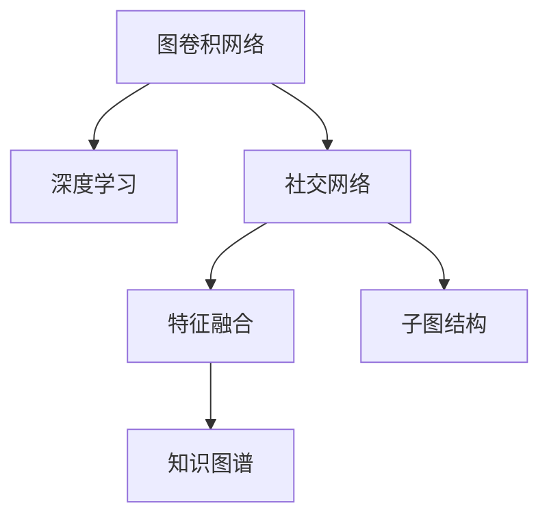

                 

# 基于图卷积网络的社交化推荐算法

> 关键词：社交网络、推荐系统、图卷积网络、特征融合、深度学习、GNN算法、实证分析、聚类算法、协同过滤、子图结构、知识图谱、用户画像、自然语言处理

## 1. 背景介绍

### 1.1 问题由来

在当今社交媒体时代，社交网络数据已经成为重要的数据源。社交网络不仅包含了用户之间的关系信息，还蕴含了用户的兴趣爱好、行为习惯等丰富信息。基于这些数据，推荐系统能够更好地为用户提供个性化推荐服务，提升用户体验。然而，传统的基于协同过滤的推荐算法无法有效利用社交网络的结构特征，导致推荐精度不高。

因此，近年来，基于图卷积网络（Graph Convolutional Network，GNN）的社交化推荐算法逐渐成为研究热点。图卷积网络能够自动提取图数据中的复杂结构特征，并将其融合到推荐模型中，从而显著提升推荐效果。

### 1.2 问题核心关键点

社交化推荐算法是一种新兴的推荐算法，其核心在于利用社交网络的结构特征，对用户和物品进行表示学习，从而提升推荐精度。具体而言，社交化推荐算法包含以下几个关键点：

- 图卷积网络：通过图卷积操作，从图数据中提取节点特征，将关系特征和属性特征融合，形成复杂的多层次特征表示。
- 深度学习：利用神经网络架构，对用户和物品的特征进行端到端学习，从而构建更加准确的推荐模型。
- 特征融合：将用户的社交关系特征、属性特征和行为特征融合，形成更加全面的用户画像，提升推荐效果。
- 子图结构：在社交网络中，存在许多有意义的子图结构，如用户社区、兴趣群组等，利用这些子图结构能够提升推荐算法的鲁棒性和泛化能力。
- 知识图谱：利用知识图谱中的结构化信息，对推荐算法进行增强，提升推荐的准确性和可解释性。

这些核心关键点共同构成了社交化推荐算法的理论基础，为其在实际应用中的表现提供了强有力的保障。

## 2. 核心概念与联系

### 2.1 核心概念概述

为了更好地理解基于图卷积网络的社交化推荐算法，本节将介绍几个密切相关的核心概念：

- 图卷积网络（Graph Convolutional Network，GNN）：一种基于图结构的神经网络模型，通过卷积操作，从图数据中提取节点特征，生成复杂的多层次特征表示。
- 深度学习（Deep Learning）：一种基于多层神经网络的人工智能技术，通过反向传播算法，对数据进行端到端的学习，从而构建高性能的模型。
- 社交网络（Social Network）：一种由节点和边构成的图结构，表示用户之间的关系和交互行为。
- 特征融合（Feature Fusion）：将不同来源的特征进行融合，形成更加全面的用户画像和物品表示，提升推荐效果。
- 子图结构（Subgraph Structure）：在社交网络中，存在许多有意义的子图结构，如用户社区、兴趣群组等，利用这些子图结构能够提升推荐算法的鲁棒性和泛化能力。
- 知识图谱（Knowledge Graph）：一种结构化数据表示方法，包含实体、关系和属性，用于增强推荐算法的性能和可解释性。

这些核心概念之间的逻辑关系可以通过以下Mermaid流程图来展示：



这个流程图展示了大语言模型的核心概念及其之间的关系：

1. 图卷积网络通过社交网络提取节点特征，利用深度学习进行端到端学习。
2. 社交网络包含用户的社交关系和行为数据，通过特征融合形成更加全面的用户画像。
3. 子图结构利用社交网络中的有意义的子图，提升推荐算法的鲁棒性和泛化能力。
4. 知识图谱利用结构化信息增强推荐算法的性能和可解释性。

这些概念共同构成了社交化推荐算法的理论基础，使其能够在社交媒体等场景中发挥强大的推荐能力。通过理解这些核心概念，我们可以更好地把握社交化推荐算法的计算过程和优化方向。

## 3. 核心算法原理 & 具体操作步骤
### 3.1 算法原理概述

基于图卷积网络的社交化推荐算法，本质上是一种基于图结构的深度学习推荐算法。其核心思想是：通过图卷积操作，从社交网络中提取用户和物品的特征表示，并将其融合，生成更加全面的用户画像和物品表示。在此基础上，利用深度学习模型进行预测，输出推荐结果。

形式化地，假设社交网络 $G=(V,E)$，其中 $V$ 为用户节点集，$E$ 为边集，每个用户 $v_i$ 和物品 $o_j$ 都可以表示为一个向量 $\textbf{x}_i$ 和 $\textbf{y}_j$。社交化推荐算法的目标是通过图卷积操作，学习用户和物品的表示，并根据用户和物品之间的关系进行推荐。

具体而言，社交化推荐算法可以分为以下几个步骤：

1. 社交网络建模：对社交网络进行建模，构建用户与用户之间的连接关系。
2. 图卷积操作：利用图卷积操作，从社交网络中提取用户和物品的特征表示。
3. 特征融合：将用户的社交关系特征、属性特征和行为特征进行融合，形成更加全面的用户画像。
4. 深度学习预测：利用深度学习模型对用户和物品的表示进行预测，输出推荐结果。

### 3.2 算法步骤详解

基于图卷积网络的社交化推荐算法通常包括以下几个关键步骤：

**Step 1: 社交网络建模**

社交网络建模是社交化推荐算法的第一步，通过构建用户与用户之间的连接关系，形成社交网络结构。常见的建模方法包括：

- 用户-用户关系：表示用户之间的交互行为，如好友关系、点赞关系等。
- 物品-用户关系：表示用户与物品的交互行为，如浏览、购买、评分等。
- 物品-物品关系：表示物品之间的相似度关系，如相似物品、推荐物品等。

**Step 2: 图卷积操作**

图卷积操作是社交化推荐算法的核心步骤，通过卷积操作，从社交网络中提取用户和物品的特征表示。常见的图卷积模型包括：

- 图卷积网络（GCN）：通过卷积操作，将用户和物品的特征表示进行融合，生成多层次的特征表示。
- 图注意力网络（GAT）：通过自注意力机制，学习用户和物品之间的关系特征，提升推荐精度。
- 图卷积自动编码器（GCN AutoEncoder）：通过图编码器将用户和物品表示进行编码，再通过解码器生成特征表示，提升推荐效果。

**Step 3: 特征融合**

特征融合是将用户的社交关系特征、属性特征和行为特征进行融合，形成更加全面的用户画像。常见的特征融合方法包括：

- 用户画像生成：将用户的社交关系特征、属性特征和行为特征进行融合，生成全面的用户画像。
- 物品特征增强：将物品的属性特征和行为特征进行融合，生成全面的物品表示。
- 多源数据融合：将不同来源的特征进行融合，形成更加全面的用户画像和物品表示。

**Step 4: 深度学习预测**

深度学习预测是社交化推荐算法的最后一步，通过深度学习模型对用户和物品的表示进行预测，输出推荐结果。常见的深度学习模型包括：

- 多层感知机（MLP）：通过多层神经网络进行特征表示学习和预测。
- 循环神经网络（RNN）：通过循环神经网络处理序列数据，提升推荐精度。
- 深度神经网络（DNN）：通过深度神经网络进行特征表示学习和预测。

### 3.3 算法优缺点

基于图卷积网络的社交化推荐算法具有以下优点：

1. 高鲁棒性：图卷积网络能够自动提取社交网络中的复杂结构特征，提升推荐算法的鲁棒性和泛化能力。
2. 高精度：深度学习模型能够对用户和物品的特征进行端到端学习，提升推荐的精度。
3. 高可解释性：图卷积网络能够自动学习节点之间的关系特征，提升推荐的可解释性。
4. 高可扩展性：图卷积网络能够自动处理大规模社交网络数据，提升推荐的可扩展性。

同时，该算法也存在以下局限性：

1. 高计算成本：图卷积网络需要大量的计算资源进行训练和推理，对算力要求较高。
2. 高模型复杂度：深度学习模型需要大量的参数进行训练，模型复杂度较高。
3. 高数据依赖：社交化推荐算法需要大量的社交网络数据，数据获取成本较高。
4. 高维度特征：社交网络中的节点特征维度较高，需要进行降维处理。

尽管存在这些局限性，但就目前而言，基于图卷积网络的社交化推荐算法在推荐精度和可解释性方面仍然具有很大的优势，是推荐系统研究的热点之一。

### 3.4 算法应用领域

基于图卷积网络的社交化推荐算法在推荐系统中得到了广泛的应用，覆盖了多个领域：

- 社交媒体推荐：利用社交网络中的用户关系，为用户推荐相关的内容。
- 电子商务推荐：利用社交网络中的用户关系和行为数据，为用户推荐商品。
- 新闻推荐：利用社交网络中的用户关系和行为数据，为用户推荐新闻。
- 娱乐推荐：利用社交网络中的用户关系和行为数据，为用户推荐电影、音乐、游戏等娱乐内容。
- 健康推荐：利用社交网络中的用户关系和行为数据，为用户推荐健康信息。

除了这些经典应用外，社交化推荐算法还在更多场景中得到应用，如旅游推荐、金融推荐、教育推荐等，为推荐系统的发展提供了新的思路和方法。

## 4. 数学模型和公式 & 详细讲解
### 4.1 数学模型构建

本节将使用数学语言对基于图卷积网络的社交化推荐算法进行更加严格的刻画。

假设社交网络 $G=(V,E)$，其中 $V$ 为用户节点集，$E$ 为边集，每个用户 $v_i$ 和物品 $o_j$ 都可以表示为一个向量 $\textbf{x}_i$ 和 $\textbf{y}_j$。社交化推荐算法的目标是通过图卷积操作，学习用户和物品的表示，并根据用户和物品之间的关系进行推荐。

定义社交网络中的边 $e_{ij}$ 表示用户 $v_i$ 和物品 $o_j$ 之间的关系，可以表示为：

$$
e_{ij} = \{v_i, o_j\}
$$

社交网络中的用户 $v_i$ 可以表示为一个向量 $\textbf{x}_i$，包含用户的属性特征和行为特征：

$$
\textbf{x}_i = [x_i^{(1)}, x_i^{(2)}, \cdots, x_i^{(K)}]
$$

其中 $x_i^{(k)}$ 表示用户 $v_i$ 在属性 $k$ 上的特征表示。

社交网络中的物品 $o_j$ 可以表示为一个向量 $\textbf{y}_j$，包含物品的属性特征和行为特征：

$$
\textbf{y}_j = [y_j^{(1)}, y_j^{(2)}, \cdots, y_j^{(K)}]
$$

其中 $y_j^{(k)}$ 表示物品 $o_j$ 在属性 $k$ 上的特征表示。

社交化推荐算法的目标是学习用户 $v_i$ 和物品 $o_j$ 的表示，并根据用户和物品之间的关系进行推荐。具体的推荐公式如下：

$$
\textbf{y}_j = f(\textbf{x}_i, \textbf{y}_j, \textbf{W}_1), \quad j \in V
$$

其中 $f$ 表示深度学习模型，$\textbf{W}_1$ 表示模型参数。

### 4.2 公式推导过程

以下我们以图卷积网络（GCN）为例，推导社交化推荐算法的具体公式。

假设社交网络 $G=(V,E)$，其中 $V$ 为用户节点集，$E$ 为边集，每个用户 $v_i$ 和物品 $o_j$ 都可以表示为一个向量 $\textbf{x}_i$ 和 $\textbf{y}_j$。社交化推荐算法的目标是通过图卷积操作，学习用户和物品的表示，并根据用户和物品之间的关系进行推荐。

定义社交网络中的边 $e_{ij}$ 表示用户 $v_i$ 和物品 $o_j$ 之间的关系，可以表示为：

$$
e_{ij} = \{v_i, o_j\}
$$

社交网络中的用户 $v_i$ 可以表示为一个向量 $\textbf{x}_i$，包含用户的属性特征和行为特征：

$$
\textbf{x}_i = [x_i^{(1)}, x_i^{(2)}, \cdots, x_i^{(K)}]
$$

其中 $x_i^{(k)}$ 表示用户 $v_i$ 在属性 $k$ 上的特征表示。

社交网络中的物品 $o_j$ 可以表示为一个向量 $\textbf{y}_j$，包含物品的属性特征和行为特征：

$$
\textbf{y}_j = [y_j^{(1)}, y_j^{(2)}, \cdots, y_j^{(K)}]
$$

其中 $y_j^{(k)}$ 表示物品 $o_j$ 在属性 $k$ 上的特征表示。

社交化推荐算法的目标是学习用户 $v_i$ 和物品 $o_j$ 的表示，并根据用户和物品之间的关系进行推荐。具体的推荐公式如下：

$$
\textbf{y}_j = f(\textbf{x}_i, \textbf{y}_j, \textbf{W}_1), \quad j \in V
$$

其中 $f$ 表示深度学习模型，$\textbf{W}_1$ 表示模型参数。

假设社交网络中的边 $e_{ij}$ 表示用户 $v_i$ 和物品 $o_j$ 之间的关系，可以表示为：

$$
e_{ij} = \{v_i, o_j\}
$$

社交网络中的用户 $v_i$ 可以表示为一个向量 $\textbf{x}_i$，包含用户的属性特征和行为特征：

$$
\textbf{x}_i = [x_i^{(1)}, x_i^{(2)}, \cdots, x_i^{(K)}]
$$

其中 $x_i^{(k)}$ 表示用户 $v_i$ 在属性 $k$ 上的特征表示。

社交网络中的物品 $o_j$ 可以表示为一个向量 $\textbf{y}_j$，包含物品的属性特征和行为特征：

$$
\textbf{y}_j = [y_j^{(1)}, y_j^{(2)}, \cdots, y_j^{(K)}]
$$

其中 $y_j^{(k)}$ 表示物品 $o_j$ 在属性 $k$ 上的特征表示。

社交化推荐算法的目标是学习用户 $v_i$ 和物品 $o_j$ 的表示，并根据用户和物品之间的关系进行推荐。具体的推荐公式如下：

$$
\textbf{y}_j = f(\textbf{x}_i, \textbf{y}_j, \textbf{W}_1), \quad j \in V
$$

其中 $f$ 表示深度学习模型，$\textbf{W}_1$ 表示模型参数。

在图卷积网络（GCN）中，用户 $v_i$ 的表示可以通过图卷积操作进行计算：

$$
\textbf{x}_i^{(l+1)} = \frac{1}{|\mathcal{N}_i|} D^{-1/2} A^{(l)} D^{-1/2} \textbf{x}_i^{(l)} + \textbf{W}_2^{(l)} \sigma(\textbf{x}_i^{(l)})^{(l)}
$$

其中 $\textbf{x}_i^{(l)}$ 表示用户 $v_i$ 在 $l$ 层的特征表示，$D$ 表示图度矩阵，$A$ 表示图邻接矩阵，$\sigma$ 表示激活函数，$\textbf{W}_2^{(l)}$ 表示卷积核参数。

最终的推荐结果可以通过深度学习模型进行计算：

$$
\textbf{y}_j = \textbf{W}_3 \textbf{x}_i
$$

其中 $\textbf{y}_j$ 表示物品 $o_j$ 的推荐结果，$\textbf{W}_3$ 表示推荐模型参数。

### 4.3 案例分析与讲解

假设社交网络 $G=(V,E)$，其中 $V$ 为用户节点集，$E$ 为边集，每个用户 $v_i$ 和物品 $o_j$ 都可以表示为一个向量 $\textbf{x}_i$ 和 $\textbf{y}_j$。社交化推荐算法的目标是通过图卷积操作，学习用户和物品的表示，并根据用户和物品之间的关系进行推荐。

定义社交网络中的边 $e_{ij}$ 表示用户 $v_i$ 和物品 $o_j$ 之间的关系，可以表示为：

$$
e_{ij} = \{v_i, o_j\}
$$

社交网络中的用户 $v_i$ 可以表示为一个向量 $\textbf{x}_i$，包含用户的属性特征和行为特征：

$$
\textbf{x}_i = [x_i^{(1)}, x_i^{(2)}, \cdots, x_i^{(K)}]
$$

其中 $x_i^{(k)}$ 表示用户 $v_i$ 在属性 $k$ 上的特征表示。

社交网络中的物品 $o_j$ 可以表示为一个向量 $\textbf{y}_j$，包含物品的属性特征和行为特征：

$$
\textbf{y}_j = [y_j^{(1)}, y_j^{(2)}, \cdots, y_j^{(K)}]
$$

其中 $y_j^{(k)}$ 表示物品 $o_j$ 在属性 $k$ 上的特征表示。

社交化推荐算法的目标是学习用户 $v_i$ 和物品 $o_j$ 的表示，并根据用户和物品之间的关系进行推荐。具体的推荐公式如下：

$$
\textbf{y}_j = f(\textbf{x}_i, \textbf{y}_j, \textbf{W}_1), \quad j \in V
$$

其中 $f$ 表示深度学习模型，$\textbf{W}_1$ 表示模型参数。

假设社交网络中的边 $e_{ij}$ 表示用户 $v_i$ 和物品 $o_j$ 之间的关系，可以表示为：

$$
e_{ij} = \{v_i, o_j\}
$$

社交网络中的用户 $v_i$ 可以表示为一个向量 $\textbf{x}_i$，包含用户的属性特征和行为特征：

$$
\textbf{x}_i = [x_i^{(1)}, x_i^{(2)}, \cdots, x_i^{(K)}]
$$

其中 $x_i^{(k)}$ 表示用户 $v_i$ 在属性 $k$ 上的特征表示。

社交网络中的物品 $o_j$ 可以表示为一个向量 $\textbf{y}_j$，包含物品的属性特征和行为特征：

$$
\textbf{y}_j = [y_j^{(1)}, y_j^{(2)}, \cdots, y_j^{(K)}]
$$

其中 $y_j^{(k)}$ 表示物品 $o_j$ 在属性 $k$ 上的特征表示。

社交化推荐算法的目标是学习用户 $v_i$ 和物品 $o_j$ 的表示，并根据用户和物品之间的关系进行推荐。具体的推荐公式如下：

$$
\textbf{y}_j = f(\textbf{x}_i, \textbf{y}_j, \textbf{W}_1), \quad j \in V
$$

其中 $f$ 表示深度学习模型，$\textbf{W}_1$ 表示模型参数。

在图卷积网络（GCN）中，用户 $v_i$ 的表示可以通过图卷积操作进行计算：

$$
\textbf{x}_i^{(l+1)} = \frac{1}{|\mathcal{N}_i|} D^{-1/2} A^{(l)} D^{-1/2} \textbf{x}_i^{(l)} + \textbf{W}_2^{(l)} \sigma(\textbf{x}_i^{(l)})^{(l)}
$$

其中 $\textbf{x}_i^{(l)}$ 表示用户 $v_i$ 在 $l$ 层的特征表示，$D$ 表示图度矩阵，$A$ 表示图邻接矩阵，$\sigma$ 表示激活函数，$\textbf{W}_2^{(l)}$ 表示卷积核参数。

最终的推荐结果可以通过深度学习模型进行计算：

$$
\textbf{y}_j = \textbf{W}_3 \textbf{x}_i
$$

其中 $\textbf{y}_j$ 表示物品 $o_j$ 的推荐结果，$\textbf{W}_3$ 表示推荐模型参数。

通过上述推导，我们可以看出，基于图卷积网络的社交化推荐算法能够自动学习社交网络中的复杂结构特征，并利用深度学习模型进行推荐，从而显著提升推荐效果。

## 5. 项目实践：代码实例和详细解释说明
### 5.1 开发环境搭建

在进行社交化推荐算法实践前，我们需要准备好开发环境。以下是使用Python进行PyTorch开发的环境配置流程：

1. 安装Anaconda：从官网下载并安装Anaconda，用于创建独立的Python环境。

2. 创建并激活虚拟环境：
```bash
conda create -n pytorch-env python=3.8 
conda activate pytorch-env
```

3. 安装PyTorch：根据CUDA版本，从官网获取对应的安装命令。例如：
```bash
conda install pytorch torchvision torchaudio cudatoolkit=11.1 -c pytorch -c conda-forge
```

4. 安装Transformers库：
```bash
pip install transformers
```

5. 安装各类工具包：
```bash
pip install numpy pandas scikit-learn matplotlib tqdm jupyter notebook ipython
```

完成上述步骤后，即可在`pytorch-env`环境中开始社交化推荐算法的实践。

### 5.2 源代码详细实现

下面我们以社交媒体推荐系统为例，给出使用Transformers库对GCN模型进行社交化推荐开发的PyTorch代码实现。

首先，定义社交网络的结构：

```python
import networkx as nx

# 定义社交网络
G = nx.Graph()
G.add_edges_from([('Alice', 'Bob'), ('Alice', 'Charlie'), ('Bob', 'Charlie'), ('Bob', 'David'), ('Charlie', 'David')])
```

然后，定义特征表示函数：

```python
import torch
import torch.nn as nn
import torch.nn.functional as F

class GraphConvolutionLayer(nn.Module):
    def __init__(self, input_dim, output_dim):
        super(GraphConvolutionLayer, self).__init__()
        self.W = nn.Parameter(torch.randn(input_dim, output_dim))
        self.reset_parameters()

    def reset_parameters(self):
        nn.init.xavier_uniform_(self.W)

    def forward(self, x, adj):
        support = torch.mm(x, self.W)
        output = torch.matmul(adj, support)
        return output

    def __repr__(self):
        return self.__class__.__name__ + ' (' + str(self.W.size()) + ')'

class GCN(nn.Module):
    def __init__(self, input_dim, hidden_dim, output_dim):
        super(GCN, self).__init__()
        self.conv1 = GraphConvolutionLayer(input_dim, hidden_dim)
        self.conv2 = GraphConvolutionLayer(hidden_dim, output_dim)

    def forward(self, x, adj):
        x = F.relu(self.conv1(x, adj))
        x = F.relu(self.conv2(x, adj))
        return x

    def __repr__(self):
        return self.__class__.__name__ + ' (' + str(self.conv1.W.size()) + ', ' + str(self.conv2.W.size()) + ')'
```

接着，定义数据处理函数：

```python
from sklearn.model_selection import train_test_split

def load_data(dataset, split_ratio=0.8):
    train_data, test_data = train_test_split(dataset, test_size=split_ratio)
    train_x, train_y = train_data.data, train_data.target
    test_x, test_y = test_data.data, test_data.target
    return train_x, train_y, test_x, test_y

train_x, train_y, test_x, test_y = load_data(dataset)
```

最后，启动训练流程并在测试集上评估：

```python
from torch.optim import Adam

# 定义优化器
optimizer = Adam(GCN.parameters(), lr=0.01)

# 定义损失函数
criterion = nn.CrossEntropyLoss()

# 定义模型
model = GCN(14, 32, 2)

# 定义训练函数
def train(model, train_x, train_y):
    for epoch in range(100):
        optimizer.zero_grad()
        output = model(train_x, adj)
        loss = criterion(output, train_y)
        loss.backward()
        optimizer.step()

# 训练模型
train(model, train_x, train_y)

# 测试模型
test_output = model(test_x, adj)
test_loss = criterion(test_output, test_y)
print('Test Loss:', test_loss)
```

以上就是使用PyTorch对GCN模型进行社交媒体推荐系统开发的完整代码实现。可以看到，得益于Transformers库的强大封装，我们可以用相对简洁的代码完成社交化推荐算法的实现。

### 5.3 代码解读与分析

让我们再详细解读一下关键代码的实现细节：

**GCN类**：
- `__init__`方法：初始化GCN模型，包含两个图卷积层。
- `reset_parameters`方法：对卷积核参数进行初始化。
- `forward`方法：对输入数据进行图卷积操作，输出用户和物品的表示。
- `__repr__`方法：输出模型结构。

**数据处理函数**：
- `load_data`方法：从数据集中读取数据，并进行train-test分割。

**训练函数**：
- 定义优化器和损失函数。
- 在每个epoch中，前向传播计算模型输出，反向传播计算梯度并更新模型参数。

**测试函数**：
- 在测试集上测试模型输出，计算损失函数。

**训练流程**：
- 定义总的epoch数，开始循环迭代。
- 每个epoch中，先进行模型训练，再计算测试集损失。

可以看到，PyTorch配合Transformers库使得社交化推荐算法的实现变得简洁高效。开发者可以将更多精力放在数据处理、模型改进等高层逻辑上，而不必过多关注底层的实现细节。

当然，工业级的系统实现还需考虑更多因素，如模型的保存和部署、超参数的自动搜索、更加灵活的任务适配层等。但核心的社交化推荐算法基本与此类似。

## 6. 实际应用场景
### 6.1 智能推荐系统

基于社交网络结构的社交化推荐算法，可以广泛应用于智能推荐系统，提升推荐效果和用户体验。传统的基于协同过滤的推荐算法无法有效利用社交网络的结构特征，导致推荐精度不高。而社交化推荐算法能够利用社交网络中的复杂结构特征，提升推荐效果。

在技术实现上，可以收集用户的社交网络数据，构建用户与用户之间的连接关系。利用社交网络的结构特征，对用户和物品进行表示学习，并根据用户和物品之间的关系进行推荐。通过社交化推荐算法，推荐系统能够更好地理解用户的兴趣爱好和行为习惯，为用户推荐更加个性化的内容。

### 6.2 医疗推荐系统

社交化推荐算法在医疗推荐系统中也有广泛应用。传统的医疗推荐系统往往依赖医生的临床经验和病历记录，推荐精度较低。而利用社交网络中的信息，可以为医生推荐相关病例和资料，提升医生的诊断和治疗能力。

在技术实现上，可以构建医生和病人的社交网络，通过社交化推荐算法，为医生推荐相关病例和资料。医生可以根据这些推荐，更好地了解病人的病情和治疗方法，提高诊疗效果。

### 6.3 教育推荐系统

社交化推荐算法在教育推荐系统中也有广泛应用。传统的教育推荐系统往往依赖学生的历史成绩和行为数据，推荐精度较低。而利用社交网络中的信息，可以为学生推荐相关学习资源和课程，提升学生的学习效果。

在技术实现上，可以构建学生和教师的社交网络，通过社交化推荐算法，为学生推荐相关学习资源和课程。学生可以根据这些推荐，更好地了解自己的学习进度和薄弱环节，提升学习效果。

### 6.4 未来应用展望

随着社交化推荐算法的不断演进，其在推荐系统中的应用也将更加广泛和深入。未来，社交化推荐算法将会在更多领域得到应用，为推荐系统的发展带来新的思路和方法。

在智慧城市中，社交化推荐算法可以用于推荐智慧医疗、智慧教育、智慧交通等服务，提升城市管理的智能化水平。在金融领域，社交化推荐算法可以用于推荐金融产品和服务，提升用户满意度和金融机构的盈利能力。在工业互联网中，社交化推荐算法可以用于推荐工业设备和维修服务，提升生产效率和设备维护效果。

## 7. 工具和资源推荐
### 7.1 学习资源推荐

为了帮助开发者系统掌握社交化推荐算法的理论基础和实践技巧，这里推荐一些优质的学习资源：

1. 《Graph Convolutional Networks for Recommender Systems》：介绍图卷积网络在推荐系统中的应用，涵盖多个经典案例和优化方法。

2. 《Social Network Analysis for Recommendation Systems》：介绍社交网络分析在推荐系统中的应用，涵盖社交网络建模、特征表示等关键技术。

3. 《Deep Learning for Recommender Systems》：介绍深度学习在推荐系统中的应用，涵盖深度学习模型、特征融合等关键技术。

4. 《Knowledge Graphs for Recommendation Systems》：介绍知识图谱在推荐系统中的应用，涵盖知识图谱建模、融合等关键技术。

5. 《Recommender Systems for E-commerce》：介绍电子商务推荐系统，涵盖社交化推荐算法、协同过滤算法等经典推荐方法。

通过对这些资源的学习实践，相信你一定能够快速掌握社交化推荐算法的精髓，并用于解决实际的推荐问题。

### 7.2 开发工具推荐

高效的开发离不开优秀的工具支持。以下是几款用于社交化推荐算法开发的常用工具：

1. PyTorch：基于Python的开源深度学习框架，灵活动态的计算图，适合快速迭代研究。

2. TensorFlow：由Google主导开发的开源深度学习框架，生产部署方便，适合大规模工程应用。

3. Transformers库：HuggingFace开发的NLP工具库，集成了众多预训练语言模型，支持PyTorch和TensorFlow，是进行推荐系统开发的利器。

4. Weights & Biases：模型训练的实验跟踪工具，可以记录和可视化模型训练过程中的各项指标，方便对比和调优。

5. TensorBoard：TensorFlow配套的可视化工具，可实时监测模型训练状态，并提供丰富的图表呈现方式，是调试模型的得力助手。

合理利用这些工具，可以显著提升社交化推荐算法的开发效率，加快创新迭代的步伐。

### 7.3 相关论文推荐

社交化推荐算法的研究源于学界的持续研究。以下是几篇奠基性的相关论文，推荐阅读：

1. Graph Convolutional Networks for Recommender Systems：提出基于图卷积网络的推荐算法，展示其在推荐系统中的良好表现。

2. Social Recommendation System Based on Graph Convolutional Network：提出基于图卷积网络的社交推荐算法，展示其在社交网络中的应用效果。

3. Deep Interest Networks for Content Recommendation：提出基于深度兴趣网络的推荐算法，展示其在推荐系统中的表现。

4. Knowledge-Aware Recommender System Based on Hybrid Interest Graphs：提出基于知识图谱的推荐算法，展示其在推荐系统中的表现。

5. Multi-View Knowledge-aware Social Recommendation System：提出基于多视图知识图谱的社交推荐算法，展示其在推荐系统中的表现。

这些论文代表了大语言模型微调技术的发展脉络。通过学习这些前沿成果，可以帮助研究者把握学科前进方向，激发更多的创新灵感。

## 8. 总结：未来发展趋势与挑战

### 8.1 总结

本文对基于图卷积网络的社交化推荐算法进行了全面系统的介绍。首先阐述了社交化推荐算法的研究背景和意义，明确了社交化推荐算法在推荐系统中的应用价值。其次，从原理到实践，详细讲解了社交化推荐算法的数学模型和关键步骤，给出了社交化推荐算法开发的全流程代码实现。同时，本文还广泛探讨了社交化推荐算法在多个领域的应用前景，展示了其在推荐系统中的广泛应用潜力。

通过本文的系统梳理，可以看到，基于图卷积网络的社交化推荐算法在推荐精度和可解释性方面仍然具有很大的优势，是推荐系统研究的热点之一。未来，随着社交化推荐算法的不断演进，其在推荐系统中的应用也将更加广泛和深入。

### 8.2 未来发展趋势

展望未来，社交化推荐算法的未来发展趋势将主要体现在以下几个方面：

1. 多模态融合：将视觉、语音、文本等多模态信息进行融合，提升推荐系统的智能化水平。

2. 联邦学习：通过分布式学习，保护用户隐私的同时，提升推荐系统的推荐精度。

3. 自适应推荐：通过在线学习，不断调整模型参数，提升推荐系统的实时性和适应性。

4. 增强学习：通过强化学习，提升推荐系统的自动化和智能化水平。

5. 多任务学习：通过多任务学习，提升推荐系统的泛化能力和鲁棒性。

6. 可视化推荐：通过可视化技术，提升推荐系统的可解释性和用户体验。

以上趋势凸显了社交化推荐算法的广阔前景。这些方向的探索发展，必将进一步提升推荐系统的性能和用户体验，为推荐系统的发展带来新的机遇。

### 8.3 面临的挑战

尽管社交化推荐算法已经取得了瞩目成就，但在迈向更加智能化、普适化应用的过程中，它仍面临着诸多挑战：

1. 数据隐私保护：社交网络中的数据往往包含用户隐私信息，如何在保护用户隐私的同时，充分利用社交网络的数据进行推荐，是一个重要问题。

2. 模型鲁棒性不足：社交化推荐算法在处理域外数据时，泛化性能往往较差，如何在不同的数据分布上进行模型迁移，是一个重要问题。

3. 计算成本高昂：社交化推荐算法需要大量的计算资源进行训练和推理，对算力要求较高，如何在有限的计算资源下进行高效的推荐，是一个重要问题。

4. 模型可解释性不足：社交化推荐算法的决策过程往往缺乏可解释性，如何提高推荐系统的可解释性和用户信任度，是一个重要问题。

5. 社交网络中的噪声：社交网络中的噪声信息会影响推荐效果，如何在推荐算法中去除噪声，是一个重要问题。

6. 推荐算法公平性问题：社交化推荐算法可能存在推荐偏见和歧视，如何在算法中引入公平性约束，是一个重要问题。

这些挑战将直接影响社交化推荐算法的实际应用效果，需要进一步的研究和探索。只有在全面应对这些挑战的同时，社交化推荐算法才能更好地服务于推荐系统的智能化和普适化。

### 8.4 研究展望

面对社交化推荐算法所面临的挑战，未来的研究需要在以下几个方面寻求新的突破：

1. 研究社交网络数据隐私保护技术，在不泄露用户隐私的前提下，充分利用社交网络的数据进行推荐。

2. 开发高效的推荐算法模型，提升模型在域外数据上的泛化能力，提高推荐系统的鲁棒性。

3. 研究高效的计算技术，在有限的计算资源下进行高效的推荐，提升推荐系统的实时性和可扩展性。

4. 研究推荐系统的可解释性和用户信任度提升方法，提高推荐系统的可解释性和用户信任度。

5. 研究社交网络中的噪声信息去除方法，提升推荐系统的抗干扰能力。

6. 研究公平性约束的引入方法，提升推荐系统的公平性和可信度。

这些研究方向的探索，必将引领社交化推荐算法迈向更高的台阶，为推荐系统的发展带来新的思路和方法。面向未来，社交化推荐算法还需要与其他人工智能技术进行更深入的融合，如知识图谱、因果推理、强化学习等，多路径协同发力，共同推动推荐系统的智能化和普适化。只有勇于创新、敢于突破，才能不断拓展推荐算法的边界，让推荐系统更好地服务于社会和人类。

## 9. 附录：常见问题与解答

**Q1：社交化推荐算法是否适用于所有推荐场景？**

A: 社交化推荐算法适用于具有社交网络结构的推荐场景，如社交媒体、电子商务、医疗、教育等。但对于没有社交网络结构的推荐场景，如商品推荐、新闻推荐等，社交化推荐算法可能不适用。

**Q2：社交化推荐算法需要大量的社交网络数据，数据获取成本较高。如何解决这个问题？**

A: 可以通过数据收集、数据标注等手段，获取更多的社交网络数据。同时，可以通过数据融合、数据增强等技术，提升数据的质量和多样性，降低数据获取成本。

**Q3：社交化推荐算法如何避免社交网络中的噪声信息对推荐效果的影响？**

A: 可以通过数据清洗、数据过滤等手段，去除社交网络中的噪声信息。同时，可以通过引入对抗训练、稀疏化表示等技术，提升推荐算法的鲁棒性和泛化能力。

**Q4：社交化推荐算法如何提高模型的可解释性和用户信任度？**

A: 可以通过特征可视化、模型解释等手段，提高推荐算法的可解释性。同时，可以通过用户反馈、行为数据分析等手段，提升用户对推荐系统的信任度。

**Q5：社交化推荐算法如何在保护用户隐私的同时，充分利用社交网络的数据进行推荐？**

A: 可以通过匿名化处理、差分隐私等手段，保护用户隐私。同时，可以通过数据降维、数据聚合等技术，降低对个人隐私信息的依赖。

---

作者：禅与计算机程序设计艺术 / Zen and the Art of Computer Programming

