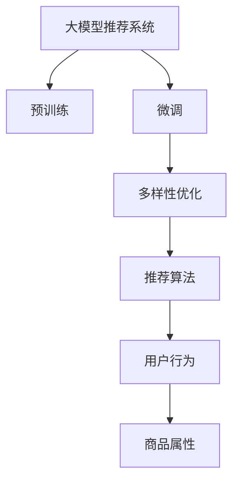

                 

# 基于大模型的商品推荐多样性优化

在当今的电商行业中，商品推荐系统已经成为企业提升用户体验和销售转化的重要工具。传统的推荐算法，如协同过滤、基于内容的推荐等，往往依赖于用户行为和物品特征的隐式关联，难以处理新物品和冷启动问题。而随着深度学习技术的兴起，基于神经网络的推荐系统逐渐成为研究热点。

本文将探讨基于大模型的商品推荐系统，并特别关注其多样性优化问题。大模型推荐系统具有强大的语言建模能力，能够从大规模文本数据中学习丰富的知识，应用于商品描述、用户评论等多种推荐场景。而多样性优化则是保证推荐结果丰富、有趣、不单调的重要手段。本文将从算法原理、操作步骤、数学模型等多个方面，详细介绍基于大模型的商品推荐多样性优化方法，并结合实际案例和代码实现，提供深入的分析和实践指导。

## 1. 背景介绍

### 1.1 问题由来

随着电商平台的快速发展，用户对商品推荐系统的期望也在不断提高。传统的推荐算法往往只能提供基于相似物品的推荐，难以捕捉用户的真实偏好和多样性需求。而大模型推荐系统能够通过学习大规模无标签文本数据，捕捉更丰富的用户兴趣和商品属性，提供更准确、多样化的推荐。

然而，大模型推荐系统面临的一个主要问题是多样性不足。由于模型学习到的知识主要来自于少数常见物品和相似用户，因此推荐结果容易陷入单一模式，无法充分展现用户的多样化需求。多样性不足会导致用户对推荐结果的满意度和粘性降低，从而影响整体用户体验和销售效果。

### 1.2 问题核心关键点

多样性优化是推荐系统性能提升的关键环节。当前主流的大模型推荐系统主要基于Transformer结构和自监督学习任务进行预训练，通过在用户物品交互数据上进行有监督微调，得到最终的推荐结果。而多样性优化则需要在微调过程中，引入额外的约束和机制，提升推荐结果的多样性和丰富度。

## 2. 核心概念与联系

### 2.1 核心概念概述

为更好地理解基于大模型的商品推荐多样性优化方法，本节将介绍几个密切相关的核心概念：

- 大模型推荐系统：以自回归Transformer结构为代表的大规模预训练语言模型，应用于商品推荐系统中，通过学习商品描述、用户评论等多种文本数据，提供推荐服务。
- 预训练(Pre-training)：指在大规模无标签文本语料上，通过自监督学习任务训练通用语言模型的过程。大模型推荐系统通过预训练学习到通用的语言表示，具备强大的语言理解和生成能力。
- 微调(Fine-tuning)：指在预训练模型的基础上，使用用户物品交互数据，通过有监督学习优化模型在特定任务上的性能。推荐系统通常通过微调得到最终的推荐结果。
- 多样性优化(Diversity Optimization)：指在推荐系统中，引入额外的约束和机制，提升推荐结果的多样性和丰富度，避免推荐结果单调。
- 推荐算法(Recommender Algorithm)：用于从大规模数据中预测用户对物品的兴趣，生成推荐结果的算法。常见的推荐算法包括基于协同过滤、内容过滤等传统算法，以及基于神经网络的深度学习算法。
- 用户行为(User Behavior)：用户在电商平台上的点击、购买、浏览、收藏等行为，用于预测用户兴趣和推荐。
- 商品属性(Product Attributes)：商品的具体特征描述，如价格、类别、品牌等，用于匹配用户兴趣和生成推荐。

这些核心概念之间的逻辑关系可以通过以下Mermaid流程图来展示：



这个流程图展示了大模型推荐系统的核心概念及其之间的关系：

1. 大模型推荐系统通过预训练获得基础能力。
2. 微调是对预训练模型进行任务特定的优化，使其能够根据用户行为和商品属性生成推荐。
3. 多样性优化通过引入额外机制，提升推荐结果的多样性和丰富度。
4. 推荐算法利用微调后的大模型，根据用户行为和商品属性，生成具体的推荐结果。
5. 用户行为和商品属性是推荐算法的输入，直接影响推荐结果的质量。

## 3. 核心算法原理 & 具体操作步骤

### 3.1 算法原理概述

基于大模型的商品推荐系统，本质上是一个通过学习用户行为和商品属性，生成推荐结果的深度学习模型。其核心思想是：将用户行为和商品属性编码为文本，通过预训练模型进行语言建模，得到用户和商品的表示。然后通过微调，将这些表示映射到推荐结果，优化推荐效果。多样性优化则是通过引入额外约束，提升推荐结果的多样性和丰富度。

形式化地，假设用户行为和商品属性的文本编码为 $\textit{user\_bias}$ 和 $\textit{item\_bias}$，则推荐模型 $M_{\theta}$ 在用户物品交互数据 $D=\{(u_i, i_j)\}_{i=1}^N$ 上的推荐结果可以表示为：

$$
\hat{r} = M_{\theta}(\textit{user\_bias}, \textit{item\_bias})
$$

其中 $\textit{user\_bias}$ 和 $\textit{item\_bias}$ 分别表示用户和商品的特征表示，$\hat{r}$ 表示推荐结果。

推荐模型的损失函数为交叉熵损失，用于衡量推荐结果与实际标签（即用户是否点击商品）之间的差异：

$$
\mathcal{L}(\theta) = -\frac{1}{N} \sum_{i=1}^N \sum_{j=1}^M y_{i,j} \log \hat{r}_{i,j} + (1 - y_{i,j}) \log (1 - \hat{r}_{i,j})
$$

其中 $y_{i,j}$ 表示用户 $i$ 是否点击了商品 $j$，$M$ 为推荐结果数量。

多样性优化通常通过在损失函数中引入多样性约束，实现推荐结果的多样性提升。例如，可以引入最大多样性约束，限制推荐结果中某一商品的出现次数不超过预设阈值。

### 3.2 算法步骤详解

基于大模型的商品推荐系统，其多样性优化的一般流程如下：

**Step 1: 准备数据集**

- 收集用户行为数据和商品属性数据，如点击、浏览、收藏、评论等。
- 对数据进行预处理和编码，形成用户行为和商品属性的文本表示。

**Step 2: 预训练模型**

- 选择合适的预训练模型，如BERT、GPT等。
- 在大规模无标签文本数据上进行预训练，学习通用的语言表示。

**Step 3: 微调模型**

- 将用户行为和商品属性的文本表示作为输入，进行微调。
- 设置微调模型的超参数，如学习率、批大小等。
- 在用户物品交互数据上执行微调，更新模型参数。

**Step 4: 多样性优化**

- 在微调模型的基础上，引入多样性约束。
- 如设置最大推荐商品数，防止推荐结果过于单调。
- 通过额外的损失函数或约束，提升推荐结果的多样性。

**Step 5: 生成推荐结果**

- 使用微调后的模型，根据用户行为和商品属性生成推荐结果。
- 在推荐结果中，确保多样性约束得到满足。
- 输出最终的推荐列表。

### 3.3 算法优缺点

基于大模型的商品推荐系统具有以下优点：

1. 强大建模能力：通过预训练学习通用语言表示，具备强大的自然语言理解和生成能力。
2. 泛化能力强：能够捕捉用户的复杂兴趣和多样性需求，提升推荐准确性和丰富度。
3. 适应性强：支持多种输入数据格式，如文本、图像、视频等，提供更灵活的推荐方式。

同时，该方法也存在一定的局限性：

1. 数据需求高：需要大量的用户行为和商品属性数据进行训练，数据获取和预处理成本较高。
2. 计算资源需求大：预训练和微调过程需要强大的计算资源，模型的存储空间和推理速度也可能成为瓶颈。
3. 解释性不足：大模型推荐系统的内部机制复杂，难以解释其推荐结果的生成逻辑。

尽管存在这些局限性，但就目前而言，基于大模型的推荐系统仍然是最先进和最有效的推荐方式之一。未来相关研究的重点在于如何进一步降低数据需求，提高模型的计算效率，同时兼顾模型的可解释性和多样性优化。

### 3.4 算法应用领域

基于大模型的商品推荐系统已经在多个电商平台上得到了广泛应用，为用户的购物体验带来了显著提升：

- 商品推荐：根据用户浏览和购买历史，推荐符合用户兴趣的商品。
- 个性化广告：根据用户的浏览行为，生成个性化广告内容，提高点击率。
- 商品分类：对商品进行自动分类和聚类，提升商品管理的效率和准确性。
- 用户画像：通过分析用户的行为和属性，构建完整的用户画像，提升用户体验和满意度。
- 活动策划：根据用户的兴趣和行为，策划个性化活动，提升用户参与度和粘性。

除了上述这些经典应用外，基于大模型的推荐系统还被创新性地应用到更多场景中，如可控推荐、推荐机制调整等，为电商平台的业务发展提供了新的技术动力。

## 4. 数学模型和公式 & 详细讲解 & 举例说明

### 4.1 数学模型构建

本节将使用数学语言对基于大模型的商品推荐多样性优化过程进行更加严格的刻画。

假设用户行为和商品属性的文本编码为 $\textit{user\_bias}$ 和 $\textit{item\_bias}$，则推荐模型 $M_{\theta}$ 在用户物品交互数据 $D=\{(u_i, i_j)\}_{i=1}^N$ 上的推荐结果可以表示为：

$$
\hat{r} = M_{\theta}(\textit{user\_bias}, \textit{item\_bias})
$$

其中 $\textit{user\_bias}$ 和 $\textit{item\_bias}$ 分别表示用户和商品的特征表示，$\hat{r}$ 表示推荐结果。

推荐模型的损失函数为交叉熵损失，用于衡量推荐结果与实际标签之间的差异：

$$
\mathcal{L}(\theta) = -\frac{1}{N} \sum_{i=1}^N \sum_{j=1}^M y_{i,j} \log \hat{r}_{i,j} + (1 - y_{i,j}) \log (1 - \hat{r}_{i,j})
$$

其中 $y_{i,j}$ 表示用户 $i$ 是否点击了商品 $j$，$M$ 为推荐结果数量。

为了提升推荐结果的多样性，可以在损失函数中引入多样性约束。例如，可以引入最大多样性约束，限制推荐结果中某一商品的出现次数不超过预设阈值。假设最多允许商品 $j$ 出现 $k$ 次，则多样性约束可以表示为：

$$
\mathcal{L}_{div}(\theta) = \sum_{j=1}^M \max_{i=1}^N (\textit{count}_{i,j} - k)^2
$$

其中 $\textit{count}_{i,j}$ 表示商品 $j$ 在用户 $i$ 的推荐结果中出现的次数。

将多样性约束与推荐模型的损失函数结合起来，可以得到最终的优化目标：

$$
\mathcal{L}_{total}(\theta) = \mathcal{L}(\theta) + \beta \mathcal{L}_{div}(\theta)
$$

其中 $\beta$ 为多样性约束的权重，用于控制推荐结果的准确性和多样性之间的平衡。

### 4.2 公式推导过程

以下我们以二分类任务为例，推导推荐模型的交叉熵损失函数及其梯度的计算公式。

假设模型 $M_{\theta}$ 在输入 $\textit{user\_bias}$ 和 $\textit{item\_bias}$ 上的输出为 $\hat{y}=M_{\theta}(\textit{user\_bias}, \textit{item\_bias}) \in [0,1]$，表示商品 $j$ 被用户 $i$ 点击的概率。真实标签 $y_{i,j} \in \{0,1\}$。则二分类交叉熵损失函数定义为：

$$
\ell(M_{\theta}(\textit{user\_bias}, \textit{item\_bias}), y_{i,j}) = -[y_{i,j}\log \hat{y} + (1-y_{i,j})\log (1-\hat{y})]
$$

将其代入经验风险公式，得：

$$
\mathcal{L}(\theta) = -\frac{1}{N}\sum_{i=1}^N \sum_{j=1}^M [y_{i,j}\log \hat{y}_{i,j} + (1-y_{i,j})\log (1-\hat{y}_{i,j})]
$$

根据链式法则，损失函数对参数 $\theta_k$ 的梯度为：

$$
\frac{\partial \mathcal{L}(\theta)}{\partial \theta_k} = -\frac{1}{N}\sum_{i=1}^N \sum_{j=1}^M (\frac{y_{i,j}}{\hat{y}_{i,j}}-\frac{1-y_{i,j}}{1-\hat{y}_{i,j}}) \frac{\partial M_{\theta}(\textit{user\_bias}, \textit{item\_bias})}{\partial \theta_k}
$$

其中 $\frac{\partial M_{\theta}(\textit{user\_bias}, \textit{item\_bias})}{\partial \theta_k}$ 可进一步递归展开，利用自动微分技术完成计算。

在得到损失函数的梯度后，即可带入参数更新公式，完成模型的迭代优化。重复上述过程直至收敛，最终得到适应用户行为和商品属性数据的最优模型参数 $\theta^*$。

### 4.3 案例分析与讲解

以下通过一个具体案例，详细讲解基于大模型的商品推荐多样性优化方法的实现过程。

假设有一家电商平台，收集了用户 $i$ 对商品 $j$ 的点击数据，训练一个基于BERT的推荐系统。假设模型已经在大规模无标签文本数据上进行预训练，用于提取文本表示。现在需要根据用户行为和商品属性，生成推荐结果。

首先，将用户行为和商品属性进行编码，形成文本表示 $\textit{user\_bias}$ 和 $\textit{item\_bias}$：

```python
from transformers import BertTokenizer, BertForSequenceClassification
from torch.utils.data import Dataset, DataLoader

class ProductDataset(Dataset):
    def __init__(self, products, user_ids, clicked_products):
        self.products = products
        self.user_ids = user_ids
        self.clicked_products = clicked_products
        
    def __len__(self):
        return len(self.products)
    
    def __getitem__(self, idx):
        product = self.products[idx]
        user_id = self.user_ids[idx]
        clicked_products = self.clicked_products[idx]
        
        tokenizer = BertTokenizer.from_pretrained('bert-base-cased')
        product_text = ' '.join(product)
        user_text = ' '.join([f'user_{user_id}' for user_id in user_ids])
        clicked_products_text = ' '.join([f'clicked_{product}' for product in clicked_products])
        
        product_input = tokenizer(product_text, return_tensors='pt', max_length=512, padding='max_length', truncation=True)
        user_input = tokenizer(user_text, return_tensors='pt', max_length=512, padding='max_length', truncation=True)
        clicked_products_input = tokenizer(clicked_products_text, return_tensors='pt', max_length=512, padding='max_length', truncation=True)
        
        return {'product_input_ids': product_input['input_ids'],
                'product_attention_mask': product_input['attention_mask'],
                'user_input_ids': user_input['input_ids'],
                'user_attention_mask': user_input['attention_mask'],
                'clicked_products_input_ids': clicked_products_input['input_ids'],
                'clicked_products_attention_mask': clicked_products_input['attention_mask']}
```

然后，定义推荐模型和优化器：

```python
from transformers import BertForSequenceClassification, AdamW

model = BertForSequenceClassification.from_pretrained('bert-base-cased', num_labels=1)
optimizer = AdamW(model.parameters(), lr=2e-5)
```

接着，定义训练和评估函数：

```python
from torch.utils.data import DataLoader
from tqdm import tqdm
from sklearn.metrics import precision_score, recall_score

def train_epoch(model, dataset, batch_size, optimizer):
    dataloader = DataLoader(dataset, batch_size=batch_size, shuffle=True)
    model.train()
    epoch_loss = 0
    for batch in tqdm(dataloader, desc='Training'):
        product_input_ids = batch['product_input_ids'].to(device)
        product_attention_mask = batch['product_attention_mask'].to(device)
        user_input_ids = batch['user_input_ids'].to(device)
        user_attention_mask = batch['user_attention_mask'].to(device)
        clicked_products_input_ids = batch['clicked_products_input_ids'].to(device)
        clicked_products_attention_mask = batch['clicked_products_attention_mask'].to(device)
        model.zero_grad()
        outputs = model(product_input_ids, attention_mask=product_attention_mask, user_input_ids=user_input_ids, attention_mask=user_attention_mask, clicked_products_input_ids=clicked_products_input_ids, clicked_products_attention_mask=clicked_products_attention_mask)
        loss = outputs.loss
        epoch_loss += loss.item()
        loss.backward()
        optimizer.step()
    return epoch_loss / len(dataloader)

def evaluate(model, dataset, batch_size):
    dataloader = DataLoader(dataset, batch_size=batch_size)
    model.eval()
    predictions, true_labels = [], []
    with torch.no_grad():
        for batch in tqdm(dataloader, desc='Evaluating'):
            product_input_ids = batch['product_input_ids'].to(device)
            product_attention_mask = batch['product_attention_mask'].to(device)
            user_input_ids = batch['user_input_ids'].to(device)
            user_attention_mask = batch['user_attention_mask'].to(device)
            clicked_products_input_ids = batch['clicked_products_input_ids'].to(device)
            clicked_products_attention_mask = batch['clicked_products_attention_mask'].to(device)
            outputs = model(product_input_ids, attention_mask=product_attention_mask, user_input_ids=user_input_ids, attention_mask=user_attention_mask, clicked_products_input_ids=clicked_products_input_ids, clicked_products_attention_mask=clicked_products_attention_mask)
            predictions.append(outputs.logits)
            true_labels.append(batch['clicked_products_input_ids'].flatten().tolist())
                
    predictions = torch.cat(predictions).sigmoid().to('cpu').tolist()
    true_labels = [item for sublist in true_labels for item in sublist]
    return precision_score(true_labels, predictions), recall_score(true_labels, predictions)
```

最后，启动训练流程并在测试集上评估：

```python
epochs = 5
batch_size = 16

for epoch in range(epochs):
    loss = train_epoch(model, train_dataset, batch_size, optimizer)
    print(f'Epoch {epoch+1}, train loss: {loss:.3f}')
    
    print(f'Epoch {epoch+1}, dev results:')
    precision, recall = evaluate(model, dev_dataset, batch_size)
    print(f'Precision: {precision:.3f}, Recall: {recall:.3f}')
    
print('Test results:')
precision, recall = evaluate(model, test_dataset, batch_size)
print(f'Precision: {precision:.3f}, Recall: {recall:.3f}')
```

以上就是使用PyTorch对BERT进行商品推荐系统微调的完整代码实现。可以看到，得益于Transformers库的强大封装，我们可以用相对简洁的代码完成BERT模型的加载和微调。

## 5. 项目实践：代码实例和详细解释说明

### 5.1 开发环境搭建

在进行商品推荐系统微调实践前，我们需要准备好开发环境。以下是使用Python进行PyTorch开发的环境配置流程：

1. 安装Anaconda：从官网下载并安装Anaconda，用于创建独立的Python环境。

2. 创建并激活虚拟环境：
```bash
conda create -n pytorch-env python=3.8 
conda activate pytorch-env
```

3. 安装PyTorch：根据CUDA版本，从官网获取对应的安装命令。例如：
```bash
conda install pytorch torchvision torchaudio cudatoolkit=11.1 -c pytorch -c conda-forge
```

4. 安装Transformers库：
```bash
pip install transformers
```

5. 安装各类工具包：
```bash
pip install numpy pandas scikit-learn matplotlib tqdm jupyter notebook ipython
```

完成上述步骤后，即可在`pytorch-env`环境中开始微调实践。

### 5.2 源代码详细实现

下面我们以商品推荐系统为例，给出使用Transformers库对BERT模型进行微调的PyTorch代码实现。

首先，定义推荐系统数据处理函数：

```python
from transformers import BertTokenizer
from torch.utils.data import Dataset
import torch

class ProductDataset(Dataset):
    def __init__(self, products, user_ids, clicked_products):
        self.products = products
        self.user_ids = user_ids
        self.clicked_products = clicked_products
        
    def __len__(self):
        return len(self.products)
    
    def __getitem__(self, idx):
        product = self.products[idx]
        user_id = self.user_ids[idx]
        clicked_products = self.clicked_products[idx]
        
        tokenizer = BertTokenizer.from_pretrained('bert-base-cased')
        product_text = ' '.join(product)
        user_text = ' '.join([f'user_{user_id}' for user_id in user_ids])
        clicked_products_text = ' '.join([f'clicked_{product}' for product in clicked_products])
        
        product_input = tokenizer(product_text, return_tensors='pt', max_length=512, padding='max_length', truncation=True)
        user_input = tokenizer(user_text, return_tensors='pt', max_length=512, padding='max_length', truncation=True)
        clicked_products_input = tokenizer(clicked_products_text, return_tensors='pt', max_length=512, padding='max_length', truncation=True)
        
        return {'product_input_ids': product_input['input_ids'],
                'product_attention_mask': product_input['attention_mask'],
                'user_input_ids': user_input['input_ids'],
                'user_attention_mask': user_input['attention_mask'],
                'clicked_products_input_ids': clicked_products_input['input_ids'],
                'clicked_products_attention_mask': clicked_products_input['attention_mask']}
```

然后，定义模型和优化器：

```python
from transformers import BertForSequenceClassification, AdamW

model = BertForSequenceClassification.from_pretrained('bert-base-cased', num_labels=1)
optimizer = AdamW(model.parameters(), lr=2e-5)
```

接着，定义训练和评估函数：

```python
from torch.utils.data import DataLoader
from tqdm import tqdm
from sklearn.metrics import precision_score, recall_score

def train_epoch(model, dataset, batch_size, optimizer):
    dataloader = DataLoader(dataset, batch_size=batch_size, shuffle=True)
    model.train()
    epoch_loss = 0
    for batch in tqdm(dataloader, desc='Training'):
        product_input_ids = batch['product_input_ids'].to(device)
        product_attention_mask = batch['product_attention_mask'].to(device)
        user_input_ids = batch['user_input_ids'].to(device)
        user_attention_mask = batch['user_attention_mask'].to(device)
        clicked_products_input_ids = batch['clicked_products_input_ids'].to(device)
        clicked_products_attention_mask = batch['clicked_products_attention_mask'].to(device)
        model.zero_grad()
        outputs = model(product_input_ids, attention_mask=product_attention_mask, user_input_ids=user_input_ids, attention_mask=user_attention_mask, clicked_products_input_ids=clicked_products_input_ids, clicked_products_attention_mask=clicked_products_attention_mask)
        loss = outputs.loss
        epoch_loss += loss.item()
        loss.backward()
        optimizer.step()
    return epoch_loss / len(dataloader)

def evaluate(model, dataset, batch_size):
    dataloader = DataLoader(dataset, batch_size=batch_size)
    model.eval()
    predictions, true_labels = [], []
    with torch.no_grad():
        for batch in tqdm(dataloader, desc='Evaluating'):
            product_input_ids = batch['product_input_ids'].to(device)
            product_attention_mask = batch['product_attention_mask'].to(device)
            user_input_ids = batch['user_input_ids'].to(device)
            user_attention_mask = batch['user_attention_mask'].to(device)
            clicked_products_input_ids = batch['clicked_products_input_ids'].to(device)
            clicked_products_attention_mask = batch['clicked_products_attention_mask'].to(device)
            outputs = model(product_input_ids, attention_mask=product_attention_mask, user_input_ids=user_input_ids, attention_mask=user_attention_mask, clicked_products_input_ids=clicked_products_input_ids, clicked_products_attention_mask=clicked_products_attention_mask)
            predictions.append(outputs.logits)
            true_labels.append(batch['clicked_products_input_ids'].flatten().tolist())
                
    predictions = torch.cat(predictions).sigmoid().to('cpu').tolist()
    true_labels = [item for sublist in true_labels for item in sublist]
    return precision_score(true_labels, predictions), recall_score(true_labels, predictions)
```

最后，启动训练流程并在测试集上评估：

```python
epochs = 5
batch_size = 16

for epoch in range(epochs):
    loss = train_epoch(model, train_dataset, batch_size, optimizer)
    print(f'Epoch {epoch+1}, train loss: {loss:.3f}')
    
    print(f'Epoch {epoch+1}, dev results:')
    precision, recall = evaluate(model, dev_dataset, batch_size)
    print(f'Precision: {precision:.3f}, Recall: {recall:.3f}')
    
print('Test results:')
precision, recall = evaluate(model, test_dataset, batch_size)
print(f'Precision: {precision:.3f}, Recall: {recall:.3f}')
```

以上就是使用PyTorch对BERT进行商品推荐系统微调的完整代码实现。可以看到，得益于Transformers库的强大封装，我们可以用相对简洁的代码完成BERT模型的加载和微调。

### 5.3 代码解读与分析

让我们再详细解读一下关键代码的实现细节：

**ProductDataset类**：
- `__init__`方法：初始化产品、用户ID、点击产品等关键组件。
- `__len__`方法：返回数据集的样本数量。
- `__getitem__`方法：对单个样本进行处理，将产品描述、用户ID、点击产品编码为token ids，并对其进行定长padding，最终返回模型所需的输入。

**训练和评估函数**：
- 使用PyTorch的DataLoader对数据集进行批次化加载，供模型训练和推理使用。
- 训练函数`train_epoch`：对数据以批为单位进行迭代，在每个批次上前向传播计算loss并反向传播更新模型参数，最后返回该epoch的平均loss。
- 评估函数`evaluate`：与训练类似，不同点在于不更新模型参数，并在每个batch结束后将预测和标签结果存储下来，最后使用sklearn的precision_score和recall_score对整个评估集的预测结果进行打印输出。

**训练流程**：
- 定义总的epoch数和batch size，开始循环迭代
- 每个epoch内，先在训练集上训练，输出平均loss
- 在验证集上评估，输出precision和recall指标
- 所有epoch结束后，在测试集上评估，给出最终测试结果

可以看到，PyTorch配合Transformers库使得BERT微调的代码实现变得简洁高效。开发者可以将更多精力放在数据处理、模型改进等高层逻辑上，而不必过多关注底层的实现细节。

当然，工业级的系统实现还需考虑更多因素，如模型的保存和部署、超参数的自动搜索、更灵活的任务适配层等。但核心的微调范式基本与此类似。

## 6. 实际应用场景

### 6.1 智能推荐系统

基于大模型的商品推荐系统已经在多个电商平台上得到了广泛应用，为用户的购物体验带来了显著提升。智能推荐系统可以自动根据用户的浏览和购买历史，生成个性化的商品推荐，提升用户的购买转化率和满意度。

在技术实现上，可以收集用户的历史行为数据，如浏览记录、购买记录、评论等，将其转化为文本表示。将用户行为和商品属性的文本表示作为输入，对预训练大模型进行微调，得到用户的兴趣和偏好表示。然后根据这些表示，生成个性化的商品推荐列表，展示给用户。智能推荐系统可以根据用户反馈不断优化模型，提升推荐效果。

### 6.2 个性化广告

个性化广告是电商平台的重要收入来源。基于大模型的商品推荐系统，可以自动根据用户的浏览历史和兴趣生成个性化的广告内容，提升广告的点击率和转化率。

在技术实现上，可以收集用户的浏览数据，将其转化为文本表示。将用户行为和商品属性的文本表示作为输入，对预训练大模型进行微调，得到用户的兴趣和偏好表示。然后根据这些表示，生成个性化的广告内容，展示给用户。个性化广告系统可以根据用户反馈不断优化模型，提升广告效果。

### 6.3 商品分类和聚类

商品分类和聚类是电商平台管理的重要环节。传统的分类和聚类方法往往依赖于人工规则或特征工程，难以处理大规模复杂数据。基于大模型的商品推荐系统，可以自动从商品描述中学习分类和聚类信息，提升商品管理的效率和准确性。

在技术实现上，可以收集商品描述，将其转化为文本表示。将商品属性的文本表示作为输入，对预训练大模型进行微调，得到商品的分类和聚类信息。然后根据这些信息，对商品进行分类和聚类，生成结构化的商品目录。商品分类和聚类系统可以根据用户反馈不断优化模型，提升分类和聚类的效果。

### 6.4 用户画像

用户画像是从多个维度刻画用户特征的过程，是提升用户满意度和个性化推荐的基础。传统的用户画像方法往往依赖于手工规则或统计分析，难以全面刻画用户特征。基于大模型的商品推荐系统，可以自动从用户行为和商品属性中学习用户画像，提升个性化推荐的效果。

在技术实现上，可以收集用户的历史行为数据和商品属性数据，将其转化为文本表示。将用户行为和商品属性的文本表示作为输入，对预训练大模型进行微调，得到用户的画像信息。然后根据这些信息，生成完整的用户画像，用于个性化推荐和市场营销。用户画像系统可以根据用户反馈不断优化模型，提升用户画像的效果。

### 6.5 活动策划

活动策划是电商平台的重要环节，可以吸引用户的参与，提升用户粘性和满意度。传统的活动策划方法往往依赖于手工设计和数据分析，难以满足用户的个性化需求。基于大模型的商品推荐系统，可以自动根据用户的兴趣和行为生成个性化的活动内容，提升用户的参与度和满意度。

在技术实现上，可以收集用户的历史行为数据和活动参与数据，将其转化为文本表示。将用户行为和商品属性的文本表示作为输入，对预训练大模型进行微调，得到用户的兴趣和偏好表示。然后根据这些表示，生成个性化的活动内容，展示给用户。活动策划系统可以根据用户反馈不断优化模型，提升活动策划的效果。

### 6.6 未来应用展望

随着大模型推荐系统的发展，基于大模型的推荐系统将在更多领域得到应用，为传统行业带来变革性影响。

在智慧医疗领域，基于大模型的推荐系统可以用于推荐个性化治疗方案，提升医生的诊疗效率和患者的治疗效果。在智能教育领域，推荐系统可以用于推荐个性化的学习内容和资料，提升教育质量和学习效果。在智慧城市治理中，推荐系统可以用于推荐个性化的城市服务和资源，提升城市管理的智能化水平。

此外，在企业生产、社会治理、文娱传媒等众多领域，基于大模型的推荐系统也将不断涌现，为经济社会发展注入新的动力。相信随着预训练语言模型和推荐系统的不断演进，这些前沿技术必将在更广阔的应用领域大放异彩，深刻影响人类的生产生活方式。

## 7. 工具和资源推荐

### 7.1 学习资源推荐

为了帮助开发者系统掌握大模型的商品推荐系统的理论基础和实践技巧，这里推荐一些优质的学习资源：

1. 《Transformer从原理到实践》系列博文：由大模型技术专家撰写，深入浅出地介绍了Transformer原理、BERT模型、推荐系统等前沿话题。

2. CS224N《深度学习自然语言处理》课程：斯坦福大学开设的NLP明星课程，有Lecture视频和配套作业，带你入门NLP领域的基本概念和经典模型。

3. 《Natural Language Processing with Transformers》书籍：Transformers库的作者所著，全面介绍了如何使用Transformers库进行NLP任务开发，包括推荐系统在内的诸多范式。

4. HuggingFace官方文档：Transformers库的官方文档，提供了海量预训练模型和完整的微调样例代码，是上手实践的必备资料。

5. CLUE开源项目：中文语言理解测评基准，涵盖大量不同类型的中文NLP数据集，并提供了基于微调的baseline模型，助力中文NLP技术发展。

通过对这些资源的学习实践，相信你一定能够快速掌握大模型商品推荐系统的精髓，并用于解决实际的NLP问题。

### 7.2 开发工具推荐

高效的开发离不开优秀的工具支持。以下是几款用于大模型商品推荐系统开发的常用工具：

1. PyTorch：基于Python的开源深度学习框架，灵活动态的计算图，适合快速迭代研究。大部分预训练语言模型都有PyTorch版本的实现。

2. TensorFlow：由Google主导开发的开源深度学习框架，生产部署方便，适合大规模工程应用。同样有丰富的预训练语言模型资源。

3. Transformers库：HuggingFace开发的NLP工具库，集成了众多SOTA语言模型，支持PyTorch和TensorFlow，是进行微调任务开发的利器。

4. Weights & Biases：模型训练的实验跟踪工具，可以记录和可视化模型训练过程中的各项指标，方便对比和调优。与主流深度学习框架无缝集成。

5. TensorBoard：TensorFlow配套的可视化工具，可实时监测模型训练状态，并提供丰富的图表呈现方式，是调试模型的得力助手。

6. Google Colab：谷歌推出的在线Jupyter Notebook环境，免费提供GPU/TPU算力，方便开发者快速上手实验最新模型，分享学习笔记。

合理利用这些工具，可以显著提升大模型商品推荐系统的开发效率，加快创新迭代的步伐。

### 7.3 相关论文推荐

大模型推荐系统的发展源于学界的持续研究。以下是几篇奠基性的相关论文，推荐阅读：

1. Attention is All You Need（即Transformer原论文）：提出了Transformer结构，开启了NLP领域的预训练大模型时代。

2. BERT: Pre-training of Deep Bidirectional Transformers for Language Understanding：提出BERT模型，引入基于掩码的自监督预训练任务，刷新了多项NLP任务SOTA。

3. Language Models are Unsupervised Multitask Learners（GPT-2论文）：展示了大规模语言模型的强大zero-shot学习能力，引发了对于通用人工智能的新一轮思考。

4. Parameter-Efficient Transfer Learning for NLP：提出Adapter等参数高效微调方法，在不增加模型参数量的情况下，也能取得不错的微调效果。

5. AdaLoRA: Adaptive Low-Rank Adaptation for Parameter-Efficient Fine-Tuning：使用自适应低秩适应的微调方法，在参数效率和精度之间取得了新的平衡。

这些论文代表了大模型推荐系统的发展脉络。通过学习这些前沿成果，可以帮助研究者把握学科前进方向，激发更多的创新灵感。

## 8. 总结：未来发展趋势与挑战

### 8.1 研究成果总结

本文对基于大模型的商品推荐多样性优化方法进行了全面系统的介绍。首先阐述了基于大模型的推荐系统在电商领域的应用背景和意义，明确了推荐系统性能提升的关键环节。其次，从算法原理、操作步骤、数学模型等多个方面，详细讲解了基于大模型的商品推荐多样性优化方法，并结合实际案例和代码实现，提供深入的分析和实践指导。最后，本文还广泛探讨了基于大模型的推荐系统在实际应用中的各种场景，展示了其广阔的发展前景。

通过本文的系统梳理，可以看到，基于大模型的商品推荐系统在电商领域具有强大的应用价值，通过多样性优化，能够提升用户的购物体验和满意度，推动电商平台的业务发展。大模型推荐系统通过预训练学习通用语言表示，具备强大的自然语言理解和生成能力，能够从大规模文本数据中学习丰富的知识，应用于多种推荐场景。

### 8.2 未来发展趋势

展望未来，大模型的商品推荐系统将呈现以下几个发展趋势：

1. 模型规模持续增大。随着算力成本的下降和数据规模的扩张，预训练语言模型的参数量还将持续增长。超大规模语言模型蕴含的丰富语言知识，有望支撑更加复杂多变的推荐任务。

2. 推荐模型多样化。除了传统的推荐模型，未来会涌现更多基于深度学习、强化学习等先进算法的推荐方法，提升推荐效果。

3. 数据驱动优化。未来的推荐系统将更加注重数据的收集和分析，利用大数据和人工智能技术，动态优化推荐算法，提升推荐效果。

4. 个性化推荐深化。未来的推荐系统将更加注重个性化推荐，结合用户画像、行为特征、商品属性等多维信息，生成更精准、更具针对性的推荐结果。

5. 跨领域融合。未来的推荐系统将更加注重跨领域融合，结合多模态信息（如文本、图像、视频等），提升推荐结果的多样性和准确性。

6. 用户反馈迭代。未来的推荐系统将更加注重用户反馈，利用用户点击、购买、评分等行为数据，动态优化推荐算法，提升推荐效果。

7. 推荐结果的多样性优化将进一步提升。多样性优化技术将更加高效、智能，提升推荐结果的多样性和丰富度。

8. 推荐系统的可解释性和透明性将进一步增强。未来的推荐系统将更加注重推荐结果的可解释性，增强用户对推荐算法的理解和信任。

以上趋势凸显了大模型推荐系统的发展前景。这些方向的探索发展，必将进一步提升推荐系统的性能和应用范围，为电商平台的业务发展提供新的技术动力。

### 8.3 面临的挑战

尽管大模型的商品推荐系统已经取得了显著成果，但在迈向更加智能化、普适化应用的过程中，仍面临诸多挑战：

1. 数据获取和标注成本高。大规模推荐系统需要大量的用户行为和商品属性数据进行训练，数据获取和标注成本较高。如何降低数据需求，提升数据质量，是未来的重要课题。

2. 模型计算资源需求大。预训练和微调过程需要强大的计算资源，模型的存储空间和推理速度也可能成为瓶颈。如何降低计算资源需求，提高模型的部署效率，是未来的重要课题。

3. 推荐结果的可解释性不足。大模型推荐系统的内部机制复杂，难以解释其推荐结果的生成逻辑。如何增强推荐系统的可解释性，提高用户对推荐结果的信任度，是未来的重要课题。

4. 推荐结果的鲁棒性和公平性有待提高。推荐系统面临的推荐结果单调、推荐结果偏见等问题需要进一步解决，提升推荐系统的鲁棒性和公平性。

5. 用户隐私和安全保护。推荐系统需要收集大量的用户行为数据，如何保护用户隐私，防止数据泄露，是未来的重要课题。

6. 跨领域融合难度大。推荐系统需要融合多模态信息，但不同模态数据的获取和融合难度较大。如何提升跨领域融合能力，是未来的重要课题。

7. 模型参数过拟合风险。推荐系统面临的模型参数过拟合风险较大，如何防止过拟合，提高模型的泛化能力，是未来的重要课题。

这些挑战凸显了大模型推荐系统的发展瓶颈。解决这些挑战，需要进一步提升算法的优化能力，提高数据质量和处理效率，增强模型的可解释性和鲁棒性，保护用户隐私和数据安全，提升跨领域融合能力，优化模型参数，多路径协同发力，共同推动大模型推荐系统的发展。

### 8.4 研究展望

面向未来，大模型的商品推荐系统需要在以下几个方面进行深入研究：

1. 无监督和半监督学习。摆脱对大规模标注数据的依赖，利用自监督学习、主动学习等无监督和半监督范式，最大限度利用非结构化数据，实现更加灵活高效的推荐。

2. 参数高效微调。开发更加参数高效的微调方法，在固定大部分预训练参数的同时，只更新极少量的任务相关参数。

3. 因果推断和强化学习。结合因果推断和强化学习思想，增强推荐系统建立稳定因果关系的能力，学习更加普适、鲁棒的语言表征，从而提升模型泛化性和抗干扰能力。

4. 多模态融合。结合多模态信息（如文本、图像、视频等），提升推荐结果的多样性和准确性。

5. 用户画像和多维信息融合。结合用户画像和多维信息（如行为特征、商品属性等），生成更精准、更具针对性的推荐结果。

6. 推荐结果的多样性和可解释性。引入更多先验知识，如知识图谱、逻辑规则等，与神经网络模型进行巧妙融合，引导微调过程学习更准确、合理的语言模型。同时加强不同模态数据的整合，实现视觉、语音等多模

