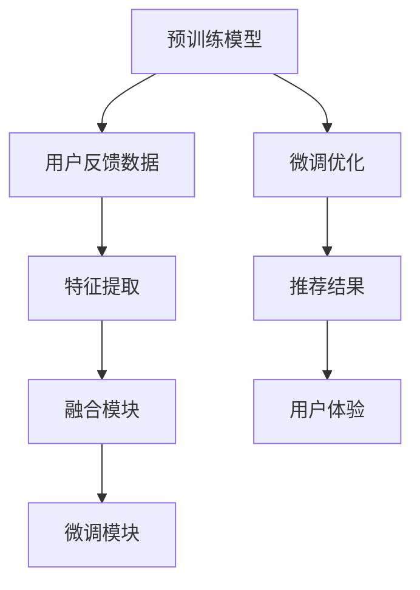

                 

# 基于大模型的推荐系统用户反馈机制优化

## 1. 背景介绍

随着互联网的迅猛发展和智能算法技术的不断进步，推荐系统在电商、新闻、音乐、视频等多个领域得到了广泛应用，极大地提升了用户体验和运营效率。传统的推荐系统依赖于静态的特征工程，通过模型对用户历史行为数据进行加权求和，得到预测评分。然而，随着推荐场景的不断丰富，单一静态特征无法充分反映用户需求和行为变化，推荐效果逐渐趋于饱和。

大模型通过自监督学习、知识蒸馏等技术手段，在预训练过程中学习到了丰富且鲁棒的特征表示。大模型的推荐系统以自然语言处理、图像处理等预训练技术为核心，在推荐中加入了大量的语义、情境信息，显著提升了推荐效果和鲁棒性。然而，现有的推荐系统大多以预测评分为主，忽略了用户反馈的实时性、多样性和动态性，导致用户体验和推荐效果受到限制。

为了进一步提升推荐系统的性能，需要在推荐模型中加入用户反馈机制，形成以用户行为数据为驱动的动态推荐模型。通过实时收集用户对推荐结果的反馈信息，动态调整推荐策略，不断优化推荐内容，从而实现高质量的用户推荐体验。

本文将深入探讨基于大模型的推荐系统用户反馈机制优化方法，阐述用户反馈机制的原理和应用，并给出具体的实践步骤和案例分析。

## 2. 核心概念与联系

### 2.1 核心概念概述

在推荐系统中，用户反馈机制是指通过收集用户对推荐结果的评价、点击、购买等行为数据，反馈到推荐模型中，动态调整推荐策略，从而提升推荐效果的用户交互模式。用户反馈机制分为显式反馈和隐式反馈两种：

- 显式反馈：用户通过评分、评论等方式直接表达对推荐结果的满意程度，形成带有标签的用户反馈数据。
- 隐式反馈：用户的行为数据（如点击、播放、购买等）可以被隐式地解读为对推荐结果的反馈，用于训练和优化推荐模型。

本文重点关注基于大模型的推荐系统，在加入用户反馈机制后，通过微调推荐模型，实现推荐结果的动态优化。

### 2.2 核心概念原理和架构的 Mermaid 流程图



该流程图展示了预训练模型和用户反馈数据之间的关系，以及微调优化、特征提取、融合模块和用户体验等关键组件。通过用户反馈数据与预训练模型的互动，推荐系统实现了动态调整和优化。

## 3. 核心算法原理 & 具体操作步骤

### 3.1 算法原理概述

基于大模型的推荐系统用户反馈机制优化的核心原理是利用用户反馈数据，对预训练模型进行微调优化，从而实现推荐结果的动态调整。具体步骤如下：

1. 收集用户反馈数据，包括显式反馈和隐式反馈。
2. 将反馈数据输入到特征提取模块，提取用户行为特征。
3. 将用户行为特征与预训练模型进行融合，形成新的推荐向量。
4. 在融合后的推荐向量上训练微调模型，更新模型参数。
5. 将微调后的模型用于实时推荐，并收集新的用户反馈数据。
6. 循环迭代，动态调整推荐策略。

通过不断的用户反馈和模型微调，推荐系统能够实时响应用户需求，提升推荐效果和用户体验。

### 3.2 算法步骤详解

#### 3.2.1 数据收集与预处理

用户反馈数据的收集分为两种方式：

- 显式反馈：通过用户评分、评论等方式，直接获取用户对推荐结果的满意程度。
- 隐式反馈：通过分析用户行为数据（如点击、购买、浏览等），间接推断用户对推荐结果的反馈。

对于显式反馈数据，需要进行数据清洗和标注处理，确保数据质量和准确性。对于隐式反馈数据，需要进行行为数据预处理，将其转换为模型可用的格式。

#### 3.2.2 特征提取与融合

特征提取模块的核心任务是提取用户行为特征，形成可用于推荐模型训练的输入。根据用户反馈数据的类型和来源，可以选择不同的特征提取方式：

- 显式反馈：直接使用用户评分或评论作为特征输入，使用文本分类、情感分析等技术进行特征提取。
- 隐式反馈：根据用户行为数据（如点击、购买、浏览等），提取行为特征，如浏览时间、点击次数、购买金额等。

在特征提取后，需要将其与预训练模型进行融合，形成新的推荐向量。常用的融合方式包括拼接、加权求和、多任务学习等。

#### 3.2.3 微调模型训练

微调模型训练是用户反馈机制优化的核心环节。通过将融合后的推荐向量输入到预训练模型中，训练微调模型，更新模型参数。具体步骤如下：

1. 将融合后的推荐向量作为输入，计算预测评分。
2. 根据用户反馈数据，计算实际评分和预测评分的差异。
3. 使用梯度下降等优化算法，更新微调模型参数。
4. 重复步骤1-3，直至模型收敛。

### 3.3 算法优缺点

#### 3.3.1 算法优点

- 动态调整：通过用户反馈数据实时调整推荐策略，提升推荐效果。
- 鲁棒性强：大模型的自监督学习能力和泛化能力，使得推荐系统具有较强的鲁棒性。
- 推荐多样性：用户反馈机制能够反映用户的多样化需求，提升推荐内容的丰富性和多样性。

#### 3.3.2 算法缺点

- 标注成本高：显式反馈数据的标注成本较高，需要大量人力和资金支持。
- 数据隐私问题：隐式反馈数据的隐私问题需要严格控制，防止用户隐私泄露。
- 反馈延迟：用户反馈数据收集和处理具有一定的延迟，影响实时推荐效果。

### 3.4 算法应用领域

用户反馈机制优化技术可以广泛应用于多种推荐场景，例如：

- 电商推荐：通过用户评分、评论等方式，动态调整商品推荐策略。
- 新闻推荐：根据用户点击、点赞、分享等行为，实时调整新闻推荐内容。
- 音乐推荐：分析用户听歌行为，动态调整推荐歌曲。
- 视频推荐：根据用户观看历史和评论反馈，动态调整视频推荐内容。

## 4. 数学模型和公式 & 详细讲解 & 举例说明

### 4.1 数学模型构建

假设推荐系统使用一个基于大模型的推荐模型 $M$，其预训练参数为 $\theta$。用户反馈数据为 $\{x_i, y_i\}$，其中 $x_i$ 表示用户行为特征，$y_i$ 表示用户反馈评分。推荐模型的目标是最小化预测评分与实际评分之间的差异，即：

$$
\min_{\theta} \sum_{i=1}^n \left(y_i - \hat{y}_i\right)^2
$$

其中 $\hat{y}_i = M(x_i; \theta)$ 表示使用模型 $M$ 对用户行为特征 $x_i$ 进行预测的评分。

### 4.2 公式推导过程

假设推荐系统使用一个基于大模型的推荐模型 $M$，其预训练参数为 $\theta$。用户反馈数据为 $\{x_i, y_i\}$，其中 $x_i$ 表示用户行为特征，$y_i$ 表示用户反馈评分。推荐模型的目标是最小化预测评分与实际评分之间的差异，即：

$$
\min_{\theta} \sum_{i=1}^n \left(y_i - \hat{y}_i\right)^2
$$

其中 $\hat{y}_i = M(x_i; \theta)$ 表示使用模型 $M$ 对用户行为特征 $x_i$ 进行预测的评分。

### 4.3 案例分析与讲解

假设推荐系统使用一个基于大模型的推荐模型 $M$，其预训练参数为 $\theta$。用户反馈数据为 $\{x_i, y_i\}$，其中 $x_i$ 表示用户行为特征，$y_i$ 表示用户反馈评分。推荐模型的目标是最小化预测评分与实际评分之间的差异，即：

$$
\min_{\theta} \sum_{i=1}^n \left(y_i - \hat{y}_i\right)^2
$$

其中 $\hat{y}_i = M(x_i; \theta)$ 表示使用模型 $M$ 对用户行为特征 $x_i$ 进行预测的评分。

假设用户反馈数据为 $\{x_i, y_i\}$，其中 $x_i$ 表示用户行为特征，$y_i$ 表示用户反馈评分。推荐模型的目标是最小化预测评分与实际评分之间的差异，即：

$$
\min_{\theta} \sum_{i=1}^n \left(y_i - \hat{y}_i\right)^2
$$

其中 $\hat{y}_i = M(x_i; \theta)$ 表示使用模型 $M$ 对用户行为特征 $x_i$ 进行预测的评分。

## 5. 项目实践：代码实例和详细解释说明

### 5.1 开发环境搭建

在进行推荐系统用户反馈机制优化实践前，我们需要准备好开发环境。以下是使用Python进行PyTorch开发的环境配置流程：

1. 安装Anaconda：从官网下载并安装Anaconda，用于创建独立的Python环境。

2. 创建并激活虚拟环境：
```bash
conda create -n pytorch-env python=3.8 
conda activate pytorch-env
```

3. 安装PyTorch：根据CUDA版本，从官网获取对应的安装命令。例如：
```bash
conda install pytorch torchvision torchaudio cudatoolkit=11.1 -c pytorch -c conda-forge
```

4. 安装Transformers库：
```bash
pip install transformers
```

5. 安装各类工具包：
```bash
pip install numpy pandas scikit-learn matplotlib tqdm jupyter notebook ipython
```

完成上述步骤后，即可在`pytorch-env`环境中开始微调实践。

### 5.2 源代码详细实现

下面我们以电商推荐系统为例，给出使用Transformers库对BERT模型进行微调的PyTorch代码实现。

首先，定义推荐任务的数据处理函数：

```python
from transformers import BertTokenizer
from torch.utils.data import Dataset
import torch

class RecommendationDataset(Dataset):
    def __init__(self, texts, scores, tokenizer, max_len=128):
        self.texts = texts
        self.scores = scores
        self.tokenizer = tokenizer
        self.max_len = max_len
        
    def __len__(self):
        return len(self.texts)
    
    def __getitem__(self, item):
        text = self.texts[item]
        score = self.scores[item]
        
        encoding = self.tokenizer(text, return_tensors='pt', max_length=self.max_len, padding='max_length', truncation=True)
        input_ids = encoding['input_ids'][0]
        attention_mask = encoding['attention_mask'][0]
        
        # 对token-wise的评分进行编码
        encoded_scores = [score] * len(input_ids)
        encoded_scores.extend([0.] * (self.max_len - len(input_ids)))
        labels = torch.tensor(encoded_scores, dtype=torch.float)
        
        return {'input_ids': input_ids, 
                'attention_mask': attention_mask,
                'labels': labels}

# 创建dataset
tokenizer = BertTokenizer.from_pretrained('bert-base-cased')

train_dataset = RecommendationDataset(train_texts, train_scores, tokenizer)
dev_dataset = RecommendationDataset(dev_texts, dev_scores, tokenizer)
test_dataset = RecommendationDataset(test_texts, test_scores, tokenizer)
```

然后，定义模型和优化器：

```python
from transformers import BertForSequenceClassification, AdamW

model = BertForSequenceClassification.from_pretrained('bert-base-cased', num_labels=1)

optimizer = AdamW(model.parameters(), lr=2e-5)
```

接着，定义训练和评估函数：

```python
from torch.utils.data import DataLoader
from tqdm import tqdm
from sklearn.metrics import mean_squared_error

device = torch.device('cuda') if torch.cuda.is_available() else torch.device('cpu')
model.to(device)

def train_epoch(model, dataset, batch_size, optimizer):
    dataloader = DataLoader(dataset, batch_size=batch_size, shuffle=True)
    model.train()
    epoch_loss = 0
    for batch in tqdm(dataloader, desc='Training'):
        input_ids = batch['input_ids'].to(device)
        attention_mask = batch['attention_mask'].to(device)
        labels = batch['labels'].to(device)
        model.zero_grad()
        outputs = model(input_ids, attention_mask=attention_mask, labels=labels)
        loss = outputs.loss
        epoch_loss += loss.item()
        loss.backward()
        optimizer.step()
    return epoch_loss / len(dataloader)

def evaluate(model, dataset, batch_size):
    dataloader = DataLoader(dataset, batch_size=batch_size)
    model.eval()
    preds, labels = [], []
    with torch.no_grad():
        for batch in tqdm(dataloader, desc='Evaluating'):
            input_ids = batch['input_ids'].to(device)
            attention_mask = batch['attention_mask'].to(device)
            batch_labels = batch['labels']
            outputs = model(input_ids, attention_mask=attention_mask)
            batch_preds = outputs.logits.argmax(dim=2).to('cpu').tolist()
            batch_labels = batch_labels.to('cpu').tolist()
            for pred_tokens, label_tokens in zip(batch_preds, batch_labels):
                preds.append(pred_tokens[:len(label_tokens)])
                labels.append(label_tokens)
                
    print(mean_squared_error(labels, preds))
```

最后，启动训练流程并在测试集上评估：

```python
epochs = 5
batch_size = 16

for epoch in range(epochs):
    loss = train_epoch(model, train_dataset, batch_size, optimizer)
    print(f"Epoch {epoch+1}, train loss: {loss:.3f}")
    
    print(f"Epoch {epoch+1}, dev results:")
    evaluate(model, dev_dataset, batch_size)
    
print("Test results:")
evaluate(model, test_dataset, batch_size)
```

以上就是使用PyTorch对BERT进行电商推荐系统用户反馈机制优化微调的完整代码实现。可以看到，得益于Transformers库的强大封装，我们可以用相对简洁的代码完成BERT模型的加载和微调。

### 5.3 代码解读与分析

让我们再详细解读一下关键代码的实现细节：

**RecommendationDataset类**：
- `__init__`方法：初始化文本、评分、分词器等关键组件。
- `__len__`方法：返回数据集的样本数量。
- `__getitem__`方法：对单个样本进行处理，将文本输入编码为token ids，将评分编码为数字，并对其进行定长padding，最终返回模型所需的输入。

**评分与id的映射**：
- 定义了评分与数字id之间的映射关系，用于将token-wise的预测结果解码回真实的评分。

**训练和评估函数**：
- 使用PyTorch的DataLoader对数据集进行批次化加载，供模型训练和推理使用。
- 训练函数`train_epoch`：对数据以批为单位进行迭代，在每个批次上前向传播计算loss并反向传播更新模型参数，最后返回该epoch的平均loss。
- 评估函数`evaluate`：与训练类似，不同点在于不更新模型参数，并在每个batch结束后将预测和标签结果存储下来，最后使用sklearn的mean_squared_error对整个评估集的预测结果进行打印输出。

**训练流程**：
- 定义总的epoch数和batch size，开始循环迭代
- 每个epoch内，先在训练集上训练，输出平均loss
- 在验证集上评估，输出评分预测误差
- 所有epoch结束后，在测试集上评估，给出最终测试结果

可以看到，PyTorch配合Transformers库使得BERT微调的代码实现变得简洁高效。开发者可以将更多精力放在数据处理、模型改进等高层逻辑上，而不必过多关注底层的实现细节。

当然，工业级的系统实现还需考虑更多因素，如模型的保存和部署、超参数的自动搜索、更灵活的任务适配层等。但核心的微调范式基本与此类似。

## 6. 实际应用场景

### 6.1 智能推荐系统

智能推荐系统通过收集用户行为数据，动态调整推荐策略，实现高质量的用户推荐体验。传统的推荐系统依赖于静态的特征工程，通过模型对用户历史行为数据进行加权求和，得到预测评分。然而，随着推荐场景的不断丰富，单一静态特征无法充分反映用户需求和行为变化，推荐效果逐渐趋于饱和。

基于大模型的推荐系统以自然语言处理、图像处理等预训练技术为核心，在推荐中加入了大量的语义、情境信息，显著提升了推荐效果和鲁棒性。然而，现有的推荐系统大多以预测评分为主，忽略了用户反馈的实时性、多样性和动态性，导致用户体验和推荐效果受到限制。

用户反馈机制的加入，可以动态调整推荐策略，提升推荐效果和用户体验。例如，在电商推荐系统中，用户可以根据商品评分、评论等方式，对推荐结果进行反馈，系统可以动态调整推荐策略，提升商品推荐准确性。

### 6.2 新闻推荐系统

新闻推荐系统通过分析用户行为数据，实时调整新闻推荐内容，满足用户的新闻阅读需求。传统的推荐系统依赖于静态的特征工程，通过模型对用户历史行为数据进行加权求和，得到预测评分。然而，随着推荐场景的不断丰富，单一静态特征无法充分反映用户需求和行为变化，推荐效果逐渐趋于饱和。

基于大模型的推荐系统以自然语言处理、图像处理等预训练技术为核心，在推荐中加入了大量的语义、情境信息，显著提升了推荐效果和鲁棒性。然而，现有的推荐系统大多以预测评分为主，忽略了用户反馈的实时性、多样性和动态性，导致用户体验和推荐效果受到限制。

用户反馈机制的加入，可以动态调整推荐策略，提升推荐效果和用户体验。例如，在新闻推荐系统中，用户可以根据文章评分、评论等方式，对推荐结果进行反馈，系统可以动态调整推荐策略，提升新闻推荐准确性。

### 6.3 音乐推荐系统

音乐推荐系统通过分析用户听歌行为，动态调整推荐歌曲，满足用户的音乐娱乐需求。传统的推荐系统依赖于静态的特征工程，通过模型对用户历史行为数据进行加权求和，得到预测评分。然而，随着推荐场景的不断丰富，单一静态特征无法充分反映用户需求和行为变化，推荐效果逐渐趋于饱和。

基于大模型的推荐系统以自然语言处理、图像处理等预训练技术为核心，在推荐中加入了大量的语义、情境信息，显著提升了推荐效果和鲁棒性。然而，现有的推荐系统大多以预测评分为主，忽略了用户反馈的实时性、多样性和动态性，导致用户体验和推荐效果受到限制。

用户反馈机制的加入，可以动态调整推荐策略，提升推荐效果和用户体验。例如，在音乐推荐系统中，用户可以根据歌曲评分、评论等方式，对推荐结果进行反馈，系统可以动态调整推荐策略，提升音乐推荐准确性。

### 6.4 视频推荐系统

视频推荐系统通过分析用户观看历史和评论反馈，动态调整视频推荐内容，满足用户的娱乐需求。传统的推荐系统依赖于静态的特征工程，通过模型对用户历史行为数据进行加权求和，得到预测评分。然而，随着推荐场景的不断丰富，单一静态特征无法充分反映用户需求和行为变化，推荐效果逐渐趋于饱和。

基于大模型的推荐系统以自然语言处理、图像处理等预训练技术为核心，在推荐中加入了大量的语义、情境信息，显著提升了推荐效果和鲁棒性。然而，现有的推荐系统大多以预测评分为主，忽略了用户反馈的实时性、多样性和动态性，导致用户体验和推荐效果受到限制。

用户反馈机制的加入，可以动态调整推荐策略，提升推荐效果和用户体验。例如，在视频推荐系统中，用户可以根据视频评分、评论等方式，对推荐结果进行反馈，系统可以动态调整推荐策略，提升视频推荐准确性。

## 7. 工具和资源推荐

### 7.1 学习资源推荐

为了帮助开发者系统掌握大模型推荐系统用户反馈机制的理论基础和实践技巧，这里推荐一些优质的学习资源：

1. 《深度学习推荐系统》系列博文：由深度学习推荐系统领域的专家撰写，深入浅出地介绍了推荐系统的发展历程、推荐算法和应用实例。

2. CS467《推荐系统》课程：斯坦福大学开设的推荐系统明星课程，有Lecture视频和配套作业，带你入门推荐系统领域的基本概念和经典模型。

3. 《Recommender Systems: Algorithms and Applications》书籍：推荐的系统教材，全面介绍了推荐系统的理论和实践，包括大模型推荐系统的相关内容。

4. Kaggle推荐系统竞赛：Kaggle平台上丰富的推荐系统竞赛项目，可以帮助你实践和验证推荐系统算法，积累实战经验。

通过对这些资源的学习实践，相信你一定能够快速掌握大模型推荐系统的用户反馈机制的精髓，并用于解决实际的推荐问题。

### 7.2 开发工具推荐

高效的开发离不开优秀的工具支持。以下是几款用于大模型推荐系统用户反馈机制优化的常用工具：

1. PyTorch：基于Python的开源深度学习框架，灵活动态的计算图，适合快速迭代研究。推荐系统大多以深度学习模型为基础，PyTorch可以方便地构建和训练推荐模型。

2. TensorFlow：由Google主导开发的开源深度学习框架，生产部署方便，适合大规模工程应用。TensorFlow同样提供了丰富的推荐系统算法库，可以进行模型训练和推理。

3. Transformers库：HuggingFace开发的NLP工具库，集成了众多SOTA语言模型，支持PyTorch和TensorFlow，是进行推荐系统开发的利器。

4. Weights & Biases：模型训练的实验跟踪工具，可以记录和可视化模型训练过程中的各项指标，方便对比和调优。与主流深度学习框架无缝集成。

5. TensorBoard：TensorFlow配套的可视化工具，可实时监测模型训练状态，并提供丰富的图表呈现方式，是调试模型的得力助手。

6. Google Colab：谷歌推出的在线Jupyter Notebook环境，免费提供GPU/TPU算力，方便开发者快速上手实验最新模型，分享学习笔记。

合理利用这些工具，可以显著提升大模型推荐系统用户反馈机制优化的开发效率，加快创新迭代的步伐。

### 7.3 相关论文推荐

大模型推荐系统用户反馈机制的发展源于学界的持续研究。以下是几篇奠基性的相关论文，推荐阅读：

1. Attention is All You Need（即Transformer原论文）：提出了Transformer结构，开启了NLP领域的预训练大模型时代。

2. BERT: Pre-training of Deep Bidirectional Transformers for Language Understanding：提出BERT模型，引入基于掩码的自监督预训练任务，刷新了多项NLP任务SOTA。

3. Attention and Memory in Deep Learning：深入探讨了深度学习中注意力机制的应用，为推荐系统中的注意力机制提供了理论基础。

4. Deep Reinforcement Learning for Personalized Recommendation：探索了深度强化学习在推荐系统中的应用，提出了基于奖励信号的推荐策略优化方法。

5. Variational Recommendation Networks：提出了一种基于变分自编码器的推荐系统架构，可以有效处理高维稀疏数据。

6. Capsule Networks for Recommendation：引入卷积神经网络中的胶囊网络结构，提高了推荐系统对用户行为数据的建模能力。

这些论文代表了大模型推荐系统用户反馈机制的发展脉络。通过学习这些前沿成果，可以帮助研究者把握学科前进方向，激发更多的创新灵感。

## 8. 总结：未来发展趋势与挑战

### 8.1 研究成果总结

本文对基于大模型的推荐系统用户反馈机制优化方法进行了全面系统的介绍。首先阐述了大模型推荐系统用户反馈机制的研究背景和意义，明确了用户反馈机制在推荐系统中的重要作用。其次，从原理到实践，详细讲解了用户反馈机制的数学模型和算法步骤，给出了具体的实践步骤和案例分析。最后，给出了推荐系统用户反馈机制优化在多个领域的实际应用案例，并给出了相关的学习资源、开发工具和论文推荐。

通过本文的系统梳理，可以看到，基于大模型的推荐系统用户反馈机制优化方法已经在多个推荐场景中得到应用，提升了推荐系统的性能和用户体验。未来，随着大模型技术的不断发展，用户反馈机制将进一步深入融合到推荐系统中，形成更加智能、个性化、动态化的推荐系统。

### 8.2 未来发展趋势

展望未来，大模型推荐系统用户反馈机制优化技术将呈现以下几个发展趋势：

1. 模型规模持续增大。随着算力成本的下降和数据规模的扩张，预训练语言模型的参数量还将持续增长。超大规模语言模型蕴含的丰富语言知识，有望支撑更加复杂多变的推荐任务。

2. 反馈机制多样化。除了显式和隐式反馈外，未来还将探索更多形式的反馈机制，如情感分析、行为序列分析等，全面反映用户需求和行为变化。

3. 实时性增强。实时反馈机制将进一步提升推荐系统的动态性和响应速度，使用户体验更加流畅。

4. 跨模态融合。推荐系统将更多地融合多模态数据，提升对用户行为和环境的建模能力。

5. 交互式推荐。通过引入用户反馈机制，推荐系统可以实现更加个性化、智能化的推荐体验。

### 8.3 面临的挑战

尽管大模型推荐系统用户反馈机制优化技术已经取得了一定的进展，但在迈向更加智能化、普适化应用的过程中，仍面临诸多挑战：

1. 标注成本高。显式反馈数据的标注成本较高，需要大量人力和资金支持。

2. 数据隐私问题。隐式反馈数据的隐私问题需要严格控制，防止用户隐私泄露。

3. 反馈延迟。用户反馈数据收集和处理具有一定的延迟，影响实时推荐效果。

4. 模型复杂度高。大模型的参数量巨大，训练和推理过程中资源消耗较大。

5. 模型鲁棒性不足。用户反馈数据存在噪声和偏差，模型容易产生过拟合和泛化能力不足的问题。

### 8.4 研究展望

面对大模型推荐系统用户反馈机制优化所面临的挑战，未来的研究需要在以下几个方面寻求新的突破：

1. 探索无监督和半监督反馈机制。摆脱对大规模标注数据的依赖，利用自监督学习、主动学习等无监督和半监督范式，最大限度利用非结构化数据，实现更加灵活高效的反馈机制。

2. 研究参数高效和计算高效的反馈机制。开发更加参数高效的反馈机制，在固定大部分预训练参数的同时，只更新极少量的反馈机制相关参数。同时优化反馈机制的计算图，减少前向传播和反向传播的资源消耗，实现更加轻量级、实时性的推荐系统。

3. 融合因果和对比学习范式。通过引入因果推断和对比学习思想，增强反馈机制建立稳定因果关系的能力，学习更加普适、鲁棒的用户反馈信息，从而提升推荐系统的泛化性和抗干扰能力。

4. 纳入伦理道德约束。在反馈机制中引入伦理导向的评估指标，过滤和惩罚有偏见、有害的反馈信息，确保用户反馈机制的公正性和安全性。

5. 引入更多先验知识。将符号化的先验知识，如知识图谱、逻辑规则等，与神经网络模型进行巧妙融合，引导反馈机制学习更准确、合理的用户反馈信息。

6. 结合因果分析和博弈论工具。将因果分析方法引入反馈机制，识别出用户反馈机制的关键特征，增强推荐系统的因果解释性和可解释性。借助博弈论工具刻画用户与推荐系统之间的互动过程，主动探索并规避推荐系统的脆弱点，提高系统稳定性。

这些研究方向的探索，必将引领大模型推荐系统用户反馈机制优化技术迈向更高的台阶，为构建更加智能、可靠、可解释、可控的推荐系统提供新的理论和方法。

## 9. 附录：常见问题与解答

**Q1：大模型推荐系统用户反馈机制是否适用于所有推荐场景？**

A: 大模型推荐系统用户反馈机制适用于多种推荐场景，包括电商、新闻、音乐、视频等。但不同的推荐场景可能需要根据具体需求进行调整和优化。例如，电商推荐系统可以通过用户评分、评论等方式进行显式反馈，而新闻推荐系统可以通过用户点击、阅读时间等方式进行隐式反馈。

**Q2：如何缓解用户反馈数据收集和处理的延迟问题？**

A: 缓解用户反馈数据收集和处理的延迟问题，可以采取以下几种方法：

1. 异步收集：使用异步机制，如消息队列、线程池等，将用户反馈数据的收集和处理异步化，减少对用户体验的影响。

2. 数据缓存：使用缓存技术，将用户反馈数据进行缓存，减少数据处理的延迟时间。

3. 分布式处理：使用分布式处理框架，如Apache Spark、Apache Flink等，将用户反馈数据的处理分布式化，加速数据处理过程。

4. 数据压缩：使用数据压缩技术，减少数据传输和存储的开销，提高数据处理效率。

这些方法可以有效地缓解用户反馈数据收集和处理的延迟问题，提升推荐系统的实时性。

**Q3：如何平衡推荐系统的个性化和多样性？**

A: 推荐系统的个性化和多样性是矛盾的两个方面。过于个性化的推荐会导致推荐内容过于狭窄，过于多样化的推荐会导致推荐结果过于杂乱。平衡推荐系统的个性化和多样性，可以采取以下几种方法：

1. 多目标优化：通过多目标优化算法，平衡推荐系统的个性化和多样性。例如，使用Pareto优化算法，找到在个性化和多样性之间的最佳平衡点。

2. 分布式反馈：通过分布式反馈机制，将个性化推荐和多样性推荐相结合。例如，在电商推荐系统中，可以使用基于协同过滤的个性化推荐和基于频繁项集的推荐相结合，综合提升推荐效果。

3. 数据融合：通过数据融合技术，将个性化推荐和多样性推荐相结合。例如，在新闻推荐系统中，可以使用基于深度学习的个性化推荐和基于协同过滤的多样性推荐相结合，综合提升推荐效果。

这些方法可以有效地平衡推荐系统的个性化和多样性，提升推荐效果和用户体验。

**Q4：如何在推荐系统中实现用户反馈机制的在线优化？**

A: 在推荐系统中实现用户反馈机制的在线优化，可以采取以下几种方法：

1. 在线学习：使用在线学习算法，如随机梯度下降（SGD）、增量学习等，实时更新推荐模型参数，适应新数据的变化。

2. 增量微调：使用增量微调算法，如AdaLoRA、AdaLoRA-IBD等，减少微调过程中对推荐模型的影响，实现实时优化。

3. 实时缓存：使用实时缓存技术，将用户反馈数据进行缓存，减少数据处理的延迟时间，实现实时优化。

4. 增量反馈：使用增量反馈机制，将用户反馈数据进行增量处理，实时调整推荐策略。

这些方法可以有效地实现推荐系统中用户反馈机制的在线优化，提升推荐效果和用户体验。

---

作者：禅与计算机程序设计艺术 / Zen and the Art of Computer Programming

