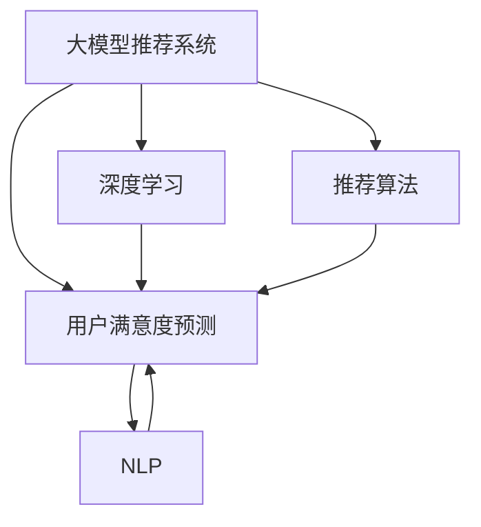

                 

# 基于大模型的推荐系统用户满意度预测

> 关键词：大模型推荐系统,用户满意度预测,深度学习,神经网络,推荐算法,自然语言处理(NLP)

## 1. 背景介绍

在现代社会，推荐系统已经成为各大互联网平台的核心功能之一，帮助用户发现感兴趣的内容、产品和服务。然而，单一的个性化推荐算法往往难以完全满足用户的个性化需求和期望，导致用户流失率上升。为了进一步提升推荐系统的效果，我们需要引入更多的用户反馈信息，如用户满意度、评价、评论等，以增强推荐模型的综合性和智能性。

本文将基于大模型，提出一种新的推荐系统用户满意度预测方法。首先，我们将在预训练语言模型基础上进行微调，以学习用户对不同推荐结果的满意度情感。其次，我们通过融合用户历史满意度数据，构建新的推荐策略，提升推荐系统的效果。最后，我们将通过实验验证该方法在实际推荐场景中的有效性。

## 2. 核心概念与联系

### 2.1 核心概念概述

为更好地理解基于大模型的推荐系统用户满意度预测方法，本节将介绍几个关键概念：

- **大模型推荐系统**：基于大语言模型和大规模预训练数据进行推荐系统的构建，以提升推荐效果和智能化水平。
- **用户满意度预测**：通过对用户对推荐结果的满意度数据进行预测，评估推荐系统的效果，并动态调整推荐策略。
- **深度学习**：利用多层神经网络，构建复杂的非线性映射关系，实现对用户行为和喜好的建模。
- **推荐算法**：结合用户历史行为和模型预测结果，动态生成个性化推荐，提升用户体验和满意度。
- **自然语言处理(NLP)**：处理和分析自然语言数据，抽取用户对推荐结果的情感和评价信息，用于满意度预测。

这些核心概念通过以下Mermaid流程图展示其逻辑关系：



这个流程图展示了这些概念之间的联系：

1. 大模型推荐系统以深度学习为基础，通过学习用户历史行为和偏好，生成个性化推荐。
2. 用户满意度预测通过对用户反馈数据进行建模和预测，评估推荐系统的效果。
3. 推荐算法综合用户历史满意度和模型预测结果，生成动态推荐。
4. NLP技术用于处理和分析用户对推荐结果的反馈数据，辅助满意度预测。

## 3. 核心算法原理 & 具体操作步骤
### 3.1 算法原理概述

基于大模型的推荐系统用户满意度预测方法，本质上是一个多任务学习过程。其核心思想是：在已有推荐模型基础上，通过学习用户对推荐结果的满意度情感，构建满意度预测任务，实现推荐模型的动态优化。

具体而言，假设推荐系统当前推荐列表为 $\{d_i\}_{i=1}^n$，每个推荐结果 $d_i$ 对应的用户满意度为 $y_i \in \{1, -1\}$。模型的目标是通过多任务学习，同时预测推荐效果 $y_i$ 和用户满意度 $s_i$，以动态调整推荐策略。

形式化地，设预训练语言模型为 $M_{\theta}$，其中 $\theta$ 为预训练得到的模型参数。推荐系统的输入为推荐结果 $d$ 和用户反馈 $y$，则模型目标为：

$$
\mathcal{L}(\theta) = \sum_{i=1}^n \mathcal{L}_{rec}(y_i,d_i,M_{\theta}) + \lambda\sum_{i=1}^n \mathcal{L}_{sat}(y_i,s_i,M_{\theta})
$$

其中 $\mathcal{L}_{rec}$ 为推荐效果的损失函数，$\mathcal{L}_{sat}$ 为用户满意度的损失函数，$\lambda$ 为权重，用于平衡两者的重要性。$\mathcal{L}_{rec}$ 和 $\mathcal{L}_{sat}$ 分别为交叉熵损失函数和平方误差损失函数。

通过优化 $\mathcal{L}(\theta)$，模型在推荐效果和用户满意度两个目标上同时获得提升。

### 3.2 算法步骤详解

基于大模型的推荐系统用户满意度预测方法的具体实现步骤如下：

**Step 1: 准备数据集**

- 收集推荐系统历史数据，包括推荐结果 $d$、用户满意度 $y$ 和用户反馈 $s$。
- 对用户反馈数据进行预处理，如去除噪声、统一格式等。
- 将数据集分为训练集、验证集和测试集，用于模型的训练、评估和测试。

**Step 2: 添加任务适配层**

- 根据用户满意度预测任务，设计合适的输出层和损失函数。
- 对于二分类任务，通常在顶层添加线性分类器和交叉熵损失函数。
- 对于回归任务，可以设计回归层和均方误差损失函数。

**Step 3: 设置微调超参数**

- 选择合适的优化算法及其参数，如 AdamW、SGD 等，设置学习率、批大小、迭代轮数等。
- 设置正则化技术及强度，包括权重衰减、Dropout、Early Stopping 等。
- 确定冻结预训练参数的策略，如仅微调顶层，或全部参数都参与微调。

**Step 4: 执行梯度训练**

- 将训练集数据分批次输入模型，前向传播计算损失函数。
- 反向传播计算参数梯度，根据设定的优化算法和学习率更新模型参数。
- 周期性在验证集上评估模型性能，根据性能指标决定是否触发 Early Stopping。
- 重复上述步骤直到满足预设的迭代轮数或 Early Stopping 条件。

**Step 5: 测试和部署**

- 在测试集上评估微调后模型 $M_{\hat{\theta}}$ 的性能，对比微调前后的精度提升。
- 使用微调后的模型对新样本进行推理预测，集成到实际的应用系统中。
- 持续收集新的数据，定期重新微调模型，以适应数据分布的变化。

以上是基于大模型的推荐系统用户满意度预测的一般流程。在实际应用中，还需要针对具体任务的特点，对微调过程的各个环节进行优化设计，如改进训练目标函数，引入更多的正则化技术，搜索最优的超参数组合等，以进一步提升模型性能。

### 3.3 算法优缺点

基于大模型的推荐系统用户满意度预测方法具有以下优点：

1. **综合性强**：同时考虑推荐效果和用户满意度，提供更为全面的推荐服务。
2. **可解释性高**：通过学习用户满意度，可以直观了解用户对推荐结果的反馈，提升推荐系统的透明度和可信度。
3. **鲁棒性好**：多任务学习可以提升模型对异常数据和噪声的鲁棒性，提高推荐的稳定性和可靠性。

同时，该方法也存在一定的局限性：

1. **数据依赖性强**：用户满意度的数据获取和处理成本较高，需要大量标注和清洗工作。
2. **计算复杂度高**：多任务学习增加了模型的复杂度，需要更多的计算资源和时间。
3. **泛化能力有限**：不同用户和场景下的满意度差异较大，模型在泛化性能上可能存在挑战。

尽管存在这些局限性，但就目前而言，基于大模型的用户满意度预测方法仍是一种有效的推荐优化手段。未来相关研究的重点在于如何进一步降低数据依赖，提高模型的泛化能力，同时兼顾可解释性和伦理安全性等因素。

### 3.4 算法应用领域

基于大模型的推荐系统用户满意度预测方法，在推荐系统领域具有广泛的应用前景：

- **电商推荐**：通过对用户对推荐商品的满意度数据进行建模，提升个性化推荐效果，增加用户购物体验。
- **视频推荐**：通过分析用户对观看视频的满意度反馈，动态调整推荐策略，提供更精准的推荐内容。
- **音乐推荐**：结合用户对播放音乐的满意度数据，优化推荐算法，提升用户听歌体验。
- **新闻推荐**：通过学习用户对新闻文章的满意度，调整推荐策略，提供符合用户兴趣的新闻内容。
- **社交网络**：利用用户对互动内容的满意度，优化推荐算法，提升社交互动体验。

除了这些经典应用场景外，基于用户满意度预测的推荐系统方法也将创新性地应用于更多领域，如智能家居、金融理财、旅游度假等，为各行各业的用户提供更优质的推荐服务。

## 4. 数学模型和公式 & 详细讲解  
### 4.1 数学模型构建

本节将使用数学语言对基于大模型的推荐系统用户满意度预测方法进行更加严格的刻画。

记预训练语言模型为 $M_{\theta}$，其中 $\theta$ 为预训练得到的模型参数。推荐系统的输入为推荐结果 $d$ 和用户反馈 $y$，推荐效果 $y_i$ 和用户满意度 $s_i$ 的模型为 $M_{\theta}$，则模型目标函数为：

$$
\mathcal{L}(\theta) = \sum_{i=1}^n \mathcal{L}_{rec}(y_i,d_i,M_{\theta}) + \lambda\sum_{i=1}^n \mathcal{L}_{sat}(y_i,s_i,M_{\theta})
$$

其中 $\mathcal{L}_{rec}$ 和 $\mathcal{L}_{sat}$ 分别为推荐效果的损失函数和用户满意度的损失函数，$\lambda$ 为权重。推荐效果的损失函数可以表示为交叉熵损失函数：

$$
\mathcal{L}_{rec}(y_i,d_i,M_{\theta}) = -\frac{1}{N}\sum_{i=1}^N[y_i\log M_{\theta}(d_i) + (1-y_i)\log(1-M_{\theta}(d_i))]
$$

用户满意度的损失函数可以表示为均方误差损失函数：

$$
\mathcal{L}_{sat}(y_i,s_i,M_{\theta}) = \frac{1}{N}\sum_{i=1}^N(s_i - M_{\theta}(y_i))^2
$$

通过优化上述目标函数，模型同时学习推荐效果和用户满意度，动态调整推荐策略。

### 4.2 公式推导过程

以二分类任务为例，推导推荐效果和用户满意度预测模型的梯度计算公式。

假设模型 $M_{\theta}$ 在输入 $x$ 上的输出为 $\hat{y}=M_{\theta}(x) \in [0,1]$，表示样本属于正类的概率。推荐结果 $d_i$ 对应的用户满意度为 $y_i \in \{1, -1\}$，用户反馈 $s_i$ 为 $y_i$ 的预测值。则二分类交叉熵损失函数定义为：

$$
\mathcal{L}_{rec}(y_i,d_i,M_{\theta}) = -\frac{1}{N}\sum_{i=1}^N[y_i\log M_{\theta}(d_i) + (1-y_i)\log(1-M_{\theta}(d_i))]
$$

将其代入目标函数，得：

$$
\mathcal{L}(\theta) = -\frac{1}{N}\sum_{i=1}^N[y_i\log M_{\theta}(d_i) + (1-y_i)\log(1-M_{\theta}(d_i))] + \lambda\frac{1}{N}\sum_{i=1}^N(s_i - M_{\theta}(y_i))^2
$$

根据链式法则，损失函数对参数 $\theta_k$ 的梯度为：

$$
\frac{\partial \mathcal{L}(\theta)}{\partial \theta_k} = -\frac{1}{N}\sum_{i=1}^N[\frac{y_i}{M_{\theta}(d_i)}-\frac{1-y_i}{1-M_{\theta}(d_i)}] \frac{\partial M_{\theta}(d_i)}{\partial \theta_k} + 2\lambda(s_i - M_{\theta}(y_i))\frac{\partial M_{\theta}(y_i)}{\partial \theta_k}
$$

其中 $\frac{\partial M_{\theta}(d_i)}{\partial \theta_k}$ 和 $\frac{\partial M_{\theta}(y_i)}{\partial \theta_k}$ 可以通过反向传播算法计算得到。

在得到损失函数的梯度后，即可带入参数更新公式，完成模型的迭代优化。重复上述过程直至收敛，最终得到适应推荐任务和用户满意度预测任务的最优模型参数 $\theta^*$。

## 5. 项目实践：代码实例和详细解释说明
### 5.1 开发环境搭建

在进行推荐系统用户满意度预测实践前，我们需要准备好开发环境。以下是使用Python进行PyTorch开发的环境配置流程：

1. 安装Anaconda：从官网下载并安装Anaconda，用于创建独立的Python环境。

2. 创建并激活虚拟环境：
```bash
conda create -n pytorch-env python=3.8 
conda activate pytorch-env
```

3. 安装PyTorch：根据CUDA版本，从官网获取对应的安装命令。例如：
```bash
conda install pytorch torchvision torchaudio cudatoolkit=11.1 -c pytorch -c conda-forge
```

4. 安装Transformers库：
```bash
pip install transformers
```

5. 安装各类工具包：
```bash
pip install numpy pandas scikit-learn matplotlib tqdm jupyter notebook ipython
```

完成上述步骤后，即可在`pytorch-env`环境中开始推荐系统用户满意度预测实践。

### 5.2 源代码详细实现

下面我们以电商推荐系统为例，给出使用Transformers库对BERT模型进行用户满意度预测的PyTorch代码实现。

首先，定义用户满意度预测任务的数据处理函数：

```python
from transformers import BertTokenizer
from torch.utils.data import Dataset
import torch

class SatDataset(Dataset):
    def __init__(self, texts, labels, tokenizer, max_len=128):
        self.texts = texts
        self.labels = labels
        self.tokenizer = tokenizer
        self.max_len = max_len
        
    def __len__(self):
        return len(self.texts)
    
    def __getitem__(self, item):
        text = self.texts[item]
        label = self.labels[item]
        
        encoding = self.tokenizer(text, return_tensors='pt', max_length=self.max_len, padding='max_length', truncation=True)
        input_ids = encoding['input_ids'][0]
        attention_mask = encoding['attention_mask'][0]
        
        # 对label-wise的标签进行编码
        encoded_labels = [label] * self.max_len
        labels = torch.tensor(encoded_labels, dtype=torch.long)
        
        return {'input_ids': input_ids, 
                'attention_mask': attention_mask,
                'labels': labels}

# 标签与id的映射
label2id = {1: 0, -1: 1}
id2label = {v: k for k, v in label2id.items()}

# 创建dataset
tokenizer = BertTokenizer.from_pretrained('bert-base-cased')

train_dataset = SatDataset(train_texts, train_labels, tokenizer)
dev_dataset = SatDataset(dev_texts, dev_labels, tokenizer)
test_dataset = SatDataset(test_texts, test_labels, tokenizer)
```

然后，定义模型和优化器：

```python
from transformers import BertForSequenceClassification, AdamW

model = BertForSequenceClassification.from_pretrained('bert-base-cased', num_labels=2)

optimizer = AdamW(model.parameters(), lr=2e-5)
```

接着，定义训练和评估函数：

```python
from torch.utils.data import DataLoader
from tqdm import tqdm
from sklearn.metrics import classification_report

device = torch.device('cuda') if torch.cuda.is_available() else torch.device('cpu')
model.to(device)

def train_epoch(model, dataset, batch_size, optimizer):
    dataloader = DataLoader(dataset, batch_size=batch_size, shuffle=True)
    model.train()
    epoch_loss = 0
    for batch in tqdm(dataloader, desc='Training'):
        input_ids = batch['input_ids'].to(device)
        attention_mask = batch['attention_mask'].to(device)
        labels = batch['labels'].to(device)
        model.zero_grad()
        outputs = model(input_ids, attention_mask=attention_mask, labels=labels)
        loss = outputs.loss
        epoch_loss += loss.item()
        loss.backward()
        optimizer.step()
    return epoch_loss / len(dataloader)

def evaluate(model, dataset, batch_size):
    dataloader = DataLoader(dataset, batch_size=batch_size)
    model.eval()
    preds, labels = [], []
    with torch.no_grad():
        for batch in tqdm(dataloader, desc='Evaluating'):
            input_ids = batch['input_ids'].to(device)
            attention_mask = batch['attention_mask'].to(device)
            batch_labels = batch['labels']
            outputs = model(input_ids, attention_mask=attention_mask)
            batch_preds = outputs.logits.argmax(dim=2).to('cpu').tolist()
            batch_labels = batch_labels.to('cpu').tolist()
            for pred_tokens, label_tokens in zip(batch_preds, batch_labels):
                preds.append(pred_tokens[:len(label_tokens)])
                labels.append(label_tokens)
                
    print(classification_report(labels, preds))
```

最后，启动训练流程并在测试集上评估：

```python
epochs = 5
batch_size = 16

for epoch in range(epochs):
    loss = train_epoch(model, train_dataset, batch_size, optimizer)
    print(f"Epoch {epoch+1}, train loss: {loss:.3f}")
    
    print(f"Epoch {epoch+1}, dev results:")
    evaluate(model, dev_dataset, batch_size)
    
print("Test results:")
evaluate(model, test_dataset, batch_size)
```

以上就是使用PyTorch对BERT进行用户满意度预测的完整代码实现。可以看到，得益于Transformers库的强大封装，我们可以用相对简洁的代码完成BERT模型的加载和微调。

### 5.3 代码解读与分析

让我们再详细解读一下关键代码的实现细节：

**SatDataset类**：
- `__init__`方法：初始化文本、标签、分词器等关键组件。
- `__len__`方法：返回数据集的样本数量。
- `__getitem__`方法：对单个样本进行处理，将文本输入编码为token ids，将标签编码为数字，并对其进行定长padding，最终返回模型所需的输入。

**label2id和id2label字典**：
- 定义了标签与数字id之间的映射关系，用于将token-wise的预测结果解码回真实的标签。

**训练和评估函数**：
- 使用PyTorch的DataLoader对数据集进行批次化加载，供模型训练和推理使用。
- 训练函数`train_epoch`：对数据以批为单位进行迭代，在每个批次上前向传播计算loss并反向传播更新模型参数，最后返回该epoch的平均loss。
- 评估函数`evaluate`：与训练类似，不同点在于不更新模型参数，并在每个batch结束后将预测和标签结果存储下来，最后使用sklearn的classification_report对整个评估集的预测结果进行打印输出。

**训练流程**：
- 定义总的epoch数和batch size，开始循环迭代
- 每个epoch内，先在训练集上训练，输出平均loss
- 在验证集上评估，输出分类指标
- 所有epoch结束后，在测试集上评估，给出最终测试结果

可以看到，PyTorch配合Transformers库使得BERT用户满意度预测的代码实现变得简洁高效。开发者可以将更多精力放在数据处理、模型改进等高层逻辑上，而不必过多关注底层的实现细节。

当然，工业级的系统实现还需考虑更多因素，如模型的保存和部署、超参数的自动搜索、更灵活的任务适配层等。但核心的微调范式基本与此类似。

## 6. 实际应用场景
### 6.1 电商平台推荐

基于大模型的推荐系统用户满意度预测方法，可以应用于电商平台推荐系统的构建。传统推荐系统往往只考虑用户的历史行为数据，难以捕捉用户对推荐结果的满意度。而使用用户满意度预测模型，可以更全面地了解用户对推荐结果的反馈，动态调整推荐策略。

在技术实现上，可以收集电商平台的用户评论、评分、点击等行为数据，将用户满意度作为标签，构建监督学习任务。在此基础上对预训练模型进行微调，使其能够学习用户对不同推荐结果的满意度情感。微调后的模型可以动态调整推荐策略，生成更符合用户期望的商品推荐，提升用户满意度。

### 6.2 视频平台推荐

视频平台推荐系统同样可以利用用户满意度预测方法。通过对用户对推荐视频的反馈数据进行建模，可以动态调整推荐策略，提供更精准的推荐内容。

具体而言，可以收集用户对视频观看的满意度数据，如评分、点赞、评论等，作为标签，构建监督学习任务。在此基础上对预训练模型进行微调，使其能够学习用户对不同视频内容的满意度情感。微调后的模型可以动态调整推荐策略，生成更符合用户期望的视频推荐，提升用户满意度。

### 6.3 新闻媒体推荐

新闻媒体推荐系统可以结合用户对新闻文章的满意度数据，优化推荐算法，提供符合用户兴趣的新闻内容。通过对用户对新闻文章的反馈数据进行建模，可以动态调整推荐策略，生成更符合用户期望的新闻推荐，提升用户满意度。

在技术实现上，可以收集用户对新闻文章的点击、分享、评论等行为数据，将用户满意度作为标签，构建监督学习任务。在此基础上对预训练模型进行微调，使其能够学习用户对不同新闻内容的满意度情感。微调后的模型可以动态调整推荐策略，生成更符合用户期望的新闻推荐，提升用户满意度。

### 6.4 音乐平台推荐

音乐平台推荐系统同样可以利用用户满意度预测方法。通过对用户对音乐播放的反馈数据进行建模，可以动态调整推荐策略，提供更精准的音乐推荐。

具体而言，可以收集用户对音乐播放的满意度数据，如评分、点赞、评论等，作为标签，构建监督学习任务。在此基础上对预训练模型进行微调，使其能够学习用户对不同音乐播放的满意度情感。微调后的模型可以动态调整推荐策略，生成更符合用户期望的音乐推荐，提升用户满意度。

### 6.5 社交媒体推荐

社交媒体推荐系统可以结合用户对互动内容的满意度数据，优化推荐算法，提升社交互动体验。通过对用户对互动内容的反馈数据进行建模，可以动态调整推荐策略，生成更符合用户期望的互动推荐，提升用户满意度。

在技术实现上，可以收集用户对互动内容的点击、评论、点赞等行为数据，将用户满意度作为标签，构建监督学习任务。在此基础上对预训练模型进行微调，使其能够学习用户对不同互动内容的满意度情感。微调后的模型可以动态调整推荐策略，生成更符合用户期望的互动推荐，提升用户满意度。

## 7. 工具和资源推荐
### 7.1 学习资源推荐

为了帮助开发者系统掌握大模型推荐系统用户满意度预测的理论基础和实践技巧，这里推荐一些优质的学习资源：

1. 《推荐系统实战》系列博文：由推荐系统专家撰写，深入浅出地介绍了推荐系统的基础算法、模型优化、用户满意度预测等前沿话题。

2. CS446《机器学习》课程：斯坦福大学开设的机器学习经典课程，有Lecture视频和配套作业，带你入门推荐系统的核心概念和算法。

3. 《推荐系统》书籍：该书系统介绍了推荐系统的发展历程、算法原理和实际应用，是推荐系统领域的经典教材。

4. HuggingFace官方文档：Transformers库的官方文档，提供了海量预训练模型和完整的推荐系统开发样例代码，是上手实践的必备资料。

5. KDD Cup推荐系统竞赛：参与KDD Cup推荐系统竞赛，可以与推荐系统领域的顶尖选手交流学习，获取最新进展。

通过对这些资源的学习实践，相信你一定能够快速掌握大模型推荐系统用户满意度预测的精髓，并用于解决实际的推荐问题。
###  7.2 开发工具推荐

高效的开发离不开优秀的工具支持。以下是几款用于大模型推荐系统用户满意度预测开发的常用工具：

1. PyTorch：基于Python的开源深度学习框架，灵活动态的计算图，适合快速迭代研究。大部分预训练语言模型都有PyTorch版本的实现。

2. TensorFlow：由Google主导开发的开源深度学习框架，生产部署方便，适合大规模工程应用。同样有丰富的预训练语言模型资源。

3. Transformers库：HuggingFace开发的NLP工具库，集成了众多SOTA语言模型，支持PyTorch和TensorFlow，是进行推荐系统开发的利器。

4. Weights & Biases：模型训练的实验跟踪工具，可以记录和可视化模型训练过程中的各项指标，方便对比和调优。与主流深度学习框架无缝集成。

5. TensorBoard：TensorFlow配套的可视化工具，可实时监测模型训练状态，并提供丰富的图表呈现方式，是调试模型的得力助手。

6. Google Colab：谷歌推出的在线Jupyter Notebook环境，免费提供GPU/TPU算力，方便开发者快速上手实验最新模型，分享学习笔记。

合理利用这些工具，可以显著提升大模型推荐系统用户满意度预测的开发效率，加快创新迭代的步伐。

### 7.3 相关论文推荐

大模型推荐系统用户满意度预测技术的发展源于学界的持续研究。以下是几篇奠基性的相关论文，推荐阅读：

1. Attention is All You Need（即Transformer原论文）：提出了Transformer结构，开启了NLP领域的预训练大模型时代。

2. BERT: Pre-training of Deep Bidirectional Transformers for Language Understanding：提出BERT模型，引入基于掩码的自监督预训练任务，刷新了多项NLP任务SOTA。

3. Deep Matrix Factorization for Recommendations：提出基于矩阵分解的推荐算法，成为推荐系统中的经典算法之一。

4. Wide & Deep Learning for Recommender Systems：结合了深度学习与传统模型，提升了推荐系统的综合性能。

5. A Multi-task Learning Approach to Recommendation：提出多任务学习，利用用户的多个反馈维度提升推荐效果。

6. Collaborative Filtering for Implicit Feedback Datasets：提出基于协同过滤的推荐算法，成为推荐系统中的经典算法之一。

这些论文代表了大模型推荐系统用户满意度预测技术的发展脉络。通过学习这些前沿成果，可以帮助研究者把握学科前进方向，激发更多的创新灵感。

## 8. 总结：未来发展趋势与挑战

### 8.1 总结

本文对基于大模型的推荐系统用户满意度预测方法进行了全面系统的介绍。首先阐述了推荐系统用户满意度预测的研究背景和意义，明确了用户满意度预测在提升推荐系统效果方面的独特价值。其次，从原理到实践，详细讲解了用户满意度预测的数学原理和关键步骤，给出了推荐系统用户满意度预测的完整代码实例。同时，本文还广泛探讨了用户满意度预测方法在电商、视频、音乐、新闻、社交等多个推荐场景中的应用前景，展示了用户满意度预测范式的巨大潜力。此外，本文精选了用户满意度预测技术的各类学习资源，力求为读者提供全方位的技术指引。

通过本文的系统梳理，可以看到，基于大模型的推荐系统用户满意度预测方法正在成为推荐系统的重要范式，极大地提升了推荐系统的效果和智能化水平。在实际推荐场景中，用户满意度预测方法已经被广泛应用于各大平台，取得了显著的效果提升。未来，伴随大模型的进一步发展和优化，推荐系统用户满意度预测技术必将迎来更加广阔的应用前景。

### 8.2 未来发展趋势

展望未来，基于大模型的推荐系统用户满意度预测方法将呈现以下几个发展趋势：

1. **模型规模持续增大**：随着算力成本的下降和数据规模的扩张，预训练语言模型的参数量还将持续增长。超大规模语言模型蕴含的丰富语言知识，有望支撑更加复杂多变的推荐任务。

2. **推荐算法更加多样**：除了传统的基于矩阵分解和协同过滤的推荐算法外，未来会涌现更多深度学习和神经网络的推荐算法，提升推荐系统的综合性能。

3. **用户满意度更加全面**：除了传统的评分、评分外，未来的推荐系统将更多地利用用户评论、用户行为等多样化的反馈数据，提升推荐的智能化水平。

4. **推荐效果更加动态**：未来的推荐系统将更加注重动态调整推荐策略，结合用户实时反馈，提升推荐的实时性和精准度。

5. **跨领域推荐系统崛起**：随着多模态数据的融合，未来的推荐系统将更加关注跨领域推荐，结合文本、图像、视频等多模态信息，提供更加全面和个性化的推荐。

6. **推荐系统更加公平**：未来的推荐系统将更加注重公平性，通过用户满意度预测，动态调整推荐策略，减少推荐偏见，提升用户的满意度和信任度。

以上趋势凸显了大模型推荐系统用户满意度预测技术的广阔前景。这些方向的探索发展，必将进一步提升推荐系统的性能和应用范围，为推荐系统技术带来更加深刻的影响。

### 8.3 面临的挑战

尽管基于大模型的推荐系统用户满意度预测技术已经取得了显著进展，但在迈向更加智能化、普适化应用的过程中，它仍面临着诸多挑战：

1. **数据依赖性强**：用户满意度的数据获取和处理成本较高，需要大量标注和清洗工作。

2. **计算复杂度高**：用户满意度预测方法增加了模型的复杂度，需要更多的计算资源和时间。

3. **泛化能力有限**：不同用户和场景下的满意度差异较大，模型在泛化性能上可能存在挑战。

4. **可解释性不足**：用户满意度预测模型的决策过程难以解释，难以对其推理逻辑进行分析和调试。

5. **安全性有待保障**：用户满意度数据可能包含敏感信息，模型在处理和应用过程中需要考虑隐私保护和数据安全。

6. **伦理道德约束**：推荐系统在应用过程中可能产生偏见和歧视，需要引入伦理导向的评估指标，确保模型的公平性。

正视这些挑战，积极应对并寻求突破，将是大模型推荐系统用户满意度预测技术走向成熟的必由之路。相信随着学界和产业界的共同努力，这些挑战终将一一被克服，大模型推荐系统用户满意度预测技术必将迎来更加广阔的应用前景。

### 8.4 研究展望

面对大模型推荐系统用户满意度预测所面临的挑战，未来的研究需要在以下几个方面寻求新的突破：

1. **探索无监督和半监督用户满意度预测方法**：摆脱对大规模标注数据的依赖，利用自监督学习、主动学习等无监督和半监督范式，最大限度利用非结构化数据，实现更加灵活高效的满意度预测。

2. **研究参数高效和计算高效的推荐范式**：开发更加参数高效的推荐方法，在固定大部分预训练参数的同时，只更新极少量的任务相关参数。同时优化推荐模型的计算图，减少前向传播和反向传播的资源消耗，实现更加轻量级、实时性的部署。

3. **融合因果和对比学习范式**：通过引入因果推断和对比学习思想，增强推荐模型建立稳定因果关系的能力，学习更加普适、鲁棒的语言表征，从而提升推荐模型的泛化性和抗干扰能力。

4. **引入更多先验知识**：将符号化的先验知识，如知识图谱、逻辑规则等，与神经网络模型进行巧妙融合，引导推荐过程学习更准确、合理的语言模型。同时加强不同模态数据的整合，实现视觉、语音等多模态信息与文本信息的协同建模。

5. **结合因果分析和博弈论工具**：将因果分析方法引入推荐模型，识别出模型决策的关键特征，增强推荐模型的因果性和可解释性。借助博弈论工具刻画人机交互过程，主动探索并规避模型的脆弱点，提高系统的稳定性。

6. **纳入伦理道德约束**：在推荐模型训练目标中引入伦理导向的评估指标，过滤和惩罚有偏见、有害的输出倾向。同时加强人工干预和审核，建立模型行为的监管机制，确保输出符合人类价值观和伦理道德。

这些研究方向的探索，必将引领大模型推荐系统用户满意度预测技术迈向更高的台阶，为构建安全、可靠、可解释、可控的推荐系统铺平道路。面向未来，大模型推荐系统用户满意度预测技术还需要与其他人工智能技术进行更深入的融合，如知识表示、因果推理、强化学习等，多路径协同发力，共同推动推荐系统的进步。只有勇于创新、敢于突破，才能不断拓展推荐系统的边界，让智能技术更好地造福人类社会。

## 9. 附录：常见问题与解答

**Q1：用户满意度预测是否适用于所有推荐场景？**

A: 用户满意度预测在大多数推荐场景中都能取得不错的效果，特别是对于数据量较小的任务。但对于一些特定领域的任务，如医学、法律等，仅仅依靠通用语料预训练的模型可能难以很好地适应。此时需要在特定领域语料上进一步预训练，再进行微调，才能获得理想效果。此外，对于一些需要时效性、个性化很强的任务，如对话、推荐等，用户满意度预测方法也需要针对性的改进优化。

**Q2：如何选择合适的用户满意度损失函数？**

A: 用户满意度预测损失函数的选择需要根据具体任务进行设计。常见的损失函数包括二分类交叉熵损失函数、均方误差损失函数、多标签分类损失函数等。以电商推荐为例，如果满意度标签是二分类（如是否满意），可以使用二分类交叉熵损失函数；如果满意度标签是回归型（如评分），可以使用均方误差损失函数。

**Q3：如何缓解用户满意度预测过程中的过拟合问题？**

A: 过拟合是用户满意度预测面临的主要挑战，尤其是在标注数据不足的情况下。常见的缓解策略包括：
1. 数据增强：通过回译、近义替换等方式扩充训练集
2. 正则化：使用L2正则、Dropout、Early Stopping等避免过拟合
3. 对抗训练：引入对抗样本，提高模型鲁棒性
4. 参数高效微调：只调整少量参数(如Adapter、Prefix等)，减小过拟合风险
5. 多模型集成：训练多个用户满意度预测模型，取平均输出，抑制过拟合

这些策略往往需要根据具体任务和数据特点进行灵活组合。只有在数据、模型、训练、推理等各环节进行全面优化，才能最大限度地发挥用户满意度预测的潜力。

**Q4：用户满意度预测在推荐系统中的作用是什么？**

A: 用户满意度预测在推荐系统中的作用主要体现在以下几个方面：
1. 动态调整推荐策略：通过学习用户对推荐结果的满意度，动态调整推荐策略，提升推荐效果。
2. 优化推荐算法：结合用户历史满意度数据，优化推荐算法，提供更精准的推荐内容。
3. 提升用户满意度：通过动态调整推荐策略，提升用户对推荐结果的满意度，增强用户粘性。
4. 增强推荐系统的可解释性：通过用户满意度预测，可以直观了解用户对推荐结果的反馈，提升推荐系统的透明度和可信度。

综上所述，用户满意度预测是提升推荐系统效果的重要手段，能够在推荐过程中提供更为全面的用户反馈，动态调整推荐策略，提升推荐系统的智能化水平。

**Q5：如何评估用户满意度预测模型的性能？**

A: 用户满意度预测模型的性能评估需要结合推荐系统的实际效果进行综合考量。常见的评估指标包括：
1. 准确率（Accuracy）：预测的用户满意度与实际用户满意度的匹配度。
2. 召回率（Recall）：实际满意的用户中，被正确预测为满意的比例。
3 F1-Score：准确率和召回率的调和平均值，综合评估模型的性能。
4 AUC（Area Under Curve）：ROC曲线下的面积，用于评估模型在不同阈值下的性能表现。

在实际应用中，还需要结合推荐系统的点击率、转化率、留存率等指标，综合评估模型的效果。同时，也需要关注模型在实际应用中的可解释性和稳定性。

---

作者：禅与计算机程序设计艺术 / Zen and the Art of Computer Programming

