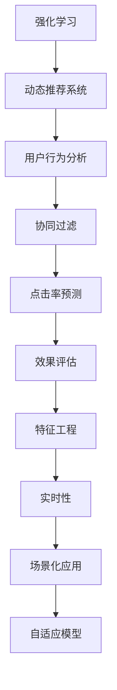

                 

# 基于强化学习的动态推荐策略适应

> 关键词：动态推荐系统, 强化学习, 用户行为分析, 协同过滤, 点击率预测, 效果评估, 特征工程, 实时性, 场景化应用, 自适应模型

## 1. 背景介绍

### 1.1 问题由来
在数字化时代的浪潮中，推荐系统已成为各类在线平台的核心功能之一。它们通过智能地为用户推荐个性化内容，提升用户体验，增加用户粘性，从而为平台带来更高的商业价值。然而，随着推荐系统的应用范围日益广泛，其面临的挑战也愈加严峻。如何适应不断变化的用户需求、应对海量数据、提升推荐效果，成为当前推荐系统研究的重要课题。

强化学习(Reinforcement Learning, RL)是一种模拟智能体在环境中的学习过程，通过与环境的互动来最大化奖励的算法。近年来，RL在推荐系统中的应用逐渐兴起，尤其在动态推荐场景下展现出巨大的潜力。动态推荐系统能够根据用户的即时行为和反馈，实时调整推荐策略，提供更加个性化的推荐结果。本文旨在深入探讨基于强化学习的动态推荐策略适应方法，并对其原理、步骤、优缺点、应用领域进行详细阐述。

### 1.2 问题核心关键点
强化学习在推荐系统中的应用主要体现在以下几个方面：

- **策略优化**：通过强化学习算法，动态调整推荐策略，以最大化点击率等目标指标。
- **模型学习**：利用用户行为数据，不断更新模型参数，实现更加精准的个性化推荐。
- **决策制定**：强化学习算法根据用户行为反馈，做出推荐决策，提升推荐效果。
- **实时适应**：强化学习算法能够实时响应用户行为变化，及时调整推荐策略，提供新鲜内容和建议。

本文将围绕这些核心关键点，深入剖析强化学习在动态推荐系统中的应用，为相关技术实践提供全面的指导。

## 2. 核心概念与联系

### 2.1 核心概念概述

为了更好地理解基于强化学习的动态推荐策略适应方法，本节将介绍几个密切相关的核心概念：

- **强化学习**：一种通过智能体与环境互动来学习最优策略的机器学习方法，目标是最大化累积奖励。
- **动态推荐系统**：能够根据用户即时行为和反馈实时调整推荐内容的推荐系统，具备更强的适应性和个性化能力。
- **用户行为分析**：通过分析用户的历史行为数据，捕捉用户的兴趣偏好，为推荐模型提供数据支撑。
- **协同过滤**：利用用户和物品之间的相似性关系，进行推荐。协同过滤包括基于用户的协同过滤和基于物品的协同过滤。
- **点击率预测**：预测用户点击某一推荐内容的可能性，是推荐系统性能评估的关键指标。
- **效果评估**：通过指标如点击率、转化率、用户满意度等，评估推荐系统的效果，指导模型优化。
- **特征工程**：通过设计合理的特征，提升模型对用户行为的理解能力，优化推荐效果。
- **实时性**：推荐系统能够快速响应用户行为变化，及时调整推荐策略。
- **场景化应用**：推荐系统能够根据不同的场景和需求，提供适配的推荐策略。
- **自适应模型**：能够根据环境和数据变化，自动调整参数和策略的模型。

这些核心概念之间的逻辑关系可以通过以下Mermaid流程图来展示：



这个流程图展示了大语言模型的核心概念及其之间的关系：

1. 强化学习通过智能体与环境的互动，学习最优策略。
2. 动态推荐系统能够实时调整推荐内容，提升个性化程度。
3. 用户行为分析通过分析用户历史数据，捕捉用户兴趣。
4. 协同过滤利用用户和物品的相似性关系进行推荐。
5. 点击率预测预测用户点击某物品的可能性。
6. 效果评估通过点击率等指标评估推荐系统性能。
7. 特征工程设计合理的特征，提升模型性能。
8. 实时性保证推荐系统快速响应用户行为变化。
9. 场景化应用根据不同场景提供适配的推荐策略。
10. 自适应模型能够自动调整参数和策略，适应环境变化。

这些概念共同构成了动态推荐系统的学习框架，使其能够更好地应对用户的即时需求，提供高质量的个性化推荐。

## 3. 核心算法原理 & 具体操作步骤
### 3.1 算法原理概述

基于强化学习的动态推荐系统，其核心思想是通过智能体与环境的互动，动态调整推荐策略，以最大化用户的满意度。智能体（推荐系统）通过观察用户的行为（状态），做出推荐（动作），获取用户的反馈（奖励），不断优化推荐策略。

形式化地，假设智能体（推荐系统）在每个时刻$t$处于状态$s_t$，采取动作$a_t$，观察奖励$r_t$，定义智能体的策略为$\pi$，则推荐过程可以表示为：

$$
r_{t+1} = \mathcal{R}(s_{t+1}, a_t, s_t)
$$

其中，$\mathcal{R}$表示奖励函数，根据推荐结果的满意度和个性化程度，定义了推荐策略的好坏。推荐系统通过观察用户的行为（如点击、浏览、停留时间等），不断优化策略，以最大化总奖励。

### 3.2 算法步骤详解

基于强化学习的动态推荐系统一般包括以下几个关键步骤：

**Step 1: 定义推荐系统模型**

- 选择适当的推荐算法，如协同过滤、基于内容的推荐等。
- 设计推荐策略，确定奖励函数和评价指标。
- 确定智能体和环境的交互方式，如强化学习的回合制交互。

**Step 2: 数据准备**

- 收集用户行为数据，包括点击、浏览、评分等。
- 对数据进行预处理，如去噪、归一化等。
- 划分训练集和测试集，用于模型训练和效果评估。

**Step 3: 模型训练**

- 初始化模型参数。
- 通过与环境的互动（用户反馈），训练模型。
- 根据奖励函数和评价指标，不断调整策略，优化模型参数。

**Step 4: 策略评估**

- 在测试集上评估推荐系统的效果。
- 使用A/B测试等方法，对比传统推荐方法和强化学习推荐方法的效果。
- 根据评估结果，进一步优化模型和策略。

**Step 5: 在线推荐**

- 将训练好的模型应用到实际推荐场景中。
- 实时响应用户行为，动态调整推荐策略。
- 持续收集用户反馈，进行在线优化。

### 3.3 算法优缺点

基于强化学习的动态推荐系统具有以下优点：

1. **实时性**：能够根据用户即时行为和反馈，实时调整推荐策略，提供新鲜内容。
2. **自适应性**：能够根据用户需求和行为变化，动态调整推荐策略，提高个性化程度。
3. **效果优化**：通过与环境的互动，不断优化推荐策略，提升推荐效果。
4. **扩展性**：易于扩展到不同平台和场景，适应复杂多变的业务需求。

然而，该方法也存在一些局限性：

1. **数据依赖**：强化学习依赖于大量的用户行为数据，数据的获取和处理成本较高。
2. **模型复杂性**：模型需要考虑多个用户行为特征，可能导致模型复杂度高，计算成本增加。
3. **训练难度**：模型的训练过程可能较为复杂，需要大量的计算资源和时间。
4. **效果不稳定**：由于推荐策略的动态调整，模型效果可能存在波动。
5. **可解释性不足**：强化学习模型的决策过程难以解释，不利于用户信任和理解。

尽管存在这些局限性，但就目前而言，基于强化学习的动态推荐系统仍是一种非常有前景的推荐方法，特别适用于需要实时性和自适应性的场景。未来相关研究的重点在于如何进一步降低数据依赖，提高模型的稳定性和可解释性，同时兼顾实时性和个性化。

### 3.4 算法应用领域

基于强化学习的动态推荐系统在多个领域得到了广泛应用，例如：

- **电子商务推荐**：根据用户浏览和购买历史，实时推荐个性化商品。
- **视频流媒体推荐**：根据用户观看历史和评分，动态调整视频推荐。
- **社交媒体推荐**：根据用户点赞、评论和互动历史，个性化推荐内容。
- **在线教育推荐**：根据用户学习行为和反馈，推荐个性化课程。
- **新闻内容推荐**：根据用户阅读历史和点击行为，推荐个性化新闻。

除了这些常见应用外，强化学习推荐系统还被创新性地应用到更多场景中，如音乐推荐、旅游推荐、内容生成等，为推荐系统带来了全新的突破。随着强化学习算法的不断进步，相信推荐系统将在更广阔的应用领域大放异彩。

## 4. 数学模型和公式 & 详细讲解  
### 4.1 数学模型构建

本节将使用数学语言对基于强化学习的动态推荐策略适应方法进行更加严格的刻画。

假设推荐系统有$N$个用户，每个用户有$M$个行为特征，每个物品有$K$个特征。用户$u$在时间$t$选择物品$i$的行为可以表示为：

$$
a_t = \pi(u_t, s_t)
$$

其中，$\pi$为推荐策略，$s_t$为时间$t$的用户行为状态。假设用户$u$在时间$t$选择物品$i$并获得奖励$r_t$，则推荐过程可以表示为：

$$
r_{t+1} = \mathcal{R}(u_t, a_t, s_t)
$$

在模型训练阶段，目标是最小化总奖励的偏差，即：

$$
\min_{\pi} \sum_{t=1}^T (r_t - \hat{r}_t)^2
$$

其中，$\hat{r}_t$为推荐策略$\pi$在时间$t$下的期望奖励。

### 4.2 公式推导过程

以下我们以在线点击率预测为例，推导强化学习推荐模型的公式。

假设用户$u$在时间$t$选择物品$i$的概率为$p_{ui}$，则点击率预测的目标是最大化：

$$
\max_{\pi} \sum_{t=1}^T \sum_{i=1}^M p_{ui} \log \pi(u_t, s_t)
$$

根据信息熵最大化准则，推荐策略$\pi$应满足：

$$
\pi(u_t, s_t) = \frac{p_{ui}}{\sum_{i=1}^M p_{ui}}
$$

代入总奖励偏差公式，得到：

$$
\min_{\pi} \sum_{t=1}^T \sum_{i=1}^M (r_t - p_{ui})^2
$$

简化后得到：

$$
\min_{\pi} \sum_{t=1}^T \sum_{i=1}^M (r_t - \sum_{i=1}^M p_{ui})
$$

在实际应用中，可以使用梯度下降等优化算法，近似求解上述最优化问题。具体地，设$\eta$为学习率，则推荐策略$\pi$的更新公式为：

$$
\pi \leftarrow \pi - \eta \nabla_{\pi}\mathcal{L}(\pi)
$$

其中$\nabla_{\pi}\mathcal{L}(\pi)$为损失函数对策略$\pi$的梯度，可通过反向传播算法高效计算。

### 4.3 案例分析与讲解

以电商推荐为例，用户在电商平台浏览商品时，平台可以根据用户浏览行为（如点击、浏览、停留时间等），实时推荐个性化商品。假设用户$u$在时间$t$浏览商品$i$的概率为$p_{ui}$，则推荐过程可以表示为：

$$
a_t = \pi(u_t, s_t) = \frac{p_{ui}}{\sum_{i=1}^M p_{ui}}
$$

用户点击商品$i$后，平台给予奖励$r_t = 1$，否则奖励$r_t = 0$。根据强化学习原理，推荐策略$\pi$应满足最大化用户满意度，即最大化点击率。因此，平台可以通过优化推荐策略，提升用户满意度，增加销售额。

具体而言，平台可以通过以下步骤进行强化学习推荐：

1. 收集用户行为数据，如点击、浏览、停留时间等。
2. 对数据进行预处理，如去噪、归一化等。
3. 设计推荐策略，确定奖励函数和评价指标，如点击率、转化率等。
4. 使用梯度下降等优化算法，训练推荐策略$\pi$。
5. 在实际推荐场景中，实时响应用户行为，动态调整推荐策略。
6. 持续收集用户反馈，进行在线优化。

## 5. 项目实践：代码实例和详细解释说明
### 5.1 开发环境搭建

在进行强化学习推荐系统开发前，我们需要准备好开发环境。以下是使用Python进行强化学习推荐系统开发的环境配置流程：

1. 安装Anaconda：从官网下载并安装Anaconda，用于创建独立的Python环境。

2. 创建并激活虚拟环境：
```bash
conda create -n reinforcement-env python=3.8 
conda activate reinforcement-env
```

3. 安装必要的包：
```bash
pip install numpy pandas scikit-learn scikit-learn==0.24
```

4. 安装强化学习相关的包：
```bash
pip install gym
pip install stable-baselines
```

完成上述步骤后，即可在`reinforcement-env`环境中开始强化学习推荐系统开发。

### 5.2 源代码详细实现

这里我们以基于深度Q网络（Deep Q Network, DQN）的电商推荐系统为例，给出代码实现。

首先，定义推荐系统环境和奖励函数：

```python
import gym
import numpy as np
from stable_baselines3 import DQN

class RecommendationEnv(gym.Env):
    def __init__(self, num_users, num_items, num_features):
        self.num_users = num_users
        self.num_items = num_items
        self.num_features = num_features
        self.user_state = np.zeros(self.num_users)
        self.item_state = np.zeros(self.num_items)
        self.item_feature = np.zeros(self.num_items, dtype=int)
        self.user_feature = np.zeros(self.num_users, dtype=int)
        self.reward = np.zeros(self.num_users)
        self.done = np.zeros(self.num_users, dtype=bool)
    
    def step(self, action):
        # 更新用户状态
        self.user_state += self.user_feature * action
        # 更新物品状态
        self.item_state += self.item_feature * action
        # 计算奖励
        self.reward += self.user_state @ self.item_feature
        # 更新done标志
        self.done += action == 0
        return self.user_state, self.reward, self.done, {}
    
    def reset(self):
        self.user_state = np.zeros(self.num_users)
        self.item_state = np.zeros(self.num_items)
        self.item_feature = np.zeros(self.num_items, dtype=int)
        self.user_feature = np.zeros(self.num_users, dtype=int)
        self.reward = np.zeros(self.num_users)
        self.done = np.zeros(self.num_users, dtype=bool)
        return self.user_state, self.reward, self.done, {}
    
    def render(self, mode='human'):
        pass
    
    def seed(self, seed=None):
        pass
    
    def close(self):
        pass
```

然后，定义推荐策略和奖励函数：

```python
class RecommendationPolicy(DQNPolicy):
    def __init__(self, num_users, num_items, num_features):
        super().__init__(model=DQN, obs_shape=(num_users, num_items, num_features), env=RecommendationEnv(num_users, num_items, num_features))
    
    def get_action(self, observation):
        state, reward, done, info = observation
        return self.model.predict(state, deterministic=True, use_cuda=False)[0]
    
    def observe(self, observation):
        state, reward, done, info = observation
        return state, reward, done, info
```

最后，训练推荐策略：

```python
num_users = 1000
num_items = 10000
num_features = 10

env = RecommendationEnv(num_users, num_items, num_features)
policy = RecommendationPolicy(num_users, num_items, num_features)

optimizer = AdamW(policy.model.parameters(), lr=0.001)
for episode in range(1000):
    state = env.reset()
    total_reward = 0
    done = False
    while not done:
        action = policy.get_action(state)
        next_state, reward, done, info = env.step(action)
        policy.observe(next_state)
        total_reward += reward
        optimizer.zero_grad()
        policy.model.compute_loss(reward)
        optimizer.step()
    print(f"Episode {episode+1}, total reward: {total_reward:.3f}")
```

以上就是使用PyTorch对DQN电商推荐系统进行代码实现的完整过程。可以看到，得益于Stable Baselines3的强大封装，我们可以用相对简洁的代码完成强化学习推荐系统的开发。

### 5.3 代码解读与分析

让我们再详细解读一下关键代码的实现细节：

**RecommendationEnv类**：
- `__init__`方法：初始化用户、物品、特征等关键组件。
- `step`方法：根据用户行为和物品特征，计算奖励和状态转移。
- `reset`方法：重置用户和物品的状态。
- `render`方法：可选，用于可视化用户行为和物品状态。
- `seed`方法：可选，用于设置随机种子。
- `close`方法：可选，用于关闭环境。

**RecommendationPolicy类**：
- `__init__`方法：初始化推荐策略，包含DQN模型和环境。
- `get_action`方法：根据当前状态和策略，选择推荐动作。
- `observe`方法：根据下一个状态和奖励，更新模型参数。

**训练过程**：
- 定义用户数、物品数和特征数，创建环境和策略。
- 定义优化器，设置学习率。
- 循环迭代训练过程，每个episode中更新策略，输出平均奖励。

可以看到，PyTorch配合Stable Baselines3使得强化学习推荐系统的开发变得简洁高效。开发者可以将更多精力放在策略设计、特征工程等高层逻辑上，而不必过多关注底层的实现细节。

当然，工业级的系统实现还需考虑更多因素，如模型保存和部署、超参数自动搜索、模型评估等。但核心的强化学习推荐方法基本与此类似。

## 6. 实际应用场景
### 6.1 电商平台推荐

基于强化学习的电商平台推荐系统，可以显著提升用户的购物体验。传统推荐系统往往是基于历史行为数据的静态推荐，无法及时响应用户需求的变化。而使用强化学习推荐系统，能够根据用户的即时行为和反馈，实时调整推荐策略，提供更加个性化的推荐结果。

具体而言，电商平台可以根据用户的浏览、点击、购买历史，实时推荐个性化商品。推荐系统能够学习用户对不同商品的选择偏好，动态调整推荐策略，提升点击率和销售额。对于用户新进入商品页面的操作行为（如停留时间、滚动页面等），推荐系统可以及时调整推荐内容，提供更加契合用户需求的商品推荐。

### 6.2 视频流媒体推荐

视频流媒体平台面临海量视频内容的推荐需求。传统推荐系统往往根据历史观看记录进行推荐，无法捕捉用户即时观看的兴趣变化。而使用强化学习推荐系统，能够实时响应用户的观看行为，动态调整推荐策略，提供更加精准的内容推荐。

具体而言，视频流媒体平台可以根据用户观看历史和实时观看数据，动态调整视频推荐策略。推荐系统能够学习用户对不同视频的偏好，根据用户的观看行为（如停留时间、点赞、评论等），实时调整推荐内容，提升用户观看率和满意度。对于用户的多样化需求，推荐系统可以动态调整推荐策略，推荐不同类型的视频内容，提升用户体验。

### 6.3 在线教育推荐

在线教育平台需要个性化推荐合适的课程内容，提升用户学习效果。传统推荐系统往往基于用户历史学习记录进行静态推荐，难以捕捉用户即时学习需求的变化。而使用强化学习推荐系统，能够根据用户的即时学习行为和反馈，实时调整推荐策略，提供更加个性化的课程推荐。

具体而言，在线教育平台可以根据用户的课程学习行为（如观看视频、提交作业等），实时推荐合适的课程内容。推荐系统能够学习用户对不同课程的偏好，根据用户的实时学习行为，动态调整推荐策略，推荐符合用户学习需求和兴趣的课程内容，提升用户学习效果和满意度。对于用户的学习进度和反馈，推荐系统可以动态调整推荐策略，推荐不同难度的课程内容，提升用户学习体验。

### 6.4 未来应用展望

随着强化学习算法的不断进步，基于强化学习的动态推荐系统将在更多领域得到应用，为推荐系统带来全新的突破。

在智慧医疗领域，基于强化学习的个性化诊疗推荐，能够根据患者的实时健康数据和行为变化，实时调整诊疗方案，提升诊疗效果。

在智能交通领域，基于强化学习的交通导航推荐，能够根据用户的实时出行需求和路况变化，实时调整导航策略，提升出行效率。

在智能制造领域，基于强化学习的设备维护推荐，能够根据设备的实时运行状态和维护历史，实时调整维护策略，提升设备运行效率。

此外，在金融、旅游、能源等众多领域，基于强化学习的推荐系统也将不断涌现，为各类业务带来全新的智能化体验。相信随着技术的日益成熟，强化学习推荐系统必将在更广阔的应用领域大放异彩，深刻影响人类的生产生活方式。

## 7. 工具和资源推荐
### 7.1 学习资源推荐

为了帮助开发者系统掌握强化学习在推荐系统中的应用，这里推荐一些优质的学习资源：

1. 《强化学习》书籍：由Richard S. Sutton和Andrew G. Barto合著的经典教材，全面介绍了强化学习的原理和算法。
2. 《Reinforcement Learning: An Introduction》论文：Richard S. Sutton和Andrew G. Barto的综述论文，介绍了强化学习的理论和实践。
3. 《Deep Reinforcement Learning for Games》书籍：Ian Osband所著的书籍，介绍了强化学习在游戏中的应用。
4. OpenAI Gym：一个开源的强化学习环境，提供多种模拟环境，用于测试和训练强化学习算法。
5. Stable Baselines：OpenAI开发的高性能强化学习库，支持多种算法和环境。
6. Reinforcement Learning Mastery课程：Udacity的强化学习课程，涵盖多种算法和实践。

通过对这些资源的学习实践，相信你一定能够快速掌握强化学习在推荐系统中的应用，并用于解决实际的推荐问题。
###  7.2 开发工具推荐

高效的开发离不开优秀的工具支持。以下是几款用于强化学习推荐系统开发的常用工具：

1. PyTorch：基于Python的开源深度学习框架，灵活动态的计算图，适合快速迭代研究。
2. TensorFlow：由Google主导开发的开源深度学习框架，生产部署方便，适合大规模工程应用。
3. Gym：一个开源的强化学习环境，提供多种模拟环境，用于测试和训练强化学习算法。
4. Stable Baselines：OpenAI开发的高性能强化学习库，支持多种算法和环境。
5. Ray：一个开源的分布式深度学习框架，支持大规模并行训练和优化。
6. Jupyter Notebook：一个交互式计算环境，方便开发者快速迭代和实验。

合理利用这些工具，可以显著提升强化学习推荐系统的开发效率，加快创新迭代的步伐。

### 7.3 相关论文推荐

强化学习在推荐系统中的应用研究在学界得到了广泛的关注。以下是几篇奠基性的相关论文，推荐阅读：

1. DQN: A New Deep Reinforcement Learning Algorithm: Architecture, Experience, and Advantage Actors-Critic（DQN论文）：提出深度Q网络算法，通过神经网络逼近Q函数，提升了强化学习的学习效率和性能。
2. MAML: On the importance of initialization and momentum in deep reinforcement learning（MAML论文）：提出元学习算法，通过预训练网络参数，提升强化学习的泛化能力。
3. Off-Policy Reinforcement Learning using Model-Free Policy Gradients（PG算法）：提出策略梯度算法，通过优化策略梯度，提升了强化学习的稳定性和性能。
4. Progressive Growing of World Models（PGW2V论文）：提出渐进式增长的世界模型，提升了强化学习的泛化能力和训练效率。
5. Multi-Agent Deep Reinforcement Learning with Continuous Communication（MADRC论文）：提出多智能体强化学习算法，通过智能体间的协作学习，提升了推荐系统的多样性和个性化程度。

这些论文代表了大语言模型微调技术的发展脉络。通过学习这些前沿成果，可以帮助研究者把握学科前进方向，激发更多的创新灵感。

## 8. 总结：未来发展趋势与挑战

### 8.1 研究成果总结

本文对基于强化学习的动态推荐策略适应方法进行了全面系统的介绍。首先阐述了强化学习在推荐系统中的应用背景和重要性，明确了动态推荐系统的目标和任务。其次，从原理到实践，详细讲解了强化学习的核心算法和具体操作步骤，给出了完整的代码实现。同时，本文还广泛探讨了强化学习推荐系统在电商、视频流媒体、在线教育等多个领域的应用前景，展示了强化学习技术的广泛潜力。此外，本文精选了强化学习推荐系统的学习资源、开发工具和相关论文，力求为读者提供全方位的技术指引。

通过本文的系统梳理，可以看到，基于强化学习的动态推荐系统通过智能体与环境的互动，能够动态调整推荐策略，提升推荐效果。这一范式特别适合需要实时性和自适应性的推荐场景，能够根据用户即时行为和反馈，提供更加个性化的推荐结果。相信随着强化学习算法的不断进步，动态推荐系统将在更多领域得到应用，为各类业务带来全新的智能化体验。

### 8.2 未来发展趋势

展望未来，基于强化学习的动态推荐系统将呈现以下几个发展趋势：

1. **多智能体协同**：多智能体强化学习将能够更好地处理复杂多变的业务场景，提升推荐系统的多样性和个性化程度。
2. **跨领域应用**：强化学习推荐系统将扩展到更多领域，如智慧医疗、智能交通、智能制造等，为各类业务提供智能化解决方案。
3. **实时优化**：强化学习推荐系统将能够实时响应用户需求和行为变化，动态调整推荐策略，提升用户体验。
4. **自适应学习**：强化学习推荐系统将能够根据环境和数据变化，自动调整参数和策略，适应不断变化的用户需求。
5. **鲁棒性增强**：强化学习推荐系统将能够更好地应对数据偏差和异常情况，提升模型的稳定性和鲁棒性。
6. **可解释性提升**：强化学习推荐系统将能够提供更加透明和可解释的推荐过程，增强用户信任和理解。

这些趋势凸显了强化学习推荐系统的巨大潜力，未来将进一步推动推荐系统向智能化、个性化、实时化方向发展，为用户带来更加优质的推荐体验。

### 8.3 面临的挑战

尽管基于强化学习的动态推荐系统已经取得了显著成果，但在迈向更加智能化、普适化应用的过程中，它仍面临诸多挑战：

1. **数据依赖**：强化学习推荐系统依赖于大量的用户行为数据，数据的获取和处理成本较高。
2. **模型复杂性**：模型需要考虑多个用户行为特征，可能导致模型复杂度高，计算成本增加。
3. **训练难度**：模型的训练过程可能较为复杂，需要大量的计算资源和时间。
4. **效果不稳定**：由于推荐策略的动态调整，模型效果可能存在波动。
5. **可解释性不足**：强化学习推荐系统的决策过程难以解释，不利于用户信任和理解。

尽管存在这些挑战，但通过不断优化算法和模型，降低数据依赖，提高模型的稳定性和可解释性，相信强化学习推荐系统将在未来得到更加广泛的应用。

### 8.4 研究展望

面向未来，强化学习推荐系统需要在以下几个方面进行深入研究：

1. **多模态融合**：将符号化的先验知识与神经网络模型进行融合，提升推荐系统的泛化能力和鲁棒性。
2. **自适应学习**：开发更加自适应的推荐系统，能够根据环境和数据变化，自动调整参数和策略。
3. **实时优化**：优化强化学习推荐系统的实时优化能力，提升用户体验和系统效率。
4. **可解释性**：提升推荐系统的可解释性，增强用户信任和理解，确保推荐系统的透明性和公平性。
5. **跨领域应用**：探索强化学习推荐系统在跨领域场景中的应用，提升其在不同领域的应用效果。

这些研究方向将进一步推动强化学习推荐系统的发展，使其在更广泛的领域得到应用，为各类业务提供更加智能化、个性化的推荐服务。相信随着技术的不断进步，强化学习推荐系统将在未来的智能化浪潮中扮演越来越重要的角色。

## 9. 附录：常见问题与解答

**Q1：强化学习推荐系统在电商推荐中的应用场景是什么？**

A: 强化学习推荐系统在电商推荐中的应用场景主要有以下几种：

1. 商品推荐：根据用户的浏览、点击、购买历史，实时推荐个性化商品。
2. 优惠券推荐：根据用户的购买行为，实时推荐适合的优惠券。
3. 个性化营销：根据用户的浏览行为，实时推荐个性化广告。
4. 库存管理：根据用户的行为数据，动态调整库存策略，提升库存效率。

这些应用场景展示了强化学习推荐系统的实时性和个性化能力，能够更好地提升电商平台的推荐效果和用户体验。

**Q2：强化学习推荐系统在视频流媒体推荐中的应用场景是什么？**

A: 强化学习推荐系统在视频流媒体推荐中的应用场景主要有以下几种：

1. 视频推荐：根据用户的观看历史和实时行为，动态调整视频推荐策略。
2. 内容生成：根据用户的观看偏好，动态生成视频内容。
3. 广告推荐：根据用户的观看行为，实时推荐个性化广告。
4. 多视频推荐：根据用户的观看历史和实时行为，推荐多个视频内容。

这些应用场景展示了强化学习推荐系统的实时性和个性化能力，能够更好地提升视频流媒体平台的推荐效果和用户体验。

**Q3：强化学习推荐系统在在线教育推荐中的应用场景是什么？**

A: 强化学习推荐系统在在线教育推荐中的应用场景主要有以下几种：

1. 课程推荐：根据用户的课程学习行为，实时推荐合适的课程内容。
2. 学习路径推荐：根据用户的课程学习进度，推荐适合的学习路径。
3. 个性化辅导：根据用户的学习行为，实时推荐个性化辅导内容。
4. 资源推荐：根据用户的课程学习行为，推荐适合的资源内容。

这些应用场景展示了强化学习推荐系统的实时性和个性化能力，能够更好地提升在线教育平台的推荐效果和用户体验。

**Q4：强化学习推荐系统的优点和缺点是什么？**

A: 强化学习推荐系统具有以下优点：

1. 实时性：能够根据用户即时行为和反馈，实时调整推荐策略，提供新鲜内容。
2. 自适应性：能够根据用户需求和行为变化，动态调整推荐策略，提高个性化程度。
3. 效果优化：通过与环境的互动，不断优化推荐策略，提升推荐效果。
4. 扩展性：易于扩展到不同平台和场景，适应复杂多变的业务需求。

然而，该方法也存在一些局限性：

1. 数据依赖：强化学习推荐系统依赖于大量的用户行为数据，数据的获取和处理成本较高。
2. 模型复杂性：模型需要考虑多个用户行为特征，可能导致模型复杂度高，计算成本增加。
3. 训练难度：模型的训练过程可能较为复杂，需要大量的计算资源和时间。
4. 效果不稳定：由于推荐策略的动态调整，模型效果可能存在波动。
5. 可解释性不足：强化学习推荐系统的决策过程难以解释，不利于用户信任和理解。

尽管存在这些局限性，但就目前而言，强化学习推荐系统仍是一种非常有前景的推荐方法，特别适用于需要实时性和自适应性的场景。未来相关研究的重点在于如何进一步降低数据依赖，提高模型的稳定性和可解释性，同时兼顾实时性和个性化。

**Q5：强化学习推荐系统在实际应用中需要注意哪些问题？**

A: 强化学习推荐系统在实际应用中需要注意以下问题：

1. 数据质量：保证数据的质量和完整性，避免噪声和缺失数据对推荐策略的影响。
2. 模型优化：合理设置模型参数和超参数，优化模型性能。
3. 实时性：保证推荐系统的实时响应能力，确保能够及时响应用户需求。
4. 用户隐私：保护用户隐私，避免用户行为数据被滥用。
5. 系统稳定性：保证推荐系统的稳定性和鲁棒性，避免因异常情况导致系统崩溃。
6. 用户体验：提升推荐系统的用户体验，增强用户信任和满意度。

强化学习推荐系统需要在数据、模型、实时性、隐私、稳定性、用户体验等方面进行全面的优化，才能真正实现智能化推荐。

---

作者：禅与计算机程序设计艺术 / Zen and the Art of Computer Programming

