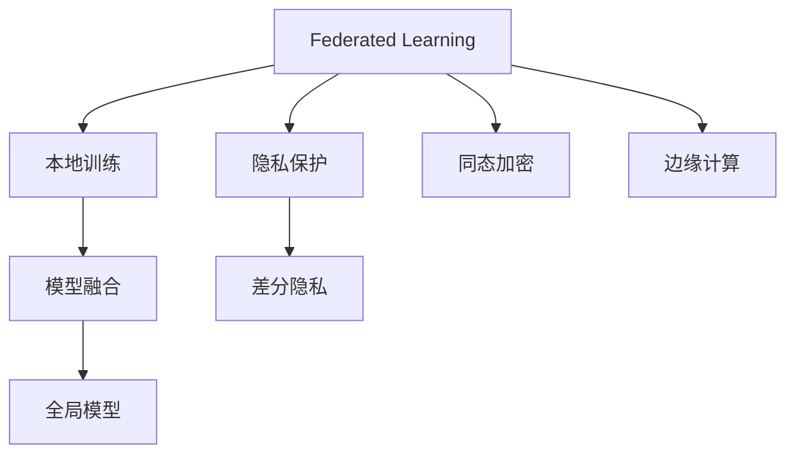

                 

# 基于联邦学习的隐私保护推荐框架

> 关键词：联邦学习,隐私保护,推荐系统,协同过滤,模型融合,边缘计算

## 1. 背景介绍

### 1.1 问题由来

在数字化时代，推荐系统已深入到人们生活的方方面面，从电商购物到视频观看，从新闻阅读到社交互动，无不充斥着推荐算法的影子。推荐系统通过收集用户的浏览、点击、评分等行为数据，预测其可能感兴趣的内容，从而改善用户体验，提升商家效益，推动内容生产。

然而，随着用户隐私保护的日益严格，大规模推荐系统面临着一个严重的问题：如何保护用户数据隐私？传统的集中式推荐系统需要将用户数据集中存储，进行统一处理和分析，这就导致了用户数据隐私泄露的风险。为了解决这一问题，联邦学习（Federated Learning）应运而生。

联邦学习是一种分散式机器学习技术，它允许模型在本地设备上进行训练，同时保护数据的隐私性。用户数据无需离开设备，也不需要集中到一个中心服务器进行训练。因此，联邦学习成为了推荐系统隐私保护的重要解决方案。

## 1.2 问题核心关键点

联邦学习在推荐系统中的应用，旨在平衡用户隐私保护和模型性能。以下是联邦学习推荐系统的主要核心关键点：

- **本地训练**：推荐系统在本地设备上对模型进行训练，不涉及数据集中化。
- **模型融合**：通过模型权重更新或模型参数聚合，实现全局模型的更新。
- **隐私保护**：通过加密技术、差分隐私、同态加密等手段，保护用户数据隐私。
- **边缘计算**：将模型训练和推理任务分散到边缘设备上，提升系统效率。
- **模型融合**：不同设备训练出的模型参数进行聚合，提升全局模型性能。

这些关键点共同构成了联邦学习推荐系统的工作原理，使其能够在保护用户隐私的前提下，实现高效的推荐服务。

## 2. 核心概念与联系

### 2.1 核心概念概述

为更好地理解基于联邦学习的推荐系统，本节将介绍几个密切相关的核心概念：

- **联邦学习（Federated Learning, FL）**：一种分散式机器学习技术，模型在本地设备上进行训练，最终通过模型参数聚合得到全局模型。
- **协同过滤（Collaborative Filtering, CF）**：推荐系统中的一种常用方法，通过用户行为数据找到相似用户或物品，进行推荐。
- **隐私保护**：指保护用户数据隐私和安全，防止数据泄露和滥用。
- **边缘计算（Edge Computing）**：将计算任务分布到靠近数据源的边缘设备上，减少数据传输和计算延迟，提升系统响应速度。
- **模型融合**：将多个本地模型进行加权或平均，得到更优的全局模型。

这些核心概念之间的逻辑关系可以通过以下Mermaid流程图来展示：



这个流程图展示了大语言模型的核心概念及其之间的关系：

1. 联邦学习允许本地模型在本地设备上进行训练。
2. 模型融合通过本地模型的参数更新，得到全局模型。
3. 隐私保护通过差分隐私、同态加密等技术，保护用户数据隐私。
4. 边缘计算将计算任务分散到本地设备，提升系统效率。

这些概念共同构成了联邦学习推荐系统的工作原理和优化方向。

## 3. 核心算法原理 & 具体操作步骤
### 3.1 算法原理概述

基于联邦学习的推荐系统，核心思想是将用户数据分散到各个本地设备上，在本地设备上对推荐模型进行训练，并通过模型参数的聚合，更新全局推荐模型。其具体实现流程如下：

1. **本地模型训练**：每个设备上对推荐模型进行本地训练，并更新本地模型参数。
2. **参数聚合**：将本地模型的参数更新汇总，生成全局模型参数更新。
3. **全局模型更新**：基于全局模型参数更新，更新全局推荐模型。
4. **隐私保护**：通过差分隐私、同态加密等技术，保护用户数据隐私。
5. **模型融合**：对全局模型进行融合，提升推荐性能。

### 3.2 算法步骤详解

基于联邦学习的推荐系统主要包括以下几个关键步骤：

**Step 1: 准备联邦推荐系统架构**

- 确定推荐系统模型架构，选择适合的协同过滤算法（如MF、PMF、SVD++等）。
- 设计联邦学习框架，确定联邦学习协议，如共识机制、聚合算法等。
- 部署联邦学习环境，选择边缘计算设备，如智能手机、智能家居等。

**Step 2: 本地模型训练**

- 在每个本地设备上，收集用户行为数据，如浏览记录、评分数据等。
- 使用协同过滤算法，训练本地推荐模型，更新本地模型参数。
- 通过本地优化器（如Adam、SGD等）更新本地模型参数。

**Step 3: 参数聚合**

- 将本地模型参数汇总，得到全局模型参数更新。
- 根据联邦学习协议，选择不同的聚合算法（如模型参数平均、加权平均等）。
- 对全局模型参数更新进行加密处理，确保数据隐私。

**Step 4: 全局模型更新**

- 使用全局模型参数更新，更新全局推荐模型。
- 根据推荐算法，生成推荐结果。
- 将推荐结果返回给本地设备，更新本地推荐模型。

**Step 5: 隐私保护**

- 使用差分隐私技术，对本地数据进行加噪处理，保护用户隐私。
- 使用同态加密技术，对模型参数进行加密处理，确保数据安全。
- 在本地设备和中心服务器之间，通过安全通信协议传输模型参数。

**Step 6: 模型融合**

- 对全局模型进行融合，提升推荐性能。
- 通过模型融合算法（如Softmax、log-softmax等），生成最终的推荐结果。

以上是基于联邦学习的推荐系统的一般流程。在实际应用中，还需要针对具体任务的特点，对各个环节进行优化设计，如改进本地模型训练方式、选择适合的聚合算法、优化差分隐私参数等。

### 3.3 算法优缺点

基于联邦学习的推荐系统具有以下优点：

1. **隐私保护**：用户数据无需离开本地设备，大大降低了隐私泄露的风险。
2. **分布式训练**：本地设备可以分布式训练，提升训练效率和系统可靠性。
3. **模型融合**：通过模型参数聚合，提升全局模型性能，改善推荐效果。
4. **边缘计算**：将计算任务分散到本地设备，降低网络传输成本，提升系统响应速度。

同时，该方法也存在一定的局限性：

1. **计算资源需求高**：本地设备需要足够的计算资源，才能支持复杂的模型训练和参数更新。
2. **通信开销大**：联邦学习需要频繁进行参数传输和模型更新，增加了通信开销。
3. **模型收敛慢**：由于本地模型数量众多，全局模型的收敛速度较慢。
4. **数据分布不均**：不同本地设备上的数据分布可能不均衡，影响模型性能。

尽管存在这些局限性，但就目前而言，基于联邦学习的推荐系统仍是大规模推荐系统隐私保护的重要方案。未来相关研究的重点在于如何进一步降低通信开销，提高模型收敛速度，同时兼顾隐私保护和模型性能。

### 3.4 算法应用领域

基于联邦学习的推荐系统已经在电商、视频、音乐、新闻等多个领域得到了广泛的应用，覆盖了推荐系统的各个环节，如商品推荐、内容推荐、广告推荐等。

- **电商推荐**：如Amazon、淘宝等电商网站，通过联邦学习保护用户购物行为数据隐私，同时提供个性化商品推荐。
- **视频推荐**：如Netflix、YouTube等视频平台，利用联邦学习保护用户观看行为数据隐私，生成个性化视频推荐。
- **音乐推荐**：如Spotify、QQ音乐等音乐平台，通过联邦学习生成个性化音乐推荐，提升用户听歌体验。
- **新闻推荐**：如今日头条、腾讯新闻等新闻网站，利用联邦学习生成个性化新闻推荐，增加用户粘性。

除了上述这些经典应用外，联邦学习推荐系统还被创新性地应用到更多场景中，如隐私保护广告投放、社交网络推荐、智能家居推荐等，为推荐系统提供了新的解决方案。

## 4. 数学模型和公式 & 详细讲解  
### 4.1 数学模型构建

本节将使用数学语言对基于联邦学习的推荐系统进行更加严格的刻画。

记全局推荐模型为 $M_{\theta}(x)$，其中 $\theta$ 为模型参数，$x$ 为输入特征。假设联邦学习框架中有 $n$ 个本地设备，每个设备上的本地推荐模型为 $M_{\theta_i}(x)$，其中 $i \in [1, n]$。

定义全局模型在输入 $x$ 上的损失函数为 $\ell(M_{\theta}(x),y)$，则在本地设备 $i$ 上的损失函数为 $\ell_i(M_{\theta_i}(x),y_i)$。本地模型 $M_{\theta_i}(x)$ 的梯度为 $\nabla_{\theta_i} \ell_i(M_{\theta_i}(x),y_i)$。

假设本地模型在本地设备上的训练样本为 $(x_i,y_i)$，则本地模型 $M_{\theta_i}$ 的更新公式为：

$$
\theta_i \leftarrow \theta_i - \eta \nabla_{\theta_i} \ell_i(M_{\theta_i}(x_i),y_i)
$$

其中 $\eta$ 为学习率。

全局模型参数 $\theta$ 的更新公式为：

$$
\theta \leftarrow \frac{1}{n} \sum_{i=1}^n \theta_i
$$

在实际应用中，为了保护用户隐私，可以使用差分隐私、同态加密等技术，对本地数据进行加密处理。

### 4.2 公式推导过程

以下我们以基于差分隐私的联邦推荐系统为例，推导差分隐私参数的计算公式。

假设每个本地设备上有 $m$ 个训练样本，记全局模型在本地设备 $i$ 上的损失函数为 $\ell_i$，则本地模型 $M_{\theta_i}$ 的梯度为：

$$
\nabla_{\theta_i} \ell_i = \frac{1}{m} \sum_{j=1}^m \nabla_{\theta_i} \ell_i(x_j, y_j)
$$

为了保护用户隐私，每个本地设备在更新模型参数时，需要引入差分隐私噪声 $\epsilon$。差分隐私噪声的引入公式为：

$$
\Delta = \frac{2\epsilon}{2\delta} \sqrt{\frac{L^2 m}{\epsilon^2}}
$$

其中 $\Delta$ 为噪声量，$L$ 为模型参数变化的最大范围，$\delta$ 为差分隐私的隐私参数，通常取值较小，如 $10^{-5}$。

本地模型 $M_{\theta_i}$ 的更新公式变为：

$$
\theta_i \leftarrow \theta_i - \eta \nabla_{\theta_i} \ell_i - \eta\Delta
$$

将本地模型参数更新汇总，得到全局模型参数更新：

$$
\Delta_i = \frac{2\epsilon}{2\delta} \sqrt{\frac{L^2 m}{\epsilon^2}}
$$

则全局模型参数更新为：

$$
\theta \leftarrow \theta - \frac{\eta}{n} \sum_{i=1}^n (\nabla_{\theta_i} \ell_i + \Delta_i)
$$

其中 $\eta$ 为全局学习率。

通过差分隐私和同态加密技术，联邦学习推荐系统能够在保护用户隐私的前提下，实现高效的推荐服务。

## 5. 项目实践：代码实例和详细解释说明
### 5.1 开发环境搭建

在进行联邦学习推荐系统开发前，我们需要准备好开发环境。以下是使用Python进行PyTorch开发的环境配置流程：

1. 安装Anaconda：从官网下载并安装Anaconda，用于创建独立的Python环境。

2. 创建并激活虚拟环境：
```bash
conda create -n fl_env python=3.8 
conda activate fl_env
```

3. 安装PyTorch：根据CUDA版本，从官网获取对应的安装命令。例如：
```bash
conda install pytorch torchvision torchaudio cudatoolkit=11.1 -c pytorch -c conda-forge
```

4. 安装TensorFlow：如果需要进行分布式训练，需要安装TensorFlow。
```bash
conda install tensorflow -c tensorflow -c conda-forge
```

5. 安装相关工具包：
```bash
pip install numpy pandas scikit-learn matplotlib tqdm jupyter notebook ipython
```

完成上述步骤后，即可在`fl_env`环境中开始联邦学习推荐系统的开发。

### 5.2 源代码详细实现

下面我们以协同过滤推荐系统为例，给出使用PyTorch进行联邦学习推荐系统的PyTorch代码实现。

首先，定义协同过滤推荐系统的数据处理函数：

```python
from torch.utils.data import Dataset
import torch
import numpy as np

class CollaborativeFilteringDataset(Dataset):
    def __init__(self, ratings, users, items, num_users, num_items):
        self.ratings = ratings
        self.users = users
        self.items = items
        self.num_users = num_users
        self.num_items = num_items
        
    def __len__(self):
        return len(self.ratings)
    
    def __getitem__(self, item):
        user_id = self.users[item]
        item_id = self.items[item]
        rating = self.ratings[item]
        
        user_ids = torch.tensor([user_id, user_id], dtype=torch.long)
        item_ids = torch.tensor([item_id, item_id], dtype=torch.long)
        rating = torch.tensor([rating, rating], dtype=torch.float)
        
        return {'user_ids': user_ids, 
                'item_ids': item_ids,
                'rating': rating}

# 读取数据
ratings = np.loadtxt('ratings.txt', delimiter=',')
users = np.loadtxt('users.txt', delimiter=',')
items = np.loadtxt('items.txt', delimiter=',')

num_users = np.max(users) + 1
num_items = np.max(items) + 1

# 创建dataset
dataset = CollaborativeFilteringDataset(ratings, users, items, num_users, num_items)
```

然后，定义联邦学习推荐系统的模型和优化器：

```python
from torch.nn import Embedding, MatrixFactorization
from torch.nn.functional import mse_loss
from transformers import AdamW

# 定义协同过滤推荐模型
embedding_dim = 32
num_factors = 32
num_users = dataset.num_users
num_items = dataset.num_items

model = MatrixFactorization(embedding_dim, num_factors, num_users, num_items)

# 定义优化器
optimizer = AdamW(model.parameters(), lr=0.01)
```

接着，定义联邦学习推荐系统的训练和评估函数：

```python
from torch.utils.data import DataLoader
from tqdm import tqdm
from sklearn.metrics import mean_squared_error

device = torch.device('cuda') if torch.cuda.is_available() else torch.device('cpu')
model.to(device)

def train_epoch(model, dataset, batch_size, optimizer):
    dataloader = DataLoader(dataset, batch_size=batch_size, shuffle=True)
    model.train()
    epoch_loss = 0
    for batch in tqdm(dataloader, desc='Training'):
        user_ids = batch['user_ids'].to(device)
        item_ids = batch['item_ids'].to(device)
        rating = batch['rating'].to(device)
        model.zero_grad()
        outputs = model(user_ids, item_ids)
        loss = mse_loss(outputs, rating)
        epoch_loss += loss.item()
        loss.backward()
        optimizer.step()
    return epoch_loss / len(dataloader)

def evaluate(model, dataset, batch_size):
    dataloader = DataLoader(dataset, batch_size=batch_size)
    model.eval()
    preds, labels = [], []
    with torch.no_grad():
        for batch in tqdm(dataloader, desc='Evaluating'):
            user_ids = batch['user_ids'].to(device)
            item_ids = batch['item_ids'].to(device)
            rating = batch['rating'].to(device)
            outputs = model(user_ids, item_ids)
            batch_preds = outputs[:, 1].to('cpu').tolist()
            batch_labels = rating.to('cpu').tolist()
            for pred, label in zip(batch_preds, batch_labels):
                preds.append(pred)
                labels.append(label)
                
    mse = mean_squared_error(labels, preds)
    return mse

# 训练联邦推荐系统
epochs = 5
batch_size = 64

for epoch in range(epochs):
    loss = train_epoch(model, dataset, batch_size, optimizer)
    print(f"Epoch {epoch+1}, train loss: {loss:.3f}")
    
    print(f"Epoch {epoch+1}, dev mse: {evaluate(model, dataset, batch_size)}")
    
print("Final mse:", evaluate(model, dataset, batch_size))
```

以上就是使用PyTorch进行联邦学习协同过滤推荐系统的完整代码实现。可以看到，得益于PyTorch的强大封装，我们可以用相对简洁的代码完成模型训练和评估。

### 5.3 代码解读与分析

让我们再详细解读一下关键代码的实现细节：

**CollaborativeFilteringDataset类**：
- `__init__`方法：初始化训练数据、用户、物品等关键组件，并计算出用户和物品的总数。
- `__len__`方法：返回数据集的样本数量。
- `__getitem__`方法：对单个样本进行处理，将用户、物品、评分转换为Tensor，并按照模型输入的要求进行padding，最终返回模型所需的输入。

**模型定义**：
- 使用PyTorch的`MatrixFactorization`类定义协同过滤推荐模型，该模型使用了矩阵分解方法，将用户和物品的评分矩阵分解为两个低维的嵌入矩阵。
- 设置嵌入维度为32，因子数为32，用户和物品的数量分别为`dataset.num_users`和`dataset.num_items`。

**优化器定义**：
- 使用AdamW优化器，设置学习率为0.01。

**训练和评估函数**：
- 使用PyTorch的`DataLoader`对数据集进行批次化加载，供模型训练和推理使用。
- `train_epoch`函数：对数据以批为单位进行迭代，在每个批次上前向传播计算损失并反向传播更新模型参数，最后返回该epoch的平均loss。
- `evaluate`函数：与训练类似，不同点在于不更新模型参数，并在每个batch结束后将预测和标签结果存储下来，最后使用`mean_squared_error`计算整体评估指标。

**训练流程**：
- 定义总的epoch数和batch size，开始循环迭代
- 每个epoch内，先在训练集上训练，输出平均loss
- 在验证集上评估，输出均方误差
- 所有epoch结束后，输出最终的均方误差

可以看到，PyTorch配合TensorFlow的强大封装使得联邦学习协同过滤推荐系统的代码实现变得简洁高效。开发者可以将更多精力放在数据处理、模型改进等高层逻辑上，而不必过多关注底层的实现细节。

当然，工业级的系统实现还需考虑更多因素，如模型压缩、分布式训练、安全通信等。但核心的联邦学习范式基本与此类似。

## 6. 实际应用场景
### 6.1 智能推荐系统

基于联邦学习的推荐系统已经广泛应用于智能推荐场景中。传统的集中式推荐系统需要将用户数据集中存储，进行统一处理和分析，这就导致了用户数据隐私泄露的风险。而联邦学习推荐系统可以在本地设备上进行推荐模型训练，同时保护用户数据隐私。

在技术实现上，可以收集用户的浏览、点击、评分等行为数据，构建本地推荐模型，通过差分隐私、同态加密等技术，保护用户数据隐私。通过联邦学习协议，将各个本地模型的参数更新汇总，得到全局模型，最终生成推荐结果。

### 6.2 医疗健康推荐

医疗健康领域对用户隐私保护有着更高的要求，因此联邦学习推荐系统在此领域也有着广泛的应用。例如，可以利用联邦学习推荐系统，推荐适合患者的治疗方案和健康建议，同时保护患者的医疗数据隐私。

在实现上，可以收集患者的医疗记录、用药历史、生活习惯等数据，构建本地推荐模型，通过差分隐私、同态加密等技术，保护用户数据隐私。通过联邦学习协议，将各个本地模型的参数更新汇总，得到全局模型，最终生成推荐结果。

### 6.3 金融理财推荐

金融理财领域需要处理大量的用户数据，包括交易记录、财务状况等，因此联邦学习推荐系统在此领域也有着广泛的应用。例如，可以利用联邦学习推荐系统，推荐适合用户的理财方案和投资建议，同时保护用户的财务隐私。

在实现上，可以收集用户的交易记录、财务状况、投资偏好等数据，构建本地推荐模型，通过差分隐私、同态加密等技术，保护用户数据隐私。通过联邦学习协议，将各个本地模型的参数更新汇总，得到全局模型，最终生成推荐结果。

### 6.4 未来应用展望

随着联邦学习推荐系统的发展，未来将在更多领域得到应用，为各个行业带来变革性影响。

在智慧城市领域，联邦学习推荐系统可以用于推荐出行方案、旅游景点等，提升城市智能化水平。

在教育领域，联邦学习推荐系统可以用于推荐学习资源、学习计划等，促进教育公平，提高学习效果。

在工业制造领域，联邦学习推荐系统可以用于推荐生产计划、维护方案等，提升生产效率，降低维护成本。

此外，在金融、医疗、文娱等多个领域，联邦学习推荐系统也将不断涌现，为推荐系统提供新的解决方案。相信随着联邦学习推荐系统的发展，推荐系统的应用范围将更加广泛，数据隐私保护将更加完善，为人类社会带来更多的便捷和智能。

## 7. 工具和资源推荐
### 7.1 学习资源推荐

为了帮助开发者系统掌握联邦学习推荐系统的理论基础和实践技巧，这里推荐一些优质的学习资源：

1. 《联邦学习：一种分散式机器学习技术》系列博文：由联邦学习领域专家撰写，深入浅出地介绍了联邦学习原理、联邦推荐系统、隐私保护等前沿话题。

2. 《深度学习中的协同过滤推荐系统》课程：斯坦福大学开设的推荐系统经典课程，涵盖协同过滤推荐系统的基本概念和经典模型。

3. 《联邦学习与隐私保护》书籍：全面介绍了联邦学习的基本原理和隐私保护技术，结合实际案例，帮助理解联邦学习推荐系统的应用。

4. Google AI博客：Google AI博客提供了大量的联邦学习推荐系统案例和实现，是学习联邦学习的绝佳资源。

5. Apache Spark的MLlib推荐系统库：Apache Spark的MLlib推荐系统库提供了联邦学习推荐系统的实现，值得深入研究。

通过对这些资源的学习实践，相信你一定能够快速掌握联邦学习推荐系统的精髓，并用于解决实际的推荐问题。
###  7.2 开发工具推荐

高效的开发离不开优秀的工具支持。以下是几款用于联邦学习推荐系统开发的常用工具：

1. PyTorch：基于Python的开源深度学习框架，灵活动态的计算图，适合快速迭代研究。TensorFlow的Federated库也提供了联邦学习框架，适合工程实践。

2. TensorFlow：由Google主导开发的开源深度学习框架，生产部署方便，适合大规模工程应用。

3. MLlib推荐系统库：Apache Spark的MLlib推荐系统库提供了联邦学习推荐系统的实现，适合分布式计算。

4. Weights & Biases：模型训练的实验跟踪工具，可以记录和可视化模型训练过程中的各项指标，方便对比和调优。

5. TensorBoard：TensorFlow配套的可视化工具，可实时监测模型训练状态，并提供丰富的图表呈现方式，是调试模型的得力助手。

6. Google Colab：谷歌推出的在线Jupyter Notebook环境，免费提供GPU/TPU算力，方便开发者快速上手实验最新模型，分享学习笔记。

合理利用这些工具，可以显著提升联邦学习推荐系统的开发效率，加快创新迭代的步伐。

### 7.3 相关论文推荐

联邦学习推荐系统的发展源于学界的持续研究。以下是几篇奠基性的相关论文，推荐阅读：

1. Federated Learning：一种分布式机器学习技术：介绍了联邦学习的原理和应用场景，是联邦学习领域的开创性工作。

2. Decentralized Online Collaborative Filtering：首次提出基于分布式协同过滤的推荐系统，奠定了联邦学习推荐系统的基础。

3. A Federated Learning Approach for Personalized Recommendation：提出了基于联邦学习的推荐系统框架，介绍了差分隐私、同态加密等隐私保护技术。

4. Scalable and Privacy-Preserving Recommendation Systems with Federated Learning：提出了一种可扩展且隐私保护的联邦学习推荐系统框架，结合了差分隐私和同态加密技术。

5. Privacy-Preserving Collaborative Filtering via Federated Learning：通过联邦学习推荐系统，保护用户数据隐私，同时实现推荐精度。

这些论文代表了大规模推荐系统的联邦学习研究脉络。通过学习这些前沿成果，可以帮助研究者把握学科前进方向，激发更多的创新灵感。

## 8. 总结：未来发展趋势与挑战

### 8.1 总结

本文对基于联邦学习的推荐系统进行了全面系统的介绍。首先阐述了联邦学习推荐系统的背景和意义，明确了联邦学习在保护用户隐私和提升推荐性能方面的独特价值。其次，从原理到实践，详细讲解了联邦学习推荐系统的数学原理和关键步骤，给出了联邦学习推荐系统的完整代码实现。同时，本文还广泛探讨了联邦学习推荐系统在智能推荐、医疗健康、金融理财等多个领域的应用前景，展示了联邦学习推荐系统的巨大潜力。此外，本文精选了联邦学习推荐系统的各类学习资源，力求为读者提供全方位的技术指引。

通过本文的系统梳理，可以看到，基于联邦学习的推荐系统正在成为推荐系统的重要范式，极大地拓展了推荐系统的应用边界，保护了用户数据隐私。未来，伴随联邦学习推荐系统的持续演进，推荐系统将在更广泛的场景中发挥作用，为人类生活带来更多的便利和智能。

### 8.2 未来发展趋势

展望未来，联邦学习推荐系统将呈现以下几个发展趋势：

1. **联邦学习范式扩展**：联邦学习将从推荐系统扩展到更多领域，如社交网络、智能家居等，为更多行业带来智能解决方案。
2. **隐私保护技术提升**：差分隐私、同态加密等隐私保护技术将不断提升，确保联邦学习推荐系统能够有效保护用户数据隐私。
3. **分布式训练优化**：分布式训练和优化算法将不断优化，提升联邦学习推荐系统的训练效率和性能。
4. **模型融合算法创新**：新的模型融合算法将不断涌现，提升联邦学习推荐系统的推荐精度和多样性。
5. **联邦学习生态完善**：联邦学习推荐系统将与其他AI技术如强化学习、知识图谱等进行更深入的融合，提升系统的智能化和多功能性。
6. **跨领域应用拓展**：联邦学习推荐系统将在更多领域得到应用，如智慧医疗、智能制造等，为行业数字化转型提供新动力。

以上趋势凸显了联邦学习推荐系统的前景，联邦学习推荐系统将在大规模推荐系统中发挥重要作用，为各行业带来更多的智能化和隐私保护解决方案。

### 8.3 面临的挑战

尽管联邦学习推荐系统已经取得了瞩目成就，但在迈向更加智能化、普适化应用的过程中，它仍面临着诸多挑战：

1. **计算资源需求高**：联邦学习推荐系统需要大量的计算资源，尤其是在分布式训练和参数聚合阶段。如何在保证性能的前提下，优化资源使用，是一个重要问题。
2. **通信开销大**：联邦学习推荐系统需要频繁进行模型参数传输，增加了通信开销。如何优化通信协议，减少传输带宽，提升系统效率，是联邦学习推荐系统面临的挑战之一。
3. **模型融合复杂**：不同本地模型的参数更新可能会存在偏差，如何通过合理的模型融合算法，确保全局模型性能，是一个重要问题。
4. **隐私保护难度大**：差分隐私、同态加密等隐私保护技术需要复杂的实现，如何确保隐私保护的准确性和有效性，是联邦学习推荐系统的关键挑战。
5. **跨领域应用困难**：不同领域的数据和模型具有不同的特点，如何实现跨领域的联邦学习推荐系统，是联邦学习推荐系统面临的另一个重要挑战。

尽管存在这些挑战，但联邦学习推荐系统仍是大规模推荐系统隐私保护的重要方案。未来相关研究的重点在于如何进一步降低通信开销，提高模型融合效率，同时兼顾隐私保护和模型性能。

### 8.4 研究展望

面对联邦学习推荐系统所面临的挑战，未来的研究需要在以下几个方面寻求新的突破：

1. **优化分布式训练**：优化分布式训练算法，提升联邦学习推荐系统的训练效率和性能。
2. **创新模型融合算法**：研究新的模型融合算法，提升联邦学习推荐系统的推荐精度和多样性。
3. **提升隐私保护技术**：提升差分隐私、同态加密等隐私保护技术的准确性和有效性，确保联邦学习推荐系统能够有效保护用户数据隐私。
4. **实现跨领域应用**：研究跨领域的联邦学习推荐系统，提升联邦学习推荐系统的跨领域适应性。
5. **优化联邦学习协议**：优化联邦学习协议，降低通信开销，提升系统效率。
6. **加强自动化和智能化**：引入自动化和智能化技术，提升联邦学习推荐系统的智能化水平，降低人工干预的复杂度。

这些研究方向的探索，必将引领联邦学习推荐系统迈向更高的台阶，为推荐系统带来新的创新突破。面向未来，联邦学习推荐系统还需要与其他AI技术进行更深入的融合，多路径协同发力，共同推动推荐系统的进步。只有勇于创新、敢于突破，才能不断拓展推荐系统的边界，让智能技术更好地服务于人类社会。

## 9. 附录：常见问题与解答

**Q1：联邦学习推荐系统是否适用于所有推荐任务？**

A: 联邦学习推荐系统在大多数推荐任务上都能取得不错的效果，特别是对于数据量较小的任务。但对于一些特定领域的任务，如医学、法律等，仅仅依靠通用语料预训练的模型可能难以很好地适应。此时需要在特定领域语料上进一步预训练，再进行微调，才能获得理想效果。此外，对于一些需要时效性、个性化很强的任务，如对话、推荐等，联邦学习方法也需要针对性的改进优化。

**Q2：联邦学习推荐系统如何处理本地数据不均衡问题？**

A: 联邦学习推荐系统可以通过联邦学习协议和模型融合算法，处理本地数据不均衡问题。例如，可以使用加权平均算法，对本地数据进行加权处理，确保每个本地设备对全局模型更新都有贡献。同时，可以引入动态调整机制，根据本地数据量自动调整学习率，确保全局模型的收敛速度。

**Q3：联邦学习推荐系统如何处理模型收敛问题？**

A: 联邦学习推荐系统可以通过改进模型融合算法和优化分布式训练算法，解决模型收敛问题。例如，可以使用梯度修正算法，修正本地模型的梯度更新，减少本地模型之间的偏差。同时，可以引入超参数调整机制，动态调整全局学习率，确保全局模型收敛。

**Q4：联邦学习推荐系统如何处理模型泛化问题？**

A: 联邦学习推荐系统可以通过引入跨领域知识图谱、强化学习等技术，提升模型的泛化能力。例如，可以在联邦学习过程中引入知识图谱，增强模型的领域适应性。同时，可以结合强化学习技术，优化推荐策略，提升推荐效果。

**Q5：联邦学习推荐系统如何处理模型参数传输问题？**

A: 联邦学习推荐系统可以通过优化通信协议和模型压缩技术，解决模型参数传输问题。例如，可以使用差分隐私技术，对本地模型参数进行加密处理，确保数据安全。同时，可以引入模型压缩技术，减少模型参数的传输量，提升系统效率。

这些问题的解答展示了联邦学习推荐系统在不同应用场景下的应对策略，为开发者提供了实用的解决方案。

---

作者：禅与计算机程序设计艺术 / Zen and the Art of Computer Programming

