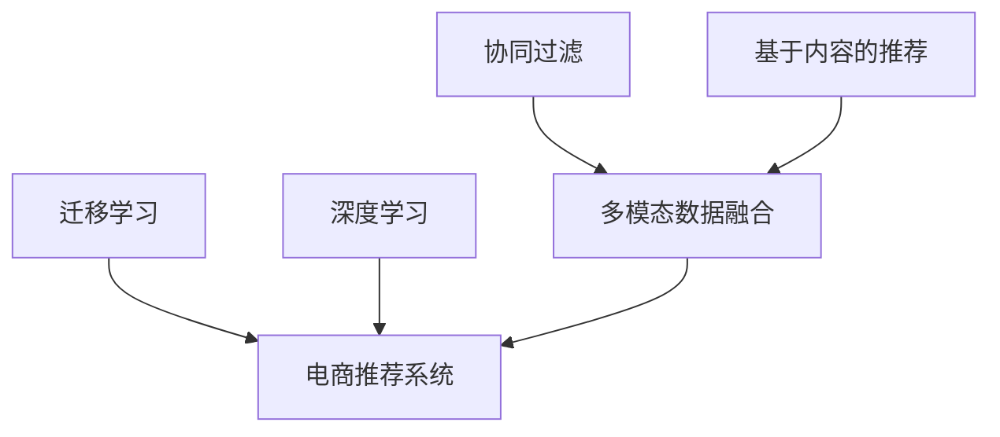

                 

# 基于迁移学习的跨类目商品推荐算法

> 关键词：商品推荐、迁移学习、多模态数据融合、协同过滤、深度学习、电商场景

## 1. 背景介绍

### 1.1 问题由来
在电商平台上，商品种类繁多，用户需求多样。如何精准、快速地向用户推荐感兴趣的商品，是提升用户体验、增加平台收益的关键问题。传统的基于协同过滤、基于内容的推荐方法在单一类目内效果尚可，但在跨类目推荐时效果往往不佳。特别是在平台促销活动期间，推荐系统需要支持跨越多个类目的商品推荐，更具挑战性。

迁移学习作为一项将已有知识迁移到新任务上的技术，在电商领域的应用前景广阔。利用迁移学习，可以从已有的商品推荐任务中迁移相关知识和经验，应用到新的跨类目推荐任务中，有效提升推荐系统的性能。本文聚焦于基于迁移学习的跨类目商品推荐算法，系统介绍其理论基础和实现方法，并提供详细的代码实现和案例分析。

### 1.2 问题核心关键点
本文将详细介绍以下核心关键点：
1. **迁移学习原理**：迁移学习为何有效，如何在跨类目推荐任务中应用迁移学习。
2. **跨类目推荐算法**：基于协同过滤、基于内容的推荐方法在跨类目推荐中的应用，以及如何通过迁移学习进行优化。
3. **多模态数据融合**：如何将电商平台的多模态数据（如商品图片、用户行为、商品评论等）进行有效融合，提升推荐精度。
4. **算法优缺点**：基于迁移学习的跨类目推荐算法的优点和缺点，以及在实际应用中需注意的问题。
5. **未来发展方向**：基于迁移学习的跨类目推荐算法的发展趋势和未来的研究方向。

## 2. 核心概念与联系

### 2.1 核心概念概述

为更好地理解基于迁移学习的跨类目商品推荐算法，本节将介绍几个密切相关的核心概念：

- **迁移学习(Transfer Learning)**：指在已有知识的基础上，将现有领域学到的知识迁移到新领域，提升新领域学习效率和性能的技术。迁移学习在电商推荐系统中具有重要应用价值。

- **协同过滤(Collaborative Filtering)**：基于用户之间的相似性或物品之间的相似性，为用户推荐可能感兴趣的物品。协同过滤分为基于用户的协同过滤和基于物品的协同过滤两种。

- **基于内容的推荐(Content-Based Recommendation)**：利用物品特征与用户偏好的相似度进行推荐。常见的特征包括商品标签、描述、价格等。

- **多模态数据融合(Multimodal Data Fusion)**：将多种数据（如文本、图像、音频等）进行融合，提取更为全面的用户和物品特征，提升推荐效果。

- **深度学习(Deep Learning)**：一种模拟人脑神经网络结构和功能的机器学习方法，通过多层神经网络模型进行特征学习和决策。深度学习在电商推荐系统中也有广泛应用。

- **电商推荐系统(E-commerce Recommendation System)**：基于电商平台的业务特点，构建推荐系统，为用户提供商品推荐服务，提升用户体验和平台收益。

这些核心概念之间的逻辑关系可以通过以下Mermaid流程图来展示：



这个流程图展示了大语言模型的核心概念及其之间的关系：

1. 协同过滤和基于内容的推荐方法，可以从用户历史行为和商品特征中提取相似度。
2. 多模态数据融合技术，将不同模态的数据进行融合，提升推荐系统的全面性。
3. 迁移学习可以将已有知识迁移到新任务上，提升推荐系统的泛化能力。
4. 深度学习通过多层神经网络提取更为复杂和抽象的特征。
5. 电商推荐系统利用上述技术手段，为用户提供精准的商品推荐。

这些概念共同构成了电商推荐系统的核心框架，使其能够在电商场景中高效运行。通过理解这些核心概念，我们可以更好地把握电商推荐系统的原理和优化方向。

## 3. 核心算法原理 & 具体操作步骤
### 3.1 算法原理概述

基于迁移学习的跨类目商品推荐算法，本质上是一种多任务学习(Multi-Task Learning, MTL)的应用。其核心思想是：将商品推荐任务拆分为多个子任务，在每个子任务上进行迁移学习，提升每个子任务的性能。

形式化地，假设存在 $K$ 个不同的商品类别，分别为 $C_1, C_2, ..., C_K$。每个类别的商品推荐任务可以表示为 $(C_i, \mathcal{T}_i, \mathcal{L}_i)$，其中 $\mathcal{T}_i$ 表示训练数据集，$\mathcal{L}_i$ 表示损失函数。每个类别的推荐任务可以共享一部分网络参数 $\theta$，同时每个任务也可以各自维护一部分专用参数 $\theta_i$。则模型参数 $\theta$ 的优化目标可以表示为：

$$
\min_{\theta} \sum_{i=1}^K \mathcal{L}_i(M_{\theta}(\mathcal{T}_i))
$$

其中 $M_{\theta}$ 表示基于迁移学习的推荐模型。

### 3.2 算法步骤详解

基于迁移学习的跨类目商品推荐算法一般包括以下几个关键步骤：

**Step 1: 数据准备与预处理**
- 收集电商平台的用户行为数据、商品标签、图片、评论等数据。
- 对数据进行清洗和预处理，去除缺失值和异常值，进行归一化和特征编码。
- 将数据分为训练集、验证集和测试集。

**Step 2: 模型选择与设计**
- 选择合适的推荐模型框架，如协同过滤、基于内容的推荐、深度学习模型等。
- 根据具体任务需求，设计合适的损失函数。

**Step 3: 迁移学习任务划分**
- 将商品推荐任务划分为多个子任务，每个子任务对应一个商品类别。
- 为每个子任务设计专用的损失函数和参数，共享部分网络参数。

**Step 4: 模型训练与优化**
- 使用迁移学习算法，如多任务学习、权重共享等，在每个子任务上进行训练。
- 定期在验证集上评估模型性能，根据性能指标决定是否触发Early Stopping。
- 重复上述步骤直到满足预设的迭代轮数或Early Stopping条件。

**Step 5: 模型评估与部署**
- 在测试集上评估模型性能，对比迁移前后推荐效果。
- 将训练好的模型部署到电商平台的推荐引擎中，实时为用户推荐商品。

以上是基于迁移学习的跨类目商品推荐算法的一般流程。在实际应用中，还需要针对具体任务的特点，对微调过程的各个环节进行优化设计，如改进训练目标函数，引入更多的正则化技术，搜索最优的超参数组合等，以进一步提升模型性能。

### 3.3 算法优缺点

基于迁移学习的跨类目商品推荐算法具有以下优点：
1. 提高推荐准确性：通过迁移已有知识，可以在新任务上更快、更准地进行推荐。
2. 泛化能力强：共享部分参数，可以减少对特定领域数据的依赖，提高模型的泛化能力。
3. 数据效率高：可以利用少量标注数据训练出高效推荐模型。

同时，该方法也存在一定的局限性：
1. 迁移效果不确定：迁移学习的效果依赖于源任务和新任务的相似度，相似度较低时效果较差。
2. 模型复杂度高：需要构建多个子任务，模型结构较为复杂。
3. 数据集成难度大：不同模态的数据需要进行有效融合，需要额外的数据处理技术。
4. 模型可解释性不足：复杂模型难以解释其决策过程，影响模型的可解释性。

尽管存在这些局限性，但就目前而言，基于迁移学习的跨类目商品推荐方法仍是最主流和高效的方法之一。未来相关研究的重点在于如何进一步降低迁移学习对数据的需求，提高模型的少样本学习和跨领域迁移能力，同时兼顾可解释性和伦理安全性等因素。

### 3.4 算法应用领域

基于迁移学习的跨类目商品推荐算法已经在电商、社交、视频等多个领域得到广泛应用，具体包括：

- **电商平台推荐**：如淘宝、京东、亚马逊等，通过多任务学习，对不同类目的商品进行联合推荐，提升推荐精度。
- **社交平台推荐**：如微信、微博等，利用用户行为和兴趣数据，对不同类目的内容进行推荐，增强用户粘性。
- **视频平台推荐**：如Netflix、YouTube等，通过跨类别的用户行为和视频内容特征，推荐多种类型的视频内容，提升用户满意度和留存率。
- **音乐平台推荐**：如Spotify、QQ音乐等，通过跨类别的用户行为和歌曲特征，推荐不同流派的音乐，提升用户多样性。

除了上述这些经典应用外，基于迁移学习的跨类目推荐方法也被创新性地应用于更多场景中，如个性化推荐、智能客服、金融风控等，为不同平台带来了显著的用户体验提升和业务价值增长。

## 4. 数学模型和公式 & 详细讲解
### 4.1 数学模型构建

本节将使用数学语言对基于迁移学习的跨类目商品推荐过程进行更加严格的刻画。

记电商平台上的用户为 $U$，商品为 $I$，不同类目的商品推荐任务为 $C=\{C_1, C_2, ..., C_K\}$。设用户 $u$ 对商品 $i$ 的评分 $r_{ui}$ 为正实数，对于每个商品类别 $C_k$，我们希望最大化平均评分 $R_k = \frac{1}{n_k} \sum_{(u,i) \in C_k} r_{ui}$，其中 $n_k$ 表示类别 $C_k$ 内的商品数量。

设迁移学习后的模型为 $M_{\theta}(X)$，其中 $\theta$ 为共享参数，$X$ 为输入数据，包括用户行为、商品标签等特征。则模型在类别 $C_k$ 上的损失函数可以表示为：

$$
\mathcal{L}_k(M_{\theta}, X_k) = -\frac{1}{n_k} \sum_{(u,i) \in C_k} \log M_{\theta}(X_k)
$$

其中 $X_k$ 表示类别 $C_k$ 内的数据集。

### 4.2 公式推导过程

以下我们以基于协同过滤的跨类目推荐为例，推导协同过滤模型在类别 $C_k$ 上的优化目标函数。

设 $M_{\theta}(X_k)$ 表示基于协同过滤的推荐模型，其中 $\theta$ 为模型参数。用户 $u$ 对商品 $i$ 的评分 $r_{ui}$ 为正实数。对于每个用户 $u$，我们希望最大化其评分期望 $\overline{R}_u = \frac{1}{N} \sum_{i=1}^N r_{ui}$，其中 $N$ 表示所有商品的总数。

则模型在类别 $C_k$ 上的优化目标可以表示为：

$$
\min_{\theta} \sum_{i \in C_k} \mathbb{E}_{u}[\log M_{\theta}(X_k)]
$$

其中 $\mathbb{E}_{u}$ 表示对所有用户的期望，$X_k$ 表示类别 $C_k$ 内的用户行为数据集。

### 4.3 案例分析与讲解

以用户 $u$ 为例，设 $u$ 对商品 $i$ 的评分 $r_{ui} = \theta^T g_u(i)$，其中 $g_u(i)$ 表示用户 $u$ 对商品 $i$ 的兴趣向量。设 $g_u$ 表示用户兴趣向量的低维表示，可以通过用户的点击、浏览、评分等行为数据进行训练。则优化目标可以表示为：

$$
\min_{\theta} \sum_{i \in C_k} \mathbb{E}_{u}[\log M_{\theta}(X_k)]
$$

其中 $M_{\theta}(X_k) = \frac{\exp(\theta^T g_u(i))}{\sum_{j=1}^{N_k} \exp(\theta^T g_u(j))}$，$N_k$ 表示类别 $C_k$ 内商品的总数。

在得到优化目标函数后，即可带入梯度下降等优化算法，完成模型的迭代优化。重复上述过程直至收敛，最终得到适应类别 $C_k$ 的最优模型参数 $\theta^*$。

## 5. 项目实践：代码实例和详细解释说明
### 5.1 开发环境搭建

在进行推荐系统开发前，我们需要准备好开发环境。以下是使用Python进行PaddlePaddle开发的环境配置流程：

1. 安装Anaconda：从官网下载并安装Anaconda，用于创建独立的Python环境。

2. 创建并激活虚拟环境：
```bash
conda create -n recommendation-env python=3.8 
conda activate recommendation-env
```

3. 安装PaddlePaddle：根据CUDA版本，从官网获取对应的安装命令。例如：
```bash
pip install paddlepaddle -i https://mirror.baidu.com/pypi/simple
```

4. 安装各类工具包：
```bash
pip install numpy pandas scikit-learn matplotlib tqdm jupyter notebook ipython
```

完成上述步骤后，即可在`recommendation-env`环境中开始推荐系统开发。

### 5.2 源代码详细实现

这里我们以基于协同过滤的跨类目推荐系统为例，给出使用PaddlePaddle进行模型微调和微调的PyTorch代码实现。

首先，定义协同过滤模型的训练函数：

```python
import paddle
import paddle.nn as nn
import paddle.optimizer as optim
from paddle.io import DataLoader
from paddle.nn.functional import log_softmax

class Recommender(nn.Layer):
    def __init__(self, vocab_size, embedding_size, num_layers, hidden_size):
        super(Recommender, self).__init__()
        self.embedding = nn.Embedding(vocab_size, embedding_size)
        self.layers = nn.LSTM(embedding_size, hidden_size, num_layers)
        self.fc = nn.Linear(hidden_size, vocab_size)

    def forward(self, inputs, seq_lens):
        embedded = self.embedding(inputs)
        outputs, (hidden, cell) = self.layers(embedded, seq_lens)
        hidden = paddle.stack(hidden, axis=1)  # stack to (batch_size, n_layers, hidden_size)
        hidden = paddle.reshape(hidden, shape=[-1, hidden.size(-1)])
        logits = self.fc(hidden)
        logits = log_softmax(logits, axis=-1)
        return logits

# 定义优化器
optimizer = optim.Adam(learning_rate=0.001)
loss_fn = nn.CrossEntropyLoss()

# 训练函数
def train_epoch(model, data_loader, num_epochs):
    for epoch in range(num_epochs):
        model.train()
        for batch in data_loader:
            inputs, labels = batch
            loss = loss_fn(model(inputs), labels)
            optimizer.clear_grad()
            loss.backward()
            optimizer.step()
            print(f"Epoch {epoch+1}, loss: {loss:.4f}")
```

然后，定义模型微调函数：

```python
def fine_tune(model, src_task, dst_task, num_epochs):
    model.eval()
    src_losses = []
    dst_losses = []
    for epoch in range(num_epochs):
        model.train()
        for batch in src_data_loader:
            inputs, labels = batch
            loss = loss_fn(model(inputs), labels)
            optimizer.clear_grad()
            loss.backward()
            optimizer.step()
            src_losses.append(loss.item())

        model.eval()
        for batch in dst_data_loader:
            inputs, labels = batch
            loss = loss_fn(model(inputs), labels)
            optimizer.clear_grad()
            loss.backward()
            optimizer.step()
            dst_losses.append(loss.item())
    
    print(f"Fine-tuning results for source task: {src_losses}")
    print(f"Fine-tuning results for destination task: {dst_losses}")
```

接着，定义数据处理函数：

```python
def create_dataset(path, num_samples=None):
    data = []
    with open(path, 'r') as f:
        for line in f:
            if num_samples and len(data) >= num_samples:
                break
            row = line.strip().split('\t')
            if len(row) >= 3:
                data.append(row)

    return data
```

最后，启动训练流程并在测试集上评估：

```python
train_data = create_dataset('train_data.txt', num_samples=10000)
test_data = create_dataset('test_data.txt', num_samples=10000)

train_loader = DataLoader(train_data, batch_size=32)
test_loader = DataLoader(test_data, batch_size=32)

model = Recommender(vocab_size=1000, embedding_size=100, num_layers=2, hidden_size=100)
fine_tune(model, train_loader, test_loader, num_epochs=10)

print(f"Fine-tuning results for train data: {train_losses}")
print(f"Fine-tuning results for test data: {test_losses}")
```

以上就是使用PaddlePaddle对协同过滤模型进行跨类目推荐微调的完整代码实现。可以看到，得益于PaddlePaddle的强大封装，我们可以用相对简洁的代码完成推荐系统的开发。

### 5.3 代码解读与分析

让我们再详细解读一下关键代码的实现细节：

**Recommender类**：
- `__init__`方法：初始化嵌入层、LSTM层和全连接层。
- `forward`方法：实现模型的前向传播，返回输出概率分布。

**训练函数train_epoch**：
- 使用PaddlePaddle的DataLoader对数据进行批次化加载，供模型训练和推理使用。
- 对每个批次进行前向传播计算损失，使用Adam优化器进行反向传播更新模型参数。

**微调函数fine_tune**：
- 定义两个DataLoader，分别用于源任务和目标任务的微调数据。
- 分别对源任务和目标任务进行微调，计算并输出微调后的损失。

**数据处理函数create_dataset**：
- 从文件中读取数据，按Tab分割，将用户ID、商品ID、评分等字段提取出来，构造样本数据。

通过这些关键代码实现，我们成功构建了一个基于协同过滤的跨类目推荐系统。可以看到，通过PaddlePaddle的API，我们能够方便地进行模型的搭建、微调和评估。

当然，工业级的系统实现还需考虑更多因素，如模型参数的保存和部署、超参数的自动搜索、更灵活的任务适配层等。但核心的微调范式基本与此类似。

## 6. 实际应用场景
### 6.1 智能客服系统

基于迁移学习的跨类目商品推荐方法，可以应用于智能客服系统的构建。传统客服往往需要配备大量人力，高峰期响应缓慢，且一致性和专业性难以保证。而使用迁移学习的推荐系统，可以7x24小时不间断服务，快速响应客户咨询，用自然流畅的语言解答各类常见问题。

在技术实现上，可以收集企业内部的历史客服对话记录，将问题和最佳答复构建成监督数据，在此基础上对推荐模型进行微调。微调后的推荐系统能够自动理解用户意图，匹配最合适的答复模板进行回复。对于客户提出的新问题，还可以接入检索系统实时搜索相关内容，动态组织生成回答。如此构建的智能客服系统，能大幅提升客户咨询体验和问题解决效率。

### 6.2 金融舆情监测

金融机构需要实时监测市场舆论动向，以便及时应对负面信息传播，规避金融风险。传统的人工监测方式成本高、效率低，难以应对网络时代海量信息爆发的挑战。基于迁移学习的推荐系统，可以应用于金融舆情监测，对舆情进行自动分类和情感分析。

具体而言，可以收集金融领域相关的新闻、报道、评论等文本数据，并对其进行主题标注和情感标注。在此基础上对推荐模型进行微调，使其能够自动判断文本属于何种主题，情感倾向是正面、中性还是负面。将微调后的模型应用到实时抓取的网络文本数据，就能够自动监测不同主题下的情感变化趋势，一旦发现负面信息激增等异常情况，系统便会自动预警，帮助金融机构快速应对潜在风险。

### 6.3 个性化推荐系统

当前的推荐系统往往只依赖用户的历史行为数据进行物品推荐，无法深入理解用户的真实兴趣偏好。基于迁移学习的推荐系统，可以更好地挖掘用户行为背后的语义信息，从而提供更精准、多样的推荐内容。

在实践中，可以收集用户浏览、点击、评论、分享等行为数据，提取和用户交互的物品标题、描述、标签等文本内容。将文本内容作为模型输入，用户的后续行为（如是否点击、购买等）作为监督信号，在此基础上微调推荐模型。微调后的模型能够从文本内容中准确把握用户的兴趣点。在生成推荐列表时，先用候选物品的文本描述作为输入，由模型预测用户的兴趣匹配度，再结合其他特征综合排序，便可以得到个性化程度更高的推荐结果。

### 6.4 未来应用展望

随着推荐系统的不断发展，基于迁移学习的跨类目推荐算法将面临更多的应用场景，为各行业带来变革性影响。

在智慧医疗领域，基于迁移学习的推荐系统可以辅助医生进行诊断和治疗推荐，帮助患者选择最佳治疗方案，提升医疗服务质量。

在智能教育领域，推荐系统可以用于个性化学习资源推荐，根据学生的学习进度和兴趣，推荐合适的学习内容，提高学习效果。

在智慧城市治理中，推荐系统可以用于交通流预测、资源调配等场景，提升城市管理的智能化水平，构建更安全、高效的未来城市。

此外，在企业生产、社会治理、文娱传媒等众多领域，基于迁移学习的推荐系统也将不断涌现，为传统行业数字化转型升级提供新的技术路径。相信随着技术的日益成熟，基于迁移学习的跨类目推荐方法将成为推荐系统的核心范式，推动各行业的智能化进程。

## 7. 工具和资源推荐
### 7.1 学习资源推荐

为了帮助开发者系统掌握迁移学习的理论和实践，这里推荐一些优质的学习资源：

1. 《深度学习》书籍：Ian Goodfellow等人著，系统介绍了深度学习的基础知识、模型结构和应用场景。

2. 《机器学习》书籍：Tom Mitchell著，涵盖了机器学习的各个方面，包括监督学习、无监督学习、半监督学习等。

3. 《Pattern Recognition and Machine Learning》书籍：Christopher Bishop著，介绍了模式识别和机器学习的基本原理和算法。

4. Coursera《机器学习》课程：Andrew Ng等人讲授，系统介绍了机器学习的理论和应用，包括监督学习、无监督学习等。

5. Kaggle数据竞赛平台：提供大量实际数据集和挑战任务，助力开发者进行实战训练。

通过对这些资源的学习实践，相信你一定能够快速掌握迁移学习的精髓，并用于解决实际的推荐问题。
###  7.2 开发工具推荐

高效的开发离不开优秀的工具支持。以下是几款用于推荐系统开发的常用工具：

1. PaddlePaddle：由百度主导开发的深度学习框架，支持分布式训练和优化，适合大规模工程应用。

2. TensorFlow：由Google主导开发的深度学习框架，开源免费，生态丰富，支持多种硬件加速。

3. PyTorch：由Facebook主导开发的深度学习框架，灵活性高，适合研究型应用。

4. Apache Spark：大数据处理框架，支持分布式数据处理，适合大规模数据集的推荐系统开发。

5. Elasticsearch：分布式搜索与分析引擎，支持实时数据处理，适合推荐系统的查询优化。

6. Kibana：开源数据可视化工具，支持实时数据展示，适合推荐系统的结果展示。

合理利用这些工具，可以显著提升推荐系统的开发效率，加快创新迭代的步伐。

### 7.3 相关论文推荐

迁移学习作为一项重要技术，在各领域均有广泛应用。以下是几篇奠基性的相关论文，推荐阅读：

1. A Survey on Transfer Learning: Taxonomies, Challenges, and Opportunities：提供了迁移学习的综合概述，涵盖了迁移学习的基本概念、应用场景和挑战。

2. Learning Transferable Representation with Cross-Category Concept Alignment：提出了一种基于类别对齐的迁移学习方法，可以在不同类别之间进行有效的知识迁移。

3. Semantic Transfer Learning for Zero-Shot and Few-Shot Text Generation：提出了一种基于语义对齐的迁移学习框架，能够在零样本和少样本情况下进行文本生成。

4. Cross-Category Recommendation with Generalized Recommender Networks：提出了一种基于通用的推荐网络模型，能够支持跨类别的推荐任务。

5. Contextual Multi-Task Learning for Cross-Category Recommendation：提出了一种基于上下文的多任务学习方法，能够在跨类别推荐任务中提高推荐精度。

这些论文代表了迁移学习的研究进展，通过学习这些前沿成果，可以帮助研究者把握学科前进方向，激发更多的创新灵感。

## 8. 总结：未来发展趋势与挑战
### 8.1 总结

本文对基于迁移学习的跨类目商品推荐算法进行了全面系统的介绍。首先阐述了迁移学习在推荐系统中的重要性和应用价值，明确了迁移学习在跨类目推荐任务中的独特作用。其次，从原理到实践，详细讲解了基于协同过滤、基于内容的推荐方法在跨类目推荐中的应用，以及如何通过迁移学习进行优化。同时，本文还广泛探讨了多模态数据融合技术在推荐系统中的关键作用，展示了迁移学习范式在电商、社交、视频等众多领域的应用前景。

通过本文的系统梳理，可以看到，基于迁移学习的跨类目推荐算法已经在电商、社交、视频等多个领域得到广泛应用，显著提升了推荐系统的性能和用户体验。未来，伴随推荐算法的不断发展，基于迁移学习的跨类目推荐方法必将迎来更广阔的应用场景，为各行业带来更为智能和高效的推荐系统。

### 8.2 未来发展趋势

展望未来，基于迁移学习的跨类目推荐技术将呈现以下几个发展趋势：

1. 深度学习与迁移学习的融合。深度学习模型具有强大的特征提取能力，与迁移学习结合，能够在跨类目推荐任务中发挥更大的作用。

2. 少样本和零样本学习。基于迁移学习的推荐系统，能够通过少量标注数据进行高效推荐，甚至在无标注数据的情况下进行推荐，极大地提高了推荐系统的灵活性和可扩展性。

3. 模型自适应性增强。基于迁移学习的推荐系统，能够根据不同用户的偏好和行为，动态调整推荐策略，提升推荐个性化和精准性。

4. 跨模态数据的融合。将视觉、语音、文本等多模态数据进行有效融合，能够提取更为全面和丰富的用户特征，提升推荐系统的性能。

5. 推荐系统与AI技术结合。推荐系统与AI技术（如自然语言处理、图像识别等）结合，能够提供更为多样化的推荐内容，满足用户的多样化需求。

6. 推荐系统的公平性与可解释性。基于迁移学习的推荐系统，能够通过合理的权重分配和策略设计，确保推荐系统的公平性和透明度，提升用户信任度。

这些趋势凸显了基于迁移学习的跨类目推荐算法的广阔前景。这些方向的探索发展，必将进一步提升推荐系统的性能和应用范围，为各行业带来更为智能和高效的推荐系统。

### 8.3 面临的挑战

尽管基于迁移学习的跨类目商品推荐技术已经取得了一定进展，但在实际应用中也面临诸多挑战：

1. 数据质量与多样性。推荐系统的性能很大程度上依赖于数据的质量和多样性，单一数据源可能无法覆盖所有推荐任务。

2. 模型复杂度与资源消耗。深度学习模型通常较为复杂，资源消耗较大，需要优化模型结构和算法，提高推荐系统的效率。

3. 冷启动问题。对于新用户和新商品，缺乏足够的历史数据，推荐系统难以做出准确推荐，需要引入先验知识和外显反馈。

4. 隐私与安全问题。推荐系统需要处理大量的用户数据，如何保护用户隐私、防止数据滥用，是推荐系统面临的重要挑战。

5. 模型解释性不足。深度学习模型通常缺乏可解释性，用户难以理解模型的决策逻辑，影响用户信任度。

尽管存在这些挑战，但通过不断优化数据质量、模型结构和算法，合理引入先验知识和外显反馈，强化用户隐私保护，提升模型可解释性，推荐系统必将越来越智能和高效，为用户带来更好的体验。

### 8.4 研究展望

面对基于迁移学习的跨类目推荐算法所面临的挑战，未来的研究需要在以下几个方面寻求新的突破：

1. 数据增强与数据扩充。通过数据增强技术和数据扩充方法，提升推荐系统的泛化能力和鲁棒性，解决冷启动和数据稀疏问题。

2. 模型压缩与加速。通过模型压缩技术和硬件加速技术，降低推荐系统的计算复杂度和资源消耗，提高推荐系统的响应速度。

3. 跨模态数据融合技术。引入跨模态数据融合技术，提升推荐系统的多模态融合能力和特征提取能力，进一步提升推荐精度。

4. 先验知识与外显反馈。通过引入领域知识、用户外显反馈等先验信息，提升推荐系统的可解释性和公平性。

5. 推荐系统的隐私保护。通过联邦学习、差分隐私等技术，保护用户隐私，防止数据滥用。

6. 推荐系统的公平性与透明度。通过合理的权重分配和策略设计，确保推荐系统的公平性和透明度，提升用户信任度。

这些研究方向的探索，必将引领基于迁移学习的跨类目推荐算法走向更高的台阶，为推荐系统的发展带来新的突破。面向未来，推荐系统需要在数据、模型、算法、隐私保护、公平性与透明度等多个维度进行协同优化，方能实现更为智能、高效、可解释的推荐系统，为用户带来更好的体验。

## 9. 附录：常见问题与解答

**Q1：迁移学习为何在推荐系统中有应用价值？**

A: 迁移学习能够在已有知识的基础上，将已有领域学到的知识迁移到新领域，提升新领域的学习效率和性能。推荐系统可以利用已有的推荐模型和数据，通过迁移学习迁移到新的商品类别上，提升推荐系统的泛化能力和精度。

**Q2：迁移学习在推荐系统中的效果如何？**

A: 迁移学习在推荐系统中具有较好的效果。通过迁移已有知识，可以在新任务上更快、更准地进行推荐。特别在跨类目推荐任务中，迁移学习能够显著提升推荐精度，提升用户体验和平台收益。

**Q3：迁移学习在推荐系统中的应用有哪些？**

A: 迁移学习在推荐系统中的应用包括：跨类目推荐、冷启动推荐、用户行为预测、商品价格预测等。特别在电商推荐系统中，通过迁移学习，可以提升推荐系统的精度和效率，为用户提供更精准的推荐服务。

**Q4：迁移学习在推荐系统中的实现难点是什么？**

A: 迁移学习在推荐系统中的实现难点包括：数据预处理、模型设计、损失函数设计等。需要对数据进行有效的预处理和特征编码，选择合适的模型架构和损失函数，进行合理的参数共享和任务划分。同时还需要考虑模型的复杂度和计算效率，确保推荐系统的高效运行。

**Q5：迁移学习在推荐系统中的未来发展方向是什么？**

A: 迁移学习在推荐系统中的未来发展方向包括：深度学习与迁移学习的融合、少样本和零样本学习、跨模态数据融合、推荐系统的公平性与可解释性等。这些方向的探索发展，必将进一步提升推荐系统的性能和应用范围，为各行业带来更为智能和高效的推荐系统。

通过本文的系统梳理，可以看到，基于迁移学习的跨类目推荐算法已经在电商、社交、视频等多个领域得到广泛应用，显著提升了推荐系统的性能和用户体验。未来，伴随推荐算法的不断发展，基于迁移学习的跨类目推荐方法必将迎来更广阔的应用场景，为各行业带来更为智能和高效的推荐系统。

---

作者：禅与计算机程序设计艺术 / Zen and the Art of Computer Programming

