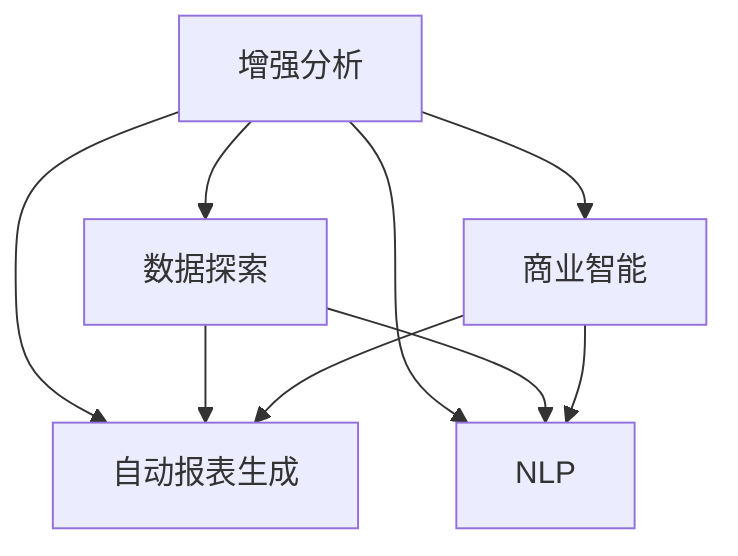

                 

# 增强分析：AI辅助的商业智能

在当今数据驱动的商业环境中，如何高效地处理和分析海量数据，以支持决策者做出明智的决策，成为企业最迫切的需求之一。商业智能(Business Intelligence, BI)技术在此过程中扮演着至关重要的角色，通过提取、分析、呈现数据，帮助企业发现业务洞察，提升竞争力。然而，传统的商业智能系统通常依赖人工编写复杂的SQL查询、报表设计，难以适应快速变化的业务需求，也无法充分利用新兴的大数据技术。为此，AI辅助的增强分析增强智能辅助决策，提升了数据探索和商业洞察的能力，为商业智能带来了革命性的变革。

## 1. 背景介绍

### 1.1 问题由来

随着互联网和移动互联网的快速发展，企业运营产生了海量数据。根据IDC的统计，全球数据量每年以约40%的速度增长，预计到2025年将达到175ZB。传统商业智能系统难以处理如此巨大的数据量，且无法深度挖掘数据背后的业务洞见。如何高效利用大数据，提升商业智能分析能力，成为摆在企业面前的一大挑战。

### 1.2 问题核心关键点

在数据爆炸的时代，提升商业智能系统的数据分析能力，可以从以下几个方面进行：

- **自动化**：利用AI技术自动化地发现业务洞见和知识。
- **交互式**：增强用户的交互体验，提供更直观、更易于理解的分析结果。
- **上下文感知**：考虑用户上下文和业务场景，提供个性化的分析建议。
- **动态更新**：支持实时数据分析和动态报表生成，以应对业务变化。

增强分析(Augmented Analytics)作为新一代商业智能范式，通过引入机器学习、自然语言处理等技术，大幅提升了分析效率和效果，成为企业提升决策智能的重要手段。

## 2. 核心概念与联系

### 2.1 核心概念概述

为更好地理解AI辅助增强分析的原理，本节将介绍几个关键概念：

- **增强分析(Augmented Analytics)**：通过AI技术辅助商业智能，自动化数据探索、分析和洞察的过程，提升数据发现和业务洞见的能力。

- **商业智能(Business Intelligence, BI)**：通过收集、整理、分析和呈现数据，支持决策者理解业务现状和趋势，辅助决策。

- **数据探索(Data Exploration)**：利用AI技术自动化探索数据中的模式和关系，发现业务洞见。

- **自然语言处理(Natural Language Processing, NLP)**：通过分析自然语言文本，提取业务洞见和知识。

- **自动报表生成(Automatic Report Generation)**：通过机器学习算法自动化生成报告和可视化图表。

这些核心概念之间的逻辑关系可以通过以下Mermaid流程图来展示：



这个流程图展示出增强分析与其他关键概念的关系：

1. 增强分析以商业智能为基础，通过自动化技术提升数据发现和业务洞见的能力。
2. 数据探索利用AI自动化地发现数据中的模式和关系。
3. 自动报表生成利用机器学习算法生成报告和可视化图表。
4. NLP通过分析自然语言文本，提取业务洞见和知识。

这些概念共同构成了AI辅助增强分析的核心技术栈，使得企业在面对海量数据时，能够更高效、更智能地进行商业智能分析。

## 3. 核心算法原理 & 具体操作步骤

### 3.1 算法原理概述

增强分析的算法原理主要包括以下几个方面：

- **数据探索**：利用AI技术自动化地探索数据中的模式和关系，发现业务洞见。
- **自动报表生成**：通过机器学习算法，根据用户输入生成报告和可视化图表。
- **自然语言处理**：分析自然语言文本，提取业务洞见和知识。

具体来说，增强分析的算法流程如下：

1. **数据预处理**：清洗、整理和格式化数据，保证数据质量。
2. **特征工程**：提取数据中的特征，生成数据集供模型训练。
3. **模型训练**：利用机器学习算法训练模型，自动发现数据中的模式和关系。
4. **数据可视化**：将模型发现和分析结果以图表形式呈现，辅助决策。
5. **自然语言分析**：通过NLP技术分析自然语言文本，提取业务洞见和知识。

### 3.2 算法步骤详解

以下是增强分析的具体操作步骤：

#### Step 1: 数据准备
- 收集和清洗数据，确保数据质量。
- 根据业务需求设计数据模型，生成数据集。

#### Step 2: 数据探索
- 使用机器学习算法，如聚类、分类、关联规则等，自动发现数据中的模式和关系。
- 使用可视化工具，如Tableau、Power BI等，呈现数据探索的结果。

#### Step 3: 自动报表生成
- 设计报表模板，根据模板生成报告和可视化图表。
- 使用机器学习算法，如决策树、随机森林等，自动生成报表内容。

#### Step 4: 自然语言处理
- 使用NLP技术，如词向量、情感分析等，分析自然语言文本。
- 提取文本中的业务洞见和知识，辅助商业决策。

### 3.3 算法优缺点

增强分析的优点包括：

1. **高效**：利用AI技术自动化地发现数据中的模式和关系，提升了数据发现和业务洞见的能力。
2. **便捷**：增强了用户的交互体验，用户无需编写复杂的SQL查询或报表设计，即可轻松获取分析结果。
3. **个性化**：考虑用户上下文和业务场景，提供个性化的分析建议，提升决策效率。
4. **动态更新**：支持实时数据分析和动态报表生成，以应对业务变化。

缺点包括：

1. **数据质量依赖**：增强分析的效果高度依赖数据质量，数据偏差和噪声可能影响分析结果。
2. **模型复杂性**：增强分析涉及多个AI技术，模型设计和优化过程复杂。
3. **技术门槛高**：需要AI和数据分析的专业知识，对技术团队提出了较高要求。
4. **成本高**：增强分析依赖于高性能计算资源，技术投入较大。

### 3.4 算法应用领域

增强分析的应用领域广泛，涵盖了各个行业的商业智能分析。以下是一些典型的应用场景：

- **零售业**：通过自动报表生成和自然语言处理，分析消费者行为，发现销售趋势和市场洞见。
- **金融业**：利用数据探索和自动报表生成，分析市场动态和风险，辅助投资决策。
- **制造业**：通过自动报表生成和NLP技术，分析生产数据，优化生产流程，提升生产效率。
- **医疗健康**：利用数据探索和NLP技术，分析患者数据，辅助疾病诊断和治疗方案制定。
- **人力资源**：通过数据探索和自动报表生成，分析员工表现和招聘效果，提升人力资源管理。

## 4. 数学模型和公式 & 详细讲解

### 4.1 数学模型构建

增强分析涉及多个AI技术，这里以数据探索为例，构建数学模型。假设我们有数据集 $D=\{(x_i,y_i)\}_{i=1}^N$，其中 $x_i$ 为特征，$y_i$ 为标签。我们希望通过机器学习算法，找到数据中的模式和关系，生成数据集 $D'$。

形式化地，假设 $f(x)$ 为数据探索的目标函数，目标是最大化 $f(x)$，即：

$$
\max_{x} f(x)
$$

其中 $f(x)$ 可以是分类准确率、聚类效果、关联规则等。

### 4.2 公式推导过程

以聚类算法为例，我们通过K-Means算法对数据进行聚类，构建数学模型。

- **K-Means算法**：将数据集 $D$ 分成 $K$ 个簇，使得簇内样本之间的距离最小化。设 $x_i$ 为样本，$c_k$ 为簇中心，则损失函数为：

$$
\min_{x,c_k} \sum_{i=1}^N \min_{k=1}^K ||x_i-c_k||^2
$$

其中 $||.||$ 为欧式距离。

- **优化过程**：通过梯度下降等优化算法，不断更新 $x_i$ 和 $c_k$，最小化损失函数。

### 4.3 案例分析与讲解

假设某电商公司的销售数据集 $D$ 包含时间、地点、品类、销售量等信息。通过K-Means算法对数据进行聚类，可以将相似销售模式的用户分为不同群体。例如，将相似购买行为的用户分为忠诚用户和临时用户。

- **数据预处理**：清洗数据，去除噪声和缺失值。
- **特征工程**：提取特征，如购买时间、地点、品类、销售量等。
- **聚类过程**：通过K-Means算法，将用户分为多个簇，每个簇代表一种购买模式。
- **分析结果**：通过可视化工具，呈现聚类结果，发现不同群体的购买行为特征。

## 5. 项目实践：代码实例和详细解释说明

### 5.1 开发环境搭建

在进行增强分析实践前，我们需要准备好开发环境。以下是使用Python进行Pandas和Scikit-Learn开发的开发环境配置流程：

1. 安装Anaconda：从官网下载并安装Anaconda，用于创建独立的Python环境。

2. 创建并激活虚拟环境：
```bash
conda create -n py3.8 python=3.8 
conda activate py3.8
```

3. 安装Pandas和Scikit-Learn：
```bash
conda install pandas scikit-learn
```

4. 安装其他工具包：
```bash
pip install matplotlib seaborn jupyter notebook ipython
```

完成上述步骤后，即可在`py3.8`环境中开始增强分析实践。

### 5.2 源代码详细实现

这里以K-Means聚类算法为例，给出增强分析的Python代码实现。

```python
from sklearn.cluster import KMeans
import pandas as pd
import seaborn as sns
import matplotlib.pyplot as plt

# 读取数据
data = pd.read_csv('sales_data.csv')

# 数据预处理
data = data.dropna()

# 特征工程
features = ['购买时间', '地点', '品类', '销售量']
X = data[features]

# 聚类过程
kmeans = KMeans(n_clusters=5, random_state=0).fit(X)

# 分析结果
labels = kmeans.labels_
clusters = ['簇1', '簇2', '簇3', '簇4', '簇5']
sns.scatterplot(x=X['购买时间'], y=X['销售量'], hue=labels, palette='Set2')
plt.title('K-Means聚类结果')
plt.show()
```

以上代码实现了K-Means聚类算法，对电商公司的销售数据进行聚类分析。可以看到，Pandas和Scikit-Learn库使得数据处理和分析过程非常简单高效。

### 5.3 代码解读与分析

让我们再详细解读一下关键代码的实现细节：

**数据预处理**：
- `data = data.dropna()`：去除数据中的噪声和缺失值，确保数据质量。

**特征工程**：
- `features = ['购买时间', '地点', '品类', '销售量']`：提取数据中的关键特征。
- `X = data[features]`：将数据转换为模型所需的特征矩阵。

**聚类过程**：
- `kmeans = KMeans(n_clusters=5, random_state=0).fit(X)`：使用K-Means算法对数据进行聚类，分成5个簇。

**分析结果**：
- `labels = kmeans.labels_`：获取每个样本的簇标签。
- `clusters = ['簇1', '簇2', '簇3', '簇4', '簇5']`：定义簇的名称。
- `sns.scatterplot(...)`：使用Seaborn库生成散点图，展示聚类结果。

**可视化**：
- `plt.title('K-Means聚类结果')`：添加图表标题。
- `plt.show()`：显示图表。

## 6. 实际应用场景

### 6.1 零售业

在零售业中，增强分析可以通过自动报表生成和自然语言处理，分析消费者行为，发现销售趋势和市场洞见。具体应用场景包括：

- **消费行为分析**：通过自动报表生成，分析消费者购买时间、地点、品类等行为，发现消费趋势和高峰期。
- **商品推荐**：通过自然语言处理，分析商品评论和用户反馈，推荐热门商品和个性化商品。
- **库存管理**：通过数据探索，分析销售数据，预测库存需求，优化库存管理。

### 6.2 金融业

在金融业中，增强分析可以通过数据探索和自动报表生成，分析市场动态和风险，辅助投资决策。具体应用场景包括：

- **市场分析**：通过数据探索，分析市场行情和趋势，预测股票走势。
- **风险评估**：通过自动报表生成，评估信用风险和投资风险，辅助投资决策。
- **客户分析**：通过自然语言处理，分析客户反馈和评论，提升客户体验和满意度。

### 6.3 制造业

在制造业中，增强分析可以通过自动报表生成和NLP技术，分析生产数据，优化生产流程，提升生产效率。具体应用场景包括：

- **生产效率分析**：通过自动报表生成，分析生产数据，发现生产瓶颈和效率问题。
- **设备维护**：通过数据探索，分析设备故障和维护记录，优化设备维护方案。
- **质量控制**：通过自然语言处理，分析质量检测报告，提升产品质量和检验效率。

### 6.4 医疗健康

在医疗健康中，增强分析可以通过数据探索和NLP技术，分析患者数据，辅助疾病诊断和治疗方案制定。具体应用场景包括：

- **疾病诊断**：通过数据探索，分析患者病历和检测数据，辅助疾病诊断和预测。
- **治疗方案**：通过自然语言处理，分析医生和治疗方案，制定个性化的治疗方案。
- **医疗资源优化**：通过数据探索，分析医疗资源分布和利用情况，优化医疗资源配置。

### 6.5 未来应用展望

随着AI技术的发展，增强分析的应用场景将更加广泛，技术能力将更加强大。以下是一些未来应用的展望：

- **实时分析**：支持实时数据分析，提供动态的商业洞见。
- **自动化决策**：通过增强分析的自动化决策支持系统，辅助决策者做出快速响应。
- **跨领域融合**：结合多个领域的数据，进行跨领域的商业洞察和预测。
- **个性化推荐**：结合用户行为和上下文信息，提供个性化的商业建议。
- **多模态分析**：结合文本、图像、视频等多模态数据，进行全面深入的商业分析。

## 7. 工具和资源推荐

### 7.1 学习资源推荐

为了帮助开发者系统掌握增强分析的理论基础和实践技巧，这里推荐一些优质的学习资源：

1. **《增强分析：AI辅助商业智能》系列博文**：由大数据专家撰写，深入浅出地介绍了增强分析的基本概念、技术原理和实践应用。

2. **Coursera《数据科学专项课程》**：斯坦福大学开设的权威课程，涵盖了数据处理、数据探索、数据可视化等多个方面，适合系统学习。

3. **Kaggle《增强分析竞赛》**：参加Kaggle增强分析竞赛，通过实战项目学习增强分析的实际应用。

4. **Microsoft Azure AI博客**：Microsoft Azure提供的AI技术博客，涵盖机器学习、深度学习、增强分析等多个领域。

5. **Hugging Face《自然语言处理》课程**：提供丰富的NLP学习资源，涵盖NLP基础、深度学习、增强分析等多个方向。

通过对这些资源的学习实践，相信你一定能够快速掌握增强分析的精髓，并用于解决实际的商业智能问题。

### 7.2 开发工具推荐

高效的开发离不开优秀的工具支持。以下是几款用于增强分析开发的常用工具：

1. **Pandas**：Python的数据处理库，支持数据清洗、整理和格式化，是数据探索和分析的基础工具。
2. **Scikit-Learn**：Python的机器学习库，支持多种机器学习算法，适合数据探索和建模。
3. **Jupyter Notebook**：Python的交互式编程环境，支持代码解释和可视化，适合实验和调试。
4. **Tableau**：商业智能工具，支持数据可视化、报表生成，适合分析和展示数据。
5. **Power BI**：微软提供的商业智能工具，支持数据探索、报表生成、自然语言处理等功能，适合企业级应用。

合理利用这些工具，可以显著提升增强分析的开发效率，加快创新迭代的步伐。

### 7.3 相关论文推荐

增强分析的研究源于学界的持续探索。以下是几篇奠基性的相关论文，推荐阅读：

1. **《基于增强分析的零售销售预测》**：提出增强分析在零售销售预测中的应用，通过数据探索和自动报表生成，提升了预测准确性。

2. **《金融市场中的增强分析应用》**：探讨增强分析在金融市场中的应用，通过数据探索和自动报表生成，辅助投资决策。

3. **《制造业中的增强分析》**：分析增强分析在制造业中的应用，通过数据探索和NLP技术，优化生产流程和设备维护。

4. **《医疗健康中的增强分析》**：探讨增强分析在医疗健康中的应用，通过数据探索和NLP技术，辅助疾病诊断和治疗方案制定。

5. **《多模态增强分析》**：研究增强分析在多模态数据中的应用，结合文本、图像、视频等多种数据源，进行全面深入的商业分析。

这些论文代表了大数据和增强分析领域的研究进展，为后续研究提供了重要参考。

## 8. 总结：未来发展趋势与挑战

### 8.1 总结

本文对AI辅助增强分析的基本原理和操作步骤进行了详细讲解。首先阐述了增强分析的兴起背景和重要意义，明确了其在高性能数据分析和业务洞见发现方面的优势。其次，从原理到实践，深入讲解了增强分析的数学模型和操作步骤，给出了增强分析任务开发的完整代码实例。同时，本文还广泛探讨了增强分析在零售业、金融业、制造业等多个行业领域的应用前景，展示了增强分析的巨大潜力。此外，本文精选了增强分析的学习资源、开发工具和相关论文，力求为读者提供全方位的技术指引。

通过本文的系统梳理，可以看到，增强分析作为新一代商业智能范式，通过引入AI技术，极大地提升了数据分析效率和效果，为商业智能带来了革命性的变革。未来，伴随AI技术的不断进步，增强分析必将在更广泛的领域发挥重要作用，深刻影响人类的生产生活方式。

### 8.2 未来发展趋势

展望未来，增强分析技术将呈现以下几个发展趋势：

1. **自动化**：通过更加智能的算法和工具，实现自动化的数据分析和决策支持。
2. **智能化**：结合机器学习、深度学习等技术，提升数据的预测能力和洞见发现能力。
3. **交互式**：提供更加直观、便捷的用户界面，支持用户进行交互式数据分析。
4. **实时化**：支持实时数据分析，提供动态的商业洞见。
5. **跨领域融合**：结合多领域的数据，进行跨领域的商业洞察和预测。
6. **多模态分析**：结合文本、图像、视频等多种数据源，进行全面深入的商业分析。

这些趋势展示了增强分析技术的发展方向，预示了其在商业智能领域的重要地位。

### 8.3 面临的挑战

尽管增强分析技术取得了显著进展，但在应用过程中仍面临一些挑战：

1. **数据质量问题**：增强分析的效果高度依赖数据质量，数据偏差和噪声可能影响分析结果。
2. **模型复杂性**：增强分析涉及多种AI技术，模型设计和优化过程复杂。
3. **技术门槛高**：需要AI和数据分析的专业知识，对技术团队提出了较高要求。
4. **成本高**：增强分析依赖于高性能计算资源，技术投入较大。

### 8.4 研究展望

针对这些挑战，未来的研究需要从以下几个方面进行探索：

1. **数据清洗和预处理**：开发更加高效的数据清洗和预处理技术，提升数据质量。
2. **模型优化**：优化增强分析的算法和模型，提高其性能和鲁棒性。
3. **技术普及**：降低技术门槛，普及增强分析技术，提升企业数据处理能力。
4. **低成本解决方案**：开发低成本、高效率的增强分析工具，降低技术投入。

通过这些研究方向的探索，相信增强分析技术将在商业智能领域取得更广泛的应用，为决策者提供更加全面、准确的数据支持和商业洞见。

## 9. 附录：常见问题与解答

**Q1：增强分析是否适用于所有商业智能任务？**

A: 增强分析在大多数商业智能任务上都能取得不错的效果，特别是对于数据量较小的任务。但对于一些特定领域的任务，如医疗、法律等，仅仅依靠通用语料预训练的模型可能难以很好地适应。此时需要在特定领域语料上进一步预训练，再进行微调，才能获得理想效果。

**Q2：增强分析的效果是否高度依赖于数据质量？**

A: 是的，增强分析的效果高度依赖于数据质量。数据偏差和噪声可能导致分析结果的不准确，需要采用数据清洗和预处理技术，提升数据质量。

**Q3：增强分析的模型设计是否复杂？**

A: 是的，增强分析涉及多种AI技术，模型设计和优化过程相对复杂。需要团队具备较强的AI和数据分析能力，才能设计出高效、准确的模型。

**Q4：增强分析的开发和部署是否需要高性能计算资源？**

A: 是的，增强分析依赖于高性能计算资源，技术投入较大。需要具备一定的硬件和软件基础设施，才能进行高效的分析和部署。

**Q5：增强分析如何提升数据发现和业务洞见的能力？**

A: 通过引入机器学习、自然语言处理等技术，自动化地发现数据中的模式和关系，提供更加智能、高效的数据探索和洞见发现能力。

通过本文的系统梳理，可以看到，AI辅助增强分析作为新一代商业智能范式，通过引入AI技术，极大地提升了数据分析效率和效果，为商业智能带来了革命性的变革。未来，伴随AI技术的不断进步，增强分析必将在更广泛的领域发挥重要作用，深刻影响人类的生产生活方式。

