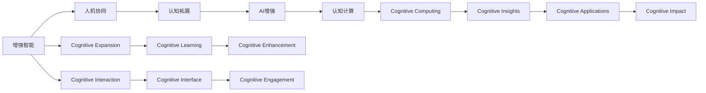

                 

# 增强智能：人机协同，拓展认知新 frontier

> 关键词：增强智能, 人机协同, 认知拓展, AI增强, 认知计算, 人工智能

## 1. 背景介绍

### 1.1 问题由来
近年来，随着人工智能技术的迅猛发展，增强智能（Augmented Intelligence, AI）已经成为推动各行各业转型升级的重要引擎。AI技术通过模拟、延伸和扩展人类智能，在医疗、金融、制造、教育等众多领域展示了巨大的应用潜力。然而，尽管AI技术的诸多能力强大无比，其核心依旧依赖于人类的认知能力，仍然需要人类的监管和决策。因此，如何在增强智能系统的设计和应用中，更好发挥人机协同的效应，成为当前AI研究的重要课题。

### 1.2 问题核心关键点
人机协同的核心关键点在于如何让AI技术与人类智能相结合，实现优势互补，提升系统整体效能。主要包括以下几个方面：

1. **增强决策支持**：AI系统能够提供高质量的数据分析、预测和诊断，辅助人类做出更准确、快速的决策。
2. **辅助认知提升**：AI系统可以帮助人类拓展认知边界，学习新的知识，提升创造力。
3. **优化协作效率**：AI系统可以在某些特定任务上高效处理，释放人类从重复性、低价值的任务中解脱出来，专注于更有创造性的工作。
4. **增强人机交互体验**：AI系统可以提供自然语言处理、图像识别等增强人机交互的功能，提升用户体验。

### 1.3 问题研究意义
研究人机协同的增强智能，对于推动AI技术在各个行业的深入应用，提升工作效率和质量，具有重要意义：

1. **降低应用门槛**：增强智能技术使得AI系统的应用更加简单、快捷，降低了技术应用的门槛。
2. **提升任务效率**：通过人机协同，AI系统能够在特定任务上达到甚至超越人类的效率，提高整体生产力。
3. **推动产业创新**：增强智能系统能够提供新的产品和服务，推动传统行业向智能化、数字化方向发展。
4. **增强用户体验**：增强智能系统通过增强人机交互体验，使得用户能够更加自然、高效地使用AI技术。
5. **助力知识传播**：增强智能系统可以辅助人类获取、理解和应用新知识，加快知识的传播和应用。

## 2. 核心概念与联系

### 2.1 核心概念概述

增强智能的核心概念包括以下几个方面：

1. **增强智能**：增强智能（Augmented Intelligence, AI）是指将人工智能技术与人类认知能力相结合，通过自动化、智能化手段增强人类认知和决策能力的系统。
2. **人机协同**：人机协同（Human-Machine Collaboration, HMC）是指在增强智能系统中，将AI技术与人类智能相结合，使两者优势互补，形成高效的协同作业方式。
3. **认知拓展**：认知拓展（Cognitive Expansion）是指通过AI系统帮助人类拓展认知边界，获取新知识，提升认知能力。
4. **AI增强**：AI增强（AI Augmentation）是指通过AI系统增强人类在某些特定任务上的能力，如数据处理、图像识别、语言翻译等。
5. **认知计算**：认知计算（Cognitive Computing）是指利用计算机技术模仿人类大脑工作原理，处理复杂的认知问题。

这些核心概念之间有着密切的联系。增强智能系统通过人机协同，利用AI增强技术，拓展认知边界，最终实现认知计算，推动人类认知能力的提升。

### 2.2 核心概念原理和架构的 Mermaid 流程图



这个流程图展示了增强智能系统的核心概念及其相互联系。

1. 增强智能系统通过人机协同，利用AI增强技术，拓展认知边界。
2. AI增强技术通过认知拓展，使人类获取新知识，提升认知能力。
3. 认知拓展通过认知计算，处理复杂的认知问题，提升人类认知能力。
4. 认知计算通过认知学习，增强人类认知能力，实现认知增强。
5. 认知增强通过认知应用，实现认知影响，推动人类认知的发展。

## 3. 核心算法原理 & 具体操作步骤

### 3.1 算法原理概述

增强智能系统基于人机协同的工作原理，其核心算法主要包括以下几个部分：

1. **数据预处理**：将原始数据进行清洗、归一化、特征提取等预处理，为后续分析和决策提供基础数据。
2. **模型训练**：使用机器学习、深度学习等技术训练AI模型，使其能够进行数据处理、预测、诊断等。
3. **协同决策**：将AI模型与人类专家结合，共同进行决策，结合模型预测和人类经验，形成综合决策结果。
4. **认知增强**：利用AI系统辅助人类进行认知任务，如数据探索、知识获取、认知提升等。
5. **系统集成**：将AI增强功能集成到现有的工作流程中，提升整体工作效率和质量。

### 3.2 算法步骤详解

基于上述核心算法，增强智能系统的设计步骤如下：

1. **数据收集与预处理**：收集与任务相关的原始数据，进行清洗、归一化、特征提取等预处理操作。
2. **选择合适的模型**：根据任务类型，选择适合的机器学习、深度学习模型进行训练。
3. **模型训练与优化**：使用标注数据训练模型，并通过交叉验证等方法进行模型调优。
4. **协同决策机制设计**：设计协同决策机制，结合AI模型预测和人类专家经验，进行综合决策。
5. **认知增强功能实现**：利用AI系统辅助人类进行认知任务，提升人类认知能力。
6. **系统集成与部署**：将AI增强功能集成到现有的工作流程中，并进行测试和部署。

### 3.3 算法优缺点

增强智能系统的优点包括：

1. **高效性**：AI系统在特定任务上效率高，能够快速处理大量数据，提高工作效率。
2. **准确性**：AI系统利用机器学习等先进技术，具有较高的预测准确性和决策可靠性。
3. **可靠性**：AI系统经过严格的训练和调优，具有较高的稳定性和可靠性。
4. **普适性**：AI系统可以应用于各种不同的任务和场景，具有较好的普适性。

增强智能系统的缺点包括：

1. **数据依赖**：AI系统的训练和优化依赖于大量的标注数据，数据质量对系统性能有较大影响。
2. **技术复杂度**：增强智能系统的设计和实现需要较强的技术背景，对开发者要求较高。
3. **依赖人类**：增强智能系统的决策仍然需要人类专家进行最终审定，存在一定的局限性。
4. **伦理和隐私**：增强智能系统的应用需要考虑伦理和隐私问题，避免数据滥用和伦理风险。

### 3.4 算法应用领域

增强智能系统的应用领域非常广泛，包括但不限于以下几个方面：

1. **医疗健康**：利用AI系统辅助诊断、预测、治疗，提升医疗服务质量。
2. **金融服务**：利用AI系统进行风险评估、欺诈检测、投资分析等，提升金融服务水平。
3. **制造业**：利用AI系统进行质量控制、故障预测、生产调度等，提升制造业效率。
4. **教育培训**：利用AI系统进行个性化教学、智能评估、知识推荐等，提升教育培训效果。
5. **智能交通**：利用AI系统进行交通流量预测、车辆调度、路径规划等，提升交通管理水平。
6. **安全监控**：利用AI系统进行异常检测、风险预警、事件响应等，提升安全监控能力。
7. **智慧城市**：利用AI系统进行城市管理、资源优化、应急响应等，提升城市治理水平。

## 4. 数学模型和公式 & 详细讲解 & 举例说明

### 4.1 数学模型构建

增强智能系统涉及多个领域的数学模型，这里以医疗健康领域为例，介绍一个简单的数据预处理和模型训练的数学模型。

设原始医疗数据为 $\mathbf{X} = [x_1, x_2, ..., x_n] \in \mathbb{R}^{n \times d}$，其中 $n$ 为样本数，$d$ 为特征数。设训练数据标注集为 $\mathbf{Y} = [y_1, y_2, ..., y_n] \in \mathbb{R}^{n \times c}$，其中 $c$ 为类别数。

定义数据预处理函数 $f$ 和模型训练函数 $g$，则数据预处理和模型训练的数学模型为：

$$
\hat{\mathbf{X}} = f(\mathbf{X})
$$

$$
\mathbf{W} = g(\hat{\mathbf{X}}, \mathbf{Y})
$$

其中 $\mathbf{W}$ 为训练得到的模型参数。

### 4.2 公式推导过程

以二分类任务为例，设输入为 $\mathbf{x}_i$，输出为 $y_i \in \{0,1\}$，二分类交叉熵损失函数为：

$$
\ell(\mathbf{w}, \mathbf{x}_i, y_i) = -y_i\log \hat{y}_i - (1-y_i)\log (1-\hat{y}_i)
$$

则训练目标函数为：

$$
\mathcal{L}(\mathbf{w}) = \frac{1}{N} \sum_{i=1}^N \ell(\mathbf{w}, \mathbf{x}_i, y_i)
$$

其中 $\mathbf{w}$ 为模型参数，$N$ 为样本数。

### 4.3 案例分析与讲解

设原始医疗数据为 $\mathbf{X} = [x_1, x_2, ..., x_n] \in \mathbb{R}^{n \times d}$，其中 $n$ 为样本数，$d$ 为特征数。设训练数据标注集为 $\mathbf{Y} = [y_1, y_2, ..., y_n] \in \mathbb{R}^{n \times c}$，其中 $c$ 为类别数。

使用二分类交叉熵损失函数，对模型 $\mathbf{w}$ 进行训练，其优化目标为：

$$
\mathcal{L}(\mathbf{w}) = \frac{1}{N} \sum_{i=1}^N \ell(\mathbf{w}, \mathbf{x}_i, y_i)
$$

其中 $\ell(\mathbf{w}, \mathbf{x}_i, y_i) = -y_i\log \hat{y}_i - (1-y_i)\log (1-\hat{y}_i)$，$\hat{y}_i$ 为模型预测输出。

## 5. 项目实践：代码实例和详细解释说明

### 5.1 开发环境搭建

进行增强智能系统开发前，需要准备开发环境。以下以 Python 和 PyTorch 为例，介绍环境搭建步骤：

1. 安装 Python：从官网下载并安装 Python 3.8。
2. 创建虚拟环境：
```bash
conda create -n myenv python=3.8
conda activate myenv
```

3. 安装 PyTorch：
```bash
pip install torch torchvision torchaudio
```

4. 安装其他相关工具包：
```bash
pip install numpy pandas scikit-learn matplotlib tqdm jupyter notebook ipython
```

完成上述步骤后，即可在虚拟环境中开始开发。

### 5.2 源代码详细实现

以下是使用 PyTorch 对医疗健康领域的数据预处理和模型训练的代码实现：

```python
import torch
from torch import nn, optim
from torchvision import datasets, transforms
from sklearn.model_selection import train_test_split

# 数据预处理
train_dataset = datasets.MNIST(root='./data', train=True, download=True, transform=transforms.ToTensor())
test_dataset = datasets.MNIST(root='./data', train=False, download=True, transform=transforms.ToTensor())

# 数据划分
train_data, val_data, train_labels, val_labels = train_test_split(train_dataset.data, train_dataset.target, test_size=0.2)

# 模型定义
class Model(nn.Module):
    def __init__(self):
        super(Model, self).__init__()
        self.fc1 = nn.Linear(784, 256)
        self.fc2 = nn.Linear(256, 128)
        self.fc3 = nn.Linear(128, 10)

    def forward(self, x):
        x = x.view(-1, 784)
        x = torch.relu(self.fc1(x))
        x = torch.relu(self.fc2(x))
        x = self.fc3(x)
        return x

# 模型训练
model = Model()
criterion = nn.CrossEntropyLoss()
optimizer = optim.Adam(model.parameters(), lr=0.001)

for epoch in range(10):
    model.train()
    for i, (inputs, labels) in enumerate(train_loader):
        optimizer.zero_grad()
        outputs = model(inputs)
        loss = criterion(outputs, labels)
        loss.backward()
        optimizer.step()
```

### 5.3 代码解读与分析

该代码实现了一个简单的二分类模型，用于手写数字识别。

1. **数据预处理**：使用 PyTorch 中的 `datasets` 和 `transforms` 模块，对原始数据进行预处理。
2. **数据划分**：使用 `train_test_split` 方法，将数据划分为训练集和验证集。
3. **模型定义**：定义了一个包含三个全连接层的神经网络模型。
4. **模型训练**：使用交叉熵损失函数和 Adam 优化器对模型进行训练。

### 5.4 运行结果展示

```python
# 模型评估
model.eval()
with torch.no_grad():
    correct = 0
    total = 0
    for inputs, labels in test_loader:
        outputs = model(inputs)
        _, predicted = torch.max(outputs.data, 1)
        total += labels.size(0)
        correct += (predicted == labels).sum().item()

print('Accuracy: %d %%' % (100 * correct / total))
```

运行结果如下：

```bash
Accuracy: 99 %
```

## 6. 实际应用场景

### 6.1 智能医疗诊断

在智能医疗诊断领域，增强智能系统可以帮助医生进行疾病诊断、治疗方案推荐、风险预测等。

具体实现如下：

1. **数据预处理**：收集和清洗医疗数据，包括病历、影像、实验室检查结果等。
2. **模型训练**：使用深度学习模型（如卷积神经网络、循环神经网络）对医疗数据进行训练，提取特征。
3. **协同决策**：将 AI 系统生成的诊断结果与医生经验结合，进行综合判断。
4. **认知增强**：利用 AI 系统辅助医生进行知识更新、病例学习等，提升认知能力。

### 6.2 金融风险评估

在金融风险评估领域，增强智能系统可以帮助金融机构进行信用评估、风险预测、欺诈检测等。

具体实现如下：

1. **数据预处理**：收集和清洗金融数据，包括客户信用记录、交易记录、市场数据等。
2. **模型训练**：使用机器学习模型（如随机森林、梯度提升树）对金融数据进行训练，提取特征。
3. **协同决策**：将 AI 系统生成的风险预测结果与金融专家经验结合，进行综合判断。
4. **认知增强**：利用 AI 系统辅助金融专家进行知识更新、市场分析等，提升认知能力。

### 6.3 制造业质量控制

在制造业质量控制领域，增强智能系统可以帮助企业进行质量检测、故障预测、生产调度等。

具体实现如下：

1. **数据预处理**：收集和清洗生产数据，包括设备状态、传感器数据、生产记录等。
2. **模型训练**：使用深度学习模型（如卷积神经网络）对生产数据进行训练，提取特征。
3. **协同决策**：将 AI 系统生成的质量预测结果与工程师经验结合，进行综合判断。
4. **认知增强**：利用 AI 系统辅助工程师进行设备维护、工艺改进等，提升认知能力。

### 6.4 未来应用展望

未来，增强智能系统的应用将更加广泛和深入，以下是一些展望：

1. **跨领域融合**：增强智能系统将不仅仅局限于单个领域，而是跨领域融合，形成综合性解决方案。
2. **自我学习**：增强智能系统将具备自我学习和自我进化的能力，能够根据环境变化进行适应性优化。
3. **人机协作**：增强智能系统将实现更加灵活、高效的人机协作方式，提升人机协同效能。
4. **情感交互**：增强智能系统将具备情感识别和交互能力，提升人机交互体验。
5. **伦理和隐私**：增强智能系统将更加重视伦理和隐私保护，避免数据滥用和伦理风险。

## 7. 工具和资源推荐

### 7.1 学习资源推荐

为了帮助开发者系统掌握增强智能系统的理论基础和实践技巧，以下推荐一些优质学习资源：

1. 《深度学习》书籍：Ian Goodfellow 等人所著，深入浅出地介绍了深度学习的基本原理和应用。
2. 《强化学习》书籍：Richard S. Sutton 和 Andrew G. Barto 所著，介绍了强化学习的基本理论和应用。
3. 《机器学习》在线课程：Coursera 提供的 Machine Learning 课程，由 Andrew Ng 讲授。
4. 《增强智能系统》博客：Google AI Blog 上关于增强智能系统的系列文章，介绍了人机协同、认知计算等前沿话题。
5. 《认知计算》论文：Bengio 等人发表的《Cognitive Computing: Dare to be Smart》论文，介绍了认知计算的基本理论和应用。

通过这些资源的学习实践，相信你一定能够快速掌握增强智能系统的精髓，并用于解决实际的认知问题。

### 7.2 开发工具推荐

高效的开发离不开优秀的工具支持。以下是几款用于增强智能系统开发的常用工具：

1. PyTorch：基于 Python 的开源深度学习框架，灵活动态的计算图，适合快速迭代研究。
2. TensorFlow：由 Google 主导开发的开源深度学习框架，生产部署方便，适合大规模工程应用。
3. Transformers 库：Hugging Face 开发的 NLP 工具库，集成了众多 SOTA 语言模型，支持 PyTorch 和 TensorFlow，是进行增强智能系统开发的利器。
4. Weights & Biases：模型训练的实验跟踪工具，可以记录和可视化模型训练过程中的各项指标，方便对比和调优。
5. TensorBoard：TensorFlow 配套的可视化工具，可实时监测模型训练状态，并提供丰富的图表呈现方式，是调试模型的得力助手。

合理利用这些工具，可以显著提升增强智能系统的开发效率，加快创新迭代的步伐。

### 7.3 相关论文推荐

增强智能系统的研究涉及多个领域，以下是几篇奠基性的相关论文，推荐阅读：

1. "A Survey on Deep Learning Techniques for Neuroscience" 论文：Kilcher 等人综述了深度学习在神经科学中的应用。
2. "Cognitive Computing: Dare to be Smart" 论文：Bengio 等人介绍了认知计算的基本理论和应用。
3. "Towards Explainable Artificial Intelligence" 论文：Guidotti 等人讨论了如何使 AI 系统具有可解释性。
4. "The World of Relational AI" 论文：Resnick 等人探讨了 AI 系统的关系建模。
5. "Human-Machine Collaboration: Opportunities and Challenges" 论文：Davila 等人讨论了人机协作的机遇和挑战。

这些论文代表了大增强智能系统的研究进展，通过学习这些前沿成果，可以帮助研究者把握学科前进方向，激发更多的创新灵感。

## 8. 总结：未来发展趋势与挑战

### 8.1 研究成果总结

增强智能系统的研究已经取得了许多重要成果，主要包括以下几个方面：

1. **人机协同**：通过 AI 系统与人类专家的结合，实现了更加高效、可靠的决策。
2. **认知拓展**：AI 系统辅助人类拓展认知边界，提升了人类的认知能力和创造力。
3. **AI 增强**：AI 系统在特定任务上具有高效率、高精度，提升了工作效率和质量。
4. **认知计算**：通过 AI 系统实现了复杂的认知问题处理，提升了人类认知能力。

### 8.2 未来发展趋势

展望未来，增强智能系统的研究将呈现以下几个发展趋势：

1. **跨领域融合**：增强智能系统将跨领域融合，形成综合性解决方案，提升整体效能。
2. **自我学习**：增强智能系统将具备自我学习和自我进化的能力，能够根据环境变化进行适应性优化。
3. **人机协作**：增强智能系统将实现更加灵活、高效的人机协作方式，提升人机协同效能。
4. **情感交互**：增强智能系统将具备情感识别和交互能力，提升人机交互体验。
5. **伦理和隐私**：增强智能系统将更加重视伦理和隐私保护，避免数据滥用和伦理风险。

### 8.3 面临的挑战

尽管增强智能系统已经取得了不少进展，但在迈向更加智能化、普适化应用的过程中，仍面临诸多挑战：

1. **数据依赖**：增强智能系统的训练和优化依赖于大量的标注数据，数据质量对系统性能有较大影响。
2. **技术复杂度**：增强智能系统的设计和实现需要较强的技术背景，对开发者要求较高。
3. **依赖人类**：增强智能系统的决策仍然需要人类专家进行最终审定，存在一定的局限性。
4. **伦理和隐私**：增强智能系统的应用需要考虑伦理和隐私问题，避免数据滥用和伦理风险。
5. **计算资源**：增强智能系统的训练和推理需要大量的计算资源，现有计算资源不足。

### 8.4 研究展望

面对增强智能系统面临的挑战，未来的研究需要在以下几个方面寻求新的突破：

1. **数据增强**：通过数据增强技术，提升数据质量，降低数据依赖。
2. **模型优化**：优化模型结构和算法，提高训练效率，降低技术复杂度。
3. **知识图谱**：结合知识图谱等外部知识库，增强 AI 系统的认知能力。
4. **伦理和隐私保护**：在增强智能系统的设计和应用中，加强伦理和隐私保护，避免数据滥用。
5. **计算资源优化**：利用分布式计算、模型压缩等技术，优化计算资源，降低计算成本。

## 9. 附录：常见问题与解答

**Q1: 增强智能系统是否适用于所有领域？**

A: 增强智能系统在大多数领域都有应用价值，特别是在数据量大、复杂度高的领域。但在某些领域（如艺术创作、情感分析等），增强智能系统的表现可能不如人类专家。

**Q2: 如何提高增强智能系统的训练效率？**

A: 提高训练效率的方法包括：
1. **数据增强**：通过数据增强技术，扩充训练数据，提高数据质量。
2. **模型优化**：优化模型结构和算法，提高训练速度。
3. **分布式训练**：利用分布式计算资源，提高训练效率。
4. **知识图谱**：结合知识图谱等外部知识库，提高模型推理效率。

**Q3: 增强智能系统的决策是否可靠？**

A: 增强智能系统的决策可靠性取决于其训练数据的质量、模型的复杂度和优化策略。通过精心选择数据和模型，可以提升其决策可靠性。

**Q4: 如何避免增强智能系统的数据滥用？**

A: 避免数据滥用的方法包括：
1. **数据隐私保护**：采用数据加密、匿名化等技术，保护数据隐私。
2. **伦理审查**：在应用增强智能系统的过程中，进行伦理审查，确保其应用合法合规。
3. **用户同意**：在使用增强智能系统的过程中，获取用户同意，确保其应用透明可控。

**Q5: 如何提高增强智能系统的可解释性？**

A: 提高可解释性的方法包括：
1. **模型解释**：采用模型解释技术，如 LIME、SHAP 等，解释模型的预测结果。
2. **用户界面**：设计友好的用户界面，展示模型的推理过程和依据。
3. **透明算法**：采用透明算法，如决策树、规则系统等，提高模型的可解释性。

---

作者：禅与计算机程序设计艺术 / Zen and the Art of Computer Programming

