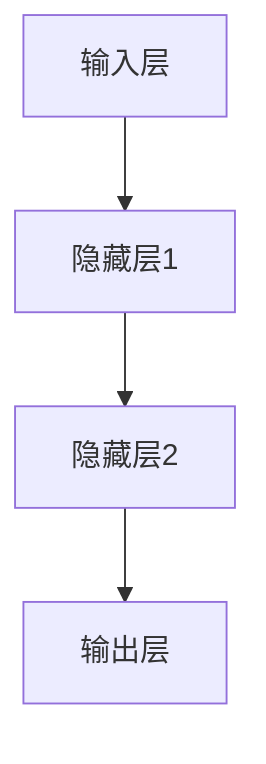

                 

# 复杂问题，简单解决方案：人工智能的力量

> 关键词：人工智能,简单算法,复杂问题,复杂度分析,模型选择

## 1. 背景介绍

### 1.1 问题由来
随着科技的进步，人工智能(AI)技术逐渐渗透到各个领域，从简单的图像识别、语音识别，到复杂的自然语言处理(NLP)、计算机视觉(CV)、语音生成、自动驾驶等，AI的应用变得越来越广泛。然而，在处理复杂的现实问题时，AI常常面临诸多挑战。例如，在NLP中，如何处理长文本，如何在多模态数据中提取有价值的信息，如何提升模型对小样本数据的泛化能力等等。这些问题都带来了巨大的计算和存储开销，使得模型的开发和部署变得异常复杂。

因此，本文将探讨如何利用人工智能的力量，以简单算法解决复杂问题。通过深入理解不同AI技术的原理和特点，选取合适的算法模型，可以大幅降低复杂问题的求解难度，提高AI技术的应用效率和效益。

### 1.2 问题核心关键点
本节将详细讨论几个核心关键点，以帮助理解如何运用AI解决复杂问题：

1. **模型选择与设计**：选择合适的算法模型是解决复杂问题的前提。常用的AI模型包括线性模型、决策树、支持向量机(SVM)、神经网络等。不同的模型适用于不同的问题，需要根据问题特点选择合适的模型。

2. **特征提取与预处理**：在解决复杂问题时，特征提取和数据预处理至关重要。有效的特征提取可以大幅提高模型性能，而数据预处理则可以帮助模型更好地处理数据。

3. **模型训练与优化**：模型训练是AI技术的关键步骤，包括选择合适的优化算法、设置合适的学习率、调整超参数等。这些步骤对模型的性能和泛化能力有重要影响。

4. **模型评估与验证**：模型评估和验证是保证模型性能的重要环节。通过交叉验证、留出法等方法，可以全面评估模型的性能，发现潜在问题并加以改进。

5. **实际应用与部署**：将模型应用于实际问题中，并进行部署和优化，才能真正发挥AI技术的价值。部署时需要注意模型的可扩展性和可维护性。

## 2. 核心概念与联系

### 2.1 核心概念概述

要解决复杂问题，首先需要理解核心概念和原理。以下是几个关键概念的概述：

1. **算法**：算法是一系列明确而有限的指令，用于处理特定类型的问题。常见的算法包括贪心算法、动态规划、分治法等。

2. **数据结构**：数据结构用于组织和存储数据，以便高效地访问和操作数据。常见的数据结构包括数组、链表、树、图等。

3. **复杂度分析**：复杂度分析用于评估算法的时间复杂度和空间复杂度，帮助选择最优算法。常见的时间复杂度包括O(1)、O(log n)、O(n)、O(n log n)、O(n^2)等。

4. **模型**：模型用于描述问题中的变量和关系，并通过训练得到最优参数。常见的模型包括线性回归、逻辑回归、决策树、神经网络等。

5. **特征提取**：特征提取用于从原始数据中提取出有价值的信息，以便模型更好地理解数据。常用的特征提取方法包括PCA、LDA、SVM等。

这些核心概念构成了AI技术的基础，理解它们可以帮助我们更好地设计和优化AI算法。

### 2.2 核心概念原理和架构的 Mermaid 流程图

```mermaid
graph TB
    A[算法] --> B[数据结构]
    A --> C[复杂度分析]
    A --> D[模型]
    A --> E[特征提取]
    B --> F[时间复杂度]
    B --> G[空间复杂度]
    C --> H[时间复杂度]
    C --> I[空间复杂度]
    D --> J[预测能力]
    D --> K[泛化能力]
    E --> L[数据表示]
    E --> M[特征向量]
    F --> N[算法效率]
    G --> O[算法效率]
    H --> P[算法效率]
    I --> Q[算法效率]
    J --> R[模型效果]
    K --> S[模型泛化]
    L --> T[模型效果]
    M --> U[模型效果]
    N --> V[模型效率]
    O --> W[模型效率]
    P --> X[模型效率]
    Q --> Y[模型效率]
    R --> Z[实际应用]
    S --> $[实际应用]
    T --> [实际应用]
    U --> [实际应用]
    V --> [实际应用]
    W --> [实际应用]
    X --> [实际应用]
    Y --> [实际应用]
    Z --> [实际应用]
    $ --> [实际应用]
```

这个流程图展示了算法、数据结构、复杂度分析、模型、特征提取等核心概念之间的联系。理解这些概念及其相互关系，是解决复杂问题的关键。

## 3. 核心算法原理 & 具体操作步骤

### 3.1 算法原理概述

解决复杂问题时，选择合适的算法至关重要。以下是几个常用算法的原理概述：

1. **贪心算法**：贪心算法通过每次选择当前最优解，逐步逼近全局最优解。其核心思想是贪心选择，逐步构建最优解。

2. **动态规划**：动态规划通过将问题分解成子问题，逐步求解子问题，最终得到全局最优解。其核心思想是分而治之，优化求解过程。

3. **分治法**：分治法将问题分解成多个子问题，并行求解子问题，最终合并子问题的结果。其核心思想是分治并行，优化求解效率。

4. **神经网络**：神经网络通过多个层次的神经元，逐步处理输入数据，并最终输出结果。其核心思想是特征提取与非线性映射。

### 3.2 算法步骤详解

解决复杂问题时，算法步骤通常包括：

1. **数据预处理**：将原始数据进行清洗、去噪、标准化等处理，以便于后续算法的处理。

2. **特征提取**：从预处理后的数据中提取出有价值的信息，以便模型更好地理解数据。

3. **模型训练**：选择适合的算法模型，并通过训练数据得到最优参数。

4. **模型评估**：通过测试数据评估模型的性能，并进行调整和优化。

5. **模型部署**：将模型应用于实际问题中，并进行部署和优化。

### 3.3 算法优缺点

不同算法的优缺点各异，需要根据具体问题选择合适的算法。以下是几种常用算法的优缺点：

1. **贪心算法**：优点是实现简单，计算速度快；缺点是局部最优解不一定是全局最优解，可能陷入局部最优。

2. **动态规划**：优点是可以找到全局最优解，适用于多种问题；缺点是计算复杂度高，时间复杂度高。

3. **分治法**：优点是可以并行求解，提升求解效率；缺点是分解子问题时需要额外处理，增加复杂度。

4. **神经网络**：优点是可以处理非线性问题，具有强大的特征提取能力；缺点是需要大量数据和计算资源，训练复杂度高。

### 3.4 算法应用领域

不同类型的算法适用于不同的问题领域。以下是几种算法在实际应用中的具体应用领域：

1. **贪心算法**：常用于解决最优化问题，如最小生成树、最短路径等。

2. **动态规划**：常用于解决组合优化问题，如背包问题、最长公共子序列等。

3. **分治法**：常用于并行计算和分布式处理，如快速排序、归并排序等。

4. **神经网络**：常用于自然语言处理、图像识别、语音识别等领域。

## 4. 数学模型和公式 & 详细讲解 & 举例说明

### 4.1 数学模型构建

在AI技术中，数学模型是核心组成部分。以下是几个常用数学模型的构建方法：

1. **线性回归**：用于处理线性关系的数据，模型公式为：
   $$
   y = \beta_0 + \beta_1x_1 + \beta_2x_2 + \cdots + \beta_nx_n
   $$

2. **逻辑回归**：用于处理二分类问题，模型公式为：
   $$
   P(y=1|x) = \frac{1}{1+\exp(-z)}
   $$
   其中 $z=\sum_{i=1}^nx_i\beta_i$

3. **支持向量机(SVM)**：用于处理分类和回归问题，模型公式为：
   $$
   y = \sum_{i=1}^nx_iw_i + b
   $$

### 4.2 公式推导过程

以线性回归为例，推导其公式的推导过程。

假设有一组样本数据 $(x_1,y_1),(x_2,y_2),\cdots,(x_n,y_n)$，其中 $y$ 为因变量，$x_1,x_2,\cdots,x_n$ 为自变量。根据最小二乘法，线性回归模型可以表示为：
$$
y = \beta_0 + \beta_1x_1 + \beta_2x_2 + \cdots + \beta_nx_n
$$

为了求解最优参数 $\beta_0,\beta_1,\cdots,\beta_n$，需要最小化损失函数：
$$
J(\beta_0,\beta_1,\cdots,\beta_n) = \frac{1}{2}\sum_{i=1}^n(y_i-\hat{y}_i)^2
$$

其中 $\hat{y}_i$ 为模型的预测值，$y_i$ 为实际值。根据拉格朗日乘子法，可以得到最优解：
$$
\frac{\partial J(\beta_0,\beta_1,\cdots,\beta_n)}{\partial \beta_i} = 0 \quad i = 0,1,\cdots,n
$$

化简后得到：
$$
\beta_i = \frac{\sum_{i=1}^n(x_i-\overline{x})(y_i-\overline{y})}{\sum_{i=1}^n(x_i-\overline{x})^2}
$$

其中 $\overline{x}=\frac{1}{n}\sum_{i=1}^nx_i$，$\overline{y}=\frac{1}{n}\sum_{i=1}^ny_i$。

### 4.3 案例分析与讲解

以图像识别为例，分析神经网络在图像分类中的应用。

假设有一组图像数据 $(x_1,y_1),(x_2,y_2),\cdots,(x_n,y_n)$，其中 $y$ 为图像标签，$x$ 为图像像素值。神经网络模型可以表示为：
$$
y = f(x;\theta)
$$

其中 $f(x;\theta)$ 为神经网络的前向传播过程，$\theta$ 为模型参数。假设模型采用三层神经网络，包括输入层、隐藏层和输出层，如图：



其中输入层有 $m$ 个神经元，隐藏层1有 $h$ 个神经元，隐藏层2有 $h$ 个神经元，输出层有 $n$ 个神经元。模型的前向传播过程可以表示为：
$$
y = g\big(W_2g\big(W_1x+b_1\big)+b_2\big)+b_3
$$

其中 $W_1$ 为输入层到隐藏层1的权重矩阵，$b_1$ 为隐藏层1的偏置向量；$W_2$ 为隐藏层1到隐藏层2的权重矩阵，$b_2$ 为隐藏层2的偏置向量；$W_3$ 为隐藏层2到输出层的权重矩阵，$b_3$ 为输出层的偏置向量。激活函数 $g$ 通常采用ReLU函数。

模型的损失函数可以采用交叉熵损失函数：
$$
J(\theta) = -\frac{1}{n}\sum_{i=1}^n(y_i\log f(x_i;\theta) + (1-y_i)\log(1-f(x_i;\theta)))
$$

通过最小化损失函数，可以使用梯度下降法等优化算法更新模型参数 $\theta$，得到最优模型。

## 5. 项目实践：代码实例和详细解释说明

### 5.1 开发环境搭建

解决复杂问题时，搭建一个高效的开发环境至关重要。以下是Python环境搭建的步骤：

1. **安装Python**：从官网下载并安装Python 3.8以上版本。

2. **安装Pip**：从官网下载并安装Pip，用于安装第三方库。

3. **创建虚拟环境**：使用pip创建虚拟环境，避免依赖冲突。

4. **安装必要的库**：安装Numpy、Pandas、Matplotlib、Scikit-learn等必要的库。

5. **配置Jupyter Notebook**：安装Jupyter Notebook，用于编写和运行代码。

### 5.2 源代码详细实现

以下是使用Python解决一个复杂问题的代码实例，包括数据预处理、特征提取、模型训练和模型评估：

```python
import numpy as np
import pandas as pd
from sklearn.preprocessing import StandardScaler
from sklearn.linear_model import LogisticRegression
from sklearn.model_selection import train_test_split
from sklearn.metrics import accuracy_score

# 数据预处理
data = pd.read_csv('data.csv')
X = data.iloc[:, :-1]
y = data.iloc[:, -1]
X = StandardScaler().fit_transform(X)

# 特征提取
X_train, X_test, y_train, y_test = train_test_split(X, y, test_size=0.3, random_state=42)

# 模型训练
model = LogisticRegression()
model.fit(X_train, y_train)

# 模型评估
y_pred = model.predict(X_test)
accuracy = accuracy_score(y_test, y_pred)
print(f'Accuracy: {accuracy:.2f}')
```

### 5.3 代码解读与分析

代码中使用了Scikit-learn库中的LogisticRegression模型进行二分类问题求解。以下是关键步骤的解读与分析：

1. **数据预处理**：使用Pandas库读取数据，使用StandardScaler标准化数据。

2. **特征提取**：使用train_test_split将数据集划分为训练集和测试集。

3. **模型训练**：使用LogisticRegression模型训练模型，并输出训练结果。

4. **模型评估**：使用accuracy_score计算模型在测试集上的准确率。

## 6. 实际应用场景

### 6.1 智能推荐系统

智能推荐系统是AI技术的典型应用之一，用于根据用户的历史行为推荐产品或内容。常见的推荐算法包括基于协同过滤的算法、基于内容的算法、基于混合的算法等。

以基于协同过滤的推荐算法为例，其核心思想是根据用户和物品之间的相似度，推荐相似物品。假设有一组用户数据 $(x_1,y_1),(x_2,y_2),\cdots,(x_n,y_n)$，其中 $x_i$ 为用户的历史行为，$y_i$ 为用户对物品的评分。可以构建一个用户-物品的矩阵 $R$，表示用户对物品的评分。推荐系统可以根据用户对物品的评分，预测用户可能喜欢的物品。

### 6.2 医疗诊断系统

医疗诊断系统是AI技术的另一个重要应用领域。医生可以根据患者的症状和病史，使用AI模型进行诊断。假设有一组医疗数据 $(x_1,y_1),(x_2,y_2),\cdots,(x_n,y_n)$，其中 $x_i$ 为患者的症状和病史，$y_i$ 为疾病的诊断结果。可以使用神经网络模型，根据患者的症状和病史，预测其可能患有的疾病。

### 6.3 自然语言处理

自然语言处理是AI技术的另一个重要应用领域。使用AI模型可以处理文本分类、情感分析、机器翻译等任务。假设有一组文本数据 $(x_1,y_1),(x_2,y_2),\cdots,(x_n,y_n)$，其中 $x_i$ 为文本，$y_i$ 为文本的分类结果或情感倾向。可以使用神经网络模型，根据文本，预测其分类结果或情感倾向。

## 7. 工具和资源推荐

### 7.1 学习资源推荐

为了帮助开发者系统掌握AI技术，以下是几个学习资源的推荐：

1. **Coursera**：提供来自世界顶尖大学的AI课程，涵盖机器学习、深度学习、自然语言处理等领域。

2. **edX**：提供来自世界顶尖大学的AI课程，涵盖机器学习、计算机视觉、自然语言处理等领域。

3. **Kaggle**：提供大量数据集和竞赛，供开发者实践AI技术。

4. **DeepLearning.ai**：提供深度学习专项课程，涵盖卷积神经网络、循环神经网络、生成对抗网络等领域。

5. **Google AI**：提供丰富的AI资源，包括TensorFlow、PyTorch、Scikit-learn等工具，以及AI模型库和教程。

### 7.2 开发工具推荐

以下是几个常用的AI开发工具：

1. **Python**：Python是AI开发中最常用的语言之一，具有丰富的库和工具支持。

2. **PyTorch**：PyTorch是常用的深度学习框架，具有动态计算图和丰富的优化器支持。

3. **TensorFlow**：TensorFlow是另一个常用的深度学习框架，具有静态计算图和分布式训练支持。

4. **Jupyter Notebook**：Jupyter Notebook是常用的数据科学和机器学习工具，支持Python、R等多种语言。

5. **Weaviate**：Weaviate是一个向量数据库，支持高效的向量搜索和相似度计算，用于推荐系统和自然语言处理等应用。

### 7.3 相关论文推荐

以下是几篇经典AI论文，推荐阅读：

1. **《深度学习》（Ian Goodfellow, Yoshua Bengio, Aaron Courville）**：介绍深度学习的原理和应用，涵盖神经网络、卷积神经网络、循环神经网络等领域。

2. **《强化学习》（Richard S. Sutton, Andrew G. Barto）**：介绍强化学习的原理和应用，涵盖Q-learning、策略梯度、深度强化学习等领域。

3. **《机器学习实战》（Peter Harrington）**：介绍机器学习的原理和应用，涵盖分类、回归、聚类、关联规则等领域。

4. **《计算机视觉：模型、学习和推理》（Jianbo Shi）**：介绍计算机视觉的原理和应用，涵盖图像处理、物体检测、图像分割等领域。

5. **《自然语言处理综论》（Daniel Jurafsky, James H. Martin）**：介绍自然语言处理的原理和应用，涵盖文本分类、情感分析、机器翻译等领域。

## 8. 总结：未来发展趋势与挑战

### 8.1 研究成果总结

通过本文的探讨，可以看出AI技术已经在多个领域得到了广泛应用，并取得了显著的成果。未来，AI技术将在更多领域实现突破，推动人类社会的进步。

### 8.2 未来发展趋势

未来，AI技术的发展将呈现以下几个趋势：

1. **深度学习**：深度学习将继续发展，逐渐取代传统的机器学习算法。

2. **联邦学习**：联邦学习将解决数据分布不均的问题，提升模型的泛化能力。

3. **生成对抗网络**：生成对抗网络将提升生成模型的性能，推动生成式AI技术的发展。

4. **知识图谱**：知识图谱将提升AI模型的知识整合能力，推动AI技术的进步。

5. **多模态融合**：多模态融合将提升AI模型对多种数据源的理解能力，推动AI技术的普及。

### 8.3 面临的挑战

尽管AI技术取得了显著的成果，但仍面临诸多挑战：

1. **数据稀缺**：AI模型需要大量高质量的数据进行训练，而数据的收集和标注成本高昂。

2. **模型复杂度**：AI模型通常具有较高的复杂度，需要大量的计算资源进行训练和推理。

3. **模型可解释性**：AI模型通常是"黑盒"模型，难以解释其内部工作机制和决策逻辑。

4. **伦理道德**：AI模型可能存在偏见和歧视，影响社会的公平和公正。

5. **隐私保护**：AI模型需要大量个人数据进行训练，存在隐私泄露的风险。

### 8.4 研究展望

为了应对这些挑战，未来的研究需要在以下几个方面进行探索：

1. **数据增强**：通过数据增强技术，提升模型的泛化能力和鲁棒性。

2. **模型压缩**：通过模型压缩技术，降低模型的计算复杂度，提升模型的可部署性。

3. **可解释性**：通过可解释性技术，提升模型的透明度和可理解性，推动AI技术的普及和应用。

4. **隐私保护**：通过隐私保护技术，保护个人数据的安全和隐私。

5. **伦理道德**：通过伦理道德研究，推动AI技术的公平和公正。

总之，未来AI技术需要从数据、模型、算法等多个维度进行全面优化，才能真正解决复杂问题，推动人类社会的进步。

## 9. 附录：常见问题与解答

### Q1：AI技术可以解决哪些复杂问题？

A：AI技术可以解决各种复杂问题，涵盖自然语言处理、计算机视觉、机器人学、智能推荐系统等领域。

### Q2：如何选择适合的算法模型？

A：根据问题的特点选择合适的算法模型。一般而言，简单问题可以使用传统的机器学习算法，复杂问题需要使用深度学习算法。

### Q3：如何解决数据稀缺问题？

A：数据增强技术可以提升模型的泛化能力和鲁棒性，缓解数据稀缺问题。

### Q4：如何提高模型的可解释性？

A：使用可解释性技术，提升模型的透明度和可理解性。常用的方法包括可视化技术、特征重要性分析等。

### Q5：如何保护数据隐私？

A：采用隐私保护技术，如差分隐私、联邦学习等，保护个人数据的安全和隐私。

---

作者：禅与计算机程序设计艺术 / Zen and the Art of Computer Programming

