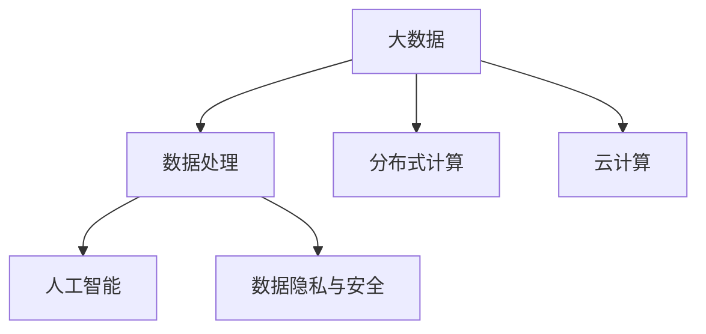

                 

# 大数据时代：人类计算的机遇与挑战

## 1. 背景介绍

### 1.1 问题由来

在信息化和数字化时代，数据的积累和处理已经成为了推动社会进步的重要引擎。大数据不仅揭示了世界的复杂性，还为我们提供了分析、预测、决策的新视角。然而，大数据同样带来了巨大的挑战：数据量爆炸式增长、数据处理复杂度增加、数据隐私和安全问题凸显等。如何在机遇与挑战并存的大数据时代，充分利用计算技术的优势，构建高效、安全、可控的数据处理系统，成为当今研究的热点问题。

### 1.2 问题核心关键点

1. **数据处理与分析**：如何高效处理海量数据，提取有用信息，支持多领域的决策与分析。
2. **数据隐私与安全**：在数据采集、存储、传输、使用的全生命周期中，如何保护用户隐私，防范数据泄露与滥用。
3. **计算效率与成本**：如何在提升数据处理速度的同时，优化计算资源分配，控制计算成本。
4. **数据质量与真实性**：如何确保数据的准确性、完整性和真实性，避免因数据质量问题导致的误导性决策。
5. **模型解释与可控性**：如何构建可解释的模型，确保数据处理和分析过程的可控性，避免黑箱操作。

### 1.3 问题研究意义

研究大数据时代的计算方法，对于提升数据处理效率，保障数据安全与隐私，优化资源配置，促进决策科学化，具有重要意义。以下是几个方面的具体说明：

1. **决策支持**：通过大数据分析，可以为政府决策、企业战略、医疗诊断等提供有力的支持，提升决策的科学性和效率。
2. **公共服务**：大数据技术可以用于优化公共服务流程，提升政府效率，增强公共服务水平。
3. **行业应用**：大数据技术在金融、医疗、教育、交通等多个行业中的应用，可以推动行业转型升级，创造新的增长点。
4. **科学研究**：大数据技术在科学研究中具有广泛应用，可以加速科学发现，提升研究质量。
5. **社会治理**：大数据技术可以用于社会治安、公共卫生、城市管理等领域，提升社会治理水平。

## 2. 核心概念与联系

### 2.1 核心概念概述

在大数据时代，人类计算面临的核心概念包括：

- **大数据**：指规模庞大、结构复杂、变化快速的数据集，通常以TB、PB量级计算。
- **数据处理**：指对大数据进行收集、存储、清洗、分析、可视化的过程。
- **分布式计算**：指利用多台计算机并行处理大规模数据，提升计算效率。
- **云计算**：指通过网络提供可扩展的计算资源，支持海量数据的存储与分析。
- **人工智能**：指通过机器学习、深度学习等技术，对大数据进行智能化处理与分析。
- **数据隐私与安全**：指保护个人和企业数据不受非法访问、使用和泄露的措施。

这些概念之间的逻辑关系可以通过以下Mermaid流程图来展示：



这个流程图展示了大数据时代的主要概念及其之间的关系：

1. 大数据为数据处理、分布式计算和人工智能提供了数据基础。
2. 数据处理、分布式计算和人工智能共同作用，提升数据的价值。
3. 数据隐私与安全是数据处理与人工智能的保障措施。

## 3. 核心算法原理 & 具体操作步骤

### 3.1 算法原理概述

大数据时代的计算方法，核心在于如何高效、安全地处理、分析和利用海量数据。这些方法主要分为以下几类：

- **数据处理算法**：包括数据清洗、数据转换、数据抽取等，用于提升数据质量，为后续分析奠定基础。
- **分布式计算框架**：如Hadoop、Spark等，通过并行计算，支持大规模数据集的处理与分析。
- **云计算平台**：如AWS、Azure、Google Cloud等，提供弹性的计算资源，支持数据存储与处理。
- **人工智能技术**：包括机器学习、深度学习、自然语言处理等，对大数据进行智能化分析与挖掘。

### 3.2 算法步骤详解

下面以基于Hadoop的分布式数据处理为例，详细介绍其具体操作步骤：

**Step 1: 数据收集**

- 使用Hadoop的HDFS（Hadoop Distributed File System），存储海量数据。
- 通过Hadoop的MapReduce（Map-Reduce）框架，收集分布式存储的数据。

**Step 2: 数据清洗**

- 使用Pig Latin、Hive等数据处理工具，进行数据清洗，去除噪声和冗余。
- 使用Hadoop的HiveQL等查询语言，进行数据转换和数据抽取。

**Step 3: 数据存储**

- 将清洗后的数据，使用Hadoop的HBase、Hive等分布式数据库存储。

**Step 4: 数据分析**

- 使用Hadoop的Mahout、Spark MLlib等机器学习库，进行数据建模与分析。
- 使用Apache Zeppelin等工具，可视化分析结果，支持交互式探索。

**Step 5: 数据应用**

- 将分析结果，用于支持决策、优化流程、改进服务等。

### 3.3 算法优缺点

大数据时代的计算方法，具有以下优点：

1. **高效性**：通过分布式计算和云计算，支持大规模数据处理，提升计算效率。
2. **灵活性**：支持动态扩展计算资源，满足不同规模的数据需求。
3. **可扩展性**：可以处理TB、PB量级的数据，支持复杂的数据分析与挖掘。

同时，这些方法也存在一些局限性：

1. **复杂性**：分布式计算和云平台的配置与管理，需要较高的技术门槛。
2. **成本高**：云平台的费用和维护成本较高，初期投入较大。
3. **隐私风险**：数据隐私和安全问题，需要有效的管理和保护措施。
4. **数据质量**：数据清洗和转换的复杂度，影响数据分析的准确性。

### 3.4 算法应用领域

大数据时代的计算方法，广泛应用于各个领域，包括：

- **政府决策**：通过大数据分析，支持公共政策制定、城市规划、社会治理等。
- **企业运营**：通过数据分析，优化供应链管理、市场营销、客户服务等。
- **科学研究**：通过大数据分析，加速科学发现，推动科研创新。
- **医疗健康**：通过数据分析，提升疾病预测、诊疗方案制定等。
- **金融服务**：通过数据分析，支持风险控制、投资决策、金融创新等。

## 4. 数学模型和公式 & 详细讲解 & 举例说明

### 4.1 数学模型构建

在大数据时代，数据处理和分析的数学模型通常包括：

- **回归分析**：用于预测数值型变量的关系，如线性回归、逻辑回归等。
- **分类分析**：用于分类离散型变量，如KNN、SVM、决策树等。
- **聚类分析**：用于将相似数据点分组，如K-means、DBSCAN等。
- **关联分析**：用于发现数据之间的关联关系，如Apriori算法。
- **时间序列分析**：用于分析时间序列数据，如ARIMA模型。

### 4.2 公式推导过程

以线性回归为例，推导其数学模型：

设自变量为 $X_1, X_2, ..., X_n$，因变量为 $Y$，线性回归模型为：

$$
Y = \beta_0 + \beta_1 X_1 + \beta_2 X_2 + ... + \beta_n X_n + \epsilon
$$

其中，$\beta_0$ 为截距，$\beta_i$ 为第 $i$ 个自变量的系数，$\epsilon$ 为误差项。

根据最小二乘法，求 $\beta$ 的估计值：

$$
\hat{\beta} = \arg\min \sum_{i=1}^N (Y_i - \hat{Y}_i)^2
$$

其中 $\hat{Y}_i = \beta_0 + \sum_{j=1}^n \beta_j X_{ij}$。

解得：

$$
\hat{\beta} = (\mathbf{X}^T \mathbf{X})^{-1} \mathbf{X}^T \mathbf{Y}
$$

其中 $\mathbf{X} = [1, X_1, X_2, ..., X_n]$，$\mathbf{Y} = [Y_1, Y_2, ..., Y_n]$。

### 4.3 案例分析与讲解

以某电商平台的销售数据分析为例，展示线性回归的应用：

- **数据收集**：从电商平台收集历史销售数据，包括时间、地区、产品类别、价格、销量等。
- **数据清洗**：去除噪声和异常值，处理缺失数据。
- **数据转换**：将时间数据转换为日期格式，将地区数据转换为分类变量。
- **模型构建**：使用线性回归模型，分析价格、产品类别等对销量的影响。
- **结果分析**：输出回归系数，解释模型结果，指导销售策略优化。

## 5. 项目实践：代码实例和详细解释说明

### 5.1 开发环境搭建

在进行大数据计算项目实践前，我们需要准备好开发环境。以下是使用Python进行PySpark开发的环境配置流程：

1. 安装Anaconda：从官网下载并安装Anaconda，用于创建独立的Python环境。

2. 创建并激活虚拟环境：
```bash
conda create -n pyspark-env python=3.8 
conda activate pyspark-env
```

3. 安装PySpark：根据CUDA版本，从官网获取对应的安装命令。例如：
```bash
conda install pyspark
```

4. 安装各类工具包：
```bash
pip install numpy pandas scikit-learn matplotlib tqdm jupyter notebook ipython
```

完成上述步骤后，即可在`pyspark-env`环境中开始大数据计算任务的开发。

### 5.2 源代码详细实现

这里我们以电商销售数据分析为例，给出使用PySpark进行大数据计算的代码实现。

首先，定义数据处理函数：

```python
from pyspark.sql import SparkSession

spark = SparkSession.builder.appName("Sales Data Analysis").getOrCreate()

# 读取数据
df = spark.read.format("csv").option("header", "true").load("sales_data.csv")

# 数据清洗
df_cleaned = df.dropna().dropDuplicates()

# 数据转换
df_cleaned = df_cleaned.withColumn("date", df_cleaned["timestamp"].cast("date"))

# 模型构建
from pyspark.ml.regression import LinearRegression
model = LinearRegression()

# 训练模型
model.fit(df_cleaned)

# 结果分析
predictions = model.transform(df_cleaned)
df_predictions = predictions.select(["region", "product", "price", "sales", "pred_sales"])
```

然后，定义数据可视化函数：

```python
from pyspark.ml.evaluation import RegressionEvaluator

# 模型评估
evaluator = RegressionEvaluator(
    labelCol="sales",
    predictionCol="pred_sales",
    metricName="rmse",
    labelWindowSize=5
)

# 输出RMSE
rmse = evaluator.evaluate(predictions)
print(f"RMSE: {rmse}")

# 输出回归系数
coefficients = model.coefficients
print(f"Regression Coefficients: {coefficients}")
```

最后，启动数据处理流程：

```python
# 数据探索
df_cleaned.show(10)

# 模型预测
df_predictions.show(10)

# 模型评估
rmse.show(10)

# 回归系数
coefficients.show(10)
```

以上就是使用PySpark进行电商销售数据分析的完整代码实现。可以看到，得益于PySpark的强大分布式计算能力，大数据计算的代码实现变得简洁高效。

### 5.3 代码解读与分析

让我们再详细解读一下关键代码的实现细节：

**SparkSession类**：
- `SparkSession.builder.appName("Sales Data Analysis").getOrCreate()`: 初始化SparkSession，设置应用名称。

**数据处理函数**：
- `spark.read.format("csv").option("header", "true").load("sales_data.csv")`: 使用Spark读取CSV文件。
- `df.dropna().dropDuplicates()`: 清洗数据，去除噪声和重复项。
- `df.withColumn("date", df["timestamp"].cast("date"))`: 将时间戳转换为日期格式。

**模型构建函数**：
- `LinearRegression()`: 创建线性回归模型。
- `model.fit(df_cleaned)`: 训练模型，使用清洗后的数据。

**结果分析函数**：
- `evaluator.evaluate(predictions)`: 评估模型性能，计算RMSE。
- `predictions.select(["region", "product", "price", "sales", "pred_sales"])`: 选择模型预测结果。

可以看到，PySpark为大规模数据处理提供了强大的工具，可以轻松处理TB级别的数据集，支持复杂的数据分析与建模。

当然，工业级的系统实现还需考虑更多因素，如分布式任务的调度、数据的存储与迁移等。但核心的计算任务基本与此类似。

## 6. 实际应用场景

### 6.1 政府决策支持

大数据技术在政府决策支持中具有广泛应用，可以用于：

- **政策制定**：通过数据分析，支持政府政策制定，如公共安全、环境治理、社会福利等。
- **城市规划**：通过地理信息数据，支持城市规划，如交通管理、环境监测、公共设施建设等。
- **社会治理**：通过社会大数据，支持社会治理，如社会安全、公共卫生、社会公平等。

### 6.2 企业运营优化

大数据技术在企业运营优化中具有重要应用，可以用于：

- **供应链管理**：通过数据分析，优化供应链管理，提升物流效率，降低运营成本。
- **市场营销**：通过客户数据分析，优化市场营销策略，提升客户满意度和忠诚度。
- **客户服务**：通过数据分析，提升客户服务水平，增强客户体验。

### 6.3 科学研究创新

大数据技术在科学研究创新中具有广泛应用，可以用于：

- **科学发现**：通过科学数据，加速科学发现，推动科研创新。
- **科研管理**：通过科研数据分析，优化科研项目管理，提升科研效率。
- **科学传播**：通过科学数据可视化，普及科学知识，提升公众科学素养。

### 6.4 金融服务创新

大数据技术在金融服务创新中具有重要应用，可以用于：

- **风险控制**：通过数据分析，提升金融风险控制能力，保障金融稳定。
- **投资决策**：通过数据分析，支持投资决策，提升投资回报率。
- **金融创新**：通过数据分析，推动金融创新，如区块链、智能合约等。

### 6.5 医疗健康应用

大数据技术在医疗健康应用中具有广泛应用，可以用于：

- **疾病预测**：通过数据分析，支持疾病预测，提升疾病预防能力。
- **诊疗方案**：通过患者数据分析，支持诊疗方案制定，提升诊疗效果。
- **健康管理**：通过健康数据，支持健康管理，如运动监测、营养建议等。

## 7. 工具和资源推荐

### 7.1 学习资源推荐

为了帮助开发者系统掌握大数据计算的理论基础和实践技巧，这里推荐一些优质的学习资源：

1. **《大数据：从数据收集到分析与决策》**：经典的大数据教材，详细介绍了大数据处理的技术方法和应用场景。
2. **《Hadoop核心技术详解》**：深入浅出地介绍了Hadoop的原理、架构和应用实践。
3. **《Spark编程与大数据分析》**：介绍了Spark的基本概念、API使用和数据分析方法。
4. **《机器学习实战》**：通过实际案例，讲解了机器学习的基本原理和算法实现。
5. **《大数据可视化：从数据到洞察》**：介绍了数据可视化的基本原理和工具使用。

通过对这些资源的学习实践，相信你一定能够快速掌握大数据计算的精髓，并用于解决实际的业务问题。

### 7.2 开发工具推荐

高效的开发离不开优秀的工具支持。以下是几款用于大数据计算开发的常用工具：

1. **Hadoop**：Apache基金会开发的分布式计算框架，支持海量数据的存储和处理。
2. **Spark**：Apache基金会开发的快速、通用、可扩展的分布式计算框架，支持多种计算任务。
3. **Hive**：Apache基金会开发的大数据仓库，提供数据查询和管理功能。
4. **Flink**：Apache基金会开发的流处理框架，支持实时数据处理和分析。
5. **Pig Latin**：Apache基金会开发的大数据处理工具，支持数据清洗和转换。
6. **Kafka**：Apache基金会开发的消息队列系统，支持数据流处理和存储。

合理利用这些工具，可以显著提升大数据计算任务的开发效率，加快创新迭代的步伐。

### 7.3 相关论文推荐

大数据计算的发展源于学界的持续研究。以下是几篇奠基性的相关论文，推荐阅读：

1. **《GFS: A Scalable File System for Google Clusters》**：介绍了Google的GFS分布式文件系统，为Hadoop的开发提供了重要参考。
2. **《MapReduce: Simplified Data Processing on Large Clusters》**：介绍了MapReduce分布式计算模型，为Spark等框架的开发提供了重要参考。
3. **《A Survey of Large-Scale Online Machine Learning》**：综述了大规模在线机器学习的技术和应用，提供了丰富的理论和方法。
4. **《Big Data: The Hadoop Ecosystem in Action》**：介绍了Hadoop生态系统的各个组件及其应用实践。
5. **《Spark: The Unity of Machine Learning and Big Data Processing》**：介绍了Spark在机器学习和数据处理中的应用实践。

这些论文代表了大数据计算的发展脉络。通过学习这些前沿成果，可以帮助研究者把握学科前进方向，激发更多的创新灵感。

## 8. 总结：未来发展趋势与挑战

### 8.1 总结

本文对大数据时代的计算方法进行了全面系统的介绍。首先阐述了大数据处理和分析的重要性，明确了数据处理在提升决策效率、优化流程、推动创新等方面的关键作用。其次，从原理到实践，详细讲解了大数据处理的数学模型和关键步骤，给出了大数据计算任务开发的完整代码实例。同时，本文还广泛探讨了大数据技术在政府决策、企业运营、科学研究、金融服务、医疗健康等多个领域的应用前景，展示了大数据计算的巨大潜力。最后，本文精选了大数据计算的相关学习资源和开发工具，力求为读者提供全方位的技术指引。

通过本文的系统梳理，可以看到，大数据时代的计算方法正在成为各行各业的重要工具，极大地提升了数据处理和分析的效率与质量。未来，伴随计算技术的发展，大数据计算将与人工智能、物联网等技术深度融合，带来更多创新应用，为社会带来更深远的影响。

### 8.2 未来发展趋势

展望未来，大数据计算技术将呈现以下几个发展趋势：

1. **计算效率提升**：随着计算硬件的进步，大数据处理和分析的效率将大幅提升，支持更大规模的数据处理和更复杂的数据分析。
2. **计算模型多样化**：未来将出现更多大数据处理和分析的计算模型，如流处理、图处理等，支持更多样化的数据应用场景。
3. **计算平台一体化**：大数据处理和分析的平台将更加一体化，支持多技术融合，提升整体效率和可用性。
4. **计算生态开放化**：大数据处理和分析的生态将更加开放，支持更多第三方工具和插件的集成和使用。
5. **计算服务云化**：大数据处理和分析的服务将更加云化，支持按需使用，降低计算成本。

以上趋势凸显了大数据计算技术的广阔前景。这些方向的探索发展，必将进一步提升大数据处理和分析的效率，促进数据驱动的决策和创新。

### 8.3 面临的挑战

尽管大数据计算技术已经取得了瞩目成就，但在迈向更加智能化、普适化应用的过程中，它仍面临着诸多挑战：

1. **数据隐私与安全**：如何在数据处理和分析中保护用户隐私，防范数据泄露与滥用，仍是一个重要问题。
2. **数据质量与真实性**：如何确保数据的准确性、完整性和真实性，避免因数据质量问题导致的误导性决策，仍是一个重要问题。
3. **计算资源优化**：如何在提升计算效率的同时，优化计算资源分配，控制计算成本，仍是一个重要问题。
4. **计算模型复杂性**：如何构建简单、易用、高效的计算模型，提升计算效率和可用性，仍是一个重要问题。
5. **计算平台可靠性**：如何保证计算平台的可靠性，避免单点故障和系统崩溃，仍是一个重要问题。

正视大数据计算面临的这些挑战，积极应对并寻求突破，将是大数据计算走向成熟的必由之路。相信随着学界和产业界的共同努力，这些挑战终将一一被克服，大数据计算必将在构建人机协同的智能时代中扮演越来越重要的角色。

### 8.4 研究展望

面对大数据计算所面临的种种挑战，未来的研究需要在以下几个方面寻求新的突破：

1. **数据隐私与安全**：开发更多数据隐私保护技术，如差分隐私、联邦学习等，确保数据安全。
2. **数据质量与真实性**：加强数据清洗和校验技术，提升数据质量。
3. **计算资源优化**：开发更多高效的计算模型和算法，提升计算效率。
4. **计算平台可靠性**：提高计算平台的可靠性和可扩展性，支持更大规模的数据处理。
5. **计算模型简单化**：开发更多简单、易用、高效的计算模型，提升计算效率和可用性。

这些研究方向的探索，必将引领大数据计算技术迈向更高的台阶，为构建高效、安全、可控的大数据处理系统铺平道路。面向未来，大数据计算技术还需要与其他人工智能技术进行更深入的融合，如知识表示、因果推理、强化学习等，多路径协同发力，共同推动大数据技术的发展。只有勇于创新、敢于突破，才能不断拓展大数据计算的边界，让数据驱动的决策和创新更好地服务于社会。

## 9. 附录：常见问题与解答

**Q1: 大数据计算的计算效率如何提升？**

A: 提升大数据计算效率可以从以下几个方面入手：

1. **分布式计算**：通过多台计算节点并行处理数据，提升计算速度。
2. **计算模型优化**：采用更高效的数据处理和分析模型，如MapReduce、Spark、Flink等。
3. **数据预处理**：对数据进行预处理，去除噪声和冗余，提升数据质量。
4. **数据存储优化**：采用分布式文件系统如HDFS，提升数据存储和访问效率。
5. **硬件升级**：升级计算硬件，如采用GPU、TPU等加速计算。

**Q2: 大数据计算中数据隐私与安全问题如何解决？**

A: 大数据计算中数据隐私与安全问题可以通过以下方法解决：

1. **数据加密**：对数据进行加密处理，防止数据泄露。
2. **差分隐私**：通过添加噪声，保护个人隐私，避免数据识别。
3. **联邦学习**：在不共享数据的前提下，进行模型训练和更新。
4. **匿名化处理**：对数据进行匿名化处理，保护用户隐私。
5. **访问控制**：通过访问控制技术，限制数据访问权限，防止数据滥用。

**Q3: 大数据计算中如何保证数据质量与真实性？**

A: 大数据计算中保证数据质量与真实性可以通过以下方法：

1. **数据清洗**：对数据进行清洗，去除噪声和异常值，提升数据质量。
2. **数据校验**：对数据进行校验，确保数据的一致性和完整性。
3. **数据标准化**：对数据进行标准化处理，提升数据的一致性。
4. **数据验证**：对数据进行验证，确保数据的真实性和准确性。
5. **数据标注**：对数据进行标注，提升数据的真实性和可靠性。

**Q4: 大数据计算中如何保证计算模型的简单性和可用性？**

A: 大数据计算中保证计算模型的简单性和可用性可以通过以下方法：

1. **模型优化**：采用更高效、更易用的计算模型，如Spark、Flink等。
2. **算法优化**：优化算法，提升计算效率和可用性。
3. **工具集成**：集成更多第三方工具和插件，提升计算平台的可用性。
4. **界面优化**：优化用户界面，提升计算平台的易用性。
5. **文档完善**：完善文档和示例，提升计算平台的可操作性。

**Q5: 大数据计算中如何保证计算平台的可靠性和可扩展性？**

A: 大数据计算中保证计算平台的可靠性和可扩展性可以通过以下方法：

1. **分布式架构**：采用分布式架构，提升计算平台的可扩展性。
2. **故障恢复机制**：建立故障恢复机制，确保计算平台的可靠性。
3. **负载均衡**：采用负载均衡技术，提升计算平台的性能和可用性。
4. **资源监控**：监控计算资源的使用情况，优化资源分配。
5. **自动化管理**：采用自动化管理工具，提升计算平台的可操作性和易用性。

通过本文的系统梳理，可以看到，大数据计算技术正在成为各行各业的重要工具，极大地提升了数据处理和分析的效率与质量。未来，伴随计算技术的发展，大数据计算将与人工智能、物联网等技术深度融合，带来更多创新应用，为社会带来更深远的影响。

---

作者：禅与计算机程序设计艺术 / Zen and the Art of Computer Programming

