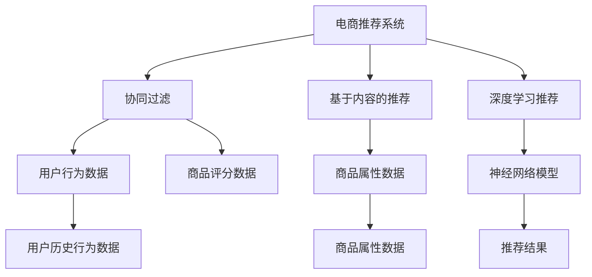

                 

# 大数据驱动的电商推荐系统：AI 模型融合技术在电商领域的应用

> 关键词：推荐系统,大数据,电商,模型融合,协同过滤,深度学习,神经网络,用户行为分析,召回率,点击率

## 1. 背景介绍

### 1.1 问题由来

随着互联网和电子商务的迅猛发展，推荐系统成为电商企业提高用户满意度和销售额的重要工具。通过分析用户的历史行为数据和浏览偏好，推荐系统能够个性化地推送商品，满足用户需求，提升用户黏性和转化率。然而，传统推荐系统往往依赖于用户历史数据和手工设计的特征工程，难以捕捉长尾商品和实时动态变化的用户兴趣，无法应对日益复杂的电商市场。

近年来，随着大数据和人工智能技术的普及，电商推荐系统迎来了新的变革。大数据技术使得电商平台能够积累海量用户数据和商品信息，为推荐算法提供充足的训练样本。AI技术尤其是深度学习技术的进步，为推荐系统提供了更加精准、灵活的算法支撑。在此背景下，电商推荐系统逐步向智能化、个性化、实时化的方向演进，用户体验和转化效果显著提升。

### 1.2 问题核心关键点

电商推荐系统的核心在于如何通过用户行为数据和商品属性数据，精准地预测用户对商品的兴趣和购买行为，从而实现个性化推荐。常见的推荐算法包括协同过滤、基于内容的推荐、深度学习推荐等。这些算法在电商推荐中各有所长，但单一算法往往无法全面覆盖推荐需求。因此，如何融合多种算法优势，构建高精度的电商推荐系统，成为了当前的焦点问题。

本文聚焦于基于AI模型的电商推荐系统构建，深入剖析推荐算法在大数据背景下的优化和融合，探讨了模型融合技术在电商推荐中的应用，并提出了一套高效的电商推荐系统构建方案。通过系统梳理电商推荐的核心概念和关键技术，希望能为电商领域的技术从业者提供实用的技术指导和创新思路。

## 2. 核心概念与联系

### 2.1 核心概念概述

为更好地理解电商推荐系统的构建方法，本节将介绍几个关键概念及其之间的关系：

- **电商推荐系统**：通过分析用户行为数据和商品属性数据，推荐用户可能感兴趣的商品的电商系统。
- **协同过滤**：基于用户历史行为数据和商品评分数据，推测用户对未评分商品的兴趣，进行个性化推荐。
- **基于内容的推荐**：通过商品的属性特征，结合用户历史行为数据，预测用户对商品感兴趣的概率。
- **深度学习推荐**：通过构建神经网络模型，学习商品和用户之间的隐式关系，生成推荐结果。
- **模型融合**：将多种推荐算法进行融合，通过组合不同算法的优势，构建综合性的推荐系统。
- **冷启动**：对于新用户和新商品，缺乏足够的历史数据，推荐系统如何能够准确预测其兴趣和行为，成为一大难题。

这些概念之间的逻辑关系可以通过以下Mermaid流程图来展示：



这个流程图展示了电商推荐系统的核心概念及其之间的关系：

1. 电商推荐系统通过协同过滤、基于内容的推荐、深度学习推荐等多种算法，获取用户和商品的推荐结果。
2. 协同过滤和基于内容的推荐依赖于用户历史行为数据和商品评分数据。
3. 深度学习推荐则利用商品属性数据和神经网络模型，学习用户和商品之间的隐式关系。
4. 通过融合这些算法，构建综合性的电商推荐系统。

这些概念共同构成了电商推荐系统的学习和应用框架，使其能够更好地满足用户个性化需求，提升电商平台的转化率和用户满意度。

## 3. 核心算法原理 & 具体操作步骤

### 3.1 算法原理概述

电商推荐系统通常由用户行为分析、商品属性挖掘和推荐模型构建三个主要部分组成。其中，推荐模型是系统的核心，负责根据用户历史行为和商品属性，预测用户对商品的兴趣，生成推荐列表。常用的推荐算法包括协同过滤、基于内容的推荐、深度学习推荐等，这些算法各有所长，但也各有局限。因此，模型融合技术成为提升推荐系统性能的重要手段。

在推荐模型构建过程中，常见的步骤包括：

1. 数据预处理：清洗、去重、归一化处理原始数据，确保数据质量和一致性。
2. 特征提取：利用自然语言处理(NLP)、图像处理等技术，提取用户行为和商品属性中的关键特征。
3. 模型训练：选择合适的推荐算法和模型架构，利用训练集数据训练推荐模型。
4. 模型融合：将多个推荐结果进行融合，生成最终的推荐列表。
5. 性能评估：通过测试集数据评估推荐模型的效果，优化算法参数和模型结构。

### 3.2 算法步骤详解

**Step 1: 数据预处理**

电商推荐系统的数据预处理通常包括以下几个步骤：

1. **数据清洗**：去除重复、异常和缺失数据，确保数据的完整性和准确性。
2. **数据归一化**：对数值型数据进行归一化处理，如标准化、归一化等，缩小数据量级差异。
3. **特征提取**：利用自然语言处理(NLP)、图像处理等技术，提取用户行为和商品属性中的关键特征。
4. **数据划分**：将数据划分为训练集、验证集和测试集，用于模型的训练、验证和测试。

**Step 2: 特征工程**

电商推荐系统的特征工程通常包括以下几个方面：

1. **用户行为特征**：包括用户浏览记录、点击记录、购买记录等。可以通过TF-IDF、词袋模型等技术进行特征提取。
2. **商品属性特征**：包括商品类别、价格、描述等。可以通过向量化、词嵌入等技术进行特征提取。
3. **用户属性特征**：包括用户性别、年龄、地理位置等。可以通过简单的标签化处理进行特征提取。
4. **上下文特征**：包括用户所处的购物环境、时间、季节等。可以通过时间戳、天气信息等进行特征提取。

**Step 3: 模型训练**

电商推荐系统的模型训练通常包括以下几个方面：

1. **选择算法**：根据电商推荐的特点，选择合适的推荐算法，如协同过滤、基于内容的推荐、深度学习推荐等。
2. **模型架构**：根据选择的算法，设计相应的模型架构，如矩阵分解模型、神经网络模型等。
3. **优化器选择**：选择合适的优化器，如随机梯度下降(SGD)、Adam等，设置学习率、批大小等超参数。
4. **损失函数**：选择合适的损失函数，如均方误差(MSE)、交叉熵损失等，用于衡量模型预测与真实标签之间的差异。
5. **模型训练**：利用训练集数据，通过反向传播算法更新模型参数，最小化损失函数。

**Step 4: 模型融合**

电商推荐系统的模型融合通常包括以下几个方面：

1. **选择融合方法**：根据实际情况，选择合适的融合方法，如平均、加权平均、Stacking等。
2. **融合模型**：将多个推荐模型进行融合，生成综合性的推荐结果。
3. **融合后优化**：对融合后的推荐结果进行优化，如排序、去重等，提升推荐效果。

**Step 5: 性能评估**

电商推荐系统的性能评估通常包括以下几个方面：

1. **召回率**：评估推荐结果中包含用户真正感兴趣商品的数目，衡量推荐系统全面覆盖用户需求的能力。
2. **点击率**：评估推荐结果中用户实际点击的数目，衡量推荐系统对用户行为的准确预测能力。
3. **覆盖率**：评估推荐结果中覆盖不同类别的商品数目，衡量推荐系统对商品多样性的覆盖能力。
4. **相关性**：评估推荐结果中用户对商品的真实兴趣与预测兴趣的一致性，衡量推荐系统推荐的准确性。

通过这些步骤，可以构建一个高效的电商推荐系统，提升用户的购物体验和电商平台的销售转化率。

### 3.3 算法优缺点

电商推荐系统的优点包括：

1. 个性化推荐：通过分析用户历史行为和商品属性，提供个性化推荐，满足用户多样化的需求。
2. 实时性：可以实时处理用户请求，即时更新推荐结果，提升用户满意度。
3. 多样性：通过模型融合技术，综合多种推荐算法，提供更全面的商品推荐，覆盖不同用户的兴趣。
4. 可扩展性：可以处理海量数据和多样化的用户需求，适应电商平台的高并发和复杂场景。

电商推荐系统的缺点包括：

1. 数据质量依赖：推荐效果很大程度上依赖于数据质量，数据不完整或存在偏见会影响推荐结果。
2. 冷启动问题：对于新用户和新商品，缺乏足够的历史数据，推荐系统难以准确预测其兴趣和行为。
3. 计算复杂度高：随着推荐算法的复杂度增加，模型的计算复杂度和存储需求也随之增加，需要大量的计算资源。
4. 算法鲁棒性不足：推荐算法在面对数据变化或新用户时，可能出现鲁棒性不足的问题，影响推荐效果。

尽管存在这些局限性，但电商推荐系统的优势使得其在电商领域的应用日益广泛，成为提升用户体验和转化率的重要工具。未来，相关研究的方向将集中在如何提高数据质量、解决冷启动问题、优化算法性能和提升算法鲁棒性等方面。

### 3.4 算法应用领域

电商推荐系统的应用领域广泛，涵盖了从商品推荐、购物车推荐到个性化广告投放等多个方面。以下是几个典型的应用场景：

1. **商品推荐**：根据用户历史行为和商品属性，推荐用户可能感兴趣的商品。
2. **购物车推荐**：在用户添加商品到购物车时，推荐用户可能感兴趣的其他商品。
3. **个性化广告投放**：通过分析用户行为和属性，精准投放广告，提升广告效果。
4. **内容推荐**：推荐用户可能感兴趣的文章、视频、新闻等，提升平台内容的吸引力和用户黏性。
5. **个性化营销**：根据用户行为数据，制定个性化营销策略，提升用户的购买转化率。

除了上述这些应用场景外，电商推荐系统还被创新性地应用于社交电商、智能客服、虚拟试衣间等领域，为电商技术带来了新的突破。随着技术的不断进步，电商推荐系统将在更多领域大放异彩。

## 4. 数学模型和公式 & 详细讲解 & 举例说明

### 4.1 数学模型构建

电商推荐系统的核心数学模型包括协同过滤模型、基于内容的推荐模型和深度学习推荐模型等。这里以协同过滤模型和基于内容的推荐模型为例，详细讲解其数学模型构建。

假设电商推荐系统中有 $M$ 个商品，$N$ 个用户，$D$ 个用户行为数据，$I$ 个商品属性数据。商品与用户的关联矩阵为 $U$，商品属性矩阵为 $V$，用户行为矩阵为 $X$。电商推荐系统的目标是最小化预测误差，即：

$$
\min_{U,V,X} \sum_{i=1}^{N} \sum_{j=1}^{M} (y_{ij} - \hat{y}_{ij})^2
$$

其中 $y_{ij}$ 表示用户 $i$ 对商品 $j$ 的评分，$\hat{y}_{ij}$ 表示模型预测的用户 $i$ 对商品 $j$ 的评分。

### 4.2 公式推导过程

#### 协同过滤模型

协同过滤模型基于用户历史行为数据，推测用户对未评分商品的兴趣。假设用户 $i$ 对商品 $j$ 的评分 $y_{ij}$ 可以表示为用户 $i$ 对所有用户 $k$ 评分 $\hat{y}_{kj}$ 的加权和，即：

$$
\hat{y}_{ij} = \sum_{k=1}^{K} u_{ik} v_{kj}
$$

其中 $u_{ik}$ 和 $v_{kj}$ 分别表示用户 $k$ 对商品 $j$ 的评分，$K$ 表示所有用户和商品的数目。通过最小化损失函数，可以优化协同过滤模型的参数，即：

$$
\min_{U,V} \sum_{i=1}^{N} \sum_{j=1}^{M} (y_{ij} - \sum_{k=1}^{K} u_{ik} v_{kj})^2
$$

#### 基于内容的推荐模型

基于内容的推荐模型基于商品的属性特征，结合用户历史行为数据，预测用户对商品感兴趣的概率。假设商品 $j$ 的属性向量为 $V_j$，用户 $i$ 对商品 $j$ 的评分 $y_{ij}$ 可以表示为用户 $i$ 对商品 $j$ 的属性向量 $V_j$ 的加权和，即：

$$
\hat{y}_{ij} = \sum_{k=1}^{C} w_{ik} \cdot V_{kj}
$$

其中 $w_{ik}$ 表示用户 $i$ 对属性 $k$ 的兴趣权重，$C$ 表示所有属性的数目。通过最小化损失函数，可以优化基于内容的推荐模型的参数，即：

$$
\min_{W} \sum_{i=1}^{N} \sum_{j=1}^{M} (y_{ij} - \sum_{k=1}^{C} w_{ik} \cdot V_{kj})^2
$$

### 4.3 案例分析与讲解

#### 协同过滤模型

协同过滤模型通过分析用户历史行为数据，推测用户对未评分商品的兴趣。以下是一个基于用户协同过滤的电商推荐系统的实现案例：

1. **数据预处理**：清洗用户历史行为数据，去除重复、异常和缺失数据，并进行归一化处理。
2. **特征提取**：将用户历史行为数据转换为商品评分矩阵 $U$，每个用户 $i$ 对所有商品的评分 $\hat{y}_{ij}$ 表示为该用户对所有其他用户 $k$ 对商品 $j$ 的评分 $\hat{y}_{kj}$ 的加权和。
3. **模型训练**：利用训练集数据，通过最小化损失函数，优化协同过滤模型的参数，即：

$$
\min_{U} \sum_{i=1}^{N} \sum_{j=1}^{M} (y_{ij} - \sum_{k=1}^{K} u_{ik} v_{kj})^2
$$

4. **推荐结果生成**：利用训练好的协同过滤模型，对新用户和新商品进行推荐，生成推荐结果。

#### 基于内容的推荐模型

基于内容的推荐模型通过分析商品属性数据，结合用户历史行为数据，预测用户对商品感兴趣的概率。以下是一个基于商品属性内容的电商推荐系统的实现案例：

1. **数据预处理**：清洗商品属性数据，去除重复、异常和缺失数据，并进行归一化处理。
2. **特征提取**：将商品属性数据转换为属性向量 $V_j$，每个用户 $i$ 对商品 $j$ 的评分 $\hat{y}_{ij}$ 表示为该用户对商品 $j$ 的属性向量 $V_j$ 的加权和。
3. **模型训练**：利用训练集数据，通过最小化损失函数，优化基于内容的推荐模型的参数，即：

$$
\min_{W} \sum_{i=1}^{N} \sum_{j=1}^{M} (y_{ij} - \sum_{k=1}^{C} w_{ik} \cdot V_{kj})^2
$$

4. **推荐结果生成**：利用训练好的基于内容的推荐模型，对新用户和新商品进行推荐，生成推荐结果。

## 5. 项目实践：代码实例和详细解释说明

### 5.1 开发环境搭建

在进行电商推荐系统开发前，我们需要准备好开发环境。以下是使用Python进行Scikit-learn和TensorFlow开发的环境配置流程：

1. 安装Anaconda：从官网下载并安装Anaconda，用于创建独立的Python环境。

2. 创建并激活虚拟环境：
```bash
conda create -n recsys-env python=3.8 
conda activate recsys-env
```

3. 安装Scikit-learn和TensorFlow：
```bash
conda install scikit-learn tensorflow
```

4. 安装必要的工具包：
```bash
pip install pandas numpy matplotlib torch
```

完成上述步骤后，即可在`recsys-env`环境中开始电商推荐系统的开发。

### 5.2 源代码详细实现

下面以基于内容的推荐模型为例，给出使用Scikit-learn和TensorFlow进行电商推荐系统开发的PyTorch代码实现。

首先，定义数据集和模型参数：

```python
import pandas as pd
import numpy as np
from sklearn.model_selection import train_test_split
from sklearn.metrics import mean_squared_error

# 读取用户行为数据
user_data = pd.read_csv('user_behavior.csv')

# 读取商品属性数据
item_data = pd.read_csv('item_attributes.csv')

# 划分数据集
train_data, test_data = train_test_split(user_data, test_size=0.2, random_state=42)

# 定义模型参数
embedding_dim = 10
learning_rate = 0.001
batch_size = 128
epochs = 10
```

然后，定义模型和损失函数：

```python
from sklearn.linear_model import Ridge
from sklearn.metrics import mean_squared_error
import tensorflow as tf
from tensorflow.keras.layers import Embedding, Dense, Flatten, Concatenate
from tensorflow.keras.models import Model

# 定义用户行为数据和商品属性数据的维度
num_users = user_data['user_id'].nunique()
num_items = item_data['item_id'].nunique()
num_features = item_data['feature'].nunique()

# 定义用户和商品的嵌入层
user_embeddings = Embedding(num_users, embedding_dim, input_length=num_items)
item_embeddings = Embedding(num_items, embedding_dim, input_length=num_features)

# 定义模型架构
inputs = Concatenate()([user_embeddings(user_data['user_id']), item_embeddings(item_data['item_id'])])
dense1 = Dense(64, activation='relu')(inputs)
outputs = Dense(1, activation='sigmoid')(dense1)

# 定义损失函数
loss_fn = tf.keras.losses.BinaryCrossentropy()

# 定义优化器
optimizer = tf.keras.optimizers.Adam(learning_rate)
```

接着，定义训练和评估函数：

```python
def train_model(model, data, batch_size, epochs, loss_fn, optimizer):
    dataset = tf.data.Dataset.from_tensor_slices((data['user_id'], data['item_id'], data['feature']))
    dataset = dataset.shuffle(10000).batch(batch_size).map(lambda x: (x[0], x[1], x[2]))
    model.compile(optimizer=optimizer, loss=loss_fn, metrics=['accuracy'])
    model.fit(dataset, epochs=epochs)
    return model

def evaluate_model(model, test_data):
    test_dataset = tf.data.Dataset.from_tensor_slices((test_data['user_id'], test_data['item_id'], test_data['feature']))
    test_dataset = test_dataset.batch(128).map(lambda x: (x[0], x[1], x[2]))
    mse = model.evaluate(test_dataset)
    rmse = np.sqrt(mse)
    print('RMSE:', rmse)
```

最后，启动训练流程并在测试集上评估：

```python
# 训练模型
model = train_model(tf.keras.Sequential([user_embeddings, item_embeddings, dense1, outputs]), train_data, batch_size, epochs, loss_fn, optimizer)

# 评估模型
evaluate_model(model, test_data)
```

以上就是使用Scikit-learn和TensorFlow对电商推荐系统进行开发的完整代码实现。可以看到，借助Scikit-learn的便利和TensorFlow的强大计算能力，电商推荐系统的开发变得简洁高效。

### 5.3 代码解读与分析

让我们再详细解读一下关键代码的实现细节：

**数据预处理**：
- 使用Pandas库读取用户行为数据和商品属性数据，并进行数据清洗和归一化处理。
- 使用train_test_split函数将数据集划分训练集和测试集，便于模型训练和评估。

**模型架构**：
- 使用Keras构建基于内容的推荐模型，包含用户和商品嵌入层、全连接层和输出层。
- 在嵌入层中，使用Embedding层将用户ID和商品ID映射为高维向量，提取特征。
- 在全连接层中，使用Dense层进行特征融合和降维。
- 在输出层中，使用Sigmoid激活函数输出预测评分，表示用户对商品的兴趣。

**损失函数**：
- 使用BinaryCrossentropy作为损失函数，适用于二分类问题，即用户是否对商品感兴趣。

**训练和评估函数**：
- 在train_model函数中，使用Keras构建模型，并进行训练。
- 在evaluate_model函数中，使用Keras评估模型，计算RMSE（均方根误差）。

**训练流程**：
- 在main函数中，使用train_model函数训练模型，使用evaluate_model函数评估模型。

可以看到，使用Scikit-learn和TensorFlow进行电商推荐系统的开发，可以大大降低开发的复杂度，提高效率和效果。

当然，工业级的系统实现还需考虑更多因素，如模型的保存和部署、超参数的自动搜索、更灵活的任务适配层等。但核心的推荐范式基本与此类似。

## 6. 实际应用场景

### 6.1 智能客服系统

智能客服系统通过推荐系统能够为用户提供个性化客服解答，提升客服效率和用户满意度。在智能客服系统中，推荐系统可以根据用户的历史查询记录和当前输入，推荐最匹配的客服答案或FAQ，实现自动回复。

在技术实现上，可以收集用户的历史查询记录和客服FAQ，将查询和FAQ构建成监督数据，在此基础上对预训练模型进行微调。微调后的推荐模型能够自动理解用户查询，匹配最合适的客服答案或FAQ进行回复。对于用户提出的新问题，还可以接入检索系统实时搜索相关内容，动态组织生成回答。如此构建的智能客服系统，能大幅提升客服响应速度和准确率，改善用户体验。

### 6.2 金融推荐系统

金融推荐系统通过推荐系统能够为金融用户推荐个性化的理财和投资方案，提升用户的理财效率和投资收益。在金融推荐系统中，推荐系统可以根据用户的历史交易记录和投资偏好，推荐最匹配的理财产品或投资组合。

在技术实现上，可以收集用户的历史交易记录和理财偏好，将交易和偏好构建成监督数据，在此基础上对预训练模型进行微调。微调后的推荐模型能够自动理解用户的投资需求，匹配最合适的理财产品或投资组合进行推荐。对于用户提出的新需求，还可以接入检索系统实时搜索相关内容，动态生成推荐结果。如此构建的金融推荐系统，能大幅提升用户理财投资的效果，增强用户的黏性和忠诚度。

### 6.3 旅游推荐系统

旅游推荐系统通过推荐系统能够为旅游用户推荐个性化的旅游目的地和行程安排，提升用户的旅游体验和满意度。在旅游推荐系统中，推荐系统可以根据用户的历史旅游记录和偏好，推荐最匹配的旅游目的地和行程安排。

在技术实现上，可以收集用户的历史旅游记录和旅游偏好，将旅游和偏好构建成监督数据，在此基础上对预训练模型进行微调。微调后的推荐模型能够自动理解用户的旅游需求，匹配最合适的旅游目的地和行程安排进行推荐。对于用户提出的新需求，还可以接入检索系统实时搜索相关内容，动态生成推荐结果。如此构建的旅游推荐系统，能大幅提升用户的旅游体验，增强用户的满意度和忠诚度。

### 6.4 未来应用展望

随着电商推荐系统和大数据技术的不断进步，推荐系统将在更多领域得到应用，为各行各业带来变革性影响。

在智慧医疗领域，基于推荐系统的个性化诊疗方案推荐，能够帮助医生制定更为精准的治疗方案，提升诊疗效果和用户满意度。

在智能教育领域，基于推荐系统的个性化学习资源推荐，能够帮助学生发现最适合自己的学习资源，提升学习效果和用户体验。

在智慧城市治理中，基于推荐系统的智能交通系统推荐，能够优化交通流量，提升城市管理效率和居民出行体验。

此外，在企业生产、社会治理、文娱传媒等众多领域，基于推荐系统的个性化服务推荐，都将带来新的突破和创新。相信随着技术的日益成熟，推荐系统必将在更广阔的应用领域大放异彩，深刻影响人类社会的各个方面。

## 7. 工具和资源推荐

### 7.1 学习资源推荐

为了帮助开发者系统掌握电商推荐系统的理论基础和实践技巧，这里推荐一些优质的学习资源：

1. 《推荐系统原理与实践》系列博文：由推荐系统专家撰写，深入浅出地介绍了推荐系统的原理、算法和实践技巧。

2. 《推荐系统实战》书籍：涵盖推荐系统的各个方面，包括数据预处理、模型构建、算法优化等，适合入门和进阶学习。

3. 《深度学习推荐系统》课程：由清华大学开设的推荐系统课程，涵盖深度学习在推荐系统中的应用，适合深度学习从业者学习。

4. Kaggle推荐系统竞赛：Kaggle举办了多场推荐系统竞赛，提供真实数据集和任务，帮助开发者实践和提高推荐系统技能。

5. HuggingFace官方文档：推荐系统的知名库Recommenders的官方文档，提供了详细的模型实现和代码示例，适合学习和实践。

通过对这些资源的学习实践，相信你一定能够快速掌握电商推荐系统的精髓，并用于解决实际的推荐问题。

### 7.2 开发工具推荐

高效的开发离不开优秀的工具支持。以下是几款用于电商推荐系统开发的常用工具：

1. Scikit-learn：Python的科学计算库，提供了多种机器学习算法和模型评估工具，适合推荐系统的数据预处理和模型构建。

2. TensorFlow：由Google主导开发的深度学习框架，提供了强大的计算能力和灵活的模型构建接口，适合推荐系统的模型训练和优化。

3. PyTorch：由Facebook开发的深度学习框架，提供了灵活的计算图和动态模型构建接口，适合推荐系统的模型构建和实验优化。

4. Weights & Biases：模型训练的实验跟踪工具，可以记录和可视化模型训练过程中的各项指标，方便对比和调优。

5. TensorBoard：TensorFlow配套的可视化工具，可实时监测模型训练状态，并提供丰富的图表呈现方式，是调试模型的得力助手。

6. Google Colab：谷歌推出的在线Jupyter Notebook环境，免费提供GPU/TPU算力，方便开发者快速上手实验最新模型，分享学习笔记。

合理利用这些工具，可以显著提升电商推荐系统的开发效率，加快创新迭代的步伐。

### 7.3 相关论文推荐

电商推荐系统和大数据推荐技术的发展源于学界的持续研究。以下是几篇奠基性的相关论文，推荐阅读：

1. 《基于协同过滤的推荐系统研究》：介绍协同过滤模型的基本原理和实现方法，是推荐系统领域的经典文献。

2. 《基于内容的推荐系统研究》：介绍基于内容的推荐模型的基本原理和实现方法，是推荐系统领域的经典文献。

3. 《深度学习推荐系统》：介绍深度学习在推荐系统中的应用，涵盖神经网络、自编码器、强化学习等方法，是推荐系统领域的经典文献。

4. 《推荐系统的评估指标》：介绍推荐系统的评估指标，包括召回率、准确率、覆盖率、相关性等，是推荐系统领域的经典文献。

5. 《推荐系统优化算法》：介绍推荐系统的优化算法，包括基于梯度的优化算法、基于强化学习的优化算法等，是推荐系统领域的经典文献。

这些论文代表了大数据推荐系统和大模型推荐技术的发展脉络。通过学习这些前沿成果，可以帮助研究者把握学科前进方向，激发更多的创新灵感。

## 8. 总结：未来发展趋势与挑战

### 8.1 总结

本文对基于AI模型的电商推荐系统进行了全面系统的介绍。首先阐述了电商推荐系统的构建背景和意义，明确了推荐系统在电商领域的应用价值。其次，从原理到实践，详细讲解了推荐算法在大数据背景下的优化和融合，探讨了模型融合技术在电商推荐中的应用，并提出了一套高效的电商推荐系统构建方案。通过系统梳理电商推荐的核心概念和关键技术，希望能为电商领域的技术从业者提供实用的技术指导和创新思路。

通过本文的系统梳理，可以看到，基于AI模型的电商推荐系统在大数据驱动下，已经在个性化推荐、实时推荐等方面取得了显著效果。受益于深度学习和大数据技术的支撑，电商推荐系统能够更好地满足用户多样化的需求，提升电商平台的销售转化率和用户满意度。未来，随着电商推荐系统的不断演进，必将带来更多的创新应用，深刻影响电商领域的发展。

### 8.2 未来发展趋势

展望未来，电商推荐系统的发展趋势主要体现在以下几个方面：

1. 推荐模型的多样化：随着深度学习模型的不断发展，推荐系统将引入更多先进的算法和模型架构，如多任务学习、对抗性训练、自适应学习等，提升推荐效果和鲁棒性。

2. 推荐系统的泛化能力：推荐系统将在多个领域得到应用，如智慧医疗、智能教育、智慧城市等，拓展推荐系统的应用范围，提升其泛化能力。

3. 推荐系统的实时性：推荐系统将在实时数据流上运行，能够动态更新推荐结果，提升用户体验和电商平台的响应速度。

4. 推荐系统的可解释性：推荐系统将引入可解释性技术，帮助用户理解推荐结果的生成机制，增强系统的透明度和信任度。

5. 推荐系统的智能化：推荐系统将结合自然语言处理、图像处理等技术，提供更加多样化的推荐服务，满足用户的多样化需求。

6. 推荐系统的多模态融合：推荐系统将结合多模态数据，如文本、图像、视频等，提供更加全面和准确的推荐结果，提升系统的预测精度和用户满意度。

以上趋势凸显了电商推荐系统的广阔前景。这些方向的探索发展，必将进一步提升推荐系统的性能和应用范围，为电商领域的技术创新带来新的突破。

### 8.3 面临的挑战

尽管电商推荐系统已经在电商领域取得了显著效果，但在迈向更加智能化、普适化应用的过程中，它仍面临着诸多挑战：

1. 数据质量和一致性问题：电商推荐系统依赖于用户行为数据和商品属性数据，数据不完整或不一致会影响推荐结果。如何提高数据质量，确保数据的一致性和完整性，是电商推荐系统的一大挑战。

2. 推荐系统的鲁棒性问题：推荐系统在面对新用户或新商品时，可能出现鲁棒性不足的问题，影响推荐效果。如何增强推荐系统的鲁棒性，适应不同的数据分布和场景，是电商推荐系统的一大挑战。

3. 推荐系统的计算效率问题：电商推荐系统需要处理海量数据和复杂模型，计算资源需求较大。如何在保证推荐效果的同时，优化计算效率，提升系统的响应速度，是电商推荐系统的一大挑战。

4. 推荐系统的冷启动问题：对于新用户和新商品，缺乏足够的历史数据，推荐系统难以准确预测其兴趣和行为。如何解决冷启动问题，提高新用户和新商品的推荐效果，是电商推荐系统的一大挑战。

5. 推荐系统的可解释性问题：电商推荐系统的推荐结果通常是黑箱模型，难以解释其内部工作机制和决策逻辑。如何增强推荐系统的可解释性，让用户理解推荐结果的生成机制，是电商推荐系统的一大挑战。

6. 推荐系统的安全性问题：电商推荐系统可能面临恶意数据注入、推荐结果误导等安全风险。如何保障推荐系统的安全性，确保推荐结果的公正性和合理性，是电商推荐系统的一大挑战。

这些挑战凸显了电商推荐系统的发展前景。为了解决这些挑战，电商推荐系统需要在数据质量、鲁棒性、计算效率、冷启动、可解释性和安全性等方面进行持续优化，提升系统的稳定性和用户满意度。

### 8.4 研究展望

未来，电商推荐系统的发展需要从以下几个方面进行突破：

1. 引入更多先进的算法和模型架构：如多任务学习、对抗性训练、自适应学习等，提升推荐系统的性能和鲁棒性。

2. 拓展推荐系统的应用范围：如智慧医疗、智能教育、智慧城市等，提升推荐系统的泛化能力和应用价值。

3. 增强推荐系统的实时性和可解释性：通过引入可解释性技术，提升系统的透明度和信任度。

4. 结合多模态数据进行推荐：结合文本、图像、视频等多模态数据，提供更加全面和准确的推荐结果，提升系统的预测精度和用户满意度。

5. 解决冷启动问题：通过引入用户画像、行为预测等技术，提高新用户和新商品的推荐效果。

6. 保障推荐系统的安全性：通过数据清洗、异常检测等技术，确保推荐系统的安全性，避免恶意数据注入、推荐结果误导等问题。

这些研究方向的探索，必将引领电商推荐系统迈向更高的台阶，为电商领域的技术创新带来新的突破。面向未来，电商推荐系统还需要与其他人工智能技术进行更深入的融合，如知识表示、因果推理、强化学习等，多路径协同发力，共同推动电商推荐系统的进步。只有勇于创新、敢于突破，才能不断拓展电商推荐系统的边界，让推荐系统更好地服务于电商用户，提升电商平台的商业价值。

## 9. 附录：常见问题与解答

**Q1：电商推荐系统如何处理冷启动问题？**

A: 电商推荐系统在处理冷启动问题时，可以采用以下几种策略：

1. 用户画像：通过构建用户画像，结合用户的基本信息、历史行为等特征，预测新用户的兴趣和行为。

2. 商品属性：通过分析商品的属性特征，结合用户的历史行为数据，预测新商品对新用户的吸引力。

3. 协同过滤：利用用户对其他商品的历史评分数据，推测新用户对新商品的兴趣。

4. 混合推荐：结合多种推荐算法，通过综合多种推荐结果，提升新用户和新商品的推荐效果。

通过以上策略，电商推荐系统可以在一定程度上解决冷启动问题，提升新用户和新商品的推荐效果。

**Q2：电商推荐系统如何提高推荐系统的鲁棒性？**

A: 电商推荐系统提高推荐系统的鲁棒性可以通过以下几种策略：

1. 数据增强：通过回译、改写等技术，扩充训练集，增强模型的泛化能力。

2. 正则化：通过L2正则、Dropout等技术，防止模型过拟合。

3. 对抗训练：通过引入对抗样本，提高模型鲁棒性。

4. 多任务学习：通过多个推荐任务的学习，提升模型的泛化能力。

5. 自适应学习：通过在线学习、增量学习等技术，动态更新模型参数，提升模型的适应能力。

通过以上策略，电商推荐系统可以提高推荐系统的鲁棒性，增强模型的泛化能力和适应能力。

**Q3：电商推荐系统如何提高推荐系统的实时性？**

A: 电商推荐系统提高推荐系统的实时性可以通过以下几种策略：

1. 缓存机制：通过缓存系统中的历史推荐结果，快速获取推荐列表。

2. 负载均衡：通过负载均衡技术，分配计算资源，提升系统的并发处理能力。

3. 分布式计算：通过分布式计算技术，提升系统的计算能力，加速推荐结果的生成。

4. 异步计算：通过异步计算技术，异步处理计算任务，提升系统的响应速度。

5. 算法优化：通过优化算法，提高推荐系统的计算效率，减少计算时间。

通过以上策略，电商推荐系统可以提高推荐系统的实时性，提升用户体验和电商平台的响应速度。

**Q4：电商推荐系统如何提高推荐系统的可解释性？**

A: 电商推荐系统提高推荐系统的可解释性可以通过以下几种策略：

1. 特征重要性分析：通过特征重要性分析，帮助用户理解推荐结果中各特征的贡献。

2. 模型可视化：通过模型可视化技术，展示推荐模型的决策路径和特征权重。

3. 用户反馈机制：通过用户反馈机制，收集用户对推荐结果的评价和建议，优化推荐系统。

4. 规则融合：通过将规则和模型相结合，提升推荐系统的可解释性。

5. 解释性算法：通过引入解释性算法，如LIME、SHAP等，增强推荐系统的可解释性。

通过以上策略，电商推荐系统可以提高推荐系统的可解释性，帮助用户理解推荐结果的生成机制，增强系统的透明度和信任度。

**Q5：电商推荐系统如何保障推荐系统的安全性？**

A: 电商推荐系统保障推荐系统的安全性可以通过以下几种策略：

1. 数据清洗：通过数据清洗技术，去除恶意数据和异常数据，保障推荐系统的安全性。

2. 异常检测：通过异常检测技术，识别和过滤异常数据，防止恶意数据注入。

3. 访问控制：通过访问控制技术，限制用户和系统的访问权限，保障推荐系统的安全性。

4. 加密传输：通过加密传输技术，保障数据在传输过程中的安全性。

5. 安全验证：通过安全验证技术，确保推荐系统中的数据和模型不受攻击。

通过以上策略，电商推荐系统可以保障推荐系统的安全性，避免恶意数据注入、推荐结果误导等问题，增强系统的可信度和可靠性。

---

作者：禅与计算机程序设计艺术 / Zen and the Art of Computer Programming

