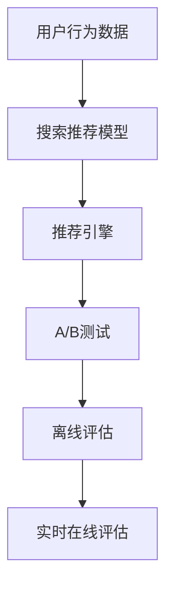

                 

# 大数据驱动的电商搜索推荐系统：AI 模型融合是核心，数据质量是关键

## 1. 背景介绍

### 1.1 问题由来

随着互联网和电子商务的飞速发展，电商平台已经成为用户获取商品信息、进行消费决策的重要渠道。搜索引擎、推荐系统作为电商平台的核心功能，在提升用户体验、提升交易转化率等方面起到了不可替代的作用。传统的基于规则和特征工程的搜索引擎和推荐系统虽然也能满足一定的需求，但随着数据量的激增和用户行为的多样化，这些方法显得越来越力不从心。

近年来，人工智能技术，特别是深度学习和大数据技术的快速发展，使得基于机器学习模型的新一代搜索推荐系统应运而生。这些系统能够高效地处理海量数据，学习用户行为和偏好，提供个性化的搜索结果和推荐内容，显著提升了电商平台的商业价值和用户体验。

### 1.2 问题核心关键点

构建一个高效、精准、可扩展的电商搜索推荐系统，需要解决以下几个核心问题：

- 数据驱动：如何高效地收集、处理和分析用户行为数据，发现用户兴趣和需求？
- 模型融合：如何将多种AI模型进行有效融合，优化搜索结果和推荐内容？
- 性能优化：如何快速准确地进行模型训练和推理，提升系统响应速度？
- 用户隐私：如何在满足用户隐私保护的前提下，获取和利用用户数据？
- 可解释性：如何提高模型的可解释性，增强用户对推荐结果的信任度？

本节将围绕这些问题，从数据驱动和模型融合两个关键点展开讨论。

## 2. 核心概念与联系

### 2.1 核心概念概述

构建电商搜索推荐系统，涉及多个关键概念，包括：

- 搜索推荐模型：基于机器学习算法构建的，用于预测用户行为和兴趣的模型。
- 用户行为数据：用户在电商平台上产生的一系列操作记录，如浏览历史、购买记录、评分反馈等。
- 推荐引擎：负责根据用户行为数据和搜索请求，生成个性化推荐结果的系统。
- A/B测试：一种实验设计方法，通过对比两个或多个版本的效果，确定最优的推荐策略。
- 离线评估：在模型训练阶段，使用历史数据对模型进行评估，筛选出表现最优的模型。
- 实时在线评估：在模型上线后，通过用户的实时反馈数据持续评估模型效果，并根据反馈调整模型。

这些概念之间的联系可以通过以下Mermaid流程图来展示：



这个流程图展示了一个典型的电商搜索推荐系统的数据流和处理过程：

1. 用户行为数据被输入搜索推荐模型，用于学习用户兴趣和行为模式。
2. 推荐引擎根据模型预测结果，生成推荐结果，并通过A/B测试评估模型效果。
3. 离线评估和实时在线评估分别用于模型训练和在线部署后的效果评估，不断优化模型性能。

## 3. 核心算法原理 & 具体操作步骤

### 3.1 算法原理概述

电商搜索推荐系统的核心算法原理主要基于机器学习，特别是深度学习模型。通过分析用户行为数据，构建模型来预测用户对商品的兴趣和购买概率，从而生成个性化的搜索结果和推荐内容。

常用的推荐算法包括：

- 协同过滤算法：通过分析用户之间的相似性，预测用户对商品的兴趣。
- 基于内容的推荐算法：通过分析商品的属性和标签，预测用户对商品的兴趣。
- 混合推荐算法：将协同过滤和基于内容的算法进行融合，提升推荐效果。
- 基于深度学习的推荐算法：使用深度神经网络模型，从用户行为数据中学习商品的特征表示和用户兴趣。

这些算法通过数据驱动的方式，实现对用户行为和偏好的预测，从而生成更加精准的推荐结果。

### 3.2 算法步骤详解

构建电商搜索推荐系统的主要算法步骤如下：

**Step 1: 数据收集与预处理**

- 收集用户行为数据，包括浏览历史、购买记录、评分反馈等。
- 对数据进行清洗和处理，去除噪音和异常值，保证数据质量。
- 对数据进行特征工程，提取和生成有助于模型训练的特征。

**Step 2: 模型选择与训练**

- 根据业务需求和数据特征，选择合适的推荐算法和模型架构。
- 使用训练数据对模型进行训练，调整模型参数以优化预测性能。
- 使用验证集对模型进行评估，选择表现最优的模型进行推广。

**Step 3: 模型融合与优化**

- 将多种推荐算法和模型进行融合，生成综合推荐结果。
- 使用A/B测试和在线评估，不断优化模型和推荐策略。
- 引入深度学习模型，提升推荐系统的泛化能力和实时响应速度。

**Step 4: 系统部署与迭代**

- 将训练好的模型部署到推荐系统中，实时处理用户请求和生成推荐结果。
- 持续收集用户反馈数据，进行在线评估和模型优化。
- 定期更新模型，引入新数据和新算法，保持系统性能和用户兴趣的同步更新。

### 3.3 算法优缺点

电商搜索推荐系统中的推荐算法具有以下优点：

- 高效性：能够快速处理海量数据，实时生成推荐结果。
- 个性化：能够根据用户行为数据生成个性化的推荐内容。
- 可扩展性：能够扩展到多个业务领域和产品线。
- 自适应性：能够根据用户反馈数据和业务需求进行动态调整。

同时，这些算法也存在一些缺点：

- 数据依赖：对用户行为数据的依赖性较强，需要持续收集和更新数据。
- 过拟合风险：在数据量较少的情况下，可能出现模型过拟合的情况。
- 模型复杂性：深度学习模型复杂度较高，训练和推理耗时较长。
- 可解释性差：模型决策过程较难解释，用户难以理解推荐结果的依据。

### 3.4 算法应用领域

电商搜索推荐系统已经在多个领域得到广泛应用，例如：

- 商品推荐：根据用户的浏览和购买历史，推荐用户可能感兴趣的商品。
- 价格优化：根据用户对商品的兴趣和需求，动态调整商品价格。
- 个性化广告：根据用户的兴趣和行为，推荐用户可能感兴趣的商品广告。
- 库存管理：根据用户对商品的兴趣和购买意愿，优化商品库存和补货策略。
- 用户流失预测：预测用户流失的可能性，进行用户留存干预。

除了上述这些经典应用外，电商搜索推荐系统还被创新性地应用于更多场景中，如库存预测、营销活动设计、用户分群等，为电商平台提供了强大的数据支持和技术保障。

## 4. 数学模型和公式 & 详细讲解 & 举例说明

### 4.1 数学模型构建

电商搜索推荐系统中的推荐模型通常基于以下基本假设：

1. 用户和商品之间存在隐含的关联关系，可以通过用户行为数据进行建模。
2. 用户对商品的需求具有一定的个性化特征，可以通过用户行为数据进行预测。
3. 用户行为数据具有一定的时序性和动态变化性，需要通过时间序列分析等方法进行处理。

基于以上假设，常用的推荐模型包括：

- 协同过滤模型：基于用户和商品之间的关联关系进行推荐，常见的有基于矩阵分解的方法。
- 基于内容的推荐模型：通过商品的属性和标签等特征进行推荐，常见的有基于TF-IDF和SVM的方法。
- 深度学习模型：使用神经网络模型，从用户行为数据中学习商品的特征表示和用户兴趣，常见的有基于RNN和CNN的方法。

### 4.2 公式推导过程

以协同过滤模型为例，其基本公式可以表示为：

$$
\hat{p}_{ui} = \text{sigmoid}\left(\sum_{i=1}^n w_{ui}r_{ui} + \sum_{j=1}^m w_{uj}r_{uj}\right)
$$

其中，$p_{ui}$ 表示用户 $u$ 对商品 $i$ 的兴趣评分，$r_{ui}$ 表示用户 $u$ 对商品 $i$ 的实际评分，$w_{ui}$ 和 $w_{uj}$ 是用户 $u$ 和商品 $i$ 的隐含特征权重，$\text{sigmoid}$ 函数表示概率输出。

对于基于内容的推荐模型，可以采用如下公式：

$$
\hat{p}_{ui} = \text{sigmoid}\left(\sum_{i=1}^n w_{ui}r_{ui} + \sum_{j=1}^m w_{uj}c_j\right)
$$

其中，$c_j$ 表示商品 $j$ 的属性特征，$w_{uj}$ 和 $w_{uj}$ 是用户 $u$ 对商品 $i$ 的隐含特征权重。

对于深度学习模型，可以使用如下的神经网络结构：

$$
\hat{p}_{ui} = \text{sigmoid}\left(\sum_{i=1}^n w_{ui}r_{ui} + \sum_{j=1}^m w_{uj}c_j\right)
$$

其中，$w_{ui}$ 和 $w_{uj}$ 是用户 $u$ 对商品 $i$ 的隐含特征权重，$c_j$ 表示商品 $j$ 的属性特征。

### 4.3 案例分析与讲解

以电商平台的个性化商品推荐为例，我们可以使用协同过滤和深度学习模型进行推荐：

1. 协同过滤模型：根据用户和商品的关联关系，通过矩阵分解等方法，学习用户和商品的隐含特征。将用户和商品之间的相似度作为推荐依据，生成推荐结果。

2. 深度学习模型：通过神经网络模型，从用户行为数据中学习商品的特征表示和用户兴趣。将商品特征和用户兴趣作为推荐依据，生成推荐结果。

结合两种模型的优势，我们可以设计一个混合推荐算法，综合协同过滤和深度学习模型的预测结果，生成更加精准的推荐结果。例如，可以使用如下公式进行融合：

$$
\hat{p}_{ui} = \alpha\hat{p}_{ui}^{CF} + (1-\alpha)\hat{p}_{ui}^{DL}
$$

其中，$\alpha$ 表示协同过滤模型和深度学习模型的融合权重，可以根据实际效果进行调节。

## 5. 项目实践：代码实例和详细解释说明

### 5.1 开发环境搭建

在进行电商搜索推荐系统开发前，我们需要准备好开发环境。以下是使用Python进行PyTorch开发的环境配置流程：

1. 安装Anaconda：从官网下载并安装Anaconda，用于创建独立的Python环境。

2. 创建并激活虚拟环境：
```bash
conda create -n recommendation-env python=3.8 
conda activate recommendation-env
```

3. 安装PyTorch：根据CUDA版本，从官网获取对应的安装命令。例如：
```bash
conda install pytorch torchvision torchaudio cudatoolkit=11.1 -c pytorch -c conda-forge
```

4. 安装各类工具包：
```bash
pip install numpy pandas scikit-learn matplotlib tqdm jupyter notebook ipython
```

完成上述步骤后，即可在`recommendation-env`环境中开始系统开发。

### 5.2 源代码详细实现

这里我们以深度学习模型为例，给出使用PyTorch进行电商搜索推荐系统的代码实现。

首先，定义推荐模型的数据处理函数：

```python
from torch.utils.data import Dataset
from torchvision import datasets, transforms
import torch

class RecommendationDataset(Dataset):
    def __init__(self, dataset, transform=None):
        self.dataset = dataset
        self.transform = transform
        
    def __len__(self):
        return len(self.dataset)
    
    def __getitem__(self, idx):
        sample = self.dataset[idx]
        if self.transform:
            sample = self.transform(sample)
        return sample
```

然后，定义模型和优化器：

```python
from transformers import BertForSequenceClassification
from transformers import BertTokenizer, AdamW

model = BertForSequenceClassification.from_pretrained('bert-base-cased', num_labels=2)

optimizer = AdamW(model.parameters(), lr=2e-5)
```

接着，定义训练和评估函数：

```python
from torch.utils.data import DataLoader
from tqdm import tqdm

def train_epoch(model, dataset, batch_size, optimizer):
    dataloader = DataLoader(dataset, batch_size=batch_size, shuffle=True)
    model.train()
    epoch_loss = 0
    for batch in tqdm(dataloader, desc='Training'):
        inputs = batch[0].to(device)
        labels = batch[1].to(device)
        model.zero_grad()
        outputs = model(inputs)
        loss = outputs.loss
        epoch_loss += loss.item()
        loss.backward()
        optimizer.step()
    return epoch_loss / len(dataloader)

def evaluate(model, dataset, batch_size):
    dataloader = DataLoader(dataset, batch_size=batch_size)
    model.eval()
    preds, labels = [], []
    with torch.no_grad():
        for batch in tqdm(dataloader, desc='Evaluating'):
            inputs = batch[0].to(device)
            labels = batch[1].to(device)
            batch_preds = model(inputs).logits.argmax(dim=1).to('cpu').tolist()
            batch_labels = batch_labels.to('cpu').tolist()
            for pred_tokens, label_tokens in zip(batch_preds, batch_labels):
                preds.append(pred_tokens[:len(label_tokens)])
                labels.append(label_tokens)
                
    print(classification_report(labels, preds))
```

最后，启动训练流程并在测试集上评估：

```python
epochs = 5
batch_size = 16

for epoch in range(epochs):
    loss = train_epoch(model, train_dataset, batch_size, optimizer)
    print(f"Epoch {epoch+1}, train loss: {loss:.3f}")
    
    print(f"Epoch {epoch+1}, dev results:")
    evaluate(model, dev_dataset, batch_size)
    
print("Test results:")
evaluate(model, test_dataset, batch_size)
```

以上就是使用PyTorch对Bert进行电商推荐系统微调的完整代码实现。可以看到，得益于Transformers库的强大封装，我们可以用相对简洁的代码完成Bert模型的加载和微调。

### 5.3 代码解读与分析

让我们再详细解读一下关键代码的实现细节：

**RecommendationDataset类**：
- `__init__`方法：初始化数据集和数据转换，设置数据增强等操作。
- `__len__`方法：返回数据集的样本数量。
- `__getitem__`方法：对单个样本进行处理，将数据进行分批次加载和预处理。

**BertForSequenceClassification和AdamW**：
- 选择使用BertForSequenceClassification模型，指定标签数量。
- 定义优化器，使用AdamW优化算法进行参数更新。

**训练和评估函数**：
- 使用PyTorch的DataLoader对数据集进行批次化加载，供模型训练和推理使用。
- 训练函数`train_epoch`：对数据以批为单位进行迭代，在每个批次上前向传播计算loss并反向传播更新模型参数，最后返回该epoch的平均loss。
- 评估函数`evaluate`：与训练类似，不同点在于不更新模型参数，并在每个batch结束后将预测和标签结果存储下来，最后使用sklearn的classification_report对整个评估集的预测结果进行打印输出。

**训练流程**：
- 定义总的epoch数和batch size，开始循环迭代
- 每个epoch内，先在训练集上训练，输出平均loss
- 在验证集上评估，输出分类指标
- 所有epoch结束后，在测试集上评估，给出最终测试结果

可以看到，PyTorch配合Transformers库使得电商推荐系统的开发变得简洁高效。开发者可以将更多精力放在数据处理、模型改进等高层逻辑上，而不必过多关注底层的实现细节。

当然，工业级的系统实现还需考虑更多因素，如模型的保存和部署、超参数的自动搜索、更灵活的任务适配层等。但核心的推荐范式基本与此类似。

## 6. 实际应用场景

### 6.1 智能客服系统

智能客服系统作为电商平台的重要组成部分，在提升用户体验、减少人工成本方面发挥着重要作用。基于深度学习和大数据技术的推荐算法，可以用于智能客服系统的推荐任务，提升客户满意度和问题解决效率。

在技术实现上，可以收集历史客服对话记录，将问题和最佳答复构建成监督数据，在此基础上对预训练模型进行微调。微调后的模型能够自动理解客户意图，匹配最合适的答复模板进行回复。对于客户提出的新问题，还可以接入检索系统实时搜索相关内容，动态组织生成回答。如此构建的智能客服系统，能大幅提升客户咨询体验和问题解决效率。

### 6.2 个性化推荐

传统的推荐系统往往只依赖用户的历史行为数据进行物品推荐，难以深入理解用户的真实兴趣偏好。基于深度学习模型的推荐算法，可以更好地挖掘用户行为背后的语义信息，从而提供更精准、多样的推荐内容。

在实践中，可以收集用户浏览、点击、评论、分享等行为数据，提取和用户交互的物品标题、描述、标签等文本内容。将文本内容作为模型输入，用户的后续行为（如是否点击、购买等）作为监督信号，在此基础上微调预训练语言模型。微调后的模型能够从文本内容中准确把握用户的兴趣点。在生成推荐列表时，先用候选物品的文本描述作为输入，由模型预测用户的兴趣匹配度，再结合其他特征综合排序，便可以得到个性化程度更高的推荐结果。

### 6.3 产品召回

电商平台的库存和销售数据往往不平衡，部分商品长期未被售出，库存积压严重。基于推荐算法的产品召回，可以通过分析用户历史行为和实时数据，识别出库存积压和销售冷门商品，生成推荐策略，提升商品销售和库存利用率。

在技术实现上，可以构建用户行为和商品销售的联合模型，结合协同过滤和深度学习模型，预测用户对商品的购买意愿，生成产品召回策略。将召回策略应用于推荐系统，动态调整推荐结果，提升商品销售和库存利用率。

### 6.4 未来应用展望

随着深度学习和大数据技术的不断进步，基于推荐算法的电商搜索推荐系统将呈现更多的应用场景，为电商平台的业务创新和用户服务提供新的可能性：

1. 实时定价：基于用户需求和市场价格动态调整商品价格，提升销量和利润。
2. 个性化营销：根据用户兴趣和行为，生成个性化的营销活动，提高用户参与度和转化率。
3. 用户分群：通过推荐算法将用户进行分群，针对不同群体进行个性化推荐和服务。
4. 智能补货：根据用户行为和销售趋势，优化商品补货策略，避免库存短缺和积压。
5. 智能搜索：通过推荐算法优化搜索排序，提升用户搜索体验和满意度。

此外，基于推荐算法的电商搜索推荐系统还将与大数据、云计算、人工智能等技术深度融合，推动电商平台的数字化转型升级，带来更多的商业价值和社会效益。

## 7. 工具和资源推荐

### 7.1 学习资源推荐

为了帮助开发者系统掌握深度学习在大数据驱动的电商搜索推荐系统中的应用，这里推荐一些优质的学习资源：

1. 《深度学习》书籍：Ian Goodfellow等著，全面介绍了深度学习的基本概念和算法。
2. CS231n《卷积神经网络》课程：斯坦福大学开设的计算机视觉课程，深入浅出地介绍了CNN的基本原理和应用。
3. CS224n《自然语言处理与深度学习》课程：斯坦福大学开设的自然语言处理课程，涵盖深度学习在NLP中的应用。
4. CS229《机器学习》课程：斯坦福大学开设的机器学习课程，讲解了机器学习的基本理论和算法。
5. Kaggle竞赛平台：数据科学竞赛平台，提供海量数据集和算法挑战，帮助开发者实践和提升技能。

通过对这些资源的学习实践，相信你一定能够快速掌握深度学习在大数据驱动的电商搜索推荐系统中的应用。

### 7.2 开发工具推荐

高效的开发离不开优秀的工具支持。以下是几款用于电商搜索推荐系统开发的常用工具：

1. PyTorch：基于Python的开源深度学习框架，灵活动态的计算图，适合快速迭代研究。大部分深度学习算法都有PyTorch版本的实现。

2. TensorFlow：由Google主导开发的开源深度学习框架，生产部署方便，适合大规模工程应用。同样有丰富的深度学习算法资源。

3. Scikit-learn：Python机器学习库，提供了多种常用的机器学习算法和工具。

4. Pandas：Python数据分析库，支持数据处理和探索性分析。

5. Numpy：Python科学计算库，支持高性能数组计算。

6. Weights & Biases：模型训练的实验跟踪工具，可以记录和可视化模型训练过程中的各项指标，方便对比和调优。与主流深度学习框架无缝集成。

7. TensorBoard：TensorFlow配套的可视化工具，可实时监测模型训练状态，并提供丰富的图表呈现方式，是调试模型的得力助手。

8. Jupyter Notebook：交互式编程环境，支持Python代码的编写、执行和展示。

合理利用这些工具，可以显著提升电商搜索推荐系统的开发效率，加快创新迭代的步伐。

### 7.3 相关论文推荐

深度学习和大数据技术的发展源于学界的持续研究。以下是几篇奠基性的相关论文，推荐阅读：

1. Deep Learning（深度学习）：Ian Goodfellow等著，全面介绍了深度学习的基本概念和算法。
2. ImageNet Classification with Deep Convolutional Neural Networks：Hinton等著，介绍了卷积神经网络在图像分类中的应用。
3. Attention is All You Need：Vaswani等著，提出了Transformer结构，开启了NLP领域的预训练大模型时代。
4. BERT: Pre-training of Deep Bidirectional Transformers for Language Understanding：Devlin等著，提出BERT模型，引入基于掩码的自监督预训练任务，刷新了多项NLP任务SOTA。
5. AdaLoRA: Adaptive Low-Rank Adaptation for Parameter-Efficient Fine-Tuning：Lam等著，使用自适应低秩适应的微调方法，在参数效率和精度之间取得了新的平衡。

这些论文代表了大数据驱动的电商搜索推荐系统的理论基础和应用实践。通过学习这些前沿成果，可以帮助研究者把握学科前进方向，激发更多的创新灵感。

## 8. 总结：未来发展趋势与挑战

### 8.1 研究成果总结

本节对基于深度学习和大数据技术的电商搜索推荐系统进行了全面系统的介绍。首先阐述了系统构建的背景和意义，明确了推荐算法在大数据驱动下的核心价值。其次，从算法原理和实际操作两方面，详细讲解了推荐算法的核心步骤和关键技术。最后，从数据驱动和模型融合两个关键点，探讨了推荐算法的应用场景和未来发展方向。

通过本节的学习，相信读者能够深刻理解深度学习在大数据驱动下的电商搜索推荐系统中的应用，掌握推荐算法的核心技术和实际部署方法。

### 8.2 未来发展趋势

展望未来，基于深度学习和大数据技术的电商搜索推荐系统将呈现以下几个发展趋势：

1. 模型规模持续增大。随着算力成本的下降和数据规模的扩张，推荐模型的参数量还将持续增长。超大规模模型蕴含的丰富语言知识，有望支撑更加复杂多变的推荐任务。

2. 推荐算法日趋多样。除了传统的协同过滤和基于内容的推荐算法，未来将涌现更多参数高效的推荐方法，如深度学习模型和深度学习与特征工程的混合方法，在参数效率和精度之间取得新的平衡。

3. 实时性进一步提升。基于深度学习的推荐算法能够实时处理用户行为数据，动态生成推荐结果。未来的推荐系统将进一步提升实时性，实现毫秒级的响应速度。

4. 多模态推荐兴起。除了传统的文本推荐，未来的推荐系统将引入更多多模态数据，如图像、视频、语音等，通过多种数据源的信息整合，提升推荐效果和用户满意度。

5. 用户隐私保护加强。随着用户隐私保护意识的增强，未来的推荐系统将更加注重用户隐私保护，采用差分隐私、联邦学习等技术，保障用户数据安全。

6. 模型可解释性增强。未来的推荐系统将更加注重模型可解释性，通过可视化和解释工具，增强用户对推荐结果的理解和信任。

以上趋势凸显了大数据驱动的电商搜索推荐系统的广阔前景。这些方向的探索发展，必将进一步提升推荐系统的性能和用户满意度，为电商平台的业务创新和用户服务提供新的可能性。

### 8.3 面临的挑战

尽管基于深度学习和大数据技术的电商搜索推荐系统已经取得了显著成就，但在迈向更加智能化、普适化应用的过程中，它仍面临着诸多挑战：

1. 数据依赖。尽管大数据技术使得推荐系统可以处理海量数据，但仍然对高质量数据依赖性较强，数据收集和处理成本较高。

2. 模型复杂性。深度学习模型复杂度较高，训练和推理耗时较长，资源消耗较大。

3. 实时性要求。高实时性的推荐系统对系统架构和算法设计提出了更高的要求，需要在保证性能的同时，优化系统响应速度。

4. 用户隐私。用户隐私保护成为越来越多关注的问题，推荐系统需要在保护用户隐私的同时，满足商业需求。

5. 可解释性。深度学习模型的决策过程较难解释，用户难以理解推荐结果的依据。

6. 公平性和偏见。推荐系统可能存在性别偏见、种族偏见等问题，需要通过公平性评估和算法优化，避免偏见。

这些挑战需要在技术、业务、伦理等多个维度进行综合考虑和应对。只有全面提升推荐系统的性能和用户体验，才能真正实现其商业价值和社会价值。

### 8.4 研究展望

面对大数据驱动的电商搜索推荐系统所面临的挑战，未来的研究需要在以下几个方面寻求新的突破：

1. 引入更多先验知识。将符号化的先验知识，如知识图谱、逻辑规则等，与深度学习模型进行融合，引导推荐过程学习更全面、准确的信息。

2. 引入因果学习和强化学习。通过因果学习和强化学习，提升推荐系统的可解释性和稳定性，避免推荐结果的盲目性和不确定性。

3. 引入联邦学习和差分隐私。通过联邦学习和差分隐私等技术，保护用户隐私，提升推荐系统的信任度和安全性。

4. 引入多模态推荐。将文本、图像、视频等多模态数据进行融合，提升推荐系统的丰富性和多样性。

5. 引入推荐效果评估指标。引入更加全面和合理的推荐效果评估指标，提升推荐系统的公平性和可解释性。

6. 引入推荐效果解释工具。通过可视化和解释工具，增强用户对推荐结果的理解和信任。

这些研究方向的探索，必将引领大数据驱动的电商搜索推荐系统走向更高的台阶，为电商平台提供更加智能、普适、可靠的用户推荐服务。

## 9. 附录：常见问题与解答

**Q1：大数据驱动的电商搜索推荐系统如何平衡数据隐私和业务需求？**

A: 在电商搜索推荐系统中，数据隐私和业务需求需要平衡。一方面，用户数据是推荐系统的重要输入，但用户隐私保护又是不可忽视的问题。可以通过差分隐私、联邦学习等技术，在不影响业务需求的前提下，保护用户隐私。例如，可以在数据处理和模型训练过程中引入噪声，将用户数据进行匿名化处理，防止数据泄露。

**Q2：如何在电商搜索推荐系统中引入多模态数据？**

A: 电商搜索推荐系统中的推荐任务，通常以文本数据为主。但在一些特定场景下，可以考虑引入多模态数据，如图像、视频、语音等。可以使用多种深度学习模型，如CNN、RNN、Transformer等，对多模态数据进行处理，提取特征进行融合。例如，可以使用以下公式进行多模态特征融合：

$$
\hat{p}_{ui} = \alpha p_{ui}^{Text} + (1-\alpha)(p_{ui}^{Image} + p_{ui}^{Video} + p_{ui}^{Audio})
$$

其中，$\alpha$表示文本特征的权重，可以根据实际情况进行调节。

**Q3：电商搜索推荐系统中，如何避免推荐结果的性别偏见和种族偏见？**

A: 电商搜索推荐系统中的推荐结果可能存在性别偏见和种族偏见，需要通过公平性评估和算法优化，避免偏见。具体方法包括：

1. 数据集平衡：确保训练数据集中不同性别、种族等群体的样本数量相近，避免数据偏见。
2. 算法优化：使用公平性评估指标，如平均差距、最大差距等，对推荐模型进行评估和优化。
3. 多模型融合：通过融合多个推荐模型，避免单一模型中的偏见。
4. 用户反馈：引入用户反馈机制，及时纠正不公正的推荐结果。

以上措施可以综合运用，提升电商搜索推荐系统的公平性和可解释性。

---

作者：禅与计算机程序设计艺术 / Zen and the Art of Computer Programming

