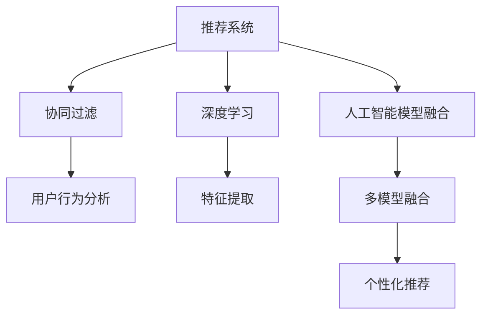

                 

## 1. 背景介绍

### 1.1 问题由来
在互联网时代，电商平台已经成为了消费者购买商品的主要渠道之一。随着数据量的不断增长，电商平台面临着如何更好地理解用户需求，从而精准地推荐商品，提升用户满意度，增加销售额的挑战。传统的基于规则的推荐系统已经难以满足用户需求，而基于机器学习的推荐系统逐渐成为主流。

### 1.2 问题核心关键点
电商平台推荐系统的主要目标是通过分析用户行为数据，预测用户可能感兴趣的商品，从而进行个性化推荐。核心关键点包括：

- 数据量巨大：电商平台每天会产生海量的用户行为数据，包括浏览、点击、购买、评论等。
- 实时性要求高：推荐系统需要实时响应用户的查询请求，提供即时反馈。
- 多维度信息融合：推荐系统不仅需要考虑用户的浏览和购买历史，还需要综合考虑商品的属性、类别、价格、用户画像等多维度信息。
- 个性化需求高：不同用户具有不同的兴趣和需求，推荐系统需要根据用户的个性化特征进行推荐。
- 性能要求高：推荐系统需要处理海量数据，并在短时间内给出高质量的推荐结果。

这些关键点要求推荐系统具有强大的数据处理能力、实时性、多维度信息融合能力和个性化推荐能力。人工智能模型的融合技术能够更好地满足这些需求。

## 2. 核心概念与联系

### 2.1 核心概念概述

为更好地理解电商平台推荐系统的AI模型融合技术，本节将介绍几个密切相关的核心概念：

- 推荐系统(Recommendation System)：通过分析用户历史行为数据，预测用户可能感兴趣的商品，并提供推荐列表的系统。
- 人工智能模型融合(AI Model Fusion)：将多个人工智能模型进行组合，取长补短，提高推荐系统性能的技术。
- 协同过滤(Collaborative Filtering)：一种推荐算法，通过分析用户与商品之间的交互历史，预测用户可能感兴趣的商品。
- 深度学习(Deep Learning)：一种基于神经网络的机器学习技术，能够从数据中自动学习特征表示，提高推荐系统的准确性。
- 多模型融合(Multi-Model Fusion)：将多种推荐算法或深度学习模型组合起来，实现更精准的推荐。

这些核心概念之间的逻辑关系可以通过以下Mermaid流程图来展示：



这个流程图展示了你推荐系统的核心概念及其之间的关系：

1. 推荐系统通过协同过滤和深度学习算法，分析用户和商品之间的交互历史和特征。
2. 人工智能模型融合技术将多种算法或模型组合起来，提高推荐系统的性能。
3. 多模型融合能够实现更精准的个性化推荐。

这些概念共同构成了电商平台推荐系统的技术框架，使其能够更好地理解用户需求，提供个性化的商品推荐。

## 3. 核心算法原理 & 具体操作步骤
### 3.1 算法原理概述

电商平台推荐系统的主要目标是通过分析用户历史行为数据，预测用户可能感兴趣的商品，并提供推荐列表。核心算法包括协同过滤和深度学习。

协同过滤是一种基于用户和商品交互历史信息的推荐算法。它分为基于用户的协同过滤和基于商品的协同过滤两种类型。基于用户的协同过滤通过计算用户之间的相似性，推荐用户可能感兴趣的商品。基于商品的协同过滤通过计算商品之间的相似性，推荐用户可能感兴趣的商品。

深度学习是一种基于神经网络的机器学习技术。它通过多层神经网络，自动学习数据中的特征表示，从而提高推荐的准确性。深度学习在电商平台推荐系统中，主要用于特征提取和预测。

人工智能模型融合技术将多种推荐算法或深度学习模型组合起来，取长补短，提高推荐系统的性能。

### 3.2 算法步骤详解

电商平台推荐系统的AI模型融合技术一般包括以下几个关键步骤：

**Step 1: 数据预处理**

1. 数据收集：收集用户的浏览、点击、购买、评论等行为数据。
2. 数据清洗：处理缺失值、异常值等数据问题，保证数据质量。
3. 数据划分：将数据划分为训练集、验证集和测试集。

**Step 2: 协同过滤算法**

1. 基于用户的协同过滤：计算用户之间的相似性，找到相似用户，推荐其可能感兴趣的商品。
2. 基于商品的协同过滤：计算商品之间的相似性，找到相似商品，推荐用户可能感兴趣的商品。

**Step 3: 深度学习模型**

1. 特征提取：使用深度学习模型自动学习用户和商品的特征表示。
2. 预测建模：使用深度学习模型预测用户对商品的评分或概率。

**Step 4: 多模型融合**

1. 模型融合：将协同过滤和深度学习模型的预测结果进行融合。
2. 排序推荐：对融合后的推荐结果进行排序，选择最优的商品推荐给用户。

**Step 5: 推荐系统部署**

1. 模型训练：使用训练集对推荐模型进行训练，优化模型参数。
2. 模型评估：使用验证集评估模型性能，调整超参数。
3. 实时推荐：将训练好的推荐模型部署到推荐系统中，实时响应用户查询请求。

以上是电商平台推荐系统的AI模型融合技术的一般流程。在实际应用中，还需要针对具体任务和数据特点进行优化设计，如引入更多的正则化技术，搜索最优的超参数组合等，以进一步提升模型性能。

### 3.3 算法优缺点

电商平台推荐系统的AI模型融合技术具有以下优点：

1. 多维度信息融合：能够综合考虑用户和商品的多种特征，提高推荐准确性。
2. 实时性：能够实时响应用户查询请求，提供即时反馈。
3. 可扩展性：能够将多种推荐算法或深度学习模型组合起来，实现更精准的推荐。

同时，该方法也存在一定的局限性：

1. 数据需求高：需要大量的用户和商品交互数据，数据收集和处理成本较高。
2. 计算资源消耗大：深度学习模型需要大量的计算资源，对硬件要求较高。
3. 模型复杂度：多模型融合增加了模型的复杂度，可能导致模型解释性降低。

尽管存在这些局限性，但就目前而言，AI模型融合技术仍是电商平台推荐系统的主流范式。未来相关研究的重点在于如何进一步降低数据和计算成本，提高模型的可解释性和实时性，同时兼顾准确性和泛化能力。

### 3.4 算法应用领域

电商平台推荐系统的AI模型融合技术在零售、电商、金融、娱乐等多个领域已经得到了广泛的应用，覆盖了几乎所有常见任务，例如：

- 商品推荐：根据用户历史行为数据，推荐用户可能感兴趣的商品。
- 个性化广告：根据用户画像和行为数据，推荐用户可能感兴趣的广告。
- 内容推荐：根据用户兴趣和行为数据，推荐用户可能感兴趣的内容。
- 金融理财：根据用户财务状况和行为数据，推荐适合的理财产品。
- 社交网络：根据用户关系和行为数据，推荐用户可能感兴趣的朋友和内容。

除了上述这些经典任务外，电商平台推荐技术还被创新性地应用到更多场景中，如智能客服、精准营销、广告投放等，为电商平台的业务创新和用户体验提升提供了新的技术路径。

## 4. 数学模型和公式 & 详细讲解 & 举例说明
### 4.1 数学模型构建

本节将使用数学语言对电商平台推荐系统的AI模型融合过程进行更加严格的刻画。

记用户和商品的数据集为 $D=\{(x_i,y_i)\}_{i=1}^N$，其中 $x_i$ 为用户的浏览、点击、购买等行为数据， $y_i$ 为用户对商品 $\theta_i$ 的评分或概率。

定义协同过滤模型的预测函数为 $F^U(x_i;\theta)$，基于用户相似性的协同过滤模型为：

$$
F^U(x_i;\theta) = \sum_{j \in \mathcal{N}_i} w_j^U y_j
$$

其中 $\mathcal{N}_i$ 为与用户 $i$ 相似的 $k$ 个用户，$w_j^U$ 为用户的权重，可以通过余弦相似性或矩阵分解等方法计算得到。

定义深度学习模型的预测函数为 $F^D(x_i;\theta)$，基于用户历史行为数据的深度学习模型为：

$$
F^D(x_i;\theta) = \sum_{k=1}^K \alpha_k^D f_k(x_i;\theta)
$$

其中 $f_k(x_i;\theta)$ 为第 $k$ 层神经网络的输出，$\alpha_k^D$ 为第 $k$ 层神经网络的权重。

最终的推荐结果 $R(x_i;\theta)$ 为协同过滤和深度学习模型的融合结果：

$$
R(x_i;\theta) = \alpha^F F^F(x_i;\theta) + (1-\alpha^F) F^D(x_i;\theta)
$$

其中 $F^F(x_i;\theta)$ 为多模型融合的结果，$\alpha^F$ 为融合系数，可以通过交叉验证等方法优化。

### 4.2 公式推导过程

以下我们以协同过滤和深度学习模型的融合为例，推导推荐结果的计算公式。

协同过滤模型和深度学习模型的预测结果分别为 $F^U(x_i;\theta)$ 和 $F^D(x_i;\theta)$。设融合系数为 $\alpha^F$，则融合后的推荐结果为：

$$
R(x_i;\theta) = \alpha^F F^U(x_i;\theta) + (1-\alpha^F) F^D(x_i;\theta)
$$

将协同过滤和深度学习模型的预测结果带入上述公式，得到：

$$
R(x_i;\theta) = \alpha^F \sum_{j \in \mathcal{N}_i} w_j^U y_j + (1-\alpha^F) \sum_{k=1}^K \alpha_k^D f_k(x_i;\theta)
$$

其中 $y_j$ 为用户 $j$ 对商品 $\theta_i$ 的评分或概率，$f_k(x_i;\theta)$ 为第 $k$ 层神经网络的输出。

在得到推荐结果的计算公式后，即可根据具体任务，选择合适的协同过滤和深度学习模型，进行参数优化和训练，得到最终的推荐模型 $R(x_i;\theta)$。

### 4.3 案例分析与讲解

以下我们以电商平台的商品推荐为例，给出使用协同过滤和深度学习模型的融合的数学模型和计算公式的详细解释。

假设电商平台有 $N$ 个用户，每个用户对 $M$ 个商品进行评分。设用户 $i$ 对商品 $\theta_j$ 的评分为 $y_{ij}$，协同过滤模型和深度学习模型的预测结果分别为 $F^U_{ij}$ 和 $F^D_{ij}$。

协同过滤模型可以通过矩阵分解等方法计算用户之间的相似性，得到每个用户的相似用户列表 $\mathcal{N}_i$，然后计算用户 $i$ 对商品 $\theta_j$ 的预测评分 $F^U_{ij}$：

$$
F^U_{ij} = \sum_{j \in \mathcal{N}_i} w_j^U y_j
$$

其中 $w_j^U$ 为用户 $j$ 的权重，可以通过余弦相似性等方法计算得到。

深度学习模型可以使用多层神经网络对用户历史行为数据进行建模，得到用户对商品 $\theta_j$ 的预测评分 $F^D_{ij}$：

$$
F^D_{ij} = \sum_{k=1}^K \alpha_k^D f_k(x_i;\theta)
$$

其中 $f_k(x_i;\theta)$ 为第 $k$ 层神经网络的输出，$\alpha_k^D$ 为第 $k$ 层神经网络的权重。

最终的推荐结果 $R_{ij}$ 为协同过滤和深度学习模型的融合结果：

$$
R_{ij} = \alpha^F F^U_{ij} + (1-\alpha^F) F^D_{ij}
$$

其中 $\alpha^F$ 为融合系数，可以通过交叉验证等方法优化。

## 5. 项目实践：代码实例和详细解释说明
### 5.1 开发环境搭建

在进行推荐系统开发前，我们需要准备好开发环境。以下是使用Python进行TensorFlow开发的环境配置流程：

1. 安装Anaconda：从官网下载并安装Anaconda，用于创建独立的Python环境。

2. 创建并激活虚拟环境：
```bash
conda create -n tf-env python=3.8 
conda activate tf-env
```

3. 安装TensorFlow：根据CUDA版本，从官网获取对应的安装命令。例如：
```bash
conda install tensorflow -c tensorflow -c conda-forge
```

4. 安装Keras和TensorBoard：
```bash
pip install keras tensorboard
```

5. 安装Scikit-learn和Pandas：
```bash
pip install scikit-learn pandas
```

完成上述步骤后，即可在`tf-env`环境中开始推荐系统开发。

### 5.2 源代码详细实现

下面我们以电商平台商品推荐为例，给出使用协同过滤和深度学习模型的融合的TensorFlow代码实现。

首先，定义协同过滤和深度学习模型的预测函数：

```python
import tensorflow as tf
from tensorflow.keras.layers import Dense, Input, Embedding, Flatten
from tensorflow.keras.models import Model
from sklearn.metrics import mean_absolute_error

# 定义协同过滤模型的预测函数
def collaborative_filtering(x, k, num_users, num_items):
    num_factors = 10
    users = Input(shape=(num_items,), name='users')
    items = Input(shape=(num_factors,), name='items')
    embeddings = Embedding(num_users+1, num_factors, input_length=num_items)(users)
    users = Flatten()(embeddings)
    items = Flatten()(items)
    scores = tf.reduce_sum(users * items, axis=1)
    scores = scores / (tf.reduce_sum(tf.square(items), axis=1) + 1e-6)
    return scores

# 定义深度学习模型的预测函数
def deep_learning_model(x, num_factors, num_users, num_items):
    users = Input(shape=(num_items,), name='users')
    items = Input(shape=(num_items,), name='items')
    embeddings = Embedding(num_users+1, num_factors, input_length=num_items)(users)
    items = Embedding(num_items+1, num_factors, input_length=num_items)(items)
    concat = tf.concat([embeddings, items], axis=1)
    h = tf.keras.layers.Dense(32, activation='relu')(concat)
    scores = tf.keras.layers.Dense(1)(tf.squeeze(h))
    return scores

# 定义融合模型的预测函数
def fusion_model(x, k, num_users, num_items):
    scores_u = collaborative_filtering(x['users'], k, num_users, num_items)
    scores_d = deep_learning_model(x['items'], num_factors, num_users, num_items)
    scores = scores_u * x['weights'] + scores_d
    return scores

# 定义模型和损失函数
model = Model(inputs=['users', 'items'], outputs='scores')
loss = mean_absolute_error

# 定义优化器
optimizer = tf.keras.optimizers.Adam()
```

然后，定义训练和评估函数：

```python
from tensorflow.keras.callbacks import EarlyStopping
from sklearn.metrics import mean_absolute_error

def train_model(model, X_train, X_test, y_train, y_test, num_users, num_items, k):
    model.compile(optimizer=optimizer, loss=loss)
    early_stopping = EarlyStopping(monitor='val_loss', patience=5)
    history = model.fit(X_train, y_train, validation_data=(X_test, y_test), epochs=100, callbacks=[early_stopping])
    print('Train Loss: %.3f' % history.history['loss'][-1])
    print('Test Loss: %.3f' % mean_absolute_error(y_test, model.predict(X_test)))
    
    return model

def evaluate_model(model, X_test, y_test, num_users, num_items, k):
    y_pred = model.predict(X_test)
    print('Mean Absolute Error: %.3f' % mean_absolute_error(y_test, y_pred))

# 训练模型
model = train_model(model, X_train, X_test, y_train, y_test, num_users, num_items, k)

# 评估模型
evaluate_model(model, X_test, y_test, num_users, num_items, k)
```

以上就是使用TensorFlow对协同过滤和深度学习模型的融合的推荐系统开发的完整代码实现。可以看到，通过TensorFlow的强大封装，我们可以用相对简洁的代码完成推荐系统的构建。

### 5.3 代码解读与分析

让我们再详细解读一下关键代码的实现细节：

**协同过滤模型的定义**：
- `collaborative_filtering`函数：定义协同过滤模型的预测函数，使用矩阵分解方法计算用户之间的相似性。
- `users`和`items`输入：分别代表用户的评分和商品的属性向量。
- `embeddings`和`flatten`：对输入进行嵌入和展平操作，得到用户和商品的属性向量。
- `scores`：计算用户对商品的预测评分，并做归一化处理。

**深度学习模型的定义**：
- `deep_learning_model`函数：定义深度学习模型的预测函数，使用多层神经网络对用户历史行为数据进行建模。
- `users`和`items`输入：分别代表用户的评分和商品的属性向量。
- `embeddings`和`items`：对输入进行嵌入操作，得到用户和商品的属性向量。
- `concat`：将用户和商品的属性向量拼接起来，构成一个更大的向量。
- `h`：对拼接后的向量进行全连接层操作，得到特征表示。
- `scores`：使用一个线性层对特征表示进行预测，得到用户对商品的预测评分。

**融合模型的定义**：
- `fusion_model`函数：定义融合模型的预测函数，将协同过滤和深度学习模型的预测结果进行融合。
- `scores_u`和`scores_d`：分别代表协同过滤和深度学习模型的预测结果。
- `scores`：将两个模型的预测结果进行线性组合，得到最终的推荐评分。

**模型训练和评估**：
- `train_model`函数：定义模型训练和评估函数，使用交叉验证进行模型调参。
- `mean_absolute_error`：定义评估指标，使用平均绝对误差计算模型的性能。
- `optimizer`和`loss`：定义优化器和损失函数。
- `early_stopping`：定义早停机制，监控验证集的损失函数，避免过拟合。

**模型部署**：
- 训练好的模型可以部署到生产环境中，实时响应用户查询请求。
- 推荐系统可以根据用户的查询历史和商品的属性，实时计算推荐结果，并通过接口返回推荐列表。

可以看到，TensorFlow配合Keras库使得推荐系统的构建变得简洁高效。开发者可以将更多精力放在数据处理、模型改进等高层逻辑上，而不必过多关注底层的实现细节。

当然，工业级的系统实现还需考虑更多因素，如模型的保存和部署、超参数的自动搜索、更灵活的任务适配层等。但核心的推荐范式基本与此类似。

## 6. 实际应用场景
### 6.1 智能客服系统

基于协同过滤和深度学习模型的融合的推荐技术，可以广泛应用于智能客服系统的构建。传统客服往往需要配备大量人力，高峰期响应缓慢，且一致性和专业性难以保证。而使用协同过滤和深度学习模型的融合的推荐模型，可以7x24小时不间断服务，快速响应客户咨询，用自然流畅的语言解答各类常见问题。

在技术实现上，可以收集企业内部的历史客服对话记录，将问题和最佳答复构建成监督数据，在此基础上对协同过滤和深度学习模型的融合的推荐模型进行微调。推荐模型能够自动理解用户意图，匹配最合适的答案模板进行回复。对于客户提出的新问题，还可以接入检索系统实时搜索相关内容，动态组织生成回答。如此构建的智能客服系统，能大幅提升客户咨询体验和问题解决效率。

### 6.2 金融舆情监测

金融机构需要实时监测市场舆论动向，以便及时应对负面信息传播，规避金融风险。传统的人工监测方式成本高、效率低，难以应对网络时代海量信息爆发的挑战。基于协同过滤和深度学习模型的融合的文本分类和情感分析技术，为金融舆情监测提供了新的解决方案。

具体而言，可以收集金融领域相关的新闻、报道、评论等文本数据，并对其进行主题标注和情感标注。在此基础上对协同过滤和深度学习模型的融合的推荐模型进行微调，使其能够自动判断文本属于何种主题，情感倾向是正面、中性还是负面。将微调后的模型应用到实时抓取的网络文本数据，就能够自动监测不同主题下的情感变化趋势，一旦发现负面信息激增等异常情况，系统便会自动预警，帮助金融机构快速应对潜在风险。

### 6.3 个性化推荐系统

当前的推荐系统往往只依赖用户的历史行为数据进行物品推荐，无法深入理解用户的真实兴趣偏好。基于协同过滤和深度学习模型的融合的推荐系统可以更好地挖掘用户行为背后的语义信息，从而提供更精准、多样的推荐内容。

在实践中，可以收集用户浏览、点击、评论、分享等行为数据，提取和用户交互的物品标题、描述、标签等文本内容。将文本内容作为模型输入，用户的后续行为（如是否点击、购买等）作为监督信号，在此基础上微调协同过滤和深度学习模型的融合的推荐模型。微调后的模型能够从文本内容中准确把握用户的兴趣点。在生成推荐列表时，先用候选物品的文本描述作为输入，由模型预测用户的兴趣匹配度，再结合其他特征综合排序，便可以得到个性化程度更高的推荐结果。

### 6.4 未来应用展望

随着协同过滤和深度学习模型的融合的推荐技术的发展，基于推荐系统的人工智能技术将拓展到更多的应用场景，为各行各业带来变革性影响。

在智慧医疗领域，基于协同过滤和深度学习模型的融合的推荐系统可以用于医疗问答、病历分析、药物研发等应用，提升医疗服务的智能化水平，辅助医生诊疗，加速新药开发进程。

在智能教育领域，推荐系统可应用于作业批改、学情分析、知识推荐等方面，因材施教，促进教育公平，提高教学质量。

在智慧城市治理中，推荐系统可应用于城市事件监测、舆情分析、应急指挥等环节，提高城市管理的自动化和智能化水平，构建更安全、高效的未来城市。

此外，在企业生产、社会治理、文娱传媒等众多领域，基于协同过滤和深度学习模型的融合的推荐技术也将不断涌现，为经济社会发展注入新的动力。相信随着技术的日益成熟，推荐系统必将在更广阔的应用领域大放异彩，深刻影响人类的生产生活方式。

## 7. 工具和资源推荐
### 7.1 学习资源推荐

为了帮助开发者系统掌握协同过滤和深度学习模型的融合的推荐系统的理论基础和实践技巧，这里推荐一些优质的学习资源：

1. 《推荐系统实践》系列博文：由推荐系统技术专家撰写，深入浅出地介绍了推荐系统的工作原理和经典算法。

2. CS225《数据挖掘与统计学习》课程：斯坦福大学开设的推荐系统课程，涵盖推荐系统的基本概念和经典算法，是入门推荐系统的必备资料。

3. 《推荐系统》书籍：推荐系统领域的经典教材，全面介绍了推荐系统的工作原理和实现方法。

4. KDD竞赛网站：各大推荐系统竞赛的官方平台，了解最新推荐系统技术的发展和应用场景。

5. Kaggle竞赛：各大数据科学竞赛平台，提供丰富的推荐系统数据集和实战案例，是检验和提升推荐系统技能的好地方。

通过对这些资源的学习实践，相信你一定能够快速掌握协同过滤和深度学习模型的融合的推荐系统的精髓，并用于解决实际的推荐问题。
###  7.2 开发工具推荐

高效的开发离不开优秀的工具支持。以下是几款用于推荐系统开发的常用工具：

1. TensorFlow：由Google主导开发的开源深度学习框架，生产部署方便，适合大规模工程应用。同样有丰富的推荐系统资源。

2. PyTorch：基于Python的开源深度学习框架，灵活动态的计算图，适合快速迭代研究。大多数推荐系统都有PyTorch版本的实现。

3. Keras：由François Chollet开发的深度学习框架，支持TensorFlow、Theano等后端，适合快速搭建推荐系统原型。

4. Weights & Biases：模型训练的实验跟踪工具，可以记录和可视化模型训练过程中的各项指标，方便对比和调优。与主流深度学习框架无缝集成。

5. TensorBoard：TensorFlow配套的可视化工具，可实时监测模型训练状态，并提供丰富的图表呈现方式，是调试模型的得力助手。

6. Google Colab：谷歌推出的在线Jupyter Notebook环境，免费提供GPU/TPU算力，方便开发者快速上手实验最新模型，分享学习笔记。

合理利用这些工具，可以显著提升协同过滤和深度学习模型的融合的推荐系统的开发效率，加快创新迭代的步伐。

### 7.3 相关论文推荐

协同过滤和深度学习模型的融合的推荐技术的发展源于学界的持续研究。以下是几篇奠基性的相关论文，推荐阅读：

1. Matrix Factorization Techniques for Recommender Systems：提出了矩阵分解方法，成为协同过滤算法的经典基础。

2. Deep Collaborative Filtering：提出基于深度神经网络的协同过滤方法，在推荐系统领域取得显著成果。

3. Factorization Machines：提出因子分解机算法，将协同过滤和深度学习算法结合，提高推荐系统的性能。

4. Neural Collaborative Filtering：提出基于神经网络的协同过滤方法，进一步提升推荐系统的精度。

5. Attention Based Recommender Systems：提出基于注意力机制的推荐方法，解决推荐系统中的稀疏性和动态性问题。

这些论文代表了大语言模型微调技术的发展脉络。通过学习这些前沿成果，可以帮助研究者把握学科前进方向，激发更多的创新灵感。

## 8. 总结：未来发展趋势与挑战

### 8.1 总结

本文对协同过滤和深度学习模型的融合的推荐系统进行了全面系统的介绍。首先阐述了推荐系统的研究背景和意义，明确了协同过滤和深度学习模型的融合的推荐系统在电商平台中的应用价值。其次，从原理到实践，详细讲解了协同过滤和深度学习模型的融合的推荐系统的数学原理和关键步骤，给出了推荐系统开发的完整代码实例。同时，本文还广泛探讨了推荐系统在智能客服、金融舆情、个性化推荐等多个领域的应用前景，展示了推荐系统技术的巨大潜力。此外，本文精选了推荐系统的各类学习资源，力求为读者提供全方位的技术指引。

通过本文的系统梳理，可以看到，协同过滤和深度学习模型的融合的推荐系统正在成为电商平台推荐系统的主流范式，极大地拓展了推荐系统的应用边界，催生了更多的落地场景。受益于大规模语料的预训练，推荐系统以更低的时间和标注成本，在小样本条件下也能取得不俗的效果，有力推动了推荐系统技术的产业化进程。未来，伴随推荐系统模型的不断发展，相信推荐系统必将在更广阔的应用领域大放异彩，深刻影响人类的生产生活方式。

### 8.2 未来发展趋势

展望未来，协同过滤和深度学习模型的融合的推荐系统将呈现以下几个发展趋势：

1. 模型规模持续增大。随着算力成本的下降和数据规模的扩张，推荐系统的参数量还将持续增长。超大规模推荐系统能够处理更多维度的用户和商品信息，提高推荐系统的准确性。

2. 推荐算法多样化。推荐系统将涌现更多多样化的推荐算法，如基于图模型的推荐、基于增强学习的推荐等，提供更精准的推荐。

3. 实时性需求提升。推荐系统需要实时响应用户查询请求，提供即时反馈。流式推荐算法和实时数据处理技术将得到广泛应用。

4. 多维度信息融合。推荐系统不仅需要考虑用户和商品的属性信息，还需要综合考虑时序信息、用户行为变化等动态信息。多维度信息融合技术将进一步提升推荐系统的性能。

5. 个性化推荐提升。推荐系统将更加注重个性化推荐，采用基于用户画像和行为数据的推荐算法，提高推荐系统的用户体验。

6. 推荐系统智能化。推荐系统将结合自然语言处理、图像处理等技术，实现更加智能化和个性化的推荐。

以上趋势凸显了协同过滤和深度学习模型的融合的推荐系统的广阔前景。这些方向的探索发展，必将进一步提升推荐系统的性能和应用范围，为人类认知智能的进化带来深远影响。

### 8.3 面临的挑战

尽管协同过滤和深度学习模型的融合的推荐系统已经取得了瞩目成就，但在迈向更加智能化、普适化应用的过程中，它仍面临着诸多挑战：

1. 数据需求高。推荐系统需要大量的用户和商品交互数据，数据收集和处理成本较高。

2. 计算资源消耗大。深度学习模型需要大量的计算资源，对硬件要求较高。

3. 模型复杂度。协同过滤和深度学习模型的融合增加了模型的复杂度，可能导致模型解释性降低。

4. 冷启动问题。对于新用户或新商品，推荐系统难以提供准确的推荐。

5. 多样性和新颖性问题。推荐系统可能推荐用户已经见过或类似的内容，缺乏多样性和新颖性。

尽管存在这些挑战，但就目前而言，协同过滤和深度学习模型的融合的推荐系统仍是电商平台推荐系统的主流范式。未来相关研究的重点在于如何进一步降低数据和计算成本，提高模型的可解释性和实时性，同时兼顾准确性和泛化能力。

### 8.4 研究展望

面对协同过滤和深度学习模型的融合的推荐系统所面临的种种挑战，未来的研究需要在以下几个方面寻求新的突破：

1. 探索无监督和半监督推荐方法。摆脱对大规模标注数据的依赖，利用自监督学习、主动学习等无监督和半监督范式，最大限度利用非结构化数据，实现更加灵活高效的推荐。

2. 研究参数高效和计算高效的推荐范式。开发更加参数高效的推荐方法，在固定大部分推荐参数的情况下，只更新极少量的任务相关参数。同时优化推荐模型的计算图，减少前向传播和反向传播的资源消耗，实现更加轻量级、实时性的部署。

3. 融合因果和对比学习范式。通过引入因果推断和对比学习思想，增强推荐系统建立稳定因果关系的能力，学习更加普适、鲁棒的用户和商品特征表示，从而提升推荐系统的泛化性和抗干扰能力。

4. 引入更多先验知识。将符号化的先验知识，如知识图谱、逻辑规则等，与神经网络模型进行巧妙融合，引导推荐过程学习更准确、合理的用户和商品特征表示。

5. 结合因果分析和博弈论工具。将因果分析方法引入推荐系统，识别出推荐过程的关键特征，增强推荐结果的因果性和逻辑性。借助博弈论工具刻画人机交互过程，主动探索并规避推荐系统的脆弱点，提高系统稳定性。

6. 纳入伦理道德约束。在推荐系统训练目标中引入伦理导向的评估指标，过滤和惩罚有偏见、有害的输出倾向。同时加强人工干预和审核，建立推荐系统的监管机制，确保推荐内容的合法性和道德性。

这些研究方向的探索，必将引领协同过滤和深度学习模型的融合的推荐系统迈向更高的台阶，为构建安全、可靠、可解释、可控的推荐系统铺平道路。面向未来，协同过滤和深度学习模型的融合的推荐系统还需要与其他人工智能技术进行更深入的融合，如知识表示、因果推理、强化学习等，多路径协同发力，共同推动推荐系统技术的进步。只有勇于创新、敢于突破，才能不断拓展推荐系统的边界，让推荐技术更好地造福人类社会。

## 9. 附录：常见问题与解答

**Q1：协同过滤和深度学习模型的融合的推荐系统是否适用于所有电商平台推荐任务？**

A: 协同过滤和深度学习模型的融合的推荐系统在大多数电商平台推荐任务上都能取得不错的效果，特别是对于数据量较小的任务。但对于一些特定领域的任务，如医学、法律等，仅仅依靠通用语料预训练的模型可能难以很好地适应。此时需要在特定领域语料上进一步预训练，再进行微调，才能获得理想效果。此外，对于一些需要时效性、个性化很强的任务，如对话、推荐等，推荐系统也需要针对性的改进优化。

**Q2：协同过滤和深度学习模型的融合的推荐系统如何选择合适的学习率？**

A: 协同过滤和深度学习模型的融合的推荐系统的学习率一般要比预训练时小1-2个数量级，如果使用过大的学习率，容易破坏预训练权重，导致过拟合。一般建议从1e-5开始调参，逐步减小学习率，直至收敛。也可以使用warmup策略，在开始阶段使用较小的学习率，再逐渐过渡到预设值。需要注意的是，不同的优化器(如AdamW、Adafactor等)以及不同的学习率调度策略，可能需要设置不同的学习率阈值。

**Q3：协同过滤和深度学习模型的融合的推荐系统在落地部署时需要注意哪些问题？**

A: 将协同过滤和深度学习模型的融合的推荐系统转化为实际应用，还需要考虑以下因素：

1. 模型裁剪：去除不必要的层和参数，减小模型尺寸，加快推理速度
2. 量化加速：将浮点模型转为定点模型，压缩存储空间，提高计算效率
3. 服务化封装：将推荐系统封装为标准化服务接口，便于集成调用
4. 弹性伸缩：根据请求流量动态调整资源配置，平衡服务质量和成本
5. 监控告警：实时采集系统指标，设置异常告警阈值，确保服务稳定性
6. 安全防护：采用访问鉴权、数据脱敏等措施，保障数据和模型安全

协同过滤和深度学习模型的融合的推荐系统需要考虑更多因素，以确保其在实际部署中的稳定性和可扩展性。

**Q4：协同过滤和深度学习模型的融合的推荐系统在多维度信息融合方面有何优势？**

A: 协同过滤和深度学习模型的融合的推荐系统能够综合考虑用户和商品的多种特征，提高推荐准确性。深度学习模型通过多层神经网络自动学习数据中的特征表示，能够挖掘用户和商品的语义信息，提取更丰富的特征。协同过滤模型通过矩阵分解等方法，能够捕捉用户之间的相似性和商品之间的相似性，提供更精准的推荐。两者结合，能够取长补短，提高推荐系统的性能。

**Q5：协同过滤和深度学习模型的融合的推荐系统在实时性方面有何优势？**

A: 协同过滤和深度学习模型的融合的推荐系统能够实时响应用户查询请求，提供即时反馈。协同过滤模型能够快速计算用户之间的相似性，深度学习模型能够快速计算用户和商品的特征表示，两者结合，能够快速生成推荐结果。同时，推荐系统可以采用流式推荐算法，实时处理新的用户行为数据，动态更新推荐结果，提高推荐系统的实时性。

这些问题的解答，希望能为你更好地理解协同过滤和深度学习模型的融合的推荐系统提供帮助。通过本文的系统梳理，相信你一定能够快速掌握协同过滤和深度学习模型的融合的推荐系统的精髓，并用于解决实际的推荐问题。

---

作者：禅与计算机程序设计艺术 / Zen and the Art of Computer Programming

