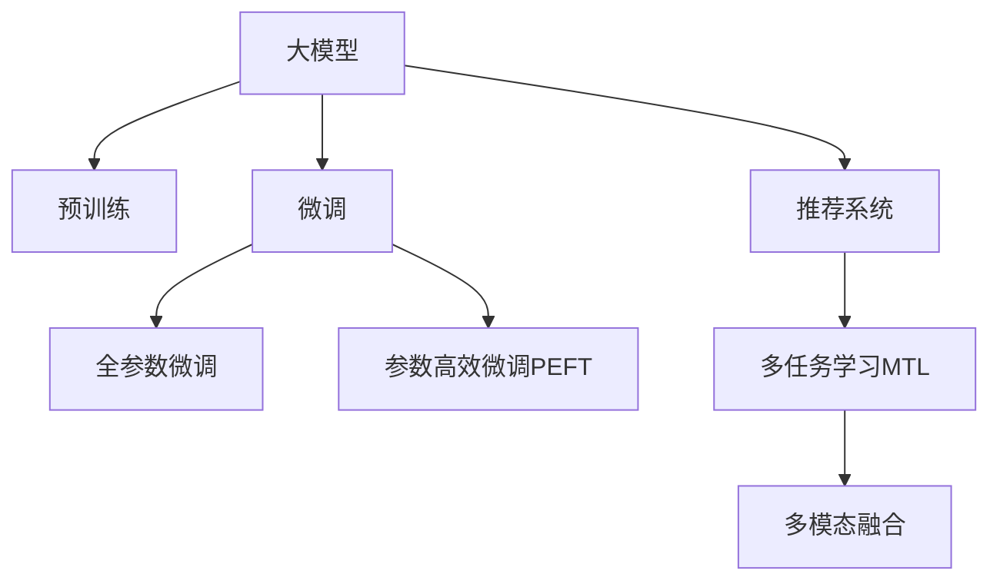

                 

# 大模型在商业中的应用：推荐系统的进步

## 1. 背景介绍

### 1.1 问题由来

推荐系统在电商、内容服务、金融等商业领域具有广泛应用。其核心目标是预测用户对商品、内容、金融产品的兴趣，并提供个性化的推荐。然而，传统的基于协同过滤的推荐方法存在数据稀疏性和冷启动问题，难以对新用户和新物品进行有效推荐。近年来，基于深度学习的推荐方法逐渐兴起，特别是大模型推荐系统，通过在超大规模数据上预训练模型，并在下游任务上进行微调，取得了显著的进展。

### 1.2 问题核心关键点

大模型推荐系统利用大规模预训练数据获得广泛的语义和统计信息，通过微调机制适应不同商业场景，进而提升推荐系统的精度和覆盖面。其核心思想是：

1. 大模型通过预训练获得通用的语言或视觉表示。
2. 在目标任务上进行微调，通过标注数据指导模型学习特定任务。
3. 微调模型在多个商业场景下表现出优越性能，能够更准确地理解用户需求，推荐个性化内容。

## 2. 核心概念与联系

### 2.1 核心概念概述

为更好理解大模型在推荐系统中的应用，本节将介绍几个核心概念及其相互联系：

- 大模型(例如BERT、GPT)：通过大规模无标签数据预训练，具备强大的语言理解和生成能力，能学习到丰富的语义和统计特征。
- 预训练(如语言建模、视觉自监督学习)：在大规模无标签数据上，通过自监督学习任务训练通用模型的过程。
- 微调(Fine-tuning)：在预训练模型的基础上，使用标注数据进行有监督学习，优化模型在特定任务上的性能。
- 推荐系统：通过分析用户行为数据，预测用户对商品的兴趣，推荐个性化内容。
- 参数高效微调(PEFT)：在微调过程中，只更新少量模型参数，减少计算资源消耗，提高模型效率。
- 多任务学习(MTL)：在同一模型上同时训练多个相关任务，共享模型参数，提高泛化能力。

这些概念之间关系可以通过以下Mermaid流程图展示：



这个流程图展示了核心概念之间的逻辑关系：

1. 大模型通过预训练获得基础能力。
2. 微调将通用模型适配到特定任务，提升任务精度。
3. 推荐系统基于微调后的模型推荐个性化内容。
4. MTL和多模态融合提高模型泛化能力。

## 3. 核心算法原理 & 具体操作步骤

### 3.1 算法原理概述

大模型推荐系统的核心算法基于监督学习，通过有监督学习机制，在标注数据上微调预训练模型，使其能够适应特定推荐任务。

假设推荐任务为$m$个用户$u_1, u_2, ..., u_m$和$n$个物品$i_1, i_2, ..., i_n$的评分预测问题。给定标注数据集$D=\{(u_k, i_k, r_k)\}_{k=1}^K$，其中$r_k$为用户$u_k$对物品$i_k$的评分。目标是在推荐系统上最小化预测评分与实际评分之间的差异，即：

$$
\min_{\theta} \sum_{k=1}^K \ell(r_k, \hat{r}_k)
$$

其中，$\ell$为损失函数，$\hat{r}_k$为模型对用户$u_k$对物品$i_k$的评分预测。

### 3.2 算法步骤详解

大模型推荐系统的一般步骤包括：

**Step 1: 准备预训练模型和数据集**
- 选择合适的预训练模型，如BERT、GPT等。
- 准备推荐任务的标注数据集$D$，划分为训练集、验证集和测试集。

**Step 2: 添加推荐适配层**
- 根据推荐任务类型，在预训练模型顶层设计合适的输出层。
- 使用交叉熵损失等合适的损失函数，优化模型预测评分与真实评分之间的差异。

**Step 3: 设置微调超参数**
- 选择合适的优化算法（如Adam、SGD）及学习率。
- 设置正则化技术（如L2正则、Dropout），防止过拟合。
- 确定冻结预训练参数的策略，如仅微调顶层，或全部参数都参与微调。

**Step 4: 执行梯度训练**
- 将训练集数据分批次输入模型，计算损失函数。
- 反向传播计算参数梯度，根据设定的优化算法和学习率更新模型参数。
- 周期性在验证集上评估模型性能，根据性能指标决定是否触发Early Stopping。
- 重复上述步骤直至满足预设的迭代轮数或Early Stopping条件。

**Step 5: 测试和部署**
- 在测试集上评估微调后模型的推荐性能，对比微调前后的精度提升。
- 使用微调后的模型对新样本进行推理预测，集成到实际推荐系统中。

### 3.3 算法优缺点

大模型推荐系统具有以下优点：
1. 可以利用大模型在海量数据上的预训练知识，提升推荐模型的泛化能力。
2. 通过有监督学习微调，可以迅速适应特定推荐任务。
3. 在推荐任务上微调，可以避免从头训练大模型的计算开销。
4. 在特定任务上微调，可以减少资源消耗，提高推荐效率。

同时，该方法也存在一些局限性：
1. 依赖标注数据。推荐任务的标注数据获取难度大，且难以保证质量。
2. 泛化能力有限。当推荐任务与预训练数据差异较大时，微调的性能提升有限。
3. 潜在偏见。预训练模型的偏见可能通过微调传递到推荐系统，产生误导性推荐。
4. 可解释性不足。推荐系统的决策过程难以解释，难以进行调试和优化。

尽管存在这些局限性，但大模型推荐系统已经广泛应用于电商、内容服务等商业领域，取得了显著效果。

### 3.4 算法应用领域

大模型推荐系统在电商、内容服务、金融等商业领域已有广泛应用。例如：

- **电商推荐**：通过微调大模型，根据用户浏览历史和行为数据，推荐商品。
- **内容推荐**：基于用户阅读历史和评分数据，推荐文章、视频等。
- **金融推荐**：通过微调大模型，分析用户交易行为，推荐金融产品。

此外，大模型推荐系统在广告、教育、医疗等领域也有重要应用，提升了各行业的智能化水平。

## 4. 数学模型和公式 & 详细讲解  
### 4.1 数学模型构建

假设推荐模型为$M_{\theta}$，用户$u_k$对物品$i_k$的评分预测为$\hat{r}_k = M_{\theta}(u_k, i_k)$。训练集为$D=\{(u_k, i_k, r_k)\}_{k=1}^K$。

目标是最小化预测评分与真实评分之间的均方误差损失：

$$
\min_{\theta} \frac{1}{K}\sum_{k=1}^K (\hat{r}_k - r_k)^2
$$

### 4.2 公式推导过程

以二分类推荐任务为例，预测用户$u_k$是否对物品$i_k$感兴趣，模型输出$\hat{y}_k = M_{\theta}(u_k, i_k) \in [0,1]$。损失函数为二分类交叉熵：

$$
\ell(\hat{y}_k, r_k) = -y_k \log \hat{y}_k + (1-y_k) \log (1-\hat{y}_k)
$$

目标是最小化预测与真实评分之差的平方和：

$$
\min_{\theta} \frac{1}{K}\sum_{k=1}^K (\hat{r}_k - r_k)^2 = \frac{1}{K}\sum_{k=1}^K \ell(M_{\theta}(u_k, i_k), r_k)
$$

### 4.3 案例分析与讲解

假设用户$u_k$对物品$i_k$的真实评分$r_k$为1，即用户对物品感兴趣。模型预测用户对物品感兴趣的输出为$\hat{y}_k = 0.8$。损失函数为：

$$
\ell(\hat{y}_k, r_k) = -1 \cdot \log 0.8 + 0 \cdot \log 0.2
$$

### 4.4 案例分析与讲解

假设用户$u_k$对物品$i_k$的真实评分$r_k$为0，即用户对物品不感兴趣。模型预测用户对物品不感兴趣的输出为$\hat{y}_k = 0.2$。损失函数为：

$$
\ell(\hat{y}_k, r_k) = -0 \cdot \log 0.2 + 1 \cdot \log 0.8
$$

## 5. 项目实践：代码实例和详细解释说明
### 5.1 开发环境搭建

在使用PyTorch进行大模型推荐系统的开发前，需要准备好开发环境：

1. 安装Anaconda：从官网下载并安装Anaconda，用于创建独立的Python环境。

2. 创建并激活虚拟环境：
```bash
conda create -n pytorch-env python=3.8 
conda activate pytorch-env
```

3. 安装PyTorch：根据CUDA版本，从官网获取对应的安装命令。例如：
```bash
conda install pytorch torchvision torchaudio cudatoolkit=11.1 -c pytorch -c conda-forge
```

4. 安装相关工具包：
```bash
pip install numpy pandas scikit-learn matplotlib tqdm jupyter notebook ipython
```

完成上述步骤后，即可在`pytorch-env`环境中开始开发实践。

### 5.2 源代码详细实现

以下是一个简单的电商推荐系统示例，使用大模型BERT进行微调：

```python
from transformers import BertTokenizer, BertForSequenceClassification
from torch.utils.data import Dataset, DataLoader
from sklearn.metrics import accuracy_score
from transformers import AdamW
import torch

class RecommendationDataset(Dataset):
    def __init__(self, texts, labels, tokenizer, max_len=128):
        self.texts = texts
        self.labels = labels
        self.tokenizer = tokenizer
        self.max_len = max_len
        
    def __len__(self):
        return len(self.texts)
    
    def __getitem__(self, item):
        text = self.texts[item]
        label = self.labels[item]
        
        encoding = self.tokenizer(text, return_tensors='pt', max_length=self.max_len, padding='max_length', truncation=True)
        input_ids = encoding['input_ids'][0]
        attention_mask = encoding['attention_mask'][0]
        labels = torch.tensor(label, dtype=torch.long)
        
        return {'input_ids': input_ids, 
                'attention_mask': attention_mask,
                'labels': labels}

# 标签与id的映射
label2id = {'0': 0, '1': 1}
id2label = {v: k for k, v in label2id.items()}

# 创建dataset
tokenizer = BertTokenizer.from_pretrained('bert-base-cased')

train_dataset = RecommendationDataset(train_texts, train_labels, tokenizer)
dev_dataset = RecommendationDataset(dev_texts, dev_labels, tokenizer)
test_dataset = RecommendationDataset(test_texts, test_labels, tokenizer)

# 模型和优化器
model = BertForSequenceClassification.from_pretrained('bert-base-cased', num_labels=2)

optimizer = AdamW(model.parameters(), lr=2e-5)

# 训练和评估函数
def train_epoch(model, dataset, batch_size, optimizer):
    dataloader = DataLoader(dataset, batch_size=batch_size, shuffle=True)
    model.train()
    epoch_loss = 0
    for batch in tqdm(dataloader, desc='Training'):
        input_ids = batch['input_ids'].to(device)
        attention_mask = batch['attention_mask'].to(device)
        labels = batch['labels'].to(device)
        model.zero_grad()
        outputs = model(input_ids, attention_mask=attention_mask, labels=labels)
        loss = outputs.loss
        epoch_loss += loss.item()
        loss.backward()
        optimizer.step()
    return epoch_loss / len(dataloader)

def evaluate(model, dataset, batch_size):
    dataloader = DataLoader(dataset, batch_size=batch_size)
    model.eval()
    preds, labels = [], []
    with torch.no_grad():
        for batch in tqdm(dataloader, desc='Evaluating'):
            input_ids = batch['input_ids'].to(device)
            attention_mask = batch['attention_mask'].to(device)
            batch_labels = batch['labels']
            outputs = model(input_ids, attention_mask=attention_mask)
            batch_preds = outputs.logits.argmax(dim=1).to('cpu').tolist()
            batch_labels = batch_labels.to('cpu').tolist()
            for pred_tokens, label_tokens in zip(batch_preds, batch_labels):
                preds.append(pred_tokens)
                labels.append(label_tokens)
    
    return accuracy_score(labels, preds)

# 训练流程
epochs = 5
batch_size = 16

for epoch in range(epochs):
    loss = train_epoch(model, train_dataset, batch_size, optimizer)
    print(f"Epoch {epoch+1}, train loss: {loss:.3f}")
    
    print(f"Epoch {epoch+1}, dev accuracy: {evaluate(model, dev_dataset, batch_size)}")
    
print("Test accuracy:")
print(evaluate(model, test_dataset, batch_size))
```

### 5.3 代码解读与分析

在上述代码中，我们定义了一个`RecommendationDataset`类，用于处理电商推荐任务的标注数据。然后，我们使用BertTokenizer对数据进行编码，并使用BertForSequenceClassification模型进行微调。最后，我们定义了训练和评估函数，并在训练过程中不断优化模型，最终在测试集上评估微调后的模型性能。

## 6. 实际应用场景

### 6.1 电商推荐

电商推荐系统是推荐系统的主要应用之一。通过微调大模型，可以根据用户浏览历史和行为数据，推荐个性化商品。具体而言，电商推荐系统可以分为两个阶段：

1. **用户兴趣预测**：使用微调后的模型预测用户对不同商品的兴趣程度，生成用户兴趣向量。
2. **商品推荐**：基于用户兴趣向量，使用协同过滤或神经网络等推荐算法，生成个性化商品推荐列表。

电商推荐系统已经广泛应用于阿里巴巴、亚马逊等电商巨头，通过精准推荐，提升用户购买率和满意度。

### 6.2 内容推荐

内容推荐系统广泛用于视频、文章等媒体平台。通过微调大模型，平台可以根据用户阅读历史和评分数据，推荐感兴趣的内容。具体而言，内容推荐系统可以分为以下三个步骤：

1. **用户兴趣建模**：使用微调后的模型预测用户对不同内容的兴趣程度，生成用户兴趣向量。
2. **内容相似度计算**：计算不同内容之间的相似度，构建内容-内容相似矩阵。
3. **内容推荐排序**：基于用户兴趣向量和内容相似矩阵，使用协同过滤、深度学习等推荐算法，生成个性化内容推荐列表。

内容推荐系统已经在Netflix、YouTube等平台广泛应用，极大地提升了用户体验。

### 6.3 金融推荐

金融推荐系统用于分析用户交易行为，推荐金融产品。通过微调大模型，金融推荐系统可以根据用户历史交易数据，预测用户对不同金融产品的兴趣。具体而言，金融推荐系统可以分为以下三个步骤：

1. **用户行为建模**：使用微调后的模型预测用户对不同金融产品的兴趣程度，生成用户行为向量。
2. **产品特征提取**：提取不同金融产品的特征，生成产品特征向量。
3. **推荐排序**：基于用户行为向量和产品特征向量，使用协同过滤、深度学习等推荐算法，生成个性化金融产品推荐列表。

金融推荐系统已经在各种金融平台如蚂蚁金服、京东金融等应用，帮助用户发现感兴趣的产品，提升金融服务质量。

### 6.4 未来应用展望

随着大模型推荐系统的不断发展，未来的推荐系统将在更多领域得到应用，为各行各业带来变革性影响。

在智慧医疗领域，基于大模型推荐系统的医疗问答、病历分析、药物推荐等应用将提升医疗服务的智能化水平，辅助医生诊疗，加速新药开发进程。

在智能教育领域，微调技术可应用于作业批改、学情分析、知识推荐等方面，因材施教，促进教育公平，提高教学质量。

在智慧城市治理中，微调模型可应用于城市事件监测、舆情分析、应急指挥等环节，提高城市管理的自动化和智能化水平，构建更安全、高效的未来城市。

此外，在企业生产、社会治理、文娱传媒等众多领域，基于大模型推荐系统的智能推荐将不断涌现，为经济社会发展注入新的动力。

## 7. 工具和资源推荐

### 7.1 学习资源推荐

为了帮助开发者系统掌握大模型推荐系统的理论基础和实践技巧，这里推荐一些优质的学习资源：

1. 《Transformer from scratch》系列博文：由大模型技术专家撰写，深入浅出地介绍了Transformer原理、BERT模型、推荐系统等前沿话题。

2. CS231n《Convolutional Neural Networks for Visual Recognition》课程：斯坦福大学开设的视觉识别课程，涵盖深度学习在计算机视觉中的各种应用，包括推荐系统。

3. 《Recommender Systems: The Textbook》书籍：深入介绍推荐系统原理、算法和实际应用，是推荐系统学习的经典教材。

4. KDD Cup 2019推荐系统竞赛：真实推荐场景的数据集和挑战，帮助开发者积累实战经验。

5. CTR系统介绍：阿里巴巴CTR系统，基于深度学习和CTR算法，为电商推荐系统提供了一个典型的工程实现案例。

通过对这些资源的学习实践，相信你一定能够快速掌握大模型推荐系统的精髓，并用于解决实际的推荐问题。

### 7.2 开发工具推荐

高效的开发离不开优秀的工具支持。以下是几款用于大模型推荐系统开发的常用工具：

1. PyTorch：基于Python的开源深度学习框架，灵活动态的计算图，适合快速迭代研究。大部分推荐模型都有PyTorch版本的实现。

2. TensorFlow：由Google主导开发的开源深度学习框架，生产部署方便，适合大规模工程应用。同样有丰富的推荐模型资源。

3. Transformers库：HuggingFace开发的NLP工具库，集成了众多SOTA推荐模型，支持PyTorch和TensorFlow，是进行推荐任务开发的利器。

4. Weights & Biases：模型训练的实验跟踪工具，可以记录和可视化模型训练过程中的各项指标，方便对比和调优。与主流深度学习框架无缝集成。

5. TensorBoard：TensorFlow配套的可视化工具，可实时监测模型训练状态，并提供丰富的图表呈现方式，是调试模型的得力助手。

6. Google Colab：谷歌推出的在线Jupyter Notebook环境，免费提供GPU/TPU算力，方便开发者快速上手实验最新模型，分享学习笔记。

合理利用这些工具，可以显著提升大模型推荐系统的开发效率，加快创新迭代的步伐。

### 7.3 相关论文推荐

大模型推荐系统的研究源于学界的持续研究。以下是几篇奠基性的相关论文，推荐阅读：

1. Factorization Machines for Recommender Systems（因子分解机）：提出了一种基于矩阵分解的推荐系统模型，被广泛应用于电商推荐。

2. Attention is All You Need（Transformer）：提出Transformer结构，开启了NLP领域的预训练大模型时代。

3. Matrix Factorization Techniques for Recommender Systems（矩阵分解技术）：介绍了推荐系统中的矩阵分解算法，包括SVD、ALS等。

4. Deep Collaborative Filtering using Matrix Factorization Techniques（深度协作过滤）：提出深度神经网络在推荐系统中的应用，被广泛应用于视频推荐。

5. Wide & Deep Learning for Recommender Systems（宽深学习）：提出了一种宽深结合的推荐系统模型，综合了传统矩阵分解和深度学习的方法。

这些论文代表了大模型推荐系统的发展脉络。通过学习这些前沿成果，可以帮助研究者把握学科前进方向，激发更多的创新灵感。

## 8. 总结：未来发展趋势与挑战

### 8.1 总结

本文对大模型推荐系统进行了全面系统的介绍。首先阐述了大模型推荐系统的研究背景和意义，明确了推荐系统在大模型应用中的核心价值。其次，从原理到实践，详细讲解了大模型推荐系统的数学模型和关键步骤，给出了推荐任务开发的完整代码实例。同时，本文还广泛探讨了大模型推荐系统在电商、内容服务、金融等多个商业领域的应用前景，展示了推荐系统范式的巨大潜力。此外，本文精选了推荐系统的各类学习资源，力求为读者提供全方位的技术指引。

通过本文的系统梳理，可以看到，大模型推荐系统已经在多个商业领域取得了显著成效，特别是在电商推荐、内容推荐、金融推荐等方面。未来，随着预训练语言模型和推荐算法的发展，推荐系统将进一步提升精准度和覆盖面，为商业决策提供更有力的支持。

### 8.2 未来发展趋势

展望未来，大模型推荐系统将呈现以下几个发展趋势：

1. 数据驱动与个性化增强：未来的推荐系统将更加注重用户数据的获取和使用，通过大数据分析，实现更精准的用户画像和行为建模。

2. 多任务学习和跨领域迁移：在大模型推荐系统中引入多任务学习和跨领域迁移技术，提升模型在不同领域和任务上的泛化能力。

3. 多模态融合与多模态推荐：结合图像、视频、语音等多模态信息，提升推荐系统的准确性和用户满意度。

4. 实时推荐与在线学习：实时推荐技术将进一步提升推荐系统的时效性和响应速度，在线学习机制将使推荐系统不断适应用户行为变化，保持模型性能。

5. 安全性与隐私保护：推荐系统的数据隐私和安全问题将受到越来越多的关注，未来的推荐系统将更加注重用户数据的保护。

6. 自动化与智能决策：推荐系统将逐步自动化，通过深度学习和强化学习等技术，提升智能决策能力，优化用户体验。

以上趋势凸显了大模型推荐系统的广阔前景。这些方向的探索发展，必将进一步提升推荐系统的精准度和覆盖面，为用户带来更好的体验。

### 8.3 面临的挑战

尽管大模型推荐系统已经取得了瞩目成就，但在迈向更加智能化、普适化应用的过程中，它仍面临着诸多挑战：

1. 数据隐私与安全问题：推荐系统处理大量用户数据，数据隐私和安全问题成为一大挑战。如何保护用户隐私，防止数据泄露，是推荐系统面临的重要课题。

2. 模型鲁棒性与公平性：推荐系统可能存在偏见，模型鲁棒性和公平性问题需要进一步解决。如何在不同用户和物品之间实现公正推荐，是一个亟待解决的问题。

3. 算法透明性与可解释性：推荐系统的决策过程难以解释，难以进行调试和优化。如何提高算法的透明性和可解释性，是推荐系统面临的一大挑战。

4. 资源消耗与计算效率：大模型推荐系统对算力、内存、存储等资源要求较高，如何优化资源使用，提高计算效率，是一个重要的优化方向。

5. 模型多样性与复杂度：大模型推荐系统需要兼顾模型多样性和模型复杂度，如何在模型多样性与资源消耗之间找到平衡，是一个重要的研究方向。

正视推荐系统面临的这些挑战，积极应对并寻求突破，将是大模型推荐系统走向成熟的必由之路。相信随着学界和产业界的共同努力，这些挑战终将一一被克服，大模型推荐系统必将在构建智能推荐系统的过程中发挥越来越重要的作用。

### 8.4 研究展望

面对大模型推荐系统所面临的种种挑战，未来的研究需要在以下几个方面寻求新的突破：

1. 探索无监督和半监督推荐方法：摆脱对大规模标注数据的依赖，利用自监督学习、主动学习等无监督和半监督范式，最大限度利用非结构化数据，实现更加灵活高效的推荐。

2. 研究参数高效和计算高效的推荐方法：开发更加参数高效的推荐方法，在固定大部分预训练参数的同时，只更新极少量的任务相关参数。同时优化推荐模型的计算图，减少前向传播和反向传播的资源消耗，实现更加轻量级、实时性的部署。

3. 引入因果推断与强化学习：通过引入因果推断和强化学习思想，增强推荐模型建立稳定因果关系的能力，学习更加普适、鲁棒的语言表征，从而提升模型泛化性和抗干扰能力。

4. 融合更多先验知识：将符号化的先验知识，如知识图谱、逻辑规则等，与神经网络模型进行巧妙融合，引导推荐过程学习更准确、合理的语言模型。

5. 结合因果分析和博弈论工具：将因果分析方法引入推荐模型，识别出推荐决策的关键特征，增强推荐输出的因果性和逻辑性。借助博弈论工具刻画人机交互过程，主动探索并规避推荐系统的脆弱点，提高系统稳定性。

这些研究方向的发展，必将引领大模型推荐系统迈向更高的台阶，为推荐系统带来更加智能化的推荐服务，为用户带来更好的体验。

## 9. 附录：常见问题与解答

**Q1：大模型推荐系统是否适用于所有推荐任务？**

A: 大模型推荐系统在大多数推荐任务上都能取得不错的效果，特别是对于数据量较小的任务。但对于一些特定领域的任务，如医学、法律等，仅仅依靠通用语料预训练的模型可能难以很好地适应。此时需要在特定领域语料上进一步预训练，再进行微调，才能获得理想效果。此外，对于一些需要时效性、个性化很强的任务，如对话、推荐等，微调方法也需要针对性的改进优化。

**Q2：推荐系统如何适应新用户的冷启动问题？**

A: 冷启动问题是大模型推荐系统面临的主要挑战之一。通常，推荐系统可以通过以下方法解决冷启动问题：

1. 利用用户兴趣图：使用用户已有的兴趣数据，构建用户兴趣图，预测新用户的兴趣。

2. 利用用户行为数据：通过用户的搜索历史、浏览历史等行为数据，预测新用户的兴趣。

3. 利用多模态数据：结合用户画像、行为数据、社交网络等多种数据，综合预测新用户的兴趣。

4. 利用推荐算法：使用协同过滤、深度学习等推荐算法，预测新用户的兴趣。

这些方法可以结合使用，提高推荐系统的冷启动效果。

**Q3：推荐系统如何处理数据稀疏性问题？**

A: 推荐系统面临的主要问题之一是数据稀疏性，即用户对物品的评分数据不足。通常，推荐系统可以通过以下方法处理数据稀疏性问题：

1. 利用矩阵分解技术：通过矩阵分解技术，将用户-物品评分矩阵分解成两个低维向量，提高模型对稀疏数据的处理能力。

2. 利用深度学习技术：通过深度神经网络，学习用户和物品的隐含特征，提升模型对稀疏数据的拟合能力。

3. 利用用户-物品关系图：通过构建用户-物品关系图，利用图神经网络等方法，提高模型对稀疏数据的处理能力。

4. 利用多任务学习：通过多任务学习，学习不同推荐任务之间的共享知识，提高模型对稀疏数据的处理能力。

这些方法可以结合使用，提高推荐系统的稀疏性处理能力。

**Q4：推荐系统如何处理噪声数据问题？**

A: 推荐系统面临的另一个问题是噪声数据，即用户评分可能存在噪声或不准确。通常，推荐系统可以通过以下方法处理噪声数据问题：

1. 利用异常检测：使用异常检测技术，识别并去除噪声数据。

2. 利用用户画像：通过用户画像，识别并修正不合理的评分数据。

3. 利用多模态数据：结合用户行为数据、社交网络数据等多种数据，综合判断用户评分。

4. 利用深度学习技术：通过深度神经网络，学习用户和物品的隐含特征，提高模型对噪声数据的鲁棒性。

这些方法可以结合使用，提高推荐系统的噪声数据处理能力。

**Q5：推荐系统如何处理长尾问题？**

A: 长尾问题是指推荐系统中存在大量长尾物品，用户对这些物品的评分稀疏且难以预测。通常，推荐系统可以通过以下方法处理长尾问题：

1. 利用多模态数据：结合用户画像、行为数据、社交网络等多种数据，综合预测长尾物品的评分。

2. 利用协同过滤：通过协同过滤算法，利用用户对长尾物品的相似评分，预测新用户的评分。

3. 利用深度学习技术：通过深度神经网络，学习用户和物品的隐含特征，提升模型对长尾物品的预测能力。

4. 利用用户兴趣图：使用用户已有的兴趣数据，构建用户兴趣图，预测用户对长尾物品的兴趣。

这些方法可以结合使用，提高推荐系统的长尾问题处理能力。

**Q6：推荐系统如何优化资源使用，提高计算效率？**

A: 推荐系统对算力、内存、存储等资源要求较高，优化资源使用，提高计算效率，是推荐系统的重要优化方向。通常，推荐系统可以通过以下方法优化资源使用：

1. 利用深度学习加速：通过深度学习加速技术，如TensorCore、TPU等，提高模型的计算速度。

2. 利用模型压缩与稀疏化：通过模型压缩与稀疏化技术，减少模型的参数量和存储空间，提高推理速度。

3. 利用模型并行与分布式训练：通过模型并行与分布式训练技术，提高模型的训练速度。

4. 利用缓存与预取技术：通过缓存与预取技术，提高数据读取速度，减少模型延迟。

这些方法可以结合使用，提高推荐系统的计算效率。

**Q7：推荐系统如何提高模型公平性与透明性？**

A: 推荐系统面临的另一大问题是模型公平性与透明性，即推荐系统可能存在偏见，导致不公平推荐。通常，推荐系统可以通过以下方法提高模型公平性与透明性：

1. 利用公平性约束：在模型训练过程中，加入公平性约束，防止模型对某些用户或物品的歧视性推荐。

2. 利用公平性指标：通过公平性指标，如平衡准确率、公平误差等，评估模型的公平性。

3. 利用可解释性模型：通过可解释性模型，如LIME、SHAP等，提高模型的可解释性。

4. 利用用户反馈：通过用户反馈，不断优化推荐算法，提高模型的公平性。

这些方法可以结合使用，提高推荐系统的公平性与透明性。

---

作者：禅与计算机程序设计艺术 / Zen and the Art of Computer Programming

