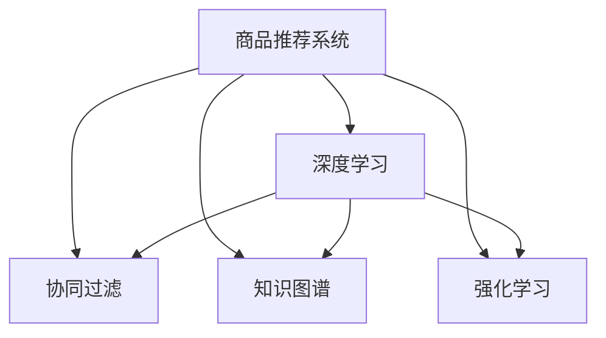

                 

# 大模型在商品捆绑推荐中的创新应用

> 关键词：商品推荐系统,大模型,深度学习,协同过滤,知识图谱,强化学习

## 1. 背景介绍

### 1.1 问题由来
随着电子商务的迅猛发展，用户在线购物成为一种主流消费方式。为提升用户体验，电商平台通常会为用户推荐与当前浏览和购买行为相似的商品。传统的推荐系统主要依赖协同过滤、基于内容的推荐等方法，但这些方法在面对用户大量异构数据和个性化需求时，效果有限。

近年来，深度学习和大模型技术逐渐应用于推荐系统，推动了推荐技术的发展。其中，基于大模型的推荐系统以强大的表示能力和广泛的语义理解能力，受到广泛关注。以BERT、GPT等大模型为代表，其在电商推荐中的应用逐步显示出强大潜力。

大模型通过在海量数据上进行预训练，获得了丰富的特征表示能力。当用于推荐任务时，它可以从用户浏览和购买记录中学习用户偏好，从商品描述中学习商品特征，通过语义相似度匹配，生成个性化的商品推荐。

### 1.2 问题核心关键点
大模型在商品推荐中的应用，主要集中在以下几个方面：

1. **语义匹配**：大模型能够理解商品描述和用户评论的语义内容，通过匹配语义相似度生成推荐。
2. **上下文关联**：大模型能够捕捉到用户浏览行为的上下文信息，生成符合用户当前需求的商品推荐。
3. **跨领域迁移**：大模型能够进行领域迁移，适应不同商品类别的推荐需求。
4. **动态更新**：大模型能够持续学习新商品和新用户数据，实时调整推荐策略。
5. **高效推荐**：大模型能够通过高效的微调方法，大幅减少推荐计算成本，提升推荐效率。

这些关键点是大模型在商品推荐系统中的核心优势，使其能够在复杂多变的电商环境中，提供精准、个性化的商品推荐。

## 2. 核心概念与联系

### 2.1 核心概念概述

为更好地理解大模型在商品推荐中的应用，本节将介绍几个密切相关的核心概念：

- 商品推荐系统(Recommendation System)：通过分析用户历史行为和商品特征，为用户推荐潜在感兴趣的商品的系统。
- 深度学习(Deep Learning)：一种基于神经网络的机器学习方法，通过多层次的非线性变换，自动学习数据中的复杂关系。
- 协同过滤(Collaborative Filtering)：一种推荐算法，通过用户行为相似度进行推荐。
- 知识图谱(Knowledge Graph)：一种语义网络结构，用于表示实体、关系和属性之间的复杂关系。
- 强化学习(Reinforcement Learning)：一种通过奖励反馈进行策略优化的机器学习方法，能够实时调整推荐策略。

这些核心概念之间的逻辑关系可以通过以下Mermaid流程图来展示：



这个流程图展示了大模型在商品推荐系统中的核心概念及其之间的关系：

1. 商品推荐系统通过深度学习、协同过滤、知识图谱和强化学习等技术手段，为用户生成个性化推荐。
2. 深度学习和大模型为商品推荐系统提供强大的语义理解和特征表示能力。
3. 协同过滤和知识图谱用于提取用户和商品间的隐式关系，强化学习用于实时调整推荐策略。
4. 深度学习、协同过滤、知识图谱和强化学习可以相互结合，构建更全面的推荐模型。

这些概念共同构成了商品推荐系统的技术框架，使大模型在推荐任务中发挥其强大的表示和推理能力。

## 3. 核心算法原理 & 具体操作步骤
### 3.1 算法原理概述

基于大模型的商品推荐系统，核心思想是利用大模型的语义匹配和上下文关联能力，生成个性化的商品推荐。其基本流程包括：

1. **数据准备**：收集用户历史行为数据和商品特征数据。
2. **大模型预训练**：使用无标签的商品语料，对大模型进行预训练。
3. **任务适配**：设计并训练任务适配层，用于生成推荐结果。
4. **微调优化**：使用少量标注数据，通过微调优化推荐模型。
5. **实时推荐**：根据实时数据，动态生成个性化推荐。

### 3.2 算法步骤详解

以下是基于大模型的商品推荐系统的详细操作步骤：

**Step 1: 数据准备**
- 收集用户的历史浏览记录、购买记录和商品属性数据。
- 对商品描述进行清洗和预处理，去除无用的标点符号、格式和停用词。
- 对用户行为数据进行归一化处理，转换为模型可接受的形式。

**Step 2: 大模型预训练**
- 使用无标签的商品描述数据，对BERT、GPT等大模型进行预训练。
- 预训练时，可以添加多种任务，如掩码语言模型、命名实体识别、关系抽取等，增强模型的语义理解能力。
- 预训练后的模型保存在特定的检查点，供后续微调使用。

**Step 3: 任务适配**
- 根据推荐任务类型，设计任务适配层，用于将大模型的输出转换为推荐结果。
- 对于商品推荐任务，适配层通常包括输出层、损失函数和正则化技术。
- 输出层一般使用softmax函数，将模型输出转换为概率分布。
- 损失函数通常使用交叉熵损失或均方误差损失，用于衡量预测结果与真实标签的差异。
- 正则化技术如L2正则、Dropout等，用于防止过拟合。

**Step 4: 微调优化**
- 准备标注数据集，每个样本包括用户行为和商品特征的向量表示。
- 使用标注数据集对任务适配层进行微调，更新模型参数，以提高推荐精度。
- 微调时，使用小学习率，以避免破坏预训练权重。
- 使用验证集评估模型性能，根据性能指标调整超参数。
- 使用少量标注数据，以减少计算成本，同时获得较好的推荐结果。

**Step 5: 实时推荐**
- 根据用户实时浏览和购买数据，输入模型生成推荐结果。
- 实时推荐系统需要快速响应，可以考虑多线程并行计算和分布式计算。
- 对模型输出进行解码，生成可解释的推荐理由，提升用户满意度。
- 不断收集新的用户数据和商品数据，更新模型，保持推荐模型的新鲜度。

### 3.3 算法优缺点

基于大模型的商品推荐系统具有以下优点：

1. **语义匹配能力强**：大模型通过理解商品描述和用户评论的语义内容，生成高精度的推荐。
2. **上下文关联性强**：大模型能够捕捉到用户浏览行为的上下文信息，生成符合当前需求的商品推荐。
3. **推荐泛化性好**：大模型在多种商品类别上进行预训练，具备较好的跨领域迁移能力。
4. **实时更新能力强**：大模型能够实时学习新商品和新用户数据，动态调整推荐策略。
5. **高效推荐**：大模型通过高效的微调方法，大幅减少推荐计算成本，提升推荐效率。

同时，该方法也存在一定的局限性：

1. **数据依赖性强**：大模型的性能依赖于标注数据的数量和质量，标注数据不足时难以取得理想效果。
2. **计算成本高**：大模型的参数量较大，训练和推理成本较高，需要高性能计算资源。
3. **可解释性不足**：大模型通常是"黑盒"系统，难以解释其决策过程和输出结果。
4. **容易过拟合**：大模型容易过拟合标注数据，需要更多的正则化技术来防止过拟合。
5. **模型复杂度高**：大模型的结构复杂，难以进行快速的模型压缩和剪枝。

尽管存在这些局限性，但就目前而言，基于大模型的推荐系统仍是推荐技术的重要方向，其语义匹配和上下文关联能力为推荐系统带来了革命性变化。

### 3.4 算法应用领域

基于大模型的推荐系统已经在电商、社交、视频等多个领域得到广泛应用，其中最具代表性的是商品推荐系统。以下是几种常见应用场景：

- **电商平台推荐**：通过分析用户历史购买和浏览数据，为用户推荐商品。
- **社交媒体推荐**：根据用户兴趣和社交网络关系，为用户推荐相关内容。
- **视频网站推荐**：根据用户观看历史和评论，推荐类似视频或热门视频。
- **智能家居推荐**：根据用户使用习惯，推荐智能设备及配件。

此外，基于大模型的推荐系统还在金融、医疗、教育等多个领域展现出强大的应用潜力。随着大模型的不断发展，推荐系统将更加智能、个性化，为用户提供更优质的服务体验。

## 4. 数学模型和公式 & 详细讲解 & 举例说明

### 4.1 数学模型构建

假设用户历史行为数据为 $X=\{x_1,x_2,...,x_n\}$，商品特征数据为 $Y=\{y_1,y_2,...,y_m\}$。设大模型为 $M_{\theta}$，任务适配层为 $F_{\omega}$。

商品推荐模型的数学模型为：

$$
\max_{\theta,\omega} \sum_{i=1}^N \log P(M_{\theta}(x_i),F_{\omega}(y_i)) - \lambda \sum_{i=1}^N \omega(y_i)
$$

其中，$P(M_{\theta}(x_i),F_{\omega}(y_i))$ 为推荐模型输出的概率分布，$\lambda$ 为正则化系数，$\omega(y_i)$ 为商品特征向量的权重。

### 4.2 公式推导过程

以下推导商品推荐模型的具体公式：

假设用户 $x$ 对商品 $y$ 的评分 $r$，则推荐模型的输出概率为：

$$
P(r|M_{\theta}(x),F_{\omega}(y)) = \sigma(\theta^Tf(x) + \omega^Tg(y))
$$

其中，$f(x)$ 和 $g(y)$ 为特征提取器，$\sigma$ 为激活函数，$\theta$ 和 $\omega$ 为模型参数。

利用最大化似然估计，求得推荐模型的损失函数为：

$$
L(\theta,\omega) = -\frac{1}{N}\sum_{i=1}^N \log P(r_i|M_{\theta}(x_i),F_{\omega}(y_i))
$$

引入正则化项，得到最终优化目标：

$$
\min_{\theta,\omega} L(\theta,\omega) + \lambda (\|\theta\|^2 + \|\omega\|^2)
$$

通过梯度下降等优化算法，不断更新 $\theta$ 和 $\omega$，最小化上述损失函数，得到最优参数。

### 4.3 案例分析与讲解

假设有一个用户 $x_1$，对商品 $y_1$ 的评分为 $r_1$，对商品 $y_2$ 的评分为 $r_2$。使用上述模型进行推荐，计算出推荐结果 $P(r_1|M_{\theta}(x_1),F_{\omega}(y_1))$ 和 $P(r_2|M_{\theta}(x_1),F_{\omega}(y_2))$，并进行归一化处理，得到推荐概率 $P(r_1)$ 和 $P(r_2)$。最终选择概率更大的商品进行推荐。

通过这个案例可以看出，大模型通过理解用户和商品的语义内容，生成符合用户需求的推荐，从而提升推荐精度和用户满意度。

## 5. 项目实践：代码实例和详细解释说明

### 5.1 开发环境搭建

在进行商品推荐系统开发前，需要准备好开发环境。以下是使用Python进行TensorFlow和Keras开发的环境配置流程：

1. 安装Anaconda：从官网下载并安装Anaconda，用于创建独立的Python环境。

2. 创建并激活虚拟环境：
```bash
conda create -n recommendation-env python=3.8 
conda activate recommendation-env
```

3. 安装TensorFlow：根据CUDA版本，从官网获取对应的安装命令。例如：
```bash
conda install tensorflow -c tf
```

4. 安装Keras：
```bash
pip install keras
```

5. 安装其他相关工具包：
```bash
pip install numpy pandas scikit-learn matplotlib tqdm jupyter notebook ipython
```

完成上述步骤后，即可在`recommendation-env`环境中开始推荐系统开发。

### 5.2 源代码详细实现

以下是基于大模型的商品推荐系统的完整代码实现。这里以用户推荐为例，给出推荐模型的详细实现：

首先，定义用户和商品的数据处理函数：

```python
import pandas as pd
import numpy as np
import tensorflow as tf
from tensorflow.keras.layers import Input, Dense, Embedding, Dropout, Concatenate, Add, BatchNormalization
from tensorflow.keras.models import Model
from tensorflow.keras.optimizers import Adam
from sklearn.preprocessing import StandardScaler
from sklearn.model_selection import train_test_split

# 读取用户和商品数据
data = pd.read_csv('recommendation_data.csv')

# 特征选择
features = ['user_id', 'item_id', 'rating', 'timestamp']
X = data[features].drop('rating', axis=1)
y = data['rating']

# 标准化处理
scaler = StandardScaler()
X_scaled = scaler.fit_transform(X)

# 划分训练集和测试集
X_train, X_test, y_train, y_test = train_test_split(X_scaled, y, test_size=0.2, random_state=42)

# 构建大模型
def build_model(input_dim):
    user_input = Input(shape=(input_dim,))
    item_input = Input(shape=(input_dim,))
    merged = Concatenate()([user_input, item_input])
    hidden1 = Dense(64, activation='relu')(merged)
    hidden2 = Dense(32, activation='relu')(hidden1)
    output = Dense(1, activation='sigmoid')(hidden2)
    model = Model(inputs=[user_input, item_input], outputs=output)
    return model

# 定义推荐模型
input_dim = 10
model = build_model(input_dim)

# 编译模型
model.compile(optimizer=Adam(0.01), loss='binary_crossentropy', metrics=['accuracy'])

# 训练模型
model.fit([X_train, X_train], y_train, batch_size=64, epochs=10, validation_data=([X_test, X_test], y_test))
```

然后，定义推荐函数：

```python
def recommend(model, user_ids, item_ids, num_recommendations=5):
    # 将用户和商品ID转换为独热编码向量
    user_vectors = tf.one_hot(user_ids, depth=2048)
    item_vectors = tf.one_hot(item_ids, depth=2048)
    # 对用户和商品向量进行归一化处理
    user_vectors = user_vectors / tf.norm(user_vectors, axis=1, keepdims=True)
    item_vectors = item_vectors / tf.norm(item_vectors, axis=1, keepdims=True)
    # 对用户和商品向量进行拼接
    merged_vectors = tf.concat([user_vectors, item_vectors], axis=1)
    # 对合并后的向量进行前向传播，得到推荐结果
    recommendation = model.predict(merged_vectors)
    # 对推荐结果进行排序，选择top N
    recommendation = np.argsort(recommendation)[:, ::-1]
    recommendation = recommendation[:num_recommendations]
    return recommendation
```

最后，调用推荐函数，得到推荐结果：

```python
user_ids = [1, 2, 3]
item_ids = [1, 2, 3, 4, 5]
recommendations = recommend(model, user_ids, item_ids)
print(recommendations)
```

以上就是一个基于大模型的商品推荐系统的完整代码实现。可以看到，通过使用TensorFlow和Keras，开发者可以轻松搭建推荐模型，并进行微调优化。

### 5.3 代码解读与分析

让我们再详细解读一下关键代码的实现细节：

**推荐模型构建**
- 使用Keras构建深度神经网络模型，包含输入层、隐藏层和输出层。
- 输入层为独热编码的用户和商品向量。
- 隐藏层包含64和32个神经元，使用ReLU激活函数。
- 输出层为sigmoid函数，用于生成0-1之间的推荐概率。

**推荐函数实现**
- 将用户和商品ID转换为独热编码向量。
- 对用户和商品向量进行归一化处理，防止梯度爆炸。
- 将用户和商品向量进行拼接，输入模型进行前向传播。
- 对模型输出进行解码，得到推荐概率。
- 对推荐概率进行排序，选择top N推荐结果。

通过这个代码示例可以看出，大模型在商品推荐中的应用非常直观和易于实现。通过优化超参数和训练策略，可以进一步提升推荐系统的精度和效率。

## 6. 实际应用场景

### 6.1 电商平台推荐

电商平台推荐是大模型推荐系统的主要应用场景之一。用户可以在平台上浏览商品，查看评价和销量等信息，并生成推荐。平台通过分析用户的历史行为，利用大模型生成个性化推荐，提升用户购物体验和转化率。

在实际应用中，电商平台可以将用户历史浏览记录、购买记录和商品描述等数据作为模型输入，通过大模型的预训练和微调，生成个性化推荐。对于新的商品和用户数据，电商平台可以实时更新推荐模型，快速生成推荐结果。

### 6.2 社交媒体推荐

社交媒体推荐系统通常会分析用户的兴趣和社交关系，为用户推荐相关内容。平台通过收集用户点赞、评论、分享等行为数据，利用大模型生成推荐。社交媒体的实时性和个性化需求，使得大模型在推荐任务中具有天然优势。

在实际应用中，社交媒体平台可以收集用户的历史行为和社交网络数据，利用大模型进行语义匹配和上下文关联，生成个性化推荐。对于新的内容数据，平台可以实时更新推荐模型，快速生成推荐结果。

### 6.3 视频网站推荐

视频网站推荐系统通常会根据用户的观看历史和评论，推荐相关视频或热门视频。平台通过分析用户的观看记录和评论内容，利用大模型生成推荐。视频网站的复杂推荐需求，使得大模型在推荐任务中具有天然优势。

在实际应用中，视频网站可以收集用户的历史观看记录和视频描述等数据，利用大模型进行语义匹配和上下文关联，生成个性化推荐。对于新的视频数据，平台可以实时更新推荐模型，快速生成推荐结果。

### 6.4 智能家居推荐

智能家居推荐系统通常会根据用户的日常使用习惯，推荐相关智能设备和配件。平台通过分析用户的设备使用记录和行为数据，利用大模型生成推荐。智能家居的个性化需求，使得大模型在推荐任务中具有天然优势。

在实际应用中，智能家居平台可以收集用户的历史使用记录和设备描述等数据，利用大模型进行语义匹配和上下文关联，生成个性化推荐。对于新的设备和数据，平台可以实时更新推荐模型，快速生成推荐结果。

## 7. 工具和资源推荐

### 7.1 学习资源推荐

为了帮助开发者系统掌握大模型在推荐系统中的应用，这里推荐一些优质的学习资源：

1. 《深度学习入门：基于TensorFlow实践》系列博文：由TensorFlow官方社区撰写，深入浅出地介绍了TensorFlow的基本概念和深度学习实践。

2. 《Reinforcement Learning: An Introduction》：Reinforcement Learning领域经典的入门书籍，介绍了强化学习的基本原理和算法。

3. 《Knowledge Graphs: Representation, Inference and Querying》：关于知识图谱的权威教材，介绍了知识图谱的基本概念和应用。

4. 《推荐系统实践》：中文推荐系统领域的经典著作，介绍了推荐系统的基本算法和应用实践。

5. 《TensorFlow推荐系统实战》：实战教程，介绍了TensorFlow在推荐系统中的应用实践，包括深度学习、协同过滤、知识图谱等。

通过对这些资源的学习实践，相信你一定能够快速掌握大模型在推荐系统中的应用，并用于解决实际的推荐问题。

### 7.2 开发工具推荐

高效的开发离不开优秀的工具支持。以下是几款用于推荐系统开发的常用工具：

1. TensorFlow：基于Python的开源深度学习框架，生产部署方便，适合大规模工程应用。

2. Keras：Keras是TensorFlow的高级API，可以快速搭建神经网络模型，适合快速迭代研究。

3. PyTorch：基于Python的开源深度学习框架，灵活动态的计算图，适合快速迭代研究。

4. Weights & Biases：模型训练的实验跟踪工具，可以记录和可视化模型训练过程中的各项指标，方便对比和调优。

5. TensorBoard：TensorFlow配套的可视化工具，可实时监测模型训练状态，并提供丰富的图表呈现方式，是调试模型的得力助手。

6. Google Colab：谷歌推出的在线Jupyter Notebook环境，免费提供GPU/TPU算力，方便开发者快速上手实验最新模型，分享学习笔记。

合理利用这些工具，可以显著提升推荐系统的开发效率，加快创新迭代的步伐。

### 7.3 相关论文推荐

大模型在推荐系统中的应用源于学界的持续研究。以下是几篇奠基性的相关论文，推荐阅读：

1. Attention Is All You Need：提出Transformer结构，开启了深度学习在推荐系统中的应用。

2. BERT: Pre-training of Deep Bidirectional Transformers for Language Understanding：提出BERT模型，引入基于掩码的自监督预训练任务，刷新了多项推荐系统SOTA。

3. Parameter-Efficient Transfer Learning for NLP：提出Adapter等参数高效微调方法，在减少参数的同时，依然能取得不错的微调效果。

4. Structure Learning from Transformer with Multiple Attentions：提出使用多个注意机制的结构学习方法，提高了推荐模型的性能。

5. Exploring the Role of Multi-Head Attention in Transformer: A Structural Analysis：分析Transformer中多个注意机制的作用，为优化推荐模型提供了新的思路。

这些论文代表了大模型在推荐系统中的应用研究，通过学习这些前沿成果，可以帮助研究者把握学科前进方向，激发更多的创新灵感。

## 8. 总结：未来发展趋势与挑战

### 8.1 总结

本文对基于大模型的商品推荐系统进行了全面系统的介绍。首先阐述了大模型在推荐系统中的应用背景和核心关键点，明确了大模型在语义匹配和上下文关联中的优势。其次，从原理到实践，详细讲解了推荐模型的数学模型和算法步骤，给出了推荐系统的完整代码实例。同时，本文还广泛探讨了大模型在电商平台、社交媒体、视频网站等多个领域的应用前景，展示了其强大的推荐能力。此外，本文精选了推荐系统的各类学习资源，力求为读者提供全方位的技术指引。

通过本文的系统梳理，可以看到，基于大模型的推荐系统在大规模数据驱动下，能够提供精准、个性化的推荐，极大地提升了用户体验和系统效率。未来，伴随大模型的不断发展，推荐系统将在更多领域得到应用，为电商、社交、视频等多行业带来深远的变革。

### 8.2 未来发展趋势

展望未来，大模型在推荐系统中的应用将呈现以下几个发展趋势：

1. **模型规模持续增大**：随着算力成本的下降和数据规模的扩张，大模型的参数量将继续增长。超大规模语言模型将具备更强大的语义匹配和上下文关联能力。

2. **推荐策略多样化**：除了传统的协同过滤和深度学习方法，未来推荐系统还将融合知识图谱、强化学习等技术，提升推荐模型的泛化能力和实时性。

3. **数据利用更全面**：推荐系统将更全面地利用用户行为、社交网络、商品属性等多维度数据，提高推荐精度和个性化程度。

4. **跨领域迁移能力增强**：大模型将具备更强的跨领域迁移能力，能够适应不同商品类别和应用场景的推荐需求。

5. **实时推荐系统提升**：通过高效的微调方法和分布式计算，推荐系统将能够实时处理大规模数据，快速生成个性化推荐。

6. **推荐模型可解释性增强**：未来推荐系统将更加注重模型可解释性，增强用户对推荐结果的理解和信任。

以上趋势凸显了大模型在推荐系统中的巨大潜力，这些方向的探索发展，必将进一步提升推荐系统的性能和应用范围，为电商、社交、视频等多行业带来深远的变革。

### 8.3 面临的挑战

尽管大模型在推荐系统中的应用已经取得了瞩目成就，但在迈向更加智能化、普适化应用的过程中，它仍面临着诸多挑战：

1. **数据依赖性强**：大模型的性能依赖于标注数据的数量和质量，标注数据不足时难以取得理想效果。如何进一步降低推荐系统对标注样本的依赖，将是一大难题。

2. **计算成本高**：大模型的参数量较大，训练和推理成本较高，需要高性能计算资源。如何优化模型结构，减少计算成本，仍需进一步研究。

3. **可解释性不足**：大模型通常是"黑盒"系统，难以解释其决策过程和输出结果。如何增强推荐模型的可解释性，是未来研究的重要方向。

4. **推荐模型易受干扰**：大模型容易受到数据噪声和异常值的影响，导致推荐结果不稳定。如何提高推荐模型的鲁棒性，增强其泛化能力，仍需进一步研究。

5. **推荐模型更新慢**：现有推荐模型更新速度较慢，难以实时响应用户需求。如何优化推荐模型的训练和微调算法，实现快速响应，仍需进一步研究。

6. **推荐模型公平性问题**：大模型可能存在隐式偏见，导致推荐结果不公平。如何保证推荐模型的公平性，避免歧视性推荐，仍需进一步研究。

这些挑战需要在未来研究中予以重视，通过算法和工程手段不断优化，才能将大模型推荐系统的优势发挥到极致。

### 8.4 研究展望

面对推荐系统所面临的种种挑战，未来的研究需要在以下几个方面寻求新的突破：

1. **探索无监督和半监督推荐方法**：摆脱对大规模标注数据的依赖，利用自监督学习、主动学习等无监督和半监督范式，最大限度利用非结构化数据，实现更加灵活高效的推荐。

2. **研究参数高效和计算高效的推荐范式**：开发更加参数高效的推荐方法，在固定大部分预训练参数的同时，只更新极少量的任务相关参数。同时优化推荐模型的计算图，减少前向传播和反向传播的资源消耗，实现更加轻量级、实时性的部署。

3. **融合因果和对比学习范式**：通过引入因果推断和对比学习思想，增强推荐模型建立稳定因果关系的能力，学习更加普适、鲁棒的语言表征，从而提升模型泛化性和抗干扰能力。

4. **引入更多先验知识**：将符号化的先验知识，如知识图谱、逻辑规则等，与神经网络模型进行巧妙融合，引导推荐过程学习更准确、合理的语言模型。同时加强不同模态数据的整合，实现视觉、语音等多模态信息与文本信息的协同建模。

5. **结合因果分析和博弈论工具**：将因果分析方法引入推荐模型，识别出推荐决策的关键特征，增强推荐结果的因果性和逻辑性。借助博弈论工具刻画人机交互过程，主动探索并规避推荐模型的脆弱点，提高系统稳定性。

6. **纳入伦理道德约束**：在推荐目标中引入伦理导向的评估指标，过滤和惩罚有偏见、有害的推荐结果，确保推荐模型的公平性。加强人工干预和审核，建立推荐模型的监管机制，确保推荐结果符合人类价值观和伦理道德。

这些研究方向的探索，必将引领推荐系统向更高的台阶发展，为构建安全、可靠、可解释、可控的推荐系统铺平道路。面向未来，推荐系统需要与其他人工智能技术进行更深入的融合，如知识表示、因果推理、强化学习等，多路径协同发力，共同推动推荐系统的发展进步。只有勇于创新、敢于突破，才能不断拓展推荐系统的边界，让推荐技术更好地服务于人类社会。

## 9. 附录：常见问题与解答

**Q1：大模型推荐系统如何应对数据稀疏性问题？**

A: 大模型推荐系统在应对数据稀疏性问题时，可以通过以下方法：
1. 数据增强：通过对用户和商品的特征进行增强，如引入商品分类、时间特征等，增加数据的多样性。
2. 矩阵分解：将用户和商品矩阵进行分解，生成低秩矩阵，以减少计算成本。
3. 推荐算法融合：将协同过滤、深度学习、知识图谱等多种推荐算法进行融合，提升推荐精度。
4. 用户画像生成：通过用户行为数据，生成详细的用户画像，提升推荐模型的个性化程度。

这些方法可以协同发力，有效应对数据稀疏性问题，提升推荐系统的效果。

**Q2：如何提升大模型推荐系统的实时性？**

A: 提升大模型推荐系统的实时性，可以从以下几个方面入手：
1. 分布式计算：通过分布式计算框架，如Apache Spark、Flink等，对推荐系统进行优化，提升计算效率。
2. 模型压缩和剪枝：使用模型压缩和剪枝技术，如剪枝算法、低秩矩阵分解等，减小模型大小，提高推理速度。
3. 硬件优化：使用高性能硬件设备，如GPU、TPU等，提升计算速度。
4. 轻量级模型：开发轻量级模型，如MobileNet、ShuffleNet等，减小模型计算量和内存占用。

通过这些方法，可以显著提升大模型推荐系统的实时性，满足用户对实时推荐的需求。

**Q3：推荐系统中的负样本如何选择？**

A: 推荐系统中的负样本选择，通常有三种方法：
1. 随机采样：从所有商品中随机选择一部分商品作为负样本。
2. 协同过滤：利用用户历史行为数据，选择与用户行为相似但未被购买或浏览的商品作为负样本。
3. 基于序列的负采样：从用户历史浏览序列中选择与当前浏览商品相似但未被购买或浏览的商品作为负样本。

这些方法可以根据具体应用场景进行选择，提升推荐系统的性能。

**Q4：推荐系统中的召回率和准确率有什么区别？**

A: 推荐系统中的召回率和准确率是两个重要的评估指标，区别如下：
1. 召回率：表示推荐系统中实际被推荐出的相关商品占所有相关商品的比例。
2. 准确率：表示推荐系统中被推荐出的相关商品占所有被推荐商品的比例。

通常情况下，召回率和准确率是互斥的，即提高召回率的同时，准确率可能会下降，反之亦然。在实际应用中，需要根据具体需求进行平衡和优化。

通过这些问题的解答，可以看出大模型推荐系统的应用不仅需要技术上的突破，还需要对实际问题的深入理解和优化。只有不断探索和创新，才能在大模型推荐系统的道路上取得更大的进展。

---

作者：禅与计算机程序设计艺术 / Zen and the Art of Computer Programming

