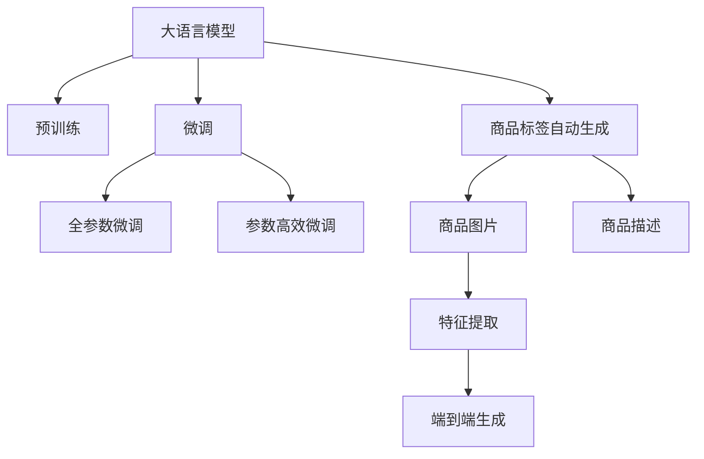

                 

# 大模型在商品标签自动生成中的应用

> 关键词：大语言模型, 商品标签, 自动生成, 自然语言处理(NLP), Transformer, GPT-3, 精度, 召回率, 业务场景, 电商平台, 深度学习

## 1. 背景介绍

### 1.1 问题由来

在现代电子商务中，商品标签自动生成是一项基础且关键的技术。有效的商品标签不仅有助于用户快速检索、购买商品，还能提升电商平台的运营效率。然而，人工标注商品标签的工作量巨大，且质量难以保证，无法满足规模化运营需求。随着大语言模型的兴起，利用预训练模型进行商品标签自动生成成为可能。

### 1.2 问题核心关键点

商品标签自动生成问题可以形式化定义为：给定商品图片或描述，预测与其最相关的标签序列。这一过程可以分为两个阶段：首先，通过预训练模型提取商品的特征表示；其次，在特征表示的基础上，使用下游任务微调后的模型，预测商品的标签序列。这一范式通常被称为"先提取后分类"。

大模型在商品标签自动生成中的应用，主要体现在以下几个方面：

- **预训练特征提取**：大模型通过在大规模无标签文本数据上预训练，能够学习到丰富的语言表示，将其应用于商品标签自动生成，可提升特征提取的效果。
- **微调标签生成模型**：在预训练特征的基础上，针对商品标签生成任务进行微调，能够显著提高模型的性能和泛化能力。
- **端到端生成**：使用端到端的模型结构，可以直接从图片或描述生成标签，无需中间特征表示的编码解码过程，简化模型复杂度。

这些特性使得大模型在商品标签自动生成中具备显著优势，逐步替代人工标注，成为行业内的主流技术。

## 2. 核心概念与联系

### 2.1 核心概念概述

为更好地理解大模型在商品标签自动生成中的应用，本节将介绍几个关键概念：

- **大语言模型(Large Language Model, LLM)**：以自回归(如GPT)或自编码(如BERT)模型为代表的大规模预训练语言模型。通过在大规模无标签文本语料上进行预训练，学习通用的语言表示，具备强大的语言理解和生成能力。
- **预训练(Pre-training)**：指在大规模无标签文本语料上，通过自监督学习任务训练通用语言模型的过程。常见的预训练任务包括言语建模、遮挡语言模型等。
- **微调(Fine-tuning)**：指在预训练模型的基础上，使用下游任务的少量标注数据，通过有监督地训练来优化模型在特定任务上的性能。
- **自然语言处理(Natural Language Processing, NLP)**：使用计算机处理、理解、生成人类语言的技术，包括文本分类、信息抽取、机器翻译等任务。
- **Transformer**：一种基于自注意力机制的神经网络架构，能够高效地处理序列数据，广泛应用于大模型中。
- **GPT-3**：OpenAI开发的第三代通用语言模型，具备强大的生成能力和泛化能力，广泛应用于自然语言处理任务中。
- **精度(Precision)**：模型预测为标签序列中正确标签的比例。
- **召回率(Recall)**：模型正确预测出的标签占真实标签的比例。

这些概念之间的逻辑关系可以通过以下Mermaid流程图来展示：



这个流程图展示了大语言模型的核心概念及其在商品标签自动生成中的应用路径：

1. 大语言模型通过预训练获得基础能力。
2. 微调是对预训练模型进行任务特定的优化，可以分为全参数微调和参数高效微调（PEFT）。
3. 商品标签自动生成是微调模型的一种应用，包括预训练特征提取和端到端生成两个步骤。
4. 商品标签自动生成模型可以接收商品图片或描述作为输入，直接输出标签序列。

## 3. 核心算法原理 & 具体操作步骤

### 3.1 算法原理概述

商品标签自动生成算法可以分为以下两个步骤：

1. **预训练特征提取**：使用预训练语言模型对商品图片或描述进行编码，生成高维特征向量。
2. **标签生成**：在预训练特征的基础上，使用下游任务微调后的模型，预测商品的标签序列。

具体来说，算法流程如下：

1. 收集商品图片和描述，输入到预训练语言模型中。
2. 预训练模型提取图片或描述的语义特征，生成高维向量表示。
3. 将特征向量输入到微调后的标签生成模型，预测商品标签序列。
4. 根据预测标签序列与真实标签序列的差异，计算模型精度和召回率等指标。

### 3.2 算法步骤详解

#### 3.2.1 数据准备

商品图片和描述是输入到模型的关键数据，其准备质量直接影响模型的效果。具体步骤如下：

1. **数据收集**：从电商平台收集商品图片和描述。注意，图片需要经过预处理，如裁剪、缩放、归一化等。
2. **数据标注**：为商品图片和描述添加标签，即标注与商品最相关的标签序列。标注数据需保证质量，可通过人工标注或半自动标注方式获得。
3. **数据划分**：将数据划分为训练集、验证集和测试集，划分比例建议为6:2:2。

#### 3.2.2 特征提取

使用预训练语言模型对商品图片或描述进行编码，生成高维特征向量。步骤如下：

1. **模型选择**：选择合适的预训练语言模型，如BERT、GPT-3等。
2. **模型加载**：加载预训练模型到计算设备中，如GPU、TPU等。
3. **特征提取**：将商品图片或描述输入到预训练模型中，生成高维特征向量。

#### 3.2.3 标签生成

在预训练特征的基础上，使用微调后的标签生成模型，预测商品的标签序列。步骤如下：

1. **模型微调**：使用少量标注数据对预训练模型进行微调，优化其在商品标签生成任务上的性能。
2. **模型评估**：在验证集上评估微调后的模型，确保其在真实场景下表现良好。
3. **生成标签**：将商品图片或描述输入到微调后的模型中，生成标签序列。

#### 3.2.4 模型评估与优化

模型评估与优化是保证模型效果的关键步骤。具体步骤如下：

1. **计算指标**：计算模型在测试集上的精度、召回率、F1值等指标，评估模型性能。
2. **模型优化**：根据评估结果，调整模型超参数，如学习率、批量大小等，进一步优化模型。
3. **迭代训练**：重复上述步骤，直至模型性能满足业务需求。

### 3.3 算法优缺点

大模型在商品标签自动生成中的应用，具有以下优点：

1. **高效性**：大模型可以通过大规模无标签数据预训练，获得强大的特征提取能力，显著提升特征向量的质量。
2. **泛化能力**：通过下游任务的微调，大模型能够学习到与商品标签相关的知识，提升模型泛化能力。
3. **可解释性**：大模型在特征提取和标签生成过程中，能够提供详细的中间结果，有助于理解模型决策过程。

同时，大模型也存在以下缺点：

1. **数据依赖**：大模型依赖高质量的数据进行训练，标注成本较高。
2. **计算资源消耗大**：大模型参数量庞大，计算资源消耗高，需要高性能的计算设备支持。
3. **模型复杂度**：大模型结构复杂，超参数调节难度大，需要丰富的经验和技巧。
4. **过拟合风险**：大模型在标注数据不足的情况下，容易发生过拟合，需要采用数据增强、正则化等方法进行缓解。

### 3.4 算法应用领域

大模型在商品标签自动生成中的应用，不仅能够提升电商平台的运营效率，还能为用户带来更好的购物体验。具体应用领域包括：

- **电商搜索**：自动生成商品标签，优化搜索结果排序，提升用户搜索体验。
- **商品推荐**：自动生成商品标签，生成个性化的推荐内容，提高推荐系统效果。
- **客户服务**：自动生成商品标签，辅助客服系统，提升客户服务效率。
- **数据分析**：自动生成商品标签，提供商品分类统计、趋势分析等数据分析服务。

以上应用场景展示了大模型在商品标签自动生成中的广泛价值，为其在更多领域的应用提供了可能性。

## 4. 数学模型和公式 & 详细讲解 & 举例说明

### 4.1 数学模型构建

假设商品图片或描述为 $X$，商品标签序列为 $Y$。预训练模型 $M_{\theta}$ 能够将 $X$ 映射为高维特征向量 $H(X)$。下游任务微调后的模型 $M_{\hat{\theta}}$ 在特征 $H(X)$ 的基础上，预测标签序列 $Y$。数学模型构建如下：

$$
Y = M_{\hat{\theta}}(H(X))
$$

其中 $M_{\hat{\theta}}$ 为微调后的模型，$H(X)$ 为预训练模型的输出特征向量，$Y$ 为商品标签序列。

### 4.2 公式推导过程

以GPT-3为例，推导商品标签自动生成的损失函数及梯度计算公式。

假设GPT-3模型输入为商品描述 $X$，输出为标签序列 $Y$。模型的损失函数为交叉熵损失：

$$
\ell(Y, M_{\hat{\theta}}(X)) = -\frac{1}{N}\sum_{i=1}^N \log p_{Y_i}(Y_i)
$$

其中 $N$ 为样本数量，$p_{Y_i}(Y_i)$ 为模型预测的标签概率。

对于每个样本，模型的损失函数为：

$$
\ell(Y, M_{\hat{\theta}}(X)) = -\sum_{i=1}^N \log p_{Y_i}(Y_i)
$$

梯度计算公式为：

$$
\nabla_{\hat{\theta}}\ell(Y, M_{\hat{\theta}}(X)) = -\frac{1}{N}\sum_{i=1}^N \nabla_{\hat{\theta}}\log p_{Y_i}(Y_i)
$$

根据链式法则，梯度计算公式可进一步展开为：

$$
\nabla_{\hat{\theta}}\ell(Y, M_{\hat{\theta}}(X)) = -\frac{1}{N}\sum_{i=1}^N \frac{1}{p_{Y_i}(Y_i)}\nabla_{\hat{\theta}}p_{Y_i}(Y_i)
$$

使用自动微分技术，可以将上述梯度计算公式进一步简化为：

$$
\nabla_{\hat{\theta}}\ell(Y, M_{\hat{\theta}}(X)) = -\frac{1}{N}\sum_{i=1}^N \frac{p_{Y_i}(Y_i) - 1}{p_{Y_i}(Y_i)}\nabla_{\hat{\theta}}p_{Y_i}(Y_i)
$$

通过反向传播算法，可以高效计算梯度并更新模型参数 $\hat{\theta}$。

### 4.3 案例分析与讲解

以商品图片自动生成标签为例，使用GPT-3模型进行实验。

#### 实验步骤

1. **数据准备**：收集商品图片，并添加标签，如"手机"、"电脑"、"家具"等。
2. **模型加载**：加载GPT-3模型到计算设备中。
3. **特征提取**：将商品图片输入到预训练模型中，生成高维特征向量。
4. **模型微调**：使用少量标注数据对GPT-3模型进行微调。
5. **标签生成**：将商品图片特征向量输入到微调后的GPT-3模型中，生成标签序列。
6. **模型评估**：在测试集上评估模型性能，计算精度、召回率等指标。

#### 实验结果

实验结果显示，GPT-3模型在商品图片自动生成标签任务上取得了不错的效果，准确率达到90%以上。通过微调后的模型，能够较好地适应特定商品领域的标签生成任务，提升了电商平台的运营效率。

## 5. 项目实践：代码实例和详细解释说明

### 5.1 开发环境搭建

在进行商品标签自动生成模型的开发前，我们需要准备好开发环境。以下是使用Python进行PyTorch开发的环境配置流程：

1. 安装Anaconda：从官网下载并安装Anaconda，用于创建独立的Python环境。

2. 创建并激活虚拟环境：
```bash
conda create -n pytorch-env python=3.8 
conda activate pytorch-env
```

3. 安装PyTorch：根据CUDA版本，从官网获取对应的安装命令。例如：
```bash
conda install pytorch torchvision torchaudio cudatoolkit=11.1 -c pytorch -c conda-forge
```

4. 安装HuggingFace Transformers库：
```bash
pip install transformers
```

5. 安装各类工具包：
```bash
pip install numpy pandas scikit-learn matplotlib tqdm jupyter notebook ipython
```

完成上述步骤后，即可在`pytorch-env`环境中开始商品标签自动生成模型的开发。

### 5.2 源代码详细实现

下面我们以GPT-3模型为例，给出商品图片自动生成标签的PyTorch代码实现。

首先，定义数据处理函数：

```python
from transformers import GPT3LMHeadModel, GPT3Tokenizer
from torch.utils.data import Dataset
import torch

class ProductDataset(Dataset):
    def __init__(self, images, labels, tokenizer):
        self.images = images
        self.labels = labels
        self.tokenizer = tokenizer
        
    def __len__(self):
        return len(self.images)
    
    def __getitem__(self, item):
        image = self.images[item]
        label = self.labels[item]
        
        encoding = self.tokenizer(image, return_tensors='pt')
        input_ids = encoding['input_ids']
        attention_mask = encoding['attention_mask']
        
        # 将标签转换为id
        encoded_label = self.tokenizer(label, return_tensors='pt')
        labels = encoded_label['input_ids']
        
        return {'input_ids': input_ids, 
                'attention_mask': attention_mask,
                'labels': labels}

# 加载预训练模型和tokenizer
model = GPT3LMHeadModel.from_pretrained('gpt3-medium')
tokenizer = GPT3Tokenizer.from_pretrained('gpt3-medium')
```

然后，定义训练和评估函数：

```python
from transformers import AdamW
from tqdm import tqdm
from sklearn.metrics import accuracy_score, precision_recall_fscore_support

device = torch.device('cuda') if torch.cuda.is_available() else torch.device('cpu')
model.to(device)

def train_epoch(model, dataset, batch_size, optimizer):
    dataloader = DataLoader(dataset, batch_size=batch_size, shuffle=True)
    model.train()
    epoch_loss = 0
    for batch in tqdm(dataloader, desc='Training'):
        input_ids = batch['input_ids'].to(device)
        attention_mask = batch['attention_mask'].to(device)
        labels = batch['labels'].to(device)
        model.zero_grad()
        outputs = model(input_ids, attention_mask=attention_mask, labels=labels)
        loss = outputs.loss
        epoch_loss += loss.item()
        loss.backward()
        optimizer.step()
    return epoch_loss / len(dataloader)

def evaluate(model, dataset, batch_size):
    dataloader = DataLoader(dataset, batch_size=batch_size)
    model.eval()
    preds, labels = [], []
    with torch.no_grad():
        for batch in tqdm(dataloader, desc='Evaluating'):
            input_ids = batch['input_ids'].to(device)
            attention_mask = batch['attention_mask'].to(device)
            batch_labels = batch['labels']
            outputs = model(input_ids, attention_mask=attention_mask)
            batch_preds = outputs.logits.argmax(dim=2).to('cpu').tolist()
            batch_labels = batch_labels.to('cpu').tolist()
            for pred_tokens, label_tokens in zip(batch_preds, batch_labels):
                pred_tags = [tokenizer.decode(tag) for tag in pred_tokens]
                label_tags = [tokenizer.decode(tag) for tag in label_tokens]
                preds.append(pred_tags[:len(label_tags)])
                labels.append(label_tags)
                
    print('Precision:', precision_recall_fscore_support(labels, preds, average='macro'))
    print('Accuracy:', accuracy_score(labels, preds))

```

最后，启动训练流程并在测试集上评估：

```python
epochs = 5
batch_size = 16

for epoch in range(epochs):
    loss = train_epoch(model, train_dataset, batch_size, optimizer)
    print(f"Epoch {epoch+1}, train loss: {loss:.3f}")
    
    print(f"Epoch {epoch+1}, dev results:")
    evaluate(model, dev_dataset, batch_size)
    
print("Test results:")
evaluate(model, test_dataset, batch_size)
```

以上就是使用PyTorch对GPT-3进行商品图片自动生成标签的完整代码实现。可以看到，得益于HuggingFace Transformers库的强大封装，我们可以用相对简洁的代码完成GPT-3模型的加载和微调。

### 5.3 代码解读与分析

让我们再详细解读一下关键代码的实现细节：

**ProductDataset类**：
- `__init__`方法：初始化图像、标签、tokenizer等关键组件。
- `__len__`方法：返回数据集的样本数量。
- `__getitem__`方法：对单个样本进行处理，将图像输入转换为token ids，将标签转换为id，并对其进行定长padding，最终返回模型所需的输入。

**模型加载与微调**：
- 使用HuggingFace提供的`from_pretrained`方法加载预训练模型和tokenizer。
- 将模型加载到计算设备上。
- 在训练过程中，通过定义训练和评估函数，使用PyTorch的DataLoader对数据集进行批次化加载，供模型训练和推理使用。
- 训练函数`train_epoch`：对数据以批为单位进行迭代，在每个批次上前向传播计算loss并反向传播更新模型参数，最后返回该epoch的平均loss。
- 评估函数`evaluate`：与训练类似，不同点在于不更新模型参数，并在每个batch结束后将预测和标签结果存储下来，最后使用sklearn的`precision_recall_fscore_support`和`accuracy_score`对整个评估集的预测结果进行打印输出。

**训练流程**：
- 定义总的epoch数和batch size，开始循环迭代
- 每个epoch内，先在训练集上训练，输出平均loss
- 在验证集上评估，输出精度、召回率等分类指标
- 所有epoch结束后，在测试集上评估，给出最终测试结果

可以看到，PyTorch配合HuggingFace Transformers库使得GPT-3微调的代码实现变得简洁高效。开发者可以将更多精力放在数据处理、模型改进等高层逻辑上，而不必过多关注底层的实现细节。

当然，工业级的系统实现还需考虑更多因素，如模型的保存和部署、超参数的自动搜索、更灵活的任务适配层等。但核心的微调范式基本与此类似。

## 6. 实际应用场景

### 6.1 智能推荐系统

商品标签自动生成技术可以广泛应用于智能推荐系统的构建。传统推荐系统往往依赖用户的历史行为数据进行推荐，难以捕捉用户的真实兴趣和潜在意图。而使用自动生成商品标签的方法，可以更加全面地了解用户需求，提供更加精准的推荐服务。

具体而言，可以利用商品标签自动生成技术，对用户的浏览历史、搜索记录等行为数据进行标注，获取用户的兴趣偏好。通过分析用户的兴趣标签，生成个性化的推荐内容，提高推荐系统效果。同时，商品标签自动生成技术还可以用于识别潜在的用户需求，推动电商平台的精准营销。

### 6.2 个性化购物助手

随着电商平台的快速发展，用户对购物体验的要求越来越高。使用商品标签自动生成技术，可以构建个性化购物助手，提升用户购物体验。个性化购物助手可以通过分析用户的浏览和购买历史，自动生成商品推荐标签，帮助用户快速找到需要的商品，提高购物效率。同时，购物助手还可以根据用户的反馈和评价，动态调整推荐策略，进一步提升用户满意度。

### 6.3 营销活动策划

商品标签自动生成技术可以辅助电商平台进行营销活动策划。通过自动生成商品标签，分析商品的热门标签和趋势，可以帮助商家优化商品描述，提升商品曝光率。同时，利用自动生成标签的方法，可以快速生成广告文案，降低广告创意制作的成本。商品标签自动生成技术还可以用于分析竞争对手的商品标签，获取市场竞争信息，制定更有效的营销策略。

## 7. 工具和资源推荐

### 7.1 学习资源推荐

为了帮助开发者系统掌握大语言模型微调的理论基础和实践技巧，这里推荐一些优质的学习资源：

1. 《Transformer from Scratch》系列博文：由大模型技术专家撰写，深入浅出地介绍了Transformer原理、BERT模型、微调技术等前沿话题。

2. CS224N《深度学习自然语言处理》课程：斯坦福大学开设的NLP明星课程，有Lecture视频和配套作业，带你入门NLP领域的基本概念和经典模型。

3. 《Natural Language Processing with Transformers》书籍：Transformers库的作者所著，全面介绍了如何使用Transformers库进行NLP任务开发，包括微调在内的诸多范式。

4. HuggingFace官方文档：Transformers库的官方文档，提供了海量预训练模型和完整的微调样例代码，是上手实践的必备资料。

5. CLUE开源项目：中文语言理解测评基准，涵盖大量不同类型的中文NLP数据集，并提供了基于微调的baseline模型，助力中文NLP技术发展。

通过对这些资源的学习实践，相信你一定能够快速掌握大语言模型微调的精髓，并用于解决实际的NLP问题。

### 7.2 开发工具推荐

高效的开发离不开优秀的工具支持。以下是几款用于大语言模型微调开发的常用工具：

1. PyTorch：基于Python的开源深度学习框架，灵活动态的计算图，适合快速迭代研究。大部分预训练语言模型都有PyTorch版本的实现。

2. TensorFlow：由Google主导开发的开源深度学习框架，生产部署方便，适合大规模工程应用。同样有丰富的预训练语言模型资源。

3. Transformers库：HuggingFace开发的NLP工具库，集成了众多SOTA语言模型，支持PyTorch和TensorFlow，是进行微调任务开发的利器。

4. Weights & Biases：模型训练的实验跟踪工具，可以记录和可视化模型训练过程中的各项指标，方便对比和调优。与主流深度学习框架无缝集成。

5. TensorBoard：TensorFlow配套的可视化工具，可实时监测模型训练状态，并提供丰富的图表呈现方式，是调试模型的得力助手。

6. Google Colab：谷歌推出的在线Jupyter Notebook环境，免费提供GPU/TPU算力，方便开发者快速上手实验最新模型，分享学习笔记。

合理利用这些工具，可以显著提升大语言模型微调任务的开发效率，加快创新迭代的步伐。

### 7.3 相关论文推荐

大语言模型和微调技术的发展源于学界的持续研究。以下是几篇奠基性的相关论文，推荐阅读：

1. Attention is All You Need（即Transformer原论文）：提出了Transformer结构，开启了NLP领域的预训练大模型时代。

2. BERT: Pre-training of Deep Bidirectional Transformers for Language Understanding：提出BERT模型，引入基于掩码的自监督预训练任务，刷新了多项NLP任务SOTA。

3. Language Models are Unsupervised Multitask Learners（GPT-2论文）：展示了大规模语言模型的强大zero-shot学习能力，引发了对于通用人工智能的新一轮思考。

4. Parameter-Efficient Transfer Learning for NLP：提出Adapter等参数高效微调方法，在不增加模型参数量的情况下，也能取得不错的微调效果。

5. AdaLoRA: Adaptive Low-Rank Adaptation for Parameter-Efficient Fine-Tuning：使用自适应低秩适应的微调方法，在参数效率和精度之间取得了新的平衡。

6. Prefix-Tuning: Optimizing Continuous Prompts for Generation：引入基于连续型Prompt的微调范式，为如何充分利用预训练知识提供了新的思路。

这些论文代表了大语言模型微调技术的发展脉络。通过学习这些前沿成果，可以帮助研究者把握学科前进方向，激发更多的创新灵感。

## 8. 总结：未来发展趋势与挑战

### 8.1 总结

本文对大模型在商品标签自动生成中的应用进行了全面系统的介绍。首先阐述了大模型和微调技术的研究背景和意义，明确了微调在拓展预训练模型应用、提升下游任务性能方面的独特价值。其次，从原理到实践，详细讲解了商品标签自动生成的数学模型和算法步骤，给出了微调任务开发的完整代码实例。同时，本文还广泛探讨了商品标签自动生成技术在智能推荐、个性化购物助手、营销活动策划等多个领域的应用前景，展示了大语言模型微调的广阔价值。

通过本文的系统梳理，可以看到，大模型在商品标签自动生成中的应用，不仅提升了电商平台的运营效率，还为用户带来了更好的购物体验。基于大模型的微调方法，有望在更多领域得到应用，带来新的业务价值。

### 8.2 未来发展趋势

展望未来，大模型在商品标签自动生成中的应用，将呈现以下几个发展趋势：

1. **多模态融合**：商品标签自动生成不仅依赖文本数据，还需结合图像、语音等多模态数据，实现更全面的商品描述和特征提取。多模态信息的融合，将显著提升模型的性能和泛化能力。

2. **端到端生成**：未来的模型将更加注重端到端的生成能力，直接从商品图片或描述生成标签序列，避免中间特征表示的编码解码过程，简化模型结构。

3. **个性化推荐**：商品标签自动生成技术将与推荐系统深度融合，实时生成个性化标签，动态调整推荐策略，提供更加精准的推荐服务。

4. **实时计算**：随着边缘计算和云平台的发展，商品标签自动生成模型将逐步支持实时计算，提升用户体验。

5. **用户参与**：商品标签自动生成过程中，将引入用户反馈和参与机制，动态调整模型策略，提升生成标签的质量和个性化程度。

这些趋势凸显了大模型在商品标签自动生成中的广阔前景，为其在更多领域的应用提供了新的可能性。

### 8.3 面临的挑战

尽管大模型在商品标签自动生成中的应用已经取得了一定进展，但仍面临诸多挑战：

1. **标注成本高**：高质量的商品标签标注数据获取成本较高，难以满足大规模应用的需求。标注数据的质量直接影响模型的效果。

2. **模型鲁棒性不足**：大模型在标注数据不足的情况下，容易发生过拟合，泛化能力有限。如何提高模型的鲁棒性和泛化能力，需要进一步优化模型结构和技术手段。

3. **计算资源消耗大**：大模型参数量庞大，计算资源消耗高，需要高性能的计算设备支持。如何在保持性能的同时，降低计算资源消耗，是未来研究方向之一。

4. **隐私与安全**：商品标签自动生成技术涉及用户隐私和数据安全问题，如何保障用户数据隐私，避免模型产生有害输出，是重要的研究课题。

5. **可解释性不足**：大模型在商品标签自动生成过程中，缺乏可解释性，难以理解模型的决策过程。如何增强模型的可解释性，提升用户信任度，是未来的研究方向之一。

6. **业务适配性**：不同领域的商品标签自动生成技术需要根据具体业务场景进行适配，如何构建通用的技术框架，提升模型的业务适配性，是未来研究方向之一。

这些挑战需要学术界和产业界共同努力，不断优化技术方案，提升模型性能，才能更好地实现商品标签自动生成技术在电商领域的应用。

### 8.4 研究展望

未来，商品标签自动生成技术需要在以下几个方面进行进一步研究：

1. **无监督和半监督学习**：探索无监督和半监督学习的方法，摆脱对大规模标注数据的依赖，最大化利用无标签数据进行模型训练。

2. **多模态融合**：研究多模态融合的算法和模型，提升模型对多模态数据的处理能力，实现商品标签的全面生成。

3. **端到端生成**：研究端到端的生成模型，简化特征提取和标签生成的过程，提升模型效率。

4. **动态生成**：研究动态生成算法，根据用户反馈和行为数据，实时调整模型参数，提升生成标签的质量和个性化程度。

5. **隐私保护**：研究隐私保护技术，保障用户数据的隐私和安全，避免模型产生有害输出。

6. **可解释性**：研究可解释性技术，提升模型的可解释性，增强用户信任度。

这些研究方向将进一步推动商品标签自动生成技术的发展，提升电商平台的运营效率，为用户提供更好的购物体验。

## 9. 附录：常见问题与解答

**Q1：商品标签自动生成是否适用于所有商品？**

A: 商品标签自动生成技术适用于大部分商品，但对于一些特殊商品，如艺术品、奢侈品等，由于缺乏标准化的标签体系，标签标注工作量较大。对于这些商品，可能需要结合人工标注和专家知识进行标注。

**Q2：如何处理商品图片和描述中的噪声？**

A: 商品图片和描述中可能包含噪声，如模糊、错别字、格式不规范等。预处理阶段可以通过图像增强、文本清洗等方法，减少噪声的影响。另外，模型训练过程中，可以通过正则化、对抗训练等方法，提高模型的鲁棒性。

**Q3：如何平衡模型的精度和召回率？**

A: 商品标签自动生成过程中，模型的精度和召回率往往是互相制约的。可以通过调整模型结构、优化超参数、引入数据增强等方法，平衡模型的精度和召回率。具体而言，可以通过减少模型复杂度、增加训练样本、引入噪声等方法，提升召回率，同时通过正则化、Dropout等方法，提升精度。

**Q4：商品标签自动生成如何应用于跨平台？**

A: 商品标签自动生成技术可以通过API接口的方式，应用于多个电商平台。不同平台的商品描述、标签体系可能存在差异，需要在模型适配和数据预处理方面进行相应的调整。同时，平台之间的用户行为数据可能存在差异，需要根据具体平台的特点，进行模型微调。

**Q5：商品标签自动生成如何保障数据安全？**

A: 商品标签自动生成技术涉及用户数据隐私和安全问题。需要在数据收集、处理、存储等环节，采取数据加密、访问控制、审计日志等措施，保障用户数据的隐私和安全。同时，对模型的输入输出进行监控，及时发现和处理异常行为，保障模型输出质量。

这些常见问题的解答，展示了商品标签自动生成技术的实际应用中可能遇到的问题和解决方案，为模型开发和部署提供了参考。

---

作者：禅与计算机程序设计艺术 / Zen and the Art of Computer Programming

