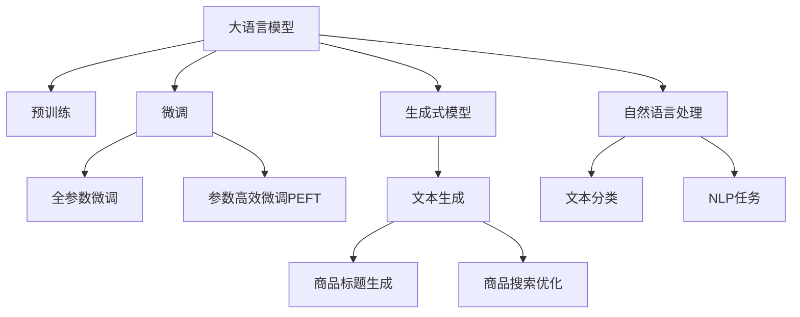

                 

# 大模型在商品标题优化中的应用

> 关键词：大语言模型,商品标题优化,生成式模型,自然语言处理,文本生成,预训练,微调,商品推荐,搜索引擎优化

## 1. 背景介绍

### 1.1 问题由来

在当今互联网时代，电子商务平台的竞争日益激烈。为了提高商品搜索的精准度和用户体验，商家需要为每件商品生成一个精准、吸引人的标题。好的商品标题不仅可以增加商品的曝光率，还能提升点击率和销售额。然而，传统的手动撰写商品标题耗时费力，且容易产生重复和错误。因此，利用AI技术自动生成高质量的商品标题，成为了提高电商平台竞争力的一个重要方向。

近年来，基于大语言模型的大规模预训练技术取得突破，如BERT、GPT等模型已经在各种自然语言处理任务上取得了卓越的成绩。这些模型通过在海量无标签文本数据上进行预训练，学习到了丰富的语言知识和表示能力。本文将介绍如何利用大语言模型在商品标题优化中的应用，通过自动化生成商品标题，提高商品搜索的准确性和用户体验。

### 1.2 问题核心关键点

大语言模型在商品标题优化中的应用，主要集中在两个方面：

1. **商品描述生成**：通过大语言模型，可以从商品的属性、用途、品牌等元素中生成精准、自然的商品标题，无需手动编写，节省人力成本。
2. **商品搜索优化**：生成高质量的商品标题，可以提升搜索的匹配度，使搜索结果更加准确，提高用户的点击率，从而提升销售转化率。

基于大语言模型的商品标题优化，可以应用在多个环节，如商品列表页的自动生成、搜索引擎优化(搜索引擎优化, SEO)、个性化推荐等。本节将重点讨论如何在商品标题生成和搜索优化中使用大语言模型。

## 2. 核心概念与联系

### 2.1 核心概念概述

为了更好地理解大语言模型在商品标题优化中的应用，本节将介绍几个核心概念：

- **大语言模型(Large Language Model, LLM)**：以自回归(如GPT)或自编码(如BERT)模型为代表的大规模预训练语言模型。通过在海量无标签文本语料上进行预训练，学习通用的语言表示。
- **预训练(Pre-training)**：指在大规模无标签文本语料上，通过自监督学习任务训练通用语言模型的过程。常见的预训练任务包括言语建模、遮挡语言模型等。
- **微调(Fine-tuning)**：指在预训练模型的基础上，使用下游任务的少量标注数据，通过有监督学习优化模型在特定任务上的性能。通常只需要调整顶层分类器或解码器，并以较小的学习率更新全部或部分的模型参数。
- **生成式模型(Generative Model)**：通过学习数据分布，能够直接生成新的数据样本的模型，如GPT、LSTM等。
- **自然语言处理(Natural Language Processing, NLP)**：研究如何让计算机理解和处理人类语言的技术，涵盖文本生成、文本分类、命名实体识别等多个方向。

这些核心概念之间的逻辑关系可以通过以下Mermaid流程图来展示：



这个流程图展示了大语言模型的核心概念及其之间的关系：

1. 大语言模型通过预训练获得基础能力。
2. 微调是对预训练模型进行任务特定的优化，可以分为全参数微调和参数高效微调（PEFT）。
3. 生成式模型通过学习数据分布，能够直接生成新的数据样本。
4. 生成式模型在商品标题生成和搜索优化中的应用，提高了电商平台的搜索精度和用户体验。
5. 自然语言处理是实现生成式模型的技术基础。

这些概念共同构成了大语言模型在商品标题优化中的应用框架，使其能够在各种场景下发挥强大的语言理解和生成能力。

## 3. 核心算法原理 & 具体操作步骤
### 3.1 算法原理概述

基于大语言模型在商品标题优化中的应用，主要涉及两个关键步骤：

1. **预训练模型的加载与微调**：选择适合的预训练语言模型，在商品描述等数据上对其进行微调，生成高质量的商品标题。
2. **商品标题生成与搜索优化**：使用微调后的模型生成商品标题，并结合搜索引擎优化技术，提升商品搜索的匹配度和用户体验。

预训练语言模型在大规模无标签文本数据上进行预训练，学习到通用的语言知识和表示能力。这些知识可以迁移到商品标题生成和搜索优化任务中，通过微调进一步提升模型的性能。微调过程主要通过损失函数和优化算法（如Adam、SGD等）进行模型参数的更新，使其适应具体任务的要求。

生成式模型直接学习数据的分布，能够生成高质量的商品标题。这些标题不仅精准描述商品属性，还能吸引用户的注意力。在实际应用中，通常通过训练一个生成式模型，使用其对商品描述进行编码，再生成标题。

### 3.2 算法步骤详解

以下详细描述商品标题优化的算法步骤：

**Step 1: 准备预训练模型和数据集**
- 选择合适的预训练语言模型 $M_{\theta}$ 作为初始化参数，如 BERT、GPT等。
- 收集商品描述、属性、用途等文本数据，作为微调的数据集 $D=\{(x_i,y_i)\}_{i=1}^N$，其中 $x_i$ 为商品描述，$y_i$ 为对应的商品标题。

**Step 2: 添加任务适配层**
- 根据任务类型，在预训练模型顶层设计合适的输出层和损失函数。
- 对于商品标题生成任务，通常在顶层添加语言模型的解码器，输出概率分布。
- 对于商品搜索优化任务，可以添加一个二分类器，用于判断生成的标题是否与搜索意图匹配。

**Step 3: 设置微调超参数**
- 选择合适的优化算法及其参数，如 Adam、SGD 等，设置学习率、批大小、迭代轮数等。
- 设置正则化技术及强度，包括权重衰减、Dropout、Early Stopping等。
- 确定冻结预训练参数的策略，如仅微调顶层，或全部参数都参与微调。

**Step 4: 执行梯度训练**
- 将训练集数据分批次输入模型，前向传播计算损失函数。
- 反向传播计算参数梯度，根据设定的优化算法和学习率更新模型参数。
- 周期性在验证集上评估模型性能，根据性能指标决定是否触发 Early Stopping。
- 重复上述步骤直到满足预设的迭代轮数或 Early Stopping 条件。

**Step 5: 生成和优化商品标题**
- 在测试集上使用微调后的模型生成商品标题。
- 结合搜索引擎优化技术，提升商品标题的搜索匹配度。

**Step 6: 应用商品标题**
- 将生成的商品标题应用于商品列表页、广告等位置，提高用户的点击率和转化率。

### 3.3 算法优缺点

基于大语言模型在商品标题优化中的应用，具有以下优点：

1. **节省人力成本**：自动生成商品标题，无需人工编写，节省大量时间。
2. **提高标题质量**：生成的高质量标题，能够精准描述商品属性，吸引用户点击。
3. **提升搜索匹配度**：生成标题结合搜索引擎优化技术，提升搜索的匹配度，提高点击率。
4. **灵活调整**：通过微调模型，可以根据不同的商品属性和用户需求，灵活生成不同类型的标题。

同时，该方法也存在一些局限性：

1. **依赖数据质量**：微调的效果很大程度上取决于商品描述和标注数据的质量，获取高质量数据成本较高。
2. **泛化能力有限**：当商品描述和用户需求差异较大时，微调的性能提升有限。
3. **过拟合风险**：微调过程中，如果数据量过少，容易发生过拟合现象，导致生成的标题无法泛化到新场景。
4. **技术门槛高**：需要一定的NLP技术基础，对开发者提出了较高的要求。

尽管存在这些局限性，但就目前而言，基于大语言模型的商品标题优化方法，在电商平台上得到了广泛应用，并取得了显著的效果。

### 3.4 算法应用领域

基于大语言模型在商品标题优化中的应用，已经广泛应用于以下领域：

1. **电商平台**：为商品自动生成高质量标题，提高商品搜索匹配度和用户体验。
2. **搜索引擎**：提升搜索结果的展示效果，增加用户点击率。
3. **广告投放**：生成精准的广告标题，提高广告的点击率和转化率。
4. **内容生成**：自动生成文章标题、产品描述等，提高内容生产的效率。

除了上述这些主要应用外，大语言模型在商品标题优化中的潜力还在不断挖掘，未来将在更多场景中发挥重要作用。

## 4. 数学模型和公式 & 详细讲解  
### 4.1 数学模型构建

假设预训练语言模型为 $M_{\theta}:\mathcal{X} \rightarrow \mathcal{Y}$，其中 $\mathcal{X}$ 为输入空间，$\mathcal{Y}$ 为输出空间，$\theta \in \mathbb{R}^d$ 为模型参数。商品描述 $x_i$ 和对应的商品标题 $y_i$ 构成了微调的数据集 $D=\{(x_i,y_i)\}_{i=1}^N$。

定义模型 $M_{\theta}$ 在商品描述 $x_i$ 上的生成概率为 $P(y_i|x_i)$，则在数据集 $D$ 上的经验风险为：

$$
\mathcal{L}(\theta) = -\frac{1}{N}\sum_{i=1}^N \log P(y_i|x_i)
$$

微调的优化目标是最小化经验风险，即找到最优参数：

$$
\theta^* = \mathop{\arg\min}_{\theta} \mathcal{L}(\theta)
$$

在实践中，我们通常使用基于梯度的优化算法（如SGD、Adam等）来近似求解上述最优化问题。设 $\eta$ 为学习率，$\lambda$ 为正则化系数，则参数的更新公式为：

$$
\theta \leftarrow \theta - \eta \nabla_{\theta}\mathcal{L}(\theta) - \eta\lambda\theta
$$

其中 $\nabla_{\theta}\mathcal{L}(\theta)$ 为损失函数对参数 $\theta$ 的梯度，可通过反向传播算法高效计算。

### 4.2 公式推导过程

以下我们以商品标题生成任务为例，推导生成式模型的交叉熵损失函数及其梯度的计算公式。

假设模型 $M_{\theta}$ 在输入 $x_i$ 上的输出为 $\hat{y}=M_{\theta}(x_i) \in [0,1]$，表示样本生成标题的概率。真实标签 $y_i \in \{1,0\}$，表示商品标题是否符合生成标准。则二分类交叉熵损失函数定义为：

$$
\ell(M_{\theta}(x_i),y_i) = -[y_i\log \hat{y} + (1-y_i)\log (1-\hat{y})]
$$

将其代入经验风险公式，得：

$$
\mathcal{L}(\theta) = -\frac{1}{N}\sum_{i=1}^N [y_i\log M_{\theta}(x_i)+(1-y_i)\log(1-M_{\theta}(x_i))]
$$

根据链式法则，损失函数对参数 $\theta_k$ 的梯度为：

$$
\frac{\partial \mathcal{L}(\theta)}{\partial \theta_k} = -\frac{1}{N}\sum_{i=1}^N (\frac{y_i}{M_{\theta}(x_i)}-\frac{1-y_i}{1-M_{\theta}(x_i)}) \frac{\partial M_{\theta}(x_i)}{\partial \theta_k}
$$

其中 $\frac{\partial M_{\theta}(x_i)}{\partial \theta_k}$ 可进一步递归展开，利用自动微分技术完成计算。

在得到损失函数的梯度后，即可带入参数更新公式，完成模型的迭代优化。重复上述过程直至收敛，最终得到适应商品标题生成任务的最优模型参数 $\theta^*$。

## 5. 项目实践：代码实例和详细解释说明
### 5.1 开发环境搭建

在进行商品标题优化实践前，我们需要准备好开发环境。以下是使用Python进行PyTorch开发的环境配置流程：

1. 安装Anaconda：从官网下载并安装Anaconda，用于创建独立的Python环境。

2. 创建并激活虚拟环境：
```bash
conda create -n pytorch-env python=3.8 
conda activate pytorch-env
```

3. 安装PyTorch：根据CUDA版本，从官网获取对应的安装命令。例如：
```bash
conda install pytorch torchvision torchaudio cudatoolkit=11.1 -c pytorch -c conda-forge
```

4. 安装Transformers库：
```bash
pip install transformers
```

5. 安装各类工具包：
```bash
pip install numpy pandas scikit-learn matplotlib tqdm jupyter notebook ipython
```

完成上述步骤后，即可在`pytorch-env`环境中开始商品标题优化的实践。

### 5.2 源代码详细实现

这里我们以商品标题生成任务为例，给出使用Transformers库对BERT模型进行微调的PyTorch代码实现。

首先，定义商品标题生成的数据处理函数：

```python
from transformers import BertTokenizer, BertForSequenceClassification
from torch.utils.data import Dataset
import torch

class TitleDataset(Dataset):
    def __init__(self, texts, labels, tokenizer, max_len=128):
        self.texts = texts
        self.labels = labels
        self.tokenizer = tokenizer
        self.max_len = max_len
        
    def __len__(self):
        return len(self.texts)
    
    def __getitem__(self, item):
        text = self.texts[item]
        label = self.labels[item]
        
        encoding = self.tokenizer(text, return_tensors='pt', max_length=self.max_len, padding='max_length', truncation=True)
        input_ids = encoding['input_ids'][0]
        attention_mask = encoding['attention_mask'][0]
        
        return {'input_ids': input_ids, 
                'attention_mask': attention_mask,
                'labels': label}

# 创建dataset
tokenizer = BertTokenizer.from_pretrained('bert-base-cased')

train_dataset = TitleDataset(train_texts, train_labels, tokenizer)
dev_dataset = TitleDataset(dev_texts, dev_labels, tokenizer)
test_dataset = TitleDataset(test_texts, test_labels, tokenizer)
```

然后，定义模型和优化器：

```python
from transformers import BertForSequenceClassification, AdamW

model = BertForSequenceClassification.from_pretrained('bert-base-cased', num_labels=2)

optimizer = AdamW(model.parameters(), lr=2e-5)
```

接着，定义训练和评估函数：

```python
from torch.utils.data import DataLoader
from tqdm import tqdm
from sklearn.metrics import accuracy_score

device = torch.device('cuda') if torch.cuda.is_available() else torch.device('cpu')
model.to(device)

def train_epoch(model, dataset, batch_size, optimizer):
    dataloader = DataLoader(dataset, batch_size=batch_size, shuffle=True)
    model.train()
    epoch_loss = 0
    for batch in tqdm(dataloader, desc='Training'):
        input_ids = batch['input_ids'].to(device)
        attention_mask = batch['attention_mask'].to(device)
        labels = batch['labels'].to(device)
        model.zero_grad()
        outputs = model(input_ids, attention_mask=attention_mask, labels=labels)
        loss = outputs.loss
        epoch_loss += loss.item()
        loss.backward()
        optimizer.step()
    return epoch_loss / len(dataloader)

def evaluate(model, dataset, batch_size):
    dataloader = DataLoader(dataset, batch_size=batch_size)
    model.eval()
    preds, labels = [], []
    with torch.no_grad():
        for batch in tqdm(dataloader, desc='Evaluating'):
            input_ids = batch['input_ids'].to(device)
            attention_mask = batch['attention_mask'].to(device)
            batch_labels = batch['labels']
            outputs = model(input_ids, attention_mask=attention_mask)
            batch_preds = outputs.logits.argmax(dim=2).to('cpu').tolist()
            batch_labels = batch_labels.to('cpu').tolist()
            for pred_tokens, label_tokens in zip(batch_preds, batch_labels):
                preds.append(pred_tokens[:len(label_tokens)])
                labels.append(label_tokens)
                
    print(accuracy_score(labels, preds))
```

最后，启动训练流程并在测试集上评估：

```python
epochs = 5
batch_size = 16

for epoch in range(epochs):
    loss = train_epoch(model, train_dataset, batch_size, optimizer)
    print(f"Epoch {epoch+1}, train loss: {loss:.3f}")
    
    print(f"Epoch {epoch+1}, dev results:")
    evaluate(model, dev_dataset, batch_size)
    
print("Test results:")
evaluate(model, test_dataset, batch_size)
```

以上就是使用PyTorch对BERT进行商品标题生成任务的完整代码实现。可以看到，得益于Transformers库的强大封装，我们可以用相对简洁的代码完成BERT模型的加载和微调。

### 5.3 代码解读与分析

让我们再详细解读一下关键代码的实现细节：

**TitleDataset类**：
- `__init__`方法：初始化文本、标签、分词器等关键组件。
- `__len__`方法：返回数据集的样本数量。
- `__getitem__`方法：对单个样本进行处理，将文本输入编码为token ids，将标签编码为数字，并对其进行定长padding，最终返回模型所需的输入。

**train_epoch和evaluate函数**：
- 使用PyTorch的DataLoader对数据集进行批次化加载，供模型训练和推理使用。
- 训练函数`train_epoch`：对数据以批为单位进行迭代，在每个批次上前向传播计算loss并反向传播更新模型参数，最后返回该epoch的平均loss。
- 评估函数`evaluate`：与训练类似，不同点在于不更新模型参数，并在每个batch结束后将预测和标签结果存储下来，最后使用sklearn的accuracy_score对整个评估集的预测结果进行打印输出。

**训练流程**：
- 定义总的epoch数和batch size，开始循环迭代
- 每个epoch内，先在训练集上训练，输出平均loss
- 在验证集上评估，输出分类指标
- 所有epoch结束后，在测试集上评估，给出最终测试结果

可以看到，PyTorch配合Transformers库使得BERT微调的代码实现变得简洁高效。开发者可以将更多精力放在数据处理、模型改进等高层逻辑上，而不必过多关注底层的实现细节。

当然，工业级的系统实现还需考虑更多因素，如模型的保存和部署、超参数的自动搜索、更灵活的任务适配层等。但核心的微调范式基本与此类似。

## 6. 实际应用场景
### 6.1 智能客服系统

基于大语言模型在商品标题优化中的应用，可以应用于智能客服系统的构建。传统客服往往需要配备大量人力，高峰期响应缓慢，且一致性和专业性难以保证。而使用微调后的商品标题生成模型，可以7x24小时不间断服务，快速响应客户咨询，用自然流畅的语言解答各类常见问题。

在技术实现上，可以收集企业内部的历史客服对话记录，将问题和最佳答复构建成监督数据，在此基础上对预训练商品标题生成模型进行微调。微调后的模型能够自动理解用户意图，匹配最合适的答复，生成自然流畅的商品标题。对于客户提出的新问题，还可以接入检索系统实时搜索相关内容，动态组织生成回答。如此构建的智能客服系统，能大幅提升客户咨询体验和问题解决效率。

### 6.2 金融舆情监测

金融机构需要实时监测市场舆论动向，以便及时应对负面信息传播，规避金融风险。传统的人工监测方式成本高、效率低，难以应对网络时代海量信息爆发的挑战。基于大语言模型在商品标题生成和搜索优化中的应用，金融舆情监测也能得到新的解决方案。

具体而言，可以收集金融领域相关的新闻、报道、评论等文本数据，并对其进行主题标注和情感标注。在此基础上对预训练语言模型进行微调，使其能够自动判断文本属于何种主题，情感倾向是正面、中性还是负面。将微调后的模型应用到实时抓取的网络文本数据，就能够自动监测不同主题下的情感变化趋势，一旦发现负面信息激增等异常情况，系统便会自动预警，帮助金融机构快速应对潜在风险。

### 6.3 个性化推荐系统

当前的推荐系统往往只依赖用户的历史行为数据进行物品推荐，无法深入理解用户的真实兴趣偏好。基于大语言模型在商品标题生成中的应用，个性化推荐系统可以更好地挖掘用户行为背后的语义信息，从而提供更精准、多样的推荐内容。

在实践中，可以收集用户浏览、点击、评论、分享等行为数据，提取和用户交互的物品标题、描述、标签等文本内容。将文本内容作为模型输入，用户的后续行为（如是否点击、购买等）作为监督信号，在此基础上微调预训练语言模型。微调后的模型能够从文本内容中准确把握用户的兴趣点。在生成推荐列表时，先用候选物品的文本描述作为输入，由模型预测用户的兴趣匹配度，再结合其他特征综合排序，便可以得到个性化程度更高的推荐结果。

### 6.4 未来应用展望

随着大语言模型在商品标题优化中的应用不断拓展，其在更多领域得到应用的可能性也在不断增加。未来，基于大语言模型的商品标题优化技术，将在以下方面得到更广泛的应用：

1. **智能家居**：为智能家居设备生成精准的商品标题，提高设备的搜索匹配度，提升用户体验。
2. **个性化视频推荐**：在视频平台上，为视频内容生成吸引人的标题，提高点击率和观看率。
3. **在线教育**：为在线课程生成高质量的标题和描述，提高用户对课程的点击率和报名率。
4. **内容创作**：为博客、新闻等文本内容生成有吸引力的标题，提高阅读量和互动性。

此外，在医疗、法律、媒体等众多领域，基于大语言模型的商品标题优化技术也将不断拓展，为各行各业带来全新的变革。相信随着技术的不断发展，大语言模型在商品标题优化中的应用将更加深入，为人工智能技术在实际场景中的落地带来更多的可能性。

## 7. 工具和资源推荐
### 7.1 学习资源推荐

为了帮助开发者系统掌握大语言模型在商品标题优化中的理论基础和实践技巧，这里推荐一些优质的学习资源：

1. 《Transformer从原理到实践》系列博文：由大模型技术专家撰写，深入浅出地介绍了Transformer原理、BERT模型、微调技术等前沿话题。

2. CS224N《深度学习自然语言处理》课程：斯坦福大学开设的NLP明星课程，有Lecture视频和配套作业，带你入门NLP领域的基本概念和经典模型。

3. 《Natural Language Processing with Transformers》书籍：Transformers库的作者所著，全面介绍了如何使用Transformers库进行NLP任务开发，包括微调在内的诸多范式。

4. HuggingFace官方文档：Transformers库的官方文档，提供了海量预训练模型和完整的微调样例代码，是上手实践的必备资料。

5. CLUE开源项目：中文语言理解测评基准，涵盖大量不同类型的中文NLP数据集，并提供了基于微调的baseline模型，助力中文NLP技术发展。

通过对这些资源的学习实践，相信你一定能够快速掌握大语言模型在商品标题优化中的精髓，并用于解决实际的NLP问题。
###  7.2 开发工具推荐

高效的开发离不开优秀的工具支持。以下是几款用于大语言模型在商品标题优化中的开发工具：

1. PyTorch：基于Python的开源深度学习框架，灵活动态的计算图，适合快速迭代研究。大部分预训练语言模型都有PyTorch版本的实现。

2. TensorFlow：由Google主导开发的开源深度学习框架，生产部署方便，适合大规模工程应用。同样有丰富的预训练语言模型资源。

3. Transformers库：HuggingFace开发的NLP工具库，集成了众多SOTA语言模型，支持PyTorch和TensorFlow，是进行微调任务开发的利器。

4. Weights & Biases：模型训练的实验跟踪工具，可以记录和可视化模型训练过程中的各项指标，方便对比和调优。与主流深度学习框架无缝集成。

5. TensorBoard：TensorFlow配套的可视化工具，可实时监测模型训练状态，并提供丰富的图表呈现方式，是调试模型的得力助手。

6. Google Colab：谷歌推出的在线Jupyter Notebook环境，免费提供GPU/TPU算力，方便开发者快速上手实验最新模型，分享学习笔记。

合理利用这些工具，可以显著提升大语言模型在商品标题优化中的开发效率，加快创新迭代的步伐。

### 7.3 相关论文推荐

大语言模型在商品标题优化中的研究源于学界的持续研究。以下是几篇奠基性的相关论文，推荐阅读：

1. Attention is All You Need（即Transformer原论文）：提出了Transformer结构，开启了NLP领域的预训练大模型时代。

2. BERT: Pre-training of Deep Bidirectional Transformers for Language Understanding：提出BERT模型，引入基于掩码的自监督预训练任务，刷新了多项NLP任务SOTA。

3. Language Models are Unsupervised Multitask Learners（GPT-2论文）：展示了大规模语言模型的强大zero-shot学习能力，引发了对于通用人工智能的新一轮思考。

4. Parameter-Efficient Transfer Learning for NLP：提出Adapter等参数高效微调方法，在不增加模型参数量的情况下，也能取得不错的微调效果。

5. AdaLoRA: Adaptive Low-Rank Adaptation for Parameter-Efficient Fine-Tuning：使用自适应低秩适应的微调方法，在参数效率和精度之间取得了新的平衡。

这些论文代表了大语言模型在商品标题优化中的发展脉络。通过学习这些前沿成果，可以帮助研究者把握学科前进方向，激发更多的创新灵感。

## 8. 总结：未来发展趋势与挑战

### 8.1 总结

本文对基于大语言模型在商品标题优化中的应用进行了全面系统的介绍。首先阐述了商品标题优化的背景和意义，明确了基于大语言模型的微调在提高商品搜索匹配度和用户体验方面的独特价值。其次，从原理到实践，详细讲解了微调的数学原理和关键步骤，给出了商品标题优化任务开发的完整代码实例。同时，本文还广泛探讨了微调方法在智能客服、金融舆情、个性化推荐等多个领域的应用前景，展示了微调范式的巨大潜力。此外，本文精选了微调技术的各类学习资源，力求为读者提供全方位的技术指引。

通过本文的系统梳理，可以看到，基于大语言模型的商品标题优化方法，正在成为电商平台重要的技术范式，极大地提高了商品搜索的准确性和用户体验。得益于大规模语料的预训练，微调模型以更低的时间和标注成本，在小样本条件下也能取得理想的商品标题生成效果，显著提升电商平台的搜索转化率。未来，伴随大语言模型的进一步演进和微调技术的不断改进，相信NLP技术将在商品标题优化中发挥更大的作用，为电商平台的智能化转型带来新的突破。

### 8.2 未来发展趋势

展望未来，大语言模型在商品标题优化中的应用将呈现以下几个发展趋势：

1. **模型规模不断增大**：随着算力成本的下降和数据规模的扩张，预训练语言模型的参数量还将持续增长。超大规模语言模型蕴含的丰富语言知识，将进一步提升商品标题生成的精准度和自然性。

2. **微调方法日趋多样化**：除了传统的全参数微调外，未来会涌现更多参数高效的微调方法，如Prefix-Tuning、LoRA等，在节省计算资源的同时也能保证微调精度。

3. **少样本学习和跨领域迁移**：在数据量有限的情况下，微调模型能够利用预训练知识，通过少样本学习在新的商品领域中迅速适应，提升商品标题生成的灵活性和泛化能力。

4. **结合多种技术**：未来的商品标题生成模型将结合知识图谱、逻辑规则等先验知识，进一步提高生成的精准度和鲁棒性。

5. **更高效、更安全**：未来的大语言模型在商品标题生成中，将结合对抗训练、差分隐私等技术，提高模型的鲁棒性和安全性，避免过拟合和有害信息的传播。

以上趋势凸显了大语言模型在商品标题优化中的广阔前景。这些方向的探索发展，必将进一步提升商品标题生成的质量和效率，为电商平台的智能化转型提供更坚实的基础。

### 8.3 面临的挑战

尽管大语言模型在商品标题优化中的应用已经取得了一定的成果，但在迈向更加智能化、普适化应用的过程中，仍面临诸多挑战：

1. **标注数据依赖**：微调的效果很大程度上取决于商品描述和标注数据的质量，获取高质量标注数据的成本较高。如何在数据量有限的情况下，利用预训练知识进行商品标题生成，是一个需要解决的重要问题。

2. **泛化能力不足**：当前微调模型在商品描述和用户需求差异较大时，泛化性能往往受限。如何构建更加通用的商品标题生成模型，提升其在新场景下的表现，是一个需要持续研究的课题。

3. **推理效率有待提高**：大规模语言模型虽然精度高，但在实际部署时往往面临推理速度慢、内存占用大等效率问题。如何在保证性能的同时，优化模型的推理速度，提高资源利用率，是未来需要关注的方向。

4. **可解释性不足**：当前微调模型通常像"黑盒"系统，难以解释其内部工作机制和决策逻辑。对于医疗、金融等高风险应用，算法的可解释性和可审计性尤为重要。如何赋予微调模型更强的可解释性，是亟待解决的问题。

5. **安全性有待保障**：预训练语言模型难免会学习到有偏见、有害的信息，通过微调传递到商品标题生成任务中，产生误导性、歧视性的输出，给实际应用带来安全隐患。如何从数据和算法层面消除模型偏见，避免恶意用途，确保输出的安全性，也将是重要的研究课题。

6. **知识整合能力不足**：现有的微调模型往往局限于任务内数据，难以灵活吸收和运用更广泛的先验知识。如何让微调过程更好地与外部知识库、规则库等专家知识结合，形成更加全面、准确的信息整合能力，还有很大的想象空间。

正视微调面临的这些挑战，积极应对并寻求突破，将是大语言模型在商品标题优化中走向成熟的必由之路。相信随着学界和产业界的共同努力，这些挑战终将一一被克服，大语言模型在商品标题优化中必将在构建人机协同的智能电商平台上发挥更加重要的作用。

### 8.4 研究展望

面对大语言模型在商品标题优化中面临的种种挑战，未来的研究需要在以下几个方面寻求新的突破：

1. **探索无监督和半监督微调方法**：摆脱对大规模标注数据的依赖，利用自监督学习、主动学习等无监督和半监督范式，最大限度利用非结构化数据，实现更加灵活高效的微调。

2. **研究参数高效和计算高效的微调范式**：开发更加参数高效的微调方法，在固定大部分预训练参数的同时，只更新极少量的任务相关参数。同时优化微调模型的计算图，减少前向传播和反向传播的资源消耗，实现更加轻量级、实时性的部署。

3. **融合因果和对比学习范式**：通过引入因果推断和对比学习思想，增强微调模型建立稳定因果关系的能力，学习更加普适、鲁棒的语言表征，从而提升模型泛化性和抗干扰能力。

4. **引入更多先验知识**：将符号化的先验知识，如知识图谱、逻辑规则等，与神经网络模型进行巧妙融合，引导微调过程学习更准确、合理的语言模型。同时加强不同模态数据的整合，实现视觉、语音等多模态信息与文本信息的协同建模。

5. **结合因果分析和博弈论工具**：将因果分析方法引入微调模型，识别出模型决策的关键特征，增强输出解释的因果性和逻辑性。借助博弈论工具刻画人机交互过程，主动探索并规避模型的脆弱点，提高系统稳定性。

6. **纳入伦理道德约束**：在模型训练目标中引入伦理导向的评估指标，过滤和惩罚有偏见、有害的输出倾向。同时加强人工干预和审核，建立模型行为的监管机制，确保输出符合人类价值观和伦理道德。

这些研究方向的探索，必将引领大语言模型在商品标题优化中的技术进步，为构建安全、可靠、可解释、可控的智能电商平台铺平道路。面向未来，大语言模型在商品标题优化中的应用还需要与其他人工智能技术进行更深入的融合，如知识表示、因果推理、强化学习等，多路径协同发力，共同推动商品标题优化系统的进步。只有勇于创新、敢于突破，才能不断拓展语言模型的边界，让智能技术更好地造福电商平台的智能化转型。

## 9. 附录：常见问题与解答

**Q1：大语言模型在商品标题优化中的优势是什么？**

A: 大语言模型在商品标题优化中的优势主要体现在以下几个方面：
1. **自动化生成**：可以自动生成高质量的商品标题，节省大量人力成本。
2. **提升点击率**：生成精准描述商品属性的标题，提高用户的点击率。
3. **降低运营成本**：自动化生成标题减少了人工编写的时间和成本。
4. **提升用户满意度**：精准的标题能够更好地满足用户需求，提高用户的购物体验。

**Q2：如何选择适合的商品标题生成模型？**

A: 选择适合的商品标题生成模型主要考虑以下几个因素：
1. **数据特点**：根据商品描述和标签的特点，选择相应的预训练模型。例如，如果商品描述较为复杂，可以选择BERT等自编码模型；如果商品描述较为简单，可以选择GPT等自回归模型。
2. **任务需求**：根据商品标题生成的需求，选择相应的模型和任务适配层。例如，如果需要进行文本分类任务，可以选择BertForSequenceClassification；如果需要进行文本生成任务，可以选择BertForMaskedLM等。
3. **计算资源**：根据计算资源和部署环境，选择适合模型。例如，如果计算资源有限，可以选择参数量较小的模型；如果需要高精度和高鲁棒性，可以选择大模型和复杂的任务适配层。
4. **性能要求**：根据性能要求，选择适合模型。例如，如果需要快速生成商品标题，可以选择计算效率较高的模型；如果需要高精度的商品标题，可以选择复杂的模型和任务适配层。

**Q3：大语言模型在商品标题优化中如何缓解过拟合问题？**

A: 大语言模型在商品标题优化中缓解过拟合问题主要通过以下几个策略：
1. **数据增强**：通过回译、近义替换等方式扩充训练集，增加模型的泛化能力。
2. **正则化**：使用L2正则、Dropout、Early Stopping等技术，防止模型过拟合。
3. **对抗训练**：引入对抗样本，提高模型的鲁棒性和泛化能力。
4. **参数高效微调**：只调整少量参数，如Adapter、Prefix等，减小过拟合风险。
5. **多模型集成**：训练多个微调模型，取平均输出，抑制过拟合。

这些策略需要根据具体任务和数据特点进行灵活组合，只有在数据、模型、训练、推理等各环节进行全面优化，才能最大限度地发挥大语言模型的潜力。

**Q4：大语言模型在商品标题优化中如何提高搜索匹配度？**

A: 大语言模型在商品标题优化中提高搜索匹配度主要通过以下几个方法：
1. **商品标题生成**：生成高质量的商品标题，精准描述商品属性，提高匹配度。
2. **搜索引擎优化**：结合搜索引擎优化技术，如关键词优化、摘要生成等，提高商品标题在搜索结果中的排名。
3. **个性化推荐**：根据用户行为和历史搜索记录，生成个性化的商品标题，提高用户点击率。
4. **跨模态融合**：结合图像、语音等多模态信息，生成更全面、准确的商品标题。

这些方法需要结合具体场景和业务需求进行灵活应用，只有在数据、模型、算法等环节进行全面优化，才能实现高效的商品标题优化。

**Q5：大语言模型在商品标题优化中需要注意哪些问题？**

A: 大语言模型在商品标题优化中需要注意以下几个问题：
1. **数据质量**：标注数据的质量对微调效果有重要影响，需要保证数据的准确性和多样性。
2. **模型泛化**：商品标题生成模型需要具有较好的泛化能力，能够适应不同的商品描述和用户需求。
3. **计算资源**：大语言模型的训练和推理需要大量计算资源，需要合理分配和管理。
4. **可解释性**：模型的内部工作机制和决策逻辑需要具备可解释性，方便调试和优化。
5. **安全性**：模型的输出需要符合伦理道德和法律法规，避免有害信息和偏见输出。
6. **持续更新**：模型需要不断更新，以适应市场变化和用户需求，避免过时和失效。

只有注意这些问题，才能确保大语言模型在商品标题优化中的应用效果和安全性，真正实现其价值。

---

作者：禅与计算机程序设计艺术 / Zen and the Art of Computer Programming

