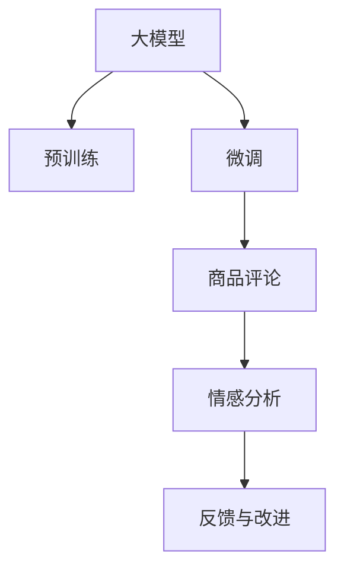

                 

# 大模型在商品评论情感分析中的应用

> 关键词：大模型,商品评论,情感分析,Transformer,预训练,微调,自然语言处理(NLP)

## 1. 背景介绍

### 1.1 问题由来
随着电子商务的快速发展，消费者对于商品质量、服务体验等方面的评价日益重要。商品评论作为用户反馈的主要形式，能真实反映产品优劣。通过分析这些评论数据，商家能及时掌握市场动态，改进产品设计和售后服务，提升用户体验。但海量的商品评论数据需要高效、准确的情感分析技术进行自动化处理。

目前，基于传统机器学习的情感分析方法已难以适应大规模数据和复杂语言表达，而深度学习尤其是大模型在自然语言处理（NLP）领域表现出强大的优势。通过预训练和微调，大模型能在特定领域表现出色，用于商品评论的情感分析。

### 1.2 问题核心关键点
本文将重点介绍利用大模型进行商品评论情感分析的过程，包括数据准备、模型选择、微调设置等核心环节。分析了目前常用的情感分析模型，并探讨了其优缺点及应用领域。

## 2. 核心概念与联系

### 2.1 核心概念概述

为更好地理解基于大模型进行商品评论情感分析，本节将介绍几个关键概念：

- 大模型（Large Model）：以Transformer为代表的大型预训练语言模型，通过在大规模无标签文本语料上进行预训练，学习通用的语言表示。常见的预训练模型包括BERT、GPT-2、RoBERTa等。
- 预训练（Pre-training）：指在大规模无标签文本语料上，通过自监督学习任务训练通用语言模型的过程。预训练使得模型学习到语言的通用表示，可以用于下游任务的微调。
- 微调（Fine-tuning）：指在预训练模型的基础上，使用特定领域的数据进行微调，优化模型在该领域上的性能。通过微调，大模型可以在商品评论等特定任务上获得良好的表现。
- 情感分析（Sentiment Analysis）：指识别文本中蕴含的情感信息，进行情感分类、情感强度评分等。在商品评论中，情感分析可以帮助商家识别用户满意度、情感倾向等。
- 自然语言处理（NLP）：指利用计算机对自然语言进行理解、处理和生成，涉及文本分类、信息抽取、问答系统等多个方向。商品评论情感分析是NLP领域的一个重要应用。

这些核心概念通过以下Mermaid流程图展示它们之间的联系：



这个流程图展示了从预训练大模型到商品评论情感分析的完整过程，即大模型预训练-微调-情感分析-反馈与改进。

## 3. 核心算法原理 & 具体操作步骤
### 3.1 算法原理概述

基于大模型进行商品评论情感分析，其实是一种预训练-微调的迁移学习过程。其核心思想是：将预训练的大模型视作一个通用的语言理解器，通过商品评论数据的微调，使模型能够识别和分析评论中的情感信息。

具体而言，假设预训练模型为 $M_{\theta}$，其中 $\theta$ 为预训练得到的模型参数。对于商品评论数据集 $D=\{(x_i,y_i)\}_{i=1}^N$，$x_i$ 为评论文本，$y_i$ 为评论情感（如正面、负面、中性）。微调的目标是找到新的模型参数 $\hat{\theta}$，使得模型在商品评论数据集上的情感分类误差最小。

微调过程通常采用监督学习方式，即在训练集中有标注的评论和情感标签，通过反向传播算法优化模型参数，使其在新的任务上表现更好。微调的损失函数一般选用交叉熵损失或负对数似然损失。

### 3.2 算法步骤详解

基于大模型进行商品评论情感分析，一般包括以下关键步骤：

**Step 1: 数据准备**

- **数据收集**：收集商品评论数据，包括评论文本和对应的情感标签。
- **数据预处理**：对评论文本进行分词、去除停用词、词干提取等预处理，以提升模型性能。
- **数据划分**：将数据集划分为训练集、验证集和测试集。通常训练集用于模型训练，验证集用于参数调优，测试集用于模型评估。

**Step 2: 模型选择与预训练**

- **模型选择**：选择预训练模型，如BERT、GPT-2、RoBERTa等。
- **预训练**：在预训练任务上训练模型，如语言模型、掩码语言模型等。可以使用Hugging Face提供的预训练模型库。

**Step 3: 微调设置**

- **模型初始化**：将预训练模型作为微调模型的初始参数。
- **损失函数**：选择适当的损失函数，如交叉熵损失。
- **优化器**：选择优化器，如AdamW。
- **学习率**：设置初始学习率，通常比预训练时小1-2个数量级。
- **正则化**：引入L2正则、Dropout等，防止过拟合。
- **数据增强**：采用词形替换、同义词替换等方法扩充训练集。

**Step 4: 模型训练与评估**

- **模型训练**：将微调模型应用于训练集，不断调整模型参数，使其在商品评论情感分类任务上表现更佳。
- **模型评估**：在验证集上评估模型性能，调整超参数（如学习率、正则化强度等）。
- **模型测试**：在测试集上测试模型性能，评估模型泛化能力。

**Step 5: 应用部署**

- **模型保存**：保存微调后的模型，便于后续调用。
- **应用部署**：将模型部署到实际应用中，进行商品评论情感分析。

以上是基于大模型进行商品评论情感分析的一般流程。在实际应用中，还需要针对具体任务特点，对微调过程的各个环节进行优化设计，如改进损失函数、引入更多正则化技术、搜索最优超参数组合等，以进一步提升模型性能。

### 3.3 算法优缺点

基于大模型进行商品评论情感分析，具有以下优点：

- **通用性强**：大模型在多个NLP任务上表现良好，可以在商品评论情感分析中直接使用。
- **训练速度快**：商品评论数据集相对较小，且任务简单，模型训练速度较快。
- **效果显著**：大模型通过预训练已经学习了通用的语言表示，通过微调可以快速适应特定任务，提升情感分析性能。

同时，该方法也存在以下局限性：

- **对数据质量要求高**：商品评论数据可能存在噪声，对模型性能有一定影响。
- **模型复杂度高**：大模型参数量较大，需要较高的计算资源。
- **解释性不足**：模型黑盒特性，难以解释其内部推理过程。

尽管存在这些局限性，但大模型仍是目前商品评论情感分析的主流方法，其效果和泛化能力已得到广泛认可。

### 3.4 算法应用领域

基于大模型进行商品评论情感分析，已经在电子商务、零售、金融等领域得到了广泛应用。例如：

- **电子商务**：通过分析客户对产品的评价，商家可以及时调整商品策略，提升用户满意度。
- **零售**：了解消费者对产品的喜好和需求，优化库存管理，提高销售效率。
- **金融**：分析用户对金融产品的评价，评估风险和收益，优化投资策略。

除了上述这些经典应用外，商品评论情感分析还可用于产品推荐、市场营销、品牌管理等方面，为商家提供更加精准的用户洞察。

## 4. 数学模型和公式 & 详细讲解 & 举例说明
### 4.1 数学模型构建

假设商品评论情感分析任务为二分类问题，即评论情感为正面或负面。微调模型为 $M_{\theta}$，输入为评论文本 $x_i$，输出为情感标签 $y_i \in \{0,1\}$。

微调的目标是最小化损失函数：

$$
\mathcal{L}(\theta) = -\frac{1}{N}\sum_{i=1}^N \ell(M_{\theta}(x_i), y_i)
$$

其中 $\ell$ 为交叉熵损失函数：

$$
\ell(M_{\theta}(x_i), y_i) = -y_i \log M_{\theta}(x_i) - (1-y_i) \log (1-M_{\theta}(x_i))
$$

$M_{\theta}(x_i)$ 为模型在评论文本 $x_i$ 上的输出，表示评论情感的预测概率。

### 4.2 公式推导过程

设评论文本 $x_i$ 的长度为 $n_i$，模型的输出向量为 $h \in \mathbb{R}^d$。则模型 $M_{\theta}$ 的预测概率为：

$$
M_{\theta}(x_i) = \sigma(\theta \cdot h)
$$

其中 $\sigma$ 为激活函数，如Sigmoid函数。

将 $\ell$ 代入 $\mathcal{L}$，得到：

$$
\mathcal{L}(\theta) = -\frac{1}{N}\sum_{i=1}^N [y_i \log M_{\theta}(x_i) + (1-y_i) \log (1-M_{\theta}(x_i))]
$$

通过反向传播算法，计算损失函数 $\mathcal{L}$ 对参数 $\theta$ 的梯度，并更新参数：

$$
\theta \leftarrow \theta - \eta \nabla_{\theta}\mathcal{L}(\theta)
$$

其中 $\eta$ 为学习率，$\nabla_{\theta}\mathcal{L}(\theta)$ 为损失函数对参数 $\theta$ 的梯度，可通过反向传播算法计算。

### 4.3 案例分析与讲解

假设使用RoBERTa模型进行商品评论情感分析，预训练任务为掩码语言模型。首先，在训练集上进行微调，然后测试模型在验证集上的性能，并调整学习率等超参数。最后，在测试集上测试模型性能，评估模型泛化能力。

以某电商网站商品评论情感分析为例，使用公开数据集（如Amazon产品评论数据集），通过预训练RoBERTa模型，在商品评论数据集上进行微调。具体步骤如下：

1. 收集商品评论数据集，包含评论文本和对应的情感标签。
2. 对评论文本进行预处理，包括分词、去除停用词、词干提取等。
3. 划分数据集为训练集、验证集和测试集。
4. 加载RoBERTa模型，设定超参数如学习率、批大小等。
5. 使用微调数据集进行微调训练。
6. 在验证集上评估模型性能，调整超参数。
7. 在测试集上测试模型性能，评估模型泛化能力。

## 5. 项目实践：代码实例和详细解释说明
### 5.1 开发环境搭建

在进行商品评论情感分析的大模型微调实践前，我们需要准备好开发环境。以下是使用Python进行PyTorch开发的环境配置流程：

1. 安装Anaconda：从官网下载并安装Anaconda，用于创建独立的Python环境。

2. 创建并激活虚拟环境：
```bash
conda create -n pytorch-env python=3.8 
conda activate pytorch-env
```

3. 安装PyTorch：根据CUDA版本，从官网获取对应的安装命令。例如：
```bash
conda install pytorch torchvision torchaudio cudatoolkit=11.1 -c pytorch -c conda-forge
```

4. 安装Transformers库：
```bash
pip install transformers
```

5. 安装各类工具包：
```bash
pip install numpy pandas scikit-learn matplotlib tqdm jupyter notebook ipython
```

完成上述步骤后，即可在`pytorch-env`环境中开始微调实践。

### 5.2 源代码详细实现

这里我们以RoBERTa模型进行商品评论情感分析为例，给出使用Transformers库进行微调的PyTorch代码实现。

首先，定义数据集类：

```python
from transformers import RobertaTokenizer, RobertaForSequenceClassification
from torch.utils.data import Dataset
import torch

class ReviewDataset(Dataset):
    def __init__(self, reviews, labels, tokenizer, max_len=128):
        self.reviews = reviews
        self.labels = labels
        self.tokenizer = tokenizer
        self.max_len = max_len
        
    def __len__(self):
        return len(self.reviews)
    
    def __getitem__(self, item):
        review = self.reviews[item]
        label = self.labels[item]
        
        encoding = self.tokenizer(review, truncation=True, padding='max_length', max_length=self.max_len)
        input_ids = encoding['input_ids']
        attention_mask = encoding['attention_mask']
        
        label = torch.tensor([label], dtype=torch.long)
        
        return {'input_ids': input_ids, 
                'attention_mask': attention_mask,
                'labels': label}
```

然后，定义模型和优化器：

```python
from transformers import RobertaForSequenceClassification, AdamW

model = RobertaForSequenceClassification.from_pretrained('roberta-base', num_labels=2)

optimizer = AdamW(model.parameters(), lr=2e-5)
```

接着，定义训练和评估函数：

```python
from torch.utils.data import DataLoader
from tqdm import tqdm
from sklearn.metrics import accuracy_score

device = torch.device('cuda') if torch.cuda.is_available() else torch.device('cpu')
model.to(device)

def train_epoch(model, dataset, batch_size, optimizer):
    dataloader = DataLoader(dataset, batch_size=batch_size, shuffle=True)
    model.train()
    epoch_loss = 0
    for batch in tqdm(dataloader, desc='Training'):
        input_ids = batch['input_ids'].to(device)
        attention_mask = batch['attention_mask'].to(device)
        labels = batch['labels'].to(device)
        model.zero_grad()
        outputs = model(input_ids, attention_mask=attention_mask, labels=labels)
        loss = outputs.loss
        epoch_loss += loss.item()
        loss.backward()
        optimizer.step()
    return epoch_loss / len(dataloader)

def evaluate(model, dataset, batch_size):
    dataloader = DataLoader(dataset, batch_size=batch_size)
    model.eval()
    preds, labels = [], []
    with torch.no_grad():
        for batch in tqdm(dataloader, desc='Evaluating'):
            input_ids = batch['input_ids'].to(device)
            attention_mask = batch['attention_mask'].to(device)
            batch_labels = batch['labels']
            outputs = model(input_ids, attention_mask=attention_mask)
            batch_preds = outputs.logits.argmax(dim=1).to('cpu').tolist()
            batch_labels = batch_labels.to('cpu').tolist()
            for pred, label in zip(batch_preds, batch_labels):
                preds.append(pred)
                labels.append(label)
                
    print(f"Accuracy: {accuracy_score(labels, preds)}")
```

最后，启动训练流程并在测试集上评估：

```python
epochs = 5
batch_size = 16

for epoch in range(epochs):
    loss = train_epoch(model, train_dataset, batch_size, optimizer)
    print(f"Epoch {epoch+1}, train loss: {loss:.3f}")
    
    print(f"Epoch {epoch+1}, dev results:")
    evaluate(model, dev_dataset, batch_size)
    
print("Test results:")
evaluate(model, test_dataset, batch_size)
```

以上就是使用PyTorch对RoBERTa模型进行商品评论情感分析的完整代码实现。可以看到，得益于Transformers库的强大封装，我们能够用相对简洁的代码完成RoBERTa模型的加载和微调。

### 5.3 代码解读与分析

让我们再详细解读一下关键代码的实现细节：

**ReviewDataset类**：
- `__init__`方法：初始化评论文本、情感标签、分词器等关键组件。
- `__len__`方法：返回数据集的样本数量。
- `__getitem__`方法：对单个样本进行处理，将评论文本输入编码为token ids，将情感标签编码为数字，并对其进行定长padding，最终返回模型所需的输入。

**模型和优化器**：
- `RobertaForSequenceClassification`：加载RoBERTa模型，用于商品评论情感分析。
- `AdamW`：选择优化器，并设置学习率。

**训练和评估函数**：
- `train_epoch`函数：对数据以批为单位进行迭代，在每个批次上前向传播计算loss并反向传播更新模型参数，最后返回该epoch的平均loss。
- `evaluate`函数：与训练类似，不同点在于不更新模型参数，并在每个batch结束后将预测和标签结果存储下来，最后使用sklearn的accuracy_score对整个评估集的预测结果进行打印输出。

**训练流程**：
- 定义总的epoch数和batch size，开始循环迭代
- 每个epoch内，先在训练集上训练，输出平均loss
- 在验证集上评估，输出模型准确率
- 重复上述步骤直至收敛，最终在测试集上评估，给出最终测试结果

可以看到，PyTorch配合Transformers库使得RoBERTa模型微调的代码实现变得简洁高效。开发者可以将更多精力放在数据处理、模型改进等高层逻辑上，而不必过多关注底层的实现细节。

当然，工业级的系统实现还需考虑更多因素，如模型的保存和部署、超参数的自动搜索、更灵活的任务适配层等。但核心的微调范式基本与此类似。

## 6. 实际应用场景
### 6.1 智能客服系统

基于RoBERTa等大模型进行商品评论情感分析，可以广泛应用于智能客服系统的构建。传统客服往往需要配备大量人力，高峰期响应缓慢，且一致性和专业性难以保证。而使用商品评论情感分析技术，可以自动理解客户对产品的反馈，及时回应客户咨询，用自然流畅的语言解答各类常见问题。

在技术实现上，可以收集客户对商品的评价，提取评论中的情感信息，训练RoBERTa模型进行情感分类。微调后的模型能够自动理解客户意图，匹配最合适的答案模板进行回复。对于客户提出的新问题，还可以接入检索系统实时搜索相关内容，动态组织生成回答。如此构建的智能客服系统，能大幅提升客户咨询体验和问题解决效率。

### 6.2 市场营销

通过分析用户对产品的评论情感，商家可以及时掌握市场动态，改进产品设计和售后服务，提升用户体验。商家可以使用商品评论情感分析技术，对用户的评论进行情感分析，判断用户对产品的满意度。通过分析情感倾向，商家可以调整市场策略，优化产品设计，提升客户满意度。

### 6.3 金融舆情监测

金融机构需要实时监测市场舆论动向，以便及时应对负面信息传播，规避金融风险。商品评论情感分析技术可以用于分析用户在社交媒体、论坛等平台对金融产品的评价，判断市场情绪。通过情感分析，金融机构可以及时调整投资策略，规避潜在风险。

### 6.4 未来应用展望

随着RoBERTa等大模型和情感分析技术的发展，基于微调的情感分析方法将有更广泛的应用前景。

在智慧医疗领域，商品评论情感分析可以用于医疗产品的用户反馈分析，评估产品安全性和有效性，帮助医生更好地选择和使用医疗产品。

在智能教育领域，通过分析学生的课程评价，教育机构可以了解学生的学习感受，调整教学方法和课程内容，提升教学质量。

在智慧城市治理中，商品评论情感分析可以用于分析市民对城市管理和服务质量的评价，优化城市治理策略，提高城市管理水平。

此外，在企业生产、社会治理、文娱传媒等众多领域，商品评论情感分析也将不断涌现，为各行各业提供更加精准的用户洞察和市场分析。相信随着技术的日益成熟，商品评论情感分析必将在构建人机协同的智能时代中扮演越来越重要的角色。

## 7. 工具和资源推荐
### 7.1 学习资源推荐

为了帮助开发者系统掌握基于大模型的商品评论情感分析的理论基础和实践技巧，这里推荐一些优质的学习资源：

1. 《Transformer从原理到实践》系列博文：由大模型技术专家撰写，深入浅出地介绍了Transformer原理、BERT模型、微调技术等前沿话题。

2. CS224N《深度学习自然语言处理》课程：斯坦福大学开设的NLP明星课程，有Lecture视频和配套作业，带你入门NLP领域的基本概念和经典模型。

3. 《Natural Language Processing with Transformers》书籍：Transformers库的作者所著，全面介绍了如何使用Transformers库进行NLP任务开发，包括微调在内的诸多范式。

4. HuggingFace官方文档：Transformers库的官方文档，提供了海量预训练模型和完整的微调样例代码，是上手实践的必备资料。

5. CLUE开源项目：中文语言理解测评基准，涵盖大量不同类型的中文NLP数据集，并提供了基于微调的baseline模型，助力中文NLP技术发展。

通过对这些资源的学习实践，相信你一定能够快速掌握基于大模型的商品评论情感分析的精髓，并用于解决实际的NLP问题。
###  7.2 开发工具推荐

高效的开发离不开优秀的工具支持。以下是几款用于商品评论情感分析的大模型微调开发的常用工具：

1. PyTorch：基于Python的开源深度学习框架，灵活动态的计算图，适合快速迭代研究。大部分预训练语言模型都有PyTorch版本的实现。

2. TensorFlow：由Google主导开发的开源深度学习框架，生产部署方便，适合大规模工程应用。同样有丰富的预训练语言模型资源。

3. Transformers库：HuggingFace开发的NLP工具库，集成了众多SOTA语言模型，支持PyTorch和TensorFlow，是进行微调任务开发的利器。

4. Weights & Biases：模型训练的实验跟踪工具，可以记录和可视化模型训练过程中的各项指标，方便对比和调优。与主流深度学习框架无缝集成。

5. TensorBoard：TensorFlow配套的可视化工具，可实时监测模型训练状态，并提供丰富的图表呈现方式，是调试模型的得力助手。

6. Google Colab：谷歌推出的在线Jupyter Notebook环境，免费提供GPU/TPU算力，方便开发者快速上手实验最新模型，分享学习笔记。

合理利用这些工具，可以显著提升大模型微调的开发效率，加快创新迭代的步伐。

### 7.3 相关论文推荐

商品评论情感分析的研究起源于NLP领域，近年来随着大模型技术的发展，相关研究也得到了长足进步。以下是几篇奠基性的相关论文，推荐阅读：

1. Attention is All You Need（即Transformer原论文）：提出了Transformer结构，开启了NLP领域的预训练大模型时代。

2. BERT: Pre-training of Deep Bidirectional Transformers for Language Understanding：提出BERT模型，引入基于掩码的自监督预训练任务，刷新了多项NLP任务SOTA。

3. Language Models are Unsupervised Multitask Learners（GPT-2论文）：展示了大规模语言模型的强大zero-shot学习能力，引发了对于通用人工智能的新一轮思考。

4. Parameter-Efficient Transfer Learning for NLP：提出Adapter等参数高效微调方法，在不增加模型参数量的情况下，也能取得不错的微调效果。

5. Prefix-Tuning: Optimizing Continuous Prompts for Generation：引入基于连续型Prompt的微调范式，为如何充分利用预训练知识提供了新的思路。

6. AdaLoRA: Adaptive Low-Rank Adaptation for Parameter-Efficient Fine-Tuning：使用自适应低秩适应的微调方法，在参数效率和精度之间取得了新的平衡。

这些论文代表了大模型和情感分析技术的发展脉络。通过学习这些前沿成果，可以帮助研究者把握学科前进方向，激发更多的创新灵感。

## 8. 总结：未来发展趋势与挑战
### 8.1 总结

本文对基于大模型的商品评论情感分析方法进行了全面系统的介绍。首先阐述了商品评论情感分析的背景和意义，明确了基于大模型的微调范式在特定领域的应用价值。其次，从原理到实践，详细讲解了商品评论情感分析的数学模型和微调步骤，给出了微调任务开发的完整代码实例。同时，本文还探讨了商品评论情感分析在大模型应用中的广泛前景，展示了微调技术在各行业的落地潜力。

通过本文的系统梳理，可以看到，基于大模型的商品评论情感分析方法正在成为NLP领域的重要范式，极大地拓展了预训练语言模型的应用边界，催生了更多的落地场景。受益于大规模语料的预训练，微调模型在商品评论情感分析中表现出较强的泛化能力和应用灵活性，帮助商家快速了解用户反馈，优化产品设计和服务策略，提升用户满意度。未来，随着大模型和情感分析技术的不断进步，基于微调的情感分析方法必将在更多领域得到应用，为各行各业带来变革性影响。

### 8.2 未来发展趋势

展望未来，大模型进行商品评论情感分析的技术将呈现以下几个发展趋势：

1. 模型规模持续增大。随着算力成本的下降和数据规模的扩张，预训练语言模型的参数量还将持续增长。超大规模语言模型蕴含的丰富语言知识，有望支撑更加复杂多变的商品评论情感分析任务。

2. 微调方法日趋多样。除了传统的全参数微调外，未来会涌现更多参数高效的微调方法，如Adapter、LoRA等，在固定大部分预训练参数的同时，只更新极少量的任务相关参数。

3. 持续学习成为常态。随着数据分布的不断变化，微调模型也需要持续学习新知识以保持性能。如何在不遗忘原有知识的同时，高效吸收新样本信息，将成为重要的研究课题。

4. 标注样本需求降低。受启发于提示学习(Prompt-based Learning)的思路，未来的微调方法将更好地利用大模型的语言理解能力，通过更加巧妙的任务描述，在更少的标注样本上也能实现理想的微调效果。

5. 多模态微调崛起。当前的微调主要聚焦于纯文本数据，未来会进一步拓展到图像、视频、语音等多模态数据微调。多模态信息的融合，将显著提升商品评论情感分析模型的表现力。

6. 模型通用性增强。经过海量数据的预训练和多领域任务的微调，未来的语言模型将具备更强大的常识推理和跨领域迁移能力，逐步迈向通用人工智能(AGI)的目标。

以上趋势凸显了大模型进行商品评论情感分析的广阔前景。这些方向的探索发展，必将进一步提升商品评论情感分析模型的性能和应用范围，为电商、零售、金融等各行各业带来变革性影响。

### 8.3 面临的挑战

尽管大模型进行商品评论情感分析的方法已经取得了瞩目成就，但在迈向更加智能化、普适化应用的过程中，它仍面临着诸多挑战：

1. 标注成本瓶颈。尽管微调对标注样本的需求较低，但一些特定领域的商品评论数据可能难以获得，成为制约微调性能的瓶颈。如何进一步降低微调对标注样本的依赖，将是一大难题。

2. 模型鲁棒性不足。当前微调模型面对域外数据时，泛化性能往往大打折扣。对于测试样本的微小扰动，微调模型的预测也容易发生波动。如何提高微调模型的鲁棒性，避免灾难性遗忘，还需要更多理论和实践的积累。

3. 推理效率有待提高。大规模语言模型虽然精度高，但在实际部署时往往面临推理速度慢、内存占用大等效率问题。如何在保证性能的同时，简化模型结构，提升推理速度，优化资源占用，将是重要的优化方向。

4. 可解释性亟需加强。当前微调模型更像是"黑盒"系统，难以解释其内部工作机制和决策逻辑。对于医疗、金融等高风险应用，算法的可解释性和可审计性尤为重要。如何赋予微调模型更强的可解释性，将是亟待攻克的难题。

5. 安全性有待保障。预训练语言模型难免会学习到有偏见、有害的信息，通过微调传递到商品评论情感分析任务，产生误导性、歧视性的输出，给实际应用带来安全隐患。如何从数据和算法层面消除模型偏见，避免恶意用途，确保输出的安全性，也将是重要的研究课题。

6. 知识整合能力不足。现有的微调模型往往局限于任务内数据，难以灵活吸收和运用更广泛的先验知识。如何让微调过程更好地与外部知识库、规则库等专家知识结合，形成更加全面、准确的信息整合能力，还有很大的想象空间。

正视商品评论情感分析中微调所面临的这些挑战，积极应对并寻求突破，将是大模型微调走向成熟的必由之路。相信随着学界和产业界的共同努力，这些挑战终将一一被克服，商品评论情感分析必将在构建人机协同的智能时代中扮演越来越重要的角色。

### 8.4 研究展望

面对商品评论情感分析中微调面临的种种挑战，未来的研究需要在以下几个方面寻求新的突破：

1. 探索无监督和半监督微调方法。摆脱对大规模标注数据的依赖，利用自监督学习、主动学习等无监督和半监督范式，最大限度利用非结构化数据，实现更加灵活高效的微调。

2. 研究参数高效和计算高效的微调范式。开发更加参数高效的微调方法，在固定大部分预训练参数的同时，只更新极少量的任务相关参数。同时优化微调模型的计算图，减少前向传播和反向传播的资源消耗，实现更加轻量级、实时性的部署。

3. 融合因果和对比学习范式。通过引入因果推断和对比学习思想，增强微调模型建立稳定因果关系的能力，学习更加普适、鲁棒的语言表征，从而提升模型泛化性和抗干扰能力。

4. 引入更多先验知识。将符号化的先验知识，如知识图谱、逻辑规则等，与神经网络模型进行巧妙融合，引导微调过程学习更准确、合理的语言模型。同时加强不同模态数据的整合，实现视觉、语音等多模态信息与文本信息的协同建模。

5. 结合因果分析和博弈论工具。将因果分析方法引入微调模型，识别出模型决策的关键特征，增强输出解释的因果性和逻辑性。借助博弈论工具刻画人机交互过程，主动探索并规避模型的脆弱点，提高系统稳定性。

6. 纳入伦理道德约束。在模型训练目标中引入伦理导向的评估指标，过滤和惩罚有偏见、有害的输出倾向。同时加强人工干预和审核，建立模型行为的监管机制，确保输出符合人类价值观和伦理道德。

这些研究方向的探索，必将引领商品评论情感分析技术迈向更高的台阶，为商家提供更加精准的用户洞察和市场分析，优化产品设计和服务策略，提升用户满意度。面向未来，商品评论情感分析技术还需要与其他人工智能技术进行更深入的融合，如知识表示、因果推理、强化学习等，多路径协同发力，共同推动自然语言理解和智能交互系统的进步。只有勇于创新、敢于突破，才能不断拓展语言模型的边界，让智能技术更好地造福人类社会。

## 9. 附录：常见问题与解答

**Q1：大模型在商品评论情感分析中是否需要大量的标注数据？**

A: 大模型在商品评论情感分析中一般不需要大量的标注数据。商品评论数据通常规模较小，但利用大模型的预训练能力，可以在较少的标注数据下获得较好的微调效果。此外，通过改进数据增强和正则化方法，可以在有限的标注数据下进一步提升模型性能。

**Q2：微调学习率如何设置？**

A: 微调学习率通常比预训练时小1-2个数量级。一般建议从1e-5开始调参，逐步减小学习率，直至收敛。如果使用warmup策略，在开始阶段使用较小的学习率，再逐渐过渡到预设值，效果更佳。

**Q3：微调过程中如何避免过拟合？**

A: 微调过程中避免过拟合的方法包括：
1. 数据增强：通过词形替换、同义词替换等方法扩充训练集。
2. 正则化：使用L2正则、Dropout等。
3. 对抗训练：引入对抗样本，提高模型鲁棒性。
4. 参数高效微调：只调整少量参数，如Adapter、Prefix等，减小过拟合风险。

这些策略往往需要根据具体任务和数据特点进行灵活组合。只有在数据、模型、训练、推理等各环节进行全面优化，才能最大限度地发挥大模型的潜力。

**Q4：微调模型在实际部署时需要注意哪些问题？**

A: 将微调模型转化为实际应用，还需要考虑以下因素：
1. 模型裁剪：去除不必要的层和参数，减小模型尺寸，加快推理速度。
2. 量化加速：将浮点模型转为定点模型，压缩存储空间，提高计算效率。
3. 服务化封装：将模型封装为标准化服务接口，便于集成调用。
4. 弹性伸缩：根据请求流量动态调整资源配置，平衡服务质量和成本。
5. 监控告警：实时采集系统指标，设置异常告警阈值，确保服务稳定性。
6. 安全防护：采用访问鉴权、数据脱敏等措施，保障数据和模型安全。

大模型微调为商品评论情感分析提供了新的解决方案，但如何将强大的性能转化为稳定、高效、安全的业务价值，还需要工程实践的不断打磨。唯有从数据、算法、工程、业务等多个维度协同发力，才能真正实现人工智能技术在垂直行业的规模化落地。

总之，基于大模型的商品评论情感分析方法已经显示出其独特的优势和广泛的应用前景。随着技术的不断进步，相信它将在更多的场景中发挥作用，为各行各业带来深远的影响。

