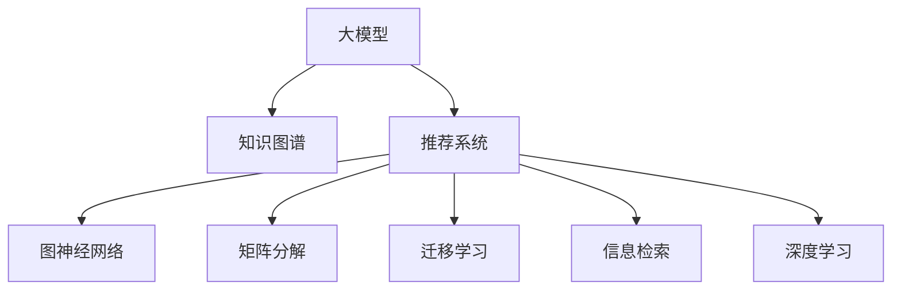

                 

# 大模型在基于知识图谱的推荐中的作用

> 关键词：大模型, 知识图谱, 推荐系统, 图神经网络, 矩阵分解, 迁移学习, 信息检索, 深度学习

## 1. 背景介绍

### 1.1 问题由来
在信息时代，推荐系统成为了人们获取信息的重要工具，它可以根据用户的浏览历史、评分记录等行为数据，为用户推荐符合其兴趣的商品、内容或服务。随着用户需求的日益多样化，推荐系统的复杂度和难度不断提升，传统的协同过滤和矩阵分解等方法已经难以满足要求。与此同时，大模型技术在自然语言处理等领域取得了巨大成功，其强大的表征能力和泛化能力，被视为解决推荐系统问题的有效手段。

基于知识图谱的推荐系统则进一步提升了推荐系统的智能化水平。知识图谱是一种结构化的语义知识库，通过关系型数据来描述实体及其之间的关联，能够更好地表达实体之间的语义关系和属性特征。将知识图谱与大模型技术相结合，可以构建更加全面、准确、智能的推荐系统。

### 1.2 问题核心关键点
大模型在基于知识图谱的推荐系统中的关键作用主要体现在以下几个方面：

- 强大的表征能力：通过大规模预训练，大模型能够学习到丰富的语义表示，有助于更好地理解实体之间的关系和属性。
- 迁移学习：通过知识图谱的先验知识，可以加速大模型在特定领域的微调，提升推荐效果。
- 上下文理解：大模型能够综合考虑多方面的上下文信息，如文本描述、图像特征、用户历史行为等，生成更加精准的推荐结果。
- 可解释性：大模型可以通过可解释的特征表示，解释推荐结果的生成过程，提升系统的可信度。
- 动态适应：大模型能够动态地学习新数据和新知识，持续更新推荐策略，适应用户需求的变化。

这些关键点使得大模型成为构建基于知识图谱的推荐系统的重要技术手段，能够显著提升推荐系统的准确性、智能性和可解释性。

### 1.3 问题研究意义
研究大模型在基于知识图谱的推荐系统中的应用，对于提升推荐系统的智能化水平、提高用户体验、推动互联网产业的发展具有重要意义：

1. 提升推荐精度：大模型能够综合利用多方面信息，更好地理解用户需求，推荐更加精准、相关的商品或服务。
2. 增强推荐个性化：通过学习用户的历史行为和兴趣，大模型能够为每个用户生成个性化的推荐，提升用户满意度。
3. 降低开发成本：大模型已经在多个领域取得了成功，可以直接应用于推荐系统，减少了从头开发的工作量。
4. 促进跨领域应用：大模型能够灵活地与其他领域的技术进行结合，推动知识图谱在更多领域的落地应用。
5. 加速技术创新：大模型的引入为推荐系统带来了新的研究思路和应用模式，推动了相关技术的快速发展。

## 2. 核心概念与联系

### 2.1 核心概念概述

为更好地理解大模型在基于知识图谱的推荐系统中的应用，本节将介绍几个密切相关的核心概念：

- 大模型：以Transformer、BERT等深度学习模型为代表的大规模预训练语言模型。通过在大规模无标签文本语料上进行预训练，学习到丰富的语言知识，具备强大的表征能力和泛化能力。
- 知识图谱：以关系型数据库为基础，描述实体及其之间关系的语义知识库。通常包含节点和边两种元素，节点表示实体，边表示实体之间的关系。
- 推荐系统：一种智能信息过滤系统，通过分析用户的历史行为和偏好，为用户推荐合适的商品、内容或服务。常见的推荐算法包括协同过滤、基于内容的推荐、混合推荐等。
- 图神经网络(Graph Neural Network, GNN)：一类专门用于处理图结构数据的深度学习模型。通过在图结构上定义卷积操作，可以提取节点和边的特征，用于图数据的分类、聚类、推荐等任务。
- 矩阵分解：一种将稀疏矩阵分解为两个低秩矩阵的技术，常用于推荐系统中对用户-商品矩阵进行分解，挖掘用户和商品之间的潜在关系。
- 迁移学习：一种利用已有知识提升新任务学习效率的方法，通过将预训练模型在大规模数据上学习到的知识迁移到特定任务中，加速模型的训练和泛化。
- 信息检索：一种获取相关信息的检索方法，通过匹配查询和文档的特征，为查询提供最佳匹配结果。在推荐系统中，信息检索可以用于匹配用户查询和商品描述，提升推荐的相关性。
- 深度学习：一类基于神经网络的机器学习方法，能够学习复杂的数据表示和模式，广泛应用于图像、语音、自然语言处理等领域。

这些核心概念之间的逻辑关系可以通过以下Mermaid流程图来展示：



这个流程图展示了大模型、知识图谱、推荐系统等核心概念之间的联系：

1. 大模型通过预训练学习到丰富的语义表示，可以与知识图谱进行结合，提升推荐的智能化水平。
2. 知识图谱描述了实体及其之间的关系，可以与图神经网络等模型结合，进一步提取节点和边的特征。
3. 推荐系统通过利用多方面的信息，如用户行为、商品描述等，为用户推荐合适的商品或服务。
4. 矩阵分解和信息检索等方法可以用于推荐系统中的特征提取和检索过程。
5. 深度学习技术，特别是大模型技术，可以用于推荐系统中的上下文理解和特征表示。

这些概念共同构成了基于知识图谱的推荐系统的技术框架，使得系统能够更加智能化、精准地为用户提供服务。

## 3. 核心算法原理 & 具体操作步骤

### 3.1 算法原理概述

基于知识图谱的推荐系统，其核心思想是通过大模型学习知识图谱中的语义关系和属性特征，生成推荐结果。具体来说，可以采用以下几种方式：

- 图神经网络：通过在大模型上定义图结构，将知识图谱中的节点和边映射为模型的特征，提取节点和边的表示，用于推荐生成。
- 矩阵分解：将知识图谱中的实体关系矩阵分解为低秩矩阵，提取用户和商品的潜在关系特征，用于推荐。
- 迁移学习：利用知识图谱的先验知识，加速大模型的微调，提升推荐效果。
- 上下文理解：综合考虑用户的历史行为、商品的属性特征等上下文信息，生成更加精准的推荐结果。

形式化地，假设知识图谱中的节点表示为 $E$，边表示为 $R$，用户的历史行为表示为 $H$，商品的特征表示为 $F$。则推荐系统的目标可以表示为：

$$
y = f(E, R, H, F)
$$

其中 $y$ 表示推荐结果，$f$ 表示推荐模型，$E, R, H, F$ 表示输入的语义信息、用户行为和商品特征。

### 3.2 算法步骤详解

基于知识图谱的推荐系统的一般流程如下：

**Step 1: 准备数据集和知识图谱**

- 收集用户行为数据，如点击、购买、评分等。
- 构建知识图谱，描述商品及其属性、关系等信息。
- 对用户行为数据和知识图谱进行预处理，如节点嵌入、关系嵌入等。

**Step 2: 模型选择和构建**

- 选择合适的推荐算法，如基于图神经网络的推荐模型、矩阵分解模型等。
- 在大模型上定义图结构，如Graph Attention Network (GAT)、Graph Convolutional Network (GCN)等。
- 定义模型损失函数，如交叉熵损失、均方误差损失等，用于衡量推荐结果与真实标签的差异。

**Step 3: 模型训练和微调**

- 使用用户行为数据和知识图谱进行模型训练。
- 对大模型进行微调，以适应特定的推荐任务。
- 在训练过程中应用正则化技术，如L2正则、Dropout等，防止过拟合。

**Step 4: 特征提取和推荐生成**

- 使用训练好的大模型提取节点和边的表示。
- 根据提取的特征，进行特征融合、拼接等操作，生成推荐结果。
- 使用训练好的模型对新用户的行为进行预测，生成个性化推荐。

**Step 5: 评估和优化**

- 使用测试数据集评估推荐系统的性能，如准确率、召回率、F1-score等。
- 根据评估结果调整模型参数，优化推荐效果。
- 不断收集新数据，更新知识图谱，重新训练模型。

### 3.3 算法优缺点

基于知识图谱的推荐系统具有以下优点：

- 强大的语义理解能力：大模型通过预训练学习到丰富的语义知识，能够更好地理解实体之间的关系和属性。
- 高效的特征提取：图神经网络等模型能够自动提取节点和边的特征，无需手工设计特征。
- 上下文感知：结合用户行为和商品特征，生成更加精准的推荐结果。
- 可解释性强：通过大模型的特征表示，可以解释推荐结果的生成过程，提升系统的可信度。
- 动态更新：大模型能够动态地学习新数据和新知识，持续更新推荐策略。

但同时，也存在一些局限性：

- 对数据质量依赖高：推荐系统的效果很大程度上依赖于用户行为和知识图谱的质量。
- 模型复杂度高：基于图神经网络等模型的推荐系统较为复杂，需要较长的训练时间和较大的计算资源。
- 可解释性不足：大模型往往是一个黑盒系统，难以解释其内部的决策过程。
- 跨领域迁移能力弱：现有的推荐模型通常针对特定领域，跨领域迁移能力有限。
- 数据隐私问题：推荐系统中涉及用户行为数据，存在隐私保护和数据安全的问题。

尽管存在这些局限性，但就目前而言，基于知识图谱的推荐系统仍然是大模型在推荐领域中的主流应用范式，能够显著提升推荐系统的智能化和准确性。

### 3.4 算法应用领域

基于知识图谱的推荐系统已经在电商、新闻、社交媒体等多个领域得到广泛应用，提升了用户体验和服务质量。

- 电商推荐：通过结合商品信息、用户行为和知识图谱，为用户推荐个性化商品。
- 新闻推荐：通过分析用户的阅读历史和兴趣图谱，为用户推荐相关的新闻内容。
- 社交媒体推荐：通过综合考虑用户的关注关系、行为记录和知识图谱，为用户推荐有价值的内容。

此外，在医疗、金融、旅游等更多领域，基于知识图谱的推荐系统也有望得到应用，为这些行业带来新的智能化解决方案。

## 4. 数学模型和公式 & 详细讲解 & 举例说明

### 4.1 数学模型构建

本节将使用数学语言对基于知识图谱的推荐系统进行更加严格的刻画。

假设知识图谱中的节点表示为 $E=\{e_i\}_{i=1}^N$，边表示为 $R=\{r_j\}_{j=1}^M$，用户的行为表示为 $H=\{h_k\}_{k=1}^K$，商品的特征表示为 $F=\{f_l\}_{l=1}^L$。

定义推荐系统中的节点嵌入为 $\boldsymbol{e}_i \in \mathbb{R}^d$，边嵌入为 $\boldsymbol{r}_j \in \mathbb{R}^d$，用户行为嵌入为 $\boldsymbol{h}_k \in \mathbb{R}^d$，商品特征嵌入为 $\boldsymbol{f}_l \in \mathbb{R}^d$。则推荐系统的目标可以表示为：

$$
y = f(\boldsymbol{e}, \boldsymbol{r}, \boldsymbol{h}, \boldsymbol{f})
$$

其中 $\boldsymbol{e}, \boldsymbol{r}, \boldsymbol{h}, \boldsymbol{f}$ 表示节点嵌入、边嵌入、用户行为嵌入和商品特征嵌入，$f$ 表示推荐模型。

### 4.2 公式推导过程

以下我们以图神经网络(Graph Neural Network, GNN)为例，推导推荐模型的损失函数及其梯度的计算公式。

假设使用Graph Attention Network (GAT)模型，其节点嵌入表示为 $\boldsymbol{e}_i$，边嵌入表示为 $\boldsymbol{r}_j$，用户行为嵌入表示为 $\boldsymbol{h}_k$，商品特征嵌入表示为 $\boldsymbol{f}_l$。则GAT模型的节点表示可以表示为：

$$
\boldsymbol{h}_i^{(l+1)} = \alpha \sum_{j \in \mathcal{N}_i} \frac{1}{\mathrm{e}^{\boldsymbol{e}_i^T\boldsymbol{r}_j}} \boldsymbol{h}_j^{(l)} \boldsymbol{r}_j
$$

其中 $\mathcal{N}_i$ 表示节点 $i$ 的邻居节点集，$\alpha$ 为归一化系数，$\boldsymbol{r}_j$ 为边嵌入，$\boldsymbol{h}_j^{(l)}$ 为节点 $j$ 在第 $l$ 层的表示。

将 $\boldsymbol{h}_i^{(l+1)}$ 用于推荐生成，可以定义损失函数为交叉熵损失：

$$
\mathcal{L} = -\frac{1}{N} \sum_{i=1}^N \sum_{k=1}^K \sum_{l=1}^L \ell(\boldsymbol{h}_i^{(L+1)}, y_k^l)
$$

其中 $\ell$ 为交叉熵损失函数，$y_k^l$ 为第 $k$ 个用户的第 $l$ 个行为的推荐结果。

根据链式法则，损失函数对 $\boldsymbol{e}_i$ 的梯度可以表示为：

$$
\frac{\partial \mathcal{L}}{\partial \boldsymbol{e}_i} = -\frac{1}{N} \sum_{j \in \mathcal{N}_i} \frac{1}{\mathrm{e}^{\boldsymbol{e}_i^T\boldsymbol{r}_j}} \sum_{k=1}^K \sum_{l=1}^L \frac{\partial \ell(\boldsymbol{h}_i^{(L+1)}, y_k^l)}{\partial \boldsymbol{h}_i^{(L+1)}} \frac{\partial \boldsymbol{h}_i^{(L+1)}}{\partial \boldsymbol{e}_i}
$$

其中 $\frac{\partial \boldsymbol{h}_i^{(L+1)}}{\partial \boldsymbol{e}_i}$ 为节点嵌入的梯度，可以通过反向传播算法计算。

在得到损失函数的梯度后，即可带入优化算法，如AdamW、SGD等，完成模型的迭代优化。重复上述过程直至收敛，最终得到适应推荐任务的最优模型参数。

## 5. 项目实践：代码实例和详细解释说明

### 5.1 开发环境搭建

在进行推荐系统开发前，我们需要准备好开发环境。以下是使用Python进行PyTorch开发的环境配置流程：

1. 安装Anaconda：从官网下载并安装Anaconda，用于创建独立的Python环境。

2. 创建并激活虚拟环境：
```bash
conda create -n recommendation-env python=3.8 
conda activate recommendation-env
```

3. 安装PyTorch：根据CUDA版本，从官网获取对应的安装命令。例如：
```bash
conda install pytorch torchvision torchaudio cudatoolkit=11.1 -c pytorch -c conda-forge
```

4. 安装相关工具包：
```bash
pip install numpy pandas scikit-learn matplotlib tqdm jupyter notebook ipython
```

完成上述步骤后，即可在`recommendation-env`环境中开始推荐系统开发。

### 5.2 源代码详细实现

下面我们以基于图神经网络的推荐系统为例，给出使用PyTorch实现的代码实现。

首先，定义推荐系统的数据处理函数：

```python
from transformers import GATModel
from torch.utils.data import Dataset
import torch

class RecommendationDataset(Dataset):
    def __init__(self, user_ids, item_ids, user_features, item_features, user_his, item_his, num_users, num_items, num_features):
        self.user_ids = user_ids
        self.item_ids = item_ids
        self.user_features = user_features
        self.item_features = item_features
        self.user_his = user_his
        self.item_his = item_his
        self.num_users = num_users
        self.num_items = num_items
        self.num_features = num_features
        
    def __len__(self):
        return len(self.user_ids)
    
    def __getitem__(self, item):
        user_id = self.user_ids[item]
        item_id = self.item_ids[item]
        user_feature = self.user_features[item]
        item_feature = self.item_features[item]
        user_history = self.user_his[item]
        item_history = self.item_his[item]
        return {'user_id': user_id, 
                'item_id': item_id,
                'user_feature': user_feature, 
                'item_feature': item_feature,
                'user_history': user_history,
                'item_history': item_history}
```

然后，定义模型和优化器：

```python
from transformers import BertForTokenClassification, AdamW

# 使用Graph Attention Network (GAT)作为推荐模型
model = GATModel()

# 使用AdamW优化器
optimizer = AdamW(model.parameters(), lr=2e-5)
```

接着，定义训练和评估函数：

```python
from torch.utils.data import DataLoader
from tqdm import tqdm
from sklearn.metrics import classification_report

device = torch.device('cuda') if torch.cuda.is_available() else torch.device('cpu')
model.to(device)

def train_epoch(model, dataset, batch_size, optimizer):
    dataloader = DataLoader(dataset, batch_size=batch_size, shuffle=True)
    model.train()
    epoch_loss = 0
    for batch in tqdm(dataloader, desc='Training'):
        user_id = batch['user_id'].to(device)
        item_id = batch['item_id'].to(device)
        user_feature = batch['user_feature'].to(device)
        item_feature = batch['item_feature'].to(device)
        user_history = batch['user_history'].to(device)
        item_history = batch['item_history'].to(device)
        model.zero_grad()
        outputs = model(user_id, item_id, user_feature, item_feature, user_history, item_history)
        loss = outputs.loss
        epoch_loss += loss.item()
        loss.backward()
        optimizer.step()
    return epoch_loss / len(dataloader)

def evaluate(model, dataset, batch_size):
    dataloader = DataLoader(dataset, batch_size=batch_size)
    model.eval()
    preds, labels = [], []
    with torch.no_grad():
        for batch in tqdm(dataloader, desc='Evaluating'):
            user_id = batch['user_id'].to(device)
            item_id = batch['item_id'].to(device)
            user_feature = batch['user_feature'].to(device)
            item_feature = batch['item_feature'].to(device)
            user_history = batch['user_history'].to(device)
            item_history = batch['item_history'].to(device)
            batch_preds = model(user_id, item_id, user_feature, item_feature, user_history, item_history)
            batch_preds = batch_preds.argmax(dim=1).to('cpu').tolist()
            batch_labels = batch_labels.to('cpu').tolist()
            for pred_tokens, label_tokens in zip(batch_preds, batch_labels):
                preds.append(pred_tokens)
                labels.append(label_tokens)
                
    print(classification_report(labels, preds))
```

最后，启动训练流程并在测试集上评估：

```python
epochs = 5
batch_size = 16

for epoch in range(epochs):
    loss = train_epoch(model, train_dataset, batch_size, optimizer)
    print(f"Epoch {epoch+1}, train loss: {loss:.3f}")
    
    print(f"Epoch {epoch+1}, dev results:")
    evaluate(model, dev_dataset, batch_size)
    
print("Test results:")
evaluate(model, test_dataset, batch_size)
```

以上就是使用PyTorch对基于图神经网络的推荐系统进行开发的完整代码实现。可以看到，得益于Transformers库的强大封装，我们可以用相对简洁的代码完成推荐模型的加载和训练。

### 5.3 代码解读与分析

让我们再详细解读一下关键代码的实现细节：

**RecommendationDataset类**：
- `__init__`方法：初始化用户ID、物品ID、用户特征、物品特征、用户历史行为和物品历史行为等关键组件。
- `__len__`方法：返回数据集的样本数量。
- `__getitem__`方法：对单个样本进行处理，将用户ID、物品ID、特征向量等输入到模型中进行前向传播，获取推荐结果。

**训练和评估函数**：
- 使用PyTorch的DataLoader对数据集进行批次化加载，供模型训练和推理使用。
- 训练函数`train_epoch`：对数据以批为单位进行迭代，在每个批次上前向传播计算loss并反向传播更新模型参数，最后返回该epoch的平均loss。
- 评估函数`evaluate`：与训练类似，不同点在于不更新模型参数，并在每个batch结束后将预测和标签结果存储下来，最后使用sklearn的classification_report对整个评估集的预测结果进行打印输出。

**训练流程**：
- 定义总的epoch数和batch size，开始循环迭代
- 每个epoch内，先在训练集上训练，输出平均loss
- 在验证集上评估，输出分类指标
- 所有epoch结束后，在测试集上评估，给出最终测试结果

可以看到，PyTorch配合Transformers库使得推荐系统开发的代码实现变得简洁高效。开发者可以将更多精力放在数据处理、模型改进等高层逻辑上，而不必过多关注底层的实现细节。

当然，工业级的系统实现还需考虑更多因素，如模型的保存和部署、超参数的自动搜索、更灵活的任务适配层等。但核心的推荐范式基本与此类似。

## 6. 实际应用场景
### 6.1 智能推荐系统

基于大模型的推荐系统已经广泛应用于电商、新闻、社交媒体等多个领域，提升了用户体验和服务质量。

在电商推荐中，基于知识图谱的推荐系统可以结合商品信息、用户行为和知识图谱，为用户推荐个性化商品。例如，Amazon和淘宝等电商平台已经广泛采用基于大模型的推荐系统，通过分析用户的点击、购买等行为，结合商品描述和分类信息，为用户推荐相关商品，提升了用户购物体验。

在新闻推荐中，基于知识图谱的推荐系统可以分析用户的历史阅读记录，结合新闻内容的信息图谱，为用户推荐相关的新闻内容。例如，今日头条和网易新闻等平台已经采用基于大模型的推荐系统，通过分析用户的阅读历史和兴趣图谱，为用户推荐相关的新闻内容，提高了用户的阅读体验和平台黏性。

在社交媒体推荐中，基于知识图谱的推荐系统可以综合考虑用户的关注关系、行为记录和知识图谱，为用户推荐有价值的内容。例如，微信、微博等社交平台已经采用基于大模型的推荐系统，通过分析用户的关注关系和互动行为，为用户推荐相关的内容，提高了用户的互动率和平台黏性。

### 6.2 医疗推荐系统

在医疗领域，基于大模型的推荐系统可以帮助医生推荐合适的治疗方案、药物等，提升医疗服务质量。

例如，IBM Watson Health已经采用基于大模型的推荐系统，通过分析患者的医疗记录和疾病图谱，推荐合适的治疗方案和药物。该系统可以显著提升医生的诊疗效率和准确性，降低医疗风险，提升患者的治疗效果。

### 6.3 金融推荐系统

在金融领域，基于大模型的推荐系统可以帮助投资者推荐合适的金融产品、投资策略等，提升投资决策的科学性。

例如，摩根大通等金融机构已经采用基于大模型的推荐系统，通过分析用户的历史投资记录和市场信息图谱，推荐合适的金融产品，提升用户的投资回报率和满意度。

### 6.4 未来应用展望

随着大模型和推荐系统的不断发展，基于知识图谱的推荐系统将在更多领域得到应用，为各行业带来新的智能化解决方案。

在智慧医疗领域，基于知识图谱的推荐系统可以帮助医生推荐合适的治疗方案、药物等，提升医疗服务质量。在金融、旅游、教育等领域，基于大模型的推荐系统也可以帮助用户推荐合适的金融产品、旅游路线、课程等，提升用户体验和服务质量。

此外，在智慧城市、智慧能源、智慧交通等更多领域，基于知识图谱的推荐系统也有望得到应用，为这些行业带来新的智能化解决方案。

## 7. 工具和资源推荐
### 7.1 学习资源推荐

为了帮助开发者系统掌握大模型在推荐系统中的应用，这里推荐一些优质的学习资源：

1. 《深度学习推荐系统》系列博文：由深度学习推荐系统领域的专家撰写，深入浅出地介绍了推荐系统的基本概念、算法和应用案例。

2. 《Graph Neural Networks: A Review of Methods and Applications》论文：综述了图神经网络在推荐系统中的应用，涵盖了最新的研究成果和应用案例。

3. 《推荐系统实战》书籍：基于TensorFlow等工具，通过实际案例讲解了推荐系统的开发流程和实践技巧。

4. HuggingFace官方文档：Graph Attention Network等模型的官方文档，提供了丰富的样例代码和详细的模型介绍。

5. KDD Cup 2019 Dataset：推荐系统领域的经典数据集，包含用户行为数据和知识图谱，可用于模型训练和测试。

通过对这些资源的学习实践，相信你一定能够快速掌握大模型在推荐系统中的应用，并用于解决实际的推荐问题。

### 7.2 开发工具推荐

高效的开发离不开优秀的工具支持。以下是几款用于推荐系统开发的常用工具：

1. PyTorch：基于Python的开源深度学习框架，灵活动态的计算图，适合快速迭代研究。推荐系统的多个模型都有PyTorch版本的实现。

2. TensorFlow：由Google主导开发的开源深度学习框架，生产部署方便，适合大规模工程应用。推荐系统中常用的TensorFlow模型有Graph Convolutional Network等。

3. HuggingFace Transformers库：提供了多种深度学习模型，包括Graph Attention Network等，方便开发者进行推荐系统的开发。

4. Weights & Biases：模型训练的实验跟踪工具，可以记录和可视化模型训练过程中的各项指标，方便对比和调优。与主流深度学习框架无缝集成。

5. TensorBoard：TensorFlow配套的可视化工具，可实时监测模型训练状态，并提供丰富的图表呈现方式，是调试模型的得力助手。

6. Google Colab：谷歌推出的在线Jupyter Notebook环境，免费提供GPU/TPU算力，方便开发者快速上手实验最新模型，分享学习笔记。

合理利用这些工具，可以显著提升推荐系统开发的效率，加快创新迭代的步伐。

### 7.3 相关论文推荐

大模型在推荐系统中的应用源于学界的持续研究。以下是几篇奠基性的相关论文，推荐阅读：

1. Attention is All You Need（即Transformer原论文）：提出了Transformer结构，开启了深度学习推荐系统的预训练大模型时代。

2. Deep Matrix Factorization（即矩阵分解算法）：提出了一种将稀疏矩阵分解为低秩矩阵的技术，广泛应用于推荐系统中对用户-商品矩阵进行分解。

3. Neural Collaborative Filtering（即协同过滤算法）：提出了一种基于神经网络的推荐算法，通过模型学习用户和商品的潜在关系，进行推荐。

4. Representation Learning for Recommendation Systems（即推荐系统中的表示学习）：提出了一种基于表示学习的推荐方法，通过学习用户和商品的语义表示，提升推荐效果。

5. Knowledge Graph-Based Recommender Systems（即基于知识图谱的推荐系统）：综述了知识图谱在推荐系统中的应用，介绍了多种基于知识图谱的推荐算法。

这些论文代表了大模型在推荐系统中的应用和发展脉络。通过学习这些前沿成果，可以帮助研究者把握学科前进方向，激发更多的创新灵感。

## 8. 总结：未来发展趋势与挑战

### 8.1 总结

本文对大模型在基于知识图谱的推荐系统中的应用进行了全面系统的介绍。首先阐述了知识图谱和大模型在推荐系统中的关键作用，明确了推荐系统的效果很大程度上依赖于数据质量和技术方法。其次，从原理到实践，详细讲解了基于知识图谱的推荐系统的数学模型和关键算法，给出了推荐系统开发的完整代码实现。同时，本文还广泛探讨了推荐系统在电商、医疗、金融等多个领域的应用前景，展示了推荐系统的大规模应用潜力。

通过本文的系统梳理，可以看到，基于知识图谱的推荐系统已经在大模型技术的支持下取得了显著效果，成为了推荐系统领域的重要发展方向。未来，伴随预训练语言模型和推荐算法的持续演进，推荐系统将能够更加智能化、个性化地为用户提供服务，推动各行业的数字化转型。

### 8.2 未来发展趋势

展望未来，基于知识图谱的推荐系统将呈现以下几个发展趋势：

1. 模型规模持续增大。随着算力成本的下降和数据规模的扩张，预训练语言模型的参数量还将持续增长。超大批次的训练和推理也将成为可能，推荐系统将能够处理更复杂、更大规模的推荐任务。

2. 推荐模型日趋多样化。除了传统的基于图神经网络的方法，未来将涌现更多参数高效的推荐方法，如基于深度学习的矩阵分解、基于迁移学习的推荐等，以满足不同任务的需求。

3. 动态推荐成为常态。推荐系统将能够动态地学习新数据和新知识，持续更新推荐策略，提升推荐的实时性和个性化。

4. 多模态推荐崛起。推荐系统将能够融合视觉、音频等多模态信息，提升推荐的准确性和丰富性。

5. 跨领域推荐拓展。推荐系统将能够跨领域迁移，应用到更多场景中，如电商、医疗、金融等，推动各行各业的智能化进程。

以上趋势凸显了基于知识图谱的推荐系统的广阔前景。这些方向的探索发展，必将进一步提升推荐系统的智能化水平，为各行业带来新的智能化解决方案。

### 8.3 面临的挑战

尽管基于知识图谱的推荐系统已经取得了一定的成功，但在迈向更加智能化、普适化应用的过程中，它仍面临着诸多挑战：

1. 数据质量和分布：推荐系统的效果很大程度上依赖于数据质量和分布。如果数据质量差或分布不均衡，推荐效果会受到很大影响。

2. 模型复杂度高：基于图神经网络的推荐模型较为复杂，需要较长的训练时间和较大的计算资源。如何优化模型结构，提高训练效率，是推荐系统面临的重要问题。

3. 推荐结果解释性不足：大模型往往是一个黑盒系统，难以解释其内部的决策过程。如何赋予推荐系统更强的可解释性，提升系统的可信度，是推荐系统面临的重要问题。

4. 跨领域迁移能力弱：现有的推荐模型通常针对特定领域，跨领域迁移能力有限。如何将模型迁移到其他领域，实现更好的推荐效果，是推荐系统面临的重要问题。

5. 数据隐私问题：推荐系统中涉及用户行为数据，存在隐私保护和数据安全的问题。如何保护用户隐私，防止数据滥用，是推荐系统面临的重要问题。

尽管存在这些挑战，但就目前而言，基于知识图谱的推荐系统仍然是大模型在推荐领域中的主流应用范式，能够显著提升推荐系统的智能化和准确性。

### 8.4 研究展望

面对基于知识图谱的推荐系统所面临的挑战，未来的研究需要在以下几个方面寻求新的突破：

1. 探索无监督和半监督推荐方法。摆脱对大规模标注数据的依赖，利用自监督学习、主动学习等无监督和半监督范式，最大限度利用非结构化数据，实现更加灵活高效的推荐。

2. 研究参数高效和计算高效的推荐范式。开发更加参数高效的推荐方法，在固定大部分预训练参数的同时，只更新极少量的任务相关参数。同时优化推荐模型的计算图，减少前向传播和反向传播的资源消耗，实现更加轻量级、实时性的部署。

3. 融合因果和对比学习范式。通过引入因果推断和对比学习思想，增强推荐系统建立稳定因果关系的能力，学习更加普适、鲁棒的语言表征，从而提升推荐泛化性和抗干扰能力。

4. 引入更多先验知识。将符号化的先验知识，如知识图谱、逻辑规则等，与神经网络模型进行巧妙融合，引导推荐过程学习更准确、合理的语言模型。同时加强不同模态数据的整合，实现视觉、语音等多模态信息与文本信息的协同建模。

5. 结合因果分析和博弈论工具。将因果分析方法引入推荐系统，识别出推荐结果的关键特征，增强推荐结果的因果性和逻辑性。借助博弈论工具刻画人机交互过程，主动探索并规避推荐系统的脆弱点，提高系统稳定性。

6. 纳入伦理道德约束。在推荐系统训练目标中引入伦理导向的评估指标，过滤和惩罚有偏见、有害的推荐结果，确保推荐系统的公平性、透明性和可信度。

这些研究方向的探索，必将引领基于知识图谱的推荐系统走向更高的台阶，为构建安全、可靠、可解释、可控的推荐系统铺平道路。面向未来，基于知识图谱的推荐系统需要与其他人工智能技术进行更深入的融合，如知识表示、因果推理、强化学习等，多路径协同发力，共同推动推荐系统的进步。只有勇于创新、敢于突破，才能不断拓展推荐系统的边界，让智能技术更好地造福人类社会。

## 9. 附录：常见问题与解答

**Q1：推荐系统中的知识图谱如何构建？**

A: 知识图谱的构建需要大量的领域专家知识和文献数据。具体而言，可以从以下几个方面入手：

1. 领域知识图谱：收集领域内的专业术语、概念、关系等，构建领域知识图谱。
2. 文献数据：通过爬虫等手段，收集相关领域的文献数据，提取其中的实体、关系等信息。
3. 用户生成内容：收集用户在平台上的行为数据，提取其中的实体、关系等信息。
4. 数据融合：将不同来源的数据进行融合，去除冗余信息，补充缺失关系，构建综合性的知识图谱。

通过上述步骤，可以构建出较为全面的领域知识图谱，为推荐系统提供丰富的语义信息。

**Q2：推荐系统中的大模型如何训练？**

A: 推荐系统中的大模型训练可以分为以下几个步骤：

1. 数据预处理：将用户行为数据和知识图谱进行预处理，如节点嵌入、关系嵌入等。
2. 模型选择：选择合适的推荐模型，如Graph Attention Network等。
3. 模型训练：使用用户行为数据和知识图谱进行模型训练，调整模型参数以最小化损失函数。
4. 模型微调：在训练好的大模型上进行微调，以适应特定的推荐任务。
5. 模型评估：使用测试数据集评估推荐系统的性能，如准确率、召回率、F1-score等。

通过上述步骤，可以训练出适合特定推荐任务的大模型，提升推荐系统的准确性和个性化。

**Q3：推荐系统中如何应用知识图谱？**

A: 知识图谱在推荐系统中的应用主要体现在以下几个方面：

1. 实体嵌入：将知识图谱中的实体嵌入到低维向量空间，用于推荐生成。
2. 关系嵌入：将知识图谱中的关系嵌入到低维向量空间，用于推荐生成。
3. 上下文理解：结合用户行为和商品特征，提取知识图谱中的语义信息，提升推荐的相关性和准确性。
4. 多模态融合：将知识图谱与视觉、语音等多模态信息进行融合，提升推荐系统的智能化水平。
5. 知识迁移：将知识图谱中的先验知识迁移到推荐系统中，提升模型的泛化性和鲁棒性。

通过上述方式，知识图谱可以显著提升推荐系统的智能化水平，增强推荐的上下文理解能力和泛化能力。

**Q4：推荐系统中的大模型如何进行迁移学习？**

A: 大模型在推荐系统中的迁移学习可以通过以下几个步骤实现：

1. 知识图谱预训练：在大模型上对知识图谱进行预训练，学习到领域特定的语义表示。
2. 任务适配层设计：根据推荐任务的特点，在预训练模型上设计合适的任务适配层，如线性分类器、解码器等。
3. 微调优化：使用推荐系统的训练数据对模型进行微调，调整任务适配层的参数，以适应特定的推荐任务。
4. 验证评估：在验证集上评估模型的性能，调整模型参数，以提高推荐效果。
5. 测试部署：在测试集上评估模型的性能，部署模型到生产环境中。

通过上述步骤，可以实现在知识图谱预训练基础上，快速适应特定任务的大模型迁移学习，提升推荐系统的准确性和泛化能力。

**Q5：推荐系统中的大模型如何应对数据不平衡问题？**

A: 推荐系统中的数据不平衡问题可以通过以下几个方式应对：

1. 采样平衡：对数据集进行采样平衡，使得不同类别样本数量相近。可以使用欠采样、过采样等方法，提升模型对少数类别的识别能力。
2. 重加权：对数据集中的样本进行重加权，提升少数类别的样本权重，增加其在模型中的影响。
3. 生成合成数据：使用生成模型，如GAN、VAE等，生成更多的少数类别样本，增加其在数据集中的数量。
4. 多模型集成：使用多个模型进行集成，每个模型对不同类别进行预测，提升整体性能。

通过上述方式，可以有效应对推荐系统中的数据不平衡问题，提升模型对少数类别的识别能力。

**Q6：推荐系统中的大模型如何应对冷启动问题？**

A: 推荐系统中的冷启动问题可以通过以下几个方式应对：

1. 用户行为补全：通过分析用户的历史行为，预测用户的兴趣点，弥补用户兴趣的缺失。
2. 商品属性补全：通过分析商品的属性特征，预测用户对商品的兴趣，弥补商品信息的缺失。
3. 上下文推理：结合用户的历史行为和商品属性，进行上下文推理，预测用户对商品的兴趣。
4. 迁移学习：利用已有的用户行为数据和知识图谱，对新用户和新商品进行迁移学习，提升推荐效果。
5. 零样本学习：通过精心设计的提示模板，引导大模型进行零样本学习，生成推荐结果。

通过上述方式，可以有效应对推荐系统中的冷启动问题，提升推荐系统的个性化和实时性。

---

作者：禅与计算机程序设计艺术 / Zen and the Art of Computer Programming

