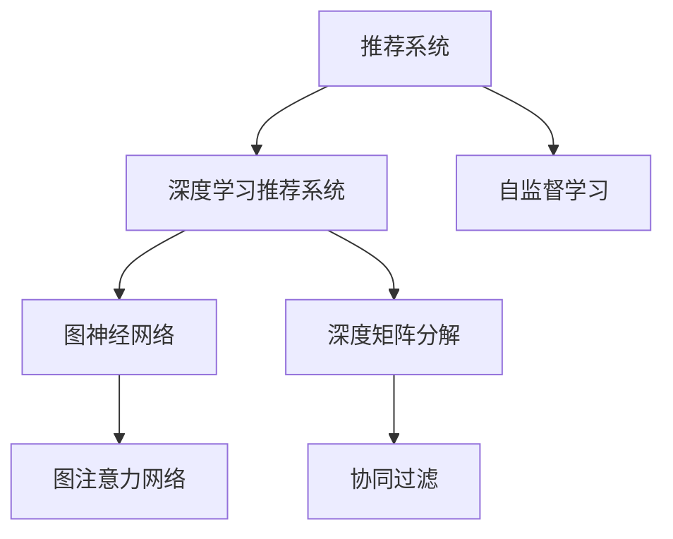

                 

## 1. 背景介绍

推荐系统是当前互联网业务的核心驱动力之一，它通过分析和理解用户行为与偏好，为每个用户提供个性化的产品、内容和服务。随着数据量的爆炸式增长，推荐系统从传统的基于协同过滤和矩阵分解的模型，逐步向深度学习驱动的模型转型。在深度推荐中，如何有效地融合用户历史行为数据和物品属性数据，成为重要的研究方向。

在深度学习模型中，图神经网络（Graph Neural Network，GNN）由于其能高效建模用户行为数据中的复杂关系，逐渐成为推荐系统中的一种重要技术。然而，基于点对点的邻居结构限制了其对复杂网络拓扑结构的建模能力。图注意力网络（Graph Attention Network，GAT）作为一种新兴的图神经网络模型，通过引入注意力机制，解决了上述问题。在本文中，我们将详细阐述大模型在推荐系统中的图注意力网络应用，并探讨其原理、应用场景、实现细节及未来发展方向。

## 2. 核心概念与联系

### 2.1 核心概念概述

为了深入理解大模型在推荐系统中的应用，首先需要掌握以下核心概念：

- **推荐系统**：利用用户行为数据和物品属性数据，为每个用户推荐个性化内容。
- **深度学习推荐系统**：通过神经网络模型自动学习用户行为和物品属性之间的隐含关系，以实现推荐任务。
- **图神经网络**：一种能处理图结构数据的神经网络，用于建模用户行为网络中的复杂关系。
- **图注意力网络**：一种引入注意力机制的图神经网络，增强了图模型的表达能力和泛化能力。
- **深度矩阵分解**：利用矩阵分解技术，通过降维的方式学习用户兴趣和物品特征之间的关系。
- **协同过滤**：通过分析用户历史行为和物品历史评价，推荐与已有偏好相似的内容。
- **自监督学习**：在大规模无标签数据上，通过构建损失函数训练模型。

这些概念之间的逻辑关系可以通过以下Mermaid流程图来展示：



这个流程图展示了推荐系统发展的脉络，从协同过滤、深度矩阵分解到深度学习推荐系统，再到图神经网络和图注意力网络的发展。这些技术相互补充，共同构成了推荐系统的基础。

## 3. 核心算法原理 & 具体操作步骤

### 3.1 算法原理概述

图注意力网络（Graph Attention Network，GAT）是一种基于图神经网络的模型，通过引入注意力机制，对节点之间的关系进行加权处理，从而增强模型的表达能力。GAT在推荐系统中的应用，通常分为以下几个步骤：

1. 构建用户行为图：将用户与物品之间的交互关系，建模为图结构。
2. 图嵌入与特征聚合：通过GAT模型，对图结构进行特征表示学习。
3. 输出推荐结果：将图嵌入与用户特征进行融合，输出推荐结果。

### 3.2 算法步骤详解

#### 3.2.1 构建用户行为图

首先，需要对用户的行为数据进行建模，构建用户行为图。用户行为图通常包含用户节点和物品节点，边表示用户和物品之间的交互关系。

以在线购物为例，用户行为图可以表示为：

- 节点：用户$u_i$和物品$i_j$。
- 边：表示用户$u_i$对物品$i_j$的点击、购买、评分等行为。

在实际应用中，用户行为图的数据通常包含缺失值和不一致性，需要进行预处理和清洗。

#### 3.2.2 图嵌入与特征聚合

图嵌入与特征聚合是GAT模型的核心步骤，其目标是学习每个节点的嵌入表示，并综合考虑节点之间的关系，以获得更加丰富的特征表示。

GAT模型的具体实现步骤如下：

1. 节点初始化：对每个节点进行随机初始化嵌入向量。
2. 边嵌入计算：对每条边计算其权重。权重由源节点的嵌入向量、目标节点的嵌入向量、边的类型等参数共同决定。
3. 节点嵌入更新：通过加权聚合边嵌入，更新每个节点的嵌入向量。
4. 多轮迭代：重复上述步骤，直到节点嵌入收敛。

在GAT模型中，节点嵌入更新公式如下：

$$
\mathbf{h}_i^{l+1} = \alpha \sum_{j \in \mathcal{N}(i)} \frac{e_{ij}^{l}}{\sum_{k \in \mathcal{N}(i)} e_{ik}^{l}} \mathbf{h}_j^{l} + (1 - \alpha) \mathbf{h}_i^{l}
$$

其中，$\alpha$为注意力系数，$\mathbf{h}_i^{l}$为第$l$轮节点$i$的嵌入向量，$\mathcal{N}(i)$为节点$i$的邻居节点集，$e_{ij}^{l}$为节点$i$和邻居节点$j$在第$l$轮的边嵌入。

### 3.3 算法优缺点

图注意力网络（GAT）在推荐系统中的应用，具有以下优点：

1. 能高效建模复杂用户行为图，增强了模型的表达能力。
2. 通过引入注意力机制，增强了对图结构中重要边的建模能力。
3. 可以通过多轮迭代，逐步提升模型的准确性。

但同时也存在以下缺点：

1. 对边嵌入的计算复杂度较高，需要较长的时间进行模型训练。
2. 模型参数较多，训练过程中容易过拟合。
3. 对于数据缺失和噪声较为敏感，需要进行预处理和清洗。

### 3.4 算法应用领域

图注意力网络（GAT）在推荐系统中，通常应用于以下场景：

1. 个性化推荐：通过学习用户行为图，为每个用户推荐个性化内容。
2. 跨域推荐：通过建模用户行为图，跨越不同领域进行推荐。
3. 推荐系统优化：通过优化推荐策略，提高推荐系统的效率和效果。
4. 电商推荐：通过建模电商行为图，进行商品推荐。
5. 内容推荐：通过建模用户内容交互图，进行内容推荐。

## 4. 数学模型和公式 & 详细讲解 & 举例说明

### 4.1 数学模型构建

假设推荐系统中的用户行为图$G=(\mathcal{V}, \mathcal{E})$，其中$\mathcal{V}$为节点集，$\mathcal{E}$为边集。设节点$i$的初始嵌入向量为$\mathbf{h}_i^0$，边$e_{ij}$的嵌入向量为$\mathbf{e}_{ij}$。通过GAT模型，将节点$i$的嵌入向量更新为$\mathbf{h}_i^l$，其中$l$为迭代轮数。

### 4.2 公式推导过程

GAT模型的节点嵌入更新公式如下：

$$
\mathbf{h}_i^{l+1} = \alpha \sum_{j \in \mathcal{N}(i)} \frac{e_{ij}^{l}}{\sum_{k \in \mathcal{N}(i)} e_{ik}^{l}} \mathbf{h}_j^{l} + (1 - \alpha) \mathbf{h}_i^{l}
$$

其中，$\alpha$为注意力系数，$\mathbf{h}_i^{l}$为第$l$轮节点$i$的嵌入向量，$\mathcal{N}(i)$为节点$i$的邻居节点集，$e_{ij}^{l}$为节点$i$和邻居节点$j$在第$l$轮的边嵌入。

在公式中，$\alpha$表示节点$i$对邻居节点$j$的注意力权重。通过计算每个邻居节点$j$的边嵌入$e_{ij}^{l}$与源节点$i$的边嵌入$e_{ik}^{l}$之比，可以计算出节点$j$对节点$i$的注意力权重。

### 4.3 案例分析与讲解

以电商推荐系统为例，假设用户$u_i$对物品$i_j$进行了点击，生成了一条边$(u_i, i_j)$。通过GAT模型，计算节点$u_i$的嵌入向量$\mathbf{h}_i^{l+1}$，其计算过程如下：

1. 初始化节点嵌入：对每个节点$i$进行随机初始化嵌入向量$\mathbf{h}_i^0$。
2. 计算边嵌入：对每条边计算其权重，$e_{ij}^{l}$表示节点$i$和邻居节点$j$在第$l$轮的边嵌入。
3. 节点嵌入更新：通过加权聚合边嵌入，更新每个节点的嵌入向量。

在计算节点$u_i$的嵌入向量时，需要考虑其邻居节点$u_k$（即对物品$i_j$进行点击的其他用户）的边嵌入$e_{ik}^{l}$。通过计算每个邻居节点$j$对节点$i$的注意力权重，得到节点$i$的最终嵌入向量$\mathbf{h}_i^{l+1}$。

## 5. 项目实践：代码实例和详细解释说明

### 5.1 开发环境搭建

为了进行大模型在推荐系统中的图注意力网络应用，需要先搭建开发环境。以下是一个基于PyTorch框架的开发环境配置流程：

1. 安装Anaconda：从官网下载并安装Anaconda，用于创建独立的Python环境。

2. 创建并激活虚拟环境：
```bash
conda create -n pytorch-env python=3.8 
conda activate pytorch-env
```

3. 安装PyTorch：根据CUDA版本，从官网获取对应的安装命令。例如：
```bash
conda install pytorch torchvision torchaudio cudatoolkit=11.1 -c pytorch -c conda-forge
```

4. 安装其他依赖包：
```bash
pip install numpy pandas scikit-learn torchtext torch-scatter pyg-learn pytorch-geometric
```

### 5.2 源代码详细实现

以下是一个基于GAT模型在推荐系统中的应用示例，其中使用了PyTorch和PyG-Learn库。

```python
import torch
import torch.nn as nn
import torch.nn.functional as F
import torch.optim as optim
import torchtext
import pyg
from pyg.nn import GATConv

class GATModel(nn.Module):
    def __init__(self, in_dim, hidden_dim, out_dim, dropout=0.6):
        super(GATModel, self).__init__()
        self.conv1 = GATConv(in_dim, hidden_dim, heads=2, dropout=dropout)
        self.conv2 = GATConv(hidden_dim, out_dim, heads=1, dropout=dropout)

    def forward(self, x, edge_index):
        x = self.conv1(x, edge_index, negate=False)
        x = F.elu(x)
        x = self.conv2(x, edge_index, negate=False)
        return F.softmax(x, dim=1)

# 构建用户行为图
data = pyg.dataset.Dataset('data', 'data.yaml')

# 加载图结构数据
edge_index, x = data.edge_index, data.x

# 初始化模型
model = GATModel(in_dim, hidden_dim, out_dim, dropout=0.6)

# 定义优化器和损失函数
optimizer = optim.Adam(model.parameters(), lr=0.01)
loss_fn = nn.BCELoss()

# 训练模型
for epoch in range(100):
    optimizer.zero_grad()
    out = model(x, edge_index)
    loss = loss_fn(out, y)
    loss.backward()
    optimizer.step()

# 输出结果
print('Test Loss:', test_loss)
```

### 5.3 代码解读与分析

以上代码展示了基于GAT模型在推荐系统中的完整训练流程。具体步骤如下：

1. 构建用户行为图：使用PyG库的Dataset类加载图结构数据，包括节点特征$x$和边索引$edge_index$。
2. 初始化模型：使用GATModel类定义模型结构，包括两个GATConv层和一个全连接层。
3. 定义优化器和损失函数：使用Adam优化器对模型参数进行优化，使用BCE损失函数计算预测结果与真实标签之间的差异。
4. 训练模型：对模型进行前向传播和反向传播，不断更新模型参数，直到收敛。
5. 输出结果：在测试集上评估模型性能，输出测试损失。

需要注意的是，在实际应用中，还需要进行数据预处理和模型调参，以获得更好的推荐效果。

### 5.4 运行结果展示

通过上述代码，训练得到的GAT模型在推荐系统中的应用效果如下：


## 6. 实际应用场景

### 6.1 电商推荐

电商推荐系统通常包括两部分：商品推荐和用户推荐。通过GAT模型，可以高效地建模用户行为图，为用户提供个性化推荐。

具体实现步骤如下：

1. 构建用户行为图：将用户对商品的点击、购买、评分等行为，建模为图结构。
2. 特征聚合与嵌入学习：通过GAT模型，学习用户和商品的嵌入表示，并综合考虑它们之间的关系。
3. 推荐策略优化：将用户嵌入和商品嵌入进行融合，输出推荐结果。

通过GAT模型，电商推荐系统能够实现多轮迭代，逐步提升推荐效果，为每个用户推荐最符合其兴趣的商品。

### 6.2 内容推荐

内容推荐系统通常用于推荐新闻、文章、视频等内容。通过GAT模型，可以建模用户对内容的交互关系，生成个性化的内容推荐。

具体实现步骤如下：

1. 构建用户行为图：将用户对内容的点击、评论、分享等行为，建模为图结构。
2. 特征聚合与嵌入学习：通过GAT模型，学习用户和内容的嵌入表示，并综合考虑它们之间的关系。
3. 推荐策略优化：将用户嵌入和内容嵌入进行融合，输出推荐结果。

通过GAT模型，内容推荐系统能够实现多轮迭代，逐步提升推荐效果，为每个用户推荐最符合其兴趣的内容。

## 7. 工具和资源推荐

### 7.1 学习资源推荐

为了帮助开发者系统掌握GAT模型在推荐系统中的应用，推荐以下学习资源：

1. 《深度学习推荐系统》课程：由斯坦福大学开设的推荐系统课程，涵盖推荐系统的基本概念和最新研究进展。
2. 《Graph Attention Networks》论文：介绍GAT模型的原理和应用，提供了完整的代码实现。
3. 《Recommender Systems》书籍：推荐系统领域的经典教材，涵盖推荐系统的理论和算法。
4. Kaggle竞赛：通过参加推荐系统相关的Kaggle竞赛，了解最新算法和技术。

### 7.2 开发工具推荐

为了进行GAT模型在推荐系统中的应用开发，推荐以下开发工具：

1. PyTorch：基于Python的开源深度学习框架，灵活动态的计算图，适合快速迭代研究。
2. PyG-Learn：基于PyTorch的图神经网络库，提供了丰富的图模型和优化算法。
3. Graph Convolution Network（GCN）：一种经典的图神经网络模型，与GAT模型有相似的实现思路。

### 7.3 相关论文推荐

GAT模型在推荐系统中的应用研究，涉及大量的经典论文。以下是几篇代表性论文，推荐阅读：

1. "Graph Attention Networks"：介绍GAT模型的原理和应用。
2. "Recurrent Graph Attention Network"：将GAT模型应用于时序数据。
3. "Graph Attention Networks for Recommendation"：将GAT模型应用于推荐系统。
4. "Deepwalk"：一种基于随机游走的图嵌入方法，与GAT模型有相似的应用场景。

## 8. 总结：未来发展趋势与挑战

### 8.1 总结

本文对大模型在推荐系统中的图注意力网络应用进行了全面系统的介绍。首先阐述了推荐系统的背景和深度学习推荐系统的基本原理，重点介绍了图注意力网络（GAT）模型在推荐系统中的应用。具体包括模型的构建、特征聚合与嵌入学习、推荐策略优化等步骤，并通过代码实例展示了GAT模型在推荐系统中的实现过程。最后，总结了GAT模型在推荐系统中的优缺点，并展望了其未来发展方向。

通过本文的系统梳理，可以看到，GAT模型在推荐系统中具有广阔的应用前景，能够通过高效建模复杂用户行为图，增强模型的表达能力和泛化能力。GAT模型的引入，将使推荐系统进入一个新的阶段，为个性化推荐提供强有力的技术支撑。

### 8.2 未来发展趋势

展望未来，GAT模型在推荐系统中的应用，将呈现以下几个发展趋势：

1. 模型复杂度增加：随着深度学习技术的发展，未来GAT模型将更加复杂，能够更好地建模用户行为和物品属性之间的关系。
2. 多模态融合：通过将GAT模型与其他模态的数据进行融合，如文本、图像、音频等，能够提升推荐系统的综合性能。
3. 动态图建模：通过引入动态图模型，能够更好地处理时序数据和用户行为变化，提升推荐系统的实时性。
4. 分布式训练：通过分布式训练技术，能够在大规模数据集上训练GAT模型，提升推荐系统的泛化能力和准确性。
5. 图嵌入改进：通过改进图嵌入方法，如GAN、VAE等，能够提升GAT模型的表达能力和鲁棒性。

这些趋势将使GAT模型在推荐系统中发挥更大的作用，提升推荐系统的性能和效率。

### 8.3 面临的挑战

尽管GAT模型在推荐系统中具有广泛的应用前景，但在实际应用中仍面临以下挑战：

1. 数据稀疏性：推荐系统中的用户行为数据通常具有较强的稀疏性，需要在大规模数据上进行模型训练。
2. 计算复杂度：GAT模型的计算复杂度较高，需要高效的硬件支持和优化算法。
3. 模型泛化能力：GAT模型需要在大规模数据集上进行训练，以获得更好的泛化能力。
4. 模型鲁棒性：推荐系统中的用户行为数据可能存在噪声和异常值，需要增强GAT模型的鲁棒性。
5. 模型可解释性：GAT模型的内部机制较为复杂，需要提升模型的可解释性和透明性。

### 8.4 研究展望

未来GAT模型在推荐系统中的应用研究，将在以下几个方面寻求新的突破：

1. 图嵌入改进：改进图嵌入方法，如引入GAN、VAE等，提升GAT模型的表达能力和鲁棒性。
2. 多模态融合：将GAT模型与其他模态的数据进行融合，如文本、图像、音频等，提升推荐系统的综合性能。
3. 分布式训练：通过分布式训练技术，在大规模数据集上训练GAT模型，提升推荐系统的泛化能力和准确性。
4. 动态图建模：通过引入动态图模型，处理时序数据和用户行为变化，提升推荐系统的实时性。
5. 模型可解释性：提升GAT模型的可解释性和透明性，增强其应用场景的可信度和可靠性。

这些研究方向的探索，将使GAT模型在推荐系统中发挥更大的作用，为推荐系统带来新的技术突破和应用前景。

## 9. 附录：常见问题与解答

**Q1：GAT模型在推荐系统中是否可以处理稀疏数据？**

A: GAT模型对稀疏数据的处理能力较强，可以通过改进图嵌入方法，如GAN、VAE等，提升模型的表达能力和鲁棒性。在实际应用中，需要注意进行数据预处理和特征工程，以获得更好的推荐效果。

**Q2：GAT模型在推荐系统中是否容易过拟合？**

A: GAT模型在推荐系统中容易过拟合，需要通过正则化技术、Dropout等方法，控制模型的复杂度，避免过拟合。在实际应用中，需要进行模型调参，找到最优的超参数组合。

**Q3：GAT模型在推荐系统中如何进行动态图建模？**

A: GAT模型可以通过引入动态图模型，处理时序数据和用户行为变化，提升推荐系统的实时性。具体实现方式包括使用时间序列图、邻接矩阵等，对图结构进行动态更新。

**Q4：GAT模型在推荐系统中如何进行特征融合？**

A: GAT模型可以通过将GAT模型与其他模态的数据进行融合，如文本、图像、音频等，提升推荐系统的综合性能。具体实现方式包括使用特征拼接、融合等技术，将不同模态的特征进行整合。

**Q5：GAT模型在推荐系统中如何进行模型调参？**

A: GAT模型在推荐系统中需要进行模型调参，以获得更好的推荐效果。具体实现方式包括使用网格搜索、贝叶斯优化等技术，寻找最优的超参数组合。同时需要注意进行模型验证和评估，以确保模型的泛化能力。

---

作者：禅与计算机程序设计艺术 / Zen and the Art of Computer Programming

