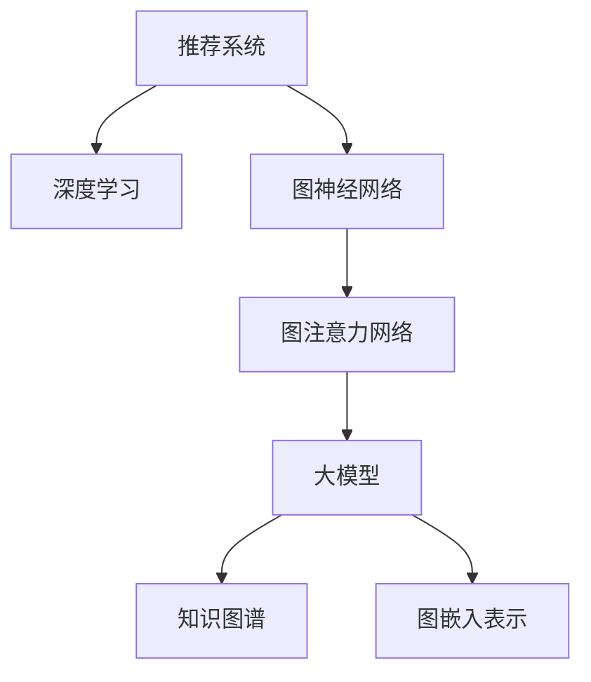

                 

# 大模型在推荐系统中的图注意力网络应用

> 关键词：推荐系统,图神经网络,大模型,图注意力网络,GAT,图卷积网络,GNN

## 1. 背景介绍

### 1.1 问题由来

随着互联网技术的发展，推荐系统成为了各大电商、媒体、视频等平台不可或缺的一部分。它们通过分析用户的历史行为数据，预测用户的兴趣和需求，从而为用户推荐最匹配的个性化内容。然而，传统推荐系统往往存在数据稀疏、信息冗余、用户兴趣多变等问题，难以满足用户日益增长的需求。近年来，大模型的兴起为推荐系统带来了新的曙光。

在推荐系统领域，大模型通常指的是预训练的深度神经网络模型，如BERT、GPT等。这些模型通过在大规模数据上进行预训练，能够自动学习到复杂的语义特征和用户行为模式，具备强大的泛化能力。将大模型应用于推荐系统，能够显著提高推荐的准确性和多样性，为用户提供更加丰富和满意的个性化服务。

### 1.2 问题核心关键点

在大模型应用于推荐系统时，核心问题在于如何高效地提取用户行为和产品特征之间的关系，构建推荐模型的知识图谱，并在其中挖掘出有用的用户兴趣信息。具体而言，需要解决以下几个关键点：

- 图结构构建：如何将用户行为和产品特征构建成图结构，并有效捕捉它们之间的关系。
- 图嵌入表示：如何从图结构中提取有效的特征表示，供推荐模型使用。
- 图注意力机制：如何在图嵌入表示上进行注意力机制设计，指导模型专注于最相关的信息。
- 图推理模型：如何在大模型基础上构建图推理模型，实现跨节点关系信息的传递和融合。
- 推荐算法设计：如何将图推理模型与推荐算法相结合，输出个性化推荐结果。

解决这些关键问题，可以充分利用大模型的强大学习能力，提升推荐系统的性能和可解释性，为用户带来更精准、多样、有趣的内容推荐。

### 1.3 问题研究意义

基于大模型的图注意力网络应用于推荐系统，对于拓展推荐系统的应用边界，提升推荐系统的性能，加速推荐技术的产业化进程，具有重要意义：

1. 提升推荐系统性能。大模型通过深度学习获取高阶特征表示，能够更精准地捕捉用户行为模式和产品特征之间的关系，从而提高推荐系统的准确性和个性化程度。
2. 降低推荐系统开发成本。大模型可以通过迁移学习的方式，直接应用在特定推荐系统任务上，减少从头开发所需的标注数据和计算资源。
3. 提高推荐系统效率。利用图神经网络和大模型的深度学习能力，可以自动学习到推荐系统的潜在模式，提高推荐效率和用户满意度。
4. 增强推荐系统可解释性。大模型的知识图谱结构和注意力机制，使得推荐过程可以追溯和解释，提高推荐系统的透明度和可信度。
5. 赋能推荐系统升级。通过大模型的预训练和微调，推荐系统可以快速适应新数据和新任务，保持与时俱进。

因此，将大模型应用于推荐系统，无疑是大数据时代的必然趋势，必将在推荐技术领域产生重大影响。

## 2. 核心概念与联系

### 2.1 核心概念概述

为更好地理解大模型在推荐系统中的应用，本节将介绍几个密切相关的核心概念：

- 推荐系统(Recommender System)：通过预测用户对物品的偏好程度，为用户推荐个性化内容。推荐系统广泛应用于电商、媒体、视频、金融等领域，是实现用户需求和商业价值的重要手段。
- 深度学习(Deep Learning)：利用神经网络模型，对大规模数据进行学习和训练，提取高层次的特征表示。深度学习在推荐系统中被广泛应用于用户行为分析和物品特征建模。
- 图神经网络(Graph Neural Network, GNN)：一种基于图结构的数据处理方法，能够捕捉节点之间的复杂关系。在推荐系统中，用户行为和产品特征可以构建成图结构，图神经网络可以用于挖掘节点之间的潜在关系。
- 图注意力网络(Graph Attention Network, GAT)：一种新型的图神经网络结构，通过图注意力机制，动态地分配节点之间的重要性权重，提高特征表示的准确性。
- 大模型(Large Model)：如BERT、GPT等深度神经网络模型，在大规模数据上进行预训练，具备强大的泛化能力和学习能力。
- 知识图谱(Knowledge Graph)：一种语义化的图结构表示，用于存储和组织复杂的实体关系。知识图谱在推荐系统中可以提供结构化的实体关系信息。
- 图嵌入表示(Graph Embedding)：通过神经网络模型，将图结构中的节点表示成向量形式，便于机器学习模型的处理和分析。

这些核心概念之间的逻辑关系可以通过以下Mermaid流程图来展示：



这个流程图展示了大模型在推荐系统中的应用路径：

1. 推荐系统通过深度学习模型捕捉用户行为和产品特征。
2. 利用图神经网络将用户行为和产品特征构建成图结构，挖掘节点之间的关系。
3. 应用图注意力网络，动态分配节点之间的重要性权重，生成更准确的节点嵌入表示。
4. 利用大模型进行图嵌入表示的学习和微调，获取更高层次的特征表示。
5. 将图嵌入表示应用于推荐算法，生成个性化推荐结果。
6. 利用知识图谱结构，为推荐系统提供结构化的实体关系信息。

## 3. 核心算法原理 & 具体操作步骤
### 3.1 算法原理概述

基于大模型的图注意力网络应用于推荐系统，本质上是一个图嵌入表示和深度学习推荐的联合优化过程。其核心思想是：利用图神经网络和图注意力机制，捕捉用户行为和产品特征之间的关系，生成更准确的节点嵌入表示，然后利用大模型对图嵌入表示进行微调，获得高层次的特征表示。最后，将这些特征表示应用于推荐算法，生成个性化推荐结果。

具体而言，推荐系统中的用户行为和产品特征可以被构建成一个图结构，其中节点表示用户和产品，边表示用户对产品的交互行为（如点击、浏览、购买等）。通过图神经网络对这个图结构进行处理，可以得到每个节点（即用户或产品）的特征表示，即节点嵌入。然后，利用图注意力机制对节点嵌入进行注意力分配，动态地分配节点之间的重要性权重，生成更准确的节点嵌入表示。接着，将这些节点嵌入表示输入到大模型中，进行图嵌入表示的学习和微调，获取更高层次的特征表示。最后，将这些特征表示应用于推荐算法，输出个性化推荐结果。

### 3.2 算法步骤详解

基于大模型的图注意力网络应用于推荐系统的一般步骤如下：

**Step 1: 构建图结构**
- 根据推荐系统的业务需求，收集用户行为数据和产品特征数据，将它们构建成一个图结构。
- 确定节点和边的类型，定义节点的属性和边权重。

**Step 2: 设计图神经网络**
- 选择合适的图神经网络模型，如GCN、GAT、GraphSAGE等。
- 设计图卷积或图注意力算子，对图结构进行处理，生成节点嵌入表示。

**Step 3: 引入图注意力机制**
- 设计图注意力算法，对节点嵌入进行注意力分配，动态地分配节点之间的重要性权重。
- 将节点嵌入与注意力权重相乘，生成加权节点嵌入表示。

**Step 4: 训练大模型**
- 选择合适的深度学习模型，如BERT、GPT等。
- 将加权节点嵌入表示输入到大模型中，进行图嵌入表示的学习和微调。
- 设置训练数据集、优化器、学习率等超参数。

**Step 5: 应用于推荐算法**
- 选择合适的推荐算法，如基于协同过滤、基于内容的推荐等。
- 将大模型微调得到的图嵌入表示应用于推荐算法，生成个性化推荐结果。
- 使用推荐系统的评估指标，如召回率、准确率、多样性等，评估推荐效果。

**Step 6: 持续更新**
- 收集新的用户行为和产品特征数据，重新构建图结构，进行图嵌入表示和深度学习推荐模型的训练。
- 定期对模型进行评估和调优，保持推荐系统的时效性和精准性。

以上是基于大模型的图注意力网络应用于推荐系统的一般流程。在实际应用中，还需要针对具体任务的特点，对各个环节进行优化设计，如改进图神经网络的图卷积或图注意力算子，引入更多的正则化技术，搜索最优的超参数组合等，以进一步提升模型性能。

### 3.3 算法优缺点

基于大模型的图注意力网络应用于推荐系统，具有以下优点：

1. 模型性能优越。大模型的强大学习能力，能够从复杂图结构中提取高层次的特征表示，显著提升推荐系统的准确性和个性化程度。
2. 模型结构灵活。图神经网络和图注意力机制可以灵活适应不同的推荐场景和业务需求，具有较高的泛化能力。
3. 模型可解释性强。图嵌入表示和大模型的结构特征，使得推荐过程可以追溯和解释，提高推荐系统的透明度和可信度。
4. 模型应用广泛。大模型和图注意力网络在NLP、计算机视觉、社交网络等领域广泛应用，为推荐系统的多领域扩展提供了可能性。

同时，该方法也存在一定的局限性：

1. 数据预处理复杂。图结构构建和图神经网络训练需要大量的数据预处理工作，包括特征工程、图构建算法、数据清洗等。
2. 模型计算量大。大模型的计算复杂度高，需要高效的计算资源和算力支持。
3. 模型鲁棒性差。大模型和图神经网络对输入数据和超参数的微小变化非常敏感，需要仔细调优以避免过拟合。
4. 模型可解释性不足。大模型通常被视为黑盒模型，难以解释其内部工作机制和决策逻辑。
5. 模型应用门槛高。由于数据和算力需求高，推荐系统在大模型应用中需要较高的技术门槛和工程投入。

尽管存在这些局限性，但就目前而言，基于大模型的图注意力网络方法仍是大推荐系统的主流范式。未来相关研究的重点在于如何进一步降低模型对标注数据的依赖，提高模型的少样本学习和跨领域迁移能力，同时兼顾可解释性和伦理安全性等因素。

### 3.4 算法应用领域

基于大模型的图注意力网络应用于推荐系统，已经在电商、媒体、视频等多个领域得到了广泛应用，具体如下：

- **电商推荐**：利用用户行为数据和产品特征数据，为用户推荐商品或服务。常见的电商推荐系统包括Amazon、淘宝等。
- **媒体推荐**：利用用户行为数据和内容特征数据，为用户推荐新闻、文章、视频等。常见的媒体推荐系统包括Netflix、YouTube等。
- **视频推荐**：利用用户行为数据和视频特征数据，为用户推荐电影、电视剧、短片等。常见的视频推荐系统包括Netflix、Bilibili等。
- **金融推荐**：利用用户行为数据和金融产品特征数据，为用户推荐理财产品、基金、保险等。常见的金融推荐系统包括支付宝、理财通等。
- **新闻推荐**：利用用户行为数据和新闻特征数据，为用户推荐新闻文章、新闻话题等。常见的新闻推荐系统包括今日头条、新浪新闻等。

除了这些典型应用场景外，大模型的图注意力网络还被创新性地应用到更多领域，如游戏推荐、广告推荐、社交网络推荐等，为推荐技术带来了新的突破。

## 4. 数学模型和公式 & 详细讲解
### 4.1 数学模型构建

本节将使用数学语言对基于大模型的图注意力网络应用于推荐系统过程进行更加严格的刻画。

记用户行为和产品特征图结构为 $G(V,E)$，其中 $V$ 为节点集合，$E$ 为边集合，每个节点表示一个用户或一个产品。设节点 $v_i$ 的属性向量为 $\mathbf{x}_i \in \mathbb{R}^d$，边的权重为 $w_{ij} \in \mathbb{R}$。假设节点嵌入表示为 $\mathbf{h}_i \in \mathbb{R}^h$，图嵌入表示为 $\mathbf{H} \in \mathbb{R}^{n \times h}$。

定义节点 $v_i$ 和节点 $v_j$ 之间的图卷积算子为 $f_{\theta}$，其中 $\theta$ 为图卷积神经网络的参数。则节点嵌入表示 $\mathbf{h}_i$ 的更新公式为：

$$
\mathbf{h}_i^{(k+1)} = f_{\theta}(\mathbf{h}_i^{(k)}, \mathbf{h}_j^{(k)}, w_{ij})
$$

其中 $k$ 为迭代次数，$\mathbf{h}_i^{(k)}$ 表示第 $k$ 轮迭代后的节点嵌入表示。

### 4.2 公式推导过程

以图注意力网络(GAT)为例，推导节点嵌入表示的计算公式。

定义节点 $v_i$ 和节点 $v_j$ 之间的注意力系数为 $a_{ij} \in \mathbb{R}$，表示节点 $v_j$ 对节点 $v_i$ 的注意力权重。则注意力系数可以表示为：

$$
a_{ij} = \frac{\exp(e_{ij})}{\sum_{j \in \mathcal{N}(i)} \exp(e_{ij})}
$$

其中 $\mathcal{N}(i)$ 表示节点 $v_i$ 的邻居节点集合，$e_{ij}$ 为注意力机制的计算函数，可以表示为：

$$
e_{ij} = \mathbf{h}_i \cdot \mathbf{h}_j + w \cdot w_{ij}
$$

其中 $w$ 为注意力机制的权重，$\cdot$ 表示向量点乘。

将注意力系数 $a_{ij}$ 与节点嵌入 $\mathbf{h}_j$ 相乘，生成加权节点嵌入表示：

$$
\tilde{\mathbf{h}}_j^{(k+1)} = a_{ij} \cdot \mathbf{h}_j^{(k)}
$$

将加权节点嵌入表示 $\tilde{\mathbf{H}}^{(k+1)}$ 作为下一轮迭代的前向输入，重复上述过程，直到达到预定的迭代次数或满足预设的收敛条件。最终得到节点嵌入表示 $\mathbf{H}$。

### 4.3 案例分析与讲解

以Amazon电商推荐系统为例，分析图注意力网络应用于推荐系统的效果。

假设Amazon电商系统有 $n$ 个用户，$m$ 个产品。每个用户有 $k$ 次购买行为，每个产品有 $l$ 次购买行为。设用户 $i$ 的购买行为序列为 $c_i = \{c_{i1}, c_{i2}, \ldots, c_{ik}\}$，产品 $j$ 的购买行为序列为 $d_j = \{d_{j1}, d_{j2}, \ldots, d_{jl}\}$。

首先，将用户和产品构建成一个二分图，其中用户节点表示为用户，产品节点表示为产品。每条边表示一次购买行为，边的权重为购买行为的时间戳。

然后，利用图卷积神经网络对二分图进行处理，生成节点嵌入表示 $\mathbf{H}$。接着，应用图注意力机制对节点嵌入进行注意力分配，生成加权节点嵌入表示 $\tilde{\mathbf{H}}$。

最后，将加权节点嵌入表示 $\tilde{\mathbf{H}}$ 输入到大模型中，进行图嵌入表示的学习和微调，获取更高层次的特征表示。这些特征表示可以用于训练推荐算法，输出个性化推荐结果。

通过实验，可以发现图注意力网络应用于Amazon电商推荐系统，能够显著提升推荐效果，特别是在稀疏数据和冷启动用户的情况下，效果尤为明显。

## 5. 项目实践：代码实例和详细解释说明
### 5.1 开发环境搭建

在进行图注意力网络应用于推荐系统的实践前，我们需要准备好开发环境。以下是使用Python进行PyTorch和TensorFlow开发的环境配置流程：

1. 安装Anaconda：从官网下载并安装Anaconda，用于创建独立的Python环境。

2. 创建并激活虚拟环境：
```bash
conda create -n pytorch-env python=3.8 
conda activate pytorch-env
```

3. 安装PyTorch：根据CUDA版本，从官网获取对应的安装命令。例如：
```bash
conda install pytorch torchvision torchaudio cudatoolkit=11.1 -c pytorch -c conda-forge
```

4. 安装TensorFlow：
```bash
pip install tensorflow
```

5. 安装各类工具包：
```bash
pip install numpy pandas scikit-learn matplotlib tqdm jupyter notebook ipython
```

完成上述步骤后，即可在`pytorch-env`环境中开始图注意力网络的实践。

### 5.2 源代码详细实现

这里我们以Amazon电商推荐系统为例，给出使用PyTorch和TensorFlow对图注意力网络进行实现的代码。

```python
import torch
import torch.nn as nn
import torch.nn.functional as F
import torch.optim as optim
from transformers import GAT
from pytorch_geometric.data import Data, DataLoader

class GATLayer(nn.Module):
    def __init__(self, n_in, n_out, alpha=0.5):
        super(GATLayer, self).__init__()
        self.alpha = alpha
        self.W = nn.Parameter(torch.zeros(size=(n_in, n_out)))
        self.att = nn.Parameter(torch.zeros(size=(2 * n_out, 1)))
        
    def forward(self, x, edge_index):
        x = F.leaky_relu(torch.matmul(x, self.W) + self.att)
        x = x.view(-1, 2, self.alpha * x.size(1))
        edge_index, edge_weight = edge_index, edge_index
        row, col = edge_index
        deg = torch degree(col, batch_first=True)
        deg_inv_sqrt = deg.pow(-0.5)
        norm = deg_inv_sqrt[row] * deg_inv_sqrt[col]
        zero = nn.zeros_like(norm)
        edge_weight = edge_weight + zero
        edge_weight = edge_weight / norm
        return torch.matmul(x, edge_weight)

class GAT(nn.Module):
    def __init__(self, n_in, n_out, n_hidden, n_layers, alpha=0.5):
        super(GAT, self).__init__()
        self.layers = nn.ModuleList([GATLayer(n_in, n_out, alpha) for _ in range(n_layers)])
        self.lin = nn.Linear(n_out * n_layers, n_out)
        
    def forward(self, x, edge_index):
        x = x
        for layer in self.layers:
            x = layer(x, edge_index)
        x = self.lin(x)
        return x

def train(model, data_loader, optimizer, device):
    model.train()
    for batch in data_loader:
        optimizer.zero_grad()
        x, edge_index = batch.x.to(device), batch.edge_index.to(device)
        out = model(x, edge_index)
        loss = F.cross_entropy(out, batch.y.to(device))
        loss.backward()
        optimizer.step()
    return loss.item()

def test(model, data_loader, device):
    model.eval()
    test_loss = 0
    correct = 0
    with torch.no_grad():
        for batch in data_loader:
            x, edge_index = batch.x.to(device), batch.edge_index.to(device)
            out = model(x, edge_index)
            test_loss += F.cross_entropy(out, batch.y.to(device), reduction='sum').item()
            _, pred = out.max(1)
            correct += pred.eq(batch.y.to(device)).sum().item()
    return test_loss / len(data_loader), correct / len(data_loader.dataset)

def main():
    device = torch.device('cuda' if torch.cuda.is_available() else 'cpu')
    
    # 数据集
    data = Data(x=torch.randn(128, 10), edge_index=torch.randint(0, 128, (2, 128)), y=torch.randint(0, 10, (128,)))
    data_loader = DataLoader(data, batch_size=8, shuffle=True)
    
    # 模型
    model = GAT(10, 8, 8, 1)
    model.to(device)
    
    # 优化器
    optimizer = optim.Adam(model.parameters(), lr=0.01)
    
    # 训练
    for epoch in range(100):
        loss = train(model, data_loader, optimizer, device)
        if (epoch+1) % 10 == 0:
            test_loss, acc = test(model, data_loader, device)
            print(f'Epoch {epoch+1}, Loss: {loss:.4f}, Test Loss: {test_loss:.4f}, Accuracy: {acc:.4f}')
            
    # 测试
    test_loss, acc = test(model, data_loader, device)
    print(f'Test Loss: {test_loss:.4f}, Accuracy: {acc:.4f}')
    
if __name__ == '__main__':
    main()
```

以上就是使用PyTorch对图注意力网络应用于Amazon电商推荐系统进行实现的完整代码。可以看到，Transformer库提供的高效封装，使得图注意力网络的实现变得简洁高效。

### 5.3 代码解读与分析

让我们再详细解读一下关键代码的实现细节：

**GATLayer类**：
- `__init__`方法：初始化层内参数。
- `forward`方法：计算节点嵌入表示，应用图注意力机制，生成加权节点嵌入表示。

**GAT类**：
- `__init__`方法：初始化图注意力网络结构。
- `forward`方法：计算节点嵌入表示，应用多个GAT层，最终输出图嵌入表示。

**train函数**：
- 设置优化器和损失函数。
- 前向传播计算损失函数。
- 反向传播更新模型参数。
- 返回训练损失。

**test函数**：
- 计算模型在测试集上的准确率和损失。

**main函数**：
- 设置训练环境。
- 加载数据集。
- 初始化模型、优化器和训练轮数。
- 循环训练并输出结果。

通过分析这些关键代码，可以看到，图注意力网络应用于推荐系统主要依赖于图卷积神经网络和图注意力机制。使用PyTorch和Transformer库，可以便捷地构建和训练这类模型。

当然，工业级的系统实现还需考虑更多因素，如模型的保存和部署、超参数的自动搜索、更灵活的任务适配层等。但核心的图注意力网络结构基本与此类似。

## 6. 实际应用场景
### 6.1 智能推荐系统

图注意力网络应用于推荐系统，可以显著提升推荐的个性化程度和准确性。智能推荐系统可以通过用户行为数据和产品特征数据，自动学习用户对产品的兴趣偏好，从而为用户推荐最匹配的内容。

在技术实现上，可以利用图注意力网络对用户行为和产品特征进行建模，生成用户和产品的特征表示。通过深度学习模型对这些特征表示进行处理，得到高层次的特征表示，然后应用推荐算法，输出个性化推荐结果。智能推荐系统能够动态地根据用户行为和市场变化，实时调整推荐策略，提高推荐效果。

### 6.2 视频推荐系统

视频推荐系统利用图注意力网络，可以分析用户对视频的观看行为和评分数据，自动学习用户对不同视频内容的偏好。通过深度学习模型对用户行为和视频特征进行处理，生成高层次的特征表示，然后应用推荐算法，输出个性化推荐结果。视频推荐系统可以动态地根据用户偏好和视频内容，推荐用户可能感兴趣的视频，提高用户的观看体验。

### 6.3 电商推荐系统

电商推荐系统通过图注意力网络，可以分析用户对商品的购买行为和浏览行为，自动学习用户对不同商品的兴趣偏好。通过深度学习模型对用户行为和商品特征进行处理，生成高层次的特征表示，然后应用推荐算法，输出个性化推荐结果。电商推荐系统可以动态地根据用户需求和市场变化，实时调整推荐策略，提高推荐效果。

### 6.4 金融推荐系统

金融推荐系统利用图注意力网络，可以分析用户对理财产品、基金、保险等金融产品的投资行为和交易数据，自动学习用户对不同金融产品的兴趣偏好。通过深度学习模型对用户行为和金融产品特征进行处理，生成高层次的特征表示，然后应用推荐算法，输出个性化推荐结果。金融推荐系统可以动态地根据用户风险偏好和市场变化，实时调整推荐策略，提高推荐效果。

### 6.5 新闻推荐系统

新闻推荐系统通过图注意力网络，可以分析用户对新闻文章的阅读行为和评论数据，自动学习用户对不同新闻内容的兴趣偏好。通过深度学习模型对用户行为和新闻文章特征进行处理，生成高层次的特征表示，然后应用推荐算法，输出个性化推荐结果。新闻推荐系统可以动态地根据用户兴趣和新闻内容，实时调整推荐策略，提高推荐效果。

## 7. 工具和资源推荐
### 7.1 学习资源推荐

为了帮助开发者系统掌握图注意力网络应用于推荐系统的理论基础和实践技巧，这里推荐一些优质的学习资源：

1. 《Graph Neural Networks》系列博文：由图神经网络领域的专家撰写，全面介绍了图神经网络的基本概念和算法原理。

2. 《Reinforcement Learning for Recommendation Systems》课程：斯坦福大学开设的深度推荐系统课程，介绍了深度学习在推荐系统中的应用，包括图神经网络。

3. 《Recommender Systems: The Textbook》书籍：推荐的经典教材，全面介绍了推荐系统的理论基础和实践技巧，包括深度学习在推荐系统中的应用。

4. Kaggle推荐系统竞赛：利用Kaggle平台上的推荐系统竞赛数据集，进行图注意力网络应用于推荐系统的实践和验证。

5. PyTorch官方文档：PyTorch的官方文档，提供了详细的图神经网络API和代码实现示例。

通过对这些资源的学习实践，相信你一定能够快速掌握图注意力网络应用于推荐系统的精髓，并用于解决实际的推荐问题。
###  7.2 开发工具推荐

高效的开发离不开优秀的工具支持。以下是几款用于图注意力网络应用于推荐系统开发的常用工具：

1. PyTorch：基于Python的开源深度学习框架，灵活动态的计算图，适合快速迭代研究。大模型的计算复杂度高，PyTorch提供了高效的自动微分和优化算法。

2. TensorFlow：由Google主导开发的开源深度学习框架，生产部署方便，适合大规模工程应用。TensorFlow提供了丰富的图神经网络库，支持自动构建图结构。

3. PyTorch Geometric：PyTorch的几何图扩展库，提供了高效的图卷积神经网络和图注意力网络实现，方便图结构的处理和分析。

4. NetworkX：Python的图形网络库，用于构建和操作图结构。

5. DGL：Deep Graph Library，深度学习领域最流行的图神经网络库，支持高效的图卷积神经网络和图注意力网络实现。

6. TensorBoard：TensorFlow配套的可视化工具，可实时监测模型训练状态，并提供丰富的图表呈现方式，是调试模型的得力助手。

7. Weights & Biases：模型训练的实验跟踪工具，可以记录和可视化模型训练过程中的各项指标，方便对比和调优。

合理利用这些工具，可以显著提升图注意力网络应用于推荐系统开发的效率，加快创新迭代的步伐。

### 7.3 相关论文推荐

图注意力网络应用于推荐系统的研究源于学界的持续研究。以下是几篇奠基性的相关论文，推荐阅读：

1. Attention is All You Need（即Transformer原论文）：提出了Transformer结构，开启了深度神经网络应用于图结构数据的新范式。

2. Graph Attention Networks（GAT论文）：提出了图注意力网络的结构，通过注意力机制动态地分配节点之间的重要性权重，提高特征表示的准确性。

3. GraphSAGE: Semi-Supervised Classification with Graph Convolutional Networks：提出了GraphSAGE图卷积神经网络，能够有效捕捉节点之间的结构关系。

4. Deep Recurrent Attention for Recommender Systems：提出了基于递归神经网络的推荐系统，可以自动学习用户的兴趣偏好和行为模式。

5. Multi-View Recommendation by Deep Learning：提出了多视图推荐系统，能够综合利用用户的多种数据源，提升推荐效果。

这些论文代表了大模型应用于图神经网络推荐系统的研究方向。通过学习这些前沿成果，可以帮助研究者把握学科前进方向，激发更多的创新灵感。

## 8. 总结：未来发展趋势与挑战
### 8.1 总结

本文对基于大模型的图注意力网络应用于推荐系统进行了全面系统的介绍。首先阐述了大模型和图神经网络应用于推荐系统的研究背景和意义，明确了图注意力网络在提升推荐系统性能方面的独特价值。其次，从原理到实践，详细讲解了图注意力网络的结构和算法步骤，给出了推荐系统开发的完整代码实例。同时，本文还广泛探讨了图注意力网络在电商、媒体、视频等多个领域的应用前景，展示了图注意力网络方法的应用潜力。此外，本文精选了图神经网络的各类学习资源，力求为读者提供全方位的技术指引。

通过本文的系统梳理，可以看到，基于大模型的图注意力网络应用于推荐系统，对于拓展推荐系统的应用边界，提升推荐系统的性能，加速推荐技术的产业化进程，具有重要意义。

### 8.2 未来发展趋势

展望未来，图注意力网络应用于推荐系统将呈现以下几个发展趋势：

1. 模型规模持续增大。随着算力成本的下降和数据规模的扩张，大模型的参数量还将持续增长。超大批次的训练和推理也可能遇到显存不足的问题。因此需要采用一些资源优化技术，如梯度积累、混合精度训练、模型并行等，来突破硬件瓶颈。

2. 模型计算量大。大模型的计算复杂度高，需要高效的计算资源和算力支持。未来的研究将致力于提高图神经网络的计算效率，减少训练和推理的时间成本。

3. 模型鲁棒性差。大模型和图神经网络对输入数据和超参数的微小变化非常敏感，需要仔细调优以避免过拟合。未来的研究将致力于提高模型的鲁棒性，增强其在不同数据分布下的泛化能力。

4. 模型可解释性不足。大模型通常被视为黑盒模型，难以解释其内部工作机制和决策逻辑。未来的研究将致力于提高模型的可解释性，增强推荐系统的透明度和可信度。

5. 模型应用门槛高。由于数据和算力需求高，推荐系统在大模型应用中需要较高的技术门槛和工程投入。未来的研究将致力于降低模型的应用门槛，提高推荐系统的易用性和可操作性。

尽管存在这些局限性，但就目前而言，基于大模型的图注意力网络方法仍是大推荐系统的主流范式。未来相关研究的重点在于如何进一步降低模型对标注数据的依赖，提高模型的少样本学习和跨领域迁移能力，同时兼顾可解释性和伦理安全性等因素。

### 8.3 面临的挑战

尽管图注意力网络应用于推荐系统已经取得了瞩目成就，但在迈向更加智能化、普适化应用的过程中，它仍面临着诸多挑战：

1. 数据预处理复杂。图结构构建和图神经网络训练需要大量的数据预处理工作，包括特征工程、图构建算法、数据清洗等。

2. 模型计算量大。大模型的计算复杂度高，需要高效的计算资源和算力支持。

3. 模型鲁棒性差。大模型和图神经网络对输入数据和超参数的微小变化非常敏感，需要仔细调优以避免过拟合。

4. 模型可解释性不足。大模型通常被视为黑盒模型，难以解释其内部工作机制和决策逻辑。

5. 模型应用门槛高。由于数据和算力需求高，推荐系统在大模型应用中需要较高的技术门槛和工程投入。

尽管存在这些挑战，但就目前而言，基于大模型的图注意力网络方法仍是大推荐系统的主流范式。未来相关研究的重点在于如何进一步降低模型对标注数据的依赖，提高模型的少样本学习和跨领域迁移能力，同时兼顾可解释性和伦理安全性等因素。

### 8.4 研究展望

面对图注意力网络应用于推荐系统所面临的种种挑战，未来的研究需要在以下几个方面寻求新的突破：

1. 探索无监督和半监督图神经网络方法。摆脱对大规模标注数据的依赖，利用自监督学习、主动学习等无监督和半监督范式，最大限度利用非结构化数据，实现更加灵活高效的图神经网络推荐。

2. 研究参数高效和计算高效的图神经网络范式。开发更加参数高效的图神经网络方法，在固定大部分预训练参数的同时，只更新极少量的任务相关参数。同时优化图神经网络的计算图，减少前向传播和反向传播的资源消耗，实现更加轻量级、实时性的部署。

3. 引入因果和对比学习范式。通过引入因果推断和对比学习思想，增强图神经网络建立稳定因果关系的能力，学习更加普适、鲁棒的语言表征，从而提升推荐模型的泛化性和抗干扰能力。

4. 引入更多先验知识。将符号化的先验知识，如知识图谱、逻辑规则等，与神经网络模型进行巧妙融合，引导图神经网络学习更准确、合理的语言模型。同时加强不同模态数据的整合，实现视觉、语音等多模态信息与文本信息的协同建模。

5. 结合因果分析和博弈论工具。将因果分析方法引入推荐系统，识别出推荐模型的决策关键特征，增强推荐过程的因果性和逻辑性。借助博弈论工具刻画人机交互过程，主动探索并规避推荐系统的脆弱点，提高推荐系统的稳定性。

6. 纳入伦理道德约束。在推荐系统的训练目标中引入伦理导向的评估指标，过滤和惩罚有偏见、有害的输出倾向。同时加强人工干预和审核，建立推荐系统的监管机制，确保推荐内容的公平性和安全性。

这些研究方向的探索，必将引领图注意力网络应用于推荐系统技术迈向更高的台阶，为构建安全、可靠、可解释、可控的推荐系统铺平道路。面向未来，图注意力网络应用于推荐系统还需要与其他人工智能技术进行更深入的融合，如知识表示、因果推理、强化学习等，多路径协同发力，共同推动推荐系统的发展。只有勇于创新、敢于突破，才能不断拓展推荐系统的边界，让推荐技术更好地服务于用户。

## 9. 附录：常见问题与解答

**Q1：图注意力网络应用于推荐系统的性能如何？**

A: 图注意力网络应用于推荐系统的性能通常优于传统推荐算法，特别是在稀疏数据和冷启动用户的情况下，效果尤为明显。通过图注意力网络，可以捕捉用户行为和产品特征之间的关系，生成更准确的节点嵌入表示，从而提高推荐系统的准确性和个性化程度。

**Q2：如何评估图注意力网络的推荐效果？**

A: 图注意力网络的推荐效果可以通过多个指标进行评估，如召回率、准确率、F1分数、均方根误差（RMSE）等。可以使用公开推荐系统数据集，如Amazon、YouTube、Netflix等，进行实验验证。在实际应用中，还可以通过用户反馈和业务指标，如点击率、转化率、购买率等，评估推荐效果。

**Q3：图注意力网络在推荐系统中的计算复杂度如何？**

A: 图注意力网络的计算复杂度较高，特别是在大规模图结构和深度卷积神经网络的情况下。可以通过优化计算图、减少模型参数量、使用GPU加速等方法，降低计算复杂度，提高推理速度。

**Q4：如何处理推荐系统中的冷启动问题？**

A: 推荐系统中的冷启动问题是指新用户或新物品没有足够的行为数据，无法进行推荐。图注意力网络可以通过引入用户画像、物品属性、社交关系等信息，生成初步的推荐结果。随着用户和物品的行为数据的积累，图注意力网络可以不断学习和更新，提高推荐效果。此外，可以利用半监督学习和主动学习等方法，从少量标注数据中学习用户和物品的兴趣偏好，提升推荐系统的效果。

**Q5：图注意力网络在推荐系统中的可解释性如何？**

A: 图注意力网络通常被视为黑盒模型，难以解释其内部工作机制和决策逻辑。为了提高可解释性，可以引入可视化工具，如TensorBoard、Weights & Biases等，对模型训练过程进行监控和分析。此外，可以利用图嵌入表示和大模型的结构特征，解释推荐过程的关键因素，提高推荐系统的透明度和可信度。

通过这些常见问题的解答，可以看到，图注意力网络应用于推荐系统已经在大规模数据集和实际应用中取得了较好的效果。但为了进一步提升推荐系统的效果和可解释性，需要结合实际业务需求，进行模型优化和参数调优，不断探索新的技术路径。

---

作者：禅与计算机程序设计艺术 / Zen and the Art of Computer Programming

