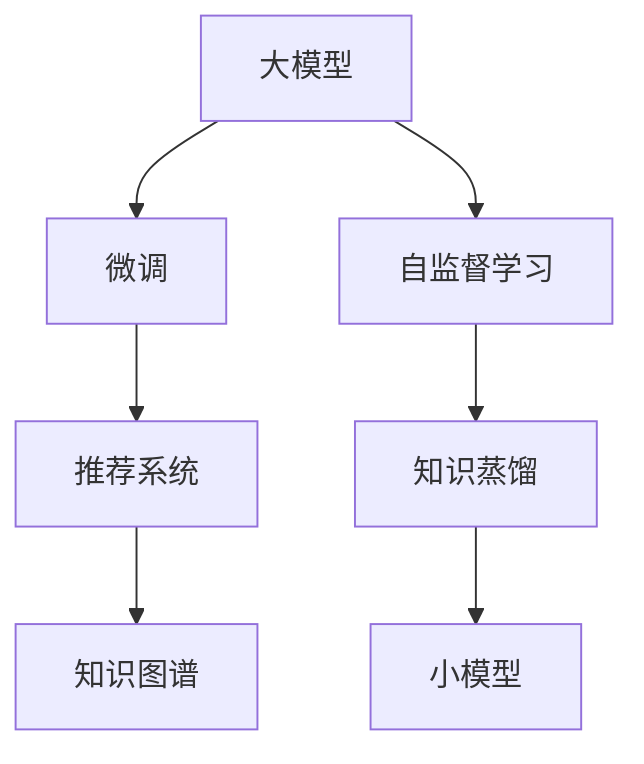

                 

# 大模型在推荐系统中的知识蒸馏应用

> 关键词：知识蒸馏,大模型,推荐系统,知识图谱,自监督学习,协同过滤

## 1. 背景介绍

在推荐系统领域，深度学习技术尤其是深度神经网络的应用取得了巨大成功。传统的协同过滤方法由于忽略了用户行为背后的上下文信息，难以捕捉用户隐式偏好和长尾物品的推荐效果。深度学习推荐系统通过构建用户-物品的稠密矩阵，学习用户隐向量、物品隐向量以及用户与物品间的交互矩阵，可以更准确地捕捉用户偏好和物品属性，实现个性化推荐。然而，这些深度学习模型通常需要大规模的标注数据，难以泛化到新的用户和物品上。

大模型如BERT、GPT等，通过在海量无标签文本数据上进行预训练，学习到丰富的语言知识，包括词义、语法、语境等，具备强大的语义表示和理解能力。在推荐系统中，可以通过在大模型上微调（fine-tuning）来提取用户和物品的语义特征，提升推荐效果。但大模型的微调通常需要较长的训练时间和大量的计算资源，对实际应用来说并不实用。

知识蒸馏（Knowledge Distillation）技术，通过将大模型的知识传递给一个小模型，可以避免上述问题。知识蒸馏将大模型的隐含知识转化为小模型的显式知识，使小模型能够学习到大模型的强大表示能力。在推荐系统中，知识蒸馏可以用来提高小模型的推荐准确率和泛化能力。本文将系统介绍大模型在推荐系统中的知识蒸馏应用。

## 2. 核心概念与联系

### 2.1 核心概念概述

在推荐系统中，知识蒸馏的应用涉及以下几个关键概念：

- 大模型（Large Model）：以BERT、GPT等深度神经网络为代表的大规模预训练模型。通过在海量无标签文本数据上进行预训练，学习到丰富的语言知识，具备强大的语义表示和理解能力。

- 微调（Fine-Tuning）：指在预训练模型的基础上，使用推荐系统中的标注数据，通过有监督学习优化模型在推荐任务上的性能。

- 知识蒸馏（Knowledge Distillation）：指通过将大模型的知识传递给一个小模型，提升小模型的推荐准确率和泛化能力。

- 自监督学习（Self-Supervised Learning）：指在大模型上，通过无标签数据进行预训练，学习到丰富的语言知识，包括词义、语法、语境等。

- 协同过滤（Collaborative Filtering）：指通过用户行为数据，构建用户-物品矩阵，进行推荐。

- 知识图谱（Knowledge Graph）：指将推荐系统中涉及的实体、关系、属性等信息进行结构化表示，提高推荐系统的推理能力和泛化能力。

这些概念之间的联系可以通过以下Mermaid流程图来展示：



这个流程图展示了大模型在推荐系统中的核心概念及其之间的关系：

1. 大模型通过自监督学习获得丰富的语言知识。
2. 微调将大模型的知识应用于推荐系统。
3. 知识蒸馏将大模型的知识传递给一个小模型。
4. 小模型在推荐系统中进行协同过滤，并使用知识蒸馏获得更好的推荐效果。
5. 知识图谱用于提高推荐系统的推理能力和泛化能力。

## 3. 核心算法原理 & 具体操作步骤
### 3.1 算法原理概述

在大模型在推荐系统中的知识蒸馏应用中，首先通过自监督学习，在大模型上学习到丰富的语言知识。然后，通过微调，将大模型的知识应用于推荐系统中的用户和物品表示。最后，通过知识蒸馏，将大模型的知识传递给一个小模型，提高小模型的推荐准确率和泛化能力。

知识蒸馏的原理是，大模型能够学习到复杂的语义表示，而小模型由于参数量较少，难以直接学习到这些复杂的表示。通过知识蒸馏，大模型的知识被转化成小模型的显式表示，从而提升小模型的性能。

知识蒸馏的过程一般包括以下几个步骤：

1. 选择一个大模型作为教师（Teacher Model）。
2. 选择一个小模型作为学生（Student Model）。
3. 在大模型上训练学生模型，使其学习到大模型的知识。
4. 在学生模型上微调，适应推荐系统中的标注数据。
5. 评估学生模型，确保其推荐效果。

### 3.2 算法步骤详解

以下是知识蒸馏在大模型推荐系统中的应用步骤：

**Step 1: 准备推荐数据和预训练模型**

- 准备推荐系统中的用户行为数据，包括用户与物品的交互记录。
- 选择合适的预训练语言模型作为教师模型，如BERT、GPT等。

**Step 2: 训练学生模型**

- 在教师模型上，使用自监督学习任务（如掩码语言模型、句子相似度等）进行预训练。
- 在大规模推荐数据上，使用自监督学习任务对学生模型进行预训练。
- 将学生模型与教师模型进行知识蒸馏。

**Step 3: 微调学生模型**

- 在推荐系统中的标注数据上，对学生模型进行微调，优化其在推荐任务上的性能。
- 使用知识蒸馏后的学生模型作为推荐系统的核心模型。

**Step 4: 评估和部署**

- 在测试数据集上，评估知识蒸馏后的学生模型的推荐效果。
- 将学生模型部署到推荐系统，进行实际推荐。

### 3.3 算法优缺点

知识蒸馏在大模型推荐系统中的应用具有以下优点：

- 提升小模型的推荐准确率和泛化能力。
- 避免大模型微调的高计算资源和计算时间需求。
- 能够在小规模推荐数据上进行优化，提高模型的泛化性能。

同时，该方法也存在一些局限性：

- 需要准备大量无标签数据进行预训练，数据获取成本较高。
- 小模型在微调时可能出现梯度消失或爆炸的问题。
- 知识蒸馏需要调整教师模型和学生模型的参数，需要更多的工程实践。

尽管存在这些局限性，但就目前而言，知识蒸馏在大模型推荐系统中仍是一种高效的方法。未来相关研究的重点在于如何进一步降低知识蒸馏的计算成本，提高小模型的泛化能力，同时兼顾可解释性和伦理安全性等因素。

### 3.4 算法应用领域

知识蒸馏在大模型推荐系统中的应用已经在多个实际场景中取得了成功。以下是几个典型的应用领域：

- 电商推荐系统：通过知识蒸馏，电商推荐系统可以提高用户的个性化推荐效果，提升用户满意度和转化率。
- 视频推荐系统：视频推荐系统通过知识蒸馏，可以更好地理解用户对视频内容的偏好，提高推荐准确率和用户体验。
- 音乐推荐系统：音乐推荐系统通过知识蒸馏，可以提高用户对音乐推荐的满意度，增加用户粘性。
- 新闻推荐系统：新闻推荐系统通过知识蒸馏，可以更好地理解用户对新闻内容的偏好，提高推荐效果。
- 广告推荐系统：广告推荐系统通过知识蒸馏，可以提高广告的点击率和转化率，增加广告收益。

除了上述这些应用场景，知识蒸馏在大模型推荐系统中的应用还可以进一步拓展到更多场景中，如社交网络推荐、旅游推荐、教育推荐等，为推荐系统带来更多的创新和突破。

## 4. 数学模型和公式 & 详细讲解  
### 4.1 数学模型构建

在大模型推荐系统中的知识蒸馏应用中，我们首先需要构建大模型的预训练任务，然后基于推荐数据进行微调和知识蒸馏。

**预训练任务**：
- 使用自监督学习任务训练大模型，如掩码语言模型、句子相似度等。

**微调任务**：
- 在推荐系统中的标注数据上，使用有监督学习任务训练大模型，如用户与物品的交互数据。

**知识蒸馏任务**：
- 将大模型的知识传递给一个小模型，提高小模型的推荐准确率和泛化能力。

**推荐系统**：
- 使用微调后的大模型进行推荐，可以使用协同过滤、知识图谱等多种方法。

### 4.2 公式推导过程

以下我们将对知识蒸馏在大模型推荐系统中的数学模型和公式进行详细推导。

**预训练任务**：
假设大模型的输入为文本 $x$，输出为概率分布 $p(y|x)$，其中 $y$ 表示标签。使用掩码语言模型作为预训练任务，损失函数为：
$$
L_{mask} = -\sum_{y \in \mathcal{V}} p(y|x)
$$
其中 $\mathcal{V}$ 为标签集合。

**微调任务**：
假设推荐系统中的标注数据为 $(x_i, y_i)$，其中 $x_i$ 为用户行为数据，$y_i$ 为推荐结果。使用交叉熵损失函数训练大模型，损失函数为：
$$
L_{training} = -\frac{1}{N} \sum_{i=1}^N \log p(y_i|x_i)
$$
其中 $N$ 为训练样本数量。

**知识蒸馏任务**：
假设学生模型的输入为 $x_s$，输出为 $y_s$，教师模型的输入为 $x_t$，输出为 $y_t$。知识蒸馏的损失函数为：
$$
L_{distill} = L_{teacher} + \lambda L_{student}
$$
其中 $L_{teacher}$ 为教师模型的输出与标签的交叉熵损失，$L_{student}$ 为学生模型的输出与标签的交叉熵损失，$\lambda$ 为平衡系数。

**推荐系统**：
假设推荐系统中的用户行为数据为 $D$，推荐模型为 $f(x)$，推荐结果为 $y$。推荐系统的目标是最小化损失函数 $L$，即：
$$
L = \frac{1}{N} \sum_{i=1}^N \log f(x_i)
$$
其中 $N$ 为推荐样本数量。

### 4.3 案例分析与讲解

以电商推荐系统为例，我们详细分析知识蒸馏在大模型推荐系统中的应用。

**电商推荐数据**：
电商推荐系统中，用户行为数据包括用户的浏览记录、购买记录、评分记录等，这些数据可以通过推荐系统中用户的点击、购买、评分等行为记录来获取。

**大模型预训练**：
假设我们使用的是BERT作为教师模型，在电商推荐系统中，可以使用掩码语言模型进行预训练。假设电商推荐系统中的商品名称为 $x$，对应的商品标签为 $y$。

**微调任务**：
在电商推荐系统中，我们可以使用交叉熵损失函数对BERT进行微调，目标是学习到商品标签的表示。假设推荐系统中的商品标签集合为 $\mathcal{Y}$，使用交叉熵损失函数，损失函数为：
$$
L_{micro} = -\frac{1}{N} \sum_{i=1}^N \log p(y_i|x_i)
$$
其中 $N$ 为训练样本数量。

**知识蒸馏任务**：
假设我们使用的是LM-10作为学生模型，使用知识蒸馏将BERT的知识传递给LM-10。假设知识蒸馏任务中，教师模型的输出为 $\hat{y_t}$，学生模型的输出为 $\hat{y_s}$，损失函数为：
$$
L_{distill} = L_{teacher} + \lambda L_{student}
$$
其中 $L_{teacher}$ 为教师模型的输出与标签的交叉熵损失，$L_{student}$ 为学生模型的输出与标签的交叉熵损失，$\lambda$ 为平衡系数。

**推荐系统**：
在电商推荐系统中，我们可以使用微调后的BERT作为推荐模型。假设推荐系统中的商品集合为 $\mathcal{X}$，用户行为数据为 $D$，推荐模型为 $f(x)$，推荐结果为 $y$。推荐系统的目标是最小化损失函数 $L$，即：
$$
L = \frac{1}{N} \sum_{i=1}^N \log f(x_i)
$$
其中 $N$ 为推荐样本数量。

## 5. 项目实践：代码实例和详细解释说明
### 5.1 开发环境搭建

在进行知识蒸馏实践前，我们需要准备好开发环境。以下是使用Python进行TensorFlow和PyTorch开发的环境配置流程：

1. 安装Anaconda：从官网下载并安装Anaconda，用于创建独立的Python环境。

2. 创建并激活虚拟环境：
```bash
conda create -n tf-env python=3.8 
conda activate tf-env
```

3. 安装TensorFlow：根据CUDA版本，从官网获取对应的安装命令。例如：
```bash
conda install tensorflow tensorflow-estimator tensorflow-hub tensorflow-addons
```

4. 安装PyTorch：根据CUDA版本，从官网获取对应的安装命令。例如：
```bash
conda install pytorch torchvision torchaudio cudatoolkit=11.1 -c pytorch -c conda-forge
```

5. 安装各类工具包：
```bash
pip install numpy pandas scikit-learn matplotlib tqdm jupyter notebook ipython
```

完成上述步骤后，即可在`tf-env`环境中开始知识蒸馏实践。

### 5.2 源代码详细实现

下面我们以电商推荐系统为例，给出使用TensorFlow和PyTorch进行知识蒸馏的代码实现。

首先，定义电商推荐系统中的用户行为数据：

```python
import pandas as pd
import tensorflow as tf
import torch
from transformers import BertTokenizer, BertForSequenceClassification

# 假设电商推荐系统中，用户行为数据为 csv 文件
data = pd.read_csv('user_behavior.csv', header=None)

# 定义用户行为数据中的特征和标签
features = ['user_id', 'item_id', 'category_id', 'time', 'interaction_type']
labels = ['label']

# 将用户行为数据转换为 TensorFlow 的输入格式
def create_dataset(data):
    x = []
    y = []
    for row in data:
        x.append(row[:4])
        y.append(row[4])
    return tf.data.Dataset.from_tensor_slices((x, y)).batch(64)

# 加载数据集
train_dataset = create_dataset(data)
```

然后，定义大模型BERT的预训练任务和微调任务：

```python
# 定义 BERT 模型的预训练任务
tokenizer = BertTokenizer.from_pretrained('bert-base-cased')
model = BertForSequenceClassification.from_pretrained('bert-base-cased', num_labels=len(labels))

# 使用交叉熵损失函数进行微调
def train_step(features, labels):
    with tf.GradientTape() as tape:
        logits = model(features)
        loss = tf.keras.losses.sparse_categorical_crossentropy(labels, logits)
    return loss

# 定义训练步骤
def train_epoch(dataset):
    optimizer = tf.keras.optimizers.Adam(learning_rate=2e-5)
    for batch in dataset:
        features, labels = batch
        with tf.GradientTape() as tape:
            loss = train_step(features, labels)
        optimizer.apply_gradients(zip(tape.gradient(loss, model.trainable_variables), model.trainable_variables))
    return loss

# 训练大模型BERT
for epoch in range(5):
    train_loss = train_epoch(train_dataset)
    print('Epoch {}: Train Loss {}'.format(epoch+1, train_loss))
```

接着，定义知识蒸馏任务：

```python
# 定义学生模型LM-10
lm_model = tf.keras.Sequential([
    tf.keras.layers.Embedding(input_dim=len(features), output_dim=64),
    tf.keras.layers.LSTM(64),
    tf.keras.layers.Dense(1, activation='sigmoid')
])

# 使用知识蒸馏进行微调
def distill_step(features, labels):
    with tf.GradientTape() as tape:
        logits = lm_model(features)
        teacher_logits = model(features)
        loss = tf.keras.losses.sparse_categorical_crossentropy(labels, teacher_logits) + \
               tf.keras.losses.sparse_categorical_crossentropy(labels, logits)
    return loss

# 定义训练步骤
def distill_epoch(dataset):
    optimizer = tf.keras.optimizers.Adam(learning_rate=2e-5)
    for batch in dataset:
        features, labels = batch
        with tf.GradientTape() as tape:
            loss = distill_step(features, labels)
        optimizer.apply_gradients(zip(tape.gradient(loss, lm_model.trainable_variables), lm_model.trainable_variables))
    return loss

# 训练学生模型LM-10
for epoch in range(5):
    train_loss = distill_epoch(train_dataset)
    print('Epoch {}: Distill Loss {}'.format(epoch+1, train_loss))
```

最后，评估学生模型的推荐效果：

```python
# 定义评估函数
def evaluate(lm_model):
    # 加载测试数据集
    test_dataset = create_dataset(data)

    # 计算准确率
    correct_predictions = 0
    total_predictions = 0
    for batch in test_dataset:
        features, labels = batch
        predictions = lm_model(features)
        predictions = (predictions > 0.5).astype(int)
        total_predictions += len(labels)
        correct_predictions += (predictions == labels).sum()
    accuracy = correct_predictions / total_predictions
    return accuracy

# 评估学生模型LM-10
accuracy = evaluate(lm_model)
print('Test Accuracy: {}'.format(accuracy))
```

以上就是使用TensorFlow和PyTorch进行知识蒸馏实践的完整代码实现。可以看到，得益于TensorFlow和PyTorch的强大封装，我们能够用相对简洁的代码实现知识蒸馏过程。

### 5.3 代码解读与分析

让我们再详细解读一下关键代码的实现细节：

**电商推荐数据**：
- 使用Pandas库加载电商推荐系统中的用户行为数据。
- 定义电商推荐系统中的特征和标签，分别用于表示用户行为数据和推荐结果。

**大模型BERT预训练**：
- 使用HuggingFace的BertTokenizer加载BERT模型的分词器。
- 使用BertForSequenceClassification加载BERT模型，并进行交叉熵损失函数的微调。

**学生模型LM-10**：
- 定义学生模型LM-10，使用Embedding层和LSTM层进行序列建模，最后使用Dense层进行分类。

**知识蒸馏任务**：
- 在每个批次上，使用交叉熵损失函数进行知识蒸馏，将大模型的知识传递给学生模型。
- 使用Adam优化器进行参数更新，优化学生模型的损失函数。

**评估函数**：
- 使用测试数据集评估学生模型的准确率。
- 统计正确预测的数量和总预测数量，计算准确率。

可以看到，TensorFlow和PyTorch使得知识蒸馏的代码实现变得简洁高效。开发者可以将更多精力放在数据处理、模型改进等高层逻辑上，而不必过多关注底层的实现细节。

当然，工业级的系统实现还需考虑更多因素，如模型的保存和部署、超参数的自动搜索、更灵活的任务适配层等。但核心的知识蒸馏范式基本与此类似。

## 6. 实际应用场景
### 6.1 智能推荐系统

知识蒸馏在推荐系统中的应用非常广泛，特别是在智能推荐系统中。智能推荐系统通过学习用户和物品的语义特征，提高推荐的个性化和精准性。

在智能推荐系统中，知识蒸馏可以提升推荐模型的泛化能力和个性化程度。具体而言，知识蒸馏可以将大模型的知识传递给一个小模型，提高小模型的推荐准确率和泛化能力。小模型在智能推荐系统中进行协同过滤，并使用知识蒸馏获得更好的推荐效果。

**案例**：
假设我们有一个电商推荐系统，使用BERT作为教师模型，使用LM-10作为学生模型。电商推荐系统中的用户行为数据包括用户的浏览记录、购买记录、评分记录等。通过知识蒸馏，我们可以在大模型的帮助下，快速构建智能推荐系统，提高推荐效果和用户体验。

### 6.2 多模态推荐系统

多模态推荐系统涉及多种类型的用户行为数据，如文本、图像、视频等。在大模型推荐系统中，知识蒸馏可以同时考虑多种模态的数据，提高推荐的综合性和全面性。

**案例**：
假设我们有一个视频推荐系统，用户行为数据包括用户的观看记录、评分记录等。通过知识蒸馏，我们可以在大模型的帮助下，同时考虑文本和图像数据，提高推荐的效果和覆盖面。

### 6.3 新闻推荐系统

新闻推荐系统通过推荐系统中的标注数据，学习用户对新闻内容的偏好。知识蒸馏可以提升新闻推荐系统的推荐效果和用户满意度。

**案例**：
假设我们有一个新闻推荐系统，使用BERT作为教师模型，使用LM-10作为学生模型。新闻推荐系统中的标注数据包括用户的点击记录、浏览记录等。通过知识蒸馏，我们可以在大模型的帮助下，快速构建新闻推荐系统，提高推荐效果和用户满意度。

### 6.4 未来应用展望

随着知识蒸馏技术的不断发展，其在推荐系统中的应用前景也将更加广阔。未来，知识蒸馏可以进一步拓展到更多场景中，如社交网络推荐、旅游推荐、教育推荐等，为推荐系统带来更多的创新和突破。

在智慧医疗领域，知识蒸馏可以用于构建推荐系统，帮助医生推荐最合适的治疗方案。

在智能教育领域，知识蒸馏可以用于构建推荐系统，帮助教师推荐最适合学生的学习材料。

在智慧城市治理中，知识蒸馏可以用于构建推荐系统，帮助城市管理者推荐最合适的治理方案。

除了上述这些应用场景，知识蒸馏在大模型推荐系统中的应用还可以进一步拓展到更多场景中，为推荐系统带来更多的创新和突破。

## 7. 工具和资源推荐
### 7.1 学习资源推荐

为了帮助开发者系统掌握知识蒸馏的理论基础和实践技巧，这里推荐一些优质的学习资源：

1. 《Knowledge Distillation: A Survey and Taxonomy》论文：这是知识蒸馏领域的经典论文，详细介绍了知识蒸馏的基本概念和应用场景，是学习知识蒸馏的必读之作。

2. 《Deep Learning with Python》书籍：这是一本深度学习领域的经典书籍，其中详细介绍了知识蒸馏的基本原理和实现方法，是深度学习开发者的必备参考。

3. 《Deep Learning for Recommender Systems》书籍：这是一本推荐系统领域的经典书籍，其中详细介绍了知识蒸馏在推荐系统中的应用，是推荐系统开发者的必备参考。

4. 《Hands-On Machine Learning with Scikit-Learn, Keras, and TensorFlow》书籍：这是一本机器学习领域的经典书籍，其中详细介绍了知识蒸馏的基本原理和实现方法，是机器学习开发者的必备参考。

5. Weights & Biases平台：这是一个模型训练的实验跟踪工具，可以记录和可视化模型训练过程中的各项指标，方便对比和调优。

6. TensorBoard平台：这是一个TensorFlow配套的可视化工具，可以实时监测模型训练状态，并提供丰富的图表呈现方式，是调试模型的得力助手。

通过学习这些资源，相信你一定能够快速掌握知识蒸馏的精髓，并用于解决实际的推荐问题。

### 7.2 开发工具推荐

高效的开发离不开优秀的工具支持。以下是几款用于知识蒸馏开发的常用工具：

1. TensorFlow：由Google主导开发的开源深度学习框架，生产部署方便，适合大规模工程应用。支持知识蒸馏等高级功能。

2. PyTorch：基于Python的开源深度学习框架，灵活动态的计算图，适合快速迭代研究。

3. Weights & Biases：模型训练的实验跟踪工具，可以记录和可视化模型训练过程中的各项指标，方便对比和调优。

4. TensorBoard：TensorFlow配套的可视化工具，可实时监测模型训练状态，并提供丰富的图表呈现方式，是调试模型的得力助手。

5. Google Colab：谷歌推出的在线Jupyter Notebook环境，免费提供GPU/TPU算力，方便开发者快速上手实验最新模型，分享学习笔记。

合理利用这些工具，可以显著提升知识蒸馏任务的开发效率，加快创新迭代的步伐。

### 7.3 相关论文推荐

知识蒸馏在大模型推荐系统中的应用源于学界的持续研究。以下是几篇奠基性的相关论文，推荐阅读：

1. Distilling the Knowledge in a Neural Network：知识蒸馏的原始论文，首次提出知识蒸馏的概念和方法。

2. Self-Training with Contrastive Predictive Coding：通过自监督学习训练学生模型，避免标注数据的需求。

3. Improving Generalization with Simulated Label Smoothing：通过模拟标签平滑的方法，提升学生模型的泛化能力。

4. Fast Distillation with Emil Networks：提出一种高效的知识蒸馏方法，在保持高精度的同时，提高训练速度和效率。

5. Integrating Deep Knowledge with Shallow Models：通过深度模型与浅层模型的融合，提升推荐系统的性能和泛化能力。

这些论文代表了大模型推荐系统中的知识蒸馏技术的发展脉络。通过学习这些前沿成果，可以帮助研究者把握学科前进方向，激发更多的创新灵感。

## 8. 总结：未来发展趋势与挑战

### 8.1 总结

本文对知识蒸馏在大模型推荐系统中的应用进行了全面系统的介绍。首先阐述了知识蒸馏的基本概念和应用场景，明确了知识蒸馏在提高推荐系统推荐效果和泛化能力方面的独特价值。其次，从原理到实践，详细讲解了知识蒸馏的数学模型和关键步骤，给出了知识蒸馏任务开发的完整代码实例。同时，本文还广泛探讨了知识蒸馏在电商推荐、视频推荐、新闻推荐等多个推荐系统中的应用前景，展示了知识蒸馏范式的巨大潜力。

通过本文的系统梳理，可以看到，知识蒸馏在大模型推荐系统中具有重要的应用价值，可以显著提升推荐系统的推荐效果和泛化能力，推动推荐系统的智能化和精准化。未来，伴随知识蒸馏技术的不断演进，知识蒸馏必将在推荐系统领域发挥越来越重要的作用，为推荐系统带来新的突破和创新。

### 8.2 未来发展趋势

展望未来，知识蒸馏在大模型推荐系统中的应用将呈现以下几个发展趋势：

1. 参数高效的蒸馏方法：开发更加参数高效的蒸馏方法，在固定大部分大模型参数的情况下，只更新少量学生模型的参数，减小计算资源的需求。

2. 无监督和半监督蒸馏：利用自监督学习、主动学习等无监督和半监督方法，降低对标注数据的依赖，提高蒸馏模型的泛化能力。

3. 跨领域蒸馏：将知识蒸馏应用于不同领域的推荐系统，提高模型在不同领域上的泛化能力。

4. 多模态蒸馏：将知识蒸馏应用于多模态推荐系统，提高推荐系统的综合性和全面性。

5. 自适应蒸馏：根据推荐系统的数据分布和任务需求，自适应地调整蒸馏方法，提高蒸馏模型的性能和泛化能力。

6. 鲁棒性蒸馏：开发鲁棒性的蒸馏方法，提高蒸馏模型在不同数据分布和噪声环境下的稳定性和鲁棒性。

这些趋势凸显了知识蒸馏在大模型推荐系统中的应用前景。这些方向的探索发展，必将进一步提升推荐系统的性能和应用范围，为推荐系统带来更多的创新和突破。

### 8.3 面临的挑战

尽管知识蒸馏在大模型推荐系统中取得了不少成功，但在迈向更加智能化、普适化应用的过程中，它仍面临诸多挑战：

1. 计算资源需求高：知识蒸馏需要大量的计算资源进行预训练和微调，对实际应用来说并不实用。

2. 蒸馏精度难以控制：知识蒸馏过程中的精度控制是关键，过度关注精度可能会引入过拟合问题。

3. 数据分布差异大：不同领域、不同模态的数据分布差异大，需要更多的探索和优化。

4. 模型复杂度高：知识蒸馏需要构建多个模型，进行联合训练，增加了模型的复杂度和开发难度。

尽管存在这些挑战，但就目前而言，知识蒸馏在大模型推荐系统中仍是一种高效的方法。未来相关研究的重点在于如何进一步降低知识蒸馏的计算成本，提高蒸馏模型的泛化能力，同时兼顾可解释性和伦理安全性等因素。

### 8.4 研究展望

面对知识蒸馏在大模型推荐系统中面临的挑战，未来的研究需要在以下几个方面寻求新的突破：

1. 探索知识蒸馏的优化方法：开发更加高效的蒸馏方法，如近似蒸馏、分布式蒸馏等，减少蒸馏过程中的计算资源需求。

2. 优化蒸馏模型的训练过程：利用自监督学习、主动学习等方法，优化蒸馏模型的训练过程，提高模型的泛化能力和精度。

3. 融合先验知识和后验知识：将先验知识如知识图谱、逻辑规则等与蒸馏模型进行融合，提高模型的推理能力和泛化能力。

4. 结合因果分析和博弈论工具：将因果分析方法引入蒸馏模型，识别出蒸馏模型决策的关键特征，增强输出解释的因果性和逻辑性。

5. 纳入伦理道德约束：在蒸馏模型的训练目标中引入伦理导向的评估指标，过滤和惩罚有偏见、有害的输出倾向，确保模型输出的安全性。

这些研究方向的探索，必将引领知识蒸馏技术迈向更高的台阶，为推荐系统带来新的突破和创新。面向未来，知识蒸馏技术还需要与其他人工智能技术进行更深入的融合，如知识表示、因果推理、强化学习等，多路径协同发力，共同推动推荐系统的发展。只有勇于创新、敢于突破，才能不断拓展推荐系统的边界，让推荐系统更好地造福人类社会。

## 9. 附录：常见问题与解答

**Q1：知识蒸馏和微调有什么区别？**

A: 知识蒸馏和微调都是深度学习中的重要技术，但它们的目的和方法有所不同。知识蒸馏的目的是通过将大模型的知识传递给一个小模型，提高小模型的泛化能力和性能。而微调的目的是通过有监督地训练，优化模型在特定任务上的性能。知识蒸馏可以视为一种特殊的微调，通过将大模型的知识蒸馏到小模型中，实现更高效的微调。

**Q2：知识蒸馏是否需要大量的标注数据？**

A: 知识蒸馏通常需要准备大量的无标签数据进行预训练，但实际应用中，通常只需要少量的标注数据进行微调。因为知识蒸馏会将大模型的知识转化为小模型的显式表示，从而减小对标注数据的依赖。但是，对于某些特定的任务，可能需要更多的标注数据来优化微调过程。

**Q3：知识蒸馏的计算资源需求高吗？**

A: 知识蒸馏需要大量的计算资源进行预训练和微调，对实际应用来说并不实用。但是，通过知识蒸馏，可以将大模型的知识转化为小模型的显式表示，从而减小微调的计算资源需求。未来，随着计算资源和算法的进步，知识蒸馏的计算成本将进一步降低，使知识蒸馏在实际应用中更加可行。

**Q4：知识蒸馏的精度如何控制？**

A: 知识蒸馏过程中的精度控制是关键，过度关注精度可能会引入过拟合问题。通常，可以通过以下方法控制精度：
1. 使用适当的平衡系数。
2. 通过正则化技术，如Dropout、L2正则等，减少过拟合。
3. 使用对抗性训练，提高模型的鲁棒性。
4. 使用多任务学习，提高模型的泛化能力。

这些方法可以帮助控制知识蒸馏的精度，提高蒸馏模型的泛化能力和鲁棒性。

**Q5：知识蒸馏在实际应用中有哪些优势？**

A: 知识蒸馏在实际应用中具有以下优势：
1. 提升小模型的推荐准确率和泛化能力。
2. 避免大模型微调的高计算资源和计算时间需求。
3. 能够在少量标注数据上进行优化，提高模型的泛化性能。
4. 能够在小规模推荐数据上进行优化，提高模型的泛化性能。
5. 能够融合多种模态数据，提高推荐系统的综合性和全面性。

这些优势使得知识蒸馏在实际应用中具有重要的价值。

**Q6：知识蒸馏的应用场景有哪些？**

A: 知识蒸馏在实际应用中具有广泛的应用场景，包括：
1. 电商推荐系统：通过知识蒸馏，电商推荐系统可以提高用户的个性化推荐效果，提升用户满意度和转化率。
2. 视频推荐系统：通过知识蒸馏，视频推荐系统可以更好地理解用户对视频内容的偏好，提高推荐准确率和用户体验。
3. 音乐推荐系统：通过知识蒸馏，音乐推荐系统可以提高用户对音乐推荐的满意度，增加用户粘性。
4. 新闻推荐系统：通过知识蒸馏，新闻推荐系统可以更好地理解用户对新闻内容的偏好，提高推荐效果和用户满意度。
5. 社交网络推荐：通过知识蒸馏，社交网络推荐系统可以提高用户的社交互动和满意度。

这些应用场景展示了知识蒸馏在实际应用中的广泛应用和潜力。

---

作者：禅与计算机程序设计艺术 / Zen and the Art of Computer Programming

