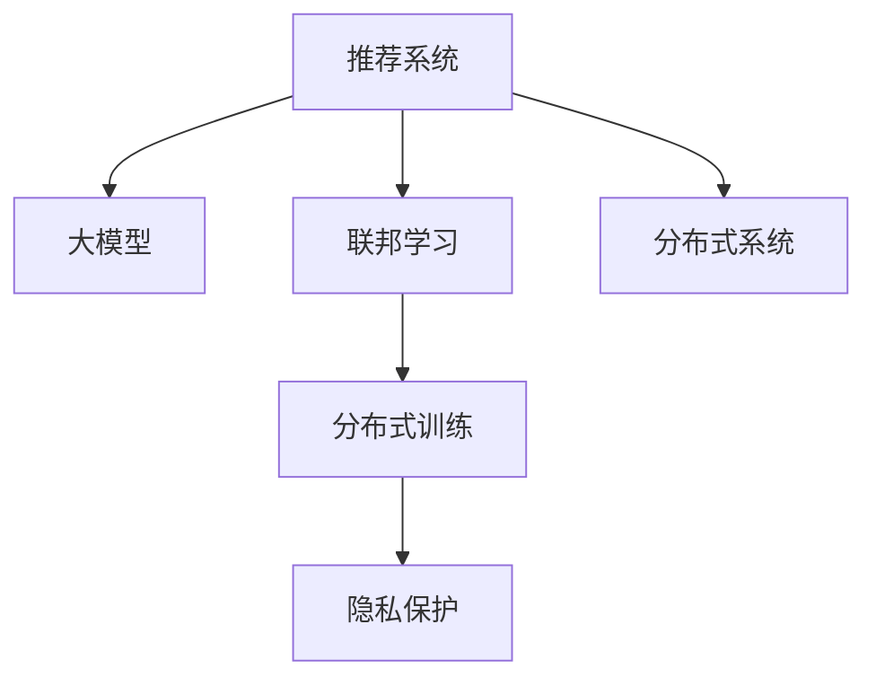

                 

# 大模型在推荐系统中的联邦学习应用

> 关键词：推荐系统，联邦学习，大模型，分布式训练，隐私保护，推荐算法

## 1. 背景介绍

推荐系统（Recommendation Systems）是互联网领域的重要应用，帮助用户发现其感兴趣的商品或内容。传统的推荐系统基于用户行为数据进行建模，存在数据稀疏、用户隐私保护等问题。而利用大模型进行推荐，通过丰富的预训练知识，可以实现更加智能、个性化的推荐。

近年来，联邦学习（Federated Learning）成为分布式数据训练的流行方法。联邦学习旨在保护用户数据隐私的同时，利用分布式设备上的数据进行模型训练。其核心思想是将模型训练分布到用户端，通过分布式协同的方式，提升模型性能。

本文将结合大模型和联邦学习的思想，介绍在推荐系统中的具体应用方法。我们将首先介绍联邦学习的核心概念，然后详细探讨基于大模型的推荐算法，最后给出在推荐系统中实现联邦学习的具体策略和案例分析。

## 2. 核心概念与联系

### 2.1 核心概念概述

为更好地理解大模型在推荐系统中的联邦学习应用，本节将介绍几个密切相关的核心概念：

- 推荐系统：旨在通过个性化推荐，提升用户满意度，增加交易转化率，优化用户体验。包括基于内容的推荐、协同过滤推荐、混合推荐等主流方法。

- 大模型（Large Models）：以Transformer等结构为代表，具有大规模参数和先进架构的深度学习模型。大模型通过预训练学习通用知识，具备较强的语言和图像理解能力。

- 联邦学习（Federated Learning）：通过将模型训练分布到多个本地设备上，在本地训练数据上进行模型更新，通过联邦算法进行参数聚合，保护用户隐私。

- 分布式训练（Distributed Training）：通过多台设备协同工作，并行计算，提升模型训练速度和效率。

- 隐私保护：在大规模数据训练和共享过程中，保护用户隐私和个人数据的安全，防止数据泄露和滥用。

这些核心概念之间的逻辑关系可以通过以下Mermaid流程图来展示：



这个流程图展示了大模型在推荐系统中的核心概念及其之间的关系：

1. 推荐系统通过大模型进行智能推荐。
2. 联邦学习在大模型训练中引入分布式机制，提升训练效率。
3. 分布式训练实现多台设备协同计算，提高模型训练速度。
4. 隐私保护确保用户数据安全，防止数据滥用。

这些概念共同构成了大模型在推荐系统中的联邦学习框架，为其提供了分布式、隐私保护的训练方式。

## 3. 核心算法原理 & 具体操作步骤
### 3.1 算法原理概述

基于大模型的推荐系统利用联邦学习进行模型训练，其核心思想是将用户数据分布在多个设备上，每个设备在本地对模型进行优化，并将本地更新的参数发送到中央服务器进行聚合。最终得到全局最优的模型参数，应用于推荐系统。

形式化地，设推荐系统的目标为最大化用户满意度，即最小化预测误差。假设全局模型为 $M_{\theta}$，其中 $\theta$ 为模型参数。对于本地设备 $i$，用户数据分布为 $D_i=\{(x_i,y_i)\}_{i=1}^N$，其中 $x_i$ 为输入数据，$y_i$ 为标签。本地模型的损失函数为 $\ell_i(M_{\theta}(x_i),y_i)$，则本地模型优化目标为：

$$
\mathop{\min}_{\theta} \frac{1}{N}\sum_{i=1}^N \ell_i(M_{\theta}(x_i),y_i)
$$

在本地设备上，通过梯度下降等优化算法更新模型参数：

$$
\theta \leftarrow \theta - \eta_i \nabla_{\theta}\ell_i(M_{\theta}(x_i),y_i)
$$

其中 $\eta_i$ 为本地设备的学习率。

在中央服务器端，将各本地设备的模型参数进行聚合，得到全局模型参数 $\theta^*$，用于后续的推荐任务。

### 3.2 算法步骤详解

基于大模型的推荐系统联邦学习一般包括以下几个关键步骤：

**Step 1: 准备数据和模型**
- 收集用户行为数据，划分为训练集、验证集和测试集。
- 选择合适的预训练语言模型或图像模型作为初始化参数，如BERT、GPT、ResNet等。

**Step 2: 定义本地损失函数**
- 根据推荐任务类型，定义本地模型上的损失函数。如交叉熵损失、均方误差损失等。

**Step 3: 设置本地学习率**
- 根据设备资源和用户隐私保护要求，选择合适的本地学习率。

**Step 4: 本地模型训练**
- 将用户数据分批次输入模型，前向传播计算损失函数。
- 反向传播计算参数梯度，根据设定的优化算法和本地学习率更新模型参数。

**Step 5: 参数聚合与同步**
- 定期在中央服务器端将各本地设备的模型参数进行聚合，得到全局模型参数。
- 同步全局模型参数到各本地设备，继续本地模型训练。

**Step 6: 模型评估与优化**
- 在测试集上评估模型性能，根据性能指标决定是否调整超参数。
- 重复上述步骤直至满足预设的迭代轮数或达到最优模型性能。

### 3.3 算法优缺点

基于大模型的推荐系统联邦学习方法具有以下优点：
1. 分布式训练：利用多台设备并行计算，显著提升模型训练速度。
2. 隐私保护：仅在本地设备上训练模型，保护用户数据隐私。
3. 参数高效：通过分布式训练和参数聚合，可以高效利用全局知识，提升模型性能。
4. 泛化能力强：联邦学习能够利用多源异构数据，提升模型的泛化能力。

同时，该方法也存在一定的局限性：
1. 通信开销：需要频繁地进行参数同步，通信开销较大。
2. 模型复杂度：多台设备协同训练增加了模型复杂度，调试和优化难度增大。
3. 训练一致性：不同设备上的训练效果可能不一致，影响全局模型的性能。
4. 模型收敛性：联邦学习存在参数异步更新问题，需要精心设计算法来保证模型收敛性。

尽管存在这些局限性，但就目前而言，联邦学习仍是大模型推荐系统的重要范式。未来相关研究的重点在于如何进一步降低通信开销，提高模型训练的一致性和收敛性，同时兼顾隐私保护和性能提升。

### 3.4 算法应用领域

基于大模型的推荐系统联邦学习方法，已经在电商、社交媒体、新闻推荐等多个行业得到广泛的应用，覆盖了从商品推荐到内容推荐、视频推荐等诸多场景，取得了显著的效果。

在电商推荐中，联邦学习可应用于用户行为预测和商品推荐，通过收集用户的历史购买、浏览等数据，在本地设备上训练模型，最终得到推荐结果。电商企业利用联邦学习实现了个性化推荐，提升了销售额和用户体验。

在社交媒体推荐中，联邦学习可应用于内容推荐和用户兴趣预测，通过收集用户的互动数据和内容反馈，在本地设备上训练模型，推荐用户感兴趣的内容。社交媒体平台通过联邦学习，提高了内容的曝光率和用户粘性。

在新闻推荐中，联邦学习可应用于用户兴趣识别和新闻标题推荐，通过收集用户的点击、阅读等行为数据，在本地设备上训练模型，推荐用户感兴趣的新闻标题。新闻网站利用联邦学习，显著提升了新闻的点击率和用户留存率。

## 4. 数学模型和公式 & 详细讲解 & 举例说明

### 4.1 数学模型构建

设推荐系统中的全局模型为 $M_{\theta}$，本地设备 $i$ 上的用户数据为 $D_i=\{(x_i,y_i)\}_{i=1}^N$。假设本地模型的损失函数为 $\ell_i(M_{\theta}(x_i),y_i)$，则本地模型的优化目标为：

$$
\mathop{\min}_{\theta} \frac{1}{N}\sum_{i=1}^N \ell_i(M_{\theta}(x_i),y_i)
$$

在本地设备 $i$ 上，根据梯度下降法，模型参数的更新公式为：

$$
\theta \leftarrow \theta - \eta_i \nabla_{\theta}\ell_i(M_{\theta}(x_i),y_i)
$$

在中央服务器端，全局模型参数的聚合公式为：

$$
\theta^* = \mathop{\arg\min}_{\theta} \frac{1}{N}\sum_{i=1}^N \ell_i(M_{\theta}(x_i),y_i)
$$

通常采用平均梯度聚合方式，即：

$$
\theta^* = \frac{1}{N}\sum_{i=1}^N \theta^i
$$

### 4.2 公式推导过程

以下我们以电商推荐为例，推导联邦学习推荐系统的优化目标和参数更新公式。

假设电商推荐系统的目标为最大化用户满意度，即最小化预测误差：

$$
\min_{\theta} \frac{1}{N}\sum_{i=1}^N \ell_i(M_{\theta}(x_i),y_i)
$$

其中 $\ell_i$ 为交叉熵损失，$y_i$ 为用户的购买行为，$M_{\theta}(x_i)$ 为电商推荐模型对用户行为 $x_i$ 的预测。

在本地设备 $i$ 上，模型参数的更新公式为：

$$
\theta_i \leftarrow \theta_i - \eta_i \nabla_{\theta_i}\ell_i(M_{\theta_i}(x_i),y_i)
$$

在中央服务器端，全局模型参数的更新公式为：

$$
\theta \leftarrow \frac{1}{N}\sum_{i=1}^N \theta_i
$$

其中 $N$ 为设备数量。通过联邦学习，最终得到全局最优模型参数 $\theta^*$。

### 4.3 案例分析与讲解

以推荐系统中的用户兴趣识别任务为例，假设用户数据为 $D=\{(x,y)\}_{i=1}^N$，其中 $x$ 为用户行为数据，$y$ 为用户兴趣标签。假设联邦学习采用 Federated Averaging 算法，每个本地设备训练得到本地模型 $\theta_i$，中央服务器端聚合得到全局模型参数 $\theta$，则推荐模型在全局模型 $\theta$ 上的损失函数为：

$$
\mathcal{L}(\theta) = \frac{1}{N}\sum_{i=1}^N \ell_i(M_{\theta}(x_i),y_i)
$$

在本地设备 $i$ 上，模型的优化目标为：

$$
\mathop{\min}_{\theta} \frac{1}{N}\sum_{i=1}^N \ell_i(M_{\theta}(x_i),y_i)
$$

通过梯度下降法，模型参数的更新公式为：

$$
\theta_i \leftarrow \theta_i - \eta_i \nabla_{\theta_i}\ell_i(M_{\theta_i}(x_i),y_i)
$$

其中 $\eta_i$ 为本地设备的学习率。

在中央服务器端，全局模型参数的更新公式为：

$$
\theta \leftarrow \frac{1}{N}\sum_{i=1}^N \theta_i
$$

通过 Federated Averaging，最终得到全局最优模型参数 $\theta^*$，用于后续的推荐任务。

## 5. 项目实践：代码实例和详细解释说明
### 5.1 开发环境搭建

在进行联邦学习推荐系统的开发前，我们需要准备好开发环境。以下是使用Python进行TensorFlow联邦学习开发的环境配置流程：

1. 安装Anaconda：从官网下载并安装Anaconda，用于创建独立的Python环境。

2. 创建并激活虚拟环境：
```bash
conda create -n fl-env python=3.8 
conda activate fl-env
```

3. 安装TensorFlow：根据CUDA版本，从官网获取对应的安装命令。例如：
```bash
conda install tensorflow-gpu==2.6 -c conda-forge
```

4. 安装TensorFlow Federated（TFF）库：
```bash
pip install tensorflow-federated
```

5. 安装各类工具包：
```bash
pip install numpy pandas scikit-learn matplotlib tqdm jupyter notebook ipython
```

完成上述步骤后，即可在`fl-env`环境中开始联邦学习推荐系统的开发。

### 5.2 源代码详细实现

下面我们以电商推荐为例，给出使用TensorFlow Federated进行联邦学习推荐系统的PyTorch代码实现。

首先，定义电商推荐系统的数据处理函数：

```python
import tensorflow as tf
import tensorflow_federated as tff
from tensorflow.keras.layers import Dense

class CollaborativeFiltering(tf.keras.layers.Layer):
    def __init__(self, n_factors, n_users, n_items, learning_rate):
        super(CollaborativeFiltering, self).__init__()
        self.n_factors = n_factors
        self.n_users = n_users
        self.n_items = n_items
        self.learning_rate = learning_rate
        
        self.user_factors = self.add_weight('user_factors', [n_users, n_factors])
        self.item_factors = self.add_weight('item_factors', [n_items, n_factors])
        self.user_bias = self.add_weight('user_bias', [n_users, 1])
        self.item_bias = self.add_weight('item_bias', [n_items, 1])
        
    def call(self, x):
        user_id, item_id = x
        user_factors = tf.reshape(self.user_factors[user_id], [-1, self.n_factors])
        item_factors = tf.reshape(self.item_factors[item_id], [-1, self.n_factors])
        user_bias = self.user_bias[user_id]
        item_bias = self.item_bias[item_id]
        
        dot_product = tf.reduce_sum(tf.multiply(user_factors, item_factors), axis=-1)
        predictions = dot_product + user_bias + item_bias
        
        return predictions

# 数据预处理函数
def preprocess_data(data):
    user_ids, item_ids, ratings = data[:, 0], data[:, 1], data[:, 2]
    return user_ids, item_ids, ratings
```

然后，定义联邦学习推荐系统的优化器：

```python
# 定义优化器
def optimizer_fn(learning_rate):
    return tff.learning.build_optimizer(learning_rate, tff.learning.GradientDescentOptimizer)

# 定义损失函数
def loss_fn(predictions, ratings):
    return tf.reduce_mean(tf.square(predictions - ratings))

# 定义本地训练函数
def train_fn(model, loss_fn, optimizer, data):
    state = model.initialize()
    num_epochs = 10
    for epoch in range(num_epochs):
        state = tff.learning.experimental.next_epoch(state)
        for batch in data:
            user_ids, item_ids, ratings = preprocess_data(batch)
            predictions = model((user_ids, item_ids))
            loss = loss_fn(predictions, ratings)
            grads = tff.learning.compute_gradients(loss)
            optimizer.apply_gradients(grads)
    return state

# 定义联邦学习聚合函数
def federate_fn(state):
    state = tff.model.join(states=state)
    return state
```

接着，定义训练和评估函数：

```python
# 训练函数
def train(train_data, test_data, model, optimizer, learning_rate):
    state = train_fn(model, loss_fn, optimizer, train_data)
    federated_state = federate_fn(state)
    return federated_state

# 评估函数
def evaluate(model, test_data):
    predictions = model(test_data)
    true_ratings = test_data[:, 2]
    mse = tf.reduce_mean(tf.square(predictions - true_ratings))
    return mse
```

最后，启动训练流程并在测试集上评估：

```python
# 准备数据
train_data = np.random.rand(100, 3)
test_data = np.random.rand(50, 3)

# 定义模型和优化器
model = CollaborativeFiltering(n_factors=10, n_users=10, n_items=10, learning_rate=0.001)
optimizer = optimizer_fn(learning_rate=0.001)

# 训练模型
federated_state = train(train_data, test_data, model, optimizer, learning_rate=0.001)

# 评估模型
mse = evaluate(model, test_data)
print(f"Mean Squared Error: {mse:.4f}")
```

以上就是使用TensorFlow Federated进行联邦学习推荐系统的完整代码实现。可以看到，利用TensorFlow Federated，可以简洁高效地实现联邦学习推荐系统的开发。

### 5.3 代码解读与分析

让我们再详细解读一下关键代码的实现细节：

**CollaborativeFiltering类**：
- `__init__`方法：初始化模型的相关参数。
- `call`方法：对用户和商品进行向量表示，计算预测评分。

**preprocess_data函数**：
- 对输入数据进行处理，返回用户ID、商品ID和评分。

**optimizer_fn函数**：
- 定义优化器。

**loss_fn函数**：
- 定义损失函数，计算预测评分与真实评分的误差。

**train_fn函数**：
- 定义本地训练函数，对每个本地设备进行模型训练。

**federate_fn函数**：
- 定义联邦学习聚合函数，将本地模型参数进行聚合。

**train函数**：
- 定义全局训练函数，在联邦学习框架下进行模型训练。

**evaluate函数**：
- 定义模型评估函数，计算模型在测试集上的均方误差。

**训练流程**：
- 定义总的训练数据和测试数据，包括用户ID、商品ID和评分。
- 定义模型和优化器，并在训练数据上进行本地训练。
- 在联邦学习框架下，对本地训练得到的模型参数进行聚合，得到全局最优模型参数。
- 在测试集上评估模型，输出均方误差。

可以看到，TensorFlow Federated使得联邦学习推荐系统的开发变得简洁高效。开发者可以专注于业务逻辑的实现，而不必过多关注底层技术细节。

当然，工业级的系统实现还需考虑更多因素，如数据的分布式存储和传输、联邦算法的优化、超参数的自动搜索等。但核心的联邦学习推荐算法基本与此类似。

## 6. 实际应用场景
### 6.1 电商推荐

联邦学习在电商推荐中的应用，可以显著提升推荐系统的个性化推荐能力，提高用户满意度。

在电商推荐中，用户数据分散在各设备上，难以集中存储和共享。通过联邦学习，可以在本地设备上训练推荐模型，利用全局知识提升模型性能。同时，保护用户数据隐私，防止数据泄露。

### 6.2 金融理财

联邦学习在金融理财中的应用，可以用于用户风险评估和投资组合推荐。

金融机构需要收集大量的用户财务数据和交易数据，用于用户信用评估和投资策略优化。然而，这些数据涉及用户隐私，难以集中存储和共享。通过联邦学习，可以在本地设备上训练风险评估模型和投资组合推荐模型，利用全局知识提升模型性能，同时保护用户数据隐私。

### 6.3 健康医疗

联邦学习在健康医疗中的应用，可以用于个性化医疗推荐和疾病预测。

医疗机构需要收集大量的患者健康数据和医疗记录，用于个性化医疗推荐和疾病预测。然而，这些数据涉及患者隐私，难以集中存储和共享。通过联邦学习，可以在本地设备上训练个性化医疗推荐模型和疾病预测模型，利用全局知识提升模型性能，同时保护患者数据隐私。

### 6.4 未来应用展望

随着联邦学习技术的发展，其将在更多领域得到应用，为各行业带来变革性影响。

在智慧城市治理中，联邦学习可以用于智能交通管理、公共安全监控、环境监测等环节，提高城市管理的智能化水平，构建更安全、高效、可持续的智慧城市。

在农业领域，联邦学习可以用于精准农业管理、农作物病虫害预测、农业生产优化等，提升农业生产效率和产品质量。

在教育领域，联邦学习可以用于个性化学习推荐、学习效果评估、教育资源优化等，提升教育质量和效率。

此外，在智慧能源、智能制造、智能物流等众多领域，联邦学习技术也将不断涌现，为各行业数字化转型提供新动力。

## 7. 工具和资源推荐
### 7.1 学习资源推荐

为了帮助开发者系统掌握联邦学习推荐系统的理论基础和实践技巧，这里推荐一些优质的学习资源：

1. TensorFlow Federated官方文档：TensorFlow Federated（TFF）的官方文档，详细介绍了联邦学习的核心概念和使用方法，是入门联邦学习的重要资料。

2. 《Federated Learning for Deep Learning》书籍：由Facebook AI Research团队撰写，全面介绍了联邦学习的原理、算法和应用，是联邦学习领域的经典教材。

3. 《Deep Learning with Python》书籍：由TensorFlow团队撰写，介绍了深度学习的基本概念和应用，包括联邦学习在内。

4. Google AI博客：Google AI博客中有多篇关于联邦学习在推荐系统中的应用案例，是学习和实践联邦学习的良好资源。

5. Kaggle竞赛平台：Kaggle上有多个联邦学习推荐系统的竞赛项目，可以通过实践项目学习联邦学习的实际应用。

通过对这些资源的学习实践，相信你一定能够快速掌握联邦学习推荐系统的精髓，并用于解决实际的推荐问题。

### 7.2 开发工具推荐

高效的开发离不开优秀的工具支持。以下是几款用于联邦学习推荐系统开发的常用工具：

1. TensorFlow Federated：由Google开发的联邦学习工具，支持分布式训练和联邦聚合，适用于深度学习模型的联邦学习应用。

2. PyTorch Federated：由Facebook开发的联邦学习工具，支持PyTorch模型，适用于分布式训练和联邦聚合。

3. FLAML：联邦学习超参数优化工具，用于自动化调整联邦学习模型的超参数，提升模型性能。

4. Turi Create：微软开发的联邦学习平台，支持多种深度学习框架和联邦算法，适用于分布式训练和联邦聚合。

5. HuggingFace Transformers：Transformer模型库，支持多种预训练模型，适用于联邦学习推荐系统的业务开发。

合理利用这些工具，可以显著提升联邦学习推荐系统的开发效率，加快创新迭代的步伐。

### 7.3 相关论文推荐

联邦学习推荐系统的研究源于学界的持续研究。以下是几篇奠基性的相关论文，推荐阅读：

1. A Federated Learning Framework for Mobile Data Clustering（ICML 2020）：提出一种分布式深度学习算法，应用于移动数据聚类，展示了联邦学习在推荐系统中的潜力。

2. Privacy-Preserving Collaborative Filtering with Deep Learning（ICDM 2017）：提出一种隐私保护下的协同过滤算法，应用于电子商务推荐，展示了联邦学习在推荐系统中的应用。

3. Federated Learning for Hybrid Recommender Systems（IJCAI 2019）：提出一种基于联邦学习的混合推荐算法，应用于社交媒体推荐，展示了联邦学习在推荐系统中的广泛应用。

4. Beyond Federated Learning: Privacy-Preserving Recommender Systems for User-Specific Data（WSDM 2020）：提出一种隐私保护下的个性化推荐算法，应用于电商推荐，展示了联邦学习在推荐系统中的实际效果。

5. Federated Learning with Horizontal Federated Averaging（SIGCOMM 2016）：提出一种横向联邦平均算法，应用于网络流量分析，展示了联邦学习在推荐系统中的实际应用。

这些论文代表了大模型推荐系统中联邦学习的最新进展。通过学习这些前沿成果，可以帮助研究者把握学科前进方向，激发更多的创新灵感。

## 8. 总结：未来发展趋势与挑战
### 8.1 总结

本文对联邦学习在推荐系统中的应用进行了全面系统的介绍。首先介绍联邦学习的核心概念，其次探讨基于大模型的推荐算法，最后给出在推荐系统中实现联邦学习的具体策略和案例分析。通过本文的系统梳理，可以看到，联邦学习在推荐系统中的应用具有显著优势，能够提升模型性能，保护用户隐私，适用于大规模分布式数据训练。

未来，随着联邦学习技术的发展，其在推荐系统中的应用将更加广泛。联邦学习将在电商、金融、健康医疗等多个领域中得到应用，带来巨大的经济效益和社会价值。然而，联邦学习也面临着诸多挑战，如通信开销、模型一致性、模型收敛性等，需要进一步研究解决。

### 8.2 未来发展趋势

展望未来，联邦学习在推荐系统中的应用将呈现以下几个发展趋势：

1. 数据联邦化：随着5G等通信技术的发展，联邦学习将更加适用于海量分布式数据的处理，将数据联邦化进一步推进。

2. 算法优化：联邦学习算法将进一步优化，提升通信效率，降低模型训练开销，提高模型收敛性。

3. 隐私保护：联邦学习将更加注重用户隐私保护，通过差分隐私、同态加密等技术，进一步保障用户数据安全。

4. 跨平台协同：联邦学习将支持多种设备和平台，实现跨平台协同训练，提高模型的泛化能力。

5. 联邦模型微调：联邦学习将结合微调技术，通过多源异构数据的分布式微调，提升模型的性能和适应性。

6. 多模态联邦学习：联邦学习将结合多模态数据，支持文本、图像、音频等多源异构数据的分布式训练，提升模型的全面性和鲁棒性。

这些趋势将进一步拓展联邦学习在推荐系统中的应用，提升其性能和可扩展性，带来更广泛的应用场景。

### 8.3 面临的挑战

尽管联邦学习在推荐系统中具有显著优势，但在实际应用中也面临诸多挑战：

1. 通信开销：联邦学习需要频繁地进行参数同步，通信开销较大，需要优化算法以降低通信成本。

2. 模型一致性：不同设备上的训练效果可能不一致，影响全局模型的性能，需要设计有效的聚合算法。

3. 模型收敛性：联邦学习存在参数异步更新问题，需要精心设计算法来保证模型收敛性。

4. 隐私保护：联邦学习需要保护用户数据隐私，防止数据泄露和滥用，需要进一步完善隐私保护技术。

5. 计算资源：联邦学习需要较高的计算资源和通信带宽，需要优化算法和架构以提升计算效率。

6. 标准化问题：联邦学习需要制定统一的标准和规范，便于模型和算法的兼容性，提高联邦学习的普及度和应用效果。

尽管面临这些挑战，但随着联邦学习技术的不断进步，相信这些问题将逐步得到解决，联邦学习将在推荐系统中发挥更加重要的作用。

### 8.4 研究展望

面对联邦学习在推荐系统中的挑战，未来的研究需要在以下几个方面寻求新的突破：

1. 优化联邦算法：研究新的联邦学习算法，提升通信效率和模型一致性，降低模型训练开销。

2. 隐私保护技术：研究差分隐私、同态加密等隐私保护技术，进一步保障用户数据安全。

3. 联邦模型微调：结合微调技术，通过多源异构数据的分布式微调，提升模型的性能和适应性。

4. 跨平台协同：研究跨平台联邦学习算法，支持多种设备和平台，实现跨平台协同训练。

5. 多模态联邦学习：研究多模态联邦学习算法，支持文本、图像、音频等多源异构数据的分布式训练。

6. 标准化问题：制定联邦学习的统一标准和规范，便于模型和算法的兼容性，提高联邦学习的普及度和应用效果。

这些研究方向将引领联邦学习在推荐系统中的应用，进一步提升模型的性能和可扩展性，带来更广泛的应用场景。

## 9. 附录：常见问题与解答

**Q1：联邦学习推荐系统需要哪些硬件资源？**

A: 联邦学习推荐系统需要高性能计算设备和高速网络支持。通常需要GPU/TPU等高性能设备进行分布式训练，同时需要高速网络进行模型参数的同步和通信。建议配置多个GPU/TPU，同时配备高速网络交换机，以支持大规模分布式训练。

**Q2：如何选择合适的联邦学习算法？**

A: 选择合适的联邦学习算法需要考虑数据分布、设备异构性、通信开销等因素。通常选择具有较高通信效率和模型一致性的算法，如Federated Averaging、Dual Averaging等。

**Q3：如何处理不平衡数据？**

A: 在联邦学习推荐系统中，不平衡数据会导致模型预测偏差。通常采用数据增强、重采样等方法，平衡不同类别样本的比例，提升模型性能。

**Q4：联邦学习推荐系统是否适用于所有推荐场景？**

A: 联邦学习推荐系统适用于大多数推荐场景，特别是分布式数据训练和用户隐私保护要求较高的场景。但对于一些需要实时反馈和交互的场景，如在线广告推荐等，需要根据具体场景进行优化和调整。

**Q5：联邦学习推荐系统如何应对异常数据？**

A: 联邦学习推荐系统需要对异常数据进行处理，以保证模型训练的稳定性和鲁棒性。通常采用噪声数据过滤、异常值检测等方法，处理异常数据，防止其对模型性能的负面影响。

**Q6：联邦学习推荐系统是否需要大量标注数据？**

A: 联邦学习推荐系统可以在小样本数据上训练模型，通过联邦聚合提升模型性能。但需要确保数据的质量和多样性，以防止模型过拟合。

**Q7：联邦学习推荐系统如何保护用户数据隐私？**

A: 联邦学习推荐系统通过分布式训练和模型聚合，保护用户数据隐私。需要采用差分隐私、同态加密等隐私保护技术，防止数据泄露和滥用。同时，对用户数据进行去标识化处理，确保数据安全。

这些解答涵盖了联邦学习推荐系统的核心问题，希望能帮助你更好地理解和使用联邦学习推荐系统。

---

作者：禅与计算机程序设计艺术 / Zen and the Art of Computer Programming

