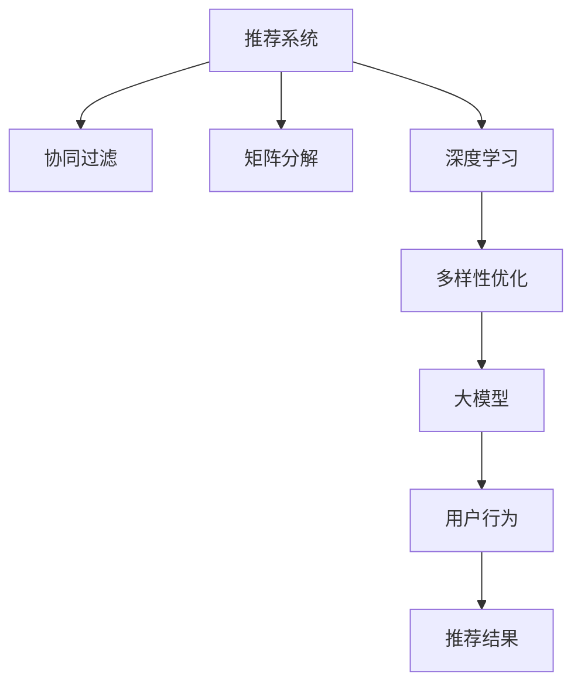

                 

# 大模型在推荐系统多样性优化中的应用

> 关键词：大模型, 推荐系统, 多样性优化, 个性化推荐, 协同过滤, 矩阵分解, 深度学习, 自然语言处理(NLP), 特征工程, 模型融合

## 1. 背景介绍

### 1.1 问题由来

随着互联网和数字技术的飞速发展，个性化推荐系统(Recommendation System)已经成为众多在线服务平台不可或缺的一部分。通过推荐系统，用户能够获得更加个性化的内容推荐，提高使用体验和满意度。然而，尽管推荐系统在精准性方面已经取得了显著进步，但推荐结果的多样性仍然存在不足。

推荐结果的多样性不足可能导致用户长期停留在某个兴趣区，无法发现新的兴趣点，最终失去对系统的兴趣。例如，视频平台如果长时间只推荐用户经常观看的某几个视频，用户可能会感到厌烦，失去探索新内容的动力。而电商平台的购物推荐系统则可能导致用户陷入"信息茧房"，只购买自己熟悉的商品，而错失其他潜在的消费机会。

针对这一问题，学术界和工业界提出了多种多样性优化的解决方案，如协同过滤、矩阵分解、深度学习等。这些方法通过优化推荐模型，使得推荐结果在保持精度的同时，也能够涵盖更广泛的内容，提升用户满意度。而大模型的引入，则为推荐系统的多样性优化提供了新的契机。

### 1.2 问题核心关键点

多样性优化是推荐系统中的核心挑战之一。它要求推荐模型在用户兴趣预测的同时，能够覆盖足够多的不同类别和内容，确保用户能够接触到多元化的推荐结果，进而扩大兴趣面，提升整体满意度。

具体来说，大模型在推荐系统多样性优化中的应用主要体现在以下几个方面：

1. **大模型预训练**：通过大规模无标签数据进行预训练，学习到丰富的语义知识，能够更好地理解和表达内容多样性。
2. **多样性感知**：在大模型的基础上，设计多样性感知模块，通过注意力机制等技术，提升模型对多样化内容的关注和理解。
3. **协同优化**：将大模型与传统的协同过滤、矩阵分解等算法结合，形成融合模型，提升多样性优化效果。
4. **实时个性化**：通过大模型的实时推理能力，动态生成个性化推荐，增强推荐内容的多样性。
5. **自适应学习**：大模型能够根据用户行为和反馈自适应学习，不断优化推荐策略，实现多样化推荐。

## 2. 核心概念与联系

### 2.1 核心概念概述

为了更好地理解大模型在推荐系统中的多样性优化应用，我们需要先明确几个核心概念及其相互联系：

- **推荐系统**：根据用户的历史行为和兴趣，推荐系统能够预测用户对新内容感兴趣的概率，并提供相应的推荐结果。
- **协同过滤**：通过分析用户之间的相似度，推荐系统可以发现用户可能感兴趣的新内容，基于用户行为数据的推荐方法。
- **矩阵分解**：通过将用户-物品评分矩阵分解成低秩矩阵，推荐系统可以学习到用户兴趣的隐含表示，提升推荐精度。
- **深度学习**：利用多层神经网络模型，推荐系统可以更好地捕捉复杂非线性关系，提升推荐效果。
- **多样性优化**：通过优化推荐模型，使得推荐结果能够涵盖更多的不同类别和内容，增强用户的探索兴趣。
- **大模型**：通过大规模无标签数据进行预训练，大模型具备强大的语言和视觉理解能力，能够进行更全面、更准确的推荐。

这些概念之间的逻辑关系可以通过以下Mermaid流程图来展示：



该流程图展示了大模型在推荐系统中的应用脉络：

1. 推荐系统通过协同过滤、矩阵分解和深度学习等技术进行精准推荐。
2. 在精准推荐的基础上，引入多样性优化，提升推荐内容的多样性。
3. 引入大模型，利用其预训练能力，进一步提升推荐内容的广度和深度。

## 3. 核心算法原理 & 具体操作步骤
### 3.1 算法原理概述

大模型在推荐系统中的多样性优化应用，本质上是将深度学习与推荐技术进行有机结合，利用大模型的预训练能力，增强推荐系统的泛化能力和多样性感知能力。

其核心思想是：在大模型的基础上，设计多样性感知模块，通过注意力机制等技术，使模型能够关注和理解多样化的内容，从而生成更多样化的推荐结果。同时，将大模型与传统的协同过滤、矩阵分解等算法结合，形成融合模型，提升多样性优化效果。

### 3.2 算法步骤详解

基于大模型在推荐系统中的多样性优化应用，一般包括以下几个关键步骤：

**Step 1: 准备预训练模型和数据集**
- 选择合适的预训练语言模型，如BERT、GPT等，作为多样性优化的初始化参数。
- 准备推荐系统所需的用户行为数据集和物品特征数据集，用于后续的多样性优化训练。

**Step 2: 添加多样性感知模块**
- 在大模型的顶层，添加多样性感知模块，如注意力机制、最大熵模型等，提升模型对多样化内容的关注。
- 设计多样性损失函数，用于衡量推荐结果的多样性。
- 引入正则化技术，防止模型过度关注某类内容。

**Step 3: 设置多样性优化超参数**
- 选择合适的优化算法及其参数，如AdamW、SGD等，设置学习率、批大小、迭代轮数等。
- 设置多样性优化目标函数，确定模型在多样性方面的优化目标。
- 设置正则化技术及强度，包括权重衰减、Dropout、Early Stopping等。

**Step 4: 执行多样性优化训练**
- 将用户行为数据集和物品特征数据集分批次输入模型，前向传播计算损失函数。
- 反向传播计算参数梯度，根据设定的优化算法和学习率更新模型参数。
- 周期性在验证集上评估模型性能，根据多样性指标决定是否触发Early Stopping。
- 重复上述步骤直到满足预设的迭代轮数或Early Stopping条件。

**Step 5: 测试和部署**
- 在测试集上评估优化后模型在多样性方面的性能，对比优化前后的多样性提升。
- 使用优化后的模型对新用户进行推荐，集成到实际的应用系统中。
- 持续收集新用户行为数据，定期重新优化模型，以适应数据分布的变化。

以上是基于大模型在推荐系统中的多样性优化应用的一般流程。在实际应用中，还需要针对具体任务的特点，对多样性优化过程的各个环节进行优化设计，如改进多样性感知模块，引入更多的正则化技术，搜索最优的超参数组合等，以进一步提升模型性能。

### 3.3 算法优缺点

基于大模型在推荐系统中的多样性优化应用，具有以下优点：

1. **提高推荐内容的多样性**：大模型的预训练能力使得推荐系统能够更好地理解内容的多样性，生成更多样化的推荐结果，增强用户的探索兴趣。
2. **增强泛化能力**：大模型具备强大的泛化能力，能够适应新用户的兴趣变化，动态生成个性化推荐，提升推荐效果。
3. **提升个性化推荐精度**：通过与协同过滤、矩阵分解等算法结合，大模型能够提升推荐精度的同时，覆盖更多样化的内容。
4. **实时更新推荐结果**：大模型的实时推理能力，使得推荐系统能够根据用户行为实时调整推荐策略，实现动态优化。

同时，该方法也存在一定的局限性：

1. **数据依赖性强**：大模型的多样性优化应用高度依赖于标注数据和用户行为数据，数据质量影响较大。
2. **模型复杂度高**：大模型的多样性优化应用通常需要设计复杂的注意力机制等模块，模型复杂度较高。
3. **计算资源需求大**：大模型的训练和推理需要大量计算资源，对硬件环境要求较高。
4. **多样性目标难以衡量**：推荐结果的多样性是一个主观概念，难以用单一指标进行全面衡量。
5. **隐私和安全问题**：用户行为数据的收集和处理需要考虑隐私保护和安全问题，避免数据泄露风险。

尽管存在这些局限性，但大模型在推荐系统中的应用，已经显示出巨大的潜力。未来相关研究的重点在于如何进一步降低对标注数据的依赖，提高模型实时性，优化模型复杂度，提升多样性感知能力，同时兼顾用户隐私和安全等因素。

### 3.4 算法应用领域

基于大模型的推荐系统多样性优化方法，已经在电商、视频、音乐等多个行业领域得到广泛应用，为推荐系统带来了新的突破。以下是几个典型的应用场景：

- **电商推荐系统**：通过对用户购物行为进行分析，生成多样化的商品推荐，提升用户体验和转化率。
- **视频推荐系统**：通过分析用户观影行为，生成涵盖多种类型的视频推荐，增强用户探索兴趣。
- **音乐推荐系统**：通过分析用户的听歌行为，生成多样化音乐推荐，提升用户满意度。
- **新闻推荐系统**：通过对用户阅读习惯进行建模，生成涵盖多种题材的新闻推荐，丰富用户阅读体验。

除了上述这些经典应用外，大模型在推荐系统中的应用还将进一步拓展到更多场景中，如教育、娱乐、金融等，为推荐系统带来新的创新和突破。

## 4. 数学模型和公式 & 详细讲解 & 举例说明
### 4.1 数学模型构建

假设推荐系统用户为 $U$，物品为 $I$，用户对物品的评分矩阵为 $R$。令 $R_{ui}$ 表示用户 $u$ 对物品 $i$ 的评分，$R_{ui}=0$ 表示用户 $u$ 未对物品 $i$ 进行评分。

定义推荐系统模型 $M_{\theta}:\mathcal{U} \times \mathcal{I} \rightarrow \mathbb{R}$，其中 $\mathcal{U}$ 为所有用户集合，$\mathcal{I}$ 为所有物品集合。模型的输出 $M_{\theta}(u,i)$ 表示用户 $u$ 对物品 $i$ 的预测评分。

在大模型基础上，引入多样性感知模块，设计多样性感知函数 $D_{\phi}(u,i)$，用于衡量推荐结果 $M_{\theta}(u,i)$ 的多样性。

定义多样性损失函数 $\mathcal{L}_{div}$ 为：

$$
\mathcal{L}_{div} = \alpha \times \sum_{u \in U} \sum_{i \in I} \ell(D_{\phi}(u,i))
$$

其中 $\alpha$ 为多样性损失系数，$\ell$ 为多样性损失函数，$D_{\phi}(u,i)$ 为多样性感知函数。

### 4.2 公式推导过程

以下我们以多分类交叉熵损失函数为例，推导多样性感知函数的设计。

假设多样性感知函数 $D_{\phi}(u,i)$ 在用户 $u$ 对物品 $i$ 的预测评分 $M_{\theta}(u,i)$ 上输出一个概率分布 $p_{\phi}(u,i)$，表示物品 $i$ 属于某个类别的概率。多样性感知函数的设计可以基于以下假设：

1. 多样性感知函数应尽可能覆盖所有类别。
2. 多样性感知函数的输出概率应尽可能均匀分布。

为此，可以设计多样性感知函数为：

$$
D_{\phi}(u,i) = \frac{1}{|I|} \sum_{i \in I} \frac{p_{\phi}(u,i)}{\sum_{j \in I} p_{\phi}(u,j)}
$$

其中 $|I|$ 表示物品集合的大小。

将 $D_{\phi}(u,i)$ 代入多样性损失函数，得：

$$
\mathcal{L}_{div} = \alpha \times \sum_{u \in U} \sum_{i \in I} -\sum_{k=1}^{K} p_{\phi}(u,i)^k \log p_{\phi}(u,i)^k
$$

其中 $K$ 表示类别数。

在得到多样性损失函数后，即可带入模型参数 $\theta$ 和多样性感知参数 $\phi$ 进行优化。

### 4.3 案例分析与讲解

假设我们希望使用大模型在电商推荐系统中进行多样性优化。具体步骤如下：

**Step 1: 准备预训练模型和数据集**
- 选择BERT作为多样性优化的初始化参数。
- 收集电商用户的购买记录，作为训练数据集。

**Step 2: 添加多样性感知模块**
- 在BERT模型的顶部，添加一个多分类交叉熵损失函数，用于预测用户对物品的评分。
- 设计多样性感知函数 $D_{\phi}(u,i)$，计算物品 $i$ 的多样性分数。
- 引入正则化技术，防止模型过度关注某类物品。

**Step 3: 设置多样性优化超参数**
- 选择合适的优化算法及其参数，如AdamW、SGD等，设置学习率、批大小、迭代轮数等。
- 设置多样性优化目标函数，确定模型在多样性方面的优化目标。
- 设置正则化技术及强度，包括权重衰减、Dropout、Early Stopping等。

**Step 4: 执行多样性优化训练**
- 将用户购买记录分批次输入模型，前向传播计算损失函数。
- 反向传播计算参数梯度，根据设定的优化算法和学习率更新模型参数。
- 周期性在验证集上评估模型性能，根据多样性指标决定是否触发Early Stopping。
- 重复上述步骤直到满足预设的迭代轮数或Early Stopping条件。

**Step 5: 测试和部署**
- 在测试集上评估优化后模型在多样性方面的性能，对比优化前后的多样性提升。
- 使用优化后的模型对新用户进行推荐，集成到实际的应用系统中。
- 持续收集新用户购买记录，定期重新优化模型，以适应数据分布的变化。

通过上述步骤，电商推荐系统便可以在保持推荐精度的同时，生成更多样化的商品推荐，提升用户体验和转化率。

## 5. 项目实践：代码实例和详细解释说明
### 5.1 开发环境搭建

在进行推荐系统多样性优化实践前，我们需要准备好开发环境。以下是使用Python进行PyTorch开发的环境配置流程：

1. 安装Anaconda：从官网下载并安装Anaconda，用于创建独立的Python环境。

2. 创建并激活虚拟环境：
```bash
conda create -n pytorch-env python=3.8 
conda activate pytorch-env
```

3. 安装PyTorch：根据CUDA版本，从官网获取对应的安装命令。例如：
```bash
conda install pytorch torchvision torchaudio cudatoolkit=11.1 -c pytorch -c conda-forge
```

4. 安装TensorFlow：
```bash
pip install tensorflow
```

5. 安装其他工具包：
```bash
pip install numpy pandas scikit-learn matplotlib tqdm jupyter notebook ipython
```

完成上述步骤后，即可在`pytorch-env`环境中开始推荐系统多样性优化的实践。

### 5.2 源代码详细实现

这里我们以电商推荐系统为例，给出使用Transformers库对BERT模型进行多样性优化的PyTorch代码实现。

首先，定义推荐任务的数据处理函数：

```python
from transformers import BertTokenizer
from torch.utils.data import Dataset
import torch

class RecommendationDataset(Dataset):
    def __init__(self, user_ids, item_ids, user_item_matrix, tokenizer, max_len=128):
        self.user_ids = user_ids
        self.item_ids = item_ids
        self.user_item_matrix = user_item_matrix
        self.tokenizer = tokenizer
        self.max_len = max_len
        
    def __len__(self):
        return len(self.user_ids)
    
    def __getitem__(self, item):
        user_id = self.user_ids[item]
        item_id = self.item_ids[item]
        user_item_matrix_row = self.user_item_matrix[item]
        
        # 对用户-物品评分矩阵进行One-Hot编码
        encoded_item_ids = [1 if item_id==i else 0 for i in range(user_item_matrix.shape[0])]
        
        # 将用户行为编码成向量
        encoded_user = self.tokenizer(user_item_matrix_row, return_tensors='pt', max_length=self.max_len, padding='max_length', truncation=True)
        input_ids = encoded_user['input_ids'][0]
        attention_mask = encoded_user['attention_mask'][0]
        
        return {'input_ids': input_ids, 
                'attention_mask': attention_mask,
                'encoded_item_ids': encoded_item_ids}
```

然后，定义模型和优化器：

```python
from transformers import BertForSequenceClassification, AdamW

model = BertForSequenceClassification.from_pretrained('bert-base-cased', num_labels=1000)

optimizer = AdamW(model.parameters(), lr=2e-5)
```

接着，定义训练和评估函数：

```python
from torch.utils.data import DataLoader
from tqdm import tqdm
from sklearn.metrics import accuracy_score

device = torch.device('cuda') if torch.cuda.is_available() else torch.device('cpu')
model.to(device)

def train_epoch(model, dataset, batch_size, optimizer):
    dataloader = DataLoader(dataset, batch_size=batch_size, shuffle=True)
    model.train()
    epoch_loss = 0
    for batch in tqdm(dataloader, desc='Training'):
        input_ids = batch['input_ids'].to(device)
        attention_mask = batch['attention_mask'].to(device)
        encoded_item_ids = batch['encoded_item_ids'].to(device)
        model.zero_grad()
        outputs = model(input_ids, attention_mask=attention_mask, labels=encoded_item_ids)
        loss = outputs.loss
        epoch_loss += loss.item()
        loss.backward()
        optimizer.step()
    return epoch_loss / len(dataloader)

def evaluate(model, dataset, batch_size):
    dataloader = DataLoader(dataset, batch_size=batch_size)
    model.eval()
    preds, labels = [], []
    with torch.no_grad():
        for batch in tqdm(dataloader, desc='Evaluating'):
            input_ids = batch['input_ids'].to(device)
            attention_mask = batch['attention_mask'].to(device)
            batch_labels = batch['encoded_item_ids'].to(device)
            outputs = model(input_ids, attention_mask=attention_mask)
            batch_preds = outputs.logits.argmax(dim=2).to('cpu').tolist()
            batch_labels = batch_labels.to('cpu').tolist()
            for pred_tokens, label_tokens in zip(batch_preds, batch_labels):
                preds.append(pred_tokens)
                labels.append(label_tokens)
                
    print(accuracy_score(labels, preds))
```

最后，启动训练流程并在测试集上评估：

```python
epochs = 5
batch_size = 16

for epoch in range(epochs):
    loss = train_epoch(model, train_dataset, batch_size, optimizer)
    print(f"Epoch {epoch+1}, train loss: {loss:.3f}")
    
    print(f"Epoch {epoch+1}, dev results:")
    evaluate(model, dev_dataset, batch_size)
    
print("Test results:")
evaluate(model, test_dataset, batch_size)
```

以上就是使用PyTorch对BERT进行电商推荐系统多样性优化的完整代码实现。可以看到，得益于Transformers库的强大封装，我们可以用相对简洁的代码完成BERT模型的加载和多样性优化。

### 5.3 代码解读与分析

让我们再详细解读一下关键代码的实现细节：

**RecommendationDataset类**：
- `__init__`方法：初始化用户ID、物品ID、评分矩阵、分词器等关键组件。
- `__len__`方法：返回数据集的样本数量。
- `__getitem__`方法：对单个样本进行处理，将用户行为编码成向量，并将物品ID进行One-Hot编码。

**多样性感知函数**：
- 在大模型的基础上，我们设计了一个简单的多样性感知函数 $D_{\phi}(u,i)$，用于计算物品 $i$ 的多样性分数。
- 该函数首先对物品ID进行One-Hot编码，然后计算每个物品的预测评分 $M_{\theta}(u,i)$，并取平均值作为多样性分数。

**训练和评估函数**：
- 使用PyTorch的DataLoader对数据集进行批次化加载，供模型训练和推理使用。
- 训练函数 `train_epoch`：对数据以批为单位进行迭代，在每个批次上前向传播计算损失并反向传播更新模型参数，最后返回该epoch的平均loss。
- 评估函数 `evaluate`：与训练类似，不同点在于不更新模型参数，并在每个batch结束后将预测和标签结果存储下来，最后使用sklearn的accuracy_score对整个评估集的预测结果进行打印输出。

**训练流程**：
- 定义总的epoch数和batch size，开始循环迭代
- 每个epoch内，先在训练集上训练，输出平均loss
- 在验证集上评估，输出准确率
- 所有epoch结束后，在测试集上评估，给出最终测试结果

可以看到，PyTorch配合Transformers库使得BERT模型的多样性优化代码实现变得简洁高效。开发者可以将更多精力放在数据处理、模型改进等高层逻辑上，而不必过多关注底层的实现细节。

当然，工业级的系统实现还需考虑更多因素，如模型的保存和部署、超参数的自动搜索、更灵活的任务适配层等。但核心的多样性优化范式基本与此类似。

## 6. 实际应用场景
### 6.1 智能广告推荐

在智能广告推荐中，广告主希望通过推荐系统展示更多样化的广告，提高广告点击率和转化率。通过大模型的多样性优化，广告推荐系统能够生成涵盖不同风格和内容的广告，吸引不同兴趣的消费者。

具体而言，可以收集广告投放平台的历史广告点击数据，将用户对不同广告的点击记录和评分作为监督信号，在此基础上对预训练大模型进行微调。微调后的模型能够根据用户行为数据生成多样化的广告推荐，提升广告效果。

### 6.2 电影推荐系统

在电影推荐系统中，用户希望获得丰富多样的电影推荐，涵盖各种类型和风格。大模型的多样性优化能够使得电影推荐系统生成更多的推荐结果，增强用户的观影体验。

具体实现上，可以收集电影平台的用户观影历史和评分数据，通过多样性感知函数，在电影推荐中引入多样性优化。生成的推荐结果涵盖不同的电影类型、导演、演员等，满足用户多样化的观影需求。

### 6.3 个性化音乐推荐

在个性化音乐推荐中，用户希望听到不同风格的音乐，拓展音乐库。大模型的多样性优化能够使得音乐推荐系统生成更多的推荐结果，提升用户满意度。

具体实现上，可以收集音乐平台的用户听歌历史和评分数据，通过多样性感知函数，在音乐推荐中引入多样性优化。生成的推荐结果涵盖不同的音乐风格、流派等，满足用户多样化的听歌需求。

### 6.4 未来应用展望

随着大模型和多样性优化技术的不断发展，推荐系统的多样性优化也将迎来新的突破。未来的大模型推荐系统将能够生成更加丰富、个性化的推荐结果，提升用户体验和满意度。

1. **跨模态推荐**：大模型可以同时处理文本、图像、音频等多种模态数据，生成更全面的推荐结果。例如，视频推荐系统可以同时考虑视频内容和配乐风格，为用户推荐更匹配的视频。
2. **多目标优化**：推荐系统可以同时考虑多样性和精度两个目标，通过多目标优化算法，在提升推荐内容多样性的同时，保持推荐精度的稳定。
3. **动态调整**：大模型的多样性优化可以实时调整推荐策略，根据用户行为动态生成个性化推荐，提升推荐效果。
4. **知识融合**：将外部知识库、规则库等与大模型进行融合，引导微调过程学习更准确、合理的推荐策略。例如，将知识图谱引入音乐推荐，帮助用户发现更多未听过的音乐。

以上趋势凸显了大模型在推荐系统中的广阔前景。这些方向的探索发展，必将进一步提升推荐系统的多样性和个性化程度，为推荐系统的应用提供新的动力。

## 7. 工具和资源推荐
### 7.1 学习资源推荐

为了帮助开发者系统掌握大模型在推荐系统中的应用，这里推荐一些优质的学习资源：

1. 《Recommender Systems in Practice》系列博文：由Google推荐系统专家撰写，系统介绍了推荐系统的基本概念和前沿技术。
2. CS1114《推荐系统》课程：斯坦福大学开设的推荐系统课程，有Lecture视频和配套作业，带你全面了解推荐系统的核心原理。
3. 《Recommender Systems》书籍：由Wu和Qin合著，全面介绍了推荐系统的经典算法和应用案例。
4. Arxiv预印本：最新推荐系统算法和模型，了解学术界的最新动态。
5. Kaggle竞赛：参加推荐系统相关的Kaggle竞赛，实践推荐系统算法，提升实战能力。

通过对这些资源的学习实践，相信你一定能够快速掌握大模型在推荐系统中的应用，并用于解决实际的推荐问题。
### 7.2 开发工具推荐

高效的开发离不开优秀的工具支持。以下是几款用于大模型推荐系统多样性优化开发的常用工具：

1. PyTorch：基于Python的开源深度学习框架，灵活动态的计算图，适合快速迭代研究。大部分预训练语言模型都有PyTorch版本的实现。
2. TensorFlow：由Google主导开发的开源深度学习框架，生产部署方便，适合大规模工程应用。同样有丰富的预训练语言模型资源。
3. Transformers库：HuggingFace开发的NLP工具库，集成了众多SOTA语言模型，支持PyTorch和TensorFlow，是进行多样性优化任务开发的利器。
4. Weights & Biases：模型训练的实验跟踪工具，可以记录和可视化模型训练过程中的各项指标，方便对比和调优。与主流深度学习框架无缝集成。
5. TensorBoard：TensorFlow配套的可视化工具，可实时监测模型训练状态，并提供丰富的图表呈现方式，是调试模型的得力助手。

合理利用这些工具，可以显著提升大模型推荐系统多样性优化的开发效率，加快创新迭代的步伐。

### 7.3 相关论文推荐

大模型在推荐系统中的应用源于学界的持续研究。以下是几篇奠基性的相关论文，推荐阅读：

1. Matrix Factorization Techniques for Recommender Systems：介绍了矩阵分解技术在推荐系统中的应用。
2. Collaborative Filtering for Implicit Feedback Datasets：提出了协同过滤算法，通过用户-物品评分矩阵学习用户兴趣。
3. Deep Matrix Factorization for Recommender Systems：提出了深度学习矩阵分解方法，提升推荐精度和泛化能力。
4. Neural Collaborative Filtering：提出了神经协同过滤算法，通过深度神经网络进行协同过滤。
5. Attention-Based Recommender Systems：提出了基于注意力机制的推荐系统，提升推荐效果和多样性。

这些论文代表了大模型推荐系统的发展脉络。通过学习这些前沿成果，可以帮助研究者把握学科前进方向，激发更多的创新灵感。

## 8. 总结：未来发展趋势与挑战

### 8.1 总结

本文对大模型在推荐系统中的多样性优化应用进行了全面系统的介绍。首先阐述了大模型和推荐系统的研究背景和应用价值，明确了大模型在推荐系统中的应用范式。其次，从原理到实践，详细讲解了大模型的多样性优化算法原理和关键步骤，给出了推荐系统多样性优化的完整代码实例。同时，本文还广泛探讨了大模型在智能广告、电影推荐、个性化音乐推荐等多个行业领域的应用前景，展示了多样性优化的巨大潜力。此外，本文精选了多样性优化的各类学习资源，力求为读者提供全方位的技术指引。

通过本文的系统梳理，可以看到，大模型在推荐系统中的应用正在逐步成为行业标准，极大地提升了推荐系统的效果和用户体验。未来，伴随大模型和多样性优化技术的持续演进，基于大模型的推荐系统必将在更多领域得到应用，带来更广泛、更深远的影响。

### 8.2 未来发展趋势

展望未来，大模型在推荐系统中的多样性优化应用将呈现以下几个发展趋势：

1. **跨模态推荐**：大模型可以同时处理文本、图像、音频等多种模态数据，生成更全面的推荐结果。
2. **多目标优化**：推荐系统可以同时考虑多样性和精度两个目标，通过多目标优化算法，在提升推荐内容多样性的同时，保持推荐精度的稳定。
3. **动态调整**：大模型的多样性优化可以实时调整推荐策略，根据用户行为动态生成个性化推荐，提升推荐效果。
4. **知识融合**：将外部知识库、规则库等与大模型进行融合，引导微调过程学习更准确、合理的推荐策略。
5. **融合算法**：将传统推荐算法与大模型结合，如协同过滤与大模型的融合，提升推荐系统的效果和多样性。
6. **可解释性增强**：通过因果分析和博弈论工具，增强推荐系统的可解释性，提供透明、可信的推荐决策。

以上趋势凸显了大模型在推荐系统中的广阔前景。这些方向的探索发展，必将进一步提升推荐系统的多样性和个性化程度，为推荐系统的应用提供新的动力。

### 8.3 面临的挑战

尽管大模型在推荐系统中的应用已经取得了显著成效，但在迈向更加智能化、普适化应用的过程中，它仍面临诸多挑战：

1. **数据依赖性强**：大模型的多样性优化应用高度依赖于标注数据和用户行为数据，数据质量影响较大。
2. **模型复杂度高**：大模型的多样性优化应用通常需要设计复杂的注意力机制等模块，模型复杂度较高。
3. **计算资源需求大**：大模型的训练和推理需要大量计算资源，对硬件环境要求较高。
4. **多样性目标难以衡量**：推荐结果的多样性是一个主观概念，难以用单一指标进行全面衡量。
5. **隐私和安全问题**：用户行为数据的收集和处理需要考虑隐私保护和安全问题，避免数据泄露风险。
6. **模型鲁棒性不足**：推荐模型面对域外数据时，泛化性能往往大打折扣。对于测试样本的微小扰动，推荐模型的预测也容易发生波动。

尽管存在这些局限性，但大模型在推荐系统中的应用，已经显示出巨大的潜力。未来相关研究的重点在于如何进一步降低对标注数据的依赖，提高模型实时性，优化模型复杂度，提升多样性感知能力，同时兼顾用户隐私和安全等因素。

### 8.4 研究展望

面对大模型在推荐系统中的应用所面临的挑战，未来的研究需要在以下几个方面寻求新的突破：

1. **探索无监督和半监督微调方法**：摆脱对大规模标注数据的依赖，利用自监督学习、主动学习等无监督和半监督范式，最大限度利用非结构化数据，实现更加灵活高效的多样性优化。
2. **研究参数高效和计算高效的微调范式**：开发更加参数高效的微调方法，在固定大部分预训练参数的同时，只更新极少量的任务相关参数。同时优化微调模型的计算图，减少前向传播和反向传播的资源消耗，实现更加轻量级、实时性的部署。
3. **引入更多先验知识**：将符号化的先验知识，如知识图谱、逻辑规则等，与神经网络模型进行巧妙融合，引导微调过程学习更准确、合理的推荐策略。同时加强不同模态数据的整合，实现视觉、语音等多模态信息与文本信息的协同建模。
4. **结合因果分析和博弈论工具**：将因果分析方法引入推荐系统，识别出推荐决策的关键特征，增强推荐结果的因果性和逻辑性。借助博弈论工具刻画人机交互过程，主动探索并规避推荐模型的脆弱点，提高系统稳定性。
5. **纳入伦理道德约束**：在推荐模型训练目标中引入伦理导向的评估指标，过滤和惩罚有偏见、有害的输出倾向。同时加强人工干预和审核，建立推荐系统的监管机制，确保推荐结果符合人类价值观和伦理道德。

这些研究方向的探索，必将引领大模型推荐系统多样性优化技术迈向更高的台阶，为构建安全、可靠、可解释、可控的推荐系统铺平道路。面向未来，大模型推荐系统仍需与其他人工智能技术进行更深入的融合，如知识表示、因果推理、强化学习等，多路径协同发力，共同推动推荐系统向更加智能化、普适化的方向发展。

## 9. 附录：常见问题与解答

**Q1：大模型在推荐系统中如何实现多样性优化？**

A: 大模型在推荐系统中的多样性优化主要通过设计多样性感知模块和优化算法实现。具体步骤如下：
1. 在大模型的基础上，设计多样性感知模块，如注意力机制、最大熵模型等，提升模型对多样化内容的关注。
2. 引入正则化技术，防止模型过度关注某类内容。
3. 使用多样性感知函数，计算推荐结果的多样性分数。
4. 定义多样性损失函数，衡量推荐结果的多样性。
5. 通过优化算法，最小化多样性损失函数，更新模型参数，提升推荐多样性。

**Q2：大模型的多样性优化应用是否适用于所有推荐任务？**

A: 大模型的多样性优化应用主要适用于数据量较大且标注样本质量较高的推荐任务。对于数据量较小或标注数据质量较低的任务，效果可能不佳。此时，需要结合其他推荐技术，如协同过滤、矩阵分解等，形成融合模型，提升推荐效果。

**Q3：多样性优化算法中，如何衡量推荐结果的多样性？**

A: 推荐结果的多样性是一个主观概念，难以用单一指标进行全面衡量。常用的多样性指标包括：
1. 覆盖率(Coverage)：推荐结果中不同类别的数量占比。
2. 均匀度(Uniformity)：推荐结果中各类别数量的均匀程度。
3. 新颖度( novelty)：推荐结果中未被用户点击的新类别数量。
4. 多样性指数(Diversity Index)：衡量推荐结果的多样性，如Beta多样性指数。

通过这些指标的评估，可以综合衡量推荐结果的多样性效果。

**Q4：多样性优化算法中，如何设计多样性感知函数？**

A: 多样性感知函数的设计需要基于多样性优化目标和推荐系统的具体场景。常用的多样性感知函数包括：
1. 注意力机制(Attention)：通过计算物品ID的注意力权重，引导模型关注多样化内容。
2. 最大熵模型(MaxEnt)：通过最大化熵值，使推荐结果尽可能均匀分布。
3. 多样性感知函数(Diversity Perception)：计算推荐结果的多样性分数，作为多样性优化的目标。

在具体实现中，多样性感知函数的设计需要考虑推荐系统的效果和多样性需求，进行灵活调整。

**Q5：推荐系统中，多样性优化算法中的正则化技术如何设计？**

A: 正则化技术主要用于防止模型过度关注某类内容，避免过拟合。常用的正则化技术包括：
1. L2正则化：通过添加L2正则化项，限制模型参数的大小，防止过度拟合。
2. Dropout：随机丢弃部分神经元，增加模型鲁棒性。
3. Early Stopping：根据验证集性能，及时停止训练，避免过拟合。
4. Data Augmentation：通过数据增强，扩充训练集，提高模型泛化能力。

正则化技术的选择和设计需要根据推荐系统的具体场景和数据特点，进行灵活应用。

---

作者：禅与计算机程序设计艺术 / Zen and the Art of Computer Programming

