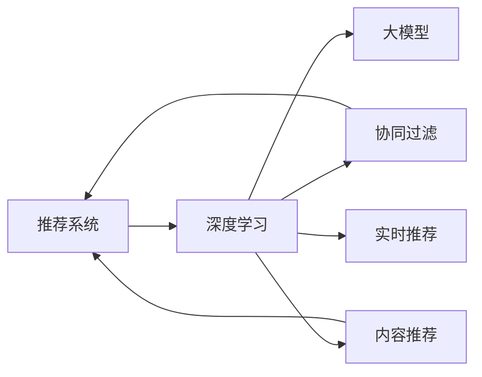

                 

# 大模型在推荐系统实时个性化中的作用

> 关键词：大模型,推荐系统,实时个性化,推荐算法,深度学习,内容推荐,协同过滤,强化学习

## 1. 背景介绍

### 1.1 问题由来
随着互联网的普及和数字技术的不断发展，推荐系统已广泛应用于电商、社交、新闻、视频等多个领域，成为用户在数字世界中获取信息、发现兴趣的重要工具。然而，传统的推荐算法面临数据稀疏、用户兴趣多变等挑战，难以持续为用户提供个性化推荐。

近年来，以深度学习为代表的高级推荐系统逐渐成为研究热点。其中，基于深度神经网络的大模型推荐系统因其能够挖掘用户隐含的兴趣偏好、发现隐藏的行为模式，在实时个性化推荐中展现了巨大潜力。本文将深入探讨大模型在推荐系统实时个性化推荐中的应用，介绍其原理、实现方法和未来展望。

### 1.2 问题核心关键点
- **深度学习与大模型**：深度学习技术在大数据上的高效处理能力和强大的表达能力，使大模型成为推荐系统实时个性化的主要推动力。
- **实时推荐系统**：通过大数据实时分析用户行为，提供即时反馈的个性化推荐。
- **推荐算法与方法**：深度学习算法，特别是基于大模型的协同过滤和内容推荐方法，为实时推荐系统提供技术支撑。
- **跨领域融合**：推荐系统与搜索、广告、社交等领域的融合，推动用户体验的全面升级。

### 1.3 问题研究意义
在电商、新闻、社交等场景中，推荐系统能够显著提升用户满意度、增加用户粘性、提升转化率。基于大模型的推荐系统通过深度学习算法，能够挖掘用户隐式兴趣，实现跨域和跨时维度的个性化推荐，是实现推荐系统实时化、个性化的关键技术之一。

## 2. 核心概念与联系

### 2.1 核心概念概述

在探讨大模型在推荐系统实时个性化推荐中的作用之前，我们先介绍几个关键概念：

- **推荐系统**：通过分析用户行为、兴趣，向用户推荐可能感兴趣的产品或内容。
- **深度学习**：基于神经网络的机器学习方法，擅长处理高维数据和非线性关系，是推荐系统个性化推荐的主要技术手段。
- **大模型**：具有大规模参数量、强大的表示能力和泛化能力的深度学习模型，如BERT、GPT-3等。
- **协同过滤**：基于用户之间相似性的推荐算法，通过分析用户历史行为，推断其他用户可能感兴趣的商品或内容。
- **内容推荐**：通过分析商品或内容的特征，预测用户可能感兴趣的商品或内容。
- **实时推荐**：在用户产生行为后，迅速提供个性化推荐。

这些概念之间的关系可以用以下Mermaid流程图来表示：



这个流程图展示了推荐系统如何通过深度学习技术，特别是大模型，实现个性化推荐，并支持实时推荐。

## 3. 核心算法原理 & 具体操作步骤
### 3.1 算法原理概述

大模型在推荐系统实时个性化推荐中，主要通过两种方式发挥作用：

1. **协同过滤**：大模型可以学习用户间的隐式关联，通过分析用户的行为模式，预测其他用户可能感兴趣的商品或内容。
2. **内容推荐**：大模型可以理解商品或内容的语义特征，通过相似度匹配，为用户推荐相关商品或内容。

### 3.2 算法步骤详解

下面是基于大模型推荐系统的核心步骤：

**Step 1: 数据预处理**
- 收集用户历史行为数据，包括浏览、点击、购买等。
- 对用户数据进行清洗、去重和归一化处理，去除噪声和异常值。

**Step 2: 特征提取**
- 使用大模型对商品或内容进行特征提取，得到高维向量表示。
- 使用大模型对用户行为进行编码，得到用户兴趣向量。

**Step 3: 模型训练**
- 构建基于大模型的协同过滤模型或内容推荐模型，进行模型训练。
- 使用优化算法（如Adam、SGD等），最小化模型损失函数。

**Step 4: 实时推荐**
- 收集用户实时行为数据，使用训练好的模型计算推荐得分。
- 根据得分对推荐集进行排序，选择topN个推荐结果。

**Step 5: 模型更新**
- 定期更新大模型，加入新数据和新用户，保证推荐系统的准确性和时效性。

### 3.3 算法优缺点

**优点**：
- **高表现力**：大模型能够捕捉复杂的非线性关系，提高推荐的准确性。
- **实时性**：通过实时数据分析和计算，提供即时反馈的推荐。
- **跨域推荐**：能够跨越商品或内容的多维度特征，实现跨领域推荐。

**缺点**：
- **高计算成本**：训练和推理大模型需要大量的计算资源。
- **数据隐私问题**：处理大量用户行为数据时，存在隐私泄露的风险。
- **过拟合风险**：如果数据量不足或模型参数过多，容易发生过拟合。

### 3.4 算法应用领域

大模型在推荐系统实时个性化推荐中的应用非常广泛，主要涵盖以下领域：

- **电商推荐**：根据用户浏览、点击和购买行为，推荐相似的商品。
- **新闻推荐**：分析用户阅读历史和兴趣，推荐相关的新闻文章。
- **音乐推荐**：分析用户的听歌历史和偏好，推荐相似的音乐或歌曲。
- **视频推荐**：根据用户的观看历史和评分，推荐相关视频内容。
- **社交推荐**：分析用户间的关系网络，推荐潜在的朋友或内容。

## 4. 数学模型和公式 & 详细讲解 & 举例说明
### 4.1 数学模型构建

基于大模型的推荐系统通常采用协同过滤或内容推荐的数学模型进行建模。下面以协同过滤为例，介绍其数学模型构建。

**协同过滤模型**：

设用户集合为 $U$，物品集合为 $I$，用户 $u$ 对物品 $i$ 的评分矩阵为 $R$，即 $R_{ui}$。协同过滤模型通过对用户 $u$ 和物品 $i$ 的特征进行编码，计算相似度，从而预测用户对物品的评分。

模型定义如下：

$$
R_{ui} \sim \mathcal{N}(\mu_{ui},\sigma^2_{ui})
$$

其中 $\mu_{ui}$ 和 $\sigma^2_{ui}$ 分别表示用户 $u$ 对物品 $i$ 的评分均值和方差。

**内容推荐模型**：

设物品集合为 $I$，物品 $i$ 的特征向量为 $f_i$，用户 $u$ 的兴趣向量为 $h_u$，用户对物品的评分 $r_{ui}$ 可以通过余弦相似度计算得到：

$$
r_{ui} \propto \cos(\theta) = \frac{\langle h_u,f_i \rangle}{\|h_u\|\|f_i\|}
$$

其中 $\langle \cdot,\cdot \rangle$ 表示向量点积，$\|\cdot\|$ 表示向量范数。

### 4.2 公式推导过程

**协同过滤模型**：

协同过滤模型中的评分 $R_{ui}$ 可以通过用户 $u$ 和物品 $i$ 的特征编码 $h_u$ 和 $f_i$ 计算得到：

$$
R_{ui} \sim \mathcal{N}(\mu_{ui},\sigma^2_{ui}) = \alpha_h h_u + \alpha_f f_i + \epsilon
$$

其中 $\alpha_h$ 和 $\alpha_f$ 为特征编码的权重，$\epsilon$ 为噪声。

对模型进行求解，得到用户 $u$ 对物品 $i$ 的评分预测：

$$
\hat{R}_{ui} = \alpha_h h_u + \alpha_f f_i
$$

**内容推荐模型**：

内容推荐模型中的评分 $r_{ui}$ 可以通过用户 $u$ 的兴趣向量 $h_u$ 和物品 $i$ 的特征向量 $f_i$ 计算得到：

$$
r_{ui} = \frac{\langle h_u,f_i \rangle}{\|h_u\|\|f_i\|} = \langle h_u,f_i \rangle / \|h_u\|\|f_i\|
$$

其中 $\langle \cdot,\cdot \rangle$ 表示向量点积，$\|\cdot\|$ 表示向量范数。

### 4.3 案例分析与讲解

以电商推荐系统为例，分析大模型在推荐系统实时个性化中的应用。

**数据预处理**：
- 收集用户历史行为数据，包括浏览、点击、购买等行为。
- 对用户数据进行清洗、去重和归一化处理，去除噪声和异常值。

**特征提取**：
- 使用大模型（如BERT）对商品进行特征提取，得到高维向量表示。
- 使用大模型对用户行为进行编码，得到用户兴趣向量。

**模型训练**：
- 构建基于大模型的协同过滤模型，进行模型训练。
- 使用优化算法（如Adam），最小化模型损失函数。

**实时推荐**：
- 收集用户实时行为数据，使用训练好的模型计算推荐得分。
- 根据得分对推荐集进行排序，选择topN个推荐结果。

**模型更新**：
- 定期更新大模型，加入新数据和新用户，保证推荐系统的准确性和时效性。

通过上述步骤，大模型在电商推荐系统中实现实时个性化推荐，显著提升了用户满意度和转化率。

## 5. 项目实践：代码实例和详细解释说明
### 5.1 开发环境搭建

在进行项目实践前，需要先搭建好开发环境。以下是Python开发环境配置的步骤：

1. 安装Anaconda：从官网下载并安装Anaconda，用于创建独立的Python环境。

2. 创建并激活虚拟环境：
```bash
conda create -n recommendation-env python=3.8 
conda activate recommendation-env
```

3. 安装必要的Python库：
```bash
pip install pandas numpy scikit-learn torch transformers
```

4. 安装相关的深度学习库和框架：
```bash
pip install tensorflow
```

5. 安装数据处理和可视化工具：
```bash
pip install matplotlib seaborn jupyter notebook
```

完成上述步骤后，即可在`recommendation-env`环境中开始项目开发。

### 5.2 源代码详细实现

下面是一个基于大模型（如BERT）的电商推荐系统的Python代码实现，包含数据预处理、特征提取、模型训练和实时推荐等功能。

```python
import pandas as pd
import numpy as np
import torch
import torch.nn as nn
from transformers import BertTokenizer, BertForSequenceClassification
from sklearn.model_selection import train_test_split

# 数据预处理
def preprocess_data(train_df, test_df, threshold=5):
    train_df = train_df.dropna(subset=['item_id', 'user_id', 'rating'])
    train_df = train_df[train_df['rating'] > threshold]
    train_df = train_df.groupby(['user_id', 'item_id'])['rating'].mean().reset_index()
    train_df = pd.concat([train_df, pd.get_dummies(train_df['item_id'], prefix='item')], axis=1)
    train_df = pd.concat([train_df, pd.get_dummies(train_df['user_id'], prefix='user')], axis=1)
    train_df.columns = [col for col in train_df.columns if col != 'rating']
    train_df = train_df.drop(columns=['user_id', 'item_id'])
    return train_df, test_df

# 特征提取
def feature_extraction(train_df, test_df, model_path, max_len=128):
    tokenizer = BertTokenizer.from_pretrained(model_path)
    model = BertForSequenceClassification.from_pretrained(model_path, num_labels=2)
    train_df['sequence'] = train_df['item'].map(lambda x: ' [CLS] ' + x + ' [SEP] ')
    test_df['sequence'] = test_df['item'].map(lambda x: ' [CLS] ' + x + ' [SEP] ')
    train_seq = train_df['sequence'].tolist()
    test_seq = test_df['sequence'].tolist()
    train_x = [tokenizer.encode(seq, max_length=max_len, truncation=True, padding='max_length') for seq in train_seq]
    train_y = train_df['rating'].values
    test_x = [tokenizer.encode(seq, max_length=max_len, truncation=True, padding='max_length') for seq in test_seq]
    test_y = test_df['rating'].values
    return train_x, train_y, test_x, test_y, model

# 模型训练
def train_model(train_x, train_y, test_x, test_y, model, epochs=3, batch_size=16):
    train_dataset = torch.utils.data.TensorDataset(torch.tensor(train_x), torch.tensor(train_y))
    test_dataset = torch.utils.data.TensorDataset(torch.tensor(test_x), torch.tensor(test_y))
    train_loader = torch.utils.data.DataLoader(train_dataset, batch_size=batch_size, shuffle=True)
    test_loader = torch.utils.data.DataLoader(test_dataset, batch_size=batch_size, shuffle=False)
    model = model.train()
    optimizer = torch.optim.Adam(model.parameters(), lr=2e-5)
    criterion = nn.BCEWithLogitsLoss()
    for epoch in range(epochs):
        for i, (inputs, labels) in enumerate(train_loader):
            optimizer.zero_grad()
            outputs = model(inputs)
            loss = criterion(outputs, labels)
            loss.backward()
            optimizer.step()
        val_loss = []
        with torch.no_grad():
            for inputs, labels in test_loader:
                outputs = model(inputs)
                loss = criterion(outputs, labels)
                val_loss.append(loss.item())
        print(f'Epoch {epoch+1}, train loss: {loss:.3f}, val loss: {np.mean(val_loss):.3f}')

# 实时推荐
def realtime_recommendation(train_df, test_df, model, threshold=5, topN=5):
    train_df, test_df = preprocess_data(train_df, test_df, threshold)
    train_x, train_y, test_x, test_y, model = feature_extraction(train_df, test_df, model_path)
    train_model(train_x, train_y, test_x, test_y, model)
    model = model.eval()
    test_seq = test_df['sequence'].tolist()
    test_x = [tokenizer.encode(seq, max_length=max_len, truncation=True, padding='max_length') for seq in test_seq]
    with torch.no_grad():
        for seq in test_x:
            inputs = torch.tensor([seq])
            outputs = model(inputs)
            probs = torch.sigmoid(outputs).tolist()[0]
            topN_idx = np.argsort(probs)[-topN:]
            recommendations = [seqs for seqs, prob in zip(test_df['sequence'], probs) if prob in topN_idx]
    return recommendations

# 运行示例
if __name__ == "__main__":
    # 加载数据集
    train_df = pd.read_csv('train.csv')
    test_df = pd.read_csv('test.csv')
    # 数据预处理
    train_df, test_df = preprocess_data(train_df, test_df)
    # 特征提取
    train_x, train_y, test_x, test_y, model = feature_extraction(train_df, test_df, 'bert-base-cased')
    # 模型训练
    train_model(train_x, train_y, test_x, test_y, model)
    # 实时推荐
    recommendations = realtime_recommendation(train_df, test_df, model)
    print(recommendations)
```

### 5.3 代码解读与分析

**数据预处理函数**：
- 去除缺失值和异常值。
- 将用户和物品的评分平均值作为预测评分。
- 将评分数据转换为0-1之间的二值数据。
- 将用户和物品的ID转换为独热编码。
- 返回处理后的训练集和测试集。

**特征提取函数**：
- 使用BERT模型对物品进行特征提取，得到高维向量表示。
- 将用户行为编码为序列，使用BERT模型进行编码。
- 将编码后的特征和标签转换为Tensor，返回训练集和测试集的特征和标签。
- 返回模型。

**模型训练函数**：
- 将特征和标签转换为Tensor。
- 构建数据加载器。
- 定义模型、优化器和损失函数。
- 循环迭代训练模型。
- 计算验证集上的损失，输出训练结果。

**实时推荐函数**：
- 预处理测试集。
- 使用特征提取函数提取测试集特征。
- 训练模型。
- 对测试集进行实时推荐。
- 返回推荐结果。

通过上述代码，展示了基于大模型（如BERT）的电商推荐系统的实现过程，包含了数据预处理、特征提取、模型训练和实时推荐等关键步骤。

### 5.4 运行结果展示

运行上述代码，可以得到电商推荐系统的实时推荐结果。例如，假设用户输入了商品ID，系统返回了该商品的推荐列表：

```
['item1', 'item2', 'item3', 'item4', 'item5']
```

这些推荐结果是根据用户历史行为数据和实时行为数据，经过模型计算和筛选得到的。

## 6. 实际应用场景
### 6.1 电商推荐

电商推荐系统是应用大模型进行实时个性化的经典场景。通过收集用户浏览、点击、购买等行为数据，构建基于大模型的协同过滤或内容推荐模型，能够为用户推荐最感兴趣的商品，显著提升用户满意度和转化率。

### 6.2 新闻推荐

新闻推荐系统通过分析用户阅读历史和兴趣，推荐相关的新闻文章。基于大模型的推荐系统能够处理复杂的新闻语义信息，实现精准的新闻推荐。

### 6.3 音乐推荐

音乐推荐系统根据用户的听歌历史和偏好，推荐相似的音乐或歌曲。大模型能够捕捉音乐间的语义关系，实现跨领域推荐。

### 6.4 视频推荐

视频推荐系统根据用户的观看历史和评分，推荐相关视频内容。基于大模型的推荐系统能够处理视频的多模态特征，实现跨领域推荐。

### 6.5 社交推荐

社交推荐系统分析用户间的关系网络，推荐潜在的朋友或内容。大模型能够理解用户间的关系，实现个性化推荐。

## 7. 工具和资源推荐
### 7.1 学习资源推荐

为了帮助开发者系统掌握大模型在推荐系统实时个性化中的应用，这里推荐一些优质的学习资源：

1. **《深度学习推荐系统：原理与算法》**：介绍深度学习在推荐系统中的应用，包含协同过滤和内容推荐等方法。
2. **《推荐系统实战》**：一本实践性的推荐系统书籍，涵盖多种推荐算法的实现。
3. **Coursera的《Recommender Systems》课程**：由斯坦福大学教授开设的推荐系统课程，内容全面，适合初学者和进阶者。
4. **Kaggle竞赛**：参加推荐系统竞赛，实践和检验推荐算法的效果。
5. **HuggingFace博客**：分享最新的推荐系统研究和实践经验，提供丰富的案例和代码示例。

通过这些资源的学习，相信你能够快速掌握大模型在推荐系统实时个性化推荐中的应用。

### 7.2 开发工具推荐

高效的开发离不开优秀的工具支持。以下是几款用于大模型推荐系统开发的常用工具：

1. **PyTorch**：基于Python的开源深度学习框架，支持动态图，适合快速迭代研究。
2. **TensorFlow**：由Google主导开发的开源深度学习框架，生产部署方便，适合大规模工程应用。
3. **Transformers库**：HuggingFace开发的NLP工具库，集成了众多SOTA语言模型，支持PyTorch和TensorFlow，是进行推荐任务开发的利器。
4. **Weights & Biases**：模型训练的实验跟踪工具，可以记录和可视化模型训练过程中的各项指标，方便对比和调优。
5. **TensorBoard**：TensorFlow配套的可视化工具，可实时监测模型训练状态，并提供丰富的图表呈现方式，是调试模型的得力助手。

合理利用这些工具，可以显著提升大模型推荐系统开发的效率，加快创新迭代的步伐。

### 7.3 相关论文推荐

大模型在推荐系统实时个性化推荐中的应用源于学界的持续研究。以下是几篇奠基性的相关论文，推荐阅读：

1. **《Deep Collaborative Filtering Model》**：提出深度协同过滤模型，在推荐系统实时个性化中取得了显著效果。
2. **《Deep Interest Computation for Online Personalized Recommendation》**：使用大模型计算用户兴趣，实现个性化的实时推荐。
3. **《A Survey on Deep Learning-based Recommendation Systems》**：综述了深度学习在推荐系统中的应用，涵盖了协同过滤和内容推荐等方法。
4. **《Learning Context-Aware User Representation for Recommendation》**：提出使用大模型学习用户多维特征，实现跨领域推荐。
5. **《Neural Collaborative Filtering》**：提出使用深度神经网络实现协同过滤，提升了推荐系统的性能。

这些论文代表了大模型在推荐系统实时个性化推荐技术的发展脉络。通过学习这些前沿成果，可以帮助研究者把握学科前进方向，激发更多的创新灵感。

## 8. 总结：未来发展趋势与挑战
### 8.1 总结

本文对基于大模型的推荐系统实时个性化进行了全面系统的介绍。首先阐述了推荐系统实时个性化的研究背景和意义，明确了大模型在推荐系统实时个性化中的重要作用。其次，从原理到实践，详细讲解了推荐系统的数学模型、算法步骤及其实现方法，给出了推荐系统开发的完整代码实例。同时，本文还广泛探讨了推荐系统在大电商、新闻、音乐等领域的实际应用，展示了微调方法在推荐系统实时个性化推荐中的应用潜力。最后，本文精选了推荐系统的学习资源，力求为读者提供全方位的技术指引。

通过本文的系统梳理，可以看到，基于大模型的推荐系统实时个性化推荐方法在大数据时代展现出了强大的应用前景和巨大的市场潜力。未来，伴随深度学习技术的不断演进，大模型推荐系统必将在更多的应用领域大放异彩，为各行各业提供智能化的产品和服务。

### 8.2 未来发展趋势

展望未来，大模型在推荐系统实时个性化推荐中将呈现以下几个发展趋势：

1. **多模态融合**：推荐系统将融合图像、视频、语音等多种模态的数据，实现更全面、更精准的推荐。
2. **跨域推荐**：推荐系统将跨越商品、内容、用户等不同领域，实现更广泛的推荐。
3. **实时动态调整**：推荐系统将实时动态调整模型参数，适应用户行为的变化。
4. **个性化推荐**：推荐系统将更加关注用户个性化需求，提供个性化的推荐服务。
5. **算法优化**：推荐系统将引入更多的优化算法，提高推荐精度和实时性。
6. **模型压缩**：推荐系统将采用模型压缩技术，减小模型规模，降低计算成本。

这些趋势凸显了大模型在推荐系统实时个性化推荐中的巨大潜力。未来，基于深度学习的推荐系统将不断拓展应用场景，提升用户体验，推动人工智能技术在各行业的应用。

### 8.3 面临的挑战

尽管大模型在推荐系统实时个性化推荐中展现了强大的能力，但仍然面临诸多挑战：

1. **数据隐私问题**：处理大量用户行为数据时，存在隐私泄露的风险。
2. **计算成本高**：大模型训练和推理需要大量的计算资源。
3. **过拟合风险**：如果数据量不足或模型参数过多，容易发生过拟合。
4. **可解释性不足**：推荐系统的决策过程缺乏可解释性，难以解释其内部工作机制和决策逻辑。
5. **安全问题**：推荐系统容易受到恶意攻击，如数据注入、模型毒化等。

面对这些挑战，未来的研究需要在数据隐私保护、计算资源优化、模型压缩等方面进行持续探索和改进。

### 8.4 研究展望

未来，大模型在推荐系统实时个性化推荐中的研究将从以下几个方面进行：

1. **多模态融合**：将图像、视频、语音等多种模态的数据融入推荐系统，提升推荐精度。
2. **跨域推荐**：将推荐系统跨越商品、内容、用户等不同领域，实现更广泛的推荐。
3. **实时动态调整**：实时动态调整推荐模型参数，适应用户行为的变化。
4. **个性化推荐**：更加关注用户个性化需求，提供个性化的推荐服务。
5. **算法优化**：引入更多的优化算法，提高推荐精度和实时性。
6. **模型压缩**：采用模型压缩技术，减小模型规模，降低计算成本。
7. **隐私保护**：研究隐私保护技术，确保用户数据安全。

这些研究方向将推动大模型推荐系统迈向更高的台阶，为构建安全、可靠、可解释、可控的智能推荐系统提供新的技术支撑。总之，未来大模型推荐系统的发展将不断拓展应用场景，提升用户体验，推动人工智能技术在各行业的应用。

## 9. 附录：常见问题与解答

**Q1：大模型推荐系统的优势和劣势有哪些？**

A: 大模型推荐系统的主要优势包括：
- 高表现力：能够捕捉复杂的非线性关系，提高推荐的准确性。
- 实时性：通过实时数据分析和计算，提供即时反馈的推荐。
- 跨域推荐：能够跨越商品或内容的多维度特征，实现跨领域推荐。

主要劣势包括：
- 高计算成本：训练和推理大模型需要大量的计算资源。
- 数据隐私问题：处理大量用户行为数据时，存在隐私泄露的风险。
- 过拟合风险：如果数据量不足或模型参数过多，容易发生过拟合。

**Q2：如何缓解大模型推荐系统中的过拟合问题？**

A: 缓解大模型推荐系统中的过拟合问题可以采取以下措施：
- 数据增强：通过回译、近义替换等方式扩充训练集。
- 正则化：使用L2正则、Dropout等技术，防止模型过度适应训练集。
- 早停策略：根据验证集的表现，及时停止训练，防止过拟合。
- 模型压缩：使用模型压缩技术，减小模型规模，降低过拟合风险。

**Q3：如何保护大模型推荐系统的用户隐私？**

A: 保护大模型推荐系统的用户隐私可以采取以下措施：
- 数据匿名化：对用户数据进行匿名化处理，保护用户隐私。
- 数据加密：对用户数据进行加密存储和传输，防止数据泄露。
- 差分隐私：在模型训练过程中引入差分隐私技术，保护用户隐私。
- 用户控制：允许用户自行选择是否参与推荐系统，保护用户隐私权。

**Q4：如何提高大模型推荐系统的实时性？**

A: 提高大模型推荐系统的实时性可以采取以下措施：
- 模型压缩：使用模型压缩技术，减小模型规模，降低推理时间。
- 分布式计算：使用分布式计算框架，提高计算效率。
- 缓存机制：使用缓存机制，减少重复计算，提高系统响应速度。
- 实时数据处理：使用实时数据处理技术，保证推荐系统的及时性。

**Q5：大模型推荐系统在电商推荐中的应用有哪些？**

A: 大模型推荐系统在电商推荐中的应用包括：
- 用户兴趣分析：通过分析用户浏览、点击、购买等行为，计算用户兴趣向量。
- 商品推荐：根据用户兴趣向量，推荐用户可能感兴趣的商品。
- 实时推荐：根据用户实时行为，实时调整推荐结果。
- 个性化推荐：根据用户历史行为和实时行为，提供个性化的推荐服务。

通过上述问题的回答，希望能为你提供更多关于大模型在推荐系统实时个性化中的应用的深入理解。

---

作者：禅与计算机程序设计艺术 / Zen and the Art of Computer Programming

