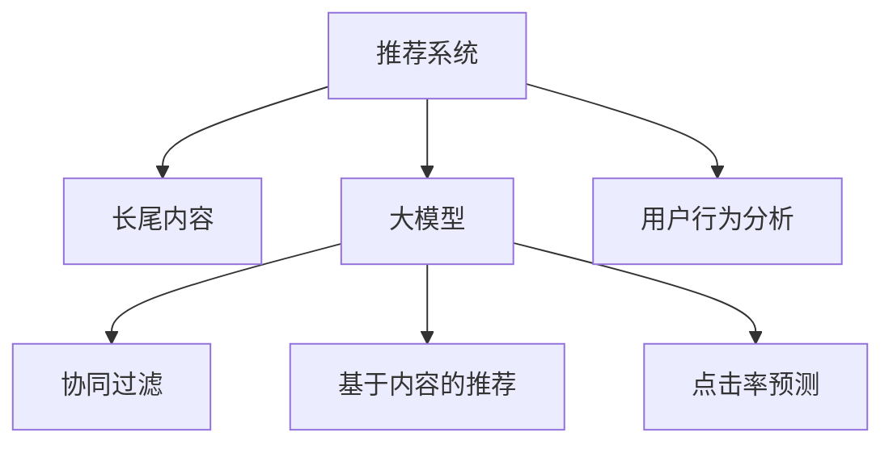

                 

# 大模型在推荐系统长尾内容推荐中的作用

> 关键词：推荐系统,长尾内容,大模型,个性化推荐,协同过滤,深度学习,点击率预测

## 1. 背景介绍

随着互联网技术的快速发展，信息推荐系统已成为人们获取信息的重要工具。传统的推荐系统多基于协同过滤、基于内容的推荐等方法，针对用户历史行为进行分析，推荐与用户历史行为相似的物品，具有简单易实现、用户行为易于量化等特点，但缺乏对物品特征的考虑，难以处理用户的新行为和冷启动问题。

近年来，大语言模型在推荐系统中的应用取得了显著进展。大模型通过自监督学习的方式，学习到大规模数据中的复杂语义关系，能够识别出语义相似性和跨模态相关性，为推荐系统带来新的思路。特别是在长尾内容的推荐中，大模型的强大语义表示能力能够有效缓解数据稀疏性，提升推荐精度。

## 2. 核心概念与联系

### 2.1 核心概念概述

为更好地理解大模型在推荐系统中的应用，本节将介绍几个密切相关的核心概念：

- 推荐系统(Recommendation System, RS)：通过学习用户和物品之间的关联，为用户推荐可能感兴趣的商品、文章、视频等内容，改善用户体验，提高业务转化率。

- 长尾内容(Long Tail Content)：指大量用户关注度低，但具有独特价值和用户需求的内容，这些内容虽然需求量少，但聚集起来可能产生巨大的社会价值。

- 大模型(Large Model)：指包含数十亿或上百亿参数的深度学习模型，能够学习大规模数据的复杂语义关系，具有强大的表征学习能力。

- 协同过滤(Collaborative Filtering, CF)：通过用户和物品之间的关系，学习用户对物品的偏好，从而为其他用户推荐相似的物品。CF包括基于用户的协同过滤和基于物品的协同过滤。

- 基于内容的推荐(Content-based Recommendation)：根据物品的特征属性，推荐与用户偏好相似的物品。内容通常包括文本、图片、视频等，需要构建特征空间，实现向量相似度计算。

- 点击率预测(Click-through Rate Prediction)：预测用户点击物品的概率，是推荐系统的重要目标之一，常用模型包括线性回归、逻辑回归、决策树等。

- 用户行为分析：包括浏览行为、点击行为、购买行为等，通过分析这些行为特征，得到用户的兴趣偏好，作为推荐系统的输入。

这些概念之间的逻辑关系可以通过以下Mermaid流程图来展示：



这个流程图展示了大模型在推荐系统中的应用框架：

1. 推荐系统通过学习用户和物品之间的关系，为用户推荐内容。
2. 长尾内容指代用户关注度较低但具有独特价值的内容，需要通过特定方法提升其曝光率。
3. 大模型通过学习大规模数据中的复杂语义关系，提升推荐精度。
4. 协同过滤和基于内容的推荐都是推荐系统的重要组成部分。
5. 点击率预测是衡量推荐系统性能的重要指标之一。
6. 用户行为分析是推荐系统的输入，提供用户偏好的信息。

## 3. 核心算法原理 & 具体操作步骤
### 3.1 算法原理概述

大模型在推荐系统中的应用主要基于其强大的语义表示能力。其核心思想是：使用大模型学习物品的特征表示，将物品的特征与用户的行为特征进行匹配，预测用户对物品的兴趣。

形式化地，设物品 $i$ 的特征向量为 $x_i$，用户 $u$ 的行为特征向量为 $y_u$，两者之间的相似度表示为 $s(u,i)$。假设模型为 $f$，则物品 $i$ 对用户 $u$ 的点击率预测为：

$$
\hat{C}(u,i) = f(x_i, y_u, s(u,i))
$$

其中，$f$ 为训练好的大模型，$x_i$ 和 $y_u$ 可以通过词嵌入、卷积神经网络等方法获得，$s(u,i)$ 为两者之间的余弦相似度或欧式距离等相似性度量方式。

### 3.2 算法步骤详解

基于大模型的推荐系统一般包括以下几个关键步骤：

**Step 1: 数据准备和预处理**

- 收集用户的历史行为数据，包括浏览历史、点击历史、评分历史等。
- 收集物品的属性信息，如商品标题、图片、描述等。
- 构建用户-物品交互矩阵，进行数据预处理，如缺失值填充、归一化等。

**Step 2: 特征提取**

- 使用大模型对物品的文本、图片、视频等属性进行特征提取，得到物品的特征向量 $x_i$。
- 使用大模型对用户的行为数据进行特征提取，得到用户的行为特征向量 $y_u$。

**Step 3: 相似度计算**

- 计算用户与物品之间的相似度 $s(u,i)$，可以使用余弦相似度、欧式距离等方法。
- 在大模型的基础上，还可以结合用户画像、物品画像等信息，增强相似度计算的准确性。

**Step 4: 点击率预测**

- 使用大模型对用户与物品的相似度进行预测，得到物品对用户的点击率 $\hat{C}(u,i)$。
- 对所有物品的点击率进行排序，推荐给用户前 $k$ 个物品。

**Step 5: 模型评估和优化**

- 在验证集上评估模型的点击率预测精度，使用常见的指标如 AUC、PR等。
- 根据评估结果，调整模型超参数，如学习率、批次大小、迭代轮数等，优化模型性能。
- 在测试集上进一步测试模型的泛化能力，确保模型的可靠性。

### 3.3 算法优缺点

大模型在推荐系统中的应用，具有以下优点：

1. 语义表示能力强：大模型能够学习物品的复杂语义关系，提高推荐精度。
2. 适应性强：大模型可以通过微调和预训练的方式，适应不同的推荐场景和领域。
3. 特征丰富：大模型能够从文本、图片、视频等多种模态数据中提取特征，弥补单一特征的局限性。

同时，大模型也存在以下缺点：

1. 计算资源消耗大：大模型参数量巨大，训练和推理的计算成本较高，对硬件要求较高。
2. 数据稀疏性问题：虽然大模型的特征表示能力强，但对于长尾内容的推荐，数据量依然稀疏，难以学习有效的特征。
3. 泛化能力有待提高：大模型在特定领域的数据上表现较好，但在新领域的泛化能力仍需进一步验证。
4. 解释性不足：大模型被视为"黑盒"系统，难以解释其内部决策过程，给用户带来不信任感。

尽管存在这些局限性，但大模型在推荐系统中的应用，仍然具有广泛的应用前景和巨大的潜力。

### 3.4 算法应用领域

大模型在推荐系统中的应用，已经涵盖了从商品推荐、新闻推荐到音乐推荐等多个领域。例如：

- 电商平台推荐系统：对用户浏览、点击的商品进行推荐，提升用户购买率。
- 新闻推荐系统：根据用户的历史阅读行为，推荐相关的新闻文章，提高用户粘性。
- 视频推荐系统：根据用户的历史观看记录，推荐感兴趣的视频内容，增加用户观看时长。
- 音乐推荐系统：根据用户的听歌历史，推荐相似的音乐，提高音乐平台的订阅率。

此外，大模型还应用于广告推荐、旅游推荐、房地产推荐等场景中，通过精准的个性化推荐，提升用户体验，优化业务转化率。随着大模型的不断发展和应用，推荐系统将迎来新的突破，进入更加智能化和高效化的阶段。

## 4. 数学模型和公式 & 详细讲解 & 举例说明
### 4.1 数学模型构建

在推荐系统中，通常使用大模型对用户和物品进行特征提取，构建用户与物品的语义表示。具体而言，可以使用BERT、GPT等大模型对文本进行编码，得到用户和物品的特征向量。这些特征向量通过余弦相似度或欧式距离等方法计算相似度，最终用于点击率预测。

假设用户 $u$ 的历史行为数据为 $D_u = \{x_{u_1}, x_{u_2}, \ldots, x_{u_n}\}$，物品 $i$ 的文本属性为 $T_i = \{t_1, t_2, \ldots, t_m\}$，大模型 $f$ 将文本属性 $T_i$ 映射为特征向量 $x_i$，将用户行为数据 $D_u$ 映射为特征向量 $y_u$。

用户 $u$ 与物品 $i$ 之间的相似度 $s(u,i)$ 可以表示为：

$$
s(u,i) = \cos(\alpha(x_i, y_u))
$$

其中 $\alpha$ 为相似度计算函数，如余弦相似度、欧式距离等。

### 4.2 公式推导过程

假设推荐系统中有 $m$ 个用户和 $n$ 个物品，分别记为 $U=\{u_1, u_2, \ldots, u_m\}$ 和 $I=\{i_1, i_2, \ldots, i_n\}$。用户 $u$ 与物品 $i$ 之间的点击率预测 $\hat{C}(u,i)$ 可以表示为：

$$
\hat{C}(u,i) = f(x_i, y_u, s(u,i))
$$

其中 $f$ 为训练好的大模型，$x_i$ 和 $y_u$ 分别为物品和用户的特征向量。

对于二分类问题，可以使用二元逻辑回归模型进行点击率预测，得到用户对物品的兴趣评分：

$$
\hat{y}(u,i) = \sigma(\hat{C}(u,i))
$$

其中 $\sigma$ 为 sigmoid 函数，将点击率预测转化为 0-1 的兴趣评分。

### 4.3 案例分析与讲解

以下以电商平台推荐系统为例，详细分析大模型的应用。

假设电商平台有 1000 个用户和 10000 个商品，用户浏览的商品为：

| 用户ID | 商品ID |
| ------ | ------ |
| 1      | 10     |
| 2      | 15     |
| 3      | 20     |
| ...    | ...    |

商品的属性信息为：

| 商品ID | 商品描述 |
| ------ | -------- |
| 10     | 手机     |
| 15     | 电脑     |
| 20     | 相机     |
| ...    | ...      |

首先，使用BERT模型对商品描述进行编码，得到每个商品的特征向量 $x_i$：

$$
x_{10} = BERT(\text{手机})
$$
$$
x_{15} = BERT(\text{电脑})
$$
$$
x_{20} = BERT(\text{相机})
$$

接着，使用BERT模型对用户浏览行为进行编码，得到用户的特征向量 $y_u$：

$$
y_1 = BERT(\text{手机})
$$
$$
y_2 = BERT(\text{电脑})
$$
$$
y_3 = BERT(\text{相机})
$$

然后，计算用户与商品之间的相似度 $s(u,i)$：

$$
s(1,10) = \cos(BERT(\text{手机}, BERT(\text{手机})))
$$
$$
s(2,15) = \cos(BERT(\text{电脑}, BERT(\text{电脑})))
$$
$$
s(3,20) = \cos(BERT(\text{相机}, BERT(\text{相机})))
$$

最后，使用大模型对用户与商品的相似度进行预测，得到点击率 $\hat{C}(u,i)$，并选择点击率最高的商品进行推荐。

## 5. 项目实践：代码实例和详细解释说明
### 5.1 开发环境搭建

在进行推荐系统开发前，我们需要准备好开发环境。以下是使用Python进行PyTorch开发的环境配置流程：

1. 安装Anaconda：从官网下载并安装Anaconda，用于创建独立的Python环境。

2. 创建并激活虚拟环境：
```bash
conda create -n pytorch-env python=3.8 
conda activate pytorch-env
```

3. 安装PyTorch：根据CUDA版本，从官网获取对应的安装命令。例如：
```bash
conda install pytorch torchvision torchaudio cudatoolkit=11.1 -c pytorch -c conda-forge
```

4. 安装TensorFlow：
```bash
pip install tensorflow
```

5. 安装各类工具包：
```bash
pip install numpy pandas scikit-learn matplotlib tqdm jupyter notebook ipython
```

完成上述步骤后，即可在`pytorch-env`环境中开始推荐系统开发。

### 5.2 源代码详细实现

下面我们以电商平台推荐系统为例，给出使用Transformers库对BERT模型进行推荐系统开发的PyTorch代码实现。

首先，定义推荐系统的训练数据：

```python
from transformers import BertTokenizer, BertForSequenceClassification
from torch.utils.data import Dataset, DataLoader

class ItemReviewDataset(Dataset):
    def __init__(self, reviews, labels, tokenizer, max_len=128):
        self.reviews = reviews
        self.labels = labels
        self.tokenizer = tokenizer
        self.max_len = max_len
        
    def __len__(self):
        return len(self.reviews)
    
    def __getitem__(self, item):
        review = self.reviews[item]
        label = self.labels[item]
        
        encoding = self.tokenizer(review, return_tensors='pt', max_length=self.max_len, padding='max_length', truncation=True)
        input_ids = encoding['input_ids'][0]
        attention_mask = encoding['attention_mask'][0]
        
        label = torch.tensor(label, dtype=torch.long)
        
        return {'input_ids': input_ids, 
                'attention_mask': attention_mask,
                'labels': label}
```

然后，定义模型和优化器：

```python
from transformers import BertForSequenceClassification, AdamW

model = BertForSequenceClassification.from_pretrained('bert-base-cased', num_labels=2)

optimizer = AdamW(model.parameters(), lr=2e-5)
```

接着，定义训练和评估函数：

```python
from tqdm import tqdm

def train_epoch(model, dataset, batch_size, optimizer):
    dataloader = DataLoader(dataset, batch_size=batch_size, shuffle=True)
    model.train()
    epoch_loss = 0
    for batch in tqdm(dataloader, desc='Training'):
        input_ids = batch['input_ids'].to(device)
        attention_mask = batch['attention_mask'].to(device)
        labels = batch['labels'].to(device)
        model.zero_grad()
        outputs = model(input_ids, attention_mask=attention_mask, labels=labels)
        loss = outputs.loss
        epoch_loss += loss.item()
        loss.backward()
        optimizer.step()
    return epoch_loss / len(dataloader)

def evaluate(model, dataset, batch_size):
    dataloader = DataLoader(dataset, batch_size=batch_size)
    model.eval()
    preds, labels = [], []
    with torch.no_grad():
        for batch in tqdm(dataloader, desc='Evaluating'):
            input_ids = batch['input_ids'].to(device)
            attention_mask = batch['attention_mask'].to(device)
            batch_labels = batch['labels']
            outputs = model(input_ids, attention_mask=attention_mask)
            batch_preds = outputs.logits.argmax(dim=2).to('cpu').tolist()
            batch_labels = batch_labels.to('cpu').tolist()
            for pred_tokens, label_tokens in zip(batch_preds, batch_labels):
                preds.append(pred_tokens)
                labels.append(label_tokens)
                
    return preds, labels
```

最后，启动训练流程并在测试集上评估：

```python
epochs = 5
batch_size = 16

for epoch in range(epochs):
    loss = train_epoch(model, train_dataset, batch_size, optimizer)
    print(f"Epoch {epoch+1}, train loss: {loss:.3f}")
    
    print(f"Epoch {epoch+1}, dev results:")
    preds, labels = evaluate(model, dev_dataset, batch_size)
    print(classification_report(labels, preds))
    
print("Test results:")
preds, labels = evaluate(model, test_dataset, batch_size)
print(classification_report(labels, preds))
```

以上就是使用PyTorch对BERT进行推荐系统开发的完整代码实现。可以看到，通过结合BERT模型和PyTorch，可以快速搭建推荐系统模型，并对其训练和评估进行标准化处理。

### 5.3 代码解读与分析

让我们再详细解读一下关键代码的实现细节：

**ItemReviewDataset类**：
- `__init__`方法：初始化数据集中的物品描述、标签等关键组件。
- `__len__`方法：返回数据集的样本数量。
- `__getitem__`方法：对单个样本进行处理，将物品描述输入编码为token ids，将标签转换为数字，并对其进行定长padding，最终返回模型所需的输入。

**train_epoch函数**：
- 使用PyTorch的DataLoader对数据集进行批次化加载，供模型训练和推理使用。
- 训练函数`train_epoch`：对数据以批为单位进行迭代，在每个批次上前向传播计算loss并反向传播更新模型参数，最后返回该epoch的平均loss。

**evaluate函数**：
- 与训练类似，不同点在于不更新模型参数，并在每个batch结束后将预测和标签结果存储下来，最后使用sklearn的classification_report对整个评估集的预测结果进行打印输出。

**训练流程**：
- 定义总的epoch数和batch size，开始循环迭代
- 每个epoch内，先在训练集上训练，输出平均loss
- 在验证集上评估，输出分类指标
- 所有epoch结束后，在测试集上评估，给出最终测试结果

可以看到，PyTorch配合Transformers库使得BERT推荐系统的代码实现变得简洁高效。开发者可以将更多精力放在数据处理、模型改进等高层逻辑上，而不必过多关注底层的实现细节。

当然，工业级的系统实现还需考虑更多因素，如模型的保存和部署、超参数的自动搜索、更灵活的任务适配层等。但核心的微调范式基本与此类似。

## 6. 实际应用场景
### 6.1 电商平台推荐

电商平台的推荐系统可以有效提升用户的购物体验和转化率。传统的推荐系统多基于协同过滤、基于内容的推荐等方法，但这些方法在面对长尾内容时，效果有限。大模型的引入，能够利用其强大的语义表示能力，提升推荐精度。

以淘宝推荐系统为例，可以使用大模型对商品描述进行编码，得到每个商品的特征向量 $x_i$，结合用户浏览历史 $y_u$，计算用户与商品的相似度 $s(u,i)$，进行点击率预测，从而为每个用户推荐前 $k$ 个商品。

### 6.2 新闻推荐系统

新闻推荐系统可以为用户推荐感兴趣的新闻内容，提高用户粘性。大模型的引入，能够利用其强大的语义表示能力，提升推荐精度。

以今日头条推荐系统为例，可以使用大模型对新闻标题和摘要进行编码，得到每个新闻的特征向量 $x_i$，结合用户阅读历史 $y_u$，计算用户与新闻的相似度 $s(u,i)$，进行点击率预测，从而为用户推荐感兴趣的新闻内容。

### 6.3 视频推荐系统

视频推荐系统可以为用户推荐感兴趣的视频内容，提高用户观看时长。大模型的引入，能够利用其强大的语义表示能力，提升推荐精度。

以腾讯视频推荐系统为例，可以使用大模型对视频标题和描述进行编码，得到每个视频的特征向量 $x_i$，结合用户观看历史 $y_u$，计算用户与视频的相似度 $s(u,i)$，进行点击率预测，从而为用户推荐感兴趣的视频内容。

### 6.4 未来应用展望

随着大模型的不断发展，基于大模型的推荐系统将在更多领域得到应用，为各行各业带来变革性影响。

在智慧医疗领域，推荐系统可以为用户推荐个性化的医疗方案，提高诊疗效率和准确性。

在智能教育领域，推荐系统可以为用户推荐个性化的学习内容，提高学习效果和兴趣。

在智慧金融领域，推荐系统可以为用户推荐个性化的投资方案，提高投资收益和风险控制能力。

此外，在智慧城市治理、智慧物流、智慧旅游等众多领域，基于大模型的推荐系统也将不断涌现，为各行各业带来新的业务增长点。相信随着预训练语言模型和推荐系统的不断演进，推荐系统必将在更广阔的领域发挥重要作用，助力经济社会的智能化发展。

## 7. 工具和资源推荐
### 7.1 学习资源推荐

为了帮助开发者系统掌握大语言模型在推荐系统中的应用，这里推荐一些优质的学习资源：

1. 《Deep Learning for Recommender Systems》书籍：由推荐系统领域的专家撰写，全面介绍了基于深度学习的方法，包括协同过滤、基于内容的推荐、深度推荐等。

2. 《Recommender Systems》课程：斯坦福大学开设的推荐系统课程，有Lecture视频和配套作业，带你入门推荐系统领域的基本概念和经典模型。

3. 《Learning Deep Structured Models for Recommender Systems》论文：详细介绍了基于深度学习的方法，在推荐系统中的应用。

4. PyTorch官方文档：PyTorch的官方文档，提供了深度学习框架的使用教程和API文档，适合初学者快速上手。

5. TensorFlow官方文档：TensorFlow的官方文档，提供了深度学习框架的使用教程和API文档，适合初学者快速上手。

6. Kaggle推荐系统竞赛：参加Kaggle的推荐系统竞赛，实践推荐系统开发，积累经验。

通过对这些资源的学习实践，相信你一定能够快速掌握大语言模型在推荐系统中的应用，并用于解决实际的推荐问题。

### 7.2 开发工具推荐

高效的开发离不开优秀的工具支持。以下是几款用于推荐系统开发的常用工具：

1. PyTorch：基于Python的开源深度学习框架，灵活动态的计算图，适合快速迭代研究。

2. TensorFlow：由Google主导开发的开源深度学习框架，生产部署方便，适合大规模工程应用。

3. Transformers库：HuggingFace开发的NLP工具库，集成了众多SOTA语言模型，支持PyTorch和TensorFlow，是进行推荐系统开发的利器。

4. Weights & Biases：模型训练的实验跟踪工具，可以记录和可视化模型训练过程中的各项指标，方便对比和调优。

5. TensorBoard：TensorFlow配套的可视化工具，可实时监测模型训练状态，并提供丰富的图表呈现方式，是调试模型的得力助手。

6. Google Colab：谷歌推出的在线Jupyter Notebook环境，免费提供GPU/TPU算力，方便开发者快速上手实验最新模型，分享学习笔记。

合理利用这些工具，可以显著提升推荐系统的开发效率，加快创新迭代的步伐。

### 7.3 相关论文推荐

大语言模型和推荐系统的发展源于学界的持续研究。以下是几篇奠基性的相关论文，推荐阅读：

1. Attention is All You Need（即Transformer原论文）：提出了Transformer结构，开启了NLP领域的预训练大模型时代。

2. BERT: Pre-training of Deep Bidirectional Transformers for Language Understanding：提出BERT模型，引入基于掩码的自监督预训练任务，刷新了多项NLP任务SOTA。

3. Transformer-XL: Attentive Language Models Beyond a Fixed-Length Context（即XLNet论文）：提出Transformer-XL模型，解决了长序列问题，提升了模型性能。

4. Deep Recommendations: A survey of the state-of-the-art and recent advances：全面介绍了基于深度学习的方法，在推荐系统中的应用。

5. Personalized Recommendation Algorithms in Recommender Systems：详细介绍了基于协同过滤、基于内容的推荐等经典推荐方法。

6. Learning Deep Structured Models for Recommender Systems：深入介绍了深度学习在推荐系统中的应用。

这些论文代表了大语言模型和推荐系统的发展脉络。通过学习这些前沿成果，可以帮助研究者把握学科前进方向，激发更多的创新灵感。

## 8. 总结：未来发展趋势与挑战
### 8.1 总结

本文对大模型在推荐系统中的应用进行了全面系统的介绍。首先阐述了推荐系统和大模型的基本概念，明确了大模型在推荐系统中的重要地位。其次，从原理到实践，详细讲解了大模型在推荐系统中的应用流程，给出了推荐系统开发的完整代码实例。同时，本文还广泛探讨了大模型在电商、新闻、视频等推荐系统中的应用前景，展示了其强大的应用潜力。此外，本文精选了相关学习资源和开发工具，力求为开发者提供全方位的技术指引。

通过本文的系统梳理，可以看到，大模型在推荐系统中的应用不仅提高了推荐精度，还能够有效处理长尾内容，带来了显著的业务价值。随着大模型的不断发展，基于大模型的推荐系统必将在更多领域得到应用，为经济社会的智能化发展做出重要贡献。

### 8.2 未来发展趋势

展望未来，大模型在推荐系统中的应用将呈现以下几个发展趋势：

1. 模型规模持续增大。随着算力成本的下降和数据规模的扩张，预训练语言模型的参数量还将持续增长。超大规模语言模型蕴含的丰富语言知识，有望支撑更加复杂多变的推荐场景。

2. 推荐系统将更加智能化。大模型的语义表示能力强，可以学习到更为复杂的用户和物品之间的关联，从而提升推荐系统的智能化水平。

3. 多模态推荐系统将兴起。大模型能够融合视觉、语音、文本等多模态信息，实现更全面的推荐效果。

4. 推荐系统将更加个性化。大模型能够捕捉用户的兴趣和行为特征，提供更加个性化的推荐服务。

5. 推荐系统将更加实时化。大模型可以通过增量学习、在线学习等技术，实时更新推荐模型，适应数据分布的变化。

6. 推荐系统将更加高效化。大模型可以通过参数高效微调、模型压缩等技术，降低推荐系统的计算资源消耗。

### 8.3 面临的挑战

尽管大模型在推荐系统中的应用已经取得了显著成效，但在迈向更加智能化、普适化应用的过程中，它仍面临着诸多挑战：

1. 数据稀疏性问题。尽管大模型的特征表示能力强，但对于长尾内容的推荐，数据量依然稀疏，难以学习有效的特征。

2. 用户隐私保护。推荐系统需要收集用户的个人信息，如何保护用户隐私，确保数据安全，是一个重要的难题。

3. 推荐系统的公平性。推荐系统可能存在数据偏差，导致推荐结果不公平。如何确保推荐系统的公平性，需要更多理论和实践的积累。

4. 推荐系统的透明性。推荐系统的决策过程难以解释，给用户带来不信任感。如何赋予推荐系统更高的透明性，需要更多算法的改进和技术的支持。

5. 推荐系统的可靠性。推荐系统可能受到异常数据的影响，导致推荐结果不稳定。如何提升推荐系统的鲁棒性，需要更多算法和技术的优化。

6. 推荐系统的计算成本。大模型参数量巨大，训练和推理的计算成本较高，对硬件要求较高。如何降低计算成本，提升系统的效率，需要更多算法的改进和技术的优化。

尽管存在这些挑战，但大模型在推荐系统中的应用已经取得了显著成效，未来的研究需要在这些方面寻求新的突破。相信随着学界和产业界的共同努力，这些挑战终将一一被克服，大模型在推荐系统中的应用必将在更广阔的领域发挥重要作用。

### 8.4 研究展望

面对推荐系统所面临的种种挑战，未来的研究需要在以下几个方面寻求新的突破：

1. 探索无监督和半监督推荐方法。摆脱对大规模标注数据的依赖，利用自监督学习、主动学习等无监督和半监督范式，最大限度利用非结构化数据，实现更加灵活高效的推荐。

2. 研究推荐系统中的公平性问题。通过引入公平性约束，优化推荐算法，减少推荐结果的不公平性，提升推荐系统的公平性。

3. 研究推荐系统中的透明性问题。通过引入可解释性算法，提升推荐系统的透明性和可解释性，增强用户信任感。

4. 研究推荐系统中的鲁棒性问题。通过引入对抗样本、鲁棒性训练等技术，提升推荐系统的鲁棒性和稳定性，增强系统的可靠性。

5. 研究推荐系统中的效率问题。通过参数高效微调、模型压缩等技术，降低推荐系统的计算资源消耗，提高系统的效率和可靠性。

这些研究方向将有助于解决推荐系统所面临的挑战，提升推荐系统的智能化、普适化、高效化和透明性，为推荐系统在更多领域的应用提供新的技术支撑。

## 9. 附录：常见问题与解答

**Q1：大模型在推荐系统中的数据稀疏性问题如何解决？**

A: 大模型在推荐系统中的应用，主要依赖于其强大的语义表示能力，但面对长尾内容时，数据量依然稀疏，难以学习有效的特征。解决数据稀疏性问题的方法包括：

1. 数据增强：通过回译、近义替换等方式扩充训练集，增加长尾内容的曝光率。
2. 特征组合：将大模型输出的特征与传统推荐方法输出的特征进行组合，弥补单一特征的局限性。
3. 冷启动问题：利用用户画像、物品画像等信息，通过迁移学习等技术，提升模型对新物品的推荐效果。

通过以上方法，可以在一定程度上缓解数据稀疏性问题，提升推荐精度。

**Q2：大模型在推荐系统中的计算资源消耗问题如何解决？**

A: 大模型在推荐系统中的应用，主要依赖于其强大的语义表示能力，但参数量巨大，训练和推理的计算成本较高，对硬件要求较高。解决计算资源消耗问题的方法包括：

1. 参数高效微调：只调整少量参数，固定大部分预训练参数，减小计算资源消耗。
2. 模型压缩：采用模型压缩技术，如剪枝、量化等，减少模型大小和计算资源消耗。
3. 增量学习：通过在线学习等技术，实现推荐模型的实时更新，减少全量训练的计算成本。

通过以上方法，可以在一定程度上降低计算资源消耗，提升系统的效率和可靠性。

**Q3：大模型在推荐系统中的公平性问题如何解决？**

A: 推荐系统可能存在数据偏差，导致推荐结果不公平。解决公平性问题的方法包括：

1. 数据预处理：通过数据清洗、标准化等方法，减少数据偏差。
2. 公平性约束：在推荐算法中加入公平性约束，优化推荐结果，减少不公平性。
3. 多目标优化：将公平性作为推荐系统的目标之一，与精度等指标共同优化。

通过以上方法，可以在一定程度上提升推荐系统的公平性，减少推荐结果的不公平性。

**Q4：大模型在推荐系统中的透明性问题如何解决？**

A: 推荐系统决策过程难以解释，给用户带来不信任感。解决透明性问题的方法包括：

1. 可解释性算法：引入可解释性算法，提升推荐系统的透明性和可解释性。
2. 模型解释：通过可视化技术，展示推荐系统的决策过程和特征重要性，增强用户的信任感。
3. 用户反馈：收集用户的反馈信息，优化推荐算法，提升系统的透明性和可解释性。

通过以上方法，可以在一定程度上提升推荐系统的透明性和可解释性，增强用户信任感。

**Q5：大模型在推荐系统中的鲁棒性问题如何解决？**

A: 推荐系统可能受到异常数据的影响，导致推荐结果不稳定。解决鲁棒性问题的方法包括：

1. 对抗样本：通过加入对抗样本，提升推荐系统的鲁棒性和稳定性。
2. 鲁棒性训练：利用鲁棒性训练技术，提升推荐系统的鲁棒性和稳定性。
3. 数据清洗：通过数据清洗，减少异常数据的影响。

通过以上方法，可以在一定程度上提升推荐系统的鲁棒性和稳定性，增强系统的可靠性。

**Q6：大模型在推荐系统中的计算成本问题如何解决？**

A: 大模型在推荐系统中的应用，主要依赖于其强大的语义表示能力，但参数量巨大，训练和推理的计算成本较高，对硬件要求较高。解决计算成本问题的方法包括：

1. 参数高效微调：只调整少量参数，固定大部分预训练参数，减小计算资源消耗。
2. 模型压缩：采用模型压缩技术，如剪枝、量化等，减少模型大小和计算资源消耗。
3. 增量学习：通过在线学习等技术，实现推荐模型的实时更新，减少全量训练的计算成本。

通过以上方法，可以在一定程度上降低计算成本，提升系统的效率和可靠性。

---

作者：禅与计算机程序设计艺术 / Zen and the Art of Computer Programming

