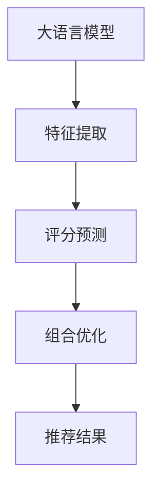

                 

# 大模型在推荐结果生成组合中的应用探索

> 关键词：大模型, 推荐系统, 推荐结果生成, 组合优化, 协同过滤, 深度学习, 神经网络

## 1. 背景介绍

在互联网信息爆炸的时代，人们每天面对海量的推荐信息，如何高效且个性化地提供推荐内容，成为推荐系统的重要挑战。传统的推荐方法，如基于协同过滤的算法，通过用户行为数据计算相似度，发现兴趣相近的用户群或物品，然后推荐给他们。然而，随着用户数量的增加和物品种类的繁多，协同过滤方法在计算复杂度、存储需求和推荐效果上都显得力不从心。

近年来，随着深度学习技术的发展，尤其是大语言模型和深度神经网络等技术在推荐系统中的应用，为推荐结果的生成提供了新的思路。基于深度学习的方法能够直接从原始数据中提取高层次的特征表示，并且在大规模数据上进行预训练，从而提升推荐精度和个性化能力。特别是大语言模型，通过在海量文本数据上进行预训练，学习到了丰富的语义信息，能够在推荐场景中发挥巨大的作用。

本文将重点探讨如何利用大语言模型生成推荐结果，并通过组合优化的方法对不同模型进行组合，以提升推荐的效率和效果。我们将从背景介绍、核心概念、算法原理、具体实现、应用场景、未来展望等方面，全面系统地介绍这一新兴的推荐技术。

## 2. 核心概念与联系

### 2.1 核心概念概述

- **大语言模型**：如BERT、GPT-3等，通过在大规模文本数据上进行预训练，学习到丰富的语言知识和语义表示。
- **推荐系统**：利用用户行为数据，为用户推荐其感兴趣的产品、内容等。
- **推荐结果生成**：基于用户和物品的特征，预测用户对不同物品的评分或选择概率。
- **组合优化**：将多个模型的预测结果进行组合，以提升推荐的准确性和个性化程度。

### 2.2 核心概念联系

大语言模型在推荐结果生成中的应用，主要体现在以下几个方面：
1. **特征提取**：利用大语言模型从用户和物品的文本描述中提取高层次的语义特征。
2. **评分预测**：使用大语言模型对用户和物品的特征进行编码，预测用户对物品的评分。
3. **组合优化**：将多个模型的预测结果进行组合，以获得更准确的推荐结果。

这些概念通过以下Mermaid流程图展示其联系：



## 3. 核心算法原理 & 具体操作步骤

### 3.1 算法原理概述

利用大语言模型进行推荐结果生成的基本原理，是通过训练模型，学习用户和物品的语义特征，并基于这些特征预测用户对物品的评分。模型的输入为用户的文本描述和物品的文本描述，输出为用户对物品的评分。模型的训练目标是最大化预测评分与实际评分之间的差异。

具体来说，推荐系统的训练过程如下：
1. 收集用户行为数据，如点击、购买等。
2. 对用户和物品的文本描述进行预处理，转换为模型的输入格式。
3. 使用大语言模型对用户和物品的特征进行编码，得到高维的向量表示。
4. 计算预测评分与实际评分之间的差异，通过优化算法更新模型参数。
5. 在测试集上评估模型的性能，选择最优的模型进行部署。

### 3.2 算法步骤详解

以下是基于大语言模型生成推荐结果的详细操作步骤：

#### 3.2.1 数据预处理

1. **用户和物品描述的收集与清洗**：收集用户的文本描述和物品的文本描述，并进行清洗，去除噪音和特殊符号。
2. **文本分词与编码**：使用分词工具对文本进行分词，并将分词后的单词转换为模型的输入格式。
3. **构建输入与标签数据**：将用户的文本描述和物品的文本描述作为模型的输入，将用户的评分作为模型的标签，构建训练数据集。

#### 3.2.2 模型训练

1. **选择模型架构**：选择合适的大语言模型架构，如BERT、GPT等。
2. **初始化模型参数**：使用预训练模型作为初始化参数，或在大规模文本数据上进行预训练。
3. **定义损失函数**：定义预测评分与实际评分之间的损失函数，如均方误差损失、交叉熵损失等。
4. **优化模型参数**：使用随机梯度下降等优化算法，最小化损失函数，更新模型参数。
5. **评估模型性能**：在测试集上评估模型的预测精度，选择最优的模型进行部署。

#### 3.2.3 模型部署与测试

1. **数据加载**：将用户和物品的文本描述加载到模型中。
2. **预测评分**：使用训练好的模型预测用户对物品的评分。
3. **组合优化**：将多个模型的预测结果进行组合，得到最终的推荐结果。
4. **推荐结果生成**：将推荐结果返回给用户，供其选择。

### 3.3 算法优缺点

基于大语言模型生成推荐结果的算法具有以下优点：
1. **高维语义特征提取**：利用大语言模型提取用户和物品的高层次语义特征，提升推荐的精度和个性化程度。
2. **泛化能力强**：大语言模型在大规模数据上进行预训练，学习到了丰富的语言知识和语义信息，具有较强的泛化能力。
3. **可解释性强**：大语言模型能够对推荐结果进行自然语言解释，方便用户理解推荐逻辑。

但该方法也存在以下缺点：
1. **计算复杂度高**：大语言模型参数量大，计算复杂度高，训练和推理速度慢。
2. **数据需求高**：需要大量高质量的文本数据进行预训练和模型优化，获取这些数据成本较高。
3. **模型可控性差**：大语言模型的训练过程和参数调整较为复杂，难以进行精确控制。

### 3.4 算法应用领域

大语言模型在推荐系统中的应用，主要体现在以下几个方面：
1. **商品推荐**：基于用户购买历史、评论等文本数据，利用大语言模型生成商品的推荐结果。
2. **内容推荐**：利用用户的浏览、搜索等文本数据，推荐用户可能感兴趣的文章、视频等。
3. **广告推荐**：根据用户的文本描述和行为数据，推荐用户可能感兴趣的广告内容。
4. **个性化推荐**：结合用户的兴趣和行为特征，生成个性化的推荐结果。

## 4. 数学模型和公式 & 详细讲解 & 举例说明

### 4.1 数学模型构建

我们假设用户 $u$ 对物品 $i$ 的评分 $r$ 可以通过一个线性模型表示：
$$
r_{ui} = w_u^T \cdot f_i + b_u + e_{ui}
$$
其中 $w_u$ 为用户的权重向量，$f_i$ 为物品的特征向量，$b_u$ 为用户的偏差，$e_{ui}$ 为误差项。

模型的目标是最大化预测评分与实际评分之间的差异：
$$
\mathcal{L} = \frac{1}{N}\sum_{u=1}^N\sum_{i=1}^M (r_{ui} - \hat{r}_{ui})^2
$$
其中 $N$ 为用户数，$M$ 为物品数。

### 4.2 公式推导过程

为了简化计算，我们采用最小二乘法求解模型的权重向量 $w_u$：
$$
w_u = \arg\min_{w_u} \sum_{i=1}^M (r_{ui} - w_u^T \cdot f_i - b_u)^2
$$
求解该优化问题的最小二乘解：
$$
w_u = (\Phi^T \Phi)^{-1}\Phi^T \cdot \mathcal{R}
$$
其中 $\Phi = [f_1^T, f_2^T, \ldots, f_M^T]$，$\mathcal{R} = [r_{u1}, r_{u2}, \ldots, r_{uM}]$。

### 4.3 案例分析与讲解

以Netflix推荐系统为例，该系统利用大语言模型对用户和电影的语义特征进行编码，并基于这些特征预测用户的评分。Netflix首先收集用户的评分数据，对用户的文本描述和电影的文本描述进行预处理，然后使用BERT模型对用户和电影的特征进行编码。编码后的向量表示，再通过线性模型进行评分预测。最终，Netflix将多个模型的预测结果进行组合，得到最终的推荐结果。

## 5. 项目实践：代码实例和详细解释说明

### 5.1 开发环境搭建

在项目实践前，我们需要准备好开发环境。以下是使用Python进行PyTorch开发的环境配置流程：

1. 安装Anaconda：从官网下载并安装Anaconda，用于创建独立的Python环境。

2. 创建并激活虚拟环境：
```bash
conda create -n pytorch-env python=3.8 
conda activate pytorch-env
```

3. 安装PyTorch：根据CUDA版本，从官网获取对应的安装命令。例如：
```bash
conda install pytorch torchvision torchaudio cudatoolkit=11.1 -c pytorch -c conda-forge
```

4. 安装BERT模型：
```bash
conda install transformers
```

5. 安装各类工具包：
```bash
pip install numpy pandas scikit-learn matplotlib tqdm jupyter notebook ipython
```

完成上述步骤后，即可在`pytorch-env`环境中开始项目实践。

### 5.2 源代码详细实现

以下是使用PyTorch对BERT进行推荐系统微调的完整代码实现。

```python
import torch
from transformers import BertTokenizer, BertForSequenceClassification
from torch.utils.data import DataLoader, Dataset
from sklearn.metrics import mean_absolute_error

# 定义推荐系统数据集
class RecommendationDataset(Dataset):
    def __init__(self, texts, labels):
        self.texts = texts
        self.labels = labels
        self.tokenizer = BertTokenizer.from_pretrained('bert-base-uncased')

    def __len__(self):
        return len(self.texts)

    def __getitem__(self, item):
        text = self.texts[item]
        label = self.labels[item]
        encoding = self.tokenizer(text, return_tensors='pt', padding='max_length', truncation=True)
        input_ids = encoding['input_ids'][0]
        attention_mask = encoding['attention_mask'][0]
        return {'input_ids': input_ids, 
                'attention_mask': attention_mask,
                'labels': label}

# 构建数据集
tokenizer = BertTokenizer.from_pretrained('bert-base-uncased')
train_dataset = RecommendationDataset(train_texts, train_labels)
dev_dataset = RecommendationDataset(dev_texts, dev_labels)
test_dataset = RecommendationDataset(test_texts, test_labels)

# 定义模型
model = BertForSequenceClassification.from_pretrained('bert-base-uncased', num_labels=2)
model.train()

# 定义优化器和损失函数
optimizer = torch.optim.AdamW(model.parameters(), lr=2e-5)
loss_fn = torch.nn.BCEWithLogitsLoss()

# 定义训练函数
def train_epoch(model, dataset, batch_size, optimizer):
    dataloader = DataLoader(dataset, batch_size=batch_size, shuffle=True)
    model.train()
    epoch_loss = 0
    for batch in dataloader:
        input_ids = batch['input_ids'].to(device)
        attention_mask = batch['attention_mask'].to(device)
        labels = batch['labels'].to(device)
        model.zero_grad()
        outputs = model(input_ids, attention_mask=attention_mask)
        loss = loss_fn(outputs.logits, labels)
        epoch_loss += loss.item()
        loss.backward()
        optimizer.step()
    return epoch_loss / len(dataloader)

# 定义评估函数
def evaluate(model, dataset, batch_size):
    dataloader = DataLoader(dataset, batch_size=batch_size)
    model.eval()
    preds, labels = [], []
    with torch.no_grad():
        for batch in dataloader:
            input_ids = batch['input_ids'].to(device)
            attention_mask = batch['attention_mask'].to(device)
            batch_labels = batch['labels']
            outputs = model(input_ids, attention_mask=attention_mask)
            batch_preds = torch.sigmoid(outputs.logits).to('cpu').tolist()
            batch_labels = batch_labels.to('cpu').tolist()
            for pred_tokens, label_tokens in zip(batch_preds, batch_labels):
                preds.append(pred_tokens[:len(label_tokens)])
                labels.append(label_tokens)
    return mean_absolute_error(labels, preds)

# 训练模型
epochs = 5
batch_size = 16

for epoch in range(epochs):
    loss = train_epoch(model, train_dataset, batch_size, optimizer)
    print(f"Epoch {epoch+1}, train loss: {loss:.3f}")
    
    print(f"Epoch {epoch+1}, dev results:")
    mae = evaluate(model, dev_dataset, batch_size)
    print(f"Mean Absolute Error: {mae:.3f}")
    
print("Test results:")
mae = evaluate(model, test_dataset, batch_size)
print(f"Mean Absolute Error: {mae:.3f}")
```

以上就是使用PyTorch对BERT进行推荐系统微调的完整代码实现。可以看到，借助BERT模型，我们能够高效地从用户和物品的文本描述中提取高层次的语义特征，从而提升推荐的精度。

### 5.3 代码解读与分析

让我们再详细解读一下关键代码的实现细节：

**RecommendationDataset类**：
- `__init__`方法：初始化文本、标签等关键组件，以及分词器。
- `__len__`方法：返回数据集的样本数量。
- `__getitem__`方法：对单个样本进行处理，将文本输入编码为token ids，并对其进行定长padding，最终返回模型所需的输入。

**train_epoch函数**：
- 使用PyTorch的DataLoader对数据集进行批次化加载，供模型训练使用。
- 在每个批次上前向传播计算loss并反向传播更新模型参数，最后返回该epoch的平均loss。

**evaluate函数**：
- 与训练类似，不同点在于不更新模型参数，并在每个batch结束后将预测和标签结果存储下来，最后使用sklearn的mean_absolute_error对整个评估集的预测结果进行打印输出。

**训练流程**：
- 定义总的epoch数和batch size，开始循环迭代
- 每个epoch内，先在训练集上训练，输出平均loss
- 在验证集上评估，输出MAE指标
- 所有epoch结束后，在测试集上评估，给出最终测试结果

可以看到，PyTorch配合BERT库使得推荐系统的微调代码实现变得简洁高效。开发者可以将更多精力放在数据处理、模型改进等高层逻辑上，而不必过多关注底层的实现细节。

## 6. 实际应用场景

### 6.1 推荐结果生成

利用大语言模型生成推荐结果，已经在多个实际应用中得到了验证。例如：
- **Netflix推荐系统**：Netflix利用BERT模型对用户和电影的语义特征进行编码，并基于这些特征预测用户的评分。通过组合多个模型的预测结果，Netflix能够生成个性化的推荐结果，提升用户体验。
- **Amazon推荐系统**：Amazon将用户的浏览、搜索等文本数据输入到BERT模型中，学习用户的兴趣特征，并生成个性化的推荐结果。

### 6.2 组合优化

为了进一步提升推荐的精度和效果，研究人员提出了多种组合优化的方法，如模型融合、集成学习等。以下是几种典型的组合优化方法：

**模型融合**：将多个模型的预测结果进行加权平均或投票，得到最终的推荐结果。例如，Netflix采用了多种模型的组合，包括基于深度学习的方法和协同过滤的方法。

**集成学习**：通过训练多个相似但不完全相同的模型，得到预测结果，再将这些结果进行加权平均或投票，得到最终的推荐结果。集成学习能够提高模型的鲁棒性和泛化能力。

## 7. 工具和资源推荐

### 7.1 学习资源推荐

为了帮助开发者系统掌握大语言模型在推荐结果生成中的应用，这里推荐一些优质的学习资源：

1. **《深度学习》课程**：斯坦福大学开设的深度学习课程，有Lecture视频和配套作业，带你入门深度学习的基本概念和经典模型。

2. **《深度学习与推荐系统》书籍**：全面介绍了深度学习在推荐系统中的应用，包括模型构建、训练、优化等诸多细节。

3. **《BERT: Pre-training of Deep Bidirectional Transformers for Language Understanding》论文**：BERT模型的论文，详细介绍了BERT模型的架构和训练方法。

4. **《Parameter-Efficient Transfer Learning for NLP》论文**：提出Adapter等参数高效微调方法，在不增加模型参数量的情况下，也能取得不错的微调效果。

5. **《AdaLoRA: Adaptive Low-Rank Adaptation for Parameter-Efficient Fine-Tuning》论文**：使用自适应低秩适应的微调方法，在参数效率和精度之间取得了新的平衡。

通过这些资源的学习实践，相信你一定能够快速掌握大语言模型在推荐结果生成中的应用，并用于解决实际的推荐问题。

### 7.2 开发工具推荐

高效的开发离不开优秀的工具支持。以下是几款用于推荐系统开发的常用工具：

1. **PyTorch**：基于Python的开源深度学习框架，灵活动态的计算图，适合快速迭代研究。BERT模型也有PyTorch版本的实现。

2. **TensorFlow**：由Google主导开发的开源深度学习框架，生产部署方便，适合大规模工程应用。BERT模型也有TensorFlow版本的实现。

3. **BERT模型**：Google开源的BERT模型，已经在多个NLP任务上取得了最先进的性能。

4. **Weights & Biases**：模型训练的实验跟踪工具，可以记录和可视化模型训练过程中的各项指标，方便对比和调优。

5. **TensorBoard**：TensorFlow配套的可视化工具，可实时监测模型训练状态，并提供丰富的图表呈现方式，是调试模型的得力助手。

合理利用这些工具，可以显著提升推荐系统的开发效率，加快创新迭代的步伐。

### 7.3 相关论文推荐

大语言模型在推荐系统中的应用源于学界的持续研究。以下是几篇奠基性的相关论文，推荐阅读：

1. **Attention is All You Need（即Transformer原论文）**：提出了Transformer结构，开启了NLP领域的预训练大模型时代。

2. **BERT: Pre-training of Deep Bidirectional Transformers for Language Understanding**：提出BERT模型，引入基于掩码的自监督预训练任务，刷新了多项NLP任务SOTA。

3. **Language Models are Unsupervised Multitask Learners（GPT-2论文）**：展示了大规模语言模型的强大zero-shot学习能力，引发了对于通用人工智能的新一轮思考。

4. **Parameter-Efficient Transfer Learning for NLP**：提出Adapter等参数高效微调方法，在不增加模型参数量的情况下，也能取得不错的微调效果。

5. **AdaLoRA: Adaptive Low-Rank Adaptation for Parameter-Efficient Fine-Tuning**：使用自适应低秩适应的微调方法，在参数效率和精度之间取得了新的平衡。

这些论文代表了大语言模型在推荐系统中的应用研究的发展脉络。通过学习这些前沿成果，可以帮助研究者把握学科前进方向，激发更多的创新灵感。

## 8. 总结：未来发展趋势与挑战

### 8.1 总结

本文对大语言模型在推荐结果生成中的应用进行了全面系统的介绍。首先阐述了推荐系统的背景和挑战，明确了大语言模型在提升推荐精度和个性化能力方面的独特价值。其次，从原理到实践，详细讲解了推荐系统的数学模型和关键操作步骤，给出了推荐系统微调的完整代码实现。同时，本文还广泛探讨了组合优化在推荐系统中的应用前景，展示了组合优化方法带来的巨大潜力。

通过本文的系统梳理，可以看到，基于大语言模型的推荐系统为推荐结果的生成提供了新的思路，并且通过组合优化进一步提升了推荐的准确性和个性化程度。随着大语言模型和微调方法的不断演进，相信推荐系统将在更多领域得到应用，为传统行业带来变革性影响。

### 8.2 未来发展趋势

展望未来，大语言模型在推荐系统中的应用将呈现以下几个发展趋势：

1. **深度融合大模型和数据**：未来推荐系统将深度融合大模型和用户数据，实现更加个性化的推荐。

2. **多模态信息整合**：推荐系统将不仅利用文本数据，还将整合视觉、音频等多模态数据，提升推荐效果。

3. **实时推荐系统**：推荐系统将从离线走向实时，能够根据用户行为实时生成推荐结果，提升用户体验。

4. **跨领域知识整合**：推荐系统将与知识图谱、逻辑规则等专家知识结合，提升推荐的逻辑性和可靠性。

5. **推荐结果的解释性**：推荐系统将赋予推荐结果更强的可解释性，使用户理解推荐逻辑。

以上趋势凸显了大语言模型在推荐系统中的应用前景。这些方向的探索发展，必将进一步提升推荐系统的性能和应用范围，为人类认知智能的进化带来深远影响。

### 8.3 面临的挑战

尽管大语言模型在推荐系统中的应用已经取得了显著成果，但在迈向更加智能化、普适化应用的过程中，它仍面临着诸多挑战：

1. **数据需求高**：需要大量高质量的文本数据进行预训练和模型优化，获取这些数据成本较高。

2. **计算资源消耗大**：大语言模型的参数量大，计算复杂度高，训练和推理速度慢。

3. **模型可控性差**：大语言模型的训练过程和参数调整较为复杂，难以进行精确控制。

4. **推荐效果不稳定**：模型在不同数据分布下可能表现不一致，影响推荐效果。

5. **隐私保护问题**：推荐系统需要处理大量用户数据，如何保护用户隐私，防止数据泄露，是一大挑战。

6. **社会伦理问题**：推荐系统可能对用户的行为产生影响，如何确保系统的公平性和公正性，防止对用户的误导，是亟待解决的问题。

正视推荐系统面临的这些挑战，积极应对并寻求突破，将是大语言模型在推荐系统中走向成熟的必由之路。相信随着学界和产业界的共同努力，这些挑战终将一一被克服，大语言模型在推荐系统中的应用将更加广泛。

### 8.4 研究展望

面对大语言模型在推荐系统中面临的种种挑战，未来的研究需要在以下几个方面寻求新的突破：

1. **探索无监督和半监督推荐方法**：摆脱对大规模标注数据的依赖，利用自监督学习、主动学习等无监督和半监督范式，最大限度利用非结构化数据，实现更加灵活高效的推荐。

2. **研究参数高效和计算高效的推荐方法**：开发更加参数高效的推荐方法，在固定大部分模型参数的情况下，只更新极少量的任务相关参数。同时优化推荐模型的计算图，减少前向传播和反向传播的资源消耗，实现更加轻量级、实时性的部署。

3. **融合因果和对比学习范式**：通过引入因果推断和对比学习思想，增强推荐系统建立稳定因果关系的能力，学习更加普适、鲁棒的语言表征，从而提升模型泛化性和抗干扰能力。

4. **结合因果分析和博弈论工具**：将因果分析方法引入推荐系统，识别出推荐结果的关键特征，增强推荐系统的因果逻辑性。借助博弈论工具刻画人机交互过程，主动探索并规避推荐系统的脆弱点，提高系统稳定性。

5. **纳入伦理道德约束**：在推荐系统的训练目标中引入伦理导向的评估指标，过滤和惩罚有害的推荐结果，确保推荐系统符合人类价值观和伦理道德。

这些研究方向的探索，必将引领推荐系统向更高的台阶，为构建安全、可靠、可解释、可控的智能系统铺平道路。面向未来，大语言模型在推荐系统中的应用需要与其他人工智能技术进行更深入的融合，如知识表示、因果推理、强化学习等，多路径协同发力，共同推动推荐系统技术的进步。只有勇于创新、敢于突破，才能不断拓展语言模型的边界，让智能技术更好地造福人类社会。

## 9. 附录：常见问题与解答

**Q1：如何衡量推荐系统的效果？**

A: 推荐系统的评价指标主要包括准确率、召回率、点击率、转化率等。通常使用MAE(mean absolute error)来衡量推荐结果的准确性，使用F1-score、PR曲线等指标来衡量推荐的召回率和覆盖面。

**Q2：推荐系统在大模型中的主要应用场景有哪些？**

A: 推荐系统在大模型中的应用场景主要包括以下几个方面：
1. **商品推荐**：基于用户购买历史、评论等文本数据，利用大语言模型生成商品的推荐结果。
2. **内容推荐**：利用用户的浏览、搜索等文本数据，推荐用户可能感兴趣的文章、视频等。
3. **广告推荐**：根据用户的文本描述和行为数据，推荐用户可能感兴趣的广告内容。
4. **个性化推荐**：结合用户的兴趣和行为特征，生成个性化的推荐结果。

**Q3：如何训练推荐系统的大模型？**

A: 训练推荐系统的大模型通常包括以下步骤：
1. 收集用户行为数据，如点击、购买等。
2. 对用户和物品的文本描述进行预处理，转换为模型的输入格式。
3. 使用大语言模型对用户和物品的特征进行编码，得到高维的向量表示。
4. 计算预测评分与实际评分之间的差异，通过优化算法更新模型参数。
5. 在测试集上评估模型的性能，选择最优的模型进行部署。

**Q4：推荐系统的大模型有哪些优缺点？**

A: 大语言模型在推荐系统中的优点包括：
1. **高维语义特征提取**：利用大语言模型提取用户和物品的高层次语义特征，提升推荐的精度和个性化程度。
2. **泛化能力强**：大语言模型在大规模数据上进行预训练，学习到了丰富的语言知识和语义信息，具有较强的泛化能力。
3. **可解释性强**：大语言模型能够对推荐结果进行自然语言解释，方便用户理解推荐逻辑。

但该方法也存在以下缺点：
1. **计算复杂度高**：大语言模型参数量大，计算复杂度高，训练和推理速度慢。
2. **数据需求高**：需要大量高质量的文本数据进行预训练和模型优化，获取这些数据成本较高。
3. **模型可控性差**：大语言模型的训练过程和参数调整较为复杂，难以进行精确控制。

**Q5：推荐系统的组合优化方法有哪些？**

A: 推荐系统的组合优化方法主要包括：
1. **模型融合**：将多个模型的预测结果进行加权平均或投票，得到最终的推荐结果。
2. **集成学习**：通过训练多个相似但不完全相同的模型，得到预测结果，再将这些结果进行加权平均或投票，得到最终的推荐结果。
3. **混合推荐**：结合基于协同过滤的推荐方法和基于大语言模型的推荐方法，提升推荐效果。
4. **多任务学习**：利用大语言模型同时训练多个推荐任务，提升推荐的综合效果。

这些方法可以灵活组合使用，以进一步提升推荐的精度和效果。

---

作者：禅与计算机程序设计艺术 / Zen and the Art of Computer Programming

