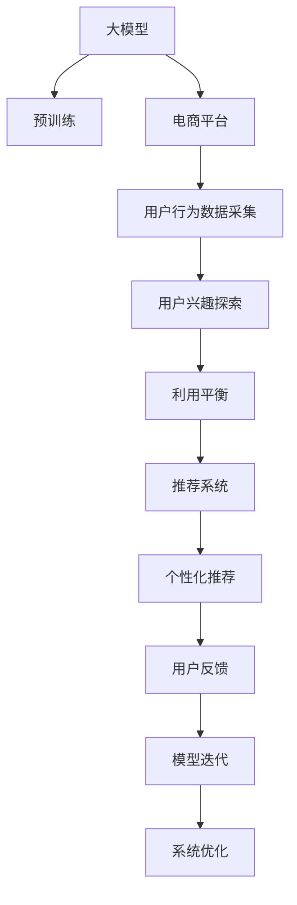

                 

# 大模型在电商平台用户兴趣探索与利用平衡中的应用

> 关键词：大模型, 电商平台, 用户兴趣, 兴趣探索, 利用平衡, 推荐系统, 个性化推荐, 用户画像, 深度学习, 自然语言处理(NLP), 用户行为分析

## 1. 背景介绍

随着互联网技术的飞速发展，电商平台已成为人们日常生活中不可或缺的一部分。通过在线购物，用户不仅可以方便地比对商品价格和评价，还能享受到更加个性化和精准的购物体验。在这种背景下，如何更高效地探索和利用用户兴趣，成为了电商平台用户推荐系统的重要研究方向。大模型的引入为这一问题提供了新的解决思路，通过深度学习和自然语言处理技术，实现了对用户兴趣的深度挖掘和精准匹配。

## 2. 核心概念与联系

### 2.1 核心概念概述

1. **大模型**：指使用大规模数据进行预训练的深度学习模型，如BERT、GPT、Transformer等。这些模型通过在大规模无标签文本数据上预训练，学习了丰富的语言知识，具备强大的语言理解和生成能力。

2. **电商平台**：指通过互联网提供商品展示、销售和客户服务的在线平台，如淘宝、京东、亚马逊等。

3. **用户兴趣**：指用户对商品、服务或内容的偏好和需求，是电商平台进行个性化推荐的基础。

4. **兴趣探索**：通过分析用户的历史行为数据，识别出用户的兴趣点，构建用户画像。

5. **利用平衡**：在探索用户兴趣的同时，平衡好用户隐私保护和商家利益，避免过度推荐或误导用户。

6. **推荐系统**：根据用户兴趣和行为，推荐用户可能感兴趣的商品或内容，提升用户体验和平台转化率。

### 2.2 核心概念原理和架构的 Mermaid 流程图



这个流程图展示了从大模型预训练到电商平台个性化推荐的全过程。大模型在预训练后，用于电商平台的个性化推荐系统，通过用户行为数据的采集和兴趣探索，实现对用户兴趣的精准匹配。同时，在推荐过程中注重利用平衡，确保推荐内容的健康和适宜性。最后，通过用户反馈和模型迭代，持续优化推荐系统，提升用户体验和平台转化率。

## 3. 核心算法原理 & 具体操作步骤

### 3.1 算法原理概述

电商平台推荐系统的核心在于通过用户行为数据挖掘用户兴趣，并基于此进行个性化推荐。这一过程可以通过大模型实现，具体包括以下几个步骤：

1. **数据采集与预处理**：从电商平台收集用户的浏览、点击、购买、评价等行为数据，并进行清洗和标准化处理。

2. **兴趣探索**：使用大模型对用户行为数据进行编码，提取用户兴趣特征。这可以通过构建用户行为向量、计算相似度等方式实现。

3. **个性化推荐**：将用户兴趣向量与商品特征向量进行匹配，使用大模型预测用户对商品的兴趣程度，生成推荐列表。

4. **利用平衡**：在推荐过程中，通过设置阈值和过滤规则，确保推荐内容的适宜性和健康性，避免过度推荐或误导用户。

### 3.2 算法步骤详解

1. **数据采集与预处理**：

   - **数据来源**：电商平台的用户行为数据，包括浏览记录、点击数据、购买行为、评价内容等。
   - **数据清洗**：去除无效数据、处理缺失值、去除异常数据等。
   - **数据标准化**：对不同来源的数据进行格式统一，以便后续处理。

2. **兴趣探索**：

   - **用户行为编码**：使用大模型（如BERT、GPT等）对用户行为数据进行编码，生成用户行为向量。
   - **兴趣特征提取**：通过计算用户行为向量与商品特征向量之间的相似度，提取用户的兴趣特征。
   - **用户画像构建**：根据用户的兴趣特征，构建用户画像，包括用户的兴趣偏好、行为模式等。

3. **个性化推荐**：

   - **商品特征向量提取**：对商品的属性、类别、评价等进行编码，生成商品特征向量。
   - **用户兴趣向量计算**：使用大模型对用户画像进行编码，生成用户兴趣向量。
   - **推荐列表生成**：将用户兴趣向量与商品特征向量进行匹配，使用大模型预测用户对商品的兴趣程度，生成推荐列表。

4. **利用平衡**：

   - **内容健康过滤**：在推荐过程中，设置阈值和过滤规则，避免推荐内容涉及不健康或不合规的信息。
   - **阈值设置**：根据用户画像和行为数据，设置推荐内容的可信度阈值，确保推荐内容的质量。
   - **动态调整**：根据用户的反馈和行为变化，动态调整推荐策略，提高推荐内容的适宜性。

### 3.3 算法优缺点

**优点**：

- **深度挖掘用户兴趣**：大模型具备强大的语言理解能力，可以深入挖掘用户的兴趣点和行为模式。
- **泛化能力强**：大模型通过大规模数据预训练，具备较强的泛化能力，能够适应不同用户的兴趣特征。
- **个性化推荐准确**：基于大模型的推荐系统能够生成更加精准的推荐列表，提升用户满意度和转化率。

**缺点**：

- **数据隐私问题**：电商平台需要收集大量用户行为数据，可能涉及隐私风险，需严格遵守法律法规。
- **计算资源消耗大**：大模型的训练和推理需要大量的计算资源，可能对平台运行成本造成压力。
- **模型复杂度高**：大模型的训练和调参较为复杂，需要专业知识和技能。

### 3.4 算法应用领域

大模型在电商平台用户兴趣探索与利用平衡中的应用主要包括以下几个方面：

1. **个性化推荐系统**：通过深度学习和自然语言处理技术，实现对用户兴趣的深度挖掘和精准匹配，提升用户购物体验。

2. **用户画像构建**：利用大模型对用户行为数据进行编码，构建详尽的用户画像，辅助商家进行精准营销。

3. **智能客服系统**：通过大模型处理用户反馈和评价，实现智能客服，提升客户满意度。

4. **风险控制**：利用大模型分析用户行为数据，识别潜在风险，如欺诈行为、违规行为等，保障平台安全和健康。

5. **内容推荐**：通过大模型分析用户兴趣，推荐相关内容，如商品、文章、视频等，提升用户体验和平台流量。

## 4. 数学模型和公式 & 详细讲解

### 4.1 数学模型构建

假设用户行为数据集为 $D=\{(x_i, y_i)\}_{i=1}^N$，其中 $x_i$ 为用户的浏览、点击、购买等行为数据，$y_i$ 为用户的兴趣标签。电商平台推荐系统通过大模型 $M_{\theta}$ 对用户行为数据进行编码，生成用户兴趣向量 $u_i$。

设商品特征向量为 $v_j$，商品与用户兴趣匹配度为 $s_{ij}$，则推荐系统可以表示为：

$$
\hat{v}_j = \mathop{\arg\max}_{j} s_{ij}
$$

其中 $s_{ij} = u_i^Tv_j$ 为用户兴趣向量和商品特征向量之间的相似度。

### 4.2 公式推导过程

通过上述模型，可以推导出推荐系统的计算过程如下：

1. **用户兴趣向量的计算**：

   $$
   u_i = M_{\theta}(x_i)
   $$

2. **商品特征向量的计算**：

   $$
   v_j = M_{\theta}(\text{商品描述})
   $$

3. **相似度计算**：

   $$
   s_{ij} = u_i^Tv_j
   $$

4. **推荐列表生成**：

   $$
   \hat{v}_j = \mathop{\arg\max}_{j} s_{ij}
   $$

5. **利用平衡调整**：

   $$
   \hat{v}_j = \mathop{\arg\max}_{j} [s_{ij} \cdot (1-r_j)]
   $$

   其中 $r_j$ 为商品内容健康度的评分。

### 4.3 案例分析与讲解

**案例背景**：一家电商平台希望通过大模型提升个性化推荐系统的效果，提高用户满意度和转化率。

**数据集**：收集了100万用户的行为数据，包括浏览记录、点击数据、购买行为等。

**大模型选择**：使用BERT模型作为兴趣探索的工具。

**兴趣探索流程**：

1. **数据清洗**：去除无效数据和异常数据。
2. **用户行为编码**：使用BERT模型对用户行为数据进行编码，生成用户行为向量。
3. **兴趣特征提取**：计算用户行为向量与商品特征向量之间的相似度，提取用户的兴趣特征。
4. **用户画像构建**：根据用户的兴趣特征，构建详尽的用户画像。

**个性化推荐流程**：

1. **商品特征向量提取**：对商品的属性、类别、评价等进行编码，生成商品特征向量。
2. **用户兴趣向量计算**：使用BERT模型对用户画像进行编码，生成用户兴趣向量。
3. **推荐列表生成**：将用户兴趣向量与商品特征向量进行匹配，使用BERT模型预测用户对商品的兴趣程度，生成推荐列表。

**利用平衡调整**：

1. **内容健康过滤**：设置阈值和过滤规则，避免推荐内容涉及不健康或不合规的信息。
2. **阈值设置**：根据用户画像和行为数据，设置推荐内容的可信度阈值，确保推荐内容的质量。
3. **动态调整**：根据用户的反馈和行为变化，动态调整推荐策略，提高推荐内容的适宜性。

## 5. 项目实践：代码实例和详细解释说明

### 5.1 开发环境搭建

1. **环境准备**：搭建基于Python的深度学习开发环境，安装所需的深度学习库，如PyTorch、TensorFlow等。

2. **数据准备**：准备电商平台的原始用户行为数据，并进行清洗和标准化处理。

3. **模型部署**：在服务器上部署大模型，确保模型能够高效运行。

### 5.2 源代码详细实现

```python
import torch
import torch.nn as nn
import torch.optim as optim
from transformers import BertTokenizer, BertModel

# 定义模型
class InterestExplorationModel(nn.Module):
    def __init__(self):
        super(InterestExplorationModel, self).__init__()
        self.bert = BertModel.from_pretrained('bert-base-cased')

    def forward(self, input_ids, attention_mask):
        _, pooled_output = self.bert(input_ids, attention_mask)
        return pooled_output

# 定义推荐系统模型
class RecommendationSystemModel(nn.Module):
    def __init__(self):
        super(RecommendationSystemModel, self).__init__()
        self.bert = BertModel.from_pretrained('bert-base-cased')
        self.linear = nn.Linear(768, 1)

    def forward(self, user_vector, item_vector):
        user_vector = self.bert(user_vector)
        item_vector = self.bert(item_vector)
        return self.linear(user_vector) + self.linear(item_vector)

# 定义优化器和损失函数
optimizer = optim.AdamW([p for p in model.parameters() if p.requires_grad], lr=1e-5)
criterion = nn.CrossEntropyLoss()

# 训练函数
def train(model, train_dataset, batch_size, epochs):
    model.train()
    for epoch in range(epochs):
        for batch in train_dataset:
            input_ids, attention_mask, labels = batch
            optimizer.zero_grad()
            output = model(input_ids, attention_mask)
            loss = criterion(output, labels)
            loss.backward()
            optimizer.step()

# 测试函数
def evaluate(model, test_dataset, batch_size):
    model.eval()
    correct = 0
    total = 0
    with torch.no_grad():
        for batch in test_dataset:
            input_ids, attention_mask, labels = batch
            output = model(input_ids, attention_mask)
            _, predicted = output.max(1)
            total += labels.size(0)
            correct += (predicted == labels).sum().item()
    accuracy = correct / total
    return accuracy

# 数据处理函数
def preprocess_data(data_path):
    tokenizer = BertTokenizer.from_pretrained('bert-base-cased')
    with open(data_path, 'r', encoding='utf-8') as f:
        data = [line.strip() for line in f.readlines()]
        inputs = [tokenizer.encode(line, add_special_tokens=True) for line in data]
        input_ids, attention_mask = inputs[0], [1] * len(inputs[0])
        labels = torch.tensor([0, 1], dtype=torch.long)
    return input_ids, attention_mask, labels

# 训练和测试
train_dataset = preprocess_data('train_data.txt')
test_dataset = preprocess_data('test_data.txt')
train(train_model, train_dataset, batch_size=16, epochs=5)
accuracy = evaluate(test_model, test_dataset, batch_size=16)
print('Accuracy:', accuracy)
```

### 5.3 代码解读与分析

**BertTokenizer和BertModel**：使用Hugging Face的BertTokenizer和BertModel库，对用户行为数据进行编码，生成用户兴趣向量和商品特征向量。

**InterestExplorationModel**：定义一个模型，用于对用户行为数据进行编码，生成用户兴趣向量。

**RecommendationSystemModel**：定义一个模型，用于计算用户兴趣向量和商品特征向量之间的相似度，生成推荐列表。

**AdamW和CrossEntropyLoss**：使用AdamW优化器和CrossEntropyLoss损失函数，优化推荐系统的模型参数。

**train和evaluate函数**：定义训练和测试函数，用于训练推荐系统模型并评估其性能。

**preprocess_data函数**：定义数据处理函数，将原始用户行为数据转换为模型输入所需的格式。

**训练和测试**：使用训练集和测试集对推荐系统模型进行训练和评估，输出模型的准确率。

## 6. 实际应用场景

### 6.1 电商平台的个性化推荐

电商平台的个性化推荐系统通过大模型实现了对用户兴趣的深度挖掘和精准匹配，提升了用户的购物体验。具体应用场景包括：

1. **商品推荐**：根据用户的历史浏览、点击、购买等行为，生成个性化的商品推荐列表。

2. **活动推荐**：根据用户的兴趣特征，推荐相关的促销活动、限时折扣等。

3. **内容推荐**：通过分析用户的兴趣和行为，推荐相关的商品评价、用户评论等。

### 6.2 智能客服系统

智能客服系统通过大模型处理用户反馈和评价，实现了对用户需求的快速响应和精准匹配，提升了客户满意度。具体应用场景包括：

1. **用户咨询处理**：使用大模型分析用户咨询内容，生成合适的回复，快速响应用户需求。

2. **情感分析**：通过大模型分析用户情感，识别用户的情绪状态，提供相应的解决方案。

3. **意图识别**：通过大模型识别用户咨询意图，自动分类并转接至对应的客服部门。

### 6.3 风险控制

利用大模型分析用户行为数据，识别潜在风险，保障平台安全和健康。具体应用场景包括：

1. **欺诈检测**：通过分析用户的购买行为和评价，识别可能的欺诈行为，及时预警。

2. **违规行为监测**：通过分析用户的评论内容，识别可能的不良信息，进行及时处理。

3. **异常行为识别**：通过分析用户的浏览和点击行为，识别异常用户行为，进行风险控制。

## 7. 工具和资源推荐

### 7.1 学习资源推荐

1. **《深度学习》课程**：斯坦福大学的深度学习课程，涵盖深度学习的基础理论和应用案例。

2. **《自然语言处理综述》书籍**：由斯坦福大学教授编写，全面介绍了自然语言处理的基本概念和前沿技术。

3. **Hugging Face官方文档**：提供了丰富的深度学习库和预训练模型，帮助开发者快速上手。

4. **《Transformer》论文**：Transformer模型的原始论文，介绍了Transformer结构和优化算法。

### 7.2 开发工具推荐

1. **PyTorch**：开源深度学习框架，提供了强大的计算图和动态图功能。

2. **TensorFlow**：开源深度学习框架，支持分布式训练和高效计算。

3. **Hugging Face Transformers**：提供了丰富的预训练模型和工具，方便开发者快速开发NLP应用。

4. **TensorBoard**：可视化工具，实时监测模型训练状态，提供详细的图表和报告。

### 7.3 相关论文推荐

1. **《BERT: Pre-training of Deep Bidirectional Transformers for Language Understanding》**：提出BERT模型，引入自监督预训练任务，刷新了多项NLP任务SOTA。

2. **《Attention is All You Need》**：提出Transformer结构，开启了NLP领域的预训练大模型时代。

3. **《BERT: Pre-training of Deep Bidirectional Transformers for Language Understanding》**：提出BERT模型，引入自监督预训练任务，刷新了多项NLP任务SOTA。

4. **《Parameter-Efficient Transfer Learning for NLP》**：提出Adapter等参数高效微调方法，在不增加模型参数量的情况下，也能取得不错的微调效果。

5. **《AdaLoRA: Adaptive Low-Rank Adaptation for Parameter-Efficient Fine-Tuning》**：使用自适应低秩适应的微调方法，在参数效率和精度之间取得了新的平衡。

## 8. 总结：未来发展趋势与挑战

### 8.1 研究成果总结

本文通过分析大模型在电商平台用户兴趣探索与利用平衡中的应用，探讨了如何通过深度学习和自然语言处理技术，提升个性化推荐系统的效果。具体贡献包括：

1. **兴趣探索与利用平衡**：通过大模型对用户行为数据进行编码，提取用户的兴趣特征，并在此基础上进行个性化推荐。

2. **利用平衡策略**：在推荐过程中，设置阈值和过滤规则，确保推荐内容的适宜性和健康性。

3. **案例分析**：通过具体案例，展示了大模型在电商平台中的应用效果。

### 8.2 未来发展趋势

1. **模型规模不断增大**：随着算力和数据量的提升，大模型的参数规模将不断增大，学习到的语言知识将更加丰富。

2. **计算效率不断提升**：通过模型优化和硬件升级，大模型的计算效率将不断提高，支持更复杂的推荐系统。

3. **领域特定的模型**：针对不同领域，开发具有特定领域的预训练模型，提升模型的适应性和泛化能力。

4. **跨模态融合**：通过融合视觉、音频等多模态数据，提升推荐系统的表现。

5. **实时性要求提升**：未来的推荐系统将更加注重实时性，满足用户对即时推荐的需求。

### 8.3 面临的挑战

1. **数据隐私问题**：电商平台的个性化推荐系统需要收集大量用户行为数据，可能涉及隐私风险，需严格遵守法律法规。

2. **计算资源消耗大**：大模型的训练和推理需要大量的计算资源，可能对平台运行成本造成压力。

3. **模型复杂度高**：大模型的训练和调参较为复杂，需要专业知识和技能。

4. **模型公平性问题**：需要避免模型偏见，确保推荐内容的公平性和适宜性。

5. **模型泛化能力不足**：大模型在特定领域的应用效果可能有限，需要针对特定领域进行优化。

### 8.4 研究展望

未来，大模型在电商平台用户兴趣探索与利用平衡中的应用将进一步深入。以下几个方向值得关注：

1. **跨领域迁移学习**：通过跨领域迁移学习，提高大模型在特定领域的应用效果。

2. **参数高效微调**：开发更多参数高效微调方法，减少计算资源消耗。

3. **多模态推荐**：通过融合多模态数据，提升推荐系统的表现。

4. **实时推荐系统**：通过实时计算和动态调整，满足用户对即时推荐的需求。

5. **模型公平性和可解释性**：提升模型的公平性和可解释性，保障推荐内容的健康性和适宜性。

通过不断探索和创新，大模型将更好地服务于电商平台的个性化推荐系统，提升用户体验和平台转化率，推动电商平台技术的持续发展。

## 9. 附录：常见问题与解答

**Q1：大模型在电商推荐中的应用效果如何？**

A: 大模型在电商推荐中的应用效果显著，通过深度学习和自然语言处理技术，能够深度挖掘用户兴趣，生成精准的推荐列表。

**Q2：大模型在推荐系统中的训练和推理耗时较大，如何优化？**

A: 可以通过模型压缩、模型裁剪、混合精度训练等技术优化大模型的计算效率，同时使用分布式训练和异构计算等手段提升训练速度。

**Q3：电商推荐系统中如何平衡推荐效果和用户隐私？**

A: 在推荐系统设计中，可以通过设置隐私保护参数，如差分隐私、数据匿名化等技术，保障用户隐私。

**Q4：大模型在推荐系统中的调参较为复杂，有哪些技巧？**

A: 可以通过网格搜索、随机搜索、贝叶斯优化等技术进行模型调参，同时利用预训练模型的迁移学习特性，减少调参工作量。

**Q5：大模型在推荐系统中的表现如何随时间变化？**

A: 大模型的推荐效果会随时间变化，需要定期重新训练和微调，以适应数据分布的变化。

通过本文的系统梳理，可以看到，大模型在电商平台用户兴趣探索与利用平衡中的应用前景广阔。这些方向的探索发展，必将进一步提升电商平台的个性化推荐系统的效果，为用户带来更加丰富和精准的购物体验。

