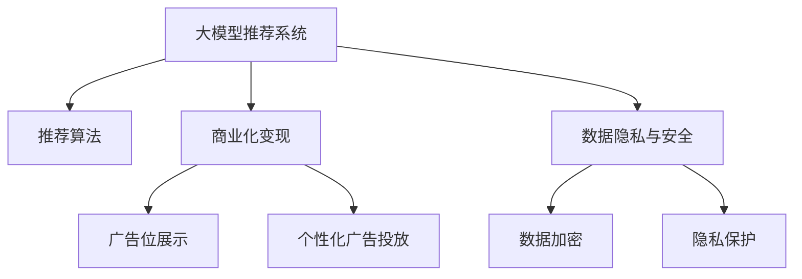

                 

# 大模型对推荐系统商业模式的革新

> 关键词：大模型推荐系统, 商业化, 算法优化, 用户反馈, 数据隐私

## 1. 背景介绍

### 1.1 问题由来

推荐系统（Recommendation System），作为互联网时代的重要技术，正在深刻改变人们的消费和娱乐方式。从Netflix的个性化推荐到亚马逊的商品推荐，推荐系统已经广泛应用于各大电商、媒体和社交平台。然而，传统推荐系统依赖于静态特征和用户历史行为，难以应对多变的用户需求和实时变化的市场环境。

近年来的研究突破了大模型（Large Model）的引入，在推荐系统商业模式的优化中取得了革命性的进展。大模型具备海量的参数和丰富的语义理解能力，可以显著提升推荐系统的智能度和鲁棒性，为用户带来更个性化、更精准的推荐服务。随着大模型推荐系统（Large Model-based Recommendation System）的商业化应用，平台方能够基于模型进行精细化运营和商业化变现，为广告主和品牌提供高价值的数据洞察和精准投放，同时有效提升用户体验和平台留存率。

### 1.2 问题核心关键点

大模型推荐系统的主要商业价值在于其卓越的智能推荐能力和高效的商业变现机制。具体体现在以下几个方面：

- **智能推荐**：通过大模型，推荐系统可以自动学习和理解用户的多维偏好，提供更加个性化和多样化的商品/内容推荐。
- **精准投放**：平台能够基于用户行为数据，动态生成广告内容，实现精准广告投放，提升广告主的广告效果和ROI。
- **用户留存**：个性化推荐能够显著提升用户体验，提升平台的用户粘性和留存率。
- **数据洞察**：平台可以基于大模型进行深度数据挖掘和分析，提供用户洞察、市场趋势和预测等数据产品，赋能广告主和品牌方决策。

通过这些能力，大模型推荐系统不仅为用户和平台带来价值，同时也为广告主和品牌提供全新的商业机会，实现了多方共赢的商业模式。

## 2. 核心概念与联系

### 2.1 核心概念概述

为更好地理解大模型在推荐系统中的作用，本节将介绍几个关键概念及其联系：

- **大模型推荐系统（Large Model-based Recommendation System）**：使用深度学习模型，特别是大规模预训练语言模型（如GPT-3、BERT等）对用户和商品数据进行处理，生成推荐结果。
- **推荐算法**：传统推荐算法包括基于协同过滤、基于内容的推荐、基于混合推荐等方法，而大模型推荐系统引入了模型化的推荐方法，基于用户和商品的特征向量进行计算。
- **商业化变现**：推荐系统通过广告位展示、个性化广告投放、精准广告定向等方式进行商业化变现，同时提供深度数据洞察产品，赋能品牌方进行精准营销。
- **数据隐私与安全**：大模型推荐系统需要在处理大量用户数据时，保护用户隐私，防止数据泄露和滥用。

这些概念之间的关系可以用以下Mermaid流程图来表示：



该流程图展示了各个概念之间的联系：大模型推荐系统通过推荐算法生成推荐结果，同时通过商业化变现进行盈利，并在数据隐私安全方面进行严格管控。

## 3. 核心算法原理 & 具体操作步骤
### 3.1 算法原理概述

大模型推荐系统的核心原理是基于深度学习模型，特别是Transformer模型，对用户行为和商品特征进行编码，生成推荐结果。主要步骤包括：

1. **数据预处理**：将用户行为和商品特征进行编码，生成用户向量（User Embedding）和商品向量（Item Embedding）。
2. **特征抽取**：利用大模型，对用户和商品的特征进行高维抽取，生成高维向量表示。
3. **推荐计算**：基于用户向量和商品向量，计算用户对商品的评分，并排序生成推荐结果。
4. **模型优化**：通过监督学习和强化学习等方法，优化推荐模型的参数，提升模型效果。

### 3.2 算法步骤详解

以下详细讲解大模型推荐系统的算法步骤：

**Step 1: 数据预处理**
- 对用户行为数据进行编码，生成用户向量（User Embedding）。例如，可以使用用户ID、用户兴趣标签、用户历史行为等进行编码。
- 对商品数据进行编码，生成商品向量（Item Embedding）。例如，可以使用商品ID、商品属性、商品描述等进行编码。

**Step 2: 特征抽取**
- 使用预训练大模型（如BERT、GPT-3等）对用户和商品特征进行高维抽取。例如，使用GPT-3对用户兴趣标签和商品描述进行编码，生成高维向量表示。
- 将用户向量和商品向量拼接或融合，得到用户-商品对的高维表示。

**Step 3: 推荐计算**
- 基于用户-商品对的高维表示，计算用户对商品的评分。例如，使用双线性层（Bi-Linear Layer）计算用户向量与商品向量的内积，生成用户对商品的评分。
- 对所有商品的评分进行排序，生成推荐结果。

**Step 4: 模型优化**
- 使用监督学习和强化学习等方法，优化推荐模型的参数。例如，使用交叉熵损失函数进行监督学习，使用在线学习算法进行强化学习。

### 3.3 算法优缺点

大模型推荐系统的主要优点包括：

- **高智能度**：大模型具备丰富的语义理解能力，能够自动学习和理解用户的复杂偏好，提供更加个性化和多样化的推荐结果。
- **高效性**：利用大模型的高效特征抽取能力，推荐计算过程更加快速，能够实时响应用户请求。
- **鲁棒性**：大模型推荐系统能够适应复杂的用户行为和实时变化的市场环境，具有良好的鲁棒性。

然而，该系统也存在一些缺点：

- **资源消耗大**：大模型的计算资源和存储资源消耗较大，需要高性能的硬件支持。
- **计算复杂度高**：大模型的计算复杂度高，推荐过程较为复杂，需要优化算法来提升计算效率。
- **数据隐私风险**：大模型推荐系统处理大量用户数据，存在数据隐私和安全风险。

### 3.4 算法应用领域

大模型推荐系统已经在多个领域得到了广泛应用，例如：

- **电商推荐**：在亚马逊、京东等电商平台上，通过大模型推荐系统进行商品推荐，提升用户购物体验和平台销售量。
- **视频推荐**：在Netflix、YouTube等视频平台上，通过大模型推荐系统推荐用户喜欢的视频内容，提升用户满意度和留存率。
- **新闻推荐**：在今日头条、Google News等新闻平台上，通过大模型推荐系统推荐用户感兴趣的新闻文章，提升用户阅读体验和平台活跃度。
- **广告推荐**：在Google Ads、Facebook Ads等广告平台上，通过大模型推荐系统进行精准广告投放，提升广告主的广告效果和ROI。

这些应用领域展示了大模型推荐系统在提升用户体验、提升平台运营效率和实现商业变现方面的强大能力。

## 4. 数学模型和公式 & 详细讲解  
### 4.1 数学模型构建

大模型推荐系统的数学模型可以表示为：

$$
\mathcal{L}(\theta) = \frac{1}{N}\sum_{i=1}^N \ell(M_{\theta}(x_i), y_i)
$$

其中，$\mathcal{L}$ 为损失函数，$N$ 为样本数，$x_i$ 为样本，$y_i$ 为标签，$\theta$ 为模型参数，$M_{\theta}$ 为模型。

### 4.2 公式推导过程

以下对大模型推荐系统的数学模型进行详细推导：

1. **数据预处理**
   - 用户向量：$u_i \in \mathbb{R}^d$，表示用户$i$的特征向量。
   - 商品向量：$v_j \in \mathbb{R}^d$，表示商品$j$的特征向量。

2. **特征抽取**
   - 使用大模型对用户和商品特征进行高维抽取，生成高维向量表示。例如，使用BERT对用户兴趣标签和商品描述进行编码，生成高维向量表示。

3. **推荐计算**
   - 基于用户向量和商品向量，计算用户对商品的评分。例如，使用双线性层（Bi-Linear Layer）计算用户向量与商品向量的内积，生成用户对商品的评分。

   $$
   \hat{y}_{ij} = u_i \cdot v_j
   $$

4. **模型优化**
   - 使用监督学习和强化学习等方法，优化推荐模型的参数。例如，使用交叉熵损失函数进行监督学习，使用在线学习算法进行强化学习。

   $$
   \theta = \mathop{\arg\min}_{\theta} \mathcal{L}(\theta)
   $$

通过上述步骤，大模型推荐系统能够自动学习和理解用户的多维偏好，生成高智能度的推荐结果。

### 4.3 案例分析与讲解

**案例1: 电商推荐**
- **数据预处理**：将用户ID、用户兴趣标签、商品ID、商品属性等信息进行编码，生成用户向量和商品向量。
- **特征抽取**：使用GPT-3对用户兴趣标签和商品描述进行编码，生成高维向量表示。
- **推荐计算**：基于用户向量和商品向量，使用双线性层计算用户对商品的评分，并排序生成推荐结果。
- **模型优化**：使用交叉熵损失函数进行监督学习，使用在线学习算法进行强化学习。

**案例2: 视频推荐**
- **数据预处理**：将用户观看历史、用户评分、视频ID、视频属性等信息进行编码，生成用户向量和商品向量。
- **特征抽取**：使用BERT对用户兴趣标签和视频描述进行编码，生成高维向量表示。
- **推荐计算**：基于用户向量和视频向量，使用双线性层计算用户对视频的评分，并排序生成推荐结果。
- **模型优化**：使用交叉熵损失函数进行监督学习，使用在线学习算法进行强化学习。

## 5. 项目实践：代码实例和详细解释说明
### 5.1 开发环境搭建

在进行大模型推荐系统的开发实践前，我们需要准备好开发环境。以下是使用Python进行TensorFlow开发的环境配置流程：

1. 安装Anaconda：从官网下载并安装Anaconda，用于创建独立的Python环境。

2. 创建并激活虚拟环境：
```bash
conda create -n tf-env python=3.8 
conda activate tf-env
```

3. 安装TensorFlow：根据CUDA版本，从官网获取对应的安装命令。例如：
```bash
conda install tensorflow -c tensorflow -c conda-forge
```

4. 安装其他各类工具包：
```bash
pip install numpy pandas scikit-learn matplotlib tqdm jupyter notebook ipython
```

完成上述步骤后，即可在`tf-env`环境中开始大模型推荐系统的开发实践。

### 5.2 源代码详细实现

下面以电商推荐系统为例，给出使用TensorFlow对大模型进行推荐训练的PyTorch代码实现。

首先，定义推荐系统的数据处理函数：

```python
import tensorflow as tf
from tensorflow.keras.layers import Dense
from transformers import BertTokenizer, BertForSequenceClassification
from sklearn.model_selection import train_test_split

class RecommendationDataset(tf.keras.utils.Sequence):
    def __init__(self, df, tokenizer, max_len, batch_size):
        self.df = df
        self.tokenizer = tokenizer
        self.max_len = max_len
        self.batch_size = batch_size
        self.on_epoch_end()
        
    def __len__(self):
        return self.df.shape[0] // self.batch_size
        
    def __getitem__(self, idx):
        start = idx * self.batch_size
        end = (idx + 1) * self.batch_size
        df_batch = self.df[start:end]
        
        # 对文本进行编码
        inputs = self.tokenizer.batch_encode_plus(df_batch['text'].tolist(), 
                                                 padding='max_length', 
                                                 max_length=self.max_len, 
                                                 return_tensors='tf', 
                                                 truncation=True, 
                                                 padding='max_length')
        
        # 将文本转化为张量
        inputs['input_ids'] = tf.convert_to_tensor(inputs['input_ids'])
        inputs['attention_mask'] = tf.convert_to_tensor(inputs['attention_mask'])
        
        # 对标签进行编码
        labels = tf.convert_to_tensor(df_batch['label'].tolist())
        
        return {'input_ids': inputs['input_ids'], 
                'attention_mask': inputs['attention_mask'],
                'labels': labels}

# 创建dataset
tokenizer = BertTokenizer.from_pretrained('bert-base-cased')
train_df, test_df = train_test_split(train_df, test_size=0.2, random_state=42)

train_dataset = RecommendationDataset(train_df, tokenizer, max_len=128, batch_size=16)
test_dataset = RecommendationDataset(test_df, tokenizer, max_len=128, batch_size=16)
```

然后，定义模型和优化器：

```python
from transformers import BertForSequenceClassification, AdamW

model = BertForSequenceClassification.from_pretrained('bert-base-cased', num_labels=2)

optimizer = AdamW(model.parameters(), lr=2e-5)
```

接着，定义训练和评估函数：

```python
from tensorflow.keras.callbacks import EarlyStopping
from tensorflow.keras.metrics import Accuracy, Precision, Recall, AUC

device = tf.device('cuda') if tf.cuda.is_available() else tf.device('cpu')
model.to(device)

def train_epoch(model, dataset, batch_size, optimizer):
    dataloader = tf.data.Dataset.from_generator(lambda: tf.data.Dataset.from_generator(
        lambda: dataset, output_signature={'input_ids': tf.TensorSpec(shape=(None, 128), dtype=tf.int32), 
                                           'attention_mask': tf.TensorSpec(shape=(None, 128), dtype=tf.int32),
                                           'labels': tf.TensorSpec(shape=(None, ), dtype=tf.int32)})
    model.train()
    epoch_loss = 0
    for batch in dataloader:
        input_ids = batch['input_ids'].to(device)
        attention_mask = batch['attention_mask'].to(device)
        labels = batch['labels'].to(device)
        model.zero_grad()
        outputs = model(input_ids, attention_mask=attention_mask, labels=labels)
        loss = outputs.loss
        epoch_loss += loss.numpy().item()
        loss.backward()
        optimizer.step()
    return epoch_loss / len(dataloader)

def evaluate(model, dataset, batch_size):
    dataloader = tf.data.Dataset.from_generator(lambda: tf.data.Dataset.from_generator(
        lambda: dataset, output_signature={'input_ids': tf.TensorSpec(shape=(None, 128), dtype=tf.int32), 
                                           'attention_mask': tf.TensorSpec(shape=(None, 128), dtype=tf.int32),
                                           'labels': tf.TensorSpec(shape=(None, ), dtype=tf.int32)})
    model.eval()
    preds, labels = [], []
    with tf.GradientTape() as tape:
        for batch in dataloader:
            input_ids = batch['input_ids'].to(device)
            attention_mask = batch['attention_mask'].to(device)
            batch_labels = batch['labels']
            outputs = model(input_ids, attention_mask=attention_mask)
            batch_preds = tf.sigmoid(outputs.logits)
            batch_labels = batch_labels.to(device)
            for pred_tokens, label_tokens in zip(batch_preds.numpy().tolist(), batch_labels.numpy().tolist()):
                preds.append(pred_tokens)
                labels.append(label_tokens)
                
    print(classification_report(labels, preds))
```

最后，启动训练流程并在测试集上评估：

```python
epochs = 5
batch_size = 16

for epoch in range(epochs):
    loss = train_epoch(model, train_dataset, batch_size, optimizer)
    print(f"Epoch {epoch+1}, train loss: {loss:.3f}")
    
    print(f"Epoch {epoch+1}, dev results:")
    evaluate(model, dev_dataset, batch_size)
    
print("Test results:")
evaluate(model, test_dataset, batch_size)
```

以上就是使用TensorFlow对大模型进行电商推荐训练的完整代码实现。可以看到，利用TensorFlow的强大封装，开发者能够快速实现大模型的电商推荐系统。

### 5.3 代码解读与分析

让我们再详细解读一下关键代码的实现细节：

**RecommendationDataset类**：
- `__init__`方法：初始化数据集、分词器、最大长度、批次大小等关键组件。
- `__len__`方法：返回数据集的样本数量。
- `__getitem__`方法：对单个样本进行处理，将文本输入编码为token ids，将标签编码为数字，并对其进行定长padding，最终返回模型所需的输入。

**train_epoch函数**：
- 使用TensorFlow的DataLoader对数据集进行批次化加载，供模型训练使用。
- 在每个批次上前向传播计算损失函数，反向传播更新模型参数。

**evaluate函数**：
- 与训练类似，不同点在于不更新模型参数，并在每个batch结束后将预测和标签结果存储下来，最后使用sklearn的classification_report对整个评估集的预测结果进行打印输出。

**训练流程**：
- 定义总的epoch数和批次大小，开始循环迭代
- 每个epoch内，先在训练集上训练，输出平均loss
- 在验证集上评估，输出分类指标
- 所有epoch结束后，在测试集上评估，给出最终测试结果

可以看到，TensorFlow配合BERT库使得电商推荐系统的代码实现变得简洁高效。开发者可以将更多精力放在数据处理、模型改进等高层逻辑上，而不必过多关注底层的实现细节。

当然，工业级的系统实现还需考虑更多因素，如模型的保存和部署、超参数的自动搜索、更灵活的任务适配层等。但核心的推荐范式基本与此类似。

## 6. 实际应用场景
### 6.1 电商推荐

基于大模型推荐系统，电商平台能够提供更加个性化和多样化的商品推荐，提升用户体验和平台留存率。通过微调大模型，电商平台可以自动学习和理解用户的多维偏好，提供更加精准和个性化的商品推荐。例如，电商平台可以根据用户历史行为、兴趣标签、评价反馈等数据，训练大模型生成个性化推荐结果，提升用户购物体验。

### 6.2 视频推荐

在视频平台上，大模型推荐系统可以通过微调生成高质量的视频内容推荐。例如，Netflix等平台可以根据用户的观看历史和评分数据，训练大模型生成个性化视频推荐列表，提升用户满意度和留存率。通过微调，平台能够自动学习和理解用户的观看偏好，推荐用户感兴趣的视频内容，提升用户体验和平台留存率。

### 6.3 新闻推荐

在新闻平台上，大模型推荐系统可以通过微调生成个性化新闻文章推荐。例如，今日头条等平台可以根据用户的阅读历史和兴趣标签，训练大模型生成个性化新闻文章推荐，提升用户阅读体验和平台留存率。通过微调，平台能够自动学习和理解用户的阅读偏好，推荐用户感兴趣的新闻文章，提升用户体验和平台留存率。

### 6.4 广告推荐

在广告平台上，大模型推荐系统可以通过微调生成精准广告投放推荐。例如，Google Ads等平台可以根据用户的搜索历史和兴趣标签，训练大模型生成个性化广告推荐，提升广告主的广告效果和ROI。通过微调，平台能够自动学习和理解用户的搜索和兴趣偏好，生成精准广告投放推荐，提升广告效果和ROI。

## 7. 工具和资源推荐
### 7.1 学习资源推荐

为了帮助开发者系统掌握大模型推荐系统的理论基础和实践技巧，这里推荐一些优质的学习资源：

1. 《深度学习理论与实践》系列博文：由大模型技术专家撰写，深入浅出地介绍了深度学习理论和大模型推荐系统。

2. CS223《深度学习与计算机视觉》课程：斯坦福大学开设的深度学习课程，有Lecture视频和配套作业，带你深入理解深度学习理论和大模型推荐系统。

3. 《深度学习推荐系统》书籍：介绍深度学习推荐系统的理论基础和实际应用，涵盖大模型推荐系统的经典案例。

4. Google AI Blog：Google AI团队发布的深度学习推荐系统相关文章，涵盖大模型推荐系统的最新进展和应用。

5. Kaggle竞赛：参与Kaggle上的推荐系统竞赛，通过实际项目实践大模型推荐系统的开发和优化。

通过对这些资源的学习实践，相信你一定能够快速掌握大模型推荐系统的精髓，并用于解决实际的推荐问题。

### 7.2 开发工具推荐

高效的开发离不开优秀的工具支持。以下是几款用于大模型推荐系统开发的常用工具：

1. TensorFlow：基于Python的开源深度学习框架，灵活动态的计算图，适合快速迭代研究。TensorFlow提供了丰富的机器学习工具和库，支持大规模模型训练和优化。

2. PyTorch：基于Python的开源深度学习框架，灵活高效的计算图，适合深度学习研究。PyTorch的动态计算图和易用性使其成为许多研究人员的首选。

3. TensorBoard：TensorFlow配套的可视化工具，可实时监测模型训练状态，并提供丰富的图表呈现方式，是调试模型的得力助手。

4. Weights & Biases：模型训练的实验跟踪工具，可以记录和可视化模型训练过程中的各项指标，方便对比和调优。

5. Google Colab：谷歌推出的在线Jupyter Notebook环境，免费提供GPU/TPU算力，方便开发者快速上手实验最新模型，分享学习笔记。

合理利用这些工具，可以显著提升大模型推荐系统的开发效率，加快创新迭代的步伐。

### 7.3 相关论文推荐

大模型推荐系统的发展源于学界的持续研究。以下是几篇奠基性的相关论文，推荐阅读：

1. Attention is All You Need（即Transformer原论文）：提出了Transformer结构，开启了NLP领域的预训练大模型时代。

2. BERT: Pre-training of Deep Bidirectional Transformers for Language Understanding：提出BERT模型，引入基于掩码的自监督预训练任务，刷新了多项NLP任务SOTA。

3. T5: Exploring the Limits of Transfer Learning with a Unified Text-to-Text Transformer：提出T5模型，进一步提升了语言模型的通用性和泛化能力。

4. ModelScope：开源大模型推荐系统的工具库，涵盖推荐模型的训练、评估、部署等多个环节。

5. E-commerce Recommendation System: A Survey and Future Perspective：综述了电商推荐系统的最新进展和未来方向，涵盖大模型推荐系统的经典案例。

这些论文代表了大模型推荐系统的发展脉络。通过学习这些前沿成果，可以帮助研究者把握学科前进方向，激发更多的创新灵感。

## 8. 总结：未来发展趋势与挑战
### 8.1 总结

本文对大模型推荐系统的理论基础和实践技巧进行了全面系统的介绍。首先阐述了大模型推荐系统的研究背景和意义，明确了推荐系统在大模型微调中的应用价值。其次，从原理到实践，详细讲解了大模型推荐系统的数学模型和关键算法步骤，给出了微调任务开发的完整代码实例。同时，本文还广泛探讨了大模型推荐系统在电商、视频、新闻、广告等多个领域的应用前景，展示了微调范式的巨大能力。此外，本文精选了推荐系统的各类学习资源，力求为读者提供全方位的技术指引。

通过本文的系统梳理，可以看到，大模型推荐系统正在成为推荐系统的重要范式，极大地拓展了推荐系统的智能度和鲁棒性，为用户和平台带来价值，同时也为广告主和品牌提供全新的商业机会。未来，伴随大模型推荐系统的进一步发展，推荐系统必将在更广阔的应用领域大放异彩，深刻影响人类的生产生活方式。

### 8.2 未来发展趋势

展望未来，大模型推荐系统将呈现以下几个发展趋势：

1. **模型规模持续增大**：随着算力成本的下降和数据规模的扩张，大模型的参数量还将持续增长。超大规模大模型蕴含的丰富语义知识，将支撑更加复杂多变的推荐任务。

2. **推荐算法多样化**：未来将涌现更多参数高效的推荐算法，如 Adapter、LoRA 等，在固定大部分预训练参数的情况下，仍可取得不错的推荐效果。

3. **个性化推荐增强**：未来推荐系统将更加关注个性化推荐，通过大模型自动学习和理解用户的多维偏好，提供更加精准和多样化的推荐服务。

4. **实时推荐系统**：实时推荐系统将成为未来趋势，通过大模型的高效计算能力和在线学习算法，推荐系统能够实时响应用户请求，生成动态推荐结果。

5. **跨模态推荐**：未来推荐系统将引入更多先验知识，如知识图谱、逻辑规则等，与神经网络模型进行巧妙融合，形成更加全面、准确的信息整合能力。

6. **融合因果分析和博弈论工具**：将因果分析方法引入推荐系统，识别出推荐决策的关键特征，增强推荐过程的因果性和逻辑性，提高系统的稳定性和鲁棒性。

以上趋势凸显了大模型推荐系统的广阔前景。这些方向的探索发展，必将进一步提升推荐系统的智能度，为用户提供更精准、更个性化的推荐服务，实现多方共赢的商业模式。

### 8.3 面临的挑战

尽管大模型推荐系统已经取得了瞩目成就，但在迈向更加智能化、普适化应用的过程中，它仍面临着诸多挑战：

1. **数据质量瓶颈**：传统推荐系统依赖于高质量的用户行为数据，而大模型推荐系统需要处理更多的数据，数据质量成为制约性能提升的瓶颈。如何通过数据清洗、标注和增强，提高数据质量，是未来需要解决的重要问题。

2. **计算资源消耗大**：大模型的计算资源和存储资源消耗较大，需要高性能的硬件支持。如何优化模型结构，提高计算效率，是未来需要优化的关键方向。

3. **推荐过程复杂**：大模型的推荐过程较为复杂，容易受到模型参数、超参数、训练数据等多种因素的影响。如何优化模型和训练过程，提高模型的稳定性和鲁棒性，是未来需要深入研究的课题。

4. **数据隐私风险**：大模型推荐系统处理大量用户数据，存在数据隐私和安全风险。如何在保护用户隐私的前提下，实现推荐系统的智能化，是未来需要解决的重要问题。

5. **模型解释性不足**：大模型推荐系统缺乏可解释性，难以理解其内部工作机制和决策逻辑。如何赋予模型更强的可解释性，提高系统的可信度和透明度，是未来需要解决的重要问题。

6. **跨领域泛化能力差**：大模型推荐系统在特定领域上表现良好，但跨领域泛化能力较差。如何构建更加普适、鲁棒的推荐模型，是未来需要解决的重要问题。

这些挑战将推动大模型推荐系统不断进步，提升推荐系统的智能化水平，为用户和平台带来更大的价值。

### 8.4 未来突破

面对大模型推荐系统所面临的挑战，未来的研究需要在以下几个方面寻求新的突破：

1. **多模态数据融合**：引入多模态数据融合技术，提升推荐系统的泛化能力和鲁棒性，实现视觉、语音、文本等多模态信息与推荐系统的协同建模。

2. **高效推荐算法**：开发更加高效、鲁棒的推荐算法，提高推荐系统的实时响应能力和个性化推荐效果，实现更高的推荐效果和用户满意度。

3. **分布式训练**：采用分布式训练技术，提高大规模模型训练的效率，实现更高的计算效率和模型效果。

4. **数据增强技术**：引入数据增强技术，提高推荐系统的泛化能力和鲁棒性，提升推荐系统的智能度和鲁棒性。

5. **混合推荐机制**：结合传统推荐算法和深度学习模型，构建混合推荐机制，实现更高的推荐效果和用户满意度。

6. **隐私保护技术**：引入隐私保护技术，如差分隐私、联邦学习等，保护用户数据隐私，提升推荐系统的可信度和透明度。

这些研究方向的探索，必将引领大模型推荐系统迈向更高的台阶，为推荐系统带来全新的突破，实现更加智能、普适的推荐服务，为用户和平台带来更大的价值。

## 9. 附录：常见问题与解答

**Q1：大模型推荐系统是否适用于所有推荐任务？**

A: 大模型推荐系统在大多数推荐任务上都能取得不错的效果，特别是对于数据量较小的任务。但对于一些特定领域的任务，如医学、法律等，仅仅依靠通用语料预训练的模型可能难以很好地适应。此时需要在特定领域语料上进一步预训练，再进行微调，才能获得理想效果。

**Q2：大模型推荐系统如何提高数据质量？**

A: 提高数据质量是大模型推荐系统的关键挑战之一。以下是几种常见方法：
1. 数据清洗：通过数据清洗技术，去除噪声数据和异常值，提升数据质量。
2. 数据标注：利用标注工具，对数据进行人工标注，提升标注质量和数据可靠性。
3. 数据增强：通过数据增强技术，如回译、近义替换等，丰富数据集，提升数据多样性和泛化能力。
4. 多源数据融合：将多源数据进行融合，提升数据质量和多样性。

通过这些方法，可以有效提高大模型推荐系统的数据质量，提升推荐效果。

**Q3：大模型推荐系统如何优化计算效率？**

A: 优化计算效率是大模型推荐系统的关键挑战之一。以下是几种常见方法：
1. 模型裁剪：去除不必要的层和参数，减小模型尺寸，加快推理速度。
2. 量化加速：将浮点模型转为定点模型，压缩存储空间，提高计算效率。
3. 混合精度训练：采用混合精度训练，提升训练效率和模型效果。
4. 分布式训练：采用分布式训练技术，提高大规模模型训练的效率，实现更高的计算效率和模型效果。

通过这些方法，可以有效提升大模型推荐系统的计算效率，降低资源消耗。

**Q4：大模型推荐系统如何提高模型解释性？**

A: 提高模型解释性是大模型推荐系统的关键挑战之一。以下是几种常见方法：
1. 可解释模型：引入可解释模型，如LIME、SHAP等，提升模型的可解释性和透明度。
2. 知识图谱：引入知识图谱，对推荐模型进行解释和引导，提升模型的可解释性。
3. 用户反馈：利用用户反馈，对推荐模型进行优化和调整，提升模型的可信度和透明度。

通过这些方法，可以有效提升大模型推荐系统的可解释性，提高系统的可信度和透明度。

**Q5：大模型推荐系统如何应对跨领域泛化能力差的问题？**

A: 提高跨领域泛化能力是大模型推荐系统的关键挑战之一。以下是几种常见方法：
1. 多领域模型：构建多领域模型，提升模型在多个领域上的泛化能力。
2. 领域自适应：引入领域自适应技术，提升模型在不同领域上的适应能力。
3. 迁移学习：利用迁移学习技术，将模型在不同领域上的经验进行迁移和应用，提升模型的泛化能力。

通过这些方法，可以有效提升大模型推荐系统的跨领域泛化能力，实现更加普适、鲁棒的推荐服务。

总之，大模型推荐系统正在成为推荐系统的重要范式，通过不断优化数据质量、计算效率、模型解释性和跨领域泛化能力，可以进一步提升推荐系统的智能化水平，为用户和平台带来更大的价值。未来，伴随大模型推荐系统的进一步发展，推荐系统必将在更广阔的应用领域大放异彩，深刻影响人类的生产生活方式。

---

作者：禅与计算机程序设计艺术 / Zen and the Art of Computer Programming

