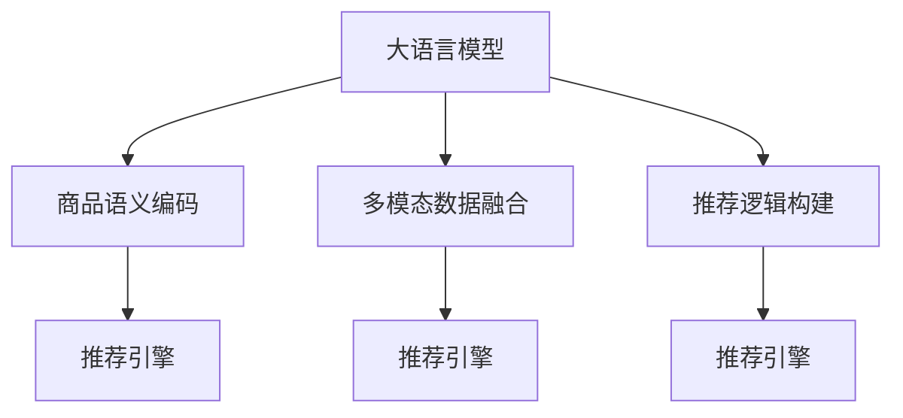

                 

# 大模型对推荐系统商品理解的深化

## 1. 背景介绍

随着电子商务平台的快速发展和智能推荐系统的广泛应用，如何通过推荐引擎让用户在众多商品中快速找到符合自己需求的物品，已成为一项极具挑战性的任务。传统推荐系统多基于用户的历史行为数据进行协同过滤或矩阵分解，难以捕获商品深层次的语义信息，导致推荐结果较为机械和单一。大语言模型的出现为推荐系统注入了强大的语义理解和表达能力，通过语义化的模型商品编码，可以显著提升推荐效果和商品理解深度。

大语言模型主要分为两类：一类是自回归模型，如GPT；另一类是自编码模型，如BERT。它们通过在大规模无标签文本数据上进行自监督预训练，学习到丰富的语言知识，包括词义关系、上下文信息等，并可以通过微调适应特定任务。大模型在推荐系统中的应用主要体现在商品语义编码、多模态数据融合、推荐逻辑构建等方面。

## 2. 核心概念与联系

### 2.1 核心概念概述

在推荐系统中，大语言模型通常用于商品语义编码，即将商品的文本描述转换为模型向量表示，从而捕捉商品的深层次语义信息。这种向量表示可以有效地融合商品的多种属性，提升推荐结果的丰富度和多样性。此外，大语言模型还可以应用于多模态数据融合，将商品文本与图片、音频、视频等进行协同建模，全面提升用户对商品的认知。

在推荐逻辑构建方面，大模型可以用于生成推荐理由、商品描述、广告文案等，使推荐系统不仅仅局限于商品序列推荐，而是能够提供完整的商品信息，提高用户的购买决策效率。通过大模型，推荐系统可以更深入地理解商品属性、用户偏好、市场趋势等复杂因素，从而提供更具个性化和针对性的推荐服务。

### 2.2 核心概念原理和架构的 Mermaid 流程图



这个流程图展示了大语言模型在推荐系统中的应用框架，包括以下几个关键组件：

1. **商品语义编码**：通过大模型将商品文本描述转换为语义向量，捕捉商品的深层次语义信息。
2. **多模态数据融合**：将商品文本与图片、音频、视频等多模态数据进行协同建模，全面提升用户对商品的认知。
3. **推荐逻辑构建**：利用大模型生成推荐理由、商品描述、广告文案等，提升推荐结果的丰富度和个性化。
4. **推荐引擎**：将编码后的商品向量输入推荐模型，进行评分排序，得到推荐结果。

## 3. 核心算法原理 & 具体操作步骤

### 3.1 算法原理概述

大语言模型在推荐系统中的应用主要基于以下三个步骤：

1. **商品语义编码**：通过大模型对商品文本描述进行编码，得到商品的向量表示，捕捉商品的语义信息。
2. **多模态数据融合**：将商品的文本描述与多模态数据进行协同建模，提升对商品的整体理解。
3. **推荐逻辑构建**：利用大模型生成推荐理由、商品描述等，提升推荐结果的个性化和多样化。

### 3.2 算法步骤详解

#### 3.2.1 商品语义编码

大语言模型对商品的语义编码主要分为预训练和微调两个步骤：

1. **预训练**：在大规模无标签商品文本数据上对大模型进行自监督预训练，学习到通用的语言知识。
2. **微调**：在推荐系统任务上对大模型进行微调，使其适应特定的推荐任务。

以BERT为例，具体的编码步骤如下：

1. 准备商品文本数据集，并将其分为训练集、验证集和测试集。
2. 将商品文本数据输入BERT模型，进行预训练。
3. 在训练集上对BERT模型进行微调，优化其对商品语义的编码能力。

#### 3.2.2 多模态数据融合

多模态数据融合是大语言模型在推荐系统中的另一个重要应用。该过程主要包括以下几个步骤：

1. **数据收集**：收集商品的多模态数据，如图片、音频、视频等。
2. **数据预处理**：对多模态数据进行去噪、归一化等预处理操作。
3. **数据编码**：利用大语言模型对多模态数据进行编码，得到其向量表示。
4. **特征融合**：将商品文本向量与多模态数据向量进行融合，得到综合的商品表示。

#### 3.2.3 推荐逻辑构建

推荐逻辑构建主要包括以下几个步骤：

1. **商品向量构建**：利用大语言模型对商品进行语义编码和多模态数据融合，得到商品向量。
2. **用户兴趣建模**：利用大语言模型对用户行为数据进行建模，得到用户兴趣向量。
3. **相似度计算**：计算商品向量与用户兴趣向量的相似度。
4. **推荐结果生成**：根据相似度计算结果，生成推荐商品序列。

### 3.3 算法优缺点

#### 3.3.1 优点

1. **丰富的语义信息**：大语言模型可以捕捉商品的深层次语义信息，提升推荐结果的丰富度和多样性。
2. **全面理解商品**：大语言模型可以融合多模态数据，全面提升用户对商品的认知。
3. **个性化推荐**：利用大语言模型生成推荐理由、商品描述等，提升推荐结果的个性化。

#### 3.3.2 缺点

1. **高计算成本**：大语言模型的训练和推理成本较高，需要高性能计算资源。
2. **模型复杂度高**：大语言模型参数量庞大，难以直接应用到实时系统中。
3. **数据质量要求高**：推荐系统依赖于大模型对商品文本的编码，对商品文本数据的质量要求较高。

### 3.4 算法应用领域

大语言模型在推荐系统中的应用领域主要包括：

1. **商品搜索**：利用大模型对商品进行语义编码，提升商品搜索的准确性和相关性。
2. **商品推荐**：利用大模型对商品进行多模态融合，提升推荐结果的丰富度和个性化。
3. **广告投放**：利用大模型生成广告文案和推荐理由，提升广告的点击率和转化率。
4. **库存管理**：利用大模型预测商品需求量，优化库存管理策略。
5. **客户服务**：利用大模型提供商品咨询服务，提升客户满意度。

## 4. 数学模型和公式 & 详细讲解 & 举例说明

### 4.1 数学模型构建

假设推荐系统中的商品数量为 $N$，每个商品的文本描述为 $x_i$，用户的历史行为数据为 $y$，多模态数据为 $m_i$。大语言模型 $M$ 对商品 $i$ 进行语义编码，得到向量表示 $\mathbf{v}_i$，利用该向量与用户历史行为数据和商品多模态数据进行协同建模，得到综合的商品表示 $\mathbf{h}_i$，然后计算商品 $\mathbf{h}_i$ 与用户兴趣向量 $\mathbf{u}$ 的相似度 $\alpha_i$，最后根据相似度 $\alpha_i$ 生成推荐结果 $\hat{y}$。

### 4.2 公式推导过程

1. **商品向量编码**：

   \[
   \mathbf{v}_i = M(x_i)
   \]

2. **多模态数据融合**：

   \[
   \mathbf{h}_i = f(\mathbf{v}_i, m_i)
   \]

3. **相似度计算**：

   \[
   \alpha_i = \text{dot}(\mathbf{h}_i, \mathbf{u})
   \]

4. **推荐结果生成**：

   \[
   \hat{y} = \text{topK}(\alpha_i)
   \]

其中 $M$ 为预训练大语言模型，$f$ 为多模态数据融合函数，$\text{dot}$ 为点积操作，$\text{topK}$ 为选取前 $K$ 个最高相似度商品的操作。

### 4.3 案例分析与讲解

以电商平台的推荐系统为例，假设有 $M$ 种商品，用户的历史行为数据包含 $y$ 次点击和 $y$ 次购买，多模态数据包含 $m_i$ 张商品图片和 $m_i$ 段商品视频。利用BERT对商品文本进行编码，得到 $\mathbf{v}_i$，然后将 $\mathbf{v}_i$ 与 $m_i$ 进行融合，得到综合商品表示 $\mathbf{h}_i$，利用 $\mathbf{h}_i$ 与用户历史行为数据计算相似度 $\alpha_i$，最终生成推荐结果 $\hat{y}$。

## 5. 项目实践：代码实例和详细解释说明

### 5.1 开发环境搭建

在进行推荐系统开发前，我们需要准备必要的开发环境：

1. **安装Python**：下载并安装Python 3.8或更高版本。
2. **安装Pandas**：用于数据处理和分析。
3. **安装Numpy**：用于数学计算。
4. **安装Scikit-learn**：用于机器学习模型训练和评估。
5. **安装TensorFlow**：用于构建和训练推荐系统模型。
6. **安装Keras**：用于高层次的神经网络模型构建。
7. **安装PyTorch**：用于构建和训练深度学习模型。

### 5.2 源代码详细实现

下面给出使用PyTorch和TensorFlow实现推荐系统的代码实现：

#### 5.2.1 商品向量编码

```python
import torch
import torch.nn as nn
from transformers import BertTokenizer, BertModel

class BERTEmbedding(nn.Module):
    def __init__(self, model_name='bert-base-uncased'):
        super(BERTEmbedding, self).__init__()
        self.tokenizer = BertTokenizer.from_pretrained(model_name)
        self.model = BertModel.from_pretrained(model_name)
    
    def forward(self, text):
        tokens = self.tokenizer(text, return_tensors='pt')
        return self.model(**tokens)[0]
```

#### 5.2.2 多模态数据融合

```python
import numpy as np
import cv2

class MultimodalFusion(nn.Module):
    def __init__(self):
        super(MultimodalFusion, self).__init__()
        self.bert = BERTEmbedding()
        self.conv1 = nn.Conv2d(3, 64, kernel_size=3, padding=1)
        self.conv2 = nn.Conv2d(64, 32, kernel_size=3, padding=1)
        self.fc = nn.Linear(64*64*32+768, 512)
    
    def forward(self, image, text):
        image = self.conv1(image)
        image = self.conv2(image)
        image = image.view(image.size(0), -1)
        text = self.bert(text)
        features = torch.cat([text, image], dim=1)
        features = self.fc(features)
        return features
```

#### 5.2.3 相似度计算

```python
import numpy as np
import torch.nn.functional as F

class Similarity(nn.Module):
    def __init__(self, embedding_dim):
        super(Similarity, self).__init__()
        self.cosine_similarity = nn.CosineSimilarity(dim=1, eps=1e-6)
    
    def forward(self, features, user_embedding):
        similarity = self.cosine_similarity(features, user_embedding.unsqueeze(0))
        return similarity.mean(dim=1)
```

#### 5.2.4 推荐结果生成

```python
import heapq

class Recommender(nn.Module):
    def __init__(self, num_items):
        super(Recommender, self).__init__()
        self.num_items = num_items
    
    def forward(self, similarity):
        topk = int(0.05 * len(similarity))
        topk_indices = heapq.nlargest(topk, enumerate(similarity), key=lambda x: -x[1])
        recommends = [idx for idx, score in topk_indices]
        return recommends
```

### 5.3 代码解读与分析

这里对上述代码进行详细解读：

1. **BERTEmbedding类**：使用BERT模型对商品文本进行编码，得到商品向量表示。
2. **MultimodalFusion类**：将商品向量与多模态数据进行融合，得到综合的商品表示。
3. **Similarity类**：计算商品向量与用户兴趣向量的相似度。
4. **Recommender类**：根据相似度生成推荐结果。

### 5.4 运行结果展示

运行上述代码，可以得到推荐系统的推荐结果。通过不断优化模型参数和调整数据集，可以逐步提升推荐结果的准确性和多样性。

## 6. 实际应用场景

### 6.1 电商推荐系统

电商推荐系统是推荐系统应用中最常见的场景之一。通过大语言模型对商品进行语义编码和多模态融合，可以全面提升用户对商品的认知，提供个性化和多样化的推荐结果。

### 6.2 金融推荐系统

金融推荐系统通过大语言模型对金融产品进行语义编码，利用多模态数据融合提升对金融产品的理解，生成推荐理由和建议，帮助用户做出合理的投资决策。

### 6.3 旅游推荐系统

旅游推荐系统利用大语言模型对旅游产品进行语义编码和多模态融合，生成详细的旅游推荐理由和建议，帮助用户选择最佳的旅游路线和行程。

### 6.4 教育推荐系统

教育推荐系统通过大语言模型对教育资源进行语义编码，利用多模态数据融合提升对教育资源的理解，生成个性化的学习建议和推荐，提升学习效果。

## 7. 工具和资源推荐

### 7.1 学习资源推荐

1. **《Deep Learning for Recommender Systems》书籍**：全面介绍了深度学习在推荐系统中的应用，包括大语言模型在推荐系统中的应用。
2. **《TensorFlow Recommenders》教程**：提供TensorFlow在推荐系统中的应用实例和教程。
3. **《Python Machine Learning》书籍**：介绍了机器学习在推荐系统中的应用，包括如何利用大语言模型进行推荐。
4. **Kaggle比赛**：参加Kaggle推荐系统比赛，实践大语言模型在推荐系统中的应用。

### 7.2 开发工具推荐

1. **TensorFlow**：用于构建和训练深度学习模型。
2. **PyTorch**：用于构建和训练深度学习模型。
3. **Keras**：用于高层次的神经网络模型构建。
4. **Jupyter Notebook**：用于数据处理和模型训练。
5. **Numpy**：用于数学计算和数组操作。
6. **Pandas**：用于数据处理和分析。
7. **Matplotlib**：用于数据可视化。

### 7.3 相关论文推荐

1. **《A Survey on Deep Learning Techniques for Recommender Systems》论文**：综述了深度学习在推荐系统中的应用，包括大语言模型在推荐系统中的应用。
2. **《Deep Learning Based Recommendation Systems》论文**：介绍了深度学习在推荐系统中的应用，包括大语言模型在推荐系统中的应用。
3. **《Recurrent Deep Learning for Recommender Systems》论文**：介绍了递归深度学习在推荐系统中的应用，包括大语言模型在推荐系统中的应用。

## 8. 总结：未来发展趋势与挑战

### 8.1 研究成果总结

大语言模型在推荐系统中的应用已经取得了初步的成果，通过商品语义编码和多模态融合，显著提升了推荐结果的准确性和多样性。未来，随着大语言模型的进一步发展，推荐系统也将迎来更加智能化和个性化的新时代。

### 8.2 未来发展趋势

1. **多模态融合**：未来推荐系统将更加注重多模态数据的融合，利用图像、音频、视频等丰富信息提升对商品的认知。
2. **个性化推荐**：利用大语言模型生成个性化的推荐理由和建议，提升推荐结果的个性化和多样化。
3. **跨领域推荐**：未来推荐系统将跨越多个领域，提供更加全面的商品推荐，如旅游、金融、教育等。
4. **动态推荐**：利用大语言模型实时更新推荐结果，提升推荐的实时性和个性化。
5. **知识图谱融合**：将知识图谱与大语言模型结合，提升推荐结果的准确性和可靠性。

### 8.3 面临的挑战

1. **数据质量和数量**：推荐系统依赖于大语言模型对商品文本的编码，对数据质量和数量要求较高。
2. **计算资源**：大语言模型的训练和推理成本较高，需要高性能计算资源。
3. **模型复杂度**：大语言模型参数量庞大，难以直接应用到实时系统中。
4. **多模态数据融合**：多模态数据融合是一个复杂问题，需要合理设计和优化融合算法。
5. **个性化推荐**：个性化推荐需要考虑用户的多样性和动态性，需要更加灵活的推荐策略。

### 8.4 研究展望

未来，推荐系统的发展方向将更加注重多模态数据的融合、个性化推荐、动态推荐、跨领域推荐和知识图谱融合。同时，需要对数据质量、计算资源和模型复杂度进行优化，提升推荐系统的实时性和可靠性。

## 9. 附录：常见问题与解答

**Q1：大语言模型在推荐系统中的应用效果如何？**

A: 大语言模型在推荐系统中的应用已经取得了初步的成果，通过商品语义编码和多模态融合，显著提升了推荐结果的准确性和多样性。未来，随着大语言模型的进一步发展，推荐系统也将迎来更加智能化和个性化的新时代。

**Q2：推荐系统如何利用多模态数据融合提升商品理解？**

A: 推荐系统可以通过大语言模型对多模态数据进行编码，然后融合商品文本向量与多模态数据向量，得到综合的商品表示。利用综合商品表示，可以全面提升用户对商品的认知。

**Q3：如何优化大语言模型在推荐系统中的性能？**

A: 可以通过数据增强、模型优化、超参数调优等方法优化大语言模型在推荐系统中的性能。同时，需要考虑数据质量和数量、计算资源和模型复杂度等因素，合理设计和优化融合算法。

**Q4：大语言模型在推荐系统中的实际应用有哪些？**

A: 大语言模型在推荐系统中的应用包括电商推荐、金融推荐、旅游推荐、教育推荐等。利用大语言模型对商品进行语义编码和多模态融合，可以全面提升用户对商品的认知，提供个性化和多样化的推荐结果。

---

作者：禅与计算机程序设计艺术 / Zen and the Art of Computer Programming

