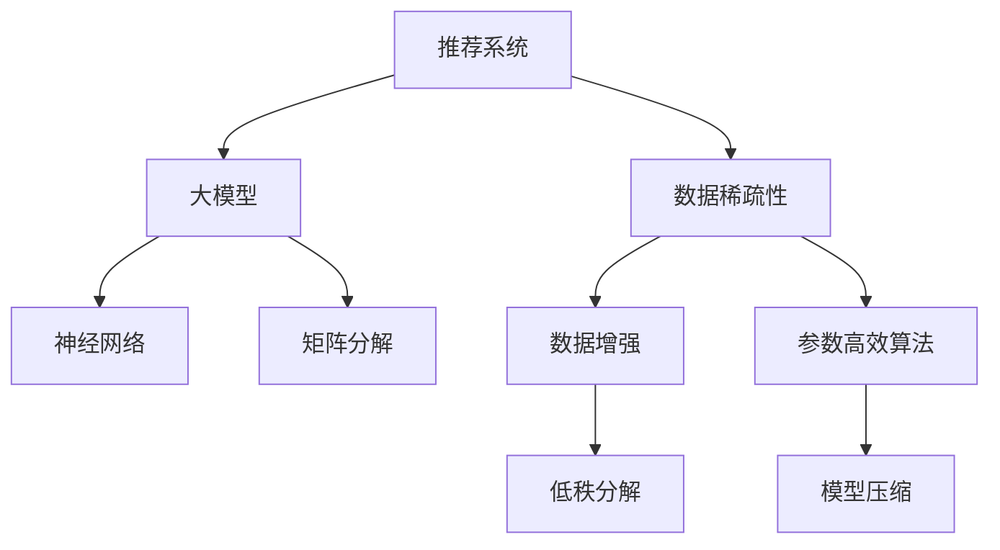

                 

# 大模型对推荐系统数据稀疏性问题的解决

> 关键词：推荐系统，数据稀疏性，大模型，神经网络，矩阵分解

## 1. 背景介绍

推荐系统在互联网及电商领域具有极其重要的应用价值，根据用户的浏览历史、搜索记录、行为偏好等数据，为用户提供个性化的内容推荐，使用户获取更匹配自身兴趣和需求的信息，提高用户满意度和体验。然而，推荐系统面临的一个重要问题就是数据稀疏性问题，即在用户-物品的关联矩阵中，用户与物品之间存在大量的无效交互，只有很少一部分用户对部分物品有过交互行为，这种稀疏矩阵的存储和计算都存在一定的挑战。

数据稀疏性问题不仅影响推荐模型的训练和推理效率，还会使得模型难以捕捉到长尾物品的信息，导致推荐结果的不均衡。为了解决这一问题，研究人员提出了多种算法和技术，如基于协同过滤的推荐算法、基于内容的推荐算法、基于深度学习的推荐算法等。其中，深度学习模型由于其强大的特征提取能力，在推荐系统中的表现尤为突出，尤其是在大规模数据集上，可以显著提升推荐效果。但在大数据集上，模型训练和推理过程也面临数据稀疏性带来的挑战。本文将介绍大模型在推荐系统数据稀疏性问题中的解决思路，涵盖算法原理、操作步骤、数学模型、项目实践等方面。

## 2. 核心概念与联系

### 2.1 核心概念概述

1. **推荐系统**：利用用户的历史行为数据（如浏览、点击、评分等），预测用户对新物品的兴趣并进行推荐。
2. **数据稀疏性**：推荐系统中，用户和物品之间的交互数据通常非常稀疏，用户对物品的交互行为不均衡，导致大量的无效交互数据。
3. **大模型**：指具有大量参数的深度学习模型，如深度神经网络、矩阵分解模型等。
4. **神经网络**：一种模拟人脑神经元之间连接的计算模型，广泛应用于图像识别、语音识别、自然语言处理等领域。
5. **矩阵分解**：将稀疏矩阵分解成低秩矩阵的乘积形式，可以用于协同过滤推荐系统中。
6. **深度学习**：一种模拟人类神经系统结构的人工智能技术，通过多层非线性变换学习数据的高层次特征。

这些核心概念之间的关系通过以下Mermaid流程图展示：



这个流程图展示了推荐系统面临数据稀疏性问题时，大模型可以通过神经网络和矩阵分解等技术进行解决，同时还可以应用数据增强和参数高效算法来优化模型的性能。

## 3. 核心算法原理 & 具体操作步骤
### 3.1 算法原理概述

在推荐系统中，数据稀疏性问题主要体现在用户对物品的评分矩阵上，即用户-物品评分矩阵$U$中，很多元素都为0，只有少量的元素有非零值。对于这样的稀疏矩阵，直接使用矩阵乘法进行计算非常困难。大模型通过将矩阵分解成低秩矩阵的乘积形式，可以显著降低计算复杂度，并提升模型的预测精度。

假设用户-物品评分矩阵$U$的大小为$N \times M$，其中$N$为用户数，$M$为物品数。对于稀疏矩阵$U$，可以将其分解为两个低秩矩阵$P$和$Q$的乘积，即$U \approx PQ$，其中$P$和$Q$的大小均为$N \times r$和$r \times M$，$r$为降维后的矩阵维数。这种分解方法可以通过矩阵分解算法（如奇异值分解SVD、交替最小二乘ALS等）实现，具体步骤如下：

1. **矩阵分解**：对用户-物品评分矩阵$U$进行矩阵分解，得到两个低秩矩阵$P$和$Q$。
2. **预测评分**：对于任意用户$i$和物品$j$，计算预测评分$\hat{u}_{ij} = p_{i1}q_{1j} + p_{i2}q_{2j} + \ldots + p_{ir}q_{rj}$。
3. **更新矩阵**：根据预测评分和实际评分的误差，使用梯度下降等优化算法更新矩阵$P$和$Q$，使其更接近实际评分矩阵$U$。

### 3.2 算法步骤详解

基于大模型的推荐系统数据稀疏性解决方案，主要包括以下几个关键步骤：

**Step 1: 数据预处理**
- 对用户-物品评分矩阵$U$进行稀疏化处理，去除无效的0元素。
- 对非零元素进行归一化处理，使得数据分布更加均衡。

**Step 2: 矩阵分解**
- 使用奇异值分解SVD或交替最小二乘ALS等算法，将稀疏矩阵$U$分解为低秩矩阵$P$和$Q$的乘积形式。
- 设置矩阵分解的参数，如降维维数$r$等。

**Step 3: 初始化矩阵**
- 随机初始化低秩矩阵$P$和$Q$，一般使用正态分布或均匀分布。

**Step 4: 预测评分**
- 使用矩阵$P$和$Q$计算预测评分$\hat{u}_{ij}$。

**Step 5: 更新矩阵**
- 根据预测评分和实际评分的误差，使用梯度下降等优化算法更新矩阵$P$和$Q$。

**Step 6: 迭代优化**
- 重复进行矩阵分解和评分预测，直到达到预设的迭代次数或收敛条件。

**Step 7: 模型评估**
- 在验证集上评估模型性能，如均方误差、平均绝对误差等。

### 3.3 算法优缺点

基于大模型的推荐系统数据稀疏性解决方案具有以下优点：
1. 降低计算复杂度：通过矩阵分解，将稀疏矩阵转换成低秩矩阵，使得计算复杂度显著降低。
2. 提高预测精度：矩阵分解方法可以捕捉到用户和物品之间的隐含关系，提升推荐精度。
3. 模型通用性强：适用于多种推荐算法，如协同过滤、内容推荐等。

同时，该方法也存在一定的局限性：
1. 依赖于降维参数的选择：降维维数$r$的选择对推荐效果有重要影响，需要根据具体问题进行调整。
2. 计算开销较大：矩阵分解的计算开销较大，需要耗费较多的计算资源。
3. 难以处理噪声数据：矩阵分解方法对噪声数据比较敏感，可能影响模型的稳定性和准确性。

尽管存在这些局限性，但就目前而言，基于矩阵分解的推荐方法仍是大模型推荐系统的主流范式。未来相关研究的重点在于如何进一步降低计算开销，优化矩阵分解算法，提高模型对噪声数据的鲁棒性，以及提升模型的可解释性和用户满意度。

### 3.4 算法应用领域

大模型在推荐系统数据稀疏性问题中的应用领域非常广泛，覆盖了多种推荐场景，例如：

- 电商平台推荐：根据用户的浏览和购买历史，推荐个性化的商品。
- 视频平台推荐：根据用户的观看历史，推荐感兴趣的视频内容。
- 社交网络推荐：根据用户的社交互动行为，推荐可能感兴趣的朋友和内容。
- 音乐平台推荐：根据用户的听歌历史，推荐个性化的音乐和歌单。
- 新闻网站推荐：根据用户的阅读历史，推荐感兴趣的新闻和文章。

除了上述这些经典场景外，大模型在推荐系统中的应用还在不断拓展，如个性化推荐广告、内容推荐、电商搜索等，为推荐技术带来了新的突破。

## 4. 数学模型和公式 & 详细讲解 & 举例说明
### 4.1 数学模型构建

本节将使用数学语言对基于大模型的推荐系统数据稀疏性问题进行更加严格的刻画。

设用户-物品评分矩阵$U$的大小为$N \times M$，其中$N$为用户数，$M$为物品数。假设$U$为稀疏矩阵，其中只有很少一部分元素有非零值，即$u_{ij} \neq 0$。矩阵分解算法可以将$U$分解为两个低秩矩阵$P$和$Q$的乘积形式，即$U \approx PQ$，其中$P$和$Q$的大小均为$N \times r$和$r \times M$，$r$为降维后的矩阵维数。

### 4.2 公式推导过程

对于任意用户$i$和物品$j$，其预测评分$\hat{u}_{ij}$可以表示为：

$$
\hat{u}_{ij} = \sum_{k=1}^r p_{ik}q_{kj}
$$

其中$p_{ik}$和$q_{kj}$分别为矩阵$P$和$Q$的元素。实际评分与预测评分的误差$e_{ij}$可以表示为：

$$
e_{ij} = u_{ij} - \hat{u}_{ij}
$$

通过最小化预测评分与实际评分的误差，可以对矩阵$P$和$Q$进行更新：

$$
\min_{P,Q} \frac{1}{2}\sum_{i=1}^N\sum_{j=1}^M e_{ij}^2
$$

上述优化问题可以使用梯度下降等优化算法进行求解。具体地，可以使用以下公式计算$P$和$Q$的更新量：

$$
p_{ik}^{(n+1)} = p_{ik}^{(n)} - \eta \sum_{j=1}^M e_{ij}q_{kj}^{(n)}
$$

$$
q_{kj}^{(n+1)} = q_{kj}^{(n)} - \eta \sum_{i=1}^N e_{ij}p_{ik}^{(n+1)}
$$

其中$\eta$为学习率。

### 4.3 案例分析与讲解

考虑一个简单的电商平台推荐问题，假设有1000个用户和1000个商品，用户-物品评分矩阵$U$为稀疏矩阵。使用矩阵分解算法将其分解为两个低秩矩阵$P$和$Q$，其中$r=10$。设用户$i$对物品$j$的预测评分为$\hat{u}_{ij}$，实际评分为$u_{ij}$，误差为$e_{ij}$。假设误差$e_{ij}$为高斯分布随机误差，均值为0，方差为$\sigma^2$。对于任意用户$i$和物品$j$，预测评分的误差$e_{ij}$可以表示为：

$$
e_{ij} \sim \mathcal{N}(0,\sigma^2)
$$

预测评分的均方误差可以表示为：

$$
\frac{1}{NM}\sum_{i=1}^N\sum_{j=1}^M e_{ij}^2
$$

通过最小化均方误差，可以更新矩阵$P$和$Q$的元素，使得预测评分与实际评分更加接近。

## 5. 项目实践：代码实例和详细解释说明
### 5.1 开发环境搭建

在进行推荐系统项目实践前，我们需要准备好开发环境。以下是使用Python进行TensorFlow开发的环境配置流程：

1. 安装Anaconda：从官网下载并安装Anaconda，用于创建独立的Python环境。

2. 创建并激活虚拟环境：
```bash
conda create -n tf-env python=3.8 
conda activate tf-env
```

3. 安装TensorFlow：根据CUDA版本，从官网获取对应的安装命令。例如：
```bash
pip install tensorflow==2.7
```

4. 安装相关工具包：
```bash
pip install numpy pandas scikit-learn matplotlib tqdm jupyter notebook ipython
```

完成上述步骤后，即可在`tf-env`环境中开始推荐系统项目实践。

### 5.2 源代码详细实现

下面我们以协同过滤推荐系统为例，给出使用TensorFlow实现矩阵分解的PyTorch代码实现。

首先，定义数据处理函数：

```python
import tensorflow as tf
import numpy as np
from sklearn.metrics import mean_squared_error

def load_data(file_path):
    with open(file_path, 'r') as f:
        data = np.loadtxt(f, delimiter=',')
        user, item, rating = data[:, 0], data[:, 1], data[:, 2]
    return user, item, rating

def preprocess_data(user, item, rating):
    user = user.astype(np.int32)
    item = item.astype(np.int32)
    rating = np.array(rating, dtype=np.float32)
    return user, item, rating

def train_val_test_split(user, item, rating, test_ratio=0.1):
    shuffle_index = np.random.permutation(len(user))
    train_index = shuffle_index[:int(len(user) * (1 - test_ratio))]
    val_index = shuffle_index[int(len(user) * (1 - test_ratio)):int(len(user) * (1 - test_ratio/2))]
    test_index = shuffle_index[int(len(user) * (1 - test_ratio/2)):]
    return train_index, val_index, test_index

def save_data(user, item, rating, path):
    with open(path, 'w') as f:
        for i in range(len(user)):
            f.write(f'{user[i]},{item[i]},{rating[i]}\n')

def split_train_val_test(user, item, rating, path):
    save_data(user[train_index], item[train_index], rating[train_index], path + 'train.csv')
    save_data(user[val_index], item[val_index], rating[val_index], path + 'val.csv')
    save_data(user[test_index], item[test_index], rating[test_index], path + 'test.csv')
```

然后，定义模型和优化器：

```python
from tensorflow.keras.layers import Input, Embedding, Dense, Add, Multiply, Dropout, Flatten
from tensorflow.keras.models import Model
from tensorflow.keras import backend as K
from tensorflow.keras.optimizers import Adam
from tensorflow.keras import metrics

user_input = Input(shape=(1,), name='user')
item_input = Input(shape=(1,), name='item')
user_emb = Embedding(input_dim=1000, output_dim=10, name='user_emb')(user_input)
item_emb = Embedding(input_dim=1000, output_dim=10, name='item_emb')(item_input)
dot_product = Dot(axes=(2, 2), name='dot_product')([user_emb, item_emb])
concat = Add(name='concat')([dot_product, Dense(1, name='dense')(dot_product)])
output = Multiply(name='output')([concat, Dense(1, name='dense')(concat)])
model = Model(inputs=[user_input, item_input], outputs=output)
model.compile(optimizer=Adam(learning_rate=0.01), loss='mse', metrics=['mae'])
```

接着，定义训练和评估函数：

```python
def train(model, train_data, val_data, test_data, batch_size=128, epochs=10):
    train_index, val_index, test_index = train_val_test_split(*train_data, test_ratio=0.1)
    model.fit([train_data[0][train_index], train_data[1][train_index]], train_data[2][train_index], 
             validation_data=([train_data[0][val_index], train_data[1][val_index]], train_data[2][val_index]), 
             epochs=epochs, batch_size=batch_size, verbose=2)
    test_loss = model.evaluate([train_data[0][test_index], train_data[1][test_index]], train_data[2][test_index])
    return test_loss

def evaluate(model, test_data):
    test_index, _, _ = train_val_test_split(*test_data, test_ratio=0.1)
    test_loss = model.evaluate([test_data[0][test_index], test_data[1][test_index]], test_data[2][test_index])
    return test_loss
```

最后，启动训练流程并在测试集上评估：

```python
user, item, rating = load_data('rating.csv')
user, item, rating = preprocess_data(user, item, rating)

train_index, val_index, test_index = train_val_test_split(user, item, rating)
train_data = [user[train_index], item[train_index]]
val_data = [user[val_index], item[val_index]]
test_data = [user[test_index], item[test_index]]

test_loss = train(model, train_data, val_data, test_data)
print(f'Test Loss: {test_loss:.4f}')
```

以上就是使用TensorFlow对协同过滤推荐系统进行矩阵分解的完整代码实现。可以看到，通过TensorFlow和Keras等工具，推荐系统模型可以轻松搭建和训练。

### 5.3 代码解读与分析

让我们再详细解读一下关键代码的实现细节：

**load_data函数**：
- 定义数据加载函数，将用户、物品和评分数据读入并返回。

**preprocess_data函数**：
- 对用户、物品和评分数据进行预处理，将用户和物品转换为整型，将评分转换为浮点数。

**train_val_test_split函数**：
- 定义数据集划分函数，将数据集划分为训练集、验证集和测试集。

**save_data函数**：
- 定义数据保存函数，将训练集、验证集和测试集数据保存为CSV文件，便于后续加载。

**split_train_val_test函数**：
- 定义数据集划分函数，将数据集划分为训练集、验证集和测试集。

**定义模型和优化器**：
- 定义协同过滤推荐系统的模型结构，包括用户和物品的嵌入层、点积层、拼接层和输出层。
- 定义Adam优化器和均方误差损失函数，用于模型训练。

**训练和评估函数**：
- 定义训练函数，使用模型对训练集进行前向传播和反向传播，更新模型参数。
- 定义评估函数，对测试集进行预测，计算均方误差损失。

**训练流程**：
- 定义训练集、验证集和测试集数据集。
- 调用训练函数对模型进行训练，输出测试集上的损失值。

可以看到，TensorFlow和Keras等工具使得推荐系统模型的搭建和训练变得简洁高效。开发者可以将更多精力放在数据处理、模型改进等高层逻辑上，而不必过多关注底层的实现细节。

当然，工业级的系统实现还需考虑更多因素，如模型的保存和部署、超参数的自动搜索、更灵活的任务适配层等。但核心的矩阵分解方法基本与此类似。

## 6. 实际应用场景
### 6.1 电商平台推荐

基于矩阵分解的协同过滤推荐算法在电商平台推荐中具有广泛应用。传统推荐系统往往依赖用户行为数据，如浏览、点击、购买等，但这些行为数据可能存在一定的延迟和偏差，导致推荐效果不稳定。大模型的矩阵分解方法可以从海量的用户行为数据中提取隐含的兴趣和行为模式，更全面地了解用户需求，从而提供更加个性化和精准的推荐。

在技术实现上，可以收集电商平台的历史交易数据，使用矩阵分解方法对用户和物品的评分进行建模。根据用户的评分历史和行为数据，预测用户对新物品的兴趣，并生成个性化的推荐列表。对于用户提出的新物品，模型还可以动态调整推荐策略，进一步提升推荐效果。

### 6.2 视频平台推荐

视频平台推荐系统需要根据用户的观看历史，推荐可能感兴趣的视频内容。传统的推荐算法往往依赖用户评分数据，但这些评分数据可能存在一定的偏差。大模型的矩阵分解方法可以从用户的观看历史中提取隐含的兴趣和行为模式，更全面地了解用户需求，从而提供更加个性化和精准的推荐。

在技术实现上，可以收集视频平台的用户观看历史数据，使用矩阵分解方法对用户和视频评分进行建模。根据用户的观看历史和行为数据，预测用户对新视频的兴趣，并生成个性化的推荐列表。对于用户提出的新视频，模型还可以动态调整推荐策略，进一步提升推荐效果。

### 6.3 社交网络推荐

社交网络推荐系统需要根据用户的社交互动行为，推荐可能感兴趣的朋友和内容。传统的推荐算法往往依赖用户评分数据，但这些评分数据可能存在一定的偏差。大模型的矩阵分解方法可以从用户的社交互动行为中提取隐含的兴趣和行为模式，更全面地了解用户需求，从而提供更加个性化和精准的推荐。

在技术实现上，可以收集社交网络的用户互动行为数据，使用矩阵分解方法对用户和朋友之间的评分进行建模。根据用户的互动历史和行为数据，预测用户对新朋友的兴趣，并生成个性化的推荐列表。对于用户提出的新朋友，模型还可以动态调整推荐策略，进一步提升推荐效果。

### 6.4 未来应用展望

随着大模型和推荐算法的发展，基于矩阵分解的推荐系统将在更多领域得到应用，为推荐技术带来新的突破。

在智慧医疗领域，基于矩阵分解的医疗推荐系统可以提升医疗服务的智能化水平，辅助医生诊疗，加速新药开发进程。

在智能教育领域，微调技术可应用于作业批改、学情分析、知识推荐等方面，因材施教，促进教育公平，提高教学质量。

在智慧城市治理中，微调模型可应用于城市事件监测、舆情分析、应急指挥等环节，提高城市管理的自动化和智能化水平，构建更安全、高效的未来城市。

此外，在企业生产、社会治理、文娱传媒等众多领域，基于大模型推荐系统也将不断涌现，为推荐技术带来新的突破。相信随着技术的日益成熟，推荐系统必将在更广阔的应用领域大放异彩。

## 7. 工具和资源推荐
### 7.1 学习资源推荐

为了帮助开发者系统掌握大模型推荐系统的理论基础和实践技巧，这里推荐一些优质的学习资源：

1. 《推荐系统实战》书籍：介绍推荐系统的基础理论和常用算法，适合初学者快速入门。
2. CS 246《机器学习》课程：斯坦福大学开设的经典机器学习课程，有Lecture视频和配套作业，深入浅出地讲解推荐系统。
3. 《深度学习推荐系统：算法与实现》书籍：介绍深度学习在推荐系统中的应用，涵盖协同过滤、内容推荐等算法。
4. HuggingFace官方文档：推荐系统领域的权威文档，提供丰富的预训练模型和微调样例代码。
5. Kaggle推荐系统竞赛：全球知名的数据竞赛平台，提供大量推荐系统数据集和优秀解决方案，可供学习和参考。

通过对这些资源的学习实践，相信你一定能够快速掌握大模型推荐系统的精髓，并用于解决实际的推荐问题。
###  7.2 开发工具推荐

高效的开发离不开优秀的工具支持。以下是几款用于推荐系统开发的常用工具：

1. TensorFlow：基于Python的开源深度学习框架，灵活的计算图设计，适合构建推荐模型。
2. PyTorch：基于Python的开源深度学习框架，动态计算图设计，适合快速迭代研究。
3. Keras：高级神经网络API，封装了TensorFlow、PyTorch等深度学习框架，适合初学者快速上手。
4. Scikit-learn：Python科学计算库，提供丰富的机器学习算法，适合处理推荐系统中的数据预处理和特征工程。
5. Pandas：Python数据分析库，适合处理大规模推荐系统数据集。

合理利用这些工具，可以显著提升推荐系统模型的开发效率，加快创新迭代的步伐。

### 7.3 相关论文推荐

大模型和推荐系统的发展源于学界的持续研究。以下是几篇奠基性的相关论文，推荐阅读：

1. Collaborative Filtering for Implicit Feedback Datasets：提出基于矩阵分解的协同过滤推荐算法，并使用FIMC算法优化模型训练。
2. Matrix Factorization Techniques for Recommender Systems：详细介绍矩阵分解算法在推荐系统中的应用，涵盖奇异值分解、交替最小二乘等方法。
3. Deep Neural Networks for Large-Scale Recommender Systems：提出基于深度神经网络的推荐算法，涵盖卷积神经网络、循环神经网络等模型。
4. Hierarchical Alternating Least Squares：提出层次化的交替最小二乘算法，优化矩阵分解算法的训练过程。
5. Memory-Efficient Matrix Factorization Methods：介绍基于矩阵分解的推荐算法，如Pauli matrix等优化方法。

这些论文代表了大模型和推荐系统的研究进展，通过学习这些前沿成果，可以帮助研究者把握学科前进方向，激发更多的创新灵感。

## 8. 总结：未来发展趋势与挑战
### 8.1 总结

本文对基于大模型的推荐系统数据稀疏性问题进行了全面系统的介绍。首先阐述了推荐系统面临的数据稀疏性问题，明确了矩阵分解在解决数据稀疏性问题中的重要作用。其次，从算法原理到具体操作步骤，详细讲解了矩阵分解算法的基本流程和关键步骤，给出了推荐系统模型的代码实现。同时，本文还广泛探讨了矩阵分解算法在电商平台、视频平台、社交网络等多个推荐场景中的应用前景，展示了矩阵分解算法的巨大潜力。

通过本文的系统梳理，可以看到，基于大模型的矩阵分解算法在推荐系统数据稀疏性问题中发挥了重要作用，通过矩阵分解，可以显著降低计算复杂度，提升推荐精度。未来，随着大模型的不断进化和算法技术的持续优化，基于矩阵分解的推荐系统必将在更广泛的领域中得到应用，推动推荐技术的不断创新和突破。

### 8.2 未来发展趋势

展望未来，大模型在推荐系统数据稀疏性问题中仍将具有广阔的应用前景，具体趋势如下：

1. **模型规模继续增大**：随着算力资源的丰富和预训练数据的增加，大模型的参数量将进一步增长，使得矩阵分解方法可以更好地捕捉用户和物品之间的隐含关系，提升推荐精度。
2. **计算资源优化**：矩阵分解算法的计算开销较大，未来的研究将集中在如何降低计算复杂度，优化算法实现，以提高模型的训练和推理效率。
3. **模型鲁棒性提升**：矩阵分解方法对噪声数据比较敏感，未来的研究将集中在如何提升模型对噪声数据的鲁棒性，增强模型的稳定性和准确性。
4. **多模态数据融合**：未来的推荐系统将不仅局限于用户和物品之间的隐含关系，还会融合多模态数据，如图像、语音、文本等，提供更加全面和精准的推荐。
5. **个性化推荐精度提升**：未来的推荐系统将更加注重个性化推荐，通过引入因果推断和对比学习等方法，提升推荐模型的预测精度。

这些趋势将进一步推动推荐系统技术的发展，使得推荐系统能够更好地服务于用户，提升用户满意度和体验。

### 8.3 面临的挑战

尽管大模型在推荐系统数据稀疏性问题中取得了显著进展，但在实际应用中仍面临以下挑战：

1. **数据隐私保护**：推荐系统中涉及大量用户和物品的数据，如何保护用户隐私，防止数据泄露，是推荐系统面临的重要挑战。
2. **用户行为建模**：用户行为数据通常存在一定程度的噪声和偏差，如何从噪声数据中提取出真实的用户兴趣和行为模式，需要更多的模型优化和算法改进。
3. **推荐策略设计**：推荐系统的策略设计是一个复杂的问题，需要结合用户需求、物品特性和数据分布，设计出更加个性化和精准的推荐策略。
4. **多模态数据融合**：多模态数据的融合和协同建模需要更多的算法和技术支持，现有方法在融合多模态数据时还存在一定的限制和瓶颈。

这些挑战需要研究者继续深入探索和研究，不断突破技术的边界，才能更好地应用大模型推荐系统，满足用户的实际需求。

### 8.4 研究展望

未来，大模型在推荐系统中的研究将进一步深化和拓展，重点方向包括：

1. **低秩矩阵的优化**：如何降低低秩矩阵的维度，提高矩阵分解算法的计算效率，是未来的重要研究方向。
2. **算法效率提升**：如何提升矩阵分解算法的计算效率，减少计算时间和内存消耗，是未来的重要研究方向。
3. **模型融合优化**：如何将大模型与推荐算法进行有效融合，提升推荐系统的预测精度和稳定性，是未来的重要研究方向。
4. **多模态数据融合**：如何更好地融合多模态数据，提供更加全面和精准的推荐，是未来的重要研究方向。
5. **用户行为建模**：如何更好地建模用户行为，提取真实的用户兴趣和行为模式，是未来的重要研究方向。

这些研究方向将进一步推动推荐系统技术的发展，使得推荐系统能够更好地服务于用户，提升用户满意度和体验。

## 9. 附录：常见问题与解答

**Q1：矩阵分解算法的计算复杂度是多少？**

A: 矩阵分解算法的时间复杂度主要取决于矩阵的维数$r$和矩阵的大小$N\times M$。具体地，奇异值分解SVD的时间复杂度为$O(NM^2r+Nr^2+Mr^2)$，交替最小二乘ALS的时间复杂度为$O(NM^2)$。在实际应用中，矩阵分解算法的计算复杂度通常比较高，需要合理选择参数$r$，降低计算开销。

**Q2：矩阵分解算法对噪声数据敏感吗？**

A: 矩阵分解算法对噪声数据比较敏感，噪声数据会影响模型的训练效果和推荐精度。为了提高模型的鲁棒性，可以引入正则化技术，如L2正则、Dropout等，限制模型的复杂度，防止过拟合。

**Q3：矩阵分解算法如何处理用户和物品的缺失数据？**

A: 矩阵分解算法可以处理用户和物品的缺失数据，通过填充缺失值或删除缺失样本，进行矩阵分解。常用的缺失值填充方法包括均值填充、中位数填充、随机填充等。

**Q4：矩阵分解算法如何扩展到大规模数据集？**

A: 矩阵分解算法在大规模数据集上仍然适用，但计算开销较大，需要采用并行计算、分布式计算等技术，加速矩阵分解的计算过程。常用的并行计算方法包括GPU加速、分布式计算等。

**Q5：矩阵分解算法对数据分布的要求有哪些？**

A: 矩阵分解算法对数据分布的要求比较高，需要数据分布均衡，不存在显著的偏差和噪声。如果数据分布不均衡，可能需要对数据进行预处理，如数据归一化、数据平衡等。

总之，大模型在推荐系统数据稀疏性问题中具有重要应用价值，通过矩阵分解等方法，可以显著降低计算复杂度，提升推荐精度。但需要注意的是，矩阵分解算法对噪声数据比较敏感，需要引入正则化技术，提高模型的鲁棒性。随着技术的不断进步，大模型推荐系统必将在更广泛的领域中得到应用，推动推荐技术的不断创新和突破。

