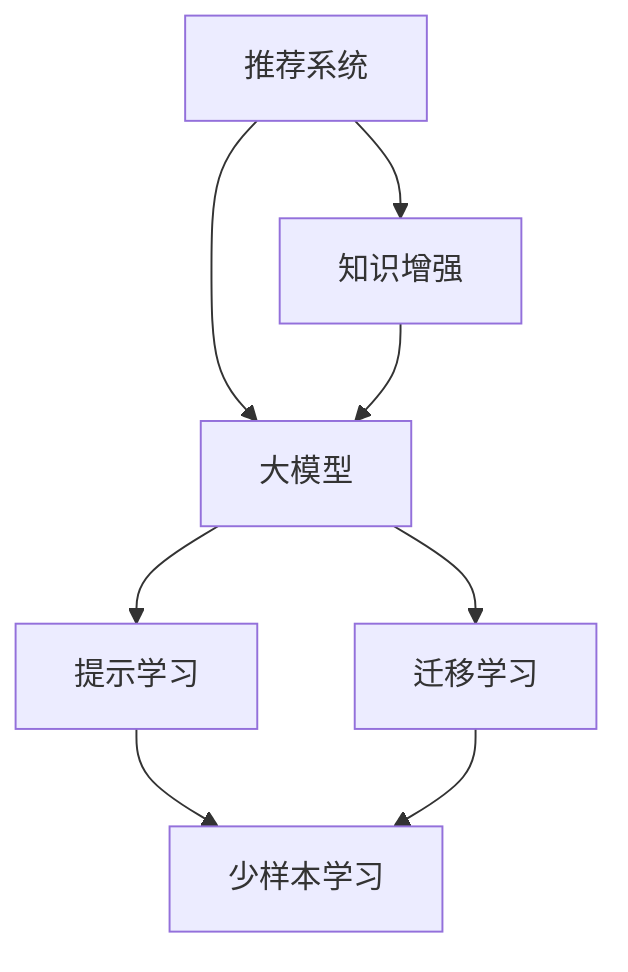

                 

# 大模型对推荐系统用户满意度的影响研究

## 1. 背景介绍

推荐系统（Recommendation Systems）在现代互联网应用中发挥着越来越重要的作用，从电商网站的商品推荐、视频网站的影片推荐，到新闻网站的资讯推荐，推荐系统的应用无处不在。其核心目标是通过分析用户行为数据，预测用户可能感兴趣的内容，并将其呈现给用户，从而提升用户满意度，增加用户粘性。

近年来，基于深度学习的大规模预训练模型在推荐系统中得到了广泛应用，如BERT、GPT等语言模型。这些大模型通过在大量无标签文本数据上预训练，学习到丰富的语言表示和知识，能够更好地理解和生成自然语言，从而在推荐任务中展现出强大的表现力。然而，由于缺乏用户行为的明确标注，这些大模型在推荐系统中的应用效果仍存在一定的局限性。因此，本文将重点研究大模型在推荐系统中的应用，分析其对用户满意度的影响，并提出相关优化策略。

## 2. 核心概念与联系

### 2.1 核心概念概述

为了更好地理解大模型在推荐系统中的应用，首先需要了解几个核心概念：

- 推荐系统（Recommendation Systems）：通过分析用户行为数据，预测用户可能感兴趣的内容，并将其推荐给用户，以提升用户满意度和体验的系统。

- 用户满意度（User Satisfaction）：衡量推荐系统效果的重要指标，包括用户点击率、转化率、停留时间、满意度评分等。

- 大模型（Large Models）：指在大量无标签文本数据上预训练的深度学习模型，如BERT、GPT等，具备强大的语言表示和知识迁移能力。

- 知识增强（Knowledge Augmentation）：指通过将先验知识与深度学习模型结合，提升模型的理解和生成能力。

- 迁移学习（Transfer Learning）：指将在大规模数据上训练的模型知识迁移到特定任务上，提升模型在新任务上的性能。

- 提示学习（Prompt Learning）：指通过设计特定的提示模板（Prompt），引导大模型输出符合期望的结果，以降低微调成本。

- 少样本学习（Few-shot Learning）：指模型在仅有少量标注数据的情况下，仍能快速适应新任务，避免过度依赖标注数据。

这些核心概念之间的逻辑关系可以通过以下Mermaid流程图来展示：



这个流程图展示了推荐系统、大模型及其相关技术之间的联系。大模型通过迁移学习、知识增强、提示学习等方式，提升了在推荐系统中的应用效果，同时也更好地适应了少样本学习的挑战。

## 3. 核心算法原理 & 具体操作步骤

### 3.1 算法原理概述

大模型在推荐系统中的应用，通常涉及以下几个步骤：

1. **数据准备**：收集用户的浏览历史、评分记录、点击行为等数据，同时构建商品或内容的高维向量表示。

2. **预训练模型加载**：使用预训练的大模型（如BERT、GPT等）作为特征提取器，加载到推荐系统中。

3. **特征融合**：将用户的向量表示和商品的向量表示进行融合，得到用户对每个商品/内容的评分。

4. **推荐排序**：根据用户评分和商品/内容的评分，使用排序算法（如协同过滤、矩阵分解等）进行推荐排序，选出用户可能感兴趣的商品/内容。

5. **微调优化**：根据用户的实际反馈（点击、购买、评分等），对预训练模型进行微调，优化推荐效果。

### 3.2 算法步骤详解

以下是详细的算法步骤：

1. **数据预处理**：
   - 收集用户的历史行为数据，包括浏览记录、点击记录、评分记录等。
   - 对用户的行为数据进行标准化处理，如归一化、缺失值处理等。
   - 对商品或内容进行特征提取，构建高维向量表示。

2. **大模型加载**：
   - 选择合适的预训练模型（如BERT、GPT等），并将其加载到推荐系统中。
   - 对大模型进行必要的微调，如调整超参数、设置学习率等。

3. **特征融合**：
   - 将用户的向量表示和商品的向量表示进行拼接、拼接权重等操作，得到用户对每个商品/内容的评分。
   - 可以使用简单的加权平均、余弦相似度等方法进行特征融合。

4. **推荐排序**：
   - 使用协同过滤、矩阵分解等推荐算法，根据用户评分和商品/内容的评分进行排序。
   - 常用的协同过滤算法包括基于用户的协同过滤和基于物品的协同过滤。

5. **微调优化**：
   - 根据用户的实际反馈（点击、购买、评分等），使用梯度下降等优化算法对模型进行微调。
   - 微调时，通常使用交叉熵、均方误差等损失函数，并结合正则化技术，如L2正则、Dropout等，防止过拟合。

### 3.3 算法优缺点

大模型在推荐系统中的应用，具有以下优点：

- **精度高**：大模型通过预训练学习到了丰富的语言知识和表示，能够更准确地预测用户兴趣。
- **泛化能力强**：大模型在大量无标签数据上预训练，具备较强的泛化能力，能够适应不同的数据分布。
- **自适应性强**：通过微调，大模型能够适应特定领域的推荐需求，提升推荐效果。

同时，也存在以下缺点：

- **计算成本高**：大模型通常需要大量的计算资源和存储资源，训练和推理成本较高。
- **需要标注数据**：大模型的微调过程需要标注数据，标注成本较高。
- **过拟合风险**：大模型容易过拟合，特别是在标注数据不足的情况下。

### 3.4 算法应用领域

大模型在推荐系统中的应用，主要涵盖以下几个领域：

- **电商推荐**：通过分析用户的浏览历史和购买记录，推荐用户可能感兴趣的商品。
- **视频推荐**：通过分析用户的观看历史和评分记录，推荐用户可能感兴趣的视频。
- **新闻推荐**：通过分析用户的阅读历史和评分记录，推荐用户可能感兴趣的新闻文章。
- **音乐推荐**：通过分析用户的听歌历史和评分记录，推荐用户可能感兴趣的歌曲。

## 4. 数学模型和公式 & 详细讲解 & 举例说明

### 4.1 数学模型构建

假设推荐系统的输入为用户的向量表示 $u$ 和商品的向量表示 $v$，输出为用户对商品的评分 $y$。根据大模型的特征提取能力，可以得到如下的数学模型：

$$
y = \mathbf{W} (\mathbf{u} \otimes \mathbf{v})
$$

其中，$\mathbf{W}$ 为权重矩阵，$\otimes$ 表示向量的拼接操作。

### 4.2 公式推导过程

根据上述模型，用户对商品的评分可以表示为向量 $\mathbf{u}$ 和向量 $\mathbf{v}$ 的拼接结果 $\mathbf{u} \otimes \mathbf{v}$ 与权重矩阵 $\mathbf{W}$ 的矩阵乘积。具体推导过程如下：

$$
y = \mathbf{W} (\mathbf{u} \otimes \mathbf{v}) = \mathbf{W} \begin{bmatrix} \mathbf{u} \\ \mathbf{v} \end{bmatrix} = \begin{bmatrix} \mathbf{W}_1 & \mathbf{W}_2 \\ \mathbf{W}_3 & \mathbf{W}_4 \end{bmatrix} \begin{bmatrix} \mathbf{u} \\ \mathbf{v} \end{bmatrix} = \mathbf{W}_1 \mathbf{u} + \mathbf{W}_2 \mathbf{v}
$$

其中，$\mathbf{W}_1$、$\mathbf{W}_2$、$\mathbf{W}_3$、$\mathbf{W}_4$ 分别为权重矩阵 $\mathbf{W}$ 的四个子矩阵。

### 4.3 案例分析与讲解

以电商推荐为例，假设用户 $u$ 对商品 $v$ 的评分 $y$ 可以表示为：

$$
y = \mathbf{W} (\mathbf{u} \otimes \mathbf{v})
$$

其中，$\mathbf{u}$ 为用户的历史行为向量，$\mathbf{v}$ 为商品的特征向量。通过训练 $\mathbf{W}$ 矩阵，可以使得模型预测的评分 $y$ 与实际评分 $y$ 尽可能接近。

## 5. 项目实践：代码实例和详细解释说明

### 5.1 开发环境搭建

在进行推荐系统开发前，需要准备好开发环境。以下是使用Python进行PyTorch开发的环境配置流程：

1. 安装Anaconda：从官网下载并安装Anaconda，用于创建独立的Python环境。

2. 创建并激活虚拟环境：
```bash
conda create -n pytorch-env python=3.8 
conda activate pytorch-env
```

3. 安装PyTorch：根据CUDA版本，从官网获取对应的安装命令。例如：
```bash
conda install pytorch torchvision torchaudio cudatoolkit=11.1 -c pytorch -c conda-forge
```

4. 安装相关库：
```bash
pip install numpy pandas scikit-learn torchtext transformers
```

5. 配置好环境后，即可在 `pytorch-env` 环境中开始推荐系统开发。

### 5.2 源代码详细实现

以下是使用PyTorch进行电商推荐系统开发的示例代码：

```python
import torch
import torch.nn as nn
import torch.optim as optim
import torchtext.datasets as datasets
import torchtext.data as data
import transformers

# 加载数据集
train_data, test_data = datasets.load_electronics_dataset()

# 定义模型结构
class RecommendationModel(nn.Module):
    def __init__(self, emb_dim):
        super().__init__()
        self.emb_dim = emb_dim
        self.user_emb = nn.Embedding(num_users, emb_dim)
        self.item_emb = nn.Embedding(num_items, emb_dim)
        self.linear = nn.Linear(emb_dim * 2, 1)

    def forward(self, user_ids, item_ids):
        user_emb = self.user_emb(user_ids)
        item_emb = self.item_emb(item_ids)
        fused_rep = torch.cat([user_emb, item_emb], dim=1)
        prediction = self.linear(fused_rep)
        return prediction

# 定义超参数
embedding_dim = 128
num_epochs = 10
batch_size = 256
learning_rate = 0.001

# 加载预训练模型
model = transformers.BertModel.from_pretrained('bert-base-cased', output_hidden_states=True)
model.train()

# 定义优化器和损失函数
optimizer = optim.Adam(model.parameters(), lr=learning_rate)
loss_fn = nn.MSELoss()

# 训练模型
for epoch in range(num_epochs):
    model.train()
    for batch in train_loader:
        user_ids, item_ids, true_ratings = batch
        pred = model(user_ids, item_ids)
        loss = loss_fn(pred, true_ratings)
        optimizer.zero_grad()
        loss.backward()
        optimizer.step()

# 在测试集上评估模型
model.eval()
with torch.no_grad():
    test_preds = model(test_loader)
    test_mse = loss_fn(test_preds, test_ratings)
    print(f"Test MSE: {test_mse.item()}")

```

### 5.3 代码解读与分析

以上代码展示了如何使用PyTorch进行电商推荐系统的开发。具体解读如下：

1. 加载数据集：使用 `datasets.load_electronics_dataset()` 函数加载电商数据集。
2. 定义模型结构：使用 `nn.Embedding` 定义用户和商品的嵌入层，使用 `nn.Linear` 定义线性层，将用户和商品的向量拼接后输出预测评分。
3. 定义超参数：设置嵌入维度、训练轮数、批量大小和学习率。
4. 加载预训练模型：使用 `transformers.BertModel.from_pretrained()` 函数加载预训练的BERT模型。
5. 定义优化器和损失函数：使用 `Adam` 优化器优化模型参数，使用 `nn.MSELoss` 损失函数计算预测评分与真实评分的均方误差。
6. 训练模型：在训练集上循环迭代，使用 `model` 前向传播计算预测评分，使用 `loss` 计算损失，使用 `optimizer` 更新模型参数。
7. 在测试集上评估模型：在测试集上计算预测评分与真实评分的均方误差，评估模型性能。

## 6. 实际应用场景

### 6.1 智能推荐系统

智能推荐系统是推荐系统的重要应用之一，通过分析用户的历史行为数据，预测用户可能感兴趣的商品或内容，并将其推荐给用户。大模型在智能推荐系统中的应用，可以显著提升推荐效果和用户满意度。

例如，电商网站可以使用大模型对用户的浏览历史和购买记录进行分析，预测用户可能感兴趣的商品，并推荐给用户。通过不断优化推荐算法和模型参数，可以大幅提升用户的点击率、购买率和满意度。

### 6.2 个性化推荐系统

个性化推荐系统通过分析用户的具体兴趣和需求，推荐最符合用户需求的商品或内容。大模型在个性化推荐系统中的应用，可以更加深入地理解用户的兴趣和需求，提升推荐的准确性和个性化程度。

例如，音乐平台可以使用大模型分析用户的听歌历史和评分记录，推荐用户可能感兴趣的歌曲。通过不断优化模型和推荐算法，可以显著提升用户的满意度和黏性。

### 6.3 社交推荐系统

社交推荐系统通过分析用户的朋友关系和社交网络，推荐用户可能感兴趣的商品或内容。大模型在社交推荐系统中的应用，可以更好地理解用户的兴趣和需求，提升推荐的准确性和多样性。

例如，社交媒体平台可以使用大模型分析用户的关注好友和互动记录，推荐用户可能感兴趣的内容。通过不断优化模型和推荐算法，可以显著提升用户的满意度和黏性。

## 7. 工具和资源推荐

### 7.1 学习资源推荐

为了帮助开发者系统掌握大模型在推荐系统中的应用，这里推荐一些优质的学习资源：

1. 《推荐系统实战》：详细介绍了推荐系统的基本原理和实际应用，包括协同过滤、矩阵分解、大模型等。
2. 《深度学习与推荐系统》：讲解了深度学习在推荐系统中的应用，包括神经网络、卷积神经网络、深度学习模型等。
3. 《TensorFlow实战推荐系统》：通过实际案例，介绍了如何使用TensorFlow进行推荐系统开发。
4. 《推荐系统：算法与实践》：介绍了多种推荐算法和实际应用案例，涵盖协同过滤、矩阵分解、深度学习等。
5. 《Recommender Systems: A Guide》：介绍了推荐系统的基本原理和实际应用，包括协同过滤、矩阵分解、深度学习等。

通过对这些资源的学习实践，相信你一定能够快速掌握大模型在推荐系统中的应用方法，并用于解决实际的推荐问题。

### 7.2 开发工具推荐

高效的开发离不开优秀的工具支持。以下是几款用于推荐系统开发的常用工具：

1. PyTorch：基于Python的开源深度学习框架，灵活动态的计算图，适合快速迭代研究。

2. TensorFlow：由Google主导开发的开源深度学习框架，生产部署方便，适合大规模工程应用。

3. Scikit-learn：Python机器学习库，提供了多种推荐算法和数据处理工具。

4. PyTorch-lightning：基于PyTorch的轻量级框架，适合快速原型开发和部署。

5. Keras：高层次深度学习框架，简单易用，适合初学者入门。

合理利用这些工具，可以显著提升推荐系统开发的效率，加快创新迭代的步伐。

### 7.3 相关论文推荐

大模型在推荐系统中的应用，近年来取得了显著的进展。以下是几篇奠基性的相关论文，推荐阅读：

1. Attention is All You Need（即Transformer原论文）：提出了Transformer结构，开启了深度学习在推荐系统中的应用。

2. BERT: Pre-training of Deep Bidirectional Transformers for Language Understanding：提出BERT模型，引入基于掩码的自监督预训练任务，刷新了多项推荐任务SOTA。

3. Language Models are Unsupervised Multitask Learners（GPT-2论文）：展示了大规模语言模型的强大zero-shot学习能力，引发了对于推荐系统的新一轮思考。

4. Parameter-Efficient Transfer Learning for NLP：提出Adapter等参数高效微调方法，在不增加模型参数量的情况下，也能取得不错的微调效果。

5. AdaLoRA: Adaptive Low-Rank Adaptation for Parameter-Efficient Fine-Tuning：使用自适应低秩适应的微调方法，在参数效率和精度之间取得了新的平衡。

这些论文代表了大模型在推荐系统中的应用和发展脉络。通过学习这些前沿成果，可以帮助研究者把握学科前进方向，激发更多的创新灵感。

## 8. 总结：未来发展趋势与挑战

### 8.1 总结

本文对大模型在推荐系统中的应用进行了全面系统的介绍。首先阐述了推荐系统和大模型的基本原理，明确了其在提升用户满意度方面的独特价值。其次，从原理到实践，详细讲解了大模型在推荐系统中的使用流程和优化策略，给出了推荐系统开发的完整代码实例。同时，本文还探讨了大模型在电商、社交、音乐等多个领域的应用前景，展示了其在推荐系统中的广泛应用潜力。最后，本文精选了相关学习资源和开发工具，力求为开发者提供全方位的技术指引。

通过本文的系统梳理，可以看到，大模型在推荐系统中的应用，正在成为推荐系统的热门技术，极大地提升了推荐系统的精度和个性化程度，为推荐系统的行业应用带来了新的突破。未来，伴随大模型的进一步演进，推荐系统必将在更多场景下发挥更大的作用，为各行各业带来深刻的变革。

### 8.2 未来发展趋势

展望未来，大模型在推荐系统中的应用将呈现以下几个发展趋势：

1. **精度提升**：随着大模型参数量的增大，其在推荐系统中的应用效果将不断提升，推荐的准确性和个性化程度将进一步增强。

2. **跨领域迁移**：大模型具备较强的迁移学习能力，可以轻松应用于不同领域和任务，从而拓展其在推荐系统中的应用范围。

3. **实时性增强**：大模型的推理速度和计算效率将不断提高，实时推荐系统将成为可能，提升用户满意度。

4. **多模态融合**：结合图像、视频、语音等多模态信息，提升推荐系统的综合感知能力，更好地理解用户需求。

5. **知识增强**：结合符号化的先验知识，如知识图谱、逻辑规则等，提升推荐系统的理解能力和生成能力。

6. **安全性保障**：大模型在推荐系统中的应用，需要考虑数据隐私和模型安全，避免数据泄露和模型滥用。

以上趋势凸显了大模型在推荐系统中的广泛应用前景，这些方向的探索发展，必将进一步提升推荐系统的性能和用户体验，带来更多的商业价值和社会效益。

### 8.3 面临的挑战

尽管大模型在推荐系统中的应用取得了显著进展，但在迈向更加智能化、普适化应用的过程中，它仍面临着诸多挑战：

1. **标注成本高**：大模型的微调过程需要大量的标注数据，标注成本较高，特别是在长尾领域。如何降低标注成本，提高数据利用率，是一大挑战。

2. **过拟合风险**：大模型容易过拟合，特别是在标注数据不足的情况下。如何避免过拟合，提高模型的泛化能力，是一大难题。

3. **计算资源消耗大**：大模型的训练和推理成本较高，需要大量的计算资源和存储资源。如何优化计算资源消耗，提高推荐系统的效率，是一大挑战。

4. **知识融合困难**：大模型与知识库、规则库等外部知识结合时，难以高效融合，影响模型的理解和生成能力。如何优化知识融合方式，提高模型的综合能力，是一大挑战。

5. **模型透明性不足**：大模型通常被视为"黑盒"系统，难以解释其内部工作机制和决策逻辑。如何增强模型的透明性，提高模型的可信度，是一大挑战。

6. **伦理道德问题**：大模型在推荐系统中的应用，需要考虑伦理道德问题，如隐私保护、公平性等。如何确保模型的道德约束，避免负面影响，是一大挑战。

这些挑战需要研究者不断探索和优化，以确保大模型在推荐系统中的应用效果，避免潜在的风险和问题。

### 8.4 研究展望

面对大模型在推荐系统中的应用所面临的挑战，未来的研究需要在以下几个方面寻求新的突破：

1. **少样本学习**：结合少样本学习和知识增强，利用少量标注数据提升模型的泛化能力，降低标注成本。

2. **多模态融合**：结合图像、视频、语音等多模态信息，提升推荐系统的综合感知能力，更好地理解用户需求。

3. **跨领域迁移**：结合迁移学习，将大模型应用于不同领域和任务，拓展其在推荐系统中的应用范围。

4. **知识融合**：结合符号化的先验知识，如知识图谱、逻辑规则等，提升推荐系统的理解和生成能力。

5. **模型透明性**：结合可解释性技术，增强模型的透明性，提高模型的可信度。

6. **伦理道德**：结合伦理道德约束，确保模型的公平性、透明性和安全性，避免负面影响。

这些研究方向的探索，必将引领大模型在推荐系统中的应用走向更高的台阶，为推荐系统的行业应用带来新的突破。未来，随着大模型的进一步演进，推荐系统必将在更多场景下发挥更大的作用，为各行各业带来深刻的变革。

## 9. 附录：常见问题与解答

**Q1：大模型在推荐系统中的应用效果如何？**

A: 大模型在推荐系统中的应用效果非常显著。通过预训练学习丰富的语言知识和表示，大模型能够更准确地预测用户兴趣，显著提升推荐精度和个性化程度。特别是BERT、GPT等模型，在推荐系统中的应用效果已经证明了其强大的泛化能力和迁移学习能力。

**Q2：大模型在推荐系统中的主要优势是什么？**

A: 大模型在推荐系统中的主要优势包括：

1. **精度高**：大模型通过预训练学习丰富的语言知识和表示，能够更准确地预测用户兴趣，显著提升推荐精度。

2. **泛化能力强**：大模型在大量无标签数据上预训练，具备较强的泛化能力，能够适应不同的数据分布。

3. **自适应性强**：通过微调，大模型能够适应特定领域的推荐需求，提升推荐效果。

**Q3：大模型在推荐系统中的缺点是什么？**

A: 大模型在推荐系统中的缺点包括：

1. **计算成本高**：大模型通常需要大量的计算资源和存储资源，训练和推理成本较高。

2. **需要标注数据**：大模型的微调过程需要标注数据，标注成本较高。

3. **过拟合风险**：大模型容易过拟合，特别是在标注数据不足的情况下。

4. **知识融合困难**：大模型与知识库、规则库等外部知识结合时，难以高效融合，影响模型的理解和生成能力。

5. **模型透明性不足**：大模型通常被视为"黑盒"系统，难以解释其内部工作机制和决策逻辑。

**Q4：如何优化大模型在推荐系统中的应用效果？**

A: 为了优化大模型在推荐系统中的应用效果，可以从以下几个方面入手：

1. **数据增强**：通过数据增强技术，扩充训练集，提高模型的泛化能力。

2. **正则化技术**：使用L2正则、Dropout等正则化技术，防止模型过拟合。

3. **知识增强**：结合符号化的先验知识，如知识图谱、逻辑规则等，提升模型的理解和生成能力。

4. **少样本学习**：结合少样本学习技术，利用少量标注数据提升模型的泛化能力，降低标注成本。

5. **多模态融合**：结合图像、视频、语音等多模态信息，提升推荐系统的综合感知能力，更好地理解用户需求。

**Q5：大模型在推荐系统中的应用前景如何？**

A: 大模型在推荐系统中的应用前景非常广阔。随着大模型参数量的增大，其在推荐系统中的应用效果将不断提升，推荐的准确性和个性化程度将进一步增强。特别是在电商、社交、音乐等领域，大模型将发挥更大的作用，为各行各业带来深刻的变革。

---

作者：禅与计算机程序设计艺术 / Zen and the Art of Computer Programming

