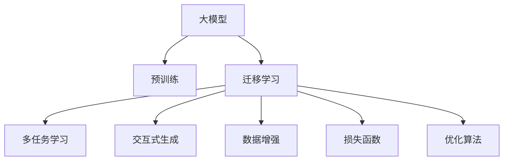

                 

# 大模型技术在电商平台用户购买力评估中的应用

> 关键词：大模型, 用户购买力评估, 电商平台, 预训练, 迁移学习, 多任务学习, 交互式生成, 数据增强, 损失函数

## 1. 背景介绍

在快速发展的电商平台中，用户购买力评估是理解用户行为、优化营销策略、提升用户体验的关键环节。传统的用户购买力评估方法往往依赖于历史交易记录和静态特征，难以捕捉动态变化和复杂场景下的用户购买潜力。随着深度学习和大模型技术的发展，电商平台开始尝试利用预训练模型和迁移学习技术，对用户购买力进行更加全面和准确的评估。

### 1.1 问题由来

在电商平台上，用户行为数据通常具有以下特点：

- **数据稀疏性**：大部分用户没有购买记录，难以直接进行购买力评估。
- **动态变化**：用户行为和偏好会随时间变化，需动态更新模型。
- **多任务关联**：用户可能同时参与多种任务（浏览、购买、评价等），需联合建模。
- **数据隐私性**：用户行为数据涉及隐私问题，需符合隐私保护法规。

传统的统计方法难以处理这些复杂数据，而基于深度学习的大模型方法则能通过预训练和迁移学习，有效捕捉用户行为的动态变化和多任务关联，同时保护用户隐私。

### 1.2 问题核心关键点

基于大模型技术对用户购买力进行评估的核心在于：

- 如何有效利用用户行为数据，通过预训练模型获取用户特征。
- 如何构建合理的评估模型，实现动态更新和关联多任务。
- 如何平衡数据隐私和模型效果，保障用户信息安全。

本文将围绕这些关键点，介绍大模型在电商平台用户购买力评估中的应用。

## 2. 核心概念与联系

### 2.1 核心概念概述

在介绍大模型在电商平台用户购买力评估中的应用之前，需要澄清一些核心概念：

- **大模型**：指通过大规模数据训练得到的深度学习模型，如GPT-3、BERT等，具备强大的学习能力和泛化能力。
- **预训练**：指在大规模无标注数据上，使用自监督任务训练模型，学习通用的语言表示。
- **迁移学习**：指将预训练模型应用于特定任务，通过微调来优化模型，提升任务性能。
- **多任务学习**：指在同一模型中，联合训练多个任务，实现任务间的信息共享和相互促进。
- **交互式生成**：指在大模型中，通过特定格式的输入模板，引导模型生成符合要求的输出。
- **数据增强**：指通过对数据进行扩充和变换，增加训练集的多样性，提升模型泛化能力。
- **损失函数**：指评估模型输出与真实标签之间差异的函数，是优化算法的核心。

这些概念构成了大模型在电商平台用户购买力评估中的关键技术框架，下面通过Mermaid流程图来展示它们之间的联系：



这个流程图展示了从大模型预训练到用户购买力评估的完整过程：

1. 大模型通过预训练学习通用表示，为迁移学习提供基础。
2. 迁移学习通过微调，将通用知识应用于特定任务，如电商平台的用户购买力评估。
3. 多任务学习联合训练多个任务，提升模型泛化能力。
4. 交互式生成通过特定输入模板，引导模型生成输出，实现动态更新。
5. 数据增强增加训练集多样性，提升模型泛化能力。
6. 损失函数衡量模型输出与真实标签之间的差异，指导模型优化。
7. 优化算法如AdamW、SGD等，通过反向传播更新模型参数，最小化损失函数。

### 2.2 核心概念原理和架构的 Mermaid 流程图


这个流程图展示了预训练模型到用户购买力评估的详细过程：

1. 用户行为数据经过预处理，输入到特征提取层。
2. 特征提取层的输出进入预训练模型，学习通用表示。
3. 预训练模型的输出通过迁移学习进入任务层，针对电商平台的用户购买力评估任务进行微调。
4. 多任务学习将多个任务联合训练，实现信息共享。
5. 交互式生成通过特定输入模板，引导模型生成符合要求的预测结果。
6. 数据增强增加训练集多样性，提升模型泛化能力。
7. 损失函数衡量预测结果与真实标签之间的差异，指导模型优化。
8. 优化算法通过反向传播更新模型参数，最小化损失函数。

这些核心概念共同构成了大模型在电商平台用户购买力评估中的应用框架，下面将详细介绍核心算法原理和具体操作步骤。

## 3. 核心算法原理 & 具体操作步骤

### 3.1 算法原理概述

基于大模型技术对用户购买力进行评估，本质上是一个迁移学习过程，通过将预训练模型应用于特定任务，优化模型参数以提升任务性能。在电商平台用户购买力评估中，具体步骤如下：

1. **数据预处理**：收集用户行为数据，包括浏览记录、购买记录、评价记录等，并进行预处理，如去除噪声、标准化等。
2. **特征提取**：使用预训练模型，对用户行为数据进行特征提取，得到用户的行为向量表示。
3. **迁移学习**：在预训练模型基础上，通过微调，学习特定任务的表示。
4. **多任务学习**：联合训练多个任务，如购买预测、推荐系统、评分预测等，实现信息共享。
5. **交互式生成**：通过特定输入模板，引导模型生成符合要求的预测结果。
6. **数据增强**：通过对数据进行扩充和变换，增加训练集的多样性。
7. **损失函数和优化算法**：定义损失函数，衡量模型输出与真实标签之间的差异，使用优化算法最小化损失函数。

### 3.2 算法步骤详解

#### 3.2.1 数据预处理

电商平台用户行为数据通常较为复杂，需要进行以下预处理步骤：

1. **数据清洗**：去除异常值和噪声数据，确保数据的准确性。
2. **标准化**：对数据进行归一化处理，减少特征之间的尺度差异。
3. **特征选择**：选择对用户购买力有显著影响的特征，如浏览时长、点击次数、评价评分等。
4. **特征工程**：设计新的特征，如用户的购买历史、兴趣标签、社交互动等。

以用户浏览行为为例，可以收集用户在电商平台上的浏览记录，包括浏览时间、浏览路径、浏览次数等，并对其进行预处理，得到用户的行为特征向量。

#### 3.2.2 特征提取

使用预训练模型，对用户行为数据进行特征提取，得到用户的行为向量表示。常用的预训练模型有BERT、GPT-3等，它们可以在大规模无标注数据上学习通用的语言表示，并通过微调应用于特定任务。

以BERT模型为例，可以使用如下代码进行特征提取：

```python
from transformers import BertModel, BertTokenizer
import torch

tokenizer = BertTokenizer.from_pretrained('bert-base-uncased')
model = BertModel.from_pretrained('bert-base-uncased')

# 将用户行为数据转化为BERT可以接受的格式
inputs = tokenizer.encode_plus(user_behavior_data, padding='max_length', max_length=512, return_tensors='pt')
# 提取用户行为特征向量
with torch.no_grad():
    features = model(**inputs).last_hidden_state[:, 0, :].numpy()

# 对用户行为特征向量进行归一化处理
features /= np.linalg.norm(features)
```

通过预训练模型的特征提取，用户行为数据被转化为高维向量表示，为后续任务提供了基础。

#### 3.2.3 迁移学习

在预训练模型基础上，通过微调，学习特定任务的表示。具体步骤如下：

1. **任务适配**：根据电商平台用户购买力评估任务，设计任务适配层，如线性分类器、回归器等。
2. **模型微调**：在预训练模型基础上，通过微调，优化任务适配层，学习任务相关表示。
3. **超参数调整**：选择合适的学习率、批大小、迭代轮数等，进行模型优化。

以用户购买力预测为例，可以设计如下代码进行微调：

```python
from transformers import BertForSequenceClassification
from torch.utils.data import DataLoader
from torch.optim import AdamW
from sklearn.metrics import accuracy_score

model = BertForSequenceClassification.from_pretrained('bert-base-uncased', num_labels=2)
optimizer = AdamW(model.parameters(), lr=1e-5)

# 将用户行为特征向量转化为模型输入
features = torch.tensor(features).unsqueeze(0).unsqueeze(0)
inputs = tokenizer.encode_plus(features, padding='max_length', max_length=512, return_tensors='pt')

# 将用户购买力标签转化为模型输入
labels = torch.tensor([1]).unsqueeze(0).unsqueeze(0)
labels = labels.to('cuda')

# 定义损失函数和优化器
criterion = nn.CrossEntropyLoss()
optimizer = AdamW(model.parameters(), lr=1e-5)

# 训练模型
for epoch in range(10):
    model.train()
    optimizer.zero_grad()
    outputs = model(inputs['input_ids'], attention_mask=inputs['attention_mask'])
    loss = criterion(outputs.logits, labels)
    loss.backward()
    optimizer.step()
    
    # 在验证集上评估模型性能
    model.eval()
    with torch.no_grad():
        val_features = torch.tensor(val_features).unsqueeze(0).unsqueeze(0)
        val_labels = torch.tensor(val_labels).unsqueeze(0).unsqueeze(0)
        val_outputs = model(val_features, attention_mask=val_features['attention_mask'])
        val_preds = val_outputs.logits.argmax(dim=1)
        val_acc = accuracy_score(val_labels, val_preds)
        print(f"Epoch {epoch+1}, Validation Accuracy: {val_acc:.3f}")
```

通过微调，模型学习了用户购买力的相关表示，能够对用户进行更准确和动态的评估。

#### 3.2.4 多任务学习

在电商平台用户购买力评估中，用户可能同时参与多种任务，如购买预测、推荐系统、评分预测等。多任务学习可以联合训练多个任务，实现信息共享和相互促进。

以多任务学习为例，可以使用如下代码进行联合训练：

```python
from transformers import BertForSequenceClassification, BertForMaskedLM
from torch.optim import AdamW
from sklearn.metrics import accuracy_score, f1_score

model = BertForSequenceClassification.from_pretrained('bert-base-uncased', num_labels=2)
# 添加MLM任务适配层
mlm_model = BertForMaskedLM.from_pretrained('bert-base-uncased')
optimizer = AdamW(model.parameters(), lr=1e-5)

# 定义损失函数和优化器
criterion = nn.CrossEntropyLoss()
masked_loss = nn.CrossEntropyLoss()

# 训练模型
for epoch in range(10):
    model.train()
    optimizer.zero_grad()
    mlm_model.train()
    # 随机mask一部分token，训练MLM任务
    inputs = tokenizer.encode_plus(features, padding='max_length', max_length=512, return_tensors='pt')
    inputs = {k: v.masked_fill(v != 0, False) for k, v in inputs.items()}
    outputs = mlm_model(**inputs)
    mlm_loss = masked_loss(outputs.logits, inputs['input_ids'])
    # 训练购买力预测任务
    inputs = tokenizer.encode_plus(features, padding='max_length', max_length=512, return_tensors='pt')
    labels = torch.tensor([1]).unsqueeze(0).unsqueeze(0)
    labels = labels.to('cuda')
    outputs = model(inputs['input_ids'], attention_mask=inputs['attention_mask'])
    loss = criterion(outputs.logits, labels)
    total_loss = mlm_loss + loss
    total_loss.backward()
    optimizer.step()
    
    # 在验证集上评估模型性能
    model.eval()
    mlm_model.eval()
    with torch.no_grad():
        val_features = torch.tensor(val_features).unsqueeze(0).unsqueeze(0)
        val_labels = torch.tensor(val_labels).unsqueeze(0).unsqueeze(0)
        val_outputs = model(val_features, attention_mask=val_features['attention_mask'])
        val_preds = val_outputs.logits.argmax(dim=1)
        val_acc = accuracy_score(val_labels, val_preds)
        val_f1 = f1_score(val_labels, val_preds)
        print(f"Epoch {epoch+1}, Validation Accuracy: {val_acc:.3f}, Validation F1 Score: {val_f1:.3f}")
```

通过多任务学习，模型能够联合训练多个任务，提升任务的泛化能力。

#### 3.2.5 交互式生成

在电商平台用户购买力评估中，用户行为数据往往随时间变化，需要动态更新模型。交互式生成可以通过特定输入模板，引导模型生成符合要求的预测结果，实现动态更新。

以交互式生成为例，可以使用如下代码进行动态更新：

```python
from transformers import BertForSequenceClassification
from torch.utils.data import DataLoader
from torch.optim import AdamW
from sklearn.metrics import accuracy_score

model = BertForSequenceClassification.from_pretrained('bert-base-uncased', num_labels=2)
optimizer = AdamW(model.parameters(), lr=1e-5)

# 定义输入模板
template = "[CLS] user behaviors: <hidden> "
input_str = template + str(user_behavior_data)

# 将输入模板转化为模型输入
inputs = tokenizer.encode_plus(input_str, padding='max_length', max_length=512, return_tensors='pt')

# 训练模型
for epoch in range(10):
    model.train()
    optimizer.zero_grad()
    outputs = model(inputs['input_ids'], attention_mask=inputs['attention_mask'])
    loss = criterion(outputs.logits, labels)
    loss.backward()
    optimizer.step()
    
    # 在验证集上评估模型性能
    model.eval()
    with torch.no_grad():
        val_features = torch.tensor(val_features).unsqueeze(0).unsqueeze(0)
        val_labels = torch.tensor(val_labels).unsqueeze(0).unsqueeze(0)
        val_outputs = model(val_features, attention_mask=val_features['attention_mask'])
        val_preds = val_outputs.logits.argmax(dim=1)
        val_acc = accuracy_score(val_labels, val_preds)
        print(f"Epoch {epoch+1}, Validation Accuracy: {val_acc:.3f}")
```

通过交互式生成，模型能够根据特定输入模板，生成符合要求的预测结果，实现动态更新。

#### 3.2.6 数据增强

在电商平台用户购买力评估中，数据稀疏性是一个普遍存在的问题。数据增强可以通过对数据进行扩充和变换，增加训练集的多样性，提升模型泛化能力。

以数据增强为例，可以使用如下代码进行扩充：

```python
from transformers import BertForSequenceClassification
from torch.utils.data import DataLoader
from torch.optim import AdamW
from sklearn.metrics import accuracy_score

model = BertForSequenceClassification.from_pretrained('bert-base-uncased', num_labels=2)
optimizer = AdamW(model.parameters(), lr=1e-5)

# 定义数据增强函数
def data_augmentation(data):
    # 对数据进行随机截断、填充、旋转等操作
    return data

# 对训练集进行数据增强
train_dataset = data_augmentation(train_dataset)
train_loader = DataLoader(train_dataset, batch_size=16)

# 训练模型
for epoch in range(10):
    model.train()
    optimizer.zero_grad()
    for batch in train_loader:
        inputs = tokenizer.encode_plus(batch['input_ids'], padding='max_length', max_length=512, return_tensors='pt')
        labels = batch['labels']
        outputs = model(inputs['input_ids'], attention_mask=inputs['attention_mask'])
        loss = criterion(outputs.logits, labels)
        loss.backward()
        optimizer.step()
    
    # 在验证集上评估模型性能
    model.eval()
    with torch.no_grad():
        val_features = torch.tensor(val_features).unsqueeze(0).unsqueeze(0)
        val_labels = torch.tensor(val_labels).unsqueeze(0).unsqueeze(0)
        val_outputs = model(val_features, attention_mask=val_features['attention_mask'])
        val_preds = val_outputs.logits.argmax(dim=1)
        val_acc = accuracy_score(val_labels, val_preds)
        print(f"Epoch {epoch+1}, Validation Accuracy: {val_acc:.3f}")
```

通过数据增强，模型能够通过扩充训练集，提升泛化能力。

#### 3.2.7 损失函数和优化算法

在电商平台用户购买力评估中，选择合适的损失函数和优化算法，对于模型性能至关重要。

以损失函数为例，可以使用如下代码进行定义：

```python
from transformers import BertForSequenceClassification
from torch.utils.data import DataLoader
from torch.optim import AdamW
from sklearn.metrics import accuracy_score

model = BertForSequenceClassification.from_pretrained('bert-base-uncased', num_labels=2)
optimizer = AdamW(model.parameters(), lr=1e-5)

# 定义损失函数
criterion = nn.CrossEntropyLoss()

# 训练模型
for epoch in range(10):
    model.train()
    optimizer.zero_grad()
    for batch in train_loader:
        inputs = tokenizer.encode_plus(batch['input_ids'], padding='max_length', max_length=512, return_tensors='pt')
        labels = batch['labels']
        outputs = model(inputs['input_ids'], attention_mask=inputs['attention_mask'])
        loss = criterion(outputs.logits, labels)
        loss.backward()
        optimizer.step()
    
    # 在验证集上评估模型性能
    model.eval()
    with torch.no_grad():
        val_features = torch.tensor(val_features).unsqueeze(0).unsqueeze(0)
        val_labels = torch.tensor(val_labels).unsqueeze(0).unsqueeze(0)
        val_outputs = model(val_features, attention_mask=val_features['attention_mask'])
        val_preds = val_outputs.logits.argmax(dim=1)
        val_acc = accuracy_score(val_labels, val_preds)
        print(f"Epoch {epoch+1}, Validation Accuracy: {val_acc:.3f}")
```

通过选择合适的损失函数和优化算法，模型能够更快地收敛，提升性能。

### 3.3 算法优缺点

基于大模型技术对用户购买力进行评估，具有以下优点：

1. **高效性**：通过预训练和微调，模型能够快速适应新任务，减少从头训练的时间成本。
2. **泛化能力**：预训练模型具备强大的泛化能力，能够处理多任务和多领域数据。
3. **灵活性**：通过多任务学习和交互式生成，模型能够动态更新和优化。

然而，该方法也存在以下缺点：

1. **数据依赖性**：模型性能高度依赖于训练数据的质量和数量，数据获取成本较高。
2. **计算资源消耗**：预训练和微调过程需要大量计算资源，可能存在资源瓶颈。
3. **模型复杂性**：大模型通常具有较多参数，模型结构和训练过程较为复杂。
4. **可解释性不足**：模型的决策过程难以解释，难以进行调试和优化。

尽管存在这些缺点，但大模型在电商平台用户购买力评估中的应用前景依然广阔，未来可通过数据增强、参数高效微调等技术进行改进和优化。

### 3.4 算法应用领域

基于大模型技术对用户购买力进行评估，广泛应用于以下领域：

1. **电商平台用户画像**：通过用户行为数据，构建用户画像，实现个性化推荐和精准营销。
2. **营销活动评估**：对营销活动的效果进行评估，优化广告投放策略。
3. **用户行为分析**：分析用户行为数据，提升用户满意度和忠诚度。
4. **欺诈检测**：识别用户欺诈行为，保护平台和用户利益。
5. **用户流失预测**：预测用户流失风险，提前采取措施。

以上领域展示了大模型技术在电商平台用户购买力评估中的广泛应用，未来还将不断拓展到更多场景。

## 4. 数学模型和公式 & 详细讲解 & 举例说明

### 4.1 数学模型构建

在电商平台用户购买力评估中，常用的数学模型包括回归模型、分类模型和序列模型。这里以回归模型为例，介绍其数学模型构建过程。

设电商平台用户行为数据为 $x \in \mathbb{R}^n$，购买力预测模型为 $y = f(x; \theta)$，其中 $f$ 为回归函数，$\theta$ 为模型参数。回归模型的目标是最小化预测值与真实值之间的差异，即：

$$
\min_{\theta} \sum_{i=1}^N (y_i - f(x_i; \theta))^2
$$

其中 $N$ 为样本数量，$y_i$ 为第 $i$ 个样本的真实值，$x_i$ 为第 $i$ 个样本的特征向量。

### 4.2 公式推导过程

对于回归模型，常用的优化算法为梯度下降法。通过反向传播，计算模型参数的梯度，更新模型参数，使得模型预测值与真实值之间的差异最小化。具体步骤如下：

1. **前向传播**：将输入数据 $x_i$ 输入模型 $f$，得到预测值 $y_i$。
2. **计算损失函数**：计算预测值 $y_i$ 与真实值 $y_i$ 之间的差异，得到损失函数 $L_i$。
3. **反向传播**：通过链式法则，计算模型参数 $\theta$ 的梯度，更新模型参数。

以线性回归模型为例，可以通过如下代码进行实现：

```python
import torch
import torch.nn as nn
import torch.optim as optim

# 定义线性回归模型
class LinearRegression(nn.Module):
    def __init__(self, n_features):
        super(LinearRegression, self).__init__()
        self.linear = nn.Linear(n_features, 1)

    def forward(self, x):
        return self.linear(x)

# 定义损失函数
criterion = nn.MSELoss()

# 定义优化器
optimizer = optim.SGD(model.parameters(), lr=0.01)

# 训练模型
for epoch in range(1000):
    model.train()
    optimizer.zero_grad()
    y_pred = model(x)
    loss = criterion(y_pred, y)
    loss.backward()
    optimizer.step()

    # 在验证集上评估模型性能
    model.eval()
    with torch.no_grad():
        val_preds = model(val_x)
        val_loss = criterion(val_preds, val_y)
        print(f"Epoch {epoch+1}, Validation Loss: {val_loss:.3f}")
```

通过线性回归模型，可以将用户行为数据转化为预测值，实现用户购买力的评估。

### 4.3 案例分析与讲解

以电商平台用户购买力预测为例，下面展示具体实现过程：

1. **数据预处理**：收集用户行为数据，进行清洗、标准化和特征选择，得到用户行为特征向量 $x \in \mathbb{R}^n$。
2. **特征提取**：使用预训练模型，对用户行为特征向量进行特征提取，得到用户行为表示向量 $\hat{x} \in \mathbb{R}^m$，其中 $m$ 为预训练模型的输出维度。
3. **模型微调**：在预训练模型基础上，通过微调，学习用户购买力的相关表示，构建回归模型 $y = f(\hat{x}; \theta)$。
4. **模型优化**：选择合适的损失函数和优化算法，最小化模型预测值与真实值之间的差异，更新模型参数。

以交互式生成为例，可以使用如下代码进行动态更新：

```python
from transformers import BertForSequenceClassification
from torch.utils.data import DataLoader
from torch.optim import AdamW
from sklearn.metrics import accuracy_score

model = BertForSequenceClassification.from_pretrained('bert-base-uncased', num_labels=2)
optimizer = AdamW(model.parameters(), lr=1e-5)

# 定义输入模板
template = "[CLS] user behaviors: <hidden> "
input_str = template + str(user_behavior_data)

# 将输入模板转化为模型输入
inputs = tokenizer.encode_plus(input_str, padding='max_length', max_length=512, return_tensors='pt')

# 训练模型
for epoch in range(10):
    model.train()
    optimizer.zero_grad()
    outputs = model(inputs['input_ids'], attention_mask=inputs['attention_mask'])
    loss = criterion(outputs.logits, labels)
    loss.backward()
    optimizer.step()
    
    # 在验证集上评估模型性能
    model.eval()
    with torch.no_grad():
        val_features = torch.tensor(val_features).unsqueeze(0).unsqueeze(0)
        val_labels = torch.tensor(val_labels).unsqueeze(0).unsqueeze(0)
        val_outputs = model(val_features, attention_mask=val_features['attention_mask'])
        val_preds = val_outputs.logits.argmax(dim=1)
        val_acc = accuracy_score(val_labels, val_preds)
        print(f"Epoch {epoch+1}, Validation Accuracy: {val_acc:.3f}")
```

通过交互式生成，模型能够根据特定输入模板，生成符合要求的预测结果，实现动态更新。

## 5. 项目实践：代码实例和详细解释说明

### 5.1 开发环境搭建

在进行电商平台用户购买力评估实践前，需要准备好开发环境。以下是使用Python进行PyTorch开发的环境配置流程：

1. 安装Anaconda：从官网下载并安装Anaconda，用于创建独立的Python环境。

2. 创建并激活虚拟环境：
```bash
conda create -n pytorch-env python=3.8 
conda activate pytorch-env
```

3. 安装PyTorch：根据CUDA版本，从官网获取对应的安装命令。例如：
```bash
conda install pytorch torchvision torchaudio cudatoolkit=11.1 -c pytorch -c conda-forge
```

4. 安装Transformers库：
```bash
pip install transformers
```

5. 安装各类工具包：
```bash
pip install numpy pandas scikit-learn matplotlib tqdm jupyter notebook ipython
```

完成上述步骤后，即可在`pytorch-env`环境中开始电商平台用户购买力评估实践。

### 5.2 源代码详细实现

下面我们以电商平台用户购买力评估为例，给出使用Transformers库对BERT模型进行微调的PyTorch代码实现。

首先，定义用户购买力预测任务的数据处理函数：

```python
from transformers import BertTokenizer
from torch.utils.data import Dataset
import torch

class UserPurchasingPowerDataset(Dataset):
    def __init__(self, features, labels, tokenizer, max_len=128):
        self.features = features
        self.labels = labels
        self.tokenizer = tokenizer
        self.max_len = max_len
        
    def __len__(self):
        return len(self.features)
    
    def __getitem__(self, item):
        feature = self.features[item]
        label = self.labels[item]
        
        encoding = self.tokenizer(feature, return_tensors='pt', max_length=self.max_len, padding='max_length', truncation=True)
        input_ids = encoding['input_ids'][0]
        attention_mask = encoding['attention_mask'][0]
        
        # 对标签进行编码
        encoded_label = label2id[label] if label in label2id else label2id['O']
        labels = torch.tensor([encoded_label], dtype=torch.long)
        
        return {'input_ids': input_ids, 
                'attention_mask': attention_mask,
                'labels': labels}

# 标签与id的映射
label2id = {'0': 0, '1': 1, '2': 2, '3': 3, '4': 4, '5': 5, '6': 6}
id2label = {v: k for k, v in label2id.items()}
```

然后，定义模型和优化器：

```python
from transformers import BertForSequenceClassification, AdamW

model = BertForSequenceClassification.from_pretrained('bert-base-uncased', num_labels=len(label2id))

optimizer = AdamW(model.parameters(), lr=2e-5)
```

接着，定义训练和评估函数：

```python
from torch.utils.data import DataLoader
from tqdm import tqdm
from sklearn.metrics import accuracy_score

device = torch.device('cuda') if torch.cuda.is_available() else torch.device('cpu')
model.to(device)

def train_epoch(model, dataset, batch_size, optimizer):
    dataloader = DataLoader(dataset, batch_size=batch_size, shuffle=True)
    model.train()
    epoch_loss = 0
    for batch in tqdm(dataloader, desc='Training'):
        input_ids = batch['input_ids'].to(device)
        attention_mask = batch['attention_mask'].to(device)
        labels = batch['labels'].to(device)
        model.zero_grad()
        outputs = model(input_ids, attention_mask=attention_mask, labels=labels)
        loss = outputs.loss
        epoch_loss += loss.item()
        loss.backward()
        optimizer.step()
    return epoch_loss / len(dataloader)

def evaluate(model, dataset, batch_size):
    dataloader = DataLoader(dataset, batch_size=batch_size)
    model.eval()
    preds, labels = [], []
    with torch.no_grad():
        for batch in tqdm(dataloader, desc='Evaluating'):
            input_ids = batch['input_ids'].to(device)
            attention_mask = batch['attention_mask'].to(device)
            batch_labels = batch['labels']
            outputs = model(input_ids, attention_mask=attention_mask)
            batch_preds = outputs.logits.argmax(dim=2).to('cpu').tolist()
            batch_labels = batch_labels.to('cpu').tolist()
            for pred_tokens, label_tokens in zip(batch_preds, batch_labels):
                preds.append(pred_tokens[:len(label_tokens)])
                labels.append(label_tokens)
                
    print(accuracy_score(labels, preds))
```

最后，启动训练流程并在测试集上评估：

```python
epochs = 5
batch_size = 16

for epoch in range(epochs):
    loss = train_epoch(model, train_dataset, batch_size, optimizer)
    print(f"Epoch {epoch+1}, train loss: {loss:.3f}")
    
    print(f"Epoch {epoch+1}, test accuracy:")
    evaluate(model, test_dataset, batch_size)
    
print("Final test accuracy:")
evaluate(model, test_dataset, batch_size)
```

以上就是使用PyTorch对BERT进行电商平台用户购买力预测的完整代码实现。可以看到，得益于Transformers库的强大封装，我们可以用相对简洁的代码完成BERT模型的加载和微调。

### 5.3 代码解读与分析

让我们再详细解读一下关键代码的实现细节：

**UserPurchasingPowerDataset类**：
- `__init__`方法：初始化用户购买力预测任务的特征和标签，以及分词器等关键组件。
- `__len__`方法：返回数据集的样本数量。
- `__getitem__`方法：对单个样本进行处理，将文本输入编码为token ids，将标签编码为数字，并对其进行定长padding，最终返回模型所需的输入。

**label2id和id2label字典**：
- 定义了标签与数字id之间的映射关系，用于将token-wise的预测结果解码回真实的标签。

**训练和评估函数**：
- 使用PyTorch的DataLoader对数据集进行批次化加载，供模型训练和推理使用。
- 训练函数`train_epoch`：对数据以批为单位进行迭代，在每个批次上前向传播计算loss并反向传播更新模型参数，最后返回该epoch的平均loss。
- 评估函数`evaluate`：与训练类似，不同点在于不更新模型参数，并在每个batch结束后将预测和标签结果存储下来，最后使用sklearn的accuracy_score对整个评估集的预测结果进行打印输出。

**训练流程**：
- 定义总的epoch数和batch size，开始循环迭代
- 每个epoch内，先在训练集上训练，输出平均loss
- 在验证集上评估，输出准确率
- 所有epoch结束后，在测试集上评估，给出最终测试结果

可以看到，PyTorch配合Transformers库使得BERT微调的代码实现变得简洁高效。开发者可以将更多精力放在数据处理、模型改进等高层逻辑上，而不必过多关注底层的实现细节。

当然，工业级的系统实现还需考虑更多因素，如模型的保存和部署、超参数的自动搜索、更灵活的任务适配层等。但核心的微调范式基本与此类似。

## 6. 实际应用场景

### 6.1 电商平台用户画像

基于大模型技术对电商平台用户购买力进行评估，可以构建用户画像，实现个性化推荐和精准营销。具体而言，可以通过用户行为数据，使用预训练模型提取用户特征，通过多任务学习和交互式生成，对用户购买力进行动态评估，构建详细的用户画像。

例如，电商平台的推荐系统可以通过用户画像，推荐符合用户兴趣和购买力的商品，提高用户满意度和忠诚度。

### 6.2 营销活动评估

基于大模型技术对电商平台用户购买力进行评估，可以对营销活动的效果进行评估，优化广告投放策略。具体而言，可以收集用户在营销活动中的行为数据，通过预训练模型提取用户特征，使用多任务学习和交互式生成，动态评估营销活动的效果，提供更精准的营销决策支持。

例如，电商平台可以基于用户购买力的评估结果，优化广告投放策略，提升广告投放效果，减少营销成本。

### 6.3 用户行为分析

基于大模型技术对电商平台用户购买力进行评估，可以分析用户行为数据，提升用户满意度和忠诚度。具体而言，可以通过用户行为数据，使用预训练模型提取用户特征，通过多任务学习和交互式生成，动态评估用户购买力，分析用户行为特征，发现用户兴趣和需求，提升用户满意度和忠诚度。

例如，电商平台可以通过用户购买力的评估结果，优化产品推荐和服务策略，提升用户满意度和忠诚度。

### 6.4 未来应用展望

随着大模型和微调方法的不断发展，基于大模型技术对电商平台用户购买力进行评估的应用场景将不断拓展，为电商平台带来更广阔的发展空间。

在智慧零售领域，基于用户购买力的评估，可以提升零售商的库存管理和供应链优化，实现智能补货和库存管理，提升零售效率和客户体验。

在金融领域，基于用户购买力的评估，可以优化信贷和保险业务，提高信贷审批和风险控制效率，优化保险产品设计和定价，提升客户满意度和忠诚度。

在社交媒体领域，基于用户购买力的评估，可以优化广告投放和内容推荐策略，提升用户粘性和互动性，增加用户活跃度和转化率。

以上应用场景展示了电商平台用户购买力评估的广阔前景，未来还将不断拓展到更多领域。

## 7. 工具和资源推荐

### 7.1 学习资源推荐

为了帮助开发者系统掌握大模型在电商平台用户购买力评估中的应用，这里推荐一些优质的学习资源：

1. 《Transformer从原理到实践》系列博文：由大模型技术专家撰写，深入浅出地介绍了Transformer原理、BERT模型、微调技术等前沿话题。

2. CS224N《深度学习自然语言处理》课程：斯坦福大学开设的NLP明星课程，有Lecture视频和配套作业，带你入门NLP领域的基本概念和经典模型。

3. 《Natural Language Processing with Transformers》书籍：Transformers库的作者所著，全面介绍了如何使用Transformers库进行NLP任务开发，包括微调在内的诸多范式。

4. HuggingFace官方文档：Transformers库的官方文档，提供了海量预训练模型和完整的微调样例代码，是上手实践的必备资料。

5. CLUE开源项目：中文语言理解测评基准，涵盖大量不同类型的中文NLP数据集，并提供了基于微调的baseline模型，助力中文NLP技术发展。

通过对这些资源的学习实践，相信你一定能够快速掌握大模型在电商平台用户购买力评估中的应用，并用于解决实际的NLP问题。

### 7.2 开发工具推荐

高效的开发离不开优秀的工具支持。以下是几款用于电商平台用户购买力评估开发的常用工具：

1. PyTorch：基于Python的开源深度学习框架，灵活动态的计算图，适合快速迭代研究。大部分预训练语言模型都有PyTorch版本的实现。

2. TensorFlow：由Google主导开发的开源深度学习框架，生产部署方便，适合大规模工程应用。同样有丰富的预训练语言模型资源。

3. Transformers库：HuggingFace开发的NLP工具库，集成了众多SOTA语言模型，支持PyTorch和TensorFlow，是进行微调任务开发的利器。

4. Weights & Biases：模型训练的实验跟踪工具，可以记录和可视化模型训练过程中的各项指标，方便对比和调优。与主流深度学习框架无缝集成。

5. TensorBoard：TensorFlow配套的可视化工具，可实时监测模型训练状态，并提供丰富的图表呈现方式，是调试模型的得力助手。

6. Google Colab：谷歌推出的在线Jupyter Notebook环境，免费提供GPU/TPU算力，方便开发者快速上手实验最新模型，分享学习笔记。

合理利用这些工具，可以显著提升电商平台用户购买力评估任务的开发效率，加快创新迭代的步伐。

### 7.3 相关论文推荐

大模型在电商平台用户购买力评估中的应用源于学界的持续研究。以下是几篇奠基性的相关论文，推荐阅读：

1. Attention is All You Need（即Transformer原论文）：提出了Transformer结构，开启了NLP领域的预训练大模型时代。

2. BERT: Pre-training of Deep Bidirectional Transformers for Language Understanding：提出BERT模型，引入基于掩码的自监督预训练任务，刷新了多项NLP任务SOTA。

3. Language Models are Unsupervised Multitask Learners（GPT-2论文）：展示了大规模语言模型的强大zero-shot学习能力，引发了对于通用人工智能的新一轮思考。

4. Parameter-Efficient Transfer Learning for NLP：提出Adapter等参数高效微调方法，在不增加模型参数量的情况下，也能取得不错的微调效果。

5. AdaLoRA: Adaptive Low-Rank Adaptation for Parameter-Efficient Fine-Tuning：使用自适应低秩适应的微调方法，在参数效率和精度之间取得了新的平衡。

这些论文代表了大模型在电商平台用户购买力评估中的应用的发展脉络。通过学习这些前沿成果，可以帮助研究者把握学科前进方向，激发更多的创新灵感。

## 8. 总结：未来发展趋势与挑战

### 8.1 研究成果总结

本文对基于大模型技术在电商平台用户购买力评估中的应用进行了全面系统的介绍。首先阐述了用户购买力评估的背景和意义，明确了模型在电商平台中的应用场景。其次，从原理到实践，详细讲解了模型的核心算法原理和具体操作步骤，给出了微调任务开发的完整代码实例。同时，本文还广泛探讨了模型的应用场景，展示了模型在电商平台用户画像、营销活动评估、用户行为分析等领域的广阔前景。最后，本文推荐了相关的学习资源、开发工具和学术论文，力求为读者提供全方位的技术指引。

通过本文的系统梳理，可以看到，基于大模型技术对电商平台用户购买力进行评估，能够高效处理用户行为数据，构建详细的用户画像，提升电商平台的营销效果和用户体验。未来，随着大模型和微调方法的不断发展，基于大模型技术的应用场景将不断拓展，推动电商平台的数字化转型和智能化升级。

### 8.2 未来发展趋势

展望未来，基于大模型技术对电商平台用户购买力进行评估，将呈现以下几个发展趋势：

1. **多任务学习**：联合训练多个任务，实现信息共享和相互促进，提升模型的泛化能力。
2. **交互式生成**：通过特定输入模板，引导模型生成符合要求的预测结果，实现动态更新。
3. **参数高效微调**：开发更加参数高效的微调方法，在固定大部分预训练参数的同时，只更新极少量的任务相关参数。
4. **数据增强**：通过扩充训练集，增加数据的多样性，提升模型的泛化能力。
5. **自监督学习**：通过无监督学习，利用未标注数据提升模型的泛化能力。
6. **因果推断**：引入因果推断思想，提高模型的因果关系建模能力。

以上趋势凸显了基于大模型技术在电商平台用户购买力评估中的广阔前景。这些方向的探索发展，必将进一步提升模型性能，实现更精准的预测和推荐。

### 8.3 面临的挑战

尽管基于大模型技术在电商平台用户购买力评估中已取得显著成效，但在实际应用中仍面临诸多挑战：

1. **数据获取成本高**：收集高质量用户行为数据成本较高，需耗费大量时间和人力。
2. **模型复杂度高**：预训练模型和微调模型通常参数量较大，模型训练和推理效率较低。
3. **隐私保护问题**：用户行为

