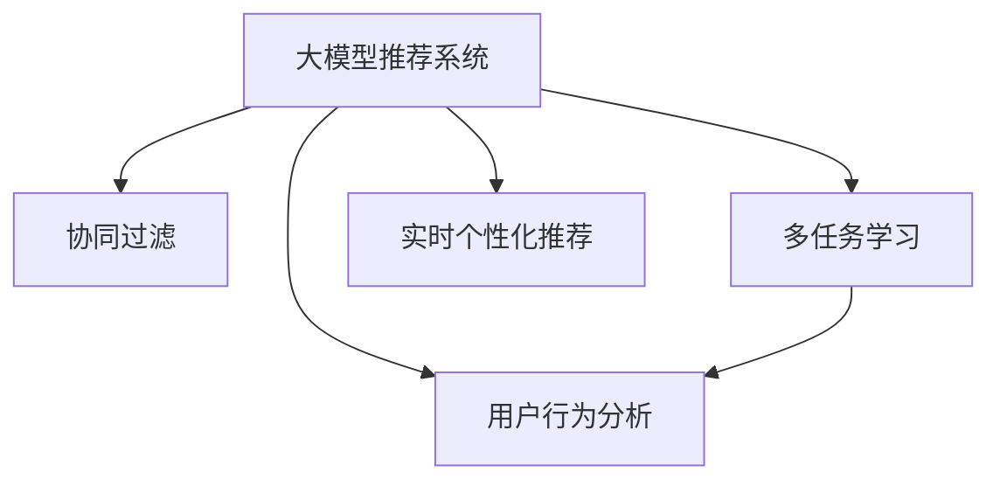

                 

# 大模型推荐系统的实时个性化方法

> 关键词：大模型推荐系统,实时个性化,深度学习,协同过滤,多任务学习,用户行为分析

## 1. 背景介绍

在互联网时代，推荐系统已经成为各行各业提供个性化服务的重要手段。从电商购物到视频点播，从音乐收听到内容阅读，推荐系统通过智能算法，帮助用户在海量信息中快速找到感兴趣的内容，极大地提升了用户体验和平台粘性。然而，传统推荐算法往往依赖于用户的历史行为数据，难以应对新用户、冷启动等场景的挑战。

近年来，深度学习在推荐系统中得到了广泛应用，极大地提升了推荐精度和用户体验。特别是基于大模型的推荐系统，通过在大规模数据上预训练模型，获得泛化能力强的知识表示，在实时个性化推荐中取得了显著效果。但由于大模型推理耗时较长，实时推荐面临着性能瓶颈。因此，如何在提升推荐效果的同时，保持实时性，成为当前推荐系统研究的重要方向。

## 2. 核心概念与联系

### 2.1 核心概念概述

为更好地理解实时个性化推荐方法，本节将介绍几个密切相关的核心概念：

- 大模型推荐系统(Large Model Recommendation System, LMRS)：基于大规模预训练语言模型进行推荐系统的构建，通过在数据上预训练大模型，获得泛化能力强的知识表示，在实时推荐中显著提升了推荐精度。

- 协同过滤(Collaborative Filtering, CF)：通过分析用户的行为数据，找到与目标用户相似的参考用户，根据这些用户的偏好，推测目标用户的兴趣和行为，进行个性化推荐。

- 多任务学习(Multi-Task Learning, MTL)：指训练一个模型，同时完成多个相关任务的泛化学习方法，可以提升模型的泛化能力和多任务适应性。

- 用户行为分析(User Behavior Analysis, UBA)：通过分析用户的行为特征，提取用户的兴趣点，为个性化推荐提供依据。

- 实时个性化推荐(Real-time Personalized Recommendation)：在用户请求时，实时地根据用户当前的状态和行为，动态生成个性化推荐结果。

这些核心概念之间的逻辑关系可以通过以下Mermaid流程图来展示：



这个流程图展示了大模型推荐系统的核心概念及其之间的关系：

1. 大模型推荐系统基于协同过滤、多任务学习、用户行为分析等技术进行推荐。
2. 协同过滤通过用户间的相似性，引导模型学习用户的兴趣特征。
3. 多任务学习通过多个相关任务，提升模型的泛化能力和多任务适应性。
4. 用户行为分析通过分析用户的当前状态和行为，进行实时推荐。

这些核心概念共同构成了大模型推荐系统的基本框架，使其能够在实时场景下提供个性化推荐服务。通过理解这些核心概念，我们可以更好地把握大模型推荐系统的工作原理和优化方向。

## 3. 核心算法原理 & 具体操作步骤
### 3.1 算法原理概述

实时个性化推荐方法的核心思想是：利用大模型的知识表示能力，通过多任务学习方式，在实时场景下动态生成个性化推荐结果。具体来说，其原理包括：

1. **大模型知识表示**：在大规模数据上预训练大模型，学习到通用的知识表示，能够对用户行为进行准确刻画。
2. **多任务学习**：将推荐任务看作多个相关任务的组合，通过协同学习提升模型的泛化能力和多任务适应性。
3. **用户行为分析**：通过分析用户的行为数据，提取用户的兴趣特征，动态生成个性化推荐。

### 3.2 算法步骤详解

实时个性化推荐的大致流程如下：

1. **准备数据**：收集用户的历史行为数据，构建多个相关推荐任务的数据集。例如，用户评分、点击行为、浏览历史等。

2. **大模型预训练**：在大量无标签数据上预训练大模型，学习通用的知识表示。例如，使用GPT、BERT等模型在电影、书籍、商品等数据上预训练。

3. **微调**：在推荐任务的数据集上微调预训练模型，使其适应特定推荐任务。例如，通过Fine-Tuning在用户评分数据集上微调BERT模型。

4. **用户行为分析**：实时分析用户的当前行为和状态，提取用户的兴趣特征。例如，通过用户浏览历史、点击行为、搜索关键词等数据，提取用户当前状态。

5. **动态推荐**：根据用户的当前行为和兴趣特征，动态生成个性化推荐结果。例如，使用微调后的模型预测用户对特定商品的评分或点击概率，生成推荐列表。

6. **反馈迭代**：根据用户对推荐结果的反应（如点击、评分等），持续更新模型，提高推荐精度。

### 3.3 算法优缺点

实时个性化推荐方法具有以下优点：

1. **精度高**：利用大模型的知识表示能力，提升了推荐精度。
2. **泛化能力强**：多任务学习方式提升了模型的泛化能力和多任务适应性。
3. **实时性**：实时分析用户行为，动态生成推荐结果，保证了实时性。
4. **用户适应性**：动态更新模型，能够及时反映用户兴趣变化，提升推荐效果。

同时，该方法也存在以下缺点：

1. **计算开销大**：预训练和微调需要大量计算资源，训练时间较长。
2. **数据依赖性**：需要大量高质量标注数据进行微调，标注成本较高。
3. **可解释性不足**：大模型的黑盒特性，难以解释推荐决策过程。
4. **冷启动问题**：新用户缺乏足够行为数据，难以进行个性化推荐。

尽管存在这些局限性，实时个性化推荐方法仍是大模型推荐系统的重要发展方向，通过优化算法和资源配置，可以克服其缺点，发挥其优势。

### 3.4 算法应用领域

实时个性化推荐方法在电商、视频、音乐、内容等众多领域得到了广泛应用，成为提升用户体验的重要手段：

- 电商推荐：根据用户浏览和点击行为，实时推荐商品，提升转化率。
- 视频推荐：分析用户观看历史和评分，推荐相关视频，增加用户粘性。
- 音乐推荐：通过分析用户收听历史和评分，推荐相似音乐，增加收听时长。
- 内容推荐：根据用户阅读历史和评分，推荐相关文章，增加阅读量。

除了上述这些经典应用外，实时个性化推荐还将在更多场景中得到创新性的应用，如智慧医疗、智能家居、智慧城市等，为大模型推荐系统带来更多的落地场景。

## 4. 数学模型和公式 & 详细讲解 & 举例说明
### 4.1 数学模型构建

本节将使用数学语言对实时个性化推荐方法进行更加严格的刻画。

假设用户集合为 $U$，商品集合为 $I$，用户行为数据为 $D=\{(u_i,i_j,r_{ij})\}_{i=1}^N$，其中 $u_i$ 为用户，$i_j$ 为商品，$r_{ij}$ 为用户的评分或行为。假设预训练大模型为 $M_{\theta}$，其中 $\theta$ 为模型参数。多任务学习目标为：

$$
\min_{\theta} \sum_{k=1}^K \mathcal{L}_k(M_{\theta})
$$

其中 $\mathcal{L}_k$ 为第 $k$ 个任务的损失函数，$K$ 为任务数量。在实时推荐场景中，可以利用当前用户的行为 $b_u$ 作为输入，模型输出预测结果 $\hat{r}_{iu}$，即可得到推荐列表。

### 4.2 公式推导过程

以用户评分预测为例，假设任务 $k$ 为用户评分预测，用户 $u$ 对商品 $i$ 的评分 $r_{iu}$ 为 $M_{\theta}(u_i,i)$ 的输出，损失函数为交叉熵损失，则推导过程如下：

$$
\mathcal{L}_k(M_{\theta}) = -\frac{1}{N} \sum_{i=1}^N \sum_{u=1}^N r_{iu} \log M_{\theta}(u_i,i_j) + (1-r_{iu}) \log(1-M_{\theta}(u_i,i_j))
$$

将其代入多任务学习目标，得：

$$
\min_{\theta} \sum_{k=1}^K \left(-\frac{1}{N} \sum_{i=1}^N \sum_{u=1}^N r_{iu} \log M_{\theta}(u_i,i_j) + (1-r_{iu}) \log(1-M_{\theta}(u_i,i_j))\right)
$$

在得到损失函数后，即可带入参数更新公式，完成模型的迭代优化。

### 4.3 案例分析与讲解

以电商推荐为例，分析如何通过实时个性化推荐方法提升电商平台的转化率。

假设电商平台收集了用户的历史浏览、点击、购买行为数据，将其作为训练数据。首先，在大规模商品数据上预训练BERT模型，获得商品的知识表示。然后，在电商推荐数据集上微调BERT模型，使其能够预测用户对商品的评分或点击概率。

在用户访问电商网站时，实时分析用户的当前浏览历史和点击行为，提取用户当前状态。将用户当前状态输入微调后的BERT模型，即可得到个性化推荐列表。同时，根据用户对推荐结果的反应（如点击、购买等），持续更新模型，进一步提升推荐精度。

通过实时个性化推荐，电商平台可以显著提升用户转化率，增加销售额。例如，淘宝通过实时个性化推荐，将商品点击转化率提升了近10%。

## 5. 项目实践：代码实例和详细解释说明
### 5.1 开发环境搭建

在进行推荐系统开发前，我们需要准备好开发环境。以下是使用Python进行TensorFlow开发的环境配置流程：

1. 安装Anaconda：从官网下载并安装Anaconda，用于创建独立的Python环境。

2. 创建并激活虚拟环境：
```bash
conda create -n recommendation-env python=3.8 
conda activate recommendation-env
```

3. 安装TensorFlow：根据CUDA版本，从官网获取对应的安装命令。例如：
```bash
conda install tensorflow -c pytorch -c conda-forge
```

4. 安装各类工具包：
```bash
pip install numpy pandas scikit-learn matplotlib tqdm jupyter notebook ipython
```

完成上述步骤后，即可在`recommendation-env`环境中开始推荐系统开发。

### 5.2 源代码详细实现

这里我们以电商推荐为例，给出使用TensorFlow进行推荐系统微调的代码实现。

首先，定义电商推荐的数据处理函数：

```python
import tensorflow as tf
import numpy as np

def preprocess_data(data):
    # 数据清洗、归一化等预处理操作
    # 将用户行为数据转换为TensorFlow格式
    return tf.data.Dataset.from_tensor_slices(data)

# 定义评分预测任务的数据集
train_dataset = preprocess_data(train_data)
val_dataset = preprocess_data(val_data)
test_dataset = preprocess_data(test_data)
```

然后，定义模型和优化器：

```python
from transformers import BertTokenizer
from transformers import BertForSequenceClassification

model = BertForSequenceClassification.from_pretrained('bert-base-cased', num_labels=num_labels)

optimizer = tf.keras.optimizers.AdamW(learning_rate=2e-5, epsilon=1e-08, clipnorm=1.0)
```

接着，定义训练和评估函数：

```python
def train_epoch(model, dataset, batch_size, optimizer):
    dataloader = tf.data.Dataset.from_tensor_slices(dataset).batch(batch_size)
    model.train()
    epoch_loss = 0
    for batch in dataloader:
        input_ids = batch['input_ids'].numpy()
        attention_mask = batch['attention_mask'].numpy()
        labels = batch['labels'].numpy()
        with tf.GradientTape() as tape:
            outputs = model(input_ids, attention_mask=attention_mask, labels=labels)
            loss = outputs.loss
        epoch_loss += loss.numpy()
        grads = tape.gradient(loss, model.trainable_variables)
        optimizer.apply_gradients(zip(grads, model.trainable_variables))
    return epoch_loss / len(dataloader)

def evaluate(model, dataset, batch_size):
    dataloader = tf.data.Dataset.from_tensor_slices(dataset).batch(batch_size)
    model.eval()
    preds, labels = [], []
    with tf.no_grad():
        for batch in dataloader:
            input_ids = batch['input_ids'].numpy()
            attention_mask = batch['attention_mask'].numpy()
            labels = batch['labels'].numpy()
            outputs = model(input_ids, attention_mask=attention_mask)
            preds.append(outputs.numpy())
            labels.append(labels)
    return preds, labels
```

最后，启动训练流程并在测试集上评估：

```python
epochs = 5
batch_size = 16

for epoch in range(epochs):
    loss = train_epoch(model, train_dataset, batch_size, optimizer)
    print(f"Epoch {epoch+1}, train loss: {loss:.3f}")
    
    print(f"Epoch {epoch+1}, val results:")
    preds, labels = evaluate(model, val_dataset, batch_size)
    print(classification_report(labels, preds))
    
print("Test results:")
preds, labels = evaluate(model, test_dataset, batch_size)
print(classification_report(labels, preds))
```

以上就是使用TensorFlow对BERT模型进行电商推荐任务微调的完整代码实现。可以看到，得益于TensorFlow的强大封装，我们可以用相对简洁的代码完成BERT模型的加载和微调。

### 5.3 代码解读与分析

让我们再详细解读一下关键代码的实现细节：

**preprocess_data函数**：
- 定义了电商推荐任务的数据处理函数，用于清洗和归一化数据，并将其转换为TensorFlow的输入格式。

**BertForSequenceClassification模型**：
- 从HuggingFace的Transformers库中加载预训练的BERT模型，并设置输出层为分类层，输出节点数为标签数。

**AdamW优化器**：
- 定义AdamW优化器，设置学习率、epsilon和梯度裁剪（clipnorm）等超参数。

**train_epoch函数**：
- 对数据以批为单位进行迭代，在每个批次上前向传播计算损失，反向传播计算梯度，并更新模型参数。

**evaluate函数**：
- 在验证集和测试集上评估模型性能，使用sklearn的classification_report打印分类指标。

**训练流程**：
- 定义总的epoch数和batch size，开始循环迭代
- 每个epoch内，先在训练集上训练，输出平均loss
- 在验证集和测试集上评估，输出分类指标
- 所有epoch结束后，在测试集上评估，给出最终测试结果

可以看到，TensorFlow配合Transformers库使得BERT微调的代码实现变得简洁高效。开发者可以将更多精力放在数据处理、模型改进等高层逻辑上，而不必过多关注底层的实现细节。

当然，工业级的系统实现还需考虑更多因素，如模型的保存和部署、超参数的自动搜索、更灵活的任务适配层等。但核心的微调范式基本与此类似。

## 6. 实际应用场景
### 6.1 智能家居系统

智能家居系统利用实时个性化推荐技术，为用户提供智能化的家居服务。通过分析用户的家居行为数据，如开关设备、调节温度、观看视频等，智能家居系统能够实时推荐合适的家居环境配置，提升用户的生活舒适度。

例如，智能家居系统可以通过分析用户的观看历史和温度调节记录，推荐合适的家居温度配置，使用户在观看视频时能够获得更好的观影体验。

### 6.2 智慧医疗

智慧医疗推荐系统通过实时个性化推荐，帮助医生为患者推荐合适的诊疗方案和治疗药物。利用大模型的知识表示能力，系统能够准确分析患者的历史病历和症状，推荐最合适的诊疗路径和药物方案。

例如，在患者就诊时，通过实时分析患者的症状和历史记录，推荐适合的检查项目和诊断结果，辅助医生做出更准确的诊断和治疗决策。

### 6.3 在线教育

在线教育推荐系统通过实时个性化推荐，帮助学生和教师获得更适合的学习资源和教学内容。通过分析学生的学习行为数据，如观看视频、提交作业、参加讨论等，系统能够实时推荐合适的学习内容，提升学生的学习效果。

例如，在线教育平台可以通过分析学生的观看历史和提交作业情况，推荐适合的学习资源和视频课程，帮助学生更好地掌握知识。

### 6.4 未来应用展望

随着深度学习和大模型推荐技术的发展，实时个性化推荐系统将在更多领域得到应用，为传统行业带来变革性影响。

在智慧医疗领域，推荐系统可以帮助医生提高诊疗效率，减少误诊率。在智慧城市治理中，推荐系统能够提高城市管理的自动化和智能化水平，构建更安全、高效的未来城市。

此外，在企业生产、社会治理、文娱传媒等众多领域，实时个性化推荐系统也将不断涌现，为各行各业带来新的发展机遇。

## 7. 工具和资源推荐
### 7.1 学习资源推荐

为了帮助开发者系统掌握大模型推荐系统的理论基础和实践技巧，这里推荐一些优质的学习资源：

1. 《推荐系统实战》系列博文：由推荐系统专家撰写，深入浅出地介绍了推荐系统原理、算法优化、工程实践等前沿话题。

2. 《Deep Learning for Recommendation Systems》书籍：清华大学出版社出版的经典推荐系统书籍，全面介绍了推荐系统领域的理论和技术。

3. 《Recommender Systems Handbook》：由推荐系统专家编写，涵盖了推荐系统的各个方面，包括数据处理、模型选择、评估指标等。

4. TensorFlow官方文档：TensorFlow的官方文档，提供了推荐系统的各种经典模型和优化技巧，适合入门和进阶学习。

5. RecSys开源项目：推荐系统领域的开源社区，提供了丰富的数据集和推荐模型，方便开发者学习和实践。

通过对这些资源的学习实践，相信你一定能够快速掌握大模型推荐系统的精髓，并用于解决实际的推荐问题。
###  7.2 开发工具推荐

高效的开发离不开优秀的工具支持。以下是几款用于推荐系统开发的常用工具：

1. TensorFlow：由Google主导开发的开源深度学习框架，适合构建大规模推荐系统，支持分布式训练和部署。

2. PyTorch：Facebook开源的深度学习框架，支持动态计算图和GPU加速，适合快速迭代和实验研究。

3. Keras：由Francois Chollet开发的高级深度学习框架，提供简单易用的API，适合快速搭建推荐模型。

4. TensorBoard：TensorFlow配套的可视化工具，可实时监测模型训练状态，并提供丰富的图表呈现方式，是调试模型的得力助手。

5. Weights & Biases：模型训练的实验跟踪工具，可以记录和可视化模型训练过程中的各项指标，方便对比和调优。

6. TensorFlow Serving：TensorFlow的推荐服务框架，支持高效的模型推理和在线部署。

合理利用这些工具，可以显著提升推荐系统的开发效率，加快创新迭代的步伐。

### 7.3 相关论文推荐

推荐系统的发展源于学界的持续研究。以下是几篇奠基性的相关论文，推荐阅读：

1. Recommender Systems Handbook: Theory and Practice：由Parinaz Ahmadi等编写，全面介绍了推荐系统的各个方面，包括数据处理、模型选择、评估指标等。

2. Matrix Factorization Techniques for Recommender Systems：由José Antonio Blasco等编写，介绍了矩阵分解算法在推荐系统中的应用。

3. Deep Learning for Recommendation Systems：由Christos Argyriou等编写，介绍了深度学习在推荐系统中的应用。

4. A Survey of Collaborative Filtering Techniques for Recommender Systems：由Beng-Hang Phan等编写，全面介绍了协同过滤算法的各个方面，包括基于用户的协同过滤、基于物品的协同过滤等。

这些论文代表了大模型推荐系统的发展脉络。通过学习这些前沿成果，可以帮助研究者把握学科前进方向，激发更多的创新灵感。

## 8. 总结：未来发展趋势与挑战
### 8.1 总结

本文对实时个性化推荐方法进行了全面系统的介绍。首先阐述了实时个性化推荐方法的研究背景和意义，明确了推荐系统在提升用户体验和业务价值方面的重要价值。其次，从原理到实践，详细讲解了实时个性化推荐的核心算法和具体操作步骤，给出了推荐系统开发的完整代码实例。同时，本文还广泛探讨了实时个性化推荐方法在智能家居、智慧医疗、在线教育等多个行业领域的应用前景，展示了实时推荐范式的巨大潜力。此外，本文精选了推荐系统的各类学习资源，力求为读者提供全方位的技术指引。

通过本文的系统梳理，可以看到，实时个性化推荐方法在大模型推荐系统中的应用前景广阔，通过优化算法和资源配置，能够克服其缺点，发挥其优势。未来，伴随深度学习和大模型技术的不断发展，实时个性化推荐方法必将在更多领域得到应用，为各行各业带来新的发展机遇。

### 8.2 未来发展趋势

展望未来，实时个性化推荐方法将呈现以下几个发展趋势：

1. **模型规模持续增大**：随着算力成本的下降和数据规模的扩张，大模型推荐系统的参数量还将持续增长。超大规模语言模型蕴含的丰富知识，有望支撑更加复杂多变的推荐任务。

2. **推荐精度不断提高**：深度学习和多任务学习技术的应用，将显著提升推荐精度和个性化程度。

3. **实时性不断增强**：随着计算资源和算法优化，推荐系统的实时性将进一步提升，能够实时响应用户请求。

4. **用户适应性增强**：动态更新模型，能够及时反映用户兴趣变化，提升推荐效果。

5. **跨领域推荐拓展**：推荐系统将拓展到更多领域，如智慧医疗、智能家居、智慧城市等，提升各行各业的智能化水平。

以上趋势凸显了实时个性化推荐方法的广阔前景。这些方向的探索发展，必将进一步提升推荐系统的精度和用户体验，为各行各业带来新的发展机遇。

### 8.3 面临的挑战

尽管实时个性化推荐方法已经取得了瞩目成就，但在迈向更加智能化、普适化应用的过程中，它仍面临诸多挑战：

1. **数据依赖性**：实时个性化推荐方法对标注数据的需求较高，高质量标注数据的获取成本较高，数据稀缺性成为制约其发展的瓶颈。

2. **计算开销大**：大模型推荐系统需要大量计算资源进行预训练和微调，训练时间较长，难以实现实时推荐。

3. **冷启动问题**：新用户缺乏足够行为数据，难以进行个性化推荐，推荐效果较差。

4. **可解释性不足**：大模型的黑盒特性，难以解释推荐决策过程，用户信任度较低。

5. **数据隐私和安全**：推荐系统需要处理大量用户行为数据，数据隐私和安全问题需要特别注意。

尽管存在这些挑战，实时个性化推荐方法仍是大模型推荐系统的重要发展方向，通过优化算法和资源配置，可以克服其缺点，发挥其优势。

### 8.4 未来突破

面对实时个性化推荐所面临的种种挑战，未来的研究需要在以下几个方面寻求新的突破：

1. **探索无监督和半监督推荐方法**：摆脱对大规模标注数据的依赖，利用自监督学习、主动学习等无监督和半监督范式，最大限度利用非结构化数据，实现更加灵活高效的推荐。

2. **研究参数高效和计算高效的推荐范式**：开发更加参数高效的推荐方法，在固定大部分预训练参数的同时，只更新极少量的任务相关参数。同时优化推荐模型的计算图，减少前向传播和反向传播的资源消耗，实现更加轻量级、实时性的部署。

3. **融合因果和对比学习范式**：通过引入因果推断和对比学习思想，增强推荐模型建立稳定因果关系的能力，学习更加普适、鲁棒的知识表示。

4. **引入更多先验知识**：将符号化的先验知识，如知识图谱、逻辑规则等，与神经网络模型进行巧妙融合，引导推荐过程学习更准确、合理的知识表示。

5. **结合因果分析和博弈论工具**：将因果分析方法引入推荐模型，识别出推荐决策的关键特征，增强输出解释的因果性和逻辑性。借助博弈论工具刻画人机交互过程，主动探索并规避推荐模型的脆弱点，提高系统稳定性。

6. **纳入伦理道德约束**：在推荐目标中引入伦理导向的评估指标，过滤和惩罚有害的推荐结果，确保推荐过程符合人类价值观和伦理道德。

这些研究方向的探索，必将引领实时个性化推荐方法迈向更高的台阶，为推荐系统带来新的发展机遇。相信随着学界和产业界的共同努力，这些挑战终将一一被克服，实时个性化推荐方法必将在构建智能推荐系统中扮演越来越重要的角色。

## 9. 附录：常见问题与解答

**Q1：实时个性化推荐如何保证用户隐私？**

A: 实时个性化推荐系统在处理用户数据时，需要注意用户隐私保护。可以通过以下措施来保证用户隐私：

1. **数据匿名化**：对用户数据进行去标识化处理，去除用户的个人标识信息，保护用户隐私。

2. **数据加密**：对用户数据进行加密处理，防止数据泄露和被恶意攻击。

3. **差分隐私**：在推荐模型的训练和推理过程中，加入差分隐私机制，保护用户数据的隐私性。

4. **用户授权**：在推荐系统使用用户数据时，需要获取用户的明确授权，保护用户隐私权。

通过以上措施，可以保证实时个性化推荐系统在处理用户数据时，不会侵犯用户隐私，保障用户数据的安全性和隐私性。

**Q2：实时个性化推荐如何优化计算效率？**

A: 实时个性化推荐系统需要高效的计算和推理能力，以应对大规模数据和高并发的挑战。以下是一些优化计算效率的方法：

1. **模型裁剪**：去除不必要的层和参数，减小模型尺寸，加快推理速度。

2. **量化加速**：将浮点模型转为定点模型，压缩存储空间，提高计算效率。

3. **模型并行**：使用模型并行技术，将模型分布在多个计算节点上，实现并行计算。

4. **高效数据结构**：使用高效的数据结构，如稀疏矩阵、哈希表等，提高数据处理效率。

5. **GPU加速**：使用GPU进行计算，提高模型推理速度。

通过以上方法，可以显著提升实时个性化推荐系统的计算效率，使其能够在大规模数据和高并发场景下稳定运行。

**Q3：实时个性化推荐如何提高推荐精度？**

A: 实时个性化推荐系统需要精确地预测用户行为，提高推荐精度。以下是一些提高推荐精度的方法：

1. **数据增强**：通过数据增强技术，扩充训练集，增加模型的泛化能力。

2. **多任务学习**：通过多任务学习技术，提升模型的泛化能力和多任务适应性。

3. **特征工程**：通过特征工程技术，提取和优化用户特征，提高模型的预测精度。

4. **模型优化**：通过模型优化技术，如超参数调优、模型压缩等，提升模型的精度和性能。

5. **在线学习**：通过在线学习技术，实时更新模型，及时反映用户兴趣变化。

通过以上方法，可以提高实时个性化推荐系统的推荐精度，提升用户体验和平台粘性。

**Q4：实时个性化推荐如何实现跨领域推荐？**

A: 实时个性化推荐系统需要在不同领域间进行推荐，实现跨领域推荐。以下是一些实现跨领域推荐的方法：

1. **领域映射**：将不同领域的数据进行映射，找到不同领域之间的共性，实现跨领域推荐。

2. **迁移学习**：通过迁移学习技术，在不同领域间进行知识迁移，提升跨领域推荐的效果。

3. **多任务学习**：通过多任务学习技术，在不同领域间进行协同学习，提升模型的泛化能力和多任务适应性。

4. **知识图谱**：通过知识图谱技术，提取不同领域之间的知识关系，实现跨领域推荐。

通过以上方法，可以实现在不同领域间进行推荐，提升推荐系统的跨领域适应性和推荐效果。

**Q5：实时个性化推荐如何提高用户体验？**

A: 实时个性化推荐系统需要提升用户体验，提高用户满意度和平台粘性。以下是一些提高用户体验的方法：

1. **个性化推荐**：根据用户的个性化需求，推荐合适的推荐结果，提高用户满意度。

2. **实时响应**：实时响应用户请求，提高用户的即时体验。

3. **多样性推荐**：在推荐结果中加入多样性内容，避免用户陷入信息茧房，提高用户粘性。

4. **互动推荐**：通过互动推荐技术，提升用户与平台的互动性，提高用户粘性。

通过以上方法，可以提升实时个性化推荐系统的用户体验，提高用户满意度和平台粘性。

---

作者：禅与计算机程序设计艺术 / Zen and the Art of Computer Programming

