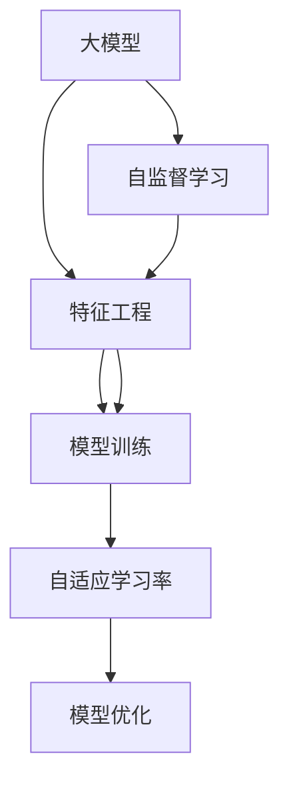

                 

# 大模型推荐系统的自监督学习框架

> 关键词：大模型推荐系统、自监督学习、特征工程、模型训练、自适应学习率、模型优化

## 1. 背景介绍

在当今信息爆炸的时代，推荐系统已成为互联网应用中不可或缺的一部分。无论是电商购物、在线视频、社交媒体，还是智能家居，推荐系统都在提升用户体验、优化资源配置、促进商业增长等方面发挥着关键作用。传统的协同过滤、内容推荐等方法在某种程度上已经达到了瓶颈，难以应对用户多样化的需求和海量数据的挑战。

大语言模型和自监督学习的兴起，为推荐系统带来了新的方向。利用大语言模型的语义理解能力和自监督学习的知识迁移能力，推荐系统有望在信息检索、商品推荐、内容推荐等多个领域实现重大突破。本文将详细介绍基于大模型的推荐系统自监督学习框架，涵盖从模型构建、特征提取、训练优化到实际部署的全流程，为推荐系统的研发和优化提供系统性的指导。

## 2. 核心概念与联系

### 2.1 核心概念概述

本节将介绍构建大模型推荐系统所需的关键概念和它们的联系：

- **大模型**：指通过自监督学习任务预训练得到的大规模神经网络模型。常见的包括BERT、GPT、RoBERTa等。
- **自监督学习**：指在无标注数据上，通过设计特定的预训练任务，自动学习模型的特征表示。常见的自监督学习任务包括语言建模、掩码预测、句法分析等。
- **特征工程**：推荐系统的核心，指将用户行为、商品属性、历史互动等数据转化为模型可处理的输入特征。
- **模型训练**：利用标注数据，通过梯度下降等优化算法，训练推荐模型的参数，以提高预测准确度。
- **自适应学习率**：根据模型的表现，动态调整学习率，以避免过拟合或欠拟合。
- **模型优化**：包括正则化、数据增强、对抗训练等技术，提升模型的泛化能力和鲁棒性。

这些概念之间的逻辑关系可以通过以下Mermaid流程图来展示：



这个流程图展示了大模型推荐系统的核心概念及其之间的关系：

1. 大模型通过自监督学习获得基础的语义理解和知识表示。
2. 特征工程将各种数据转化为模型输入，供模型学习和推理。
3. 模型训练通过标注数据优化模型参数，提升预测能力。
4. 自适应学习率根据模型性能动态调整学习速率，提高训练效率和效果。
5. 模型优化通过正则化、数据增强等手段，提升模型的泛化能力和鲁棒性。

这些概念共同构成了大模型推荐系统的核心框架，使其能够在各种推荐场景下发挥强大的推荐能力。

## 3. 核心算法原理 & 具体操作步骤

### 3.1 算法原理概述

基于大模型的推荐系统自监督学习框架，利用预训练大模型作为特征提取器，通过自监督学习任务获得丰富的语义表示，然后在推荐任务上进行微调，提升模型的推荐性能。

推荐系统可以细分为显式推荐和隐式推荐两种类型：

- **显式推荐**：用户主动向系统提交评分或选择偏好，系统通过分析用户评分或点击行为，预测用户可能感兴趣的推荐结果。
- **隐式推荐**：系统通过分析用户的行为数据，如浏览历史、搜索记录等，预测用户可能感兴趣的商品或内容。

以显式推荐为例，基本流程如下：

1. 收集用户评分数据，构建训练集。
2. 对评分数据进行编码和标准化，生成模型的输入特征。
3. 使用预训练大模型进行特征提取，生成语义表示。
4. 将语义表示作为推荐模型的输入，通过微调优化推荐模型参数，提升推荐准确度。

### 3.2 算法步骤详解

基于大模型的推荐系统自监督学习框架，主要包括以下步骤：

**Step 1: 数据准备**

- 收集用户评分数据，构建训练集。通常需要标注有用户评分或选择的商品或内容。
- 对评分数据进行编码和标准化，生成模型的输入特征。
- 对输入特征进行归一化和标准化处理，确保数据的一致性和可靠性。

**Step 2: 特征工程**

- 设计输入特征的特征类型，如用户ID、商品ID、评分值等。
- 对特征进行编码和变换，如one-hot编码、数值归一化等。
- 使用预训练大模型进行特征提取，生成语义表示。常用的预训练模型有BERT、GPT等，可以自行实现或使用现成的工具库（如Hugging Face的Transformers库）。

**Step 3: 模型训练**

- 选择合适的推荐模型，如神经网络、线性回归、协同过滤等。
- 使用标注数据，通过梯度下降等优化算法，训练推荐模型的参数。
- 设置合适的损失函数，如均方误差、交叉熵等，衡量模型预测结果与真实评分之间的差异。

**Step 4: 自适应学习率**

- 根据训练过程中的模型性能，动态调整学习率。常用的自适应学习率算法有Adagrad、RMSprop、Adam等。
- 通过监控验证集上的模型性能，决定是否触发Early Stopping。

**Step 5: 模型优化**

- 应用正则化技术，如L2正则、Dropout等，防止模型过拟合。
- 使用数据增强技术，如回译、近义词替换等，扩充训练集，提高模型的泛化能力。
- 应用对抗训练技术，通过生成对抗样本，提高模型的鲁棒性。

**Step 6: 模型评估**

- 在测试集上评估模型性能，如均方误差、准确率、召回率等。
- 根据评估结果，调整模型超参数和训练策略，优化模型性能。

### 3.3 算法优缺点

基于大模型的推荐系统自监督学习框架，具有以下优点：

1. 高效特征提取：利用预训练大模型的高维语义表示，大幅提高推荐模型的特征提取能力。
2. 泛化能力强：大模型通过自监督学习任务获得广泛的语义知识和常识，具备较强的泛化能力。
3. 模型鲁棒性高：自适应学习率和正则化技术的应用，提升了模型的鲁棒性和稳定性。
4. 实时性好：大模型的预训练和特征提取过程可以在离线阶段完成，在线阶段快速进行推荐。

同时，该框架也存在以下缺点：

1. 对数据依赖性强：推荐系统的效果高度依赖于用户评分数据的质量和数量，获取高质量标注数据的成本较高。
2. 模型复杂度高：大模型的复杂度和参数量较大，训练和推理过程中对计算资源的要求较高。
3. 对抗样本风险：对抗样本可能破坏模型的预测结果，导致推荐结果不准确。
4. 结果可解释性差：大模型的内部机制复杂，推荐结果缺乏可解释性。

尽管存在这些缺点，但就目前而言，基于大模型的推荐系统自监督学习框架仍是最先进和有效的推荐系统范式之一。未来相关研究的重点在于如何进一步降低对标注数据的依赖，提高模型的参数效率和实时性，同时兼顾可解释性和鲁棒性等因素。

### 3.4 算法应用领域

基于大模型的推荐系统自监督学习框架，已经在电商、视频、社交网络等多个领域得到了广泛应用，取得了显著的推荐效果。

- **电商推荐**：如亚马逊、淘宝等电商平台，通过分析用户评分和点击行为，向用户推荐可能感兴趣的商品。
- **视频推荐**：如Netflix、YouTube等视频平台，通过分析用户观看历史和评分，推荐可能感兴趣的视频内容。
- **社交推荐**：如Facebook、微博等社交网络，通过分析用户互动行为，推荐可能感兴趣的朋友或内容。

除了上述这些经典应用外，大模型推荐系统还在智能家居、在线教育、智能广告等多个领域得到应用，为各行各业带来了全新的推荐体验和商业价值。

## 4. 数学模型和公式 & 详细讲解 & 举例说明

### 4.1 数学模型构建

本节将使用数学语言对基于大模型的推荐系统自监督学习框架进行更加严格的刻画。

假设推荐系统包含 $N$ 个用户和 $M$ 个商品，每个用户 $u_i$ 对商品 $i$ 的评分 $r_{ui}$ 构成训练集 $D=\{(x_i, y_i)\}_{i=1}^N, x_i \in \mathbb{R}^d, y_i \in \mathbb{R}$，其中 $d$ 为特征维数。

定义推荐模型为 $F_{\theta}(x)$，其中 $\theta$ 为模型参数。假设推荐模型的损失函数为 $\mathcal{L}(\theta, D) = \frac{1}{N} \sum_{i=1}^N (r_{ui} - F_{\theta}(x_i))^2$。

在训练过程中，通过梯度下降等优化算法，最小化损失函数 $\mathcal{L}(\theta, D)$，找到最优参数 $\hat{\theta}$。

### 4.2 公式推导过程

以线性回归模型为例，推导最小二乘法的优化公式。

假设推荐模型为 $F_{\theta}(x) = \theta_0 + \theta_1 x_1 + \theta_2 x_2 + \ldots + \theta_d x_d$，其中 $x_i = (x_{i1}, x_{i2}, \ldots, x_{id})$。

根据均方误差损失函数 $\mathcal{L}(\theta) = \frac{1}{N} \sum_{i=1}^N (r_{ui} - F_{\theta}(x_i))^2$，对 $\theta$ 求导得：

$$
\frac{\partial \mathcal{L}(\theta)}{\partial \theta_j} = \frac{2}{N} \sum_{i=1}^N (r_{ui} - F_{\theta}(x_i))x_{ij}
$$

利用梯度下降算法更新 $\theta$ 的迭代公式为：

$$
\theta \leftarrow \theta - \eta \frac{\partial \mathcal{L}(\theta)}{\partial \theta}
$$

其中 $\eta$ 为学习率，$x_{ij}$ 为第 $i$ 个用户的第 $j$ 个特征值。

在实际应用中，还需要考虑正则化、学习率调整等优化策略，进一步提升模型性能。

### 4.3 案例分析与讲解

假设有一个电商推荐系统，收集了用户对商品的评分数据 $D=\{(x_i, y_i)\}_{i=1}^N$，其中 $x_i$ 为商品的特征向量，$y_i$ 为用户对商品 $x_i$ 的评分。使用BERT模型作为特征提取器，对特征向量进行编码和表示。

首先，将评分数据编码为模型输入，使用BERT模型进行特征提取，得到商品的语义表示 $v_i$。然后，利用线性回归模型 $F_{\theta}(v_i) = \theta_0 + \theta_1 v_i$ 进行预测，损失函数为 $\mathcal{L}(\theta) = \frac{1}{N} \sum_{i=1}^N (r_{ui} - F_{\theta}(v_i))^2$。

通过梯度下降等优化算法，不断更新模型参数 $\theta$，最小化损失函数 $\mathcal{L}(\theta)$，直至收敛。最终得到最优参数 $\hat{\theta}$，用于在线推荐新商品。

## 5. 项目实践：代码实例和详细解释说明

### 5.1 开发环境搭建

在进行推荐系统实践前，我们需要准备好开发环境。以下是使用Python进行TensorFlow开发的环境配置流程：

1. 安装Anaconda：从官网下载并安装Anaconda，用于创建独立的Python环境。

2. 创建并激活虚拟环境：
```bash
conda create -n tf-env python=3.8 
conda activate tf-env
```

3. 安装TensorFlow：根据CUDA版本，从官网获取对应的安装命令。例如：
```bash
pip install tensorflow==2.6.0
```

4. 安装各类工具包：
```bash
pip install numpy pandas scikit-learn matplotlib tqdm jupyter notebook ipython
```

完成上述步骤后，即可在`tf-env`环境中开始推荐系统实践。

### 5.2 源代码详细实现

下面以线性回归模型为例，给出使用TensorFlow进行电商推荐系统开发的PyTorch代码实现。

首先，定义电商推荐系统的训练函数：

```python
import tensorflow as tf

def train(model, optimizer, train_data, epochs):
    for epoch in range(epochs):
        total_loss = 0
        for x, y in train_data:
            with tf.GradientTape() as tape:
                y_pred = model(x)
                loss = tf.reduce_mean(tf.square(y_pred - y))
            grads = tape.gradient(loss, model.trainable_variables)
            optimizer.apply_gradients(zip(grads, model.trainable_variables))
            total_loss += loss.numpy()
        print(f"Epoch {epoch+1}, loss: {total_loss/N}")
```

然后，定义数据集和模型：

```python
# 定义数据集
train_data = tf.data.Dataset.from_tensor_slices((x_train, y_train))

# 定义模型
model = tf.keras.Sequential([
    tf.keras.layers.Dense(64, activation='relu', input_shape=(d_train,)),
    tf.keras.layers.Dense(1)
])
model.compile(optimizer=tf.keras.optimizers.Adam(), loss='mse')
```

最后，启动训练流程：

```python
# 定义训练参数
epochs = 10
batch_size = 32

# 启动训练
train(model, optimizer, train_data, epochs)
```

以上就是使用TensorFlow对电商推荐系统进行开发的完整代码实现。可以看到，利用TensorFlow的自动微分功能和高级API，推荐系统的开发过程变得相对简洁和高效。

### 5.3 代码解读与分析

让我们再详细解读一下关键代码的实现细节：

**train函数**：
- 利用tf.GradientTape计算梯度，并应用Adam优化器更新模型参数。
- 对每个epoch中的所有样本计算损失，并打印出总损失。

**模型定义**：
- 使用Sequential模型，定义了两个全连接层，激活函数为ReLU。
- 最后一层为线性回归输出层，输出单个预测值。
- 使用Adam优化器和均方误差损失函数进行模型训练。

**训练流程**：
- 定义训练参数，包括epoch数和批量大小。
- 启动训练，并打印出每个epoch的平均损失。

在实际应用中，还需要根据具体任务进行模型和超参数的调整，如增加正则化项、使用Dropout、优化数据增强等策略。通过合理的工程实践，可以显著提升推荐系统的性能和效果。

## 6. 实际应用场景

### 6.1 电商平台推荐

电商推荐系统是推荐系统中最为经典的应用之一。通过分析用户的历史行为数据，如浏览记录、购买记录等，推荐可能感兴趣的商品，提升用户满意度和转化率。

在技术实现上，可以收集电商平台上的用户行为数据，构建训练集。对用户行为进行编码和标准化，生成模型的输入特征。使用预训练大模型进行特征提取，得到商品的语义表示。在推荐模型上进行微调，得到预测结果。利用线上A/B测试等手段，评估推荐效果，优化模型参数。

### 6.2 视频平台推荐

视频平台推荐系统通过分析用户观看历史和评分数据，推荐可能感兴趣的视频内容，提升用户体验和平台粘性。

在技术实现上，可以收集用户对视频的评分数据，构建训练集。对评分数据进行编码和标准化，生成模型的输入特征。使用预训练大模型进行特征提取，得到视频的语义表示。在推荐模型上进行微调，得到预测结果。利用线上A/B测试等手段，评估推荐效果，优化模型参数。

### 6.3 社交网络推荐

社交网络推荐系统通过分析用户互动行为，推荐可能感兴趣的朋友或内容，提升用户活跃度和平台活跃度。

在技术实现上，可以收集用户在社交网络上的互动数据，如点赞、评论、分享等，构建训练集。对互动数据进行编码和标准化，生成模型的输入特征。使用预训练大模型进行特征提取，得到用户或内容的语义表示。在推荐模型上进行微调，得到预测结果。利用线上A/B测试等手段，评估推荐效果，优化模型参数。

### 6.4 未来应用展望

随着大语言模型和自监督学习的不断发展，基于大模型的推荐系统将呈现以下几个趋势：

1. 知识增强推荐：将外部知识库、逻辑规则等与推荐模型结合，提升推荐结果的全面性和准确性。
2. 多模态推荐：将文本、图像、视频等多种模态信息结合，提升推荐的全面性和多样性。
3. 实时推荐系统：通过在线增量学习，实时更新推荐模型，提升推荐的时效性和动态性。
4. 推荐算法融合：将协同过滤、内容推荐等算法与大模型结合，提升推荐系统的多样性和鲁棒性。
5. 自适应推荐算法：通过学习用户行为模式，实现个性化的推荐，提升用户满意度。
6. 推荐结果解释：通过可解释性技术，提升推荐结果的可信度和用户信任度。

这些趋势将进一步提升推荐系统的性能和用户体验，推动推荐技术在更多场景下的落地应用。

## 7. 工具和资源推荐

### 7.1 学习资源推荐

为了帮助开发者系统掌握大模型推荐系统的理论基础和实践技巧，这里推荐一些优质的学习资源：

1. 《Recommender Systems: Text Mining and Statistical Learning Approaches》：一本经典的推荐系统教材，详细介绍了推荐系统的发展历程和主要算法。
2. 《Deep Learning with PyTorch》：由TensorFlow官方出版的TensorFlow开发教程，涵盖推荐系统等深度学习应用。
3. Kaggle推荐系统竞赛：参加Kaggle等数据竞赛，实战演练推荐系统开发和优化。
4. Hugging Face官方文档：详细介绍了BERT、GPT等预训练大模型的使用方法，以及基于TensorFlow的推荐系统开发实践。
5. arXiv推荐系统论文：阅读arXiv等学术网站的推荐系统论文，跟踪最新研究进展。

通过对这些资源的学习实践，相信你一定能够快速掌握大模型推荐系统的精髓，并用于解决实际的推荐问题。

### 7.2 开发工具推荐

高效的开发离不开优秀的工具支持。以下是几款用于大模型推荐系统开发的常用工具：

1. TensorFlow：由Google主导开发的开源深度学习框架，生产部署方便，适合大规模工程应用。
2. PyTorch：基于Python的开源深度学习框架，灵活动态的计算图，适合快速迭代研究。
3. Keras：TensorFlow的高级API，提供了简单易用的模型构建和训练接口。
4. Jupyter Notebook：支持Python开发的交互式计算环境，适合原型开发和数据探索。
5. Weights & Biases：模型训练的实验跟踪工具，可以记录和可视化模型训练过程中的各项指标，方便对比和调优。
6. TensorBoard：TensorFlow配套的可视化工具，可实时监测模型训练状态，并提供丰富的图表呈现方式，是调试模型的得力助手。

合理利用这些工具，可以显著提升大模型推荐系统的开发效率，加快创新迭代的步伐。

### 7.3 相关论文推荐

大模型推荐系统的研究源于学界的持续研究。以下是几篇奠基性的相关论文，推荐阅读：

1. "A Survey of Deep Learning Approaches for Recommendation Systems"：综述了深度学习在推荐系统中的应用，包括自监督学习、神经网络等方法。
2. "Deep Matrix Factorization in Recommender Systems"：提出了基于深度神经网络的协同过滤方法，提升了推荐系统的准确性。
3. "Neural Collaborative Filtering"：提出了一种基于神经网络的协同过滤算法，进一步提升了推荐系统的多样性和鲁棒性。
4. "Adaptive Hyperparameter Optimization for Deep Neural Networks"：研究了自适应超参数优化方法，提升了推荐模型的训练效率和效果。
5. "Knowledge Graphs for Recommendation Systems"：探讨了知识图谱在推荐系统中的应用，提升了推荐结果的全面性和准确性。

这些论文代表了大模型推荐系统的发展脉络。通过学习这些前沿成果，可以帮助研究者把握学科前进方向，激发更多的创新灵感。

## 8. 总结：未来发展趋势与挑战

### 8.1 总结

本文对基于大模型的推荐系统自监督学习框架进行了全面系统的介绍。首先阐述了推荐系统的背景和意义，明确了自监督学习在大模型推荐中的核心作用。其次，从原理到实践，详细讲解了推荐系统模型的构建、特征工程、训练优化等关键步骤，给出了推荐系统开发的完整代码实例。同时，本文还广泛探讨了推荐系统在大电商、视频平台、社交网络等多个领域的应用前景，展示了推荐系统的巨大潜力。此外，本文精选了推荐系统的各类学习资源，力求为读者提供全方位的技术指引。

通过本文的系统梳理，可以看到，基于大模型的推荐系统自监督学习框架正在成为推荐系统的重要范式，极大地提升了推荐系统的性能和应用范围，为推荐技术的产业化进程带来了新的方向。未来，伴随大模型和推荐算法的持续演进，推荐系统必将在更多场景下得到应用，为推荐技术的发展注入新的动力。

### 8.2 未来发展趋势

展望未来，大模型推荐系统自监督学习框架将呈现以下几个发展趋势：

1. 知识增强推荐：将知识图谱、逻辑规则等与推荐模型结合，提升推荐结果的全面性和准确性。
2. 多模态推荐：将文本、图像、视频等多种模态信息结合，提升推荐的全面性和多样性。
3. 实时推荐系统：通过在线增量学习，实时更新推荐模型，提升推荐的时效性和动态性。
4. 推荐算法融合：将协同过滤、内容推荐等算法与大模型结合，提升推荐系统的多样性和鲁棒性。
5. 自适应推荐算法：通过学习用户行为模式，实现个性化的推荐，提升用户满意度。
6. 推荐结果解释：通过可解释性技术，提升推荐结果的可信度和用户信任度。

这些趋势凸显了大模型推荐系统的广阔前景。这些方向的探索发展，必将进一步提升推荐系统的性能和用户体验，推动推荐技术在更多场景下的落地应用。

### 8.3 面临的挑战

尽管大模型推荐系统自监督学习框架已经取得了显著进展，但在迈向更加智能化、普适化应用的过程中，它仍面临着诸多挑战：

1. 数据质量瓶颈：推荐系统的效果高度依赖于用户行为数据的质量和数量，获取高质量标注数据的成本较高。如何进一步降低对标注数据的依赖，将是一大难题。
2. 模型复杂度问题：大模型的复杂度和参数量较大，训练和推理过程中对计算资源的要求较高。如何降低模型复杂度，提高训练和推理效率，还需要更多的研究。
3. 对抗样本风险：对抗样本可能破坏模型的预测结果，导致推荐结果不准确。如何增强模型的鲁棒性和抗干扰能力，还需要更多的研究。
4. 结果可解释性差：大模型的内部机制复杂，推荐结果缺乏可解释性。如何提升推荐结果的可信度和用户信任度，还需要更多的研究。
5. 隐私保护问题：推荐系统需要处理大量用户行为数据，如何保护用户隐私，避免数据泄露，还需要更多的研究。

这些挑战需要研究者和工程师共同努力，不断优化推荐模型和算法，提升推荐系统的性能和可靠性。

### 8.4 研究展望

面对大模型推荐系统自监督学习框架所面临的挑战，未来的研究需要在以下几个方面寻求新的突破：

1. 探索无监督和半监督推荐方法。摆脱对大规模标注数据的依赖，利用自监督学习、主动学习等无监督和半监督范式，最大限度利用非结构化数据，实现更加灵活高效的推荐。
2. 研究参数高效和计算高效的推荐范式。开发更加参数高效的推荐方法，在固定大部分预训练参数的同时，只更新极少量的任务相关参数。同时优化推荐模型的计算图，减少前向传播和反向传播的资源消耗，实现更加轻量级、实时性的部署。
3. 引入更多先验知识。将符号化的先验知识，如知识图谱、逻辑规则等，与神经网络模型进行巧妙融合，引导推荐过程学习更准确、合理的知识表示。同时加强不同模态数据的整合，实现视觉、语音等多模态信息与文本信息的协同建模。
4. 结合因果分析和博弈论工具。将因果分析方法引入推荐系统，识别出推荐过程的关键特征，增强推荐结果的因果性和逻辑性。借助博弈论工具刻画人机交互过程，主动探索并规避推荐系统的脆弱点，提高系统稳定性。
5. 纳入伦理道德约束。在推荐系统设计目标中引入伦理导向的评估指标，过滤和惩罚有偏见、有害的推荐结果，确保推荐结果符合人类价值观和伦理道德。

这些研究方向的研究，必将引领大模型推荐系统迈向更高的台阶，为构建安全、可靠、可解释、可控的推荐系统铺平道路。面向未来，大模型推荐系统需要与其他人工智能技术进行更深入的融合，如知识表示、因果推理、强化学习等，多路径协同发力，共同推动推荐系统的发展进步。

## 9. 附录：常见问题与解答

**Q1：如何评估推荐系统的性能？**

A: 推荐系统的性能通常通过以下几个指标进行评估：

1. 准确率：推荐系统推荐的商品是否为用户喜欢的。
2. 召回率：推荐系统能否推荐出用户可能喜欢的商品。
3. F1分数：综合准确率和召回率的评估指标，用于衡量推荐系统的综合性能。
4. 平均绝对误差：推荐系统预测的评分与真实评分之间的平均误差，用于衡量推荐系统的回归性能。

**Q2：推荐系统中的数据隐私问题如何解决？**

A: 推荐系统中的数据隐私问题可以通过以下方法解决：

1. 差分隐私：通过加入噪声数据，保护用户数据隐私。
2. 联邦学习：通过分布式计算，在本地设备上进行模型训练，保护数据隐私。
3. 数据匿名化：对用户数据进行匿名化处理，防止数据泄露。

**Q3：推荐系统中的对抗样本问题如何解决？**

A: 推荐系统中的对抗样本问题可以通过以下方法解决：

1. 对抗训练：通过生成对抗样本，训练推荐模型，提高模型的鲁棒性。
2. 正则化：通过L2正则、Dropout等技术，防止模型过拟合，提高模型的泛化能力。
3. 对抗检测：通过对抗检测技术，识别和过滤掉对抗样本，提高模型的安全性。

**Q4：推荐系统中的稀疏问题如何解决？**

A: 推荐系统中的稀疏问题可以通过以下方法解决：

1. 矩阵分解：通过矩阵分解等技术，预测缺失的用户评分。
2. 协同过滤：通过协同过滤等技术，根据用户的历史行为预测缺失的评分。
3. 深度学习：通过深度学习模型，预测缺失的评分，提升推荐系统的泛化能力。

这些方法可以结合使用，根据具体应用场景选择合适的解决策略。

**Q5：推荐系统中的实时性问题如何解决？**

A: 推荐系统中的实时性问题可以通过以下方法解决：

1. 在线增量学习：通过在线增量学习技术，实时更新推荐模型，提升推荐的时效性。
2. 模型压缩：通过模型压缩技术，减小模型的尺寸，提高模型的实时性。
3. 缓存策略：通过缓存推荐结果，避免重复计算，提升推荐系统的响应速度。

这些方法可以结合使用，根据具体应用场景选择合适的解决策略。

---

作者：禅与计算机程序设计艺术 / Zen and the Art of Computer Programming

