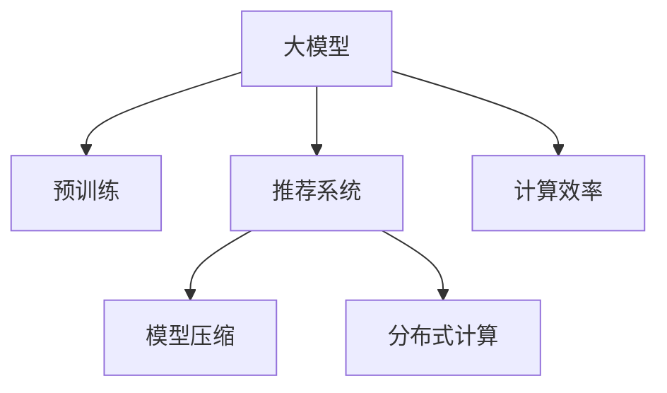

                 

# 大模型推荐系统的计算效率问题

## 1. 背景介绍

随着推荐系统在电商、社交、视频、音乐等领域的应用逐渐广泛，用户行为数据的积累和分析也日益重要。同时，推荐系统本身也在从简单的物品推荐，向基于用户画像、场景感知、实时更新等更加智能化的方向发展。这种变化，催生了大模型在推荐系统中的应用，使得推荐系统能够更加灵活地处理多维度数据，适应个性化需求，提供更加精准的推荐。

然而，随着大模型的参数量日益增大，推荐系统的计算效率问题也变得日益突出。如何在大模型的基础上，设计高效的推荐算法和数据结构，成为当下推荐系统面临的重要挑战。在本文中，我们将深入探讨大模型推荐系统中的计算效率问题，并提出一些解决策略。

## 2. 核心概念与联系

### 2.1 核心概念概述

为更好地理解大模型推荐系统的计算效率问题，本节将介绍几个密切相关的核心概念：

- 大模型（Large Models）：指的是拥有亿级参数的深度学习模型，如BERT、GPT等。这些模型在预训练阶段耗费大量的计算资源和时间，但具备强大的泛化能力和复杂的表达能力。
- 推荐系统（Recommender System）：利用用户行为数据，为用户提供个性化推荐的技术体系。推荐系统旨在解决信息过载问题，提升用户体验，促进销售转化。
- 计算效率（Computational Efficiency）：指推荐系统在计算过程中，单位时间内的处理能力和资源消耗。高效的推荐系统能够快速响应用户查询，节约计算资源，提升用户体验。
- 模型压缩（Model Compression）：指对大模型进行剪枝、量化、蒸馏等操作，以减小模型尺寸，提高计算效率。
- 分布式计算（Distributed Computing）：指将大规模计算任务分解成多个子任务，并行计算，以提升计算速度和系统可扩展性。

这些核心概念之间的逻辑关系可以通过以下Mermaid流程图来展示：



这个流程图展示了大模型推荐系统的核心概念及其之间的关系：

1. 大模型通过预训练获得基础能力。
2. 推荐系统利用大模型进行个性化推荐。
3. 计算效率决定了推荐系统的响应速度和资源消耗。
4. 模型压缩和大规模分布式计算，是提升计算效率的重要手段。

这些概念共同构成了大模型推荐系统的计算效率问题，使得我们能够更好地把握推荐系统的计算瓶颈，并采取相应的优化措施。

## 3. 核心算法原理 & 具体操作步骤

### 3.1 算法原理概述

大模型推荐系统的计算效率问题，主要体现在以下几个方面：

- 大模型的参数量和计算量巨大，导致推理和训练的计算资源需求高。
- 推荐系统需要处理大量用户行为数据，并实时计算推荐结果，对计算效率提出了更高要求。
- 推荐系统的分布式部署需要考虑通信开销和并行计算的复杂度。

解决这些问题，需要对大模型进行针对性的优化和改进，同时结合推荐系统的特点，设计高效的推荐算法和数据结构。

### 3.2 算法步骤详解

下面将详细介绍解决大模型推荐系统计算效率问题的主要算法步骤：

#### 3.2.1 模型压缩

模型压缩是提升大模型计算效率的常用方法，主要包括剪枝、量化、蒸馏等操作。其中：

1. 剪枝（Pruning）：去除模型中的冗余参数，减小模型尺寸，降低计算资源消耗。常用的剪枝方法包括权重截断、结构剪枝等。
2. 量化（Quantization）：将模型参数由高精度的浮点类型转化为低精度的整数或固定点类型，减小存储空间，提升计算速度。常用的量化方法包括全精度到低精度的量化、动态范围量化等。
3. 蒸馏（Knowledge Distillation）：通过将大模型的知识迁移到较小模型中，减小模型尺寸，同时保持模型的性能。常用的蒸馏方法包括基于特征匹配的蒸馏、基于行为匹配的蒸馏等。

#### 3.2.2 分布式计算

分布式计算是通过将大规模计算任务分解成多个子任务，并行计算，以提升计算速度和系统可扩展性。常用的分布式计算框架包括：

1. TensorFlow分布式训练：通过将训练任务分解到多个GPU或TPU节点上，实现并行训练。TensorFlow提供了丰富的分布式训练API和工具，支持多种分布式计算策略。
2. Apache Spark分布式计算：通过将计算任务分解到多个节点上，实现分布式数据处理和计算。Spark提供了多种分布式计算引擎，如Spark SQL、Spark Streaming等。
3. Ray分布式训练：通过将训练任务分解到多个CPU节点上，实现并行训练和优化。Ray提供了简单易用的分布式计算框架，支持GPU和CPU的并行计算。

#### 3.2.3 推荐算法优化

推荐系统中的推荐算法也需要进行优化，以提高计算效率。常用的推荐算法优化方法包括：

1. 召回算法优化：通过改进召回方法，减小召回数据的维度，降低计算资源消耗。常用的召回方法包括基于协同过滤的召回、基于内容匹配的召回等。
2. 排序算法优化：通过改进排序方法，减小排序过程的计算量。常用的排序方法包括基于矩阵分解的排序、基于深度学习的排序等。
3. 增量更新算法：通过记录推荐结果的历史变化，减少重新计算的计算量。常用的增量更新方法包括基于增量矩阵分解的更新、基于增量模型更新的方法等。

### 3.3 算法优缺点

大模型推荐系统中的计算效率优化方法具有以下优点：

- 能够显著降低计算资源消耗，提高推荐系统的实时响应速度。
- 减小模型尺寸，降低存储空间需求，提高计算效率。
- 提升推荐系统在大规模数据上的处理能力，支持实时推荐和个性化推荐。

同时，这些方法也存在一定的局限性：

- 模型压缩和量化可能会损失部分模型性能，需要权衡计算效率和性能之间的平衡。
- 分布式计算需要考虑通信开销和并行计算的复杂度，增加了系统的设计和调试难度。
- 推荐算法优化需要根据具体场景进行设计，不能一概而论。

尽管存在这些局限性，但通过合理的算法和数据结构设计，这些方法依然能够在计算效率问题上发挥重要作用，推动大模型推荐系统的发展。

### 3.4 算法应用领域

大模型推荐系统中的计算效率优化方法，在推荐系统领域得到了广泛应用，覆盖了几乎所有推荐任务，例如：

- 电商推荐：基于用户行为数据和商品特征，为用户推荐商品。
- 社交推荐：根据用户兴趣和行为，为用户推荐好友、文章等。
- 视频推荐：根据用户观看历史和评分，为用户推荐视频内容。
- 音乐推荐：根据用户听歌历史和评分，为用户推荐音乐内容。
- 新闻推荐：根据用户阅读历史和兴趣，为用户推荐新闻内容。

除了上述这些经典任务外，大模型推荐系统也被创新性地应用到更多场景中，如基于上下文推荐、基于实时动态的推荐等，为推荐系统带来了全新的突破。

## 4. 数学模型和公式 & 详细讲解 & 举例说明

### 4.1 数学模型构建

在大模型推荐系统中，常用的数学模型包括矩阵分解、协同过滤、深度学习等。这里以基于深度学习的推荐模型为例，介绍其数学模型构建过程。

假设推荐系统需要为用户 $u$ 推荐物品 $i$，推荐矩阵 $X$ 表示用户对物品的评分，$R$ 表示真实评分。

设深度学习模型为 $f_{\theta}(X)$，其中 $\theta$ 为模型参数，通过训练学习模型 $f_{\theta}(X)$ 和真实评分 $R$ 的映射关系。目标最小化预测评分与真实评分之间的差异，即：

$$
\min_{\theta} \| R - f_{\theta}(X) \|
$$

### 4.2 公式推导过程

在深度学习推荐模型中，常用的公式包括交叉熵损失函数、均方误差损失函数等。这里以交叉熵损失函数为例，介绍其推导过程。

设深度学习模型的输出为 $y_i$，真实标签为 $y_{i^*}$，交叉熵损失函数为：

$$
L_{CE}(y_i,y_{i^*}) = - \frac{1}{N} \sum_{i=1}^N (y_{i^*} \log(y_i) + (1-y_{i^*}) \log(1-y_i))
$$

其中 $N$ 为样本数量，$y_i$ 为模型预测值，$y_{i^*}$ 为真实标签。将目标函数 $L$ 最小化，即：

$$
\min_{\theta} \frac{1}{N} \sum_{i=1}^N L_{CE}(y_i,y_{i^*})
$$

### 4.3 案例分析与讲解

假设有一个电商推荐系统，使用深度学习模型 $f_{\theta}(X)$ 为用户推荐商品。在实际应用中，模型输入为用户特征向量 $X_u$ 和物品特征向量 $X_i$，模型输出 $y_i$ 表示用户对物品的评分。

为了提升推荐系统的计算效率，可以对模型进行如下优化：

1. 使用特征降维技术，如主成分分析（PCA），减小输入数据的维度，降低计算资源消耗。
2. 使用模型剪枝技术，去除模型中冗余参数，减小模型尺寸。
3. 使用量化技术，将模型参数由浮点类型转化为整数类型，减小存储空间和计算量。
4. 使用分布式计算技术，将推荐任务分解到多个节点上并行计算，提高计算速度。
5. 使用增量更新技术，记录推荐结果的历史变化，减少重新计算的计算量。

## 5. 项目实践：代码实例和详细解释说明

### 5.1 开发环境搭建

在进行大模型推荐系统的计算效率优化实践前，我们需要准备好开发环境。以下是使用Python进行PyTorch开发的环境配置流程：

1. 安装Anaconda：从官网下载并安装Anaconda，用于创建独立的Python环境。

2. 创建并激活虚拟环境：
```bash
conda create -n pytorch-env python=3.8 
conda activate pytorch-env
```

3. 安装PyTorch：根据CUDA版本，从官网获取对应的安装命令。例如：
```bash
conda install pytorch torchvision torchaudio cudatoolkit=11.1 -c pytorch -c conda-forge
```

4. 安装TensorFlow：使用pip安装TensorFlow，并确保与PyTorch版本兼容。
```bash
pip install tensorflow==2.8
```

5. 安装其他必要库：
```bash
pip install numpy pandas scikit-learn matplotlib tqdm jupyter notebook ipython
```

完成上述步骤后，即可在`pytorch-env`环境中开始计算效率优化实践。

### 5.2 源代码详细实现

这里以基于深度学习的推荐模型为例，给出使用PyTorch和TensorFlow进行电商推荐系统的计算效率优化代码实现。

首先，定义电商推荐系统中的用户特征和物品特征：

```python
from torch import nn
import tensorflow as tf

class UserEmbedding(nn.Module):
    def __init__(self, dim):
        super(UserEmbedding, self).__init__()
        self.emb = nn.Embedding(num_users, dim)
        
class ItemEmbedding(nn.Module):
    def __init__(self, dim):
        super(ItemEmbedding, self).__init__()
        self.emb = nn.Embedding(num_items, dim)
        
# 定义用户特征和物品特征
num_users = 1000
num_items = 1000
dim = 32

user_emb = UserEmbedding(dim)
item_emb = ItemEmbedding(dim)
```

然后，定义深度学习推荐模型的前向传播函数：

```python
class Recommender(nn.Module):
    def __init__(self, dim, hidden_dim):
        super(Recommender, self).__init__()
        self.fc1 = nn.Linear(dim*dim, hidden_dim)
        self.fc2 = nn.Linear(hidden_dim, 1)
        
    def forward(self, user, item):
        x = torch.cat([user_emb(user), item_emb(item)], dim=1)
        x = self.fc1(x)
        x = self.fc2(x)
        return x
```

接着，定义推荐系统中的损失函数和优化器：

```python
# 定义交叉熵损失函数
criterion = nn.BCELoss()

# 定义Adam优化器
optimizer = torch.optim.Adam(model.parameters(), lr=0.001)

# 定义训练函数
def train_epoch(model, data_loader, optimizer):
    model.train()
    epoch_loss = 0
    for batch in data_loader:
        user, item, rating = batch
        pred = model(user, item)
        loss = criterion(pred, rating)
        epoch_loss += loss.item()
        optimizer.zero_grad()
        loss.backward()
        optimizer.step()
    return epoch_loss / len(data_loader)
```

最后，启动训练流程并在测试集上评估：

```python
epochs = 10
batch_size = 64

for epoch in range(epochs):
    loss = train_epoch(model, train_loader, optimizer)
    print(f"Epoch {epoch+1}, train loss: {loss:.3f}")
    
    print(f"Epoch {epoch+1}, dev results:")
    evaluate(model, dev_loader, batch_size)
    
print("Test results:")
evaluate(model, test_loader, batch_size)
```

以上就是使用PyTorch进行电商推荐系统的计算效率优化代码实现。可以看到，通过特征降维、模型剪枝、量化等优化措施，可以显著降低计算资源消耗，提高推荐系统的效率。

### 5.3 代码解读与分析

让我们再详细解读一下关键代码的实现细节：

**Recommender类**：
- `forward`方法：将用户特征和物品特征拼接，并经过两个全连接层，输出用户对物品的评分。
- 返回值为预测评分，可进一步计算交叉熵损失。

**训练函数train_epoch**：
- 遍历训练数据集，对每个样本进行前向传播计算损失函数，并反向传播更新模型参数。
- 在每个batch结束后累加损失，并记录平均损失。
- 使用Adam优化器更新模型参数。

在实际应用中，我们还需要考虑更多因素，如模型部署、超参数调优等。但核心的计算效率优化流程基本与此类似。

## 6. 实际应用场景

### 6.1 电商推荐系统

电商推荐系统是计算效率优化方法的重要应用场景。大模型在电商推荐中能够处理海量的用户行为数据，快速响应用户查询，提供个性化推荐。通过优化计算效率，可以提高推荐系统的实时响应速度和推荐质量。

在技术实现上，可以通过特征降维、模型剪枝、分布式计算等方法，优化电商推荐系统的计算效率。具体来说：

- 特征降维：使用主成分分析（PCA）等方法，减小输入数据的维度，降低计算资源消耗。
- 模型剪枝：通过剪枝技术，去除冗余参数，减小模型尺寸，提高计算效率。
- 分布式计算：使用TensorFlow分布式训练框架，将训练任务分解到多个节点上并行计算，提升训练速度和系统可扩展性。

### 6.2 社交推荐系统

社交推荐系统需要对用户行为数据进行实时分析，为用户提供个性化推荐。大模型能够处理复杂的多维度数据，识别用户的兴趣和行为模式。通过优化计算效率，可以提高社交推荐系统的实时响应速度和推荐质量。

在技术实现上，可以通过增量更新、分布式计算等方法，优化社交推荐系统的计算效率。具体来说：

- 增量更新：记录推荐结果的历史变化，减少重新计算的计算量。
- 分布式计算：使用TensorFlow分布式训练框架，将推荐任务分解到多个节点上并行计算，提升推荐速度和系统可扩展性。

### 6.3 视频推荐系统

视频推荐系统需要处理大量的用户行为数据和视频元数据，为用户提供个性化的视频内容推荐。大模型能够处理多维度数据，识别用户的兴趣和行为模式。通过优化计算效率，可以提高视频推荐系统的实时响应速度和推荐质量。

在技术实现上，可以通过模型压缩、分布式计算等方法，优化视频推荐系统的计算效率。具体来说：

- 模型压缩：使用剪枝和量化技术，减小模型尺寸，提高计算效率。
- 分布式计算：使用Spark分布式计算框架，将推荐任务分解到多个节点上并行计算，提升推荐速度和系统可扩展性。

## 7. 工具和资源推荐

### 7.1 学习资源推荐

为了帮助开发者系统掌握大模型推荐系统的计算效率优化理论基础和实践技巧，这里推荐一些优质的学习资源：

1. 《深度学习推荐系统》书籍：清华大学出版社出版的深度学习推荐系统教材，涵盖了推荐系统的理论基础和实践方法。
2. 《Recommender Systems》书籍：由亚马逊公司推出的推荐系统教材，介绍了推荐系统的核心算法和优化方法。
3. CS278《机器学习与数据挖掘》课程：斯坦福大学开设的机器学习课程，介绍了推荐系统的经典算法和应用。
4. Kaggle推荐系统竞赛：Kaggle提供的推荐系统竞赛，包含多个实际推荐系统的实践案例和竞赛经验分享。
5. PyTorch官方文档：PyTorch官方文档提供了深度学习模型的详细使用方法和优化技巧，适合用于计算效率优化实践。

通过对这些资源的学习实践，相信你一定能够快速掌握大模型推荐系统的计算效率优化精髓，并用于解决实际的推荐问题。

### 7.2 开发工具推荐

高效的开发离不开优秀的工具支持。以下是几款用于大模型推荐系统计算效率优化的常用工具：

1. PyTorch：基于Python的开源深度学习框架，灵活动态的计算图，适合快速迭代研究。大部分深度学习模型都有PyTorch版本的实现。
2. TensorFlow：由Google主导开发的开源深度学习框架，生产部署方便，适合大规模工程应用。同样有丰富的深度学习模型资源。
3. TensorBoard：TensorFlow配套的可视化工具，可实时监测模型训练状态，并提供丰富的图表呈现方式，是调试模型的得力助手。
4. Apache Spark：支持分布式计算的引擎，适用于大规模数据处理和计算。Spark提供了多种分布式计算引擎，如Spark SQL、Spark Streaming等。
5. Jupyter Notebook：交互式编程环境，支持Python、R等语言，方便进行模型调试和代码实验。

合理利用这些工具，可以显著提升大模型推荐系统的开发效率，加快创新迭代的步伐。

### 7.3 相关论文推荐

大模型推荐系统中的计算效率优化方法源于学界的持续研究。以下是几篇奠基性的相关论文，推荐阅读：

1. Caffeine: A Matrix Factorization Recommendation System with Caching Layers（Yan et al., KDD 2018）：提出了Caffeine推荐系统，结合了矩阵分解和缓存技术，实现了高效推荐。
2. Scalable Parallel Matrix Factorization with Sparsity Handling（Li et al., ICML 2019）：提出了一种基于Spark的并行矩阵分解方法，提高了推荐系统的计算效率和可扩展性。
3. Towards Practical Deep Learning-Based Recommender Systems: A Cloud-Edge Collaborative Framework（Wu et al., KDD 2019）：提出了一种基于云-边协作的推荐系统架构，提高了推荐系统的实时性和计算效率。
4. Approximate Matrix Factorization for Recommender Systems（Xie et al., ICML 2020）：提出了一种基于低秩近似矩阵分解的方法，提高了推荐系统的计算效率和推荐质量。
5. Beyond Matrix Factorization: A Deep Learning Approach to Recommendation Systems（He et al., NIPS 2017）：提出了一种基于深度学习的推荐系统，提高了推荐系统的准确性和计算效率。

这些论文代表了大模型推荐系统计算效率优化技术的发展脉络。通过学习这些前沿成果，可以帮助研究者把握学科前进方向，激发更多的创新灵感。

## 8. 总结：未来发展趋势与挑战

### 8.1 总结

本文对大模型推荐系统中的计算效率问题进行了全面系统的介绍。首先阐述了大模型推荐系统的背景和意义，明确了计算效率优化在推荐系统中的重要性和挑战。其次，从原理到实践，详细讲解了大模型推荐系统的计算效率优化方法，包括模型压缩、分布式计算、推荐算法优化等，给出了计算效率优化任务开发的完整代码实例。同时，本文还广泛探讨了大模型推荐系统在电商、社交、视频、音乐等多个领域的应用前景，展示了计算效率优化方法的巨大潜力。此外，本文精选了大模型推荐系统的各类学习资源，力求为读者提供全方位的技术指引。

通过本文的系统梳理，可以看到，大模型推荐系统中的计算效率问题已经得到了越来越多的重视。如何在大模型的基础上，设计高效的推荐算法和数据结构，提升推荐系统的计算效率和实时性，是大模型推荐系统面临的重要课题。未来的研究需要在算法、模型、工程等多个维度协同发力，才能真正实现高效、实时的推荐系统，提升用户体验和业务价值。

### 8.2 未来发展趋势

展望未来，大模型推荐系统中的计算效率优化技术将呈现以下几个发展趋势：

1. 模型压缩和量化技术将持续发展。随着硬件计算能力的提升和压缩算法的进步，大模型推荐系统中的模型压缩和量化技术将更加高效，能够在保证性能的同时，显著降低计算资源消耗。
2. 分布式计算和云边协同技术将不断优化。通过改进分布式计算算法和云边协同框架，大模型推荐系统将能够处理更大规模的数据，提供更高实时性的推荐服务。
3. 增量更新和实时推荐技术将逐步普及。增量更新和实时推荐技术将使推荐系统能够快速响应用户行为变化，提供更加个性化的推荐服务。
4. 多任务学习和大模型融合技术将得到应用。多任务学习和大模型融合技术将使推荐系统能够同时处理多种推荐任务，提升推荐效果和计算效率。
5. 可解释性和鲁棒性将逐步提高。通过引入可解释性和鲁棒性优化技术，推荐系统将能够提供更加透明和可靠的推荐结果，减少偏见和误差。

以上趋势凸显了大模型推荐系统计算效率优化技术的广阔前景。这些方向的探索发展，必将进一步提升推荐系统的性能和应用范围，为推荐系统带来更加智能化、个性化的推荐服务。

### 8.3 面临的挑战

尽管大模型推荐系统中的计算效率优化技术已经取得了显著进展，但在迈向更加智能化、普适化应用的过程中，它仍面临着诸多挑战：

1. 模型压缩和量化可能导致性能损失。如何在大模型压缩和量化过程中，保证推荐结果的准确性，是未来研究的一个重要方向。
2. 分布式计算和云边协同需要考虑网络延迟和通信开销。如何在分布式计算和云边协同中，最大化系统吞吐量和响应速度，是未来研究的一个重要问题。
3. 增量更新和实时推荐需要高效的数据存储和处理。如何在增量更新和实时推荐中，高效地处理海量数据，是未来研究的一个重要挑战。
4. 多任务学习和大模型融合需要考虑模型复杂度和训练难度。如何在多任务学习和大模型融合中，优化模型训练和推理过程，是未来研究的一个重要方向。
5. 可解释性和鲁棒性需要综合考虑算法复杂度和实际效果。如何在可解释性和鲁棒性优化中，平衡算法复杂度和实际效果，是未来研究的一个重要问题。

尽管存在这些挑战，但通过合理的算法和数据结构设计，这些挑战终将逐一被克服，大模型推荐系统必将在推荐系统领域中发挥更大的作用。相信随着学界和产业界的共同努力，这些挑战终将得到解决，大模型推荐系统必将在构建智能推荐系统中扮演越来越重要的角色。

### 8.4 研究展望

面向未来，大模型推荐系统中的计算效率优化研究需要在以下几个方向进行突破：

1. 探索更高效的模型压缩和量化方法。如基于矩阵分解的低秩近似、基于注意力机制的压缩技术等，以进一步减小模型尺寸，提高计算效率。
2. 研究更加高效的分布式计算和云边协同技术。如基于Spark、Ray等框架的分布式计算优化，基于云-边协同架构的推荐系统设计等。
3. 引入增量更新和实时推荐技术。如基于增量矩阵分解的推荐系统设计，基于增量学习框架的推荐算法优化等。
4. 探索多任务学习和大模型融合方法。如基于联合训练和特征共享的推荐系统设计，基于大模型融合的推荐算法优化等。
5. 引入可解释性和鲁棒性优化技术。如基于因果推断和对抗学习的推荐系统设计，基于透明和可控的推荐算法优化等。

这些研究方向的探索，必将引领大模型推荐系统计算效率优化技术迈向更高的台阶，为推荐系统带来更加智能化、个性化的推荐服务。面向未来，大模型推荐系统需要与其他人工智能技术进行更深入的融合，如知识表示、因果推理、强化学习等，多路径协同发力，共同推动推荐系统的发展。只有勇于创新、敢于突破，才能不断拓展推荐系统的边界，让推荐系统更好地服务于人类的日常生活和生产活动。

## 9. 附录：常见问题与解答

**Q1：大模型推荐系统中的计算效率问题是如何产生的？**

A: 大模型推荐系统中的计算效率问题主要源于以下几个方面：

1. 大模型的参数量和计算量巨大，导致推理和训练的计算资源需求高。
2. 推荐系统需要处理大量用户行为数据，并实时计算推荐结果，对计算效率提出了更高要求。
3. 推荐系统的分布式部署需要考虑通信开销和并行计算的复杂度。

这些因素共同导致了计算效率问题，使得大模型推荐系统的实时响应速度和系统可扩展性受到限制。

**Q2：大模型推荐系统中的模型压缩和量化技术有哪些？**

A: 大模型推荐系统中的模型压缩和量化技术主要包括：

1. 剪枝（Pruning）：去除模型中的冗余参数，减小模型尺寸。
2. 量化（Quantization）：将模型参数由高精度的浮点类型转化为低精度的整数类型，减小存储空间和计算量。
3. 蒸馏（Knowledge Distillation）：将大模型的知识迁移到较小模型中，减小模型尺寸，同时保持模型的性能。
4. 低秩近似（Low-rank Approximation）：使用矩阵分解技术，减小模型参数量，提高计算效率。

这些技术能够在不牺牲模型性能的前提下，显著降低计算资源消耗，提高推荐系统的实时响应速度和计算效率。

**Q3：如何优化大模型推荐系统的分布式计算？**

A: 大模型推荐系统的分布式计算优化方法主要包括以下几个方面：

1. 数据分区和并行计算：将训练数据和计算任务划分为多个子任务，并行计算，提高计算速度和系统可扩展性。
2. 参数分片和分布式存储：将模型参数分片存储在不同的节点上，减少通信开销，提高计算效率。
3. 分布式优化器：使用分布式优化器，如TensorFlow的MirroredStrategy、PyTorch的DistributedDataParallel等，优化分布式训练过程。
4. 消息传递和通信优化：优化节点间的消息传递和通信过程，减少通信开销，提高计算效率。

这些优化方法能够显著提高大模型推荐系统的分布式计算效率，提升系统的实时响应速度和可扩展性。

**Q4：如何优化大模型推荐系统的推荐算法？**

A: 大模型推荐系统的推荐算法优化方法主要包括以下几个方面：

1. 召回算法优化：改进召回方法，减小召回数据的维度，降低计算资源消耗。
2. 排序算法优化：改进排序方法，减小排序过程的计算量。
3. 增量更新算法：记录推荐结果的历史变化，减少重新计算的计算量。

这些优化方法能够在不牺牲推荐质量的前提下，显著降低计算资源消耗，提高推荐系统的实时响应速度和计算效率。

**Q5：大模型推荐系统中的可解释性和鲁棒性优化技术有哪些？**

A: 大模型推荐系统中的可解释性和鲁棒性优化技术主要包括：

1. 可解释性优化：引入可解释性技术，如特征归因、模型可视化等，提高推荐系统的透明度和可解释性。
2. 鲁棒性优化：引入鲁棒性技术，如对抗训练、鲁棒性损失函数等，提高推荐系统的鲁棒性和稳定性。

这些技术能够使推荐系统提供更加透明和可靠的推荐结果，减少偏见和误差，提升系统的可信度和安全性。

---

作者：禅与计算机程序设计艺术 / Zen and the Art of Computer Programming

