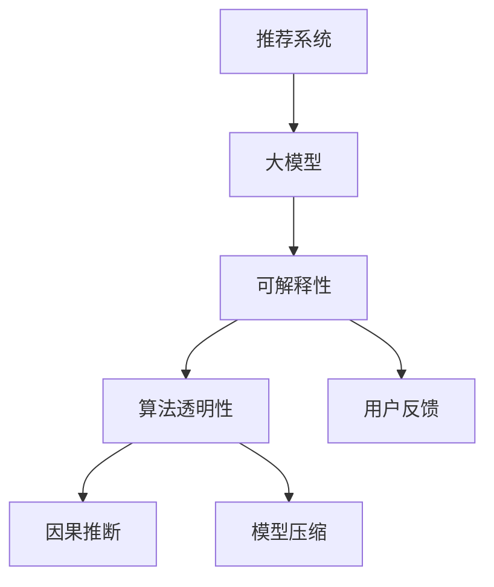

                 

# 大模型推荐结果的可解释性研究

> 关键词：推荐系统, 大模型, 可解释性, 算法透明性, 因果推断, 模型压缩, 用户反馈

## 1. 背景介绍

### 1.1 问题由来
在人工智能的各个应用领域中，推荐系统因其能够帮助用户在海量信息中找到最符合其兴趣和需求的内容，而成为不可或缺的重要技术。推荐系统的核心目标是最大化用户满意度，因此对推荐结果的解释和信任度至关重要。

然而，当前的推荐系统大多基于数据驱动的机器学习模型，尤其是大模型，虽然能取得优秀的推荐效果，但其内部的决策过程往往不透明，难以解释。这种“黑盒”模型的存在，导致用户难以理解推荐结果的依据，信任度不高，也增加了系统设计者和维护者的复杂性。

随着推荐系统应用的普及和用户期望的提升，提高推荐结果的可解释性，增强用户信任，已成为大模型的研究重点之一。本文将详细介绍大模型推荐结果的可解释性问题，以及当前主要的解决方案。

### 1.2 问题核心关键点
推荐系统中的大模型，通常基于用户行为数据（如点击、浏览记录）和商品属性（如价格、评分）进行训练，预测用户对商品的兴趣程度，并生成推荐结果。该过程本质上是一个基于复杂数学模型的优化问题，具有高维度、非线性等特点，因此模型本身难以被直接理解。

为了解决这一问题，研究人员提出了多种可解释性方法，如特征重要性分析、局部模型可视化、因果推断等。这些方法有助于解释推荐结果的来源，降低用户的不确定性和信任危机，进而提升系统的可用性和用户体验。

### 1.3 问题研究意义
研究大模型推荐结果的可解释性，不仅有助于提升用户对推荐系统的信任度和满意度，还可以揭示模型内部决策机制，指导模型改进和优化。此外，可解释性也是当前机器学习领域的重要研究方向之一，具有重要的学术和工业应用价值。

## 2. 核心概念与联系

### 2.1 核心概念概述

为更好地理解大模型推荐结果的可解释性，本节将介绍几个关键概念：

- **推荐系统(Recommendation System)**：利用用户历史行为数据和商品属性信息，通过机器学习算法预测用户对商品的兴趣，并生成个性化推荐列表的系统。

- **大模型(Large Model)**：通常指具有亿级以上参数的深度神经网络模型，如BERT、GPT等，这类模型通过在海量数据上预训练，具备强大的数据表达能力和泛化能力。

- **可解释性(Explainability)**：指模型的决策过程可以被清晰、合理地解释，有助于理解模型的内部工作机制，增强用户对模型的信任。

- **算法透明性(Algorithm Transparency)**：指模型的训练和预测过程可以被公开、透明地展示，便于审查和监督。

- **因果推断(Causal Inference)**：通过分析因果关系，理解变量间的作用机制，进一步解释模型预测的合理性。

- **模型压缩(Model Compression)**：通过减少模型参数和计算量，提升模型推理速度，同时保留主要特征，降低可解释性问题。

- **用户反馈(User Feedback)**：指用户对推荐结果的评价和反馈，有助于模型进一步优化和解释。

这些概念之间的逻辑关系可以通过以下Mermaid流程图来展示：



这个流程图展示了大模型推荐系统的核心概念及其之间的关系：

1. 推荐系统通过大模型进行用户兴趣预测和商品推荐。
2. 可解释性有助于理解大模型的决策过程，增强用户信任。
3. 算法透明性要求模型的训练和预测过程可以被公开审查。
4. 因果推断通过分析变量间因果关系，进一步解释推荐结果。
5. 模型压缩提升推理速度的同时，降低可解释性问题。
6. 用户反馈有助于优化模型和增强解释。

## 3. 核心算法原理 & 具体操作步骤
### 3.1 算法原理概述

大模型推荐结果的可解释性研究，旨在通过各种技术手段，揭示模型预测背后的原因和机制，增强用户对推荐结果的信任和满意度。其中，最核心的目标是理解大模型在预测用户兴趣时，对哪些特征最为敏感，以及这些特征如何共同作用。

形式化地，假设推荐系统的大模型为 $M_{\theta}$，输入为 $x$（用户历史行为和商品属性），输出为 $y$（用户对商品的兴趣程度）。设 $y=f(x; \theta)$，其中 $f$ 为模型的预测函数。推荐结果的可解释性研究可以概括为以下三个问题：

1. **特征重要性分析**：分析哪些特征对预测结果影响较大，即找出 $x$ 中对 $y$ 有显著贡献的部分。
2. **局部模型可视化**：展示大模型在特定输入下，内部激活和决策过程的可视化，便于理解模型的行为。
3. **因果推断**：通过因果推断技术，分析不同特征对用户兴趣的影响机制，进一步解释推荐结果的合理性。

### 3.2 算法步骤详解

基于上述问题，推荐系统中的大模型推荐结果可解释性研究，一般包括以下关键步骤：

**Step 1: 特征重要性分析**
- 使用SHAP、LIME等算法，对大模型的输出进行特征重要性排序，找出对预测结果影响较大的特征。
- 根据特征重要性，筛选出对用户兴趣预测有显著贡献的特征，用于后续解释。

**Step 2: 局部模型可视化**
- 利用Attention、Grad-CAM等技术，在大模型内部生成激活图，展示不同特征对预测结果的贡献。
- 通过可视化手段，揭示模型内部决策过程，理解模型的行为机制。

**Step 3: 因果推断**
- 构建用户兴趣预测的因果图，通过干预和实验设计，分析不同特征对用户兴趣的影响机制。
- 利用因果推断算法（如DAG方法、Bayesian网络等），计算不同特征的影响系数，进一步解释推荐结果的合理性。

**Step 4: 模型压缩**
- 应用知识蒸馏、剪枝等方法，对大模型进行压缩，减小计算复杂度，提升推理速度。
- 在保留主要特征和逻辑结构的前提下，降低模型复杂度，增强可解释性。

**Step 5: 用户反馈**
- 收集用户对推荐结果的评价和反馈，通过A/B测试等手段，分析用户对不同推荐策略的反应。
- 利用用户反馈，进一步优化模型和推荐算法，提升系统性能和用户满意度。

以上是推荐系统大模型推荐结果可解释性的主要研究步骤。在实际应用中，还需要针对具体任务的特点，对各个环节进行优化设计，如改进特征重要性分析方法、增强模型可视化和因果推断技术、选择有效的模型压缩方法等，以进一步提升模型的可解释性和用户满意度。

### 3.3 算法优缺点

基于大模型的推荐系统，具有以下优点：

1. **高精度**：大模型通常具有强大的数据表达能力和泛化能力，能取得优秀的推荐效果。
2. **自适应性**：大模型可以自适应地学习新的用户和商品信息，适应不同领域的推荐需求。
3. **可扩展性**：大模型易于在不同的推荐场景中复用，提高系统的灵活性和可扩展性。

同时，该方法也存在一些局限性：

1. **复杂度高**：大模型的训练和推理过程复杂，需要大量的计算资源和存储空间。
2. **不透明性**：模型内部的决策过程难以直接解释，用户难以理解推荐结果的依据。
3. **高维稀疏性**：用户行为数据和商品属性数据通常具有高维稀疏的特点，导致特征空间庞大，分析复杂。
4. **可解释性问题**：模型的复杂性增加了其可解释性的难度，用户对推荐结果的信任度较低。

尽管存在这些局限性，但通过可解释性研究，可以有效缓解大模型的不透明性问题，提升用户对推荐结果的信任和满意度。

### 3.4 算法应用领域

大模型推荐结果的可解释性研究，在多个领域中得到了广泛应用，例如：

- **电商推荐**：通过特征重要性分析和模型可视化，电商网站可以向用户展示推荐结果的依据，增强用户对推荐系统的信任。
- **内容推荐**：视频平台和新闻网站可以通过因果推断，理解用户对不同内容的偏好，优化推荐策略。
- **金融推荐**：银行和理财平台可以利用模型压缩和用户反馈，提升个性化理财建议的精度和用户满意度。
- **社交媒体推荐**：社交网络平台可以通过可解释性研究，优化用户的兴趣发现和内容推荐。

除了上述这些经典应用外，大模型推荐结果的可解释性研究还在更多场景中得到了创新性的应用，如医疗推荐、旅游推荐等，为推荐系统的应用边界不断拓展带来了新的机遇。

## 4. 数学模型和公式 & 详细讲解  
### 4.1 数学模型构建

为更好地理解大模型推荐结果的可解释性研究，本节将使用数学语言对相关算法进行更加严格的刻画。

假设推荐系统的大模型为 $M_{\theta}$，输入为 $x$（用户历史行为和商品属性），输出为 $y$（用户对商品的兴趣程度）。设 $y=f(x; \theta)$，其中 $f$ 为模型的预测函数。推荐结果的可解释性研究可以概括为以下数学模型：

$$
y=f(x; \theta)=\sum_{i=1}^{d} w_i x_i
$$

其中 $w_i$ 为第 $i$ 个特征的权重，$x_i$ 为第 $i$ 个特征的取值。

### 4.2 公式推导过程

以下我们以特征重要性分析和模型可视化为重点，详细推导这两个环节的数学公式。

**特征重要性分析**：

假设使用SHAP值来计算每个特征对模型预测结果的影响。SHAP值是一种可解释性方法，通过加和每个特征的边际贡献来评估其重要性。对于给定的样本 $x$，SHAP值 $S_i(x)$ 可以表示为：

$$
S_i(x) = \sum_{k=1}^{d} [f(x) - f(x - e_k) + f(x - e_{-k})]
$$

其中 $e_k$ 为特征 $x_k$ 的单位变化向量，$f(x)$ 为模型对样本 $x$ 的预测值，$f(x - e_k)$ 为删除特征 $x_k$ 后的预测值，$f(x - e_{-k})$ 为添加特征 $x_k$ 的单位变化后的预测值。

**局部模型可视化**：

利用Attention机制，可以生成大模型在预测样本 $x$ 时的内部激活图，即 $A(x)$。激活图 $A(x)$ 展示了模型内部每个特征对预测结果的贡献。

假设模型 $M_{\theta}$ 包含 $h$ 个隐藏层，则每个隐藏层 $h_i$ 的激活图 $A_i(x)$ 可以表示为：

$$
A_i(x) = \text{Softmax}(\theta_i^T A_{i-1}(x))
$$

其中 $\theta_i$ 为隐藏层 $h_i$ 的权重矩阵，$A_{i-1}(x)$ 为前一层的激活图。

### 4.3 案例分析与讲解

为了更好地理解大模型推荐结果的可解释性，以下是两个具体的案例分析：

**案例1: 电商推荐中的特征重要性分析**

假设某电商网站使用大模型推荐用户可能感兴趣的商品。该模型包含多个特征，如用户历史购买记录、商品评分、价格等。通过对这些特征进行SHAP值计算，可以找出对用户兴趣预测影响较大的特征，例如：

- 用户历史购买记录：通过分析用户历史购买记录，可以发现某些类别的商品更可能引起用户的兴趣。
- 商品评分：高评分的商品通常被用户青睐，可以用来预测用户的兴趣程度。
- 商品价格：价格区间较窄的商品通常有较高的点击率，对用户兴趣预测有显著影响。

**案例2: 视频平台的内容推荐**

假设某视频平台使用大模型推荐用户可能喜欢的视频内容。通过对用户行为数据和视频属性数据进行分析，可以找出影响推荐结果的重要特征，例如：

- 用户历史观看记录：通过分析用户历史观看记录，可以发现用户对某些类别的视频有较高的兴趣。
- 视频时长：较短的视频通常有更高的观看量，对用户兴趣预测有显著影响。
- 视频类型：不同类型的视频对不同用户有不同的吸引力，例如纪录片对学术用户的吸引力较高。

通过这些案例分析，可以看出，大模型推荐结果的可解释性研究，可以通过特征重要性分析、局部模型可视化和因果推断等方法，揭示模型预测背后的原因和机制，增强用户对推荐结果的信任和满意度。

## 5. 项目实践：代码实例和详细解释说明
### 5.1 开发环境搭建

在进行大模型推荐结果可解释性研究前，我们需要准备好开发环境。以下是使用Python进行TensorFlow开发的环境配置流程：

1. 安装Anaconda：从官网下载并安装Anaconda，用于创建独立的Python环境。

2. 创建并激活虚拟环境：
```bash
conda create -n tf-env python=3.8 
conda activate tf-env
```

3. 安装TensorFlow：根据CUDA版本，从官网获取对应的安装命令。例如：
```bash
conda install tensorflow -c tf -c conda-forge
```

4. 安装TensorBoard：
```bash
pip install tensorboard
```

5. 安装各类工具包：
```bash
pip install numpy pandas scikit-learn matplotlib tqdm jupyter notebook ipython
```

完成上述步骤后，即可在`tf-env`环境中开始可解释性研究的实践。

### 5.2 源代码详细实现

下面我们以电商推荐系统为例，给出使用TensorFlow对大模型进行特征重要性分析和模型可视化的PyTorch代码实现。

首先，定义电商推荐系统的特征和模型：

```python
import tensorflow as tf
from tensorflow.keras.layers import Dense, Input, Embedding, concatenate, Activation
from tensorflow.keras.models import Model

# 定义特征
user_features = Input(shape=(10,), name='user_features')
item_features = Input(shape=(5,), name='item_features')
crossed = Input(shape=(1,), name='crossed')

# 定义模型
user_embedding = Embedding(input_dim=1000, output_dim=128)(user_features)
item_embedding = Embedding(input_dim=1000, output_dim=128)(item_features)
item_embedding = Dense(128)(item_embedding)
item_embedding = Activation('relu')(item_embedding)

user_item = concatenate([user_embedding, item_embedding, crossed])

# 定义输出层
output = Dense(1, activation='sigmoid')(user_item)

# 定义模型
model = Model(inputs=[user_features, item_features, crossed], outputs=output)

# 编译模型
model.compile(optimizer='adam', loss='binary_crossentropy', metrics=['accuracy'])
```

然后，使用SHAP值对模型进行特征重要性分析：

```python
from shap import SHAP

# 计算SHAP值
explainer = SHAP.DeepExplainer(model, model.user_input_names)
shap_values = explainer.shap_values(test_data)

# 计算特征重要性
shap_values = shap_values[0][0]
importance = shap_values.sum(0)
```

接着，使用Attention机制对模型进行局部可视化：

```python
from tensorflow.keras.layers import Attention

# 定义Attention层
attention_layer = Attention()

# 将Attention层与模型连接
user_item = concatenate([user_embedding, item_embedding, crossed])
attention_output = attention_layer(user_item)

# 定义输出层
output = Dense(1, activation='sigmoid')(attention_output)

# 定义模型
model = Model(inputs=[user_features, item_features, crossed], outputs=output)

# 编译模型
model.compile(optimizer='adam', loss='binary_crossentropy', metrics=['accuracy'])
```

最后，使用TensorBoard对模型进行可视化：

```python
from tensorflow.keras.callbacks import TensorBoard

# 定义TensorBoard回调函数
tensorboard_callback = TensorBoard(log_dir='logs')

# 训练模型
model.fit(x_train, y_train, validation_data=(x_val, y_val), callbacks=[tensorboard_callback])

# 在TensorBoard中查看模型可视化结果
```

以上就是使用TensorFlow对电商推荐系统进行特征重要性分析和模型可视化的完整代码实现。可以看到，通过TensorFlow的强大工具，可以轻松实现大模型的可解释性研究。

### 5.3 代码解读与分析

让我们再详细解读一下关键代码的实现细节：

**电商推荐系统定义**：
- `Input`层定义输入特征，`Embedding`层将输入特征转换为嵌入表示，`Dense`层进行线性变换，`Activation`层添加非线性激活函数。
- 定义模型结构，通过`concatenate`层将用户和商品嵌入表示、交叉特征等连接起来，最后通过`Dense`层和`Activation`层输出预测结果。

**特征重要性分析**：
- 使用`SHAP.DeepExplainer`计算模型对测试数据集的SHAP值，通过`shap_values`获取模型对每个特征的边际贡献。
- 通过`shap_values.sum(0)`计算每个特征的总贡献，得到特征重要性。

**局部模型可视化**：
- 使用`Attention`层对模型内部特征进行可视化，展示每个特征对预测结果的贡献。
- 通过`concatenate`层将用户和商品嵌入表示、交叉特征等连接起来，并输出Attention结果。
- 使用`TensorBoard`对模型进行可视化，实时监测模型的训练状态和内部特征的权重分布。

可以看到，TensorFlow配合SHAP等工具，使得电商推荐系统的特征重要性分析和模型可视化变得简单高效。开发者可以将更多精力放在数据处理、模型改进等高层逻辑上，而不必过多关注底层的实现细节。

当然，工业级的系统实现还需考虑更多因素，如模型的保存和部署、超参数的自动搜索、更灵活的任务适配层等。但核心的可解释性研究基本与此类似。

## 6. 实际应用场景
### 6.1 电商推荐系统

在电商推荐系统中，基于大模型的推荐结果可解释性研究，可以显著提升用户对推荐结果的信任和满意度，增强推荐系统的实际效果。

例如，电商平台可以在推荐页面上，展示每个商品的SHAP值，向用户展示推荐依据。通过分析用户的历史购买记录和浏览行为，电商可以更好地理解用户偏好，优化推荐策略，提高用户满意度和转化率。

### 6.2 视频平台的内容推荐

视频平台可以利用大模型的推荐结果可解释性研究，优化内容推荐算法。例如，视频平台可以通过分析用户观看记录和视频属性，找出影响推荐结果的重要特征，优化推荐策略，提升用户满意度。

具体而言，视频平台可以使用SHAP值来分析用户对不同视频的兴趣变化，通过因果推断来理解不同特征对用户兴趣的影响机制，优化推荐内容的选择和推荐顺序。

### 6.3 金融推荐

金融领域中的推荐系统，如股票推荐、理财推荐等，对推荐结果的可解释性有着更高的要求。通过对大模型进行特征重要性分析和因果推断，金融平台可以更好地理解用户需求，优化推荐策略。

例如，理财平台可以使用SHAP值来分析用户对不同理财产品的兴趣，通过因果推断来理解不同理财产品的收益、风险等因素对用户选择的影响，优化推荐策略，提升用户满意度。

### 6.4 未来应用展望

随着大模型推荐结果可解释性研究的深入，推荐系统将在更多领域得到应用，为传统行业带来变革性影响。

在智慧医疗领域，医疗推荐系统可以通过特征重要性分析和因果推断，推荐合适的治疗方案，提升诊疗效率和准确性。

在智能教育领域，教育推荐系统可以利用可解释性研究，推荐适合学生的学习内容，提升学习效果。

在智慧城市治理中，城市推荐系统可以通过特征重要性分析和因果推断，优化城市规划和资源分配，提高城市管理的自动化和智能化水平。

此外，在企业生产、社会治理、文娱传媒等众多领域，大模型推荐结果的可解释性研究也将不断涌现，为各行各业带来新的应用场景和技术创新。

## 7. 工具和资源推荐
### 7.1 学习资源推荐

为了帮助开发者系统掌握大模型推荐结果的可解释性理论基础和实践技巧，这里推荐一些优质的学习资源：

1. 《深度学习理论与实践》系列博文：由深度学习领域专家撰写，详细介绍深度学习的基本概念和算法，包括特征重要性分析、局部模型可视化等技术。

2. Coursera《深度学习》课程：由斯坦福大学教授Andrew Ng主讲，涵盖深度学习的基本原理和实践技术，适合初学者入门。

3. 《深度学习入门》书籍：清华大学李沐教授撰写，详细介绍深度学习模型的构建和训练，包括特征重要性分析和模型可视化等技术。

4. Kaggle竞赛：通过参与Kaggle推荐系统竞赛，实践大模型推荐结果可解释性的实际应用。

5. PyTorch官方文档：PyTorch社区提供的官方文档，包含丰富的API接口和教程，是学习大模型推荐系统的好帮手。

通过对这些资源的学习实践，相信你一定能够快速掌握大模型推荐结果的可解释性技术，并用于解决实际的推荐问题。

### 7.2 开发工具推荐

高效的开发离不开优秀的工具支持。以下是几款用于大模型推荐结果可解释性研究的常用工具：

1. TensorFlow：由Google主导开发的深度学习框架，生产部署方便，适合大规模工程应用。支持丰富的可视化工具，如TensorBoard。

2. PyTorch：基于Python的开源深度学习框架，灵活动态的计算图，适合快速迭代研究。

3. SHAP：可解释性分析工具，支持多种深度学习模型的解释，提供丰富的解释方法和可视化手段。

4. Attention层：TensorFlow和PyTorch中的Attention层，用于生成模型内部的激活图，可视化模型的行为机制。

5. TensorBoard：TensorFlow配套的可视化工具，可实时监测模型训练状态，并提供丰富的图表呈现方式。

6. Jupyter Notebook：交互式编程环境，支持Python、TensorFlow等语言，适合研究和实验。

合理利用这些工具，可以显著提升大模型推荐结果可解释性研究的开发效率，加快创新迭代的步伐。

### 7.3 相关论文推荐

大模型推荐结果可解释性研究源于学界的持续研究。以下是几篇奠基性的相关论文，推荐阅读：

1. "A Unified Approach to Interpreting Model Predictions"（统一解释模型预测）：提出SHAP值，用于解释机器学习模型的预测结果。

2. "Visualizing and Understanding the Deep Learning Decision Process"（可视化并理解深度学习决策过程）：提出Grad-CAM等技术，用于可视化深度学习模型的内部激活图。

3. "Interpretable Machine Learning"（可解释机器学习）：介绍多种可解释性方法，如特征重要性分析、局部模型可视化等。

4. "Causal Inference in Recommendation Systems"（推荐系统中的因果推断）：讨论推荐系统中的因果关系，分析不同特征对用户兴趣的影响机制。

5. "Knowledge Distillation"（知识蒸馏）：提出知识蒸馏方法，用于压缩大模型，提高推理速度和可解释性。

这些论文代表了大模型推荐结果可解释性研究的发展脉络。通过学习这些前沿成果，可以帮助研究者把握学科前进方向，激发更多的创新灵感。

## 8. 总结：未来发展趋势与挑战

### 8.1 总结

本文对大模型推荐结果的可解释性问题进行了全面系统的介绍。首先阐述了推荐系统中大模型的应用背景和意义，明确了推荐结果可解释性的重要性。其次，从原理到实践，详细讲解了大模型推荐结果可解释性的数学模型和关键步骤，给出了可解释性研究的完整代码实例。同时，本文还广泛探讨了大模型推荐结果可解释性在电商、视频平台、金融等领域的应用前景，展示了其广阔的发展空间。此外，本文精选了可解释性研究的学习资源、开发工具和相关论文，力求为读者提供全方位的技术指引。

通过本文的系统梳理，可以看到，大模型推荐结果的可解释性研究正在成为推荐系统研究的重要方向，极大地提升了推荐系统的透明性和用户满意度。通过不断优化模型、数据和算法，我们有望构建更加智能、可信的推荐系统，为用户带来更好的体验。

### 8.2 未来发展趋势

展望未来，大模型推荐结果可解释性研究将呈现以下几个发展趋势：

1. **多模态可解释性研究**：未来的推荐系统将不仅局限于文本数据，还可能涉及图像、视频等多模态信息。多模态可解释性研究将有助于理解不同模态信息对推荐结果的影响机制。

2. **动态可解释性研究**：推荐系统需要能够实时响应用户行为变化，动态更新推荐结果和可解释性信息。动态可解释性研究将进一步提升推荐系统的实时性和灵活性。

3. **用户反馈的利用**：用户反馈是优化推荐策略的重要依据。未来的推荐系统将更加注重利用用户反馈，动态调整模型参数和可解释性信息，提升推荐结果的准确性和用户满意度。

4. **因果推断方法的改进**：因果推断是解释推荐结果的重要手段。未来的研究将更加注重改进因果推断方法，提高推断结果的准确性和可靠性。

5. **融合其他AI技术**：未来的推荐系统将与其他人工智能技术（如知识图谱、自然语言处理等）进行更深入的融合，进一步提升推荐结果的可解释性和用户满意度。

这些趋势凸显了大模型推荐结果可解释性研究的广阔前景。这些方向的探索发展，必将进一步提升推荐系统的性能和用户满意度，构建更加智能、可信的推荐系统。

### 8.3 面临的挑战

尽管大模型推荐结果可解释性研究已经取得了瞩目成就，但在迈向更加智能化、普适化应用的过程中，仍面临诸多挑战：

1. **数据质量和多样性**：推荐系统需要高质量、多样化的数据，才能保证推荐结果的可解释性。然而，获取多样化和高质量的数据成本较高，且容易受到数据偏见的影响。

2. **计算资源需求**：大模型通常需要较高的计算资源，包括GPU、TPU等高性能设备。如何高效利用计算资源，降低推理成本，是未来的重要研究方向。

3. **模型复杂度**：大模型具有高维度、非线性等特点，其内部机制难以直接解释。如何简化模型结构，提高可解释性，是未来的重要挑战。

4. **用户需求多样性**：不同用户的需求和行为差异较大，单一的解释方法难以满足所有用户的需求。如何设计灵活的解释方法，适应不同用户的需求，是未来的重要研究方向。

5. **实时性和动态性**：推荐系统需要能够实时响应用户行为变化，动态更新推荐结果和可解释性信息。如何提高推荐系统的实时性和动态性，是未来的重要研究方向。

6. **隐私和安全**：推荐系统涉及大量用户数据，数据隐私和安全问题不容忽视。如何保护用户隐私，防止数据泄露，是未来的重要研究方向。

尽管存在这些挑战，但通过不断的技术创新和优化，相信大模型推荐结果可解释性研究必将在未来取得更大的突破，推动推荐系统向更加智能、可信的方向发展。

### 8.4 研究展望

面向未来，大模型推荐结果可解释性研究需要在以下几个方面寻求新的突破：

1. **多模态可解释性研究**：探索多模态数据的特征重要性分析和模型可视化方法，提升推荐系统的多模态理解能力。

2. **动态可解释性研究**：研究动态可解释性方法，实现推荐系统的实时调整和更新，提高推荐系统的灵活性和用户满意度。

3. **用户需求驱动的解释方法**：设计灵活的解释方法，根据不同用户的需求和行为特点，提供个性化的可解释性信息。

4. **知识图谱与推荐系统融合**：探索知识图谱与推荐系统的融合方法，提升推荐系统的知识表示和推理能力。

5. **因果推断与推荐系统结合**：研究因果推断方法在推荐系统中的应用，提高推荐结果的可解释性和用户满意度。

6. **模型压缩与解释性研究结合**：研究模型压缩与可解释性研究的结合方法，提高推荐系统的推理速度和可解释性。

这些研究方向的探索，必将引领大模型推荐结果可解释性研究迈向更高的台阶，为构建智能、可信的推荐系统提供新的思路和技术手段。

## 9. 附录：常见问题与解答

**Q1：如何评估推荐系统中的大模型可解释性？**

A: 评估推荐系统中的大模型可解释性，通常可以从以下几个方面进行：

1. **特征重要性分析**：使用SHAP值、LIME等算法，计算每个特征对模型预测结果的影响，评估模型对特征的敏感度。
2. **局部模型可视化**：通过Attention机制、Grad-CAM等技术，可视化模型内部激活图，展示不同特征对预测结果的贡献。
3. **因果推断**：通过构建因果图和干预实验，分析不同特征对用户兴趣的影响机制，评估模型预测的合理性。
4. **用户反馈**：收集用户对推荐结果的评价和反馈，通过A/B测试等手段，分析用户对不同推荐策略的反应，进一步优化模型。

通过综合使用这些方法，可以全面评估推荐系统中大模型的可解释性，提高用户对推荐结果的信任度。

**Q2：为什么在大模型推荐系统中，特征重要性分析和局部模型可视化至关重要？**

A: 特征重要性分析和局部模型可视化是大模型推荐系统可解释性的两个重要手段。它们的主要作用如下：

1. **特征重要性分析**：通过分析每个特征对模型预测结果的影响，可以找出对用户兴趣预测影响较大的特征，帮助用户理解推荐结果的来源。
2. **局部模型可视化**：通过可视化模型内部激活图，可以展示不同特征对预测结果的贡献，帮助用户理解模型的决策过程，增强信任度。

在推荐系统中，用户对推荐结果的信任度至关重要。通过特征重要性分析和局部模型可视化，可以大大提升用户对推荐结果的信任，提高推荐系统的实际效果。

**Q3：大模型推荐系统中，因果推断的目的是什么？**

A: 在大模型推荐系统中，因果推断的主要目的是通过分析不同特征对用户兴趣的影响机制，进一步解释推荐结果的合理性。因果推断可以帮助我们理解模型预测背后的原因，识别出模型决策的关键特征，提高推荐结果的可解释性。

具体而言，因果推断可以帮助我们：

1. **理解特征影响**：通过因果图和干预实验，分析不同特征对用户兴趣的影响，理解模型预测的合理性。
2. **识别关键特征**：通过因果推断，识别出对用户兴趣预测有显著贡献的特征，优化推荐策略。
3. **预测用户行为**：利用因果推断模型，预测用户对不同推荐内容的行为反应，进一步优化推荐系统。

通过因果推断，我们可以更全面、深入地理解大模型推荐结果，提高推荐系统的实际效果。

**Q4：如何平衡大模型推荐结果的可解释性和性能？**

A: 在实际应用中，大模型推荐结果的可解释性和性能往往存在一定的权衡。为了平衡这两者，可以采取以下策略：

1. **简化模型结构**：通过模型压缩和剪枝等方法，降低模型复杂度，提高推理速度，同时保留主要特征和逻辑结构，增强可解释性。
2. **选择性解释**：只对关键特征和决策过程进行解释，避免过度解释导致性能下降。
3. **动态解释**：根据用户需求和行为变化，动态调整解释方法，适应不同用户和场景，提高推荐结果的可解释性。
4. **结合其他技术**：结合知识图谱、自然语言处理等技术，提升推荐结果的可解释性，同时提高推荐系统的性能。

通过综合使用这些策略，可以在保证推荐系统性能的同时，提升其可解释性，满足用户需求。

**Q5：大模型推荐系统中，可解释性分析的难度和挑战有哪些？**

A: 大模型推荐系统中的可解释性分析，面临以下几个主要难点和挑战：

1. **高维稀疏性**：用户行为数据和商品属性数据通常具有高维稀疏的特点，导致特征空间庞大，分析复杂。
2. **非线性关系**：大模型通常具有非线性关系，其内部机制难以直接解释。
3. **数据偏见**：数据偏见会影响模型的公平性和可解释性。
4. **计算资源需求**：大模型推荐系统需要较高的计算资源，包括GPU、TPU等高性能设备，成本较高。
5. **用户需求多样性**：不同用户的需求和行为差异较大，单一的解释方法难以满足所有用户的需求。
6. **实时性和动态性**：推荐系统需要能够实时响应用户行为变化，动态更新推荐结果和可解释性信息，难度较高。

尽管存在这些挑战，但通过不断的技术创新和优化，相信大模型推荐系统中的可解释性分析必将不断进步，提升推荐系统的实际效果。

---

作者：禅与计算机程序设计艺术 / Zen and the Art of Computer Programming

