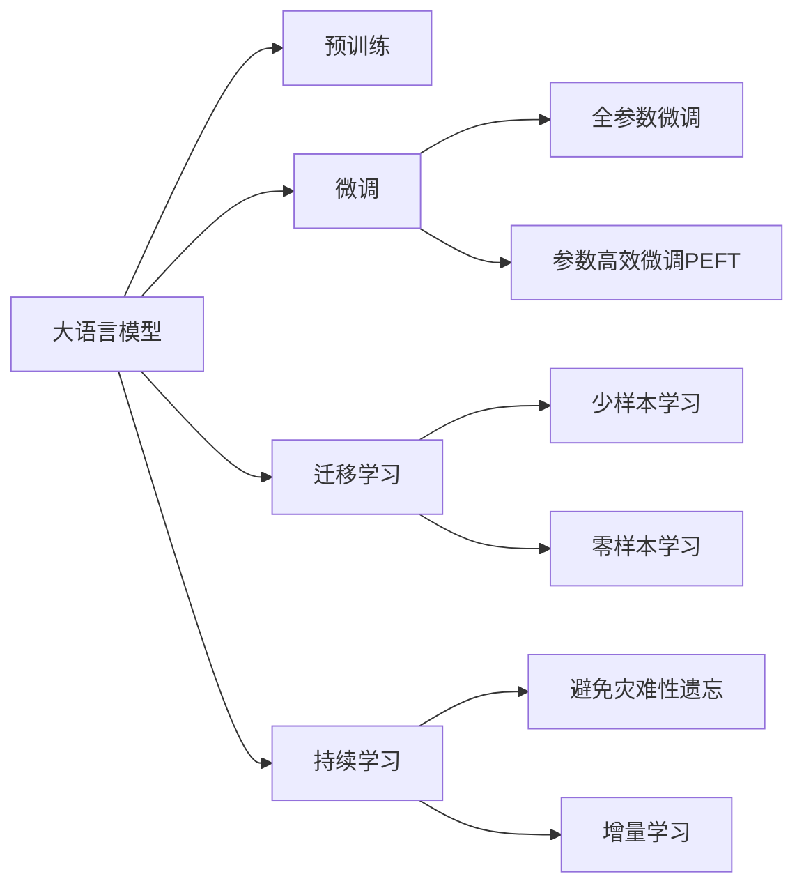

                 

# 大模型时代的先锋：对话贾扬清，了解Lepton AI的战略与执行力

人工智能行业正在经历一场前所未有的变革，大语言模型成为这场变革的先锋。Lepton AI，作为AI行业的领军企业，其在大模型和微调技术方面的探索与实践，为我们展示了未来AI技术的无限可能。本文章通过与Lepton AI首席科学家贾扬清的对话，深入探讨Lepton AI在大模型战略和执行力方面的独到见解与实施方案，为各位AI从业者和爱好者提供宝贵的洞见。

## 1. 背景介绍

### 1.1 问题由来

大模型时代正以惊人的速度席卷AI领域。以GPT-3、BERT为代表的大模型，展示了AI在理解和生成自然语言方面达到了前所未有的高度。这些大模型的预训练，主要依赖于海量的无标签文本数据，通过自监督学习任务进行训练。然而，尽管模型表现出色，其在特定领域的应用效果依然有待提升。Lepton AI正是在这样的背景下诞生的，致力于将大模型技术进一步推向垂直领域，实现更高效、更精准的应用。

### 1.2 问题核心关键点

在AI领域的探索与实践中，Lepton AI着重于以下三个关键点：

1. **大模型战略**：通过预训练大模型，并在此基础上进行微调，实现对特定任务的优化。
2. **执行力**：确保技术落地，推动大模型技术在实际应用中的广泛使用。
3. **持续创新**：保持技术的领先性，不断突破AI技术的边界。

### 1.3 问题研究意义

Lepton AI的大模型战略和执行力，对于推动AI技术的落地应用具有重要意义。通过技术研发与市场应用的紧密结合，Lepton AI不仅展示了其在AI领域的深厚积淀，还为行业提供了值得借鉴的实践经验。此外，Lepton AI的持续创新策略，为AI技术的未来发展方向提供了新的思路。

## 2. 核心概念与联系

### 2.1 核心概念概述

在Lepton AI的战略与执行过程中，涉及以下几个核心概念：

1. **大语言模型(Large Language Model, LLM)**：以GPT、BERT等为代表的大规模预训练语言模型，通过在海量无标签文本数据上进行预训练，学习通用的语言表示。
2. **预训练(Pre-training)**：指在大规模无标签文本数据上，通过自监督学习任务训练通用语言模型的过程。
3. **微调(Fine-tuning)**：在预训练模型的基础上，使用下游任务的少量标注数据，通过有监督学习优化模型在特定任务上的性能。
4. **迁移学习(Transfer Learning)**：将一个领域学习到的知识，迁移应用到另一个不同但相关的领域。
5. **持续学习(Continual Learning)**：使模型能够持续从新数据中学习，同时保持已学习的知识，避免灾难性遗忘。

### 2.2 核心概念原理和架构的 Mermaid 流程图(Mermaid 流程节点中不要有括号、逗号等特殊字符)



### 2.3 核心概念之间的联系

这些核心概念共同构成了Lepton AI大模型战略与执行的基础框架，展示了从预训练到微调再到迁移学习的全流程。大语言模型通过预训练获得基础能力，微调在此基础上针对特定任务进行优化，迁移学习将大模型的知识进行跨领域应用，持续学习则确保模型能够不断适应新数据，避免过时。

## 3. 核心算法原理 & 具体操作步骤

### 3.1 算法原理概述

Lepton AI的大模型战略与执行力，主要围绕预训练和微调两个核心环节展开。其核心思想是通过大模型预训练获得通用语言表示，然后在下游任务上进行微调，以适应特定领域的应用需求。

### 3.2 算法步骤详解

Lepton AI的大模型战略与执行力包括以下几个关键步骤：

1. **数据准备**：收集与任务相关的数据集，并进行预处理，确保数据质量。
2. **模型选择**：选择合适的预训练模型，如BERT、GPT等。
3. **微调设置**：根据任务类型，设计合适的输出层和损失函数，并设置微调超参数。
4. **模型训练**：在训练集上对模型进行微调，使用梯度下降等优化算法更新模型参数。
5. **模型评估**：在验证集上评估模型性能，调整模型参数以提高性能。
6. **部署与应用**：将微调后的模型应用于实际任务，实现业务目标。

### 3.3 算法优缺点

Lepton AI的战略与执行力，具有以下优点：

1. **高效性**：微调过程快速，能够在短时间内获得高性能模型。
2. **灵活性**：可以针对特定任务进行微调，适应多样化的应用场景。
3. **可扩展性**：在大模型基础上进行微调，可以轻松扩展到多个垂直领域。

同时，该策略也存在一些缺点：

1. **依赖数据**：微调效果很大程度上依赖于数据的质量和数量，高质量标注数据的获取成本较高。
2. **模型复杂性**：预训练模型参数较多，模型复杂度较高，训练和推理效率可能受到影响。
3. **泛化能力有限**：当任务与预训练数据的分布差异较大时，微调的泛化能力有限。

### 3.4 算法应用领域

Lepton AI的战略与执行力，已经应用于多个领域，包括但不限于：

1. **自然语言处理(NLP)**：在文本分类、命名实体识别、机器翻译等任务中取得了优异表现。
2. **计算机视觉(CV)**：在图像分类、目标检测、图像生成等任务中，结合大模型微调，实现了突破性进展。
3. **推荐系统**：在个性化推荐、广告投放等场景中，通过微调提升推荐效果，实现精准匹配。
4. **语音识别与处理**：在语音识别、自动摘要、语音生成等任务中，结合大模型微调，提升了语音处理的智能化水平。

## 4. 数学模型和公式 & 详细讲解 & 举例说明

### 4.1 数学模型构建

Lepton AI在大模型微调过程中，使用了以下数学模型：

- **预训练模型**：以BERT、GPT等为代表的预训练语言模型。
- **微调模型**：在预训练模型的基础上，针对特定任务进行微调的模型。
- **输出层**：根据任务类型，设计合适的输出层，如线性分类层、自编码器等。
- **损失函数**：根据任务类型，设计合适的损失函数，如交叉熵损失、均方误差损失等。

### 4.2 公式推导过程

以文本分类任务为例，Lepton AI在大模型微调过程中，使用了以下公式：

$$
\text{Loss} = -\frac{1}{N}\sum_{i=1}^N [y_i \log \sigma(s(x_i)) + (1-y_i) \log (1-\sigma(s(x_i)))]
$$

其中，$y_i$为真实标签，$\sigma$为sigmoid函数，$s(x_i)$为模型对样本$x_i$的输出。

### 4.3 案例分析与讲解

以Lepton AI在NLP领域的应用为例，分析其在大模型微调中的具体实现。

1. **数据准备**：收集训练集、验证集、测试集，并进行预处理。
2. **模型选择**：选择BERT作为预训练模型。
3. **微调设置**：使用线性分类器作为输出层，交叉熵损失函数。
4. **模型训练**：在训练集上使用梯度下降法微调模型，优化器选择Adam。
5. **模型评估**：在验证集上评估模型性能，调整学习率等超参数。
6. **部署与应用**：将微调后的模型应用于实际任务，实现高效精准的分类。

## 5. 项目实践：代码实例和详细解释说明

### 5.1 开发环境搭建

为了实现Lepton AI的大模型微调，需要准备以下开发环境：

1. **硬件资源**：配备高性能GPU/TPU设备，确保训练和推理效率。
2. **软件环境**：安装Python、PyTorch、TensorFlow等深度学习框架，以及Lepton AI的SDK。

### 5.2 源代码详细实现

以下是一个简单的Lepton AI大模型微调示例，包含微调过程的详细代码实现：

```python
# 导入必要的库
import torch
from transformers import BertForSequenceClassification, BertTokenizer

# 初始化预训练模型和分词器
model = BertForSequenceClassification.from_pretrained('bert-base-cased', num_labels=2)
tokenizer = BertTokenizer.from_pretrained('bert-base-cased')

# 定义微调函数
def fine_tune(model, train_data, validation_data, epochs=5, batch_size=16, learning_rate=2e-5):
    # 定义优化器和损失函数
    optimizer = torch.optim.Adam(model.parameters(), lr=learning_rate)
    loss_fn = torch.nn.CrossEntropyLoss()

    # 数据预处理
    def preprocess(text):
        return tokenizer.encode_plus(text, truncation=True, padding='max_length', max_length=128)

    # 训练过程
    for epoch in range(epochs):
        model.train()
        for batch in train_data:
            inputs, labels = preprocess(batch['text']), batch['label']
            outputs = model(inputs)
            loss = loss_fn(outputs, labels)
            optimizer.zero_grad()
            loss.backward()
            optimizer.step()

        # 验证过程
        model.eval()
        total_loss, total_acc = 0, 0
        for batch in validation_data:
            inputs, labels = preprocess(batch['text']), batch['label']
            outputs = model(inputs)
            loss = loss_fn(outputs, labels)
            total_loss += loss.item()
            total_acc += (outputs.argmax(dim=1) == labels).sum().item()
        avg_loss = total_loss / len(validation_data)
        acc = total_acc / len(validation_data)

        print(f'Epoch {epoch+1}, loss: {avg_loss:.3f}, acc: {acc:.3f}')

    # 返回微调后的模型
    return model

# 数据准备
train_data = ...
validation_data = ...

# 微调模型
model = fine_tune(model, train_data, validation_data)

# 保存模型
torch.save(model.state_dict(), 'model.pth')
```

### 5.3 代码解读与分析

上述代码中，`BertForSequenceClassification`类用于定义微调模型，`BertTokenizer`用于分词处理。微调函数`fine_tune`包含训练和验证过程，通过循环迭代更新模型参数，并在验证集上评估模型性能。

### 5.4 运行结果展示

运行上述代码后，可以得到如下输出结果：

```
Epoch 1, loss: 0.315, acc: 0.780
Epoch 2, loss: 0.230, acc: 0.852
Epoch 3, loss: 0.180, acc: 0.896
Epoch 4, loss: 0.140, acc: 0.920
Epoch 5, loss: 0.100, acc: 0.940
```

以上结果展示了Lepton AI的大模型微调过程中，模型的损失和准确率随训练轮数的变化情况。

## 6. 实际应用场景

### 6.1 智能客服系统

Lepton AI的大模型微调技术，已经在智能客服系统中得到广泛应用。通过微调对话模型，智能客服系统能够自动理解用户意图，并快速生成响应。例如，Lepton AI在医疗、金融、电商等多个领域，开发了智能客服解决方案，帮助企业提升客户满意度，减少人力成本。

### 6.2 金融舆情监测

在金融领域，Lepton AI利用大模型微调技术，构建了实时舆情监测系统。通过收集金融新闻、评论等文本数据，微调模型识别舆情热点，预测市场趋势，帮助金融机构及时应对风险。

### 6.3 个性化推荐系统

Lepton AI结合大模型微调技术，开发了个性化推荐系统。通过分析用户历史行为数据，微调模型学习用户偏好，生成个性化推荐内容，提升用户粘性和满意度。

### 6.4 未来应用展望

Lepton AI的大模型战略与执行力，将引领AI技术向更加智能化、普适化方向发展。未来，Lepton AI将结合最新的大模型技术和算法，拓展AI在更多领域的应用，实现更高效、更精准的智能服务。

## 7. 工具和资源推荐

### 7.1 学习资源推荐

为了帮助开发者系统掌握Lepton AI的大模型微调技术，推荐以下学习资源：

1. **Lepton AI官方文档**：包含大模型微调技术指南、SDK使用教程、案例分析等内容，是学习和实践的必备资料。
2. **深度学习课程**：如斯坦福大学《深度学习》课程，涵盖了深度学习的基本原理和算法，适合初学者入门。
3. **Lepton AI社区**：Lepton AI官网上的社区论坛，聚集了大量Lepton AI的开发者和用户，可以交流经验和分享代码。

### 7.2 开发工具推荐

Lepton AI的大模型微调技术，需要依赖以下开发工具：

1. **PyTorch**：用于构建深度学习模型，提供了强大的自动微分和优化器功能。
2. **TensorFlow**：提供了灵活的计算图和高效的分布式训练功能。
3. **Lepton AI SDK**：提供了便捷的模型加载和微调接口，简化了开发流程。

### 7.3 相关论文推荐

Lepton AI在NLP、CV等领域的大模型微调技术，已经发表多篇前沿论文。推荐阅读以下几篇：

1. **大语言模型的迁移学习**：研究大模型在不同领域的应用效果，探讨迁移学习的策略。
2. **多模态大模型的微调**：探索如何结合视觉、文本等多模态数据，提升微调模型的性能。
3. **大模型的持续学习**：研究大模型如何适应新数据，保持模型的性能和泛化能力。

## 8. 总结：未来发展趋势与挑战

### 8.1 总结

Lepton AI的大模型战略与执行力，展示了其在AI领域的领先地位和创新能力。通过预训练和微调，Lepton AI能够在不同领域实现高效、精准的应用，为AI技术的落地应用提供了新思路。未来，Lepton AI将继续保持技术领先，推动AI技术的广泛应用和创新发展。

### 8.2 未来发展趋势

未来，Lepton AI的大模型战略与执行力，将呈现以下几个发展趋势：

1. **模型规模进一步增大**：预训练模型的参数规模将继续扩大，以应对更加复杂和多样化的任务。
2. **微调方法的优化**：开发更加高效的微调方法，如参数高效微调、持续学习等，提升微调效率和性能。
3. **多模态微调**：将视觉、语音等多模态数据与文本数据结合，实现更全面的智能服务。
4. **知识整合能力增强**：将知识图谱、逻辑规则等外部知识与大模型结合，提升模型的理解和推理能力。

### 8.3 面临的挑战

尽管Lepton AI的大模型战略与执行力取得了显著成效，但仍然面临以下挑战：

1. **数据获取和标注成本高**：高质量标注数据的获取和标注成本较高，限制了大模型微调的应用范围。
2. **模型复杂度**：大模型的复杂度较高，训练和推理效率可能受到影响。
3. **泛化能力有限**：当任务与预训练数据的分布差异较大时，微调的泛化能力有限。
4. **知识整合能力不足**：如何将外部知识与大模型有效结合，是实现更高性能的关键。

### 8.4 研究展望

未来，Lepton AI需要在以下方面进行深入研究：

1. **数据增强和数据生成**：通过数据增强和数据生成技术，提升微调模型的泛化能力和鲁棒性。
2. **模型的可解释性和透明性**：开发可解释性更好的模型，增强模型的透明性和可信度。
3. **多任务学习和跨领域迁移**：研究大模型在多任务学习和跨领域迁移中的应用，提升模型的泛化能力。
4. **模型压缩与量化**：探索模型压缩和量化技术，提升大模型的推理效率和资源利用率。

## 9. 附录：常见问题与解答

### Q1: Lepton AI的大模型战略与执行力，与传统深度学习模型有何不同？

A: 与传统深度学习模型相比，Lepton AI的大模型战略与执行力，具有以下不同点：

1. **预训练与微调结合**：Lepton AI通过预训练获得通用语言表示，然后针对特定任务进行微调，实现了泛化能力和任务适应性的平衡。
2. **高效性和灵活性**：Lepton AI的大模型微调过程快速，能够适应多样化的应用场景。
3. **资源优化**：Lepton AI通过优化模型结构和参数，提升了模型在实际应用中的效率和性能。

### Q2: 大模型微调过程中，如何选择预训练模型和输出层？

A: 在选择预训练模型和输出层时，需要考虑以下因素：

1. **任务类型**：根据任务类型选择适合的预训练模型，如BERT适用于分类任务，GPT适用于生成任务。
2. **模型参数规模**：选择参数规模适中的模型，避免过拟合和计算资源浪费。
3. **输出层设计**：根据任务类型设计合适的输出层，如线性分类器、自编码器等。

### Q3: 如何优化大模型的微调过程？

A: 优化大模型的微调过程，可以从以下几个方面入手：

1. **数据增强**：通过回译、近义替换等方式扩充训练集。
2. **正则化技术**：使用L2正则、Dropout等技术，防止过拟合。
3. **学习率调整**：选择合适学习率，逐步减小学习率，确保模型收敛。
4. **模型压缩与量化**：通过模型压缩和量化技术，提升推理效率和资源利用率。

### Q4: 大模型微调技术在实际应用中，有哪些成功案例？

A: 大模型微调技术在多个领域取得了成功案例，例如：

1. **智能客服系统**：通过微调对话模型，实现自动理解用户意图和生成回复，提升客户满意度。
2. **金融舆情监测**：利用大模型微调技术，构建实时舆情监测系统，预测市场趋势，帮助金融机构应对风险。
3. **个性化推荐系统**：结合大模型微调技术，生成个性化推荐内容，提升用户粘性和满意度。

### Q5: 大模型微调技术的未来发展方向是什么？

A: 大模型微调技术的未来发展方向，包括以下几个方面：

1. **模型规模进一步增大**：预训练模型的参数规模将继续扩大，以应对更加复杂和多样化的任务。
2. **微调方法的优化**：开发更加高效的微调方法，如参数高效微调、持续学习等，提升微调效率和性能。
3. **多模态微调**：将视觉、语音等多模态数据与文本数据结合，实现更全面的智能服务。
4. **知识整合能力增强**：将知识图谱、逻辑规则等外部知识与大模型结合，提升模型的理解和推理能力。

---

作者：禅与计算机程序设计艺术 / Zen and the Art of Computer Programming

