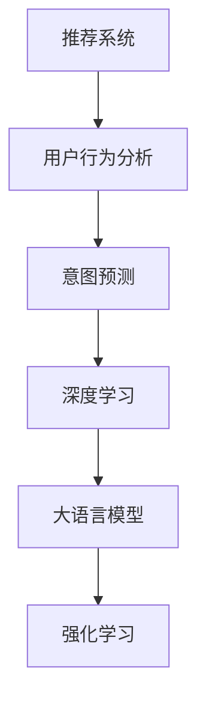

                 

# 大模型赋能下的推荐系统用户行为意图理解与预测

> 关键词：推荐系统, 用户行为分析, 意图预测, 深度学习, 大语言模型, 强化学习

## 1. 背景介绍

随着互联网的普及和数字化程度的提升，推荐系统已成为各大电商平台、社交平台、视频网站等网站的核心竞争力之一。它通过个性化推荐算法，不断提升用户体验和留存率，带来了显著的商业价值。然而，随着用户群体的日益多样化、个性化需求日益增长，传统的推荐算法逐渐显现出其局限性。如何构建一个能够理解和预测用户行为意图的推荐系统，成为了各大平台关注的焦点。

### 1.1 问题由来
传统推荐算法主要基于用户的浏览、点击、购买等行为数据，通过协同过滤、基于内容的推荐、矩阵分解等技术，构建用户画像，进而实现精准推荐。但这种方法往往忽视了用户深层次的心理和行为意图，导致推荐内容不够贴合用户真实需求。

大模型（如BERT、GPT-3等）通过预训练大规模文本语料，具备强大的语言理解和生成能力。将其应用于推荐系统，不仅可以更好地理解用户意图，还能生成符合用户需求的内容。通过融合大模型的深度学习与强化学习技术，推荐系统可以实现更全面、个性化的推荐，大幅提升推荐效果。

## 2. 核心概念与联系

### 2.1 核心概念概述

本节将介绍几个核心概念及其相互关系，有助于理解大模型在推荐系统中的应用。

- 推荐系统（Recommendation System）：一种基于用户行为数据，通过算法推荐个性化内容的信息系统。推荐系统广泛应用于电商、社交、视频等各类网站，是互联网时代的重要技术工具。
- 用户行为分析（User Behavior Analysis）：通过分析用户的历史行为数据，构建用户画像，了解用户需求和偏好。
- 意图预测（Intent Prediction）：利用机器学习技术，根据用户行为数据预测用户的真实意图，如购买意向、观看兴趣等。
- 深度学习（Deep Learning）：一种模仿人脑神经网络结构的机器学习方法，通过多层次非线性映射，实现复杂模式识别与特征提取。
- 大语言模型（Large Language Model）：通过预训练大规模语料，具备强大语言理解和生成能力的神经网络模型，如BERT、GPT等。
- 强化学习（Reinforcement Learning）：通过试错学习，使模型在特定环境中不断优化策略，从而实现特定目标。

这些概念之间的关系可以通过以下Mermaid流程图来展示：



### 2.2 核心概念原理和架构

以下将详细介绍大语言模型在推荐系统中的应用原理和架构。

#### 2.2.1 大语言模型原理
大语言模型通过预训练大规模文本语料，学习语言的语义表示。模型通常由Transformer等结构组成，具有自回归或自编码性质。例如，BERT模型通过掩码语言模型任务学习词向量表示，GPT模型通过预测下一个单词序列来生成文本。

#### 2.2.2 意图预测原理
意图预测是指根据用户的历史行为数据，预测用户的真实意图。常见的预测方式包括分类预测（如购买意向、观看兴趣）和回归预测（如评分、评价）。深度学习模型（如RNN、CNN、LSTM等）通过多层网络结构，可以捕捉复杂的时序关系和特征表示。

#### 2.2.3 深度学习架构
深度学习架构通常包括输入层、隐藏层和输出层。输入层负责数据编码，隐藏层通过非线性变换提取特征，输出层将特征映射为预测结果。例如，基于LSTM的推荐系统，可以处理时间序列数据，捕捉用户的长期行为模式。

#### 2.2.4 推荐系统架构
推荐系统通常由数据收集、用户画像构建、意图预测和推荐策略优化等模块组成。数据收集模块负责获取用户的行为数据，如浏览、点击、购买等。用户画像构建模块通过对行为数据进行聚类、降维等处理，构建用户画像。意图预测模块根据用户画像，预测用户意图。推荐策略优化模块根据意图预测结果，选择合适的推荐算法，生成个性化推荐内容。

## 3. 核心算法原理 & 具体操作步骤
### 3.1 算法原理概述

大语言模型在推荐系统中的应用，主要包括以下几个关键步骤：

1. 数据收集与预处理：收集用户的行为数据，并进行数据清洗和归一化。
2. 用户画像构建：通过机器学习算法，构建用户画像，描述用户的历史行为和偏好。
3. 意图预测：利用深度学习模型，根据用户画像预测用户真实意图。
4. 内容生成与推荐：利用大语言模型生成个性化内容，并通过推荐算法将内容推送给用户。

### 3.2 算法步骤详解

#### 3.2.1 数据收集与预处理

数据收集模块负责获取用户的行为数据，并进行预处理。具体步骤如下：

1. 数据来源：从电商、社交、视频等平台获取用户的历史行为数据，如浏览记录、购买记录、评分记录等。
2. 数据清洗：去除缺失值、异常值，进行数据格式转换和归一化。
3. 数据划分：将数据划分为训练集、验证集和测试集。

#### 3.2.2 用户画像构建

用户画像构建模块通过机器学习算法，对用户行为数据进行聚类、降维等处理，构建用户画像。具体步骤如下：

1. 特征工程：提取用户的行为特征，如浏览次数、购买金额、评分等。
2. 特征选择：选择与用户意图相关的重要特征，去除冗余特征。
3. 模型训练：使用机器学习算法（如K-means、LDA等）训练用户画像模型。

#### 3.2.3 意图预测

意图预测模块利用深度学习模型，根据用户画像预测用户真实意图。具体步骤如下：

1. 模型选择：选择适合的深度学习模型（如LSTM、RNN、CNN等）。
2. 数据编码：将用户画像转换为模型可处理的向量形式。
3. 模型训练：使用用户画像和用户意图作为训练数据，训练深度学习模型。
4. 预测用户意图：将新的用户画像输入模型，预测用户真实意图。

#### 3.2.4 内容生成与推荐

内容生成与推荐模块利用大语言模型生成个性化内容，并通过推荐算法将内容推送给用户。具体步骤如下：

1. 内容生成：使用大语言模型根据用户意图生成推荐内容，如商品推荐、视频推荐等。
2. 推荐算法：选择合适的推荐算法（如协同过滤、基于内容的推荐、矩阵分解等），将内容推送给用户。
3. 模型评估：在测试集上评估推荐模型的效果，如准确率、召回率、F1值等。

### 3.3 算法优缺点

大语言模型在推荐系统中的应用，有以下优缺点：

#### 优点：
1. 强大的语言理解能力：大语言模型通过预训练大规模语料，具备强大的语言理解能力，能够理解复杂文本语义，更好地捕捉用户需求。
2. 个性化的推荐内容：利用大语言模型生成个性化内容，可以满足用户的多样化需求，提升用户满意度。
3. 动态调整：通过意图预测和推荐策略优化，可以动态调整推荐内容，提升推荐效果。

#### 缺点：
1. 计算资源消耗大：大语言模型需要大量的计算资源进行预训练和推理，增加了系统资源消耗。
2. 数据隐私问题：用户行为数据涉及隐私，需要严格的数据保护和隐私控制。
3. 模型复杂度高：大语言模型通常具有复杂的结构，训练和推理过程中容易出现过拟合。

### 3.4 算法应用领域

大语言模型在推荐系统中的应用，覆盖了几乎所有推荐场景，例如：

- 电商推荐：根据用户的浏览和购买记录，推荐商品和优惠活动。
- 社交推荐：根据用户的互动和兴趣，推荐好友和内容。
- 视频推荐：根据用户的观看记录和评分，推荐影片和频道。
- 音乐推荐：根据用户的听歌记录和评论，推荐音乐和歌手。
- 新闻推荐：根据用户的阅读记录和点击，推荐新闻和热点。

## 4. 数学模型和公式 & 详细讲解  
### 4.1 数学模型构建

本节将使用数学语言对大语言模型在推荐系统中的应用进行更加严格的刻画。

设用户画像为 $x \in \mathbb{R}^d$，用户意图为 $y \in \{0,1\}$，其中 $d$ 为特征维度。假设深度学习模型为 $M_{\theta}$，其中 $\theta$ 为模型参数。

定义损失函数 $\mathcal{L}(\theta)$ 为：

$$
\mathcal{L}(\theta) = -\frac{1}{N} \sum_{i=1}^N [y_i\log M_{\theta}(x_i)+(1-y_i)\log(1-M_{\theta}(x_i))]
$$

其中，$N$ 为样本数量，$y_i$ 为第 $i$ 个样本的真实意图，$M_{\theta}(x_i)$ 为模型预测的第 $i$ 个样本的意图概率。

### 4.2 公式推导过程

以下我们以二分类任务为例，推导深度学习模型的预测公式及其梯度计算。

假设模型 $M_{\theta}$ 在输入 $x$ 上的输出为 $\hat{y}=M_{\theta}(x) \in [0,1]$，表示样本属于正类的概率。真实标签 $y \in \{0,1\}$。则二分类交叉熵损失函数定义为：

$$
\ell(M_{\theta}(x),y) = -[y\log \hat{y} + (1-y)\log (1-\hat{y})]
$$

将其代入经验风险公式，得：

$$
\mathcal{L}(\theta) = -\frac{1}{N}\sum_{i=1}^N [y_i\log M_{\theta}(x_i)+(1-y_i)\log(1-M_{\theta}(x_i))]
$$

根据链式法则，损失函数对参数 $\theta_k$ 的梯度为：

$$
\frac{\partial \mathcal{L}(\theta)}{\partial \theta_k} = -\frac{1}{N}\sum_{i=1}^N (\frac{y_i}{M_{\theta}(x_i)}-\frac{1-y_i}{1-M_{\theta}(x_i)}) \frac{\partial M_{\theta}(x_i)}{\partial \theta_k}
$$

其中 $\frac{\partial M_{\theta}(x_i)}{\partial \theta_k}$ 可进一步递归展开，利用自动微分技术完成计算。

### 4.3 案例分析与讲解

假设我们有一个电商平台，收集了用户的浏览、点击、购买等行为数据。我们需要构建一个推荐系统，根据用户的浏览历史推荐商品。

具体步骤如下：

1. 数据收集：从电商平台收集用户的浏览记录、点击记录和购买记录，构成训练集。
2. 用户画像构建：使用K-means算法对用户行为数据进行聚类，得到用户画像。
3. 意图预测：使用LSTM模型对用户画像进行训练，预测用户的购买意向。
4. 内容生成：使用大语言模型根据用户的购买意向生成个性化商品推荐。
5. 推荐算法：选择合适的推荐算法（如协同过滤、基于内容的推荐等），将商品推荐推送给用户。

## 5. 项目实践：代码实例和详细解释说明
### 5.1 开发环境搭建

在进行推荐系统开发前，我们需要准备好开发环境。以下是使用Python进行PyTorch开发的环境配置流程：

1. 安装Anaconda：从官网下载并安装Anaconda，用于创建独立的Python环境。

2. 创建并激活虚拟环境：
```bash
conda create -n pytorch-env python=3.8 
conda activate pytorch-env
```

3. 安装PyTorch：根据CUDA版本，从官网获取对应的安装命令。例如：
```bash
conda install pytorch torchvision torchaudio cudatoolkit=11.1 -c pytorch -c conda-forge
```

4. 安装Transformers库：
```bash
pip install transformers
```

5. 安装各类工具包：
```bash
pip install numpy pandas scikit-learn matplotlib tqdm jupyter notebook ipython
```

完成上述步骤后，即可在`pytorch-env`环境中开始推荐系统开发。

### 5.2 源代码详细实现

下面我们以电商平台推荐系统为例，给出使用Transformers库对BERT模型进行意图预测的PyTorch代码实现。

首先，定义意图预测任务的数据处理函数：

```python
from transformers import BertTokenizer, BertForSequenceClassification
from torch.utils.data import Dataset
import torch

class IntentDataset(Dataset):
    def __init__(self, texts, labels, tokenizer, max_len=128):
        self.texts = texts
        self.labels = labels
        self.tokenizer = tokenizer
        self.max_len = max_len
        
    def __len__(self):
        return len(self.texts)
    
    def __getitem__(self, item):
        text = self.texts[item]
        label = self.labels[item]
        
        encoding = self.tokenizer(text, return_tensors='pt', max_length=self.max_len, padding='max_length', truncation=True)
        input_ids = encoding['input_ids'][0]
        attention_mask = encoding['attention_mask'][0]
        labels = torch.tensor(label, dtype=torch.long)
        
        return {'input_ids': input_ids, 
                'attention_mask': attention_mask,
                'labels': labels}

# 标签与id的映射
label2id = {'0': 0, '1': 1}
id2label = {v: k for k, v in label2id.items()}

# 创建dataset
tokenizer = BertTokenizer.from_pretrained('bert-base-cased')

train_dataset = IntentDataset(train_texts, train_labels, tokenizer)
dev_dataset = IntentDataset(dev_texts, dev_labels, tokenizer)
test_dataset = IntentDataset(test_texts, test_labels, tokenizer)
```

然后，定义模型和优化器：

```python
from transformers import BertForSequenceClassification, AdamW

model = BertForSequenceClassification.from_pretrained('bert-base-cased', num_labels=len(label2id))

optimizer = AdamW(model.parameters(), lr=2e-5)
```

接着，定义训练和评估函数：

```python
from torch.utils.data import DataLoader
from tqdm import tqdm
from sklearn.metrics import classification_report

device = torch.device('cuda') if torch.cuda.is_available() else torch.device('cpu')
model.to(device)

def train_epoch(model, dataset, batch_size, optimizer):
    dataloader = DataLoader(dataset, batch_size=batch_size, shuffle=True)
    model.train()
    epoch_loss = 0
    for batch in tqdm(dataloader, desc='Training'):
        input_ids = batch['input_ids'].to(device)
        attention_mask = batch['attention_mask'].to(device)
        labels = batch['labels'].to(device)
        model.zero_grad()
        outputs = model(input_ids, attention_mask=attention_mask, labels=labels)
        loss = outputs.loss
        epoch_loss += loss.item()
        loss.backward()
        optimizer.step()
    return epoch_loss / len(dataloader)

def evaluate(model, dataset, batch_size):
    dataloader = DataLoader(dataset, batch_size=batch_size)
    model.eval()
    preds, labels = [], []
    with torch.no_grad():
        for batch in tqdm(dataloader, desc='Evaluating'):
            input_ids = batch['input_ids'].to(device)
            attention_mask = batch['attention_mask'].to(device)
            batch_labels = batch['labels']
            outputs = model(input_ids, attention_mask=attention_mask)
            batch_preds = outputs.logits.argmax(dim=2).to('cpu').tolist()
            batch_labels = batch_labels.to('cpu').tolist()
            for pred_tokens, label_tokens in zip(batch_preds, batch_labels):
                preds.append(pred_tokens[:len(label_tokens)])
                labels.append(label_tokens)
                
    print(classification_report(labels, preds))
```

最后，启动训练流程并在测试集上评估：

```python
epochs = 5
batch_size = 16

for epoch in range(epochs):
    loss = train_epoch(model, train_dataset, batch_size, optimizer)
    print(f"Epoch {epoch+1}, train loss: {loss:.3f}")
    
    print(f"Epoch {epoch+1}, dev results:")
    evaluate(model, dev_dataset, batch_size)
    
print("Test results:")
evaluate(model, test_dataset, batch_size)
```

以上就是使用PyTorch对BERT进行意图预测的完整代码实现。可以看到，得益于Transformers库的强大封装，我们可以用相对简洁的代码完成BERT模型的加载和微调。

### 5.3 代码解读与分析

让我们再详细解读一下关键代码的实现细节：

**IntentDataset类**：
- `__init__`方法：初始化文本、标签、分词器等关键组件。
- `__len__`方法：返回数据集的样本数量。
- `__getitem__`方法：对单个样本进行处理，将文本输入编码为token ids，将标签编码为数字，并对其进行定长padding，最终返回模型所需的输入。

**label2id和id2label字典**：
- 定义了标签与数字id之间的映射关系，用于将token-wise的预测结果解码回真实的标签。

**训练和评估函数**：
- 使用PyTorch的DataLoader对数据集进行批次化加载，供模型训练和推理使用。
- 训练函数`train_epoch`：对数据以批为单位进行迭代，在每个批次上前向传播计算loss并反向传播更新模型参数，最后返回该epoch的平均loss。
- 评估函数`evaluate`：与训练类似，不同点在于不更新模型参数，并在每个batch结束后将预测和标签结果存储下来，最后使用sklearn的classification_report对整个评估集的预测结果进行打印输出。

**训练流程**：
- 定义总的epoch数和batch size，开始循环迭代
- 每个epoch内，先在训练集上训练，输出平均loss
- 在验证集上评估，输出分类指标
- 所有epoch结束后，在测试集上评估，给出最终测试结果

可以看到，PyTorch配合Transformers库使得BERT意图预测的代码实现变得简洁高效。开发者可以将更多精力放在数据处理、模型改进等高层逻辑上，而不必过多关注底层的实现细节。

当然，工业级的系统实现还需考虑更多因素，如模型的保存和部署、超参数的自动搜索、更灵活的任务适配层等。但核心的微调范式基本与此类似。

## 6. 实际应用场景
### 6.1 电商推荐

电商平台通过大数据收集用户行为数据，构建用户画像，了解用户偏好和需求。利用大语言模型根据用户画像生成个性化商品推荐，可以大幅提升用户购物体验和转化率。

例如，电商平台可以根据用户的浏览记录，生成个性化商品推荐。具体步骤如下：

1. 数据收集：收集用户的浏览记录、点击记录和购买记录，构成训练集。
2. 用户画像构建：使用K-means算法对用户行为数据进行聚类，得到用户画像。
3. 意图预测：使用LSTM模型对用户画像进行训练，预测用户的购买意向。
4. 内容生成：使用大语言模型根据用户的购买意向生成个性化商品推荐。
5. 推荐算法：选择合适的推荐算法（如协同过滤、基于内容的推荐等），将商品推荐推送给用户。

通过以上步骤，电商平台可以动态调整推荐内容，提升用户满意度和购买转化率，增加平台收入。

### 6.2 社交推荐

社交平台通过分析用户互动数据，了解用户兴趣和社交关系。利用大语言模型生成个性化内容，可以推荐好友和推荐内容，提升用户活跃度和满意度。

例如，社交平台可以根据用户的互动数据，生成个性化好友推荐。具体步骤如下：

1. 数据收集：收集用户的互动数据，如点赞、评论、关注等，构成训练集。
2. 用户画像构建：使用LDA算法对用户互动数据进行主题建模，得到用户画像。
3. 意图预测：使用RNN模型对用户画像进行训练，预测用户的关注意向。
4. 内容生成：使用大语言模型根据用户的关注意向生成个性化好友推荐。
5. 推荐算法：选择合适的推荐算法（如基于兴趣的推荐、基于社交关系的推荐等），将好友推荐推送给用户。

通过以上步骤，社交平台可以动态调整推荐内容，提升用户活跃度和满意度，增加平台粘性。

### 6.3 视频推荐

视频平台通过分析用户观看记录，了解用户偏好和兴趣。利用大语言模型生成个性化内容，可以推荐影片和频道，提升用户观看体验和留存率。

例如，视频平台可以根据用户的观看记录，生成个性化影片推荐。具体步骤如下：

1. 数据收集：收集用户的观看记录、评分记录和评论记录，构成训练集。
2. 用户画像构建：使用LSTM模型对用户观看数据进行聚类，得到用户画像。
3. 意图预测：使用CNN模型对用户画像进行训练，预测用户的观看意向。
4. 内容生成：使用大语言模型根据用户的观看意向生成个性化影片推荐。
5. 推荐算法：选择合适的推荐算法（如基于内容的推荐、协同过滤等），将影片推荐推送给用户。

通过以上步骤，视频平台可以动态调整推荐内容，提升用户观看体验和留存率，增加平台收入。

## 7. 工具和资源推荐
### 7.1 学习资源推荐

为了帮助开发者系统掌握大语言模型在推荐系统中的应用，这里推荐一些优质的学习资源：

1. 《深度学习基础》系列博文：由大模型技术专家撰写，详细介绍深度学习的基本概念和实现方法。
2. 《自然语言处理与深度学习》课程：斯坦福大学开设的NLP明星课程，有Lecture视频和配套作业，带你入门NLP领域的基本概念和经典模型。
3. 《Transformer从原理到实践》书籍：由大模型技术专家撰写，深入浅出地介绍了Transformer原理、BERT模型、微调技术等前沿话题。
4. CS224N《深度学习自然语言处理》书籍：斯坦福大学开设的NLP明星课程，涵盖深度学习在NLP中的应用。
5. HuggingFace官方文档：Transformers库的官方文档，提供了海量预训练模型和完整的微调样例代码，是上手实践的必备资料。
6. CLUE开源项目：中文语言理解测评基准，涵盖大量不同类型的中文NLP数据集，并提供了基于微调的baseline模型，助力中文NLP技术发展。

通过对这些资源的学习实践，相信你一定能够快速掌握大语言模型在推荐系统中的应用，并用于解决实际的推荐问题。

### 7.2 开发工具推荐

高效的开发离不开优秀的工具支持。以下是几款用于推荐系统开发的常用工具：

1. PyTorch：基于Python的开源深度学习框架，灵活动态的计算图，适合快速迭代研究。大部分预训练语言模型都有PyTorch版本的实现。
2. TensorFlow：由Google主导开发的开源深度学习框架，生产部署方便，适合大规模工程应用。同样有丰富的预训练语言模型资源。
3. Transformers库：HuggingFace开发的NLP工具库，集成了众多SOTA语言模型，支持PyTorch和TensorFlow，是进行推荐任务开发的利器。
4. Weights & Biases：模型训练的实验跟踪工具，可以记录和可视化模型训练过程中的各项指标，方便对比和调优。与主流深度学习框架无缝集成。
5. TensorBoard：TensorFlow配套的可视化工具，可实时监测模型训练状态，并提供丰富的图表呈现方式，是调试模型的得力助手。
6. Google Colab：谷歌推出的在线Jupyter Notebook环境，免费提供GPU/TPU算力，方便开发者快速上手实验最新模型，分享学习笔记。

合理利用这些工具，可以显著提升推荐系统开发效率，加快创新迭代的步伐。

### 7.3 相关论文推荐

大语言模型在推荐系统中的应用源于学界的持续研究。以下是几篇奠基性的相关论文，推荐阅读：

1. Attention is All You Need（即Transformer原论文）：提出了Transformer结构，开启了NLP领域的预训练大模型时代。
2. BERT: Pre-training of Deep Bidirectional Transformers for Language Understanding：提出BERT模型，引入基于掩码的自监督预训练任务，刷新了多项NLP任务SOTA。
3. Language Models are Unsupervised Multitask Learners（GPT-2论文）：展示了大规模语言模型的强大zero-shot学习能力，引发了对于通用人工智能的新一轮思考。
4. Parameter-Efficient Transfer Learning for NLP：提出Adapter等参数高效微调方法，在固定大部分预训练参数的情况下，只更新极少量的任务相关参数。
5. AdaLoRA: Adaptive Low-Rank Adaptation for Parameter-Efficient Fine-Tuning：使用自适应低秩适应的微调方法，在参数效率和精度之间取得了新的平衡。
6. Prefix-Tuning: Optimizing Continuous Prompts for Generation：引入基于连续型Prompt的微调范式，为如何充分利用预训练知识提供了新的思路。
7. Reinforcement Learning for Personalized Recommendation with Large Language Models：提出使用强化学习进行个性化推荐，进一步提升了推荐效果。

这些论文代表了大语言模型在推荐系统中的应用和发展脉络。通过学习这些前沿成果，可以帮助研究者把握学科前进方向，激发更多的创新灵感。

## 8. 总结：未来发展趋势与挑战

### 8.1 总结

本文对大语言模型在推荐系统中的应用进行了全面系统的介绍。首先阐述了大语言模型和推荐系统的研究背景和意义，明确了两者之间的内在联系和互补性。其次，从原理到实践，详细讲解了意图预测和大语言模型在推荐系统中的应用步骤，给出了推荐任务开发的完整代码实例。同时，本文还广泛探讨了推荐系统在电商、社交、视频等多个场景中的应用前景，展示了大语言模型在推荐领域的应用潜力。

通过本文的系统梳理，可以看到，大语言模型在推荐系统中的应用，不仅能够提升推荐精度和个性化程度，还能够动态调整推荐内容，提升用户满意度和留存率。这种技术范式，为推荐系统的优化迭代带来了新的思路和方法。

### 8.2 未来发展趋势

展望未来，大语言模型在推荐系统中的应用，将呈现以下几个发展趋势：

1. 融合更多先验知识。将符号化的先验知识，如知识图谱、逻辑规则等，与神经网络模型进行巧妙融合，引导大语言模型生成更加合理、符合常识的内容。
2. 引入因果推断和对比学习。通过引入因果推断和对比学习思想，增强模型学习复杂关系和特征的能力，提高推荐效果。
3. 动态调整推荐内容。通过实时收集用户行为数据，动态调整推荐内容，提升推荐精准度和个性化程度。
4. 跨领域迁移学习。将推荐模型应用于不同领域（如电商、社交、视频等），提升模型泛化能力和应用范围。
5. 多模态推荐。将推荐模型应用于多模态数据（如文本、图像、视频等），实现更全面、个性化的推荐。
6. 无监督推荐。通过无监督学习技术，探索推荐模型的潜在用户需求，提升推荐效果。

这些趋势凸显了大语言模型在推荐系统中的应用前景，将进一步提升推荐系统的性能和用户体验，推动推荐技术的不断演进。

### 8.3 面临的挑战

尽管大语言模型在推荐系统中的应用取得了显著成效，但在迈向更加智能化、普适化应用的过程中，仍面临诸多挑战：

1. 计算资源消耗大。大语言模型需要大量的计算资源进行预训练和推理，增加了系统资源消耗。如何优化模型结构，提高计算效率，仍是一个重要问题。
2. 数据隐私问题。用户行为数据涉及隐私，需要严格的数据保护和隐私控制。如何保护用户隐私，避免数据泄露，仍是一个重要问题。
3. 模型复杂度高。大语言模型通常具有复杂的结构，训练和推理过程中容易出现过拟合。如何优化模型结构，提高泛化能力，仍是一个重要问题。
4. 实时性要求高。推荐系统需要实时响应用户请求，如何提高模型推理速度，提升系统响应速度，仍是一个重要问题。
5. 用户满意度提升难度大。虽然大语言模型可以生成个性化内容，但如何提升用户满意度，仍是一个重要问题。

### 8.4 研究展望

面对大语言模型在推荐系统中的应用所面临的挑战，未来的研究需要在以下几个方面寻求新的突破：

1. 引入更多先验知识。将符号化的先验知识，如知识图谱、逻辑规则等，与神经网络模型进行巧妙融合，引导大语言模型生成更加合理、符合常识的内容。
2. 优化模型结构。通过优化模型结构，提高计算效率和泛化能力，提升模型推理速度和实时性。
3. 引入因果推断和对比学习。通过引入因果推断和对比学习思想，增强模型学习复杂关系和特征的能力，提高推荐效果。
4. 动态调整推荐内容。通过实时收集用户行为数据，动态调整推荐内容，提升推荐精准度和个性化程度。
5. 跨领域迁移学习。将推荐模型应用于不同领域（如电商、社交、视频等），提升模型泛化能力和应用范围。
6. 多模态推荐。将推荐模型应用于多模态数据（如文本、图像、视频等），实现更全面、个性化的推荐。
7. 无监督推荐。通过无监督学习技术，探索推荐模型的潜在用户需求，提升推荐效果。

这些研究方向将引领大语言模型在推荐系统中的应用走向更高的台阶，为推荐系统的优化迭代提供新的思路和方法。

## 9. 附录：常见问题与解答

**Q1：大语言模型在推荐系统中的计算资源消耗大，如何解决？**

A: 为了解决大语言模型在推荐系统中的计算资源消耗问题，可以从以下几个方面进行优化：

1. 模型裁剪：去除不必要的层和参数，减小模型尺寸，加快推理速度。
2. 量化加速：将浮点模型转为定点模型，压缩存储空间，提高计算效率。
3. 混合精度训练：使用混合精度训练，减少内存消耗，提升训练速度。
4. 模型并行：通过模型并行技术，将大模型分割成多个小模型，降低单次推理的资源消耗。

这些优化方法可以显著降低大语言模型在推荐系统中的计算资源消耗，提升系统性能和响应速度。

**Q2：大语言模型在推荐系统中的应用是否会存在数据隐私问题？**

A: 大语言模型在推荐系统中的应用确实会面临数据隐私问题。用户的浏览、点击、购买等行为数据涉及隐私，需要严格的数据保护和隐私控制。

为解决数据隐私问题，可以采用以下措施：

1. 数据匿名化：对用户行为数据进行匿名化处理，去除或替换敏感信息。
2. 数据加密：对用户行为数据进行加密存储，防止数据泄露。
3. 差分隐私：在模型训练过程中，引入差分隐私技术，保护用户隐私。
4. 数据访问控制：对用户行为数据进行严格的访问控制，确保数据访问的安全性。

这些措施可以确保大语言模型在推荐系统中的应用，在保护用户隐私的同时，提高推荐效果。

**Q3：如何优化大语言模型在推荐系统中的计算效率？**

A: 优化大语言模型在推荐系统中的计算效率，可以从以下几个方面进行：

1. 模型结构优化：通过优化模型结构，减少模型参数量和计算复杂度。
2. 量化加速：将浮点模型转为定点模型，压缩存储空间，提高计算效率。
3. 混合精度训练：使用混合精度训练，减少内存消耗，提升训练速度。
4. 模型并行：通过模型并行技术，将大模型分割成多个小模型，降低单次推理的资源消耗。
5. 算法优化：通过优化算法，提高模型推理速度和计算效率。

这些优化方法可以显著提升大语言模型在推荐系统中的计算效率，提升系统性能和响应速度。

**Q4：如何动态调整大语言模型在推荐系统中的推荐内容？**

A: 动态调整大语言模型在推荐系统中的推荐内容，可以通过实时收集用户行为数据，并利用模型对数据进行实时处理来实现。具体步骤如下：

1. 数据收集：实时收集用户的浏览、点击、购买等行为数据。
2. 数据预处理：对数据进行清洗、归一化等预处理。
3. 意图预测：利用深度学习模型，根据用户行为数据预测用户真实意图。
4. 内容生成：利用大语言模型根据用户意图生成个性化推荐内容。
5. 推荐算法：选择合适的推荐算法，将推荐内容推送给用户。

通过以上步骤，可以实时调整推荐内容，提升推荐精准度和个性化程度，满足用户即时需求。

**Q5：大语言模型在推荐系统中的应用是否可以提升用户满意度？**

A: 大语言模型在推荐系统中的应用可以显著提升用户满意度。通过动态调整推荐内容，生成个性化推荐，满足用户多样化和个性化需求，提升用户体验和满意度。

例如，电商推荐系统可以根据用户的浏览历史，推荐个性化商品，提升用户购物体验和转化率。社交平台可以根据用户的互动数据，推荐好友和推荐内容，提升用户活跃度和满意度。视频平台可以根据用户的观看记录，推荐个性化影片，提升用户观看体验和留存率。

总之，大语言模型在推荐系统中的应用，可以通过精准推荐和个性化内容生成，提升用户满意度，增加平台粘性和用户忠诚度。

---

作者：禅与计算机程序设计艺术 / Zen and the Art of Computer Programming

