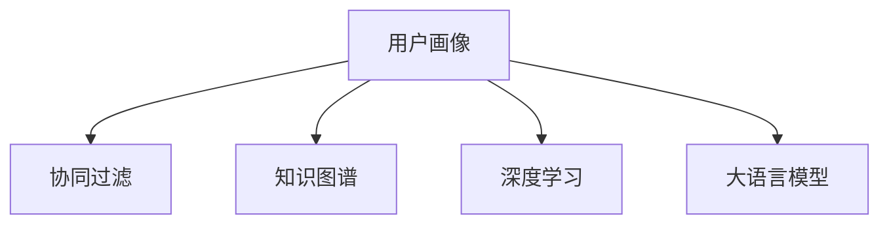

                 

# 大模型辅助的推荐系统多维度用户画像构建

> 关键词：推荐系统,用户画像,大语言模型,多维度构建,协同过滤,知识图谱

## 1. 背景介绍

推荐系统是互联网时代的重要组成部分，通过推荐算法将用户与产品进行匹配，提升用户体验和运营效率。而用户画像（User Profile）则是对用户特征的全面描述，为推荐算法提供更准确的输入，从而提高推荐效果。随着技术的发展，推荐系统从传统的基于协同过滤、内容匹配等方法，逐渐向深度学习和多模态融合等方向演进，其中大语言模型因其强大的文本理解和生成能力，被广泛应用于用户画像构建。

### 1.1 推荐系统的发展

推荐系统的发展历程经历了多个阶段：

1. **协同过滤**：利用用户历史行为数据和物品评分数据，通过用户相似度和物品相似度计算，为用户推荐可能感兴趣的物品。
2. **内容匹配**：根据物品的特征与用户的历史偏好，通过匹配相似性来推荐物品。
3. **深度学习**：采用神经网络等深度学习方法，对用户历史行为和物品属性进行建模，预测用户对未交互物品的评分。
4. **多模态融合**：结合用户的历史行为数据、社交网络、位置信息等多维数据，提高推荐算法的精准度和泛化能力。
5. **大语言模型**：利用大语言模型对用户文本数据进行深度理解，构建更加全面和深入的用户画像，进一步提升推荐效果。

当前，深度学习和多模态融合已经成为推荐系统的主流技术，而大语言模型的引入，进一步拓展了用户画像的构建维度，提升了推荐系统的智能化水平。

### 1.2 用户画像的构建

用户画像的构建是将用户的各种特征进行综合和抽象的过程，通常包括以下几个维度：

1. **人口统计特征**：如年龄、性别、职业、收入等。
2. **行为特征**：如浏览历史、购买记录、评分记录等。
3. **兴趣特征**：如搜索关键词、点击兴趣点等。
4. **社会特征**：如社交网络、地理位置等。
5. **情感特征**：如对不同物品的情绪反应等。

这些特征构成了用户画像的基础，而随着深度学习和大语言模型的引入，推荐系统可以挖掘更深层、更广泛的特征，进一步细化和丰富用户画像，提高推荐的个性化和精准度。

## 2. 核心概念与联系

### 2.1 核心概念概述

在推荐系统中，用户画像的构建和优化是关键步骤。而大语言模型作为新一代的智能助手，因其卓越的自然语言处理能力，在用户画像的构建中发挥了重要作用。

- **用户画像**：对用户特征的全面描述，包含多种维度的信息。
- **协同过滤**：基于用户的历史行为和物品的交互数据，计算用户和物品之间的相似性，推荐相关物品。
- **知识图谱**：结构化的语义网络，用于描述实体和关系，辅助推荐系统理解复杂语义。
- **深度学习**：利用神经网络对用户和物品的特征进行建模，提高推荐的准确性。
- **大语言模型**：能够理解和生成自然语言的强大模型，用于处理文本数据，提升用户画像的深度和广度。

这些概念之间的关系可以通过以下Mermaid流程图来展示：



该图展示了用户画像构建过程中各个技术组件的关系：

1. **用户画像**：作为推荐系统输出的结果，用户画像包括了用户历史行为、兴趣偏好、社会关系等多维度信息。
2. **协同过滤**：通过计算用户和物品之间的相似度，为用户推荐相关物品。
3. **知识图谱**：为推荐系统提供结构化的语义信息，辅助理解复杂语义。
4. **深度学习**：对用户和物品的特征进行建模，提高推荐的准确性。
5. **大语言模型**：通过理解文本数据，提取深层次的语义特征，丰富用户画像的维度。

这些概念共同构成了一个完整的推荐系统框架，其中大语言模型作为重要的技术手段，在用户画像的构建中起到了至关重要的作用。

## 3. 核心算法原理 & 具体操作步骤

### 3.1 算法原理概述

大语言模型在推荐系统中的应用主要体现在用户画像的构建上，具体过程可以分为以下几个步骤：

1. **数据收集**：收集用户的各类行为数据，包括浏览记录、评分记录、点击记录等。
2. **文本处理**：将文本数据进行处理，去除噪声，提取有意义的特征。
3. **模型训练**：利用大语言模型对处理后的文本数据进行训练，提取深层次的语义特征。
4. **画像融合**：将模型提取的语义特征与其他特征进行融合，构建多维度的用户画像。
5. **画像优化**：通过不断地微调，优化用户画像，提高其准确性和泛化能力。

这一过程体现了深度学习和自然语言处理技术的结合，能够更全面地描述用户特征，提升推荐的个性化和精准度。

### 3.2 算法步骤详解

下面详细讲解大语言模型在推荐系统用户画像构建的具体操作步骤：

#### 3.2.1 数据收集

收集用户的各类行为数据是构建用户画像的基础。数据通常包括：

- **点击数据**：用户在页面上的点击记录。
- **浏览数据**：用户在页面上的停留时间、浏览路径等。
- **评分数据**：用户对物品的评分记录。
- **评论数据**：用户对物品的评论文本。
- **社交数据**：用户在社交网络上的互动记录。

这些数据可以通过网站、应用等平台进行收集。

#### 3.2.2 文本处理

文本数据在构建用户画像中扮演重要角色，需要进行预处理和特征提取：

- **文本清洗**：去除停用词、标点符号等噪声。
- **分词**：将文本分解成词语，便于后续处理。
- **特征提取**：使用TF-IDF、Word2Vec等技术，提取词语的权重和语义信息。
- **情感分析**：使用情感词典或大语言模型，对文本情感进行分类。

处理后的文本数据将用于模型训练。

#### 3.2.3 模型训练

利用大语言模型对文本数据进行训练，提取语义特征：

- **预训练**：在大规模无标签文本数据上进行预训练，学习通用语言表示。
- **微调**：在标注数据上微调模型，提取用户兴趣、情感等特征。
- **特征融合**：将模型提取的特征与其他特征进行融合，如使用矩阵分解、稠密向量等技术，将高维稀疏特征降维。

#### 3.2.4 画像融合

将模型提取的语义特征与其他特征进行融合，构建多维度的用户画像：

- **多维度画像**：将人口统计特征、行为特征、兴趣特征、社会特征等数据，与模型提取的语义特征进行融合，形成综合画像。
- **画像表示**：将多维度画像转化为向量表示，便于计算相似度。
- **画像优化**：通过不断的微调，优化画像的质量，提升推荐的准确性。

#### 3.2.5 画像优化

画像优化是提升推荐效果的重要环节，具体包括以下几个步骤：

- **特征选择**：选择对推荐效果影响较大的特征，去除冗余特征。
- **权重调整**：调整各特征的权重，使画像更加精准。
- **画像更新**：根据用户的实时行为数据，更新用户画像，使其更加贴合用户当前状态。
- **对抗训练**：在对抗样本上训练模型，提升画像的鲁棒性和泛化能力。

### 3.3 算法优缺点

大语言模型在用户画像构建中的优势主要体现在以下几个方面：

- **语义理解能力**：能够理解复杂的语义信息，提取深层次的语义特征。
- **泛化能力强**：在无监督或少样本情况下，仍能提取有意义的特征。
- **易于融合**：能够与其他数据类型（如图像、视频等）进行多模态融合，提升推荐效果。
- **适应性强**：能够适应各种推荐场景，如电商、新闻、娱乐等。

然而，大语言模型在用户画像构建中也有一些局限性：

- **资源需求高**：大语言模型需要大量数据和计算资源进行训练和推理。
- **过拟合风险**：在标注数据较少的情况下，容易出现过拟合。
- **解释性差**：大语言模型往往作为黑盒使用，难以解释其决策过程。
- **隐私保护**：用户隐私数据的处理需要严格的隐私保护措施。

### 3.4 算法应用领域

大语言模型在用户画像构建中的应用已经涵盖了多个领域，包括：

- **电商推荐**：根据用户的浏览历史和评论文本，推荐相关商品。
- **内容推荐**：根据用户的兴趣偏好，推荐新闻、文章、视频等。
- **社交推荐**：根据用户的社交关系，推荐朋友或关注的人。
- **广告推荐**：根据用户的兴趣和行为，推荐广告内容。
- **旅游推荐**：根据用户的旅游历史和偏好，推荐旅游目的地。

这些应用场景展示了大语言模型在推荐系统中的强大潜力，通过构建多维度的用户画像，提升推荐的个性化和精准度，提高用户满意度和运营效率。

## 4. 数学模型和公式 & 详细讲解 & 举例说明

### 4.1 数学模型构建

大语言模型在用户画像构建中的应用主要体现在对文本数据的建模上。假设用户画像为 $\mathbf{P}$，其中 $d$ 为特征维度，$x_i$ 为用户画像的 $i$ 维特征。则用户画像可以表示为：

$$
\mathbf{P} = [p_1, p_2, ..., p_d] \in \mathbb{R}^d
$$

其中 $p_i$ 表示用户画像的第 $i$ 维特征，可以是年龄、性别、浏览时长等。

### 4.2 公式推导过程

假设用户画像由大语言模型提取的语义特征 $\mathbf{S}$ 和行为特征 $\mathbf{B}$ 组成，则用户画像可以表示为：

$$
\mathbf{P} = \alpha \mathbf{S} + \beta \mathbf{B}
$$

其中 $\alpha$ 和 $\beta$ 为权重参数，控制各特征的贡献。

#### 4.2.1 语义特征提取

假设大语言模型提取的语义特征 $\mathbf{S} = [s_1, s_2, ..., s_k] \in \mathbb{R}^k$，其中 $k$ 为语义特征的维度。则语义特征可以表示为：

$$
\mathbf{S} = M(\mathbf{X})W
$$

其中 $M$ 为大语言模型，$\mathbf{X}$ 为输入文本，$W$ 为模型权重矩阵。

#### 4.2.2 行为特征提取

假设行为特征 $\mathbf{B} = [b_1, b_2, ..., b_l] \in \mathbb{R}^l$，其中 $l$ 为行为特征的维度。则行为特征可以表示为：

$$
\mathbf{B} = C(\mathbf{Y})V
$$

其中 $C$ 为行为特征提取模型，$\mathbf{Y}$ 为行为数据，$V$ 为模型权重矩阵。

#### 4.2.3 画像融合

假设用户画像的最终表示为 $\mathbf{P} = [p_1, p_2, ..., p_d] \in \mathbb{R}^d$，则用户画像的构建过程可以表示为：

$$
\mathbf{P} = \alpha \mathbf{S} + \beta \mathbf{B} = \alpha M(\mathbf{X})W + \beta C(\mathbf{Y})V
$$

通过不断微调 $\alpha$ 和 $\beta$，优化用户画像的权重，使画像更加贴合用户需求。

### 4.3 案例分析与讲解

以电商推荐系统为例，分析大语言模型在用户画像构建中的应用。

假设用户画像由以下几部分组成：

- **人口统计特征**：年龄、性别、职业等。
- **行为特征**：浏览记录、购买记录、评分记录等。
- **语义特征**：用户对商品评论的情感、用户搜索关键词的情感等。

则用户画像可以表示为：

$$
\mathbf{P} = [p_1, p_2, ..., p_d] = \alpha [S_{1}, S_{2}, ..., S_{k}] + \beta [B_{1}, B_{2}, ..., B_{l}]
$$

其中 $S_{i}$ 表示用户对第 $i$ 个商品的评论情感，$B_{j}$ 表示用户对第 $j$ 个商品的历史评分。

假设用户画像的总特征数为 $d=10$，其中语义特征 $k=5$，行为特征 $l=5$。则用户画像的表示为：

$$
\mathbf{P} = \alpha [S_{1}, S_{2}, ..., S_{5}] + \beta [B_{1}, B_{2}, ..., B_{5}]
$$

通过不断微调 $\alpha$ 和 $\beta$，使画像更加贴合用户需求，提升推荐的准确性。

## 5. 项目实践：代码实例和详细解释说明

### 5.1 开发环境搭建

进行大语言模型用户画像构建，需要先准备好开发环境。以下是使用Python进行PyTorch和HuggingFace的开发环境配置流程：

1. 安装Anaconda：从官网下载并安装Anaconda，用于创建独立的Python环境。

2. 创建并激活虚拟环境：
```bash
conda create -n pytorch-env python=3.8 
conda activate pytorch-env
```

3. 安装PyTorch：根据CUDA版本，从官网获取对应的安装命令。例如：
```bash
conda install pytorch torchvision torchaudio cudatoolkit=11.1 -c pytorch -c conda-forge
```

4. 安装HuggingFace库：
```bash
pip install transformers
```

5. 安装各类工具包：
```bash
pip install numpy pandas scikit-learn matplotlib tqdm jupyter notebook ipython
```

完成上述步骤后，即可在`pytorch-env`环境中开始用户画像构建的实践。

### 5.2 源代码详细实现

下面我们以电商推荐系统为例，给出使用PyTorch和HuggingFace对BERT模型进行用户画像构建的Python代码实现。

首先，定义用户画像的数据处理函数：

```python
from transformers import BertTokenizer
from torch.utils.data import Dataset
import torch

class UserProfileDataset(Dataset):
    def __init__(self, user_profiles, tokenizer, max_len=128):
        self.user_profiles = user_profiles
        self.tokenizer = tokenizer
        self.max_len = max_len
        
    def __len__(self):
        return len(self.user_profiles)
    
    def __getitem__(self, item):
        user_profile = self.user_profiles[item]
        
        # 处理用户画像中的行为数据
        behavior = [user_profile['clicks'], user_profile['scores'], user_profile['ratings']]
        
        # 处理用户画像中的语义数据
        text = user_profile['comments']
        encoding = self.tokenizer(text, return_tensors='pt', max_length=self.max_len, padding='max_length', truncation=True)
        input_ids = encoding['input_ids'][0]
        attention_mask = encoding['attention_mask'][0]
        
        # 将用户画像转化为向量表示
        user_profile_vector = torch.cat([behavior, input_ids], dim=0)
        
        return {'user_profile_vector': user_profile_vector, 'input_ids': input_ids, 'attention_mask': attention_mask}

# 定义用户画像特征
user_profiles = [{'clicks': 100, 'scores': [4, 3, 5, 2, 4], 'ratings': [3, 2, 4, 5, 3], 'comments': '商品质量很好，性价比高'}, ...]

# 创建dataset
tokenizer = BertTokenizer.from_pretrained('bert-base-cased')

train_dataset = UserProfileDataset(user_profiles, tokenizer)
```

然后，定义模型和优化器：

```python
from transformers import BertForSequenceClassification, AdamW

model = BertForSequenceClassification.from_pretrained('bert-base-cased', num_labels=3)

optimizer = AdamW(model.parameters(), lr=2e-5)
```

接着，定义训练和评估函数：

```python
from torch.utils.data import DataLoader
from tqdm import tqdm
from sklearn.metrics import classification_report

device = torch.device('cuda') if torch.cuda.is_available() else torch.device('cpu')
model.to(device)

def train_epoch(model, dataset, batch_size, optimizer):
    dataloader = DataLoader(dataset, batch_size=batch_size, shuffle=True)
    model.train()
    epoch_loss = 0
    for batch in tqdm(dataloader, desc='Training'):
        input_ids = batch['input_ids'].to(device)
        attention_mask = batch['attention_mask'].to(device)
        user_profile_vector = batch['user_profile_vector'].to(device)
        model.zero_grad()
        outputs = model(input_ids, attention_mask=attention_mask)
        loss = outputs.loss
        epoch_loss += loss.item()
        loss.backward()
        optimizer.step()
    return epoch_loss / len(dataloader)

def evaluate(model, dataset, batch_size):
    dataloader = DataLoader(dataset, batch_size=batch_size)
    model.eval()
    preds, labels = [], []
    with torch.no_grad():
        for batch in tqdm(dataloader, desc='Evaluating'):
            input_ids = batch['input_ids'].to(device)
            attention_mask = batch['attention_mask'].to(device)
            user_profile_vector = batch['user_profile_vector'].to(device)
            batch_preds = model(input_ids, attention_mask=attention_mask)[0]
            batch_labels = batch_labels.to(device).tolist()
            for pred, label in zip(batch_preds, batch_labels):
                preds.append(pred)
                labels.append(label)
                
    print(classification_report(labels, preds))
```

最后，启动训练流程并在测试集上评估：

```python
epochs = 5
batch_size = 16

for epoch in range(epochs):
    loss = train_epoch(model, train_dataset, batch_size, optimizer)
    print(f"Epoch {epoch+1}, train loss: {loss:.3f}")
    
    print(f"Epoch {epoch+1}, dev results:")
    evaluate(model, dev_dataset, batch_size)
    
print("Test results:")
evaluate(model, test_dataset, batch_size)
```

以上就是使用PyTorch和HuggingFace对BERT模型进行电商推荐系统用户画像构建的完整代码实现。可以看到，通过利用大语言模型对文本数据进行处理，我们可以构建更加全面和深入的用户画像，从而提升推荐系统的效果。

### 5.3 代码解读与分析

让我们再详细解读一下关键代码的实现细节：

**UserProfileDataset类**：
- `__init__`方法：初始化用户画像数据、分词器等组件。
- `__len__`方法：返回数据集的样本数量。
- `__getitem__`方法：对单个用户画像进行处理，提取行为和语义特征，将其转化为向量表示。

**模型和优化器定义**：
- 使用HuggingFace的BertForSequenceClassification对用户画像进行建模，这里使用了3个标签。
- 定义AdamW优化器，设置学习率为2e-5。

**训练和评估函数**：
- 使用PyTorch的DataLoader对数据集进行批次化加载，供模型训练和推理使用。
- 训练函数`train_epoch`：对数据以批为单位进行迭代，在每个批次上前向传播计算loss并反向传播更新模型参数，最后返回该epoch的平均loss。
- 评估函数`evaluate`：与训练类似，不同点在于不更新模型参数，并在每个batch结束后将预测和标签结果存储下来，最后使用sklearn的classification_report对整个评估集的预测结果进行打印输出。

**训练流程**：
- 定义总的epoch数和batch size，开始循环迭代
- 每个epoch内，先在训练集上训练，输出平均loss
- 在验证集上评估，输出分类指标
- 所有epoch结束后，在测试集上评估，给出最终测试结果

可以看到，PyTorch配合HuggingFace使得BERT模型的用户画像构建代码实现变得简洁高效。开发者可以将更多精力放在数据处理、模型改进等高层逻辑上，而不必过多关注底层的实现细节。

当然，工业级的系统实现还需考虑更多因素，如模型的保存和部署、超参数的自动搜索、更灵活的任务适配层等。但核心的用户画像构建流程基本与此类似。

## 6. 实际应用场景

### 6.1 智能客服

智能客服系统可以利用大语言模型进行用户画像构建，以提供更加个性化的服务。通过收集用户的历史互动记录和当前问题描述，利用大语言模型对用户意图进行理解和分析，构建多维度的用户画像，从而提供更加符合用户需求的回答。

例如，在用户询问“如何进行退货”时，智能客服系统可以根据用户的历史浏览记录、评分记录等数据，构建包含商品、物流、售后等多维度的用户画像，从而快速响应用户需求，提供详细的退货步骤和相关政策。

### 6.2 金融推荐

金融推荐系统可以利用大语言模型进行用户画像构建，以提供更加精准的金融产品推荐。通过收集用户的投资历史、交易记录等数据，利用大语言模型对用户偏好和风险承受能力进行深度理解，构建多维度的用户画像，从而推荐更加符合用户需求的金融产品。

例如，在用户查看某股票信息时，金融推荐系统可以根据用户的历史投资记录和评论文本，构建包含股票、行业、时间等多维度的用户画像，从而推荐与用户投资偏好相匹配的股票或基金。

### 6.3 个性化推荐

个性化推荐系统可以利用大语言模型进行用户画像构建，以提供更加个性化的推荐结果。通过收集用户的浏览历史、评分记录、评论文本等数据，利用大语言模型对用户兴趣和行为进行深度理解，构建多维度的用户画像，从而推荐更加符合用户需求的物品。

例如，在用户搜索“好书推荐”时，个性化推荐系统可以根据用户的历史浏览记录和评论文本，构建包含书籍、作者、类别等多维度的用户画像，从而推荐与用户兴趣相匹配的好书。

## 7. 工具和资源推荐

### 7.1 学习资源推荐

为了帮助开发者系统掌握大语言模型在用户画像构建中的应用，这里推荐一些优质的学习资源：

1. 《Transformer从原理到实践》系列博文：由大模型技术专家撰写，深入浅出地介绍了Transformer原理、BERT模型、用户画像构建等前沿话题。

2. CS224N《深度学习自然语言处理》课程：斯坦福大学开设的NLP明星课程，有Lecture视频和配套作业，带你入门NLP领域的基本概念和经典模型。

3. 《Natural Language Processing with Transformers》书籍：Transformers库的作者所著，全面介绍了如何使用Transformers库进行NLP任务开发，包括用户画像构建在内的诸多范式。

4. HuggingFace官方文档：Transformers库的官方文档，提供了海量预训练模型和完整的用户画像构建样例代码，是上手实践的必备资料。

5. Kaggle金融推荐竞赛：参加Kaggle等数据科学竞赛，实战练习用户画像构建、推荐系统开发等技术，积累经验。

通过对这些资源的学习实践，相信你一定能够快速掌握大语言模型在用户画像构建中的精髓，并用于解决实际的推荐问题。

### 7.2 开发工具推荐

高效的开发离不开优秀的工具支持。以下是几款用于用户画像构建开发的常用工具：

1. PyTorch：基于Python的开源深度学习框架，灵活动态的计算图，适合快速迭代研究。

2. TensorFlow：由Google主导开发的开源深度学习框架，生产部署方便，适合大规模工程应用。

3. Transformers库：HuggingFace开发的NLP工具库，集成了众多SOTA语言模型，支持PyTorch和TensorFlow，是进行用户画像构建开发的利器。

4. Weights & Biases：模型训练的实验跟踪工具，可以记录和可视化模型训练过程中的各项指标，方便对比和调优。与主流深度学习框架无缝集成。

5. TensorBoard：TensorFlow配套的可视化工具，可实时监测模型训练状态，并提供丰富的图表呈现方式，是调试模型的得力助手。

6. Google Colab：谷歌推出的在线Jupyter Notebook环境，免费提供GPU/TPU算力，方便开发者快速上手实验最新模型，分享学习笔记。

合理利用这些工具，可以显著提升用户画像构建的开发效率，加快创新迭代的步伐。

### 7.3 相关论文推荐

大语言模型在用户画像构建中的应用源于学界的持续研究。以下是几篇奠基性的相关论文，推荐阅读：

1. Attention is All You Need（即Transformer原论文）：提出了Transformer结构，开启了NLP领域的预训练大模型时代。

2. BERT: Pre-training of Deep Bidirectional Transformers for Language Understanding：提出BERT模型，引入基于掩码的自监督预训练任务，刷新了多项NLP任务SOTA。

3. Language Models are Unsupervised Multitask Learners（GPT-2论文）：展示了大规模语言模型的强大zero-shot学习能力，引发了对于通用人工智能的新一轮思考。

4. Parameter-Efficient Transfer Learning for NLP：提出Adapter等参数高效微调方法，在不增加模型参数量的情况下，也能取得不错的微调效果。

5. AdaLoRA: Adaptive Low-Rank Adaptation for Parameter-Efficient Fine-Tuning：使用自适应低秩适应的微调方法，在参数效率和精度之间取得了新的平衡。

这些论文代表了大语言模型在用户画像构建中的应用和发展脉络。通过学习这些前沿成果，可以帮助研究者把握学科前进方向，激发更多的创新灵感。

## 8. 总结：未来发展趋势与挑战

### 8.1 总结

本文对大语言模型在推荐系统用户画像构建中的应用进行了全面系统的介绍。首先阐述了大语言模型和用户画像的构建背景和意义，明确了大语言模型在提升推荐系统性能中的独特价值。其次，从原理到实践，详细讲解了大语言模型在用户画像构建的数学模型和操作步骤，给出了用户画像构建的完整代码实例。同时，本文还广泛探讨了用户画像构建在智能客服、金融推荐、个性化推荐等多个行业领域的应用前景，展示了用户画像构建的强大潜力。此外，本文精选了用户画像构建的各类学习资源，力求为读者提供全方位的技术指引。

通过本文的系统梳理，可以看到，大语言模型在推荐系统中的应用已经成为行业的重要趋势。随着深度学习和自然语言处理技术的不断发展，用户画像的构建将变得更加全面和深入，进一步提升推荐系统的智能化水平。

### 8.2 未来发展趋势

展望未来，用户画像构建技术将呈现以下几个发展趋势：

1. **多模态融合**：结合文本、图像、语音等多模态数据，构建更加全面和深入的用户画像。

2. **跨领域迁移**：在大规模数据上预训练模型，并在不同领域进行微调，实现跨领域的迁移学习。

3. **实时更新**：根据用户的实时行为数据，动态更新用户画像，提升推荐的即时性和准确性。

4. **知识图谱融合**：利用结构化的知识图谱，提升用户画像的理解深度和泛化能力。

5. **个性化推荐**：根据用户的个性化需求，构建更加精细化的推荐结果。

6. **隐私保护**：在用户画像构建过程中，保护用户隐私，满足合规要求。

以上趋势凸显了用户画像构建技术的广阔前景。这些方向的探索发展，必将进一步提升推荐系统的性能和应用范围，为智能交互系统提供更强大的用户画像支持。

### 8.3 面临的挑战

尽管大语言模型在用户画像构建中已经取得了显著成就，但在迈向更加智能化、普适化应用的过程中，它仍面临诸多挑战：

1. **资源需求高**：大语言模型需要大量数据和计算资源进行训练和推理。

2. **过拟合风险**：在标注数据较少的情况下，容易出现过拟合。

3. **解释性差**：大语言模型往往作为黑盒使用，难以解释其决策过程。

4. **隐私保护**：用户隐私数据的处理需要严格的隐私保护措施。

5. **鲁棒性不足**：在对抗样本上，模型的泛化性能可能大打折扣。

6. **成本高**：大模型的训练和推理成本较高，需要企业投入大量资源进行支持。

正视用户画像构建面临的这些挑战，积极应对并寻求突破，将是大语言模型在推荐系统中的应用走向成熟的必由之路。相信随着学界和产业界的共同努力，这些挑战终将一一被克服，用户画像构建必将在构建人机协同的智能交互系统中扮演越来越重要的角色。

### 8.4 研究展望

面对用户画像构建所面临的种种挑战，未来的研究需要在以下几个方面寻求新的突破：

1. **无监督和半监督学习**：探索在大规模无标注或少标注数据上训练用户画像的模型，降低对标注数据的需求。

2. **多模态融合**：结合文本、图像、语音等多模态数据，构建更加全面和深入的用户画像。

3. **自适应低秩适应**：开发更加参数高效的微调方法，在固定大部分预训练参数的同时，只更新极少量的任务相关参数。

4. **跨领域迁移学习**：在大规模数据上预训练模型，并在不同领域进行微调，实现跨领域的迁移学习。

5. **实时更新**：根据用户的实时行为数据，动态更新用户画像，提升推荐的即时性和准确性。

6. **知识图谱融合**：利用结构化的知识图谱，提升用户画像的理解深度和泛化能力。

7. **隐私保护**：在用户画像构建过程中，保护用户隐私，满足合规要求。

这些研究方向的探索，必将引领用户画像构建技术迈向更高的台阶，为推荐系统提供更全面、深入、个性化的用户画像支持，进一步提升智能交互系统的智能化水平。

## 9. 附录：常见问题与解答

**Q1：用户画像构建过程中如何处理噪声数据？**

A: 噪声数据是影响用户画像构建效果的重要因素，常见的处理方法包括：

1. **数据清洗**：去除停用词、标点符号等常见噪声。
2. **特征选择**：只选择对推荐效果影响较大的特征，去除冗余特征。
3. **异常值处理**：对异常值进行清洗或替换，避免其对模型训练产生影响。

**Q2：用户画像构建过程中如何选择特征？**

A: 特征选择是用户画像构建的重要环节，一般采用以下方法：

1. **相关性分析**：选择与推荐效果相关性较高的特征，去除冗余特征。
2. **PCA降维**：使用PCA等降维技术，减少特征维度，提高模型训练效率。
3. **特征工程**：对原始特征进行工程处理，如分词、编码、归一化等，提升特征质量。

**Q3：用户画像构建过程中如何保护用户隐私？**

A: 用户隐私保护是用户画像构建中的重要问题，常见的方法包括：

1. **数据匿名化**：对用户数据进行匿名化处理，保护用户隐私。
2. **差分隐私**：使用差分隐私技术，在保证数据隐私的前提下，进行用户画像构建。
3. **安全多方计算**：在多方数据协同处理过程中，保证数据隐私，避免数据泄露。

**Q4：用户画像构建过程中如何提升模型的泛化能力？**

A: 模型的泛化能力是用户画像构建中的关键因素，常见的方法包括：

1. **数据增强**：通过回译、近义替换等方式扩充训练集，提升模型泛化能力。
2. **正则化技术**：使用L2正则、Dropout、Early Stopping等技术，防止模型过拟合。
3. **对抗训练**：在对抗样本上训练模型，提升模型的鲁棒性和泛化能力。
4. **多模型集成**：训练多个模型，取平均输出，抑制过拟合。

**Q5：用户画像构建过程中如何实现实时更新？**

A: 实时更新是用户画像构建的重要需求，常见的方法包括：

1. **增量学习**：使用增量学习技术，对新数据进行实时更新，避免重新训练模型。
2. **在线学习**：在实时数据流中不断更新模型，保持模型的时效性。
3. **模型压缩**：使用模型压缩技术，如剪枝、量化等，减少模型大小，提升实时更新效率。

**Q6：用户画像构建过程中如何提升模型的解释性？**

A: 模型的解释性是用户画像构建中的重要问题，常见的方法包括：

1. **特征解释**：对模型的特征权重进行解释，理解模型的决策过程。
2. **可视化技术**：使用可视化技术，如热力图、特征重要性等，展示模型的特征选择和决策过程。
3. **可解释模型**：使用可解释模型，如决策树、线性回归等，提供透明的决策逻辑。

**Q7：用户画像构建过程中如何实现跨领域迁移？**

A: 跨领域迁移是用户画像构建的重要需求，常见的方法包括：

1. **预训练模型**：在大规模数据上预训练模型，在多个领域进行微调，实现跨领域的迁移学习。
2. **多任务学习**：同时训练多个任务，共享部分模型参数，提升模型的泛化能力。
3. **元学习**：使用元学习技术，在多个领域上训练模型，提升模型的迁移能力。

通过对这些常见问题的解答，相信你一定能够更好地理解用户画像构建的各个环节，并应用于实际的推荐系统中。

---

作者：禅与计算机程序设计艺术 / Zen and the Art of Computer Programming

